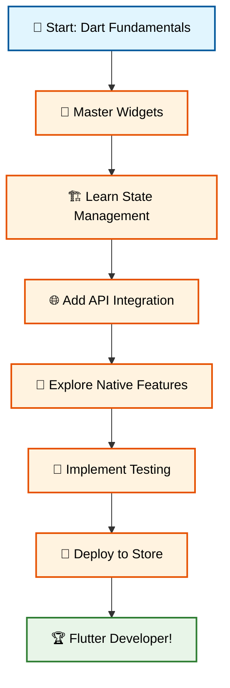

# 📚 Silabus Mata Kuliah: Pemrograman Piranti Bergerak dengan Flutter

---

## 📖 Informasi Umum

| **Keterangan** | **Detail** |
|---|---|
| **Mata Kuliah** | Pemrograman Piranti Bergerak dengan Flutter |
| **Kode MK** | TIF-XXX |
| **SKS** | 3 SKS (2 Teori, 1 Praktikum) |
| **Semester** | V (Lima) |
| **Prasyarat** | Pemrograman Berorientasi Objek, Struktur Data |
| **Durasi** | 16 Minggu |

---

## 🎯 Deskripsi Mata Kuliah

Mata kuliah ini membekali mahasiswa dengan kemampuan mengembangkan aplikasi mobile cross-platform menggunakan framework Flutter dan bahasa pemrograman Dart. Mahasiswa akan mempelajari konsep fundamental pengembangan aplikasi mobile, membangun user interface yang responsif, mengelola state aplikasi, integrasi dengan API dan database, serta proses deployment ke app store.

---

## 🏆 Capaian Pembelajaran

Setelah menyelesaikan mata kuliah ini, mahasiswa diharapkan mampu:

1. **🎪 Menganalisis** perbedaan pendekatan pengembangan aplikasi mobile (native, hybrid, cross-platform)
2. **💻 Menguasai** bahasa pemrograman Dart dan konsep pemrograman berorientasi objek
3. **🎨 Membangun** antarmuka pengguna yang menarik dan responsif menggunakan Flutter widgets
4. **🏗️ Mengimplementasikan** arsitektur aplikasi yang baik dengan pattern state management
5. **🌐 Mengintegrasikan** aplikasi dengan API external dan database lokal
6. **📱 Mengakses** fitur native device seperti kamera, GPS, dan sensor
7. **🧪 Menerapkan** testing strategy untuk menjamin kualitas aplikasi
8. **🚀 Melakukan** deployment aplikasi ke Google Play Store dan Apple App Store

---

## 📋 Struktur Pembelajaran

### 📊 Overview Semester

```mermaid
gantt
    title Jadwal Pembelajaran 16 Minggu
    dateFormat  X
    axisFormat %s
    
    section Modul I - Fondasi
    Dart Basics           :1, 4
    
    section Modul II - UI
    Flutter Widgets       :5, 8
    
    section Modul III - State
    State Management      :9, 11
    
    section Modul IV - Data
    API & Native Features :12, 14
    
    section Modul V - Deploy
    Testing & Launch      :15, 16
```

---

## 📚 Modul Pembelajaran

### 🏗️ **Modul I: Fondasi Dart dan Pengembangan Aplikasi Bergerak** 
*Minggu 1-4*

**🎯 Tujuan:** Membangun fondasi yang kuat dalam bahasa Dart sebelum mempelajari Flutter

| **Minggu** | **Topik** | **Yang Akan Anda Pelajari** | **Praktikum** |
|---|---|---|---|
| **1** | 🌍 Ekosistem Mobile & Dart Basics | • Perbandingan Native vs Cross-platform • Setup environment Dart • Variable, tipe data, null safety | Personal Info Manager |
| **2** | 🔄 Control Flow & Functions | • If-else, loops, switch • Function parameters & return values • Collections (List, Set, Map) | Algoritma Problem Solving |
| **3** | 🎭 Object-Oriented Programming | • Classes, objects, inheritance • Encapsulation, polymorphism • Abstract classes, mixins | Banking System Model |
| **4** | ⚙️ Flutter Setup & First App | • Install Flutter SDK • Android Studio & emulator setup • Create & run first Flutter app | "Hello World" App |

### 🎨 **Modul II: Membangun Antarmuka Pengguna dengan Flutter**
*Minggu 5-8*

**🎯 Tujuan:** Menguasai cara membangun UI yang menarik dan responsif

| **Minggu** | **Topik** | **Yang Akan Anda Pelajari** | **Praktikum** |
|---|---|---|---|
| **5** | 🏗️ Flutter Widget Architecture | • StatelessWidget vs StatefulWidget • Widget tree concept • setState() untuk update UI | Interactive Counter App |
| **6** | 📱 Basic UI Widgets | • MaterialApp, Scaffold, AppBar • Text, Image, Icon, Container • Styling dan theming | Digital Business Card |
| **7** | 📐 Layout & Positioning | • Row, Column, Stack layouts • Alignment dan spacing • Responsive design principles | Social Media Post UI |
| **8** | 🎯 User Interaction | • TextField, Forms, validation • ListView dan ScrollView • Gesture detection | Todo List App |

### 🏛️ **Modul III: Arsitektur Aplikasi: Navigasi dan Manajemen State**
*Minggu 9-11*

**🎯 Tujuan:** Membangun aplikasi multi-screen dengan state management yang proper

| **Minggu** | **Topik** | **Yang Akan Anda Pelajari** | **Praktikum** |
|---|---|---|---|
| **9** | 🧭 Navigation & Routing | • Navigator.push/pop • Named routes • Passing data between screens | Master-Detail App |
| **10** | 📊 Provider State Management | • Limitations of setState • ChangeNotifier pattern • Consumer widgets | Todo App with Provider |
| **11** | 🎯 BLoC Pattern | • Business Logic Component • Cubit vs BLoC • Event-driven architecture | Weather App with BLoC |

### 🌐 **Modul IV: Bekerja dengan Data dan Fitur Native**
*Minggu 12-14*

**🎯 Tujuan:** Mengintegrasikan aplikasi dengan data external dan fitur device

| **Minggu** | **Topik** | **Yang Akan Anda Pelajari** | **Praktikum** |
|---|---|---|---|
| **12** | 🌐 Networking & APIs | • HTTP requests dengan Dart • JSON parsing • FutureBuilder widget | News Reader App |
| **13** | 💾 Local Data Storage | • SharedPreferences for settings • SQLite database operations • CRUD operations | Persistent Todo App |
| **14** | 📱 Native Device Features | • Camera & image picker • GPS location services • Permissions handling | Memory Mapper App |

### 🚀 **Modul V: Jaminan Kualitas dan Peluncuran**
*Minggu 15-16*

**🎯 Tujuan:** Memastikan aplikasi siap production dan dipublikasikan

| **Minggu** | **Topik** | **Yang Akan Anda Pelajari** | **Praktikum** |
|---|---|---|---|
| **15** | 🧪 Testing Strategies | • Unit testing untuk logic • Widget testing untuk UI • Integration testing | Testing Final Project |
| **16** | 📦 Build & Deployment | • App signing & certificates • Google Play Store submission • Apple App Store process | App Store Submission |

---

## 🎓 Sistem Penilaian

### 📊 Distribusi Nilai

| **Komponen** | **Bobot** | **Deskripsi** |
|---|---|---|
| **🧪 Praktikum Mingguan** | 30% | 14 praktikum @ 2.14% each |
| **📝 UTS (Ujian Tengah Semester)** | 25% | Teori + coding (Minggu 8) |
| **📱 Proyek Akhir** | 30% | Aplikasi Flutter lengkap |
| **📋 UAS (Ujian Akhir Semester)** | 15% | Teori + presentasi proyek |

### 🎯 Proyek Akhir

**Requirement Proyek:**
- ✅ Aplikasi Flutter original dengan minimum 5 screens
- ✅ Implementasi state management (Provider/BLoC)
- ✅ Integrasi dengan API external
- ✅ Local storage untuk data persistence
- ✅ Minimal 1 native device feature
- ✅ Unit tests dan widget tests
- ✅ Publikasi di Google Play Store (internal testing)

**Contoh Ide Proyek:**
- 🛒 E-commerce app dengan cart & payment
- 📚 Learning management system
- 🏥 Health tracker dengan sensor integration
- 🎵 Music streaming app
- 📊 Personal finance manager
- 🍽️ Recipe sharing platform

---

## 📖 Referensi dan Resources

### 📚 Buku Wajib
1. **"Flutter Complete Reference"** - Alberto Miola (2022)
2. **"Beginning Flutter"** - Marco Napoli (2023)

### 📚 Buku Pendukung
3. **"Dart Apprentice"** - Jonathan Sande (2023)
4. **"Flutter Apprentice"** - raywenderlich.com Team (2023)

### 🌐 Online Resources
- **Flutter Documentation**: https://flutter.dev/docs
- **Dart Language Tour**: https://dart.dev/language
- **DartPad Online IDE**: https://dartpad.dev
- **Zapp.run Flutter Playground**: https://zapp.run
- **Flutter Community**: https://flutter.dev/community

### 🎥 Video Learning
- **Flutter Widget of the Week**: Official Flutter YouTube
- **The Net Ninja Flutter Tutorial**: Complete series
- **Code with Andrea**: Advanced Flutter concepts

---

## 🛠️ Tools & Software Requirements

### 💻 Development Environment
- **OS**: Windows 10/11, macOS, atau Linux
- **RAM**: Minimum 8GB (16GB recommended)
- **Storage**: 20GB free space
- **Internet**: Stable connection untuk downloads

### 🔧 Software Stack
- **Flutter SDK**: Latest stable version
- **Dart SDK**: Included with Flutter
- **Android Studio**: For Android development
- **VS Code**: Alternative lightweight IDE
- **Git**: Version control
- **Chrome Browser**: For web debugging

### 📱 Testing Devices
- **Android Emulator**: API 28+ (required)
- **Physical Device**: Android/iOS (optional but recommended)

---

## 📋 Jadwal Milestone

### 🎯 Key Dates

| **Milestone** | **Deadline** | **Deliverable** |
|---|---|---|
| **Setup Complete** | Minggu 4 | Flutter environment working |
| **UI Mastery** | Minggu 8 | Mid-term exam |
| **State Management** | Minggu 11 | Provider/BLoC implementation |
| **Data Integration** | Minggu 14 | API + database integration |
| **Final Project** | Minggu 16 | Complete app + presentation |

---

## 💡 Tips Sukses

### 🚀 Untuk Mahasiswa
1. **📱 Practice Daily**: Code every day, even 30 minutes
2. **🤝 Join Community**: Flutter Indonesia, Stack Overflow
3. **🔧 Build Projects**: Don't just follow tutorials
4. **📚 Read Documentation**: Official docs are your best friend
5. **🐛 Debug Fearlessly**: Errors are learning opportunities
6. **📊 Plan Your Project Early**: Start thinking about final project from week 1

### 🎯 Learning Path Recommendation

---

## 🌟 Career Prospects

### 💼 Job Opportunities
Setelah menyelesaikan mata kuliah ini, Anda akan siap untuk posisi:

- **Mobile App Developer** - $45,000-$80,000/year
- **Flutter Developer** - $50,000-$95,000/year  
- **Cross-Platform Developer** - $55,000-$100,000/year
- **Mobile UI/UX Developer** - $40,000-$75,000/year
- **Freelance Mobile Developer** - $25-$100/hour

### 🚀 Industry Growth
- 📈 **+170%** Flutter job growth (2023-2024)
- 🌍 **2M+** developers using Flutter worldwide
- 📱 **42%** market share in cross-platform development
- 🏢 Used by **Google, BMW, Toyota, Alibaba**

---

## 📞 Kontak & Support

### 👨‍🏫 Pengajar
- **Email**: antonprafanto@unmul.ac.id
- **Office Hours**: 8 AM - 16 PM (WITA)
- **Ruang**: -

### 💬 Komunikasi Kelas
- **WhatsApp**: +62 811 55 33 93
- **Discord Server**: -
- **GitHub Classroom**: -
- **Telegram**: https://t.me/kodingindonesia

### 🆘 Technical Support
- **Flutter Issues**: https://github.com/flutter/flutter/issues
- **Stack Overflow**: Tag your questions with `flutter` and `dart`
- **Flutter Community**: https://flutter.dev/community

---

## 🎉 Selamat Datang!

Selamat bergabung dalam perjalanan menarik menguasai Flutter! Dalam 16 minggu ke depan, Anda akan:

- 🎯 **Minggu 1-4**: Menguasai Dart dan setup environment
- 🎨 **Minggu 5-8**: Membangun UI yang menakjubkan
- 🏗️ **Minggu 9-11**: Mengatur arsitektur aplikasi yang solid
- 🌐 **Minggu 12-14**: Mengintegrasikan data dan fitur native
- 🚀 **Minggu 15-16**: Meluncurkan aplikasi ke dunia!

**Mari kita mulai perjalanan menjadi Flutter Developer yang handal!** 🚀

---

*📅 Silabus ini dapat berubah sesuai dengan perkembangan teknologi dan kebutuhan industri. Update terbaru akan diinformasikan melalui channel komunikasi kelas.*
