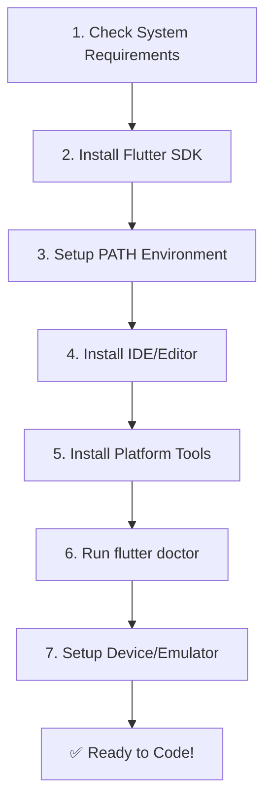

# ⚙️ Chapter 2: Persiapan Environment

[](../README.md)
[](../README.md)
[](../README.md)

> 🎯 **Learning Objectives**: Setelah chapter ini, Anda akan memiliki Flutter development environment yang lengkap dan siap untuk membuat aplikasi Flutter pertama.

## 📋 Daftar Isi
- [Overview Setup Process](#-overview-setup-process)
- [System Requirements](#-system-requirements)
- [Platform-Specific Setup](#-platform-specific-setup)
  - [Windows Setup](#-windows-setup)
  - [macOS Setup](#-macos-setup)
  - [Linux Setup](#-linux-setup)
- [Verifikasi Instalasi](#-verifikasi-instalasi)
- [IDE Setup](#-ide-setup)
- [Troubleshooting Common Issues](#-troubleshooting-common-issues)
- [Next Steps](#-next-steps)

---

## 🗺️ Overview Setup Process



### ⏱️ **Time Estimates by Platform**
- **Windows**: 2-3 hours (first time)
- **macOS**: 1.5-2 hours
- **Linux**: 2-2.5 hours

### 📦 **What We'll Install**
- ✅ Flutter SDK
- ✅ Dart SDK (included dengan Flutter)
- ✅ IDE (Android Studio atau VS Code)
- ✅ Android SDK & Tools
- ✅ Emulator atau device setup

---

## 💻 System Requirements

### 🪟 **Windows**
- **OS**: Windows 10 (64-bit) atau yang lebih baru
- **Disk Space**: 2.8 GB (tidak termasuk IDE)
- **Tools**: Git, PowerShell 5.0+
- **RAM**: Minimum 8 GB (recommended 16 GB)

### 🍎 **macOS**
- **OS**: macOS 10.14 (Mojave) atau yang lebih baru
- **Disk Space**: 2.8 GB (tidak termasuk IDE/Xcode)
- **Tools**: Git, Xcode command line tools
- **RAM**: Minimum 8 GB (recommended 16 GB)

### 🐧 **Linux**
- **OS**: Ubuntu 18.04+ atau equivalent
- **Disk Space**: 600 MB (tidak termasuk IDE)
- **Tools**: Git, curl, unzip, file
- **RAM**: Minimum 8 GB (recommended 16 GB)

### ⚠️ **Important Notes**
- **Internet connection** diperlukan untuk download
- **Administrator/sudo privileges** untuk instalasi
- **Antivirus** bisa interfere dengan build process

---

## 🚀 Platform-Specific Setup

## 🪟 Windows Setup

### Step 1: Download Flutter SDK

1. **Download Flutter SDK**
   ```bash
   # Visit: https://docs.flutter.dev/get-started/install/windows
   # Download latest stable release
   ```

2. **Extract ke folder yang tepat**
   ```bash
   # Recommended location:
   C:\flutter\

   # JANGAN extract ke folder dengan:
   # - Spaces dalam path
   # - Characters khusus
   # - Program Files (butuh admin rights)
   ```

### Step 2: Setup Environment Variables

1. **Buka System Environment Variables**
   ```bash
   # Method 1: Search "Environment Variables" di Start Menu
   # Method 2: Run -> sysdm.cpl -> Advanced -> Environment Variables
   ```

2. **Tambah Flutter ke PATH**
   ```bash
   # Add to PATH:
   C:\flutter\bin

   # Cara cek di Command Prompt:
   echo %PATH%
   ```

3. **Verifikasi PATH setup**
   ```bash
   # Buka Command Prompt baru
   flutter --version

   # Should show Flutter version info
   ```

### Step 3: Install Git (jika belum ada)

```bash
# Download dari: https://git-scm.com/download/win
# Install dengan default settings
# Verifikasi:
git --version
```

### Step 4: Run Flutter Doctor

```bash
# Check apa yang masih kurang
flutter doctor

# Expected output:
[✓] Flutter (Channel stable, 3.x.x)
[!] Android toolchain - develop for Android devices
[!] Chrome - develop for the web
[!] Visual Studio - develop for Windows
[!] Android Studio (not installed)
[!] VS Code (version x.x)
[!] Connected device (0 available)
```

### Step 5: Install Android Studio

1. **Download Android Studio**
   ```bash
   # URL: https://developer.android.com/studio
   # Download latest stable version
   ```

2. **Install dengan Flutter plugin**
   ```bash
   # During installation:
   # 1. Install Android SDK
   # 2. Install Android Virtual Device (AVD)
   # 3. Accept Android licenses
   ```

3. **Install Flutter dan Dart plugins**
   ```bash
   # In Android Studio:
   # File → Settings → Plugins
   # Search "Flutter" → Install
   # Search "Dart" → Install (usually auto-installed)
   # Restart Android Studio
   ```

### Step 6: Accept Android Licenses

```bash
# Accept semua Android SDK licenses
flutter doctor --android-licenses

# Type 'y' untuk accept all licenses
```

---

## 🍎 macOS Setup

### Step 1: Install Xcode

```bash
# Option 1: App Store
# Search "Xcode" → Install (akan lama, 10+ GB)

# Option 2: Command Line Tools only (lighter)
xcode-select --install
```

### Step 2: Download Flutter SDK

```bash
# Download dari: https://docs.flutter.dev/get-started/install/macos
# Extract ke home directory
cd ~/
unzip ~/Downloads/flutter_macos_*.zip
```

### Step 3: Setup PATH

```bash
# Add to shell profile (.zshrc for zsh, .bash_profile for bash)
echo 'export PATH="$PATH:$HOME/flutter/bin"' >> ~/.zshrc

# Reload shell
source ~/.zshrc

# Verifikasi
flutter --version
```

### Step 4: Install CocoaPods (untuk iOS development)

```bash
# Install CocoaPods
sudo gem install cocoapods

# Setup
pod setup
```

### Step 5: Run Flutter Doctor

```bash
flutter doctor

# For iOS development, also run:
flutter doctor --verbose
```

---

## 🐧 Linux Setup

### Step 1: Install Dependencies

```bash
# Ubuntu/Debian
sudo apt update
sudo apt install -y curl git unzip xz-utils zip libglu1-mesa

# CentOS/RHEL
sudo yum install -y curl git unzip xz zip mesa-libGLU

# Arch Linux
sudo pacman -S curl git unzip xz zip mesa
```

### Step 2: Download Flutter SDK

```bash
# Download dan extract
cd ~/
wget https://storage.googleapis.com/flutter_infra_release/releases/stable/linux/flutter_linux_*-stable.tar.xz
tar xf flutter_linux_*-stable.tar.xz
```

### Step 3: Setup PATH

```bash
# Add to ~/.bashrc atau ~/.zshrc
echo 'export PATH="$PATH:$HOME/flutter/bin"' >> ~/.bashrc

# Reload
source ~/.bashrc

# Verifikasi
flutter --version
```

### Step 4: Install Android Studio

```bash
# Download dari: https://developer.android.com/studio
# Extract dan install
sudo tar -xzf android-studio-*.tar.gz -C /opt/
/opt/android-studio/bin/studio.sh
```

---

## ✅ Verifikasi Instalasi

### 🩺 Flutter Doctor Check

```bash
# Run comprehensive check
flutter doctor -v

# Target output:
[✓] Flutter (Channel stable, 3.x.x, on [OS])
[✓] Android toolchain - develop for Android devices (Android SDK version x.x)
[✓] Xcode - develop for iOS and macOS (Xcode x.x) # macOS only
[✓] Chrome - develop for the web
[✓] Android Studio (version x.x)
[✓] VS Code (version x.x)
[✓] Connected device (2 available) # emulator + chrome
```

### 🔧 Common Issues & Solutions

| Issue | Solution |
|-------|----------|
| `flutter` command not found | Add Flutter bin to PATH |
| Android licenses not accepted | Run `flutter doctor --android-licenses` |
| No devices available | Start emulator atau connect physical device |
| Xcode not found (macOS) | Install Xcode dari App Store |
| cmdline-tools not found | Install Android SDK Command-line Tools |

### 🎯 **Quick Test**

```bash
# Create test project
flutter create test_app
cd test_app

# Run on available device
flutter run

# Should open app dengan counter demo
```

---

## 🛠️ IDE Setup

## 📱 Android Studio (Recommended)

### Advantages
- ✅ **Full Android development** support
- ✅ **Built-in emulator** management
- ✅ **Advanced debugging** tools
- ✅ **Flutter Inspector** built-in
- ✅ **Hot Reload** visual feedback

### Setup Steps
```bash
# 1. Install Flutter & Dart plugins
# File → Settings → Plugins → Browse Repositories
# Search: "Flutter" → Install

# 2. Configure Flutter SDK path
# File → Settings → Languages & Frameworks → Flutter
# Set Flutter SDK path: /path/to/flutter

# 3. Create new Flutter project
# File → New → New Flutter Project
```

## 💻 VS Code (Lightweight Alternative)

### Advantages
- ✅ **Lightweight** dan fast startup
- ✅ **Great extensions** ecosystem
- ✅ **Integrated terminal**
- ✅ **Git integration**
- ✅ **Multi-language** support

### Required Extensions
```bash
# Install extensions:
# 1. Flutter (by Dart Code)
# 2. Dart (by Dart Code)
# 3. Flutter Widget Snippets
# 4. Awesome Flutter Snippets
```

### VS Code Configuration
```json
// .vscode/settings.json
{
  "dart.flutterSdkPath": "/path/to/flutter",
  "dart.debugExternalLibraries": false,
  "dart.debugSdkLibraries": false
}
```

---

## 📱 Device Setup

### 🤖 Android Emulator Setup

```bash
# Via Android Studio:
# Tools → AVD Manager → Create Virtual Device
# Recommended: Pixel 4 API 30 (Android 11)

# Via Command Line:
flutter emulators
flutter emulators --launch <emulator_id>
```

### 📱 Physical Device Setup

#### Android Device
```bash
# 1. Enable Developer Options
# Settings → About Phone → Tap "Build Number" 7 times

# 2. Enable USB Debugging
# Settings → Developer Options → USB Debugging ON

# 3. Connect via USB
# Check: flutter devices
```

#### iOS Device (macOS only)
```bash
# 1. Connect via USB
# 2. Trust computer when prompted
# 3. Open Xcode and register device
# 4. Check: flutter devices
```

---

## 🐛 Troubleshooting Common Issues

### 🚫 **Issue: "flutter: command not found"**

**Windows:**
```bash
# Check PATH variable
echo %PATH%

# Should contain: C:\flutter\bin
# If not, re-add to environment variables
```

**macOS/Linux:**
```bash
# Check PATH
echo $PATH

# Should contain: /path/to/flutter/bin
# If not, add to shell profile:
echo 'export PATH="$PATH:$HOME/flutter/bin"' >> ~/.zshrc
source ~/.zshrc
```

### 🚫 **Issue: Android License Problems**

```bash
# Accept all licenses
flutter doctor --android-licenses

# If still issues:
cd $ANDROID_HOME/tools/bin
./sdkmanager --licenses
```

### 🚫 **Issue: No Devices Available**

```bash
# Check connected devices
flutter devices

# Start emulator
flutter emulators --launch <emulator_name>

# Enable developer mode on physical device
# Settings → Developer Options → USB Debugging
```

### 🚫 **Issue: Build Failed**

```bash
# Clean and rebuild
flutter clean
flutter packages get
flutter run

# Update Flutter
flutter upgrade
```

### 🚫 **Issue: IDE Not Recognizing Flutter**

**Android Studio:**
```bash
# File → Settings → Languages & Frameworks → Flutter
# Set correct Flutter SDK path
# Restart IDE
```

**VS Code:**
```bash
# Ctrl+Shift+P → "Flutter: Change SDK"
# Select correct Flutter installation path
```

---

## 💪 Practice Exercises

### 🎯 **Exercise 1: Complete Flutter Installation**
**Objective:** Setup Flutter environment dari awal sampai akhir
**Task:**
1. Download Flutter SDK untuk OS kamu
2. Extract dan setup PATH environment variable
3. Jalankan `flutter doctor` dan screenshot hasilnya
4. Resolve semua issues yang muncul (minimal 2 ✓ harus green)
5. Post screenshot hasil `flutter doctor` di [discussions](../../discussions)

### 🎯 **Exercise 2: IDE Configuration Challenge**
**Objective:** Setup development environment yang optimal
**Task:**
1. Install Flutter extension/plugin di IDE pilihan kamu
2. Buat test project: `flutter create test_app`
3. Buka project di IDE dan jalankan dengan debug mode
4. Screenshot IDE dengan project terbuka dan Flutter tools active
5. Tulis mini review tentang IDE experience kamu

### 🎯 **Exercise 3: Device Connection Test**
**Objective:** Setup device testing (emulator atau physical)
**Task:**
1. Setup minimal 1 device untuk testing (emulator/physical)
2. Jalankan `flutter devices` dan confirm device terdeteksi
3. Deploy default Flutter app ke device tersebut
4. Record screen demo aplikasi berjalan di device
5. Share video demo di [discussions](../../discussions)

---

---

## 🎯 Performance Optimization

### 🚀 **Speed Up Build Times**

```bash
# Enable Gradle daemon
echo "org.gradle.daemon=true" >> ~/.gradle/gradle.properties

# Increase Gradle memory
echo "org.gradle.jvmargs=-Xmx4g -XX:MaxPermSize=512m" >> ~/.gradle/gradle.properties

# Use parallel builds
echo "org.gradle.parallel=true" >> ~/.gradle/gradle.properties
```

### 🔧 **Optimize IDE Performance**

**Android Studio:**
```bash
# Increase heap size
# Help → Edit Custom VM Options
# Add:
-Xms2g
-Xmx8g
```

**VS Code:**
```json
// settings.json
{
  "dart.previewLsp": true,
  "dart.analysisServerFolding": true,
  "dart.closingLabels": true
}
```

---

## ✅ Environment Setup Checklist

### 📋 **Pre-Development Checklist**
- [ ] ✅ Flutter SDK installed dan di PATH
- [ ] ✅ `flutter doctor` shows all green checks
- [ ] ✅ IDE dengan Flutter plugin installed
- [ ] ✅ Android SDK dan tools setup
- [ ] ✅ Emulator atau physical device ready
- [ ] ✅ Git configured for version control

### 🧪 **Test Your Setup**

```bash
# 1. Check Flutter installation
flutter --version
flutter doctor -v

# 2. Check available devices
flutter devices

# 3. Create dan run test app
flutter create hello_flutter
cd hello_flutter
flutter run

# Should see: Counter app running on device
```

### 🎯 **Success Criteria**
- ✅ App launches successfully
- ✅ Hot reload works when you make changes
- ✅ No error messages in console
- ✅ Flutter Inspector accessible (Android Studio)

---

## 🚀 Next Steps

Congratulations! Environment setup selesai. Sekarang Anda siap untuk:

### 🎯 **Immediate Next Steps**
1. **Test Hot Reload** - Edit `lib/main.dart` dan save
2. **Explore Flutter Inspector** - Analyze widget tree
3. **Try different devices** - Test responsive design

### 📚 **What's Coming Next**
- **Chapter 3**: Dart Fundamentals - Language basics for Flutter
- **Chapter 4**: Flutter Concepts - Widget tree, state, lifecycle
- **Chapter 5**: First Project - Build real app step-by-step

### 🛡️ **Backup Your Setup**
```bash
# Document your setup for team members
flutter doctor -v > flutter_setup_log.txt

# Save IDE settings
# Export Android Studio settings: File → Export Settings
# Backup VS Code settings: .vscode/settings.json
```

---

## 📚 Additional Resources

### 🔗 **Official Documentation**
- [Flutter Installation Guide](https://docs.flutter.dev/get-started/install)
- [Flutter Doctor](https://docs.flutter.dev/reference/flutter-cli#flutter-doctor)
- [IDE Setup](https://docs.flutter.dev/get-started/editor)

### 🎥 **Video Guides**
- [Flutter Installation - Windows](https://www.youtube.com/watch?v=VFDbZk2xhO4)
- [Flutter Installation - macOS](https://www.youtube.com/watch?v=hL7pkX1Pfko)
- [Android Studio Setup](https://www.youtube.com/watch?v=BWoFVFLI9wA)

### 🆘 **Community Help**
- [Flutter Indonesia Telegram](https://t.me/flutter_id)
- [Stack Overflow - Flutter Tag](https://stackoverflow.com/questions/tagged/flutter)
- [Flutter GitHub Issues](https://github.com/flutter/flutter/issues)

---

<div align="center">

### 🎯 **Achievement Unlocked!**


**🔧 Environment Master** - Successfully Setup Development Environment

---

**Ready to learn Dart fundamentals?**

[⬅️ Previous: Pendahuluan](01-pendahuluan.md) | [➡️ Next: Dart Fundamentals](03-dart-fundamentals.md)

---

**💬 Setup Issues?** Check [troubleshooting](#-troubleshooting-common-issues) atau open an [issue](../../issues)

</div>