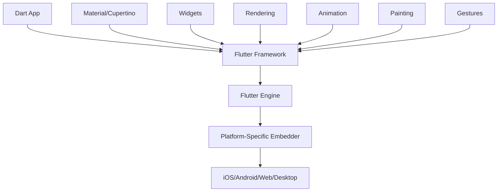

# 🧩 Chapter 4: Konsep Dasar Flutter

[](../README.md)
[](../README.md)
[](../README.md)

> 🎯 **Learning Objectives**: Setelah chapter ini, Anda akan memahami fundamental concepts Flutter seperti Widget Tree, lifecycle, dan cara kerja Hot Reload yang membuat Flutter sangat powerful.

## 📋 Daftar Isi
- [Arsitektur Flutter](#-arsitektur-flutter)
- [Widget Tree Concepts](#-widget-tree-concepts)
- [Stateless vs Stateful Widgets](#-stateless-vs-stateful-widgets)
- [Widget Lifecycle](#-widget-lifecycle)
- [Hot Reload Magic](#-hot-reload-magic)
- [Build Context & BuildContext](#-build-context--buildcontext)
- [State Management Basics](#-state-management-basics)
- [Hands-on Practice](#-hands-on-practice)
- [Performance Considerations](#-performance-considerations)

---

## 🏗️ Arsitektur Flutter

### 🎯 **Flutter Architecture Overview**



### 🔄 **Three Trees Concept**

Flutter menggunakan tiga tree structure yang bekerja sama:

```dart
// 1. WIDGET TREE (Description/Blueprint)
class MyApp extends StatelessWidget {
  @override
  Widget build(BuildContext context) {
    return MaterialApp(           // Widget
      home: Scaffold(             // Widget
        appBar: AppBar(           // Widget
          title: Text('Hello'),   // Widget
        ),
        body: Center(             // Widget
          child: Text('World'),   // Widget
        ),
      ),
    );
  }
}

// 2. ELEMENT TREE (Instantiation/Lifecycle)
// Created automatically by Flutter
// Manages widget lifecycle and state

// 3. RENDER TREE (Actual Rendering)
// Handles layout, painting, and hit testing
// Optimized for performance
```

### 🎨 **How Flutter Renders UI**

```
1. Widget Tree (Immutable) → Describes what UI should look like
2. Element Tree (Mutable) → Manages widget instances and state
3. Render Tree (Mutable) → Handles actual rendering and layout

Developer writes → Widget Tree
Flutter creates → Element Tree → Render Tree → Screen
```

---

## 🌳 Widget Tree Concepts

### 🧩 **Everything is a Widget**

Dalam Flutter, SEMUA adalah widget:

```dart
// Layout widgets
Container()    // Box with decoration, padding, margin
Row()         // Horizontal layout
Column()      // Vertical layout
Stack()       // Overlapping widgets

// UI widgets
Text()        // Display text
Image()       // Display images
Icon()        // Display icons
Button()      // Interactive buttons

// Structural widgets
MaterialApp() // App structure
Scaffold()    // Page structure
AppBar()      // Top bar

// Even invisible things are widgets!
Padding()     // Adds padding
Center()      // Centers child
SizedBox()    // Fixed size box
```

### 🔗 **Parent-Child Relationships**

```dart
// Widget hierarchy example
MaterialApp(                    // Root widget
  home: Scaffold(               // Page structure
    appBar: AppBar(             // Top bar
      title: Text('My App'),    // Title text
    ),
    body: Center(               // Center widget
      child: Column(            // Vertical layout
        children: [             // List of children
          Text('Hello'),        // First child
          Text('World'),        // Second child
          ElevatedButton(       // Third child
            onPressed: () {},   // Button callback
            child: Text('Tap'), // Button label
          ),
        ],
      ),
    ),
  ),
)
```

### 📊 **Widget Tree Visualization**

```
MaterialApp
└── Scaffold
    ├── AppBar
    │   └── Text("My App")
    └── Center
        └── Column
            ├── Text("Hello")
            ├── Text("World")
            └── ElevatedButton
                └── Text("Tap")
```

---

## 🔄 Stateless vs Stateful Widgets

### 🗿 **StatelessWidget - Immutable UI**

StatelessWidget adalah widget yang **tidak berubah** setelah dibuat:

```dart
class WelcomeMessage extends StatelessWidget {
  final String name;
  final String message;

  const WelcomeMessage({
    Key? key,
    required this.name,
    required this.message,
  }) : super(key: key);

  @override
  Widget build(BuildContext context) {
    return Container(
      padding: EdgeInsets.all(16),
      child: Column(
        children: [
          Text(
            'Welcome, $name!',
            style: TextStyle(fontSize: 24, fontWeight: FontWeight.bold),
          ),
          SizedBox(height: 8),
          Text(
            message,
            style: TextStyle(fontSize: 16),
          ),
        ],
      ),
    );
  }
}

// Usage
WelcomeMessage(
  name: 'John',
  message: 'Hope you enjoy learning Flutter!',
)
```

### ⚡ **StatefulWidget - Dynamic UI**

StatefulWidget adalah widget yang **bisa berubah** berdasarkan user interaction atau data changes:

```dart
class CounterWidget extends StatefulWidget {
  final int initialValue;

  const CounterWidget({Key? key, this.initialValue = 0}) : super(key: key);

  @override
  _CounterWidgetState createState() => _CounterWidgetState();
}

class _CounterWidgetState extends State<CounterWidget> {
  late int _counter;

  @override
  void initState() {
    super.initState();
    _counter = widget.initialValue; // Initialize with widget property
  }

  void _incrementCounter() {
    setState(() {           // Tell Flutter to rebuild
      _counter++;
    });
  }

  void _decrementCounter() {
    setState(() {
      _counter--;
    });
  }

  @override
  Widget build(BuildContext context) {
    return Container(
      padding: EdgeInsets.all(20),
      child: Column(
        mainAxisSize: MainAxisSize.min,
        children: [
          Text(
            'Counter Value',
            style: TextStyle(fontSize: 18),
          ),
          SizedBox(height: 10),
          Text(
            '$_counter',
            style: TextStyle(
              fontSize: 48,
              fontWeight: FontWeight.bold,
              color: _counter >= 0 ? Colors.green : Colors.red,
            ),
          ),
          SizedBox(height: 20),
          Row(
            mainAxisAlignment: MainAxisAlignment.spaceEvenly,
            children: [
              ElevatedButton(
                onPressed: _decrementCounter,
                child: Text('-'),
              ),
              ElevatedButton(
                onPressed: _incrementCounter,
                child: Text('+'),
              ),
            ],
          ),
        ],
      ),
    );
  }
}
```

### 📊 **StatelessWidget vs StatefulWidget Comparison**

| Aspect | StatelessWidget | StatefulWidget |
|--------|----------------|----------------|
| **Mutability** | Immutable | Mutable |
| **Performance** | 🚀 Faster | ⚡ Slightly slower |
| **Use Case** | Static content | Dynamic content |
| **Rebuild** | Only when parent changes | Can trigger own rebuild |
| **State** | No internal state | Has internal state |
| **Examples** | Text, Icon, Image | Forms, Animations, Counters |

### 🎯 **When to Use Which?**

```dart
// Use StatelessWidget for:
- Text labels
- Icons
- Images
- Static layouts
- Pure functions (input → output)

// Use StatefulWidget for:
- Forms with user input
- Animations
- Counters or timers
- Data that changes over time
- User interactions (taps, swipes)
```

---

## 🔄 Widget Lifecycle

### 🗿 **StatelessWidget Lifecycle**

StatelessWidget memiliki lifecycle yang sangat sederhana:

```dart
class SimpleWidget extends StatelessWidget {
  @override
  Widget build(BuildContext context) {
    print('Building SimpleWidget'); // Called every time parent rebuilds
    return Text('Hello World');
  }
}

// Lifecycle:
// 1. Constructor called
// 2. build() called
// 3. Widget displayed
// 4. If parent rebuilds → build() called again
// 5. Widget disposed when removed from tree
```

### ⚡ **StatefulWidget Lifecycle**

StatefulWidget memiliki lifecycle yang lebih complex:

```dart
class LifecycleDemo extends StatefulWidget {
  @override
  _LifecycleDemoState createState() {
    print('1. createState() called');
    return _LifecycleDemoState();
  }
}

class _LifecycleDemoState extends State<LifecycleDemo> {
  @override
  void initState() {
    super.initState();
    print('2. initState() called - Initialize state here');
    // One-time initialization
    // Setup controllers, listeners, etc.
  }

  @override
  void didChangeDependencies() {
    super.didChangeDependencies();
    print('3. didChangeDependencies() called');
    // Called when dependencies change (theme, locale, etc.)
  }

  @override
  Widget build(BuildContext context) {
    print('4. build() called - Building UI');
    return Container(
      child: Text('Lifecycle Demo'),
    );
  }

  @override
  void didUpdateWidget(LifecycleDemo oldWidget) {
    super.didUpdateWidget(oldWidget);
    print('5. didUpdateWidget() called - Widget updated');
    // Called when widget configuration changes
  }

  @override
  void deactivate() {
    print('6. deactivate() called - Widget deactivated');
    super.deactivate();
  }

  @override
  void dispose() {
    print('7. dispose() called - Cleanup here');
    // Cleanup controllers, listeners, timers
    super.dispose();
  }
}
```

### 📊 **Lifecycle Flow Diagram**

```
StatefulWidget Created
        ↓
   createState()
        ↓
    initState()
        ↓
didChangeDependencies()
        ↓
      build()
        ↓
    Widget Active
        ↓
   setState() called? → build() (rebuild)
        ↓
   Widget updated? → didUpdateWidget() → build()
        ↓
   Widget removed?
        ↓
   deactivate()
        ↓
    dispose()
        ↓
   Widget Destroyed
```

### 💡 **Practical Lifecycle Usage**

```dart
class PracticalLifecycleExample extends StatefulWidget {
  @override
  _PracticalLifecycleExampleState createState() => _PracticalLifecycleExampleState();
}

class _PracticalLifecycleExampleState extends State<PracticalLifecycleExample> {
  late TextEditingController _controller;
  late Timer _timer;
  int _seconds = 0;

  @override
  void initState() {
    super.initState();
    // Initialize controllers and start timer
    _controller = TextEditingController();
    _timer = Timer.periodic(Duration(seconds: 1), (timer) {
      setState(() {
        _seconds++;
      });
    });
  }

  @override
  void dispose() {
    // IMPORTANT: Always cleanup to prevent memory leaks
    _controller.dispose();
    _timer.cancel();
    super.dispose();
  }

  @override
  Widget build(BuildContext context) {
    return Column(
      children: [
        Text('Seconds: $_seconds'),
        TextField(
          controller: _controller,
          decoration: InputDecoration(labelText: 'Enter text'),
        ),
      ],
    );
  }
}
```

---

## 🔥 Hot Reload Magic

### ⚡ **What is Hot Reload?**

Hot Reload adalah fitur Flutter yang memungkinkan Anda melihat perubahan code **instantly** tanpa kehilangan state aplikasi:

```dart
class HotReloadDemo extends StatefulWidget {
  @override
  _HotReloadDemoState createState() => _HotReloadDemoState();
}

class _HotReloadDemoState extends State<HotReloadDemo> {
  int _counter = 0;

  @override
  Widget build(BuildContext context) {
    return Scaffold(
      appBar: AppBar(
        title: Text('Hot Reload Demo'), // Change this text and save!
      ),
      body: Center(
        child: Column(
          children: [
            Text('You clicked the button $_counter times'),
            // Add new widgets here and see them appear instantly!
            ElevatedButton(
              onPressed: () => setState(() => _counter++),
              child: Text('Increment'),
            ),
          ],
        ),
      ),
    );
  }
}
```

### 🔄 **Hot Reload vs Hot Restart vs Full Restart**

| Action | Keybinding | What Happens | State Preserved? | Speed |
|--------|------------|--------------|------------------|-------|
| **Hot Reload** | `r` atau `Ctrl+S` | Updates code, preserves state | ✅ Yes | ⚡ ~1 second |
| **Hot Restart** | `Shift+R` | Restarts app, loses state | ❌ No | 🔄 ~3 seconds |
| **Full Restart** | `Ctrl+F5` | Full rebuild | ❌ No | 🐌 ~10+ seconds |

### 🛠️ **When Hot Reload Works**

Hot Reload works for:
```dart
// ✅ Changing widget properties
Text('Old Text') → Text('New Text')

// ✅ Adding/removing widgets
Column(children: [Text('A')]) → Column(children: [Text('A'), Text('B')])

// ✅ Changing colors/styles
color: Colors.blue → color: Colors.red

// ✅ Updating functions
onPressed: () => print('Old') → onPressed: () => print('New')
```

### ⚠️ **When Hot Reload Doesn't Work**

Hot Restart required for:
```dart
// ❌ Changing main() function
void main() {
  runApp(MyApp());
}

// ❌ Adding new imports
import 'package:new_package/new_package.dart';

// ❌ Changing initState()
@override
void initState() {
  // Changes here need hot restart
}

// ❌ Global variables
final String globalVar = 'New Value';

// ❌ Changing widget types
StatelessWidget → StatefulWidget
```

### 💡 **Hot Reload Best Practices**

```dart
// 1. Structure code for hot reload
class MyWidget extends StatelessWidget {
  @override
  Widget build(BuildContext context) {
    return _buildMainContent(); // Extract to methods
  }

  Widget _buildMainContent() {
    // Easy to modify this method and hot reload
    return Container(
      // Your UI here
    );
  }
}

// 2. Use const constructors when possible
const Text('Hello') // More efficient hot reload

// 3. Avoid complex logic in build methods
@override
Widget build(BuildContext context) {
  // ❌ Don't do heavy computation here
  // ✅ Do it in initState() or separate methods
  return MyWidget();
}
```

---

## 📍 Build Context & BuildContext

### 🗺️ **What is BuildContext?**

BuildContext adalah "location" dari widget dalam widget tree:

```dart
class ContextDemo extends StatelessWidget {
  @override
  Widget build(BuildContext context) {
    // context tells us WHERE this widget is in the tree

    // Access theme
    ThemeData theme = Theme.of(context);

    // Access media query (screen size, etc.)
    MediaQueryData mediaQuery = MediaQuery.of(context);

    // Access navigator (for routing)
    NavigatorState navigator = Navigator.of(context);

    return Container(
      color: theme.primaryColor,
      width: mediaQuery.size.width * 0.8,
      child: Text('Using Context'),
    );
  }
}
```

### 🔍 **Context Methods & Properties**

```dart
class ContextMethods extends StatelessWidget {
  @override
  Widget build(BuildContext context) {
    return Column(
      children: [
        // Theme access
        Container(
          color: Theme.of(context).primaryColor,
          child: Text(
            'Themed Container',
            style: Theme.of(context).textTheme.headline6,
          ),
        ),

        // Screen dimensions
        Container(
          width: MediaQuery.of(context).size.width,
          height: MediaQuery.of(context).size.height * 0.1,
          child: Text('Full width, 10% height'),
        ),

        // Navigation
        ElevatedButton(
          onPressed: () {
            Navigator.of(context).pushNamed('/next-page');
          },
          child: Text('Navigate'),
        ),

        // Show snackbar
        ElevatedButton(
          onPressed: () {
            ScaffoldMessenger.of(context).showSnackBar(
              SnackBar(content: Text('Hello from SnackBar!')),
            );
          },
          child: Text('Show SnackBar'),
        ),
      ],
    );
  }
}
```

### ⚠️ **Context Gotchas**

```dart
class ContextGotchas extends StatefulWidget {
  @override
  _ContextGotchasState createState() => _ContextGotchasState();
}

class _ContextGotchasState extends State<ContextGotchas> {
  @override
  Widget build(BuildContext context) {
    return Scaffold(
      appBar: AppBar(title: Text('Context Issues')),
      body: Column(
        children: [
          // ❌ Problem: Using context in async callback
          ElevatedButton(
            onPressed: () async {
              await Future.delayed(Duration(seconds: 2));
              // This might fail if widget is disposed
              // Navigator.of(context).pop(); // DON'T DO THIS

              // ✅ Solution: Check if mounted
              if (mounted) {
                Navigator.of(context).pop();
              }
            },
            child: Text('Async Navigation'),
          ),

          // ❌ Problem: Using wrong context for Scaffold
          Builder(
            builder: (BuildContext context) {
              return ElevatedButton(
                onPressed: () {
                  // This context has access to Scaffold
                  ScaffoldMessenger.of(context).showSnackBar(
                    SnackBar(content: Text('Success!')),
                  );
                },
                child: Text('Show SnackBar'),
              );
            },
          ),
        ],
      ),
    );
  }
}
```

---

## 🔄 State Management Basics

### 📊 **State in Flutter**

State adalah data yang bisa berubah dan mempengaruhi UI:

```dart
class StateExample extends StatefulWidget {
  @override
  _StateExampleState createState() => _StateExampleState();
}

class _StateExampleState extends State<StateExample> {
  // These are STATE variables
  String _name = '';
  int _age = 0;
  bool _isStudent = false;
  List<String> _hobbies = [];

  void _updateName(String newName) {
    setState(() {                    // Tell Flutter to rebuild
      _name = newName;
    });
  }

  void _addHobby(String hobby) {
    setState(() {
      _hobbies.add(hobby);
    });
  }

  @override
  Widget build(BuildContext context) {
    return Column(
      children: [
        Text('Name: $_name'),         // UI reflects state
        Text('Age: $_age'),
        Text('Hobbies: ${_hobbies.join(', ')}'),

        TextField(
          onChanged: _updateName,     // Update state on input
          decoration: InputDecoration(labelText: 'Enter name'),
        ),

        ElevatedButton(
          onPressed: () => _addHobby('Reading'),
          child: Text('Add Reading Hobby'),
        ),
      ],
    );
  }
}
```

### 🔄 **setState() Best Practices**

```dart
class SetStateDemo extends StatefulWidget {
  @override
  _SetStateDemoState createState() => _SetStateDemoState();
}

class _SetStateDemoState extends State<SetStateDemo> {
  int _counter = 0;
  List<String> _items = [];

  // ✅ Good: Minimal setState
  void _increment() {
    setState(() {
      _counter++;               // Only change what's necessary
    });
  }

  // ❌ Bad: Heavy computation in setState
  void _badUpdate() {
    setState(() {
      _counter++;
      // Don't do heavy work here!
      for (int i = 0; i < 1000000; i++) {
        // This blocks the UI
      }
    });
  }

  // ✅ Good: Do heavy work outside setState
  void _goodUpdate() {
    // Do heavy computation first
    List<String> newItems = [];
    for (int i = 0; i < 1000; i++) {
      newItems.add('Item $i');
    }

    // Then update state quickly
    setState(() {
      _items = newItems;
    });
  }

  // ✅ Good: Conditional setState
  void _conditionalUpdate(int newValue) {
    if (newValue != _counter) {    // Only setState if actually changed
      setState(() {
        _counter = newValue;
      });
    }
  }

  @override
  Widget build(BuildContext context) {
    return Column(
      children: [
        Text('Counter: $_counter'),
        Text('Items: ${_items.length}'),
        ElevatedButton(onPressed: _increment, child: Text('Increment')),
        ElevatedButton(onPressed: _goodUpdate, child: Text('Update Items')),
      ],
    );
  }
}
```

---

## 💪 Hands-on Practice

### 🎯 **Exercise 1: Build a Profile Card**

```dart
// TODO: Create a ProfileCard widget that shows user info
class ProfileCard extends StatelessWidget {
  final String name;
  final String email;
  final String avatarUrl;
  final int age;

  const ProfileCard({
    Key? key,
    required this.name,
    required this.email,
    required this.avatarUrl,
    required this.age,
  }) : super(key: key);

  @override
  Widget build(BuildContext context) {
    // TODO: Build a card layout showing:
    // 1. Avatar image (CircleAvatar)
    // 2. Name (large, bold text)
    // 3. Email (smaller text)
    // 4. Age with icon
    // 5. Card-like container with shadow

    return Container(); // Replace with your implementation
  }
}
```

### 🎯 **Exercise 2: Interactive Shopping Cart**

```dart
// TODO: Create a shopping cart widget with add/remove functionality
class ShoppingCart extends StatefulWidget {
  @override
  _ShoppingCartState createState() => _ShoppingCartState();
}

class _ShoppingCartState extends State<ShoppingCart> {
  Map<String, int> _items = {}; // item name -> quantity

  void _addItem(String itemName) {
    // TODO: Add item to cart or increase quantity
  }

  void _removeItem(String itemName) {
    // TODO: Remove item or decrease quantity
  }

  double _calculateTotal() {
    // TODO: Calculate total price (assume each item costs $10)
    return 0.0;
  }

  @override
  Widget build(BuildContext context) {
    // TODO: Build UI showing:
    // 1. List of items with quantities
    // 2. Add/Remove buttons for each item
    // 3. Total price
    // 4. Add new item button

    return Container(); // Replace with your implementation
  }
}
```

### 🎯 **Exercise 3: Theme Switcher**

```dart
// TODO: Create a widget that can switch between light and dark themes
class ThemeSwitcher extends StatefulWidget {
  @override
  _ThemeSwitcherState createState() => _ThemeSwitcherState();
}

class _ThemeSwitcherState extends State<ThemeSwitcher> {
  bool _isDarkMode = false;

  void _toggleTheme() {
    // TODO: Toggle between light and dark mode
  }

  @override
  Widget build(BuildContext context) {
    // TODO: Build UI that:
    // 1. Shows current theme mode
    // 2. Has toggle switch
    // 3. Changes appearance based on theme
    // 4. Uses Theme.of(context) appropriately

    return Container(); // Replace with your implementation
  }
}
```

### 🔍 **Solutions**

<details>
<summary>Click to see solutions</summary>

```dart
// Solution 1: ProfileCard
class ProfileCard extends StatelessWidget {
  final String name;
  final String email;
  final String avatarUrl;
  final int age;

  const ProfileCard({
    Key? key,
    required this.name,
    required this.email,
    required this.avatarUrl,
    required this.age,
  }) : super(key: key);

  @override
  Widget build(BuildContext context) {
    return Card(
      elevation: 4,
      margin: EdgeInsets.all(16),
      child: Padding(
        padding: EdgeInsets.all(16),
        child: Column(
          children: [
            CircleAvatar(
              radius: 40,
              backgroundImage: NetworkImage(avatarUrl),
            ),
            SizedBox(height: 16),
            Text(
              name,
              style: TextStyle(fontSize: 24, fontWeight: FontWeight.bold),
            ),
            SizedBox(height: 8),
            Text(
              email,
              style: TextStyle(fontSize: 16, color: Colors.grey[600]),
            ),
            SizedBox(height: 8),
            Row(
              mainAxisAlignment: MainAxisAlignment.center,
              children: [
                Icon(Icons.cake, color: Colors.orange),
                SizedBox(width: 8),
                Text('$age years old'),
              ],
            ),
          ],
        ),
      ),
    );
  }
}

// Solution 2: ShoppingCart
class _ShoppingCartState extends State<ShoppingCart> {
  Map<String, int> _items = {};
  final double _itemPrice = 10.0;

  void _addItem(String itemName) {
    setState(() {
      _items[itemName] = (_items[itemName] ?? 0) + 1;
    });
  }

  void _removeItem(String itemName) {
    setState(() {
      if (_items[itemName] != null) {
        if (_items[itemName]! > 1) {
          _items[itemName] = _items[itemName]! - 1;
        } else {
          _items.remove(itemName);
        }
      }
    });
  }

  double _calculateTotal() {
    return _items.values.fold(0.0, (sum, qty) => sum + (qty * _itemPrice));
  }

  @override
  Widget build(BuildContext context) {
    return Column(
      children: [
        Text('Shopping Cart', style: TextStyle(fontSize: 24, fontWeight: FontWeight.bold)),
        SizedBox(height: 16),
        Expanded(
          child: ListView(
            children: _items.entries.map((entry) {
              return ListTile(
                title: Text(entry.key),
                subtitle: Text('Quantity: ${entry.value}'),
                trailing: Row(
                  mainAxisSize: MainAxisSize.min,
                  children: [
                    IconButton(
                      icon: Icon(Icons.remove),
                      onPressed: () => _removeItem(entry.key),
                    ),
                    IconButton(
                      icon: Icon(Icons.add),
                      onPressed: () => _addItem(entry.key),
                    ),
                  ],
                ),
              );
            }).toList(),
          ),
        ),
        Padding(
          padding: EdgeInsets.all(16),
          child: Column(
            children: [
              Text('Total: \$${_calculateTotal().toStringAsFixed(2)}',
                   style: TextStyle(fontSize: 20, fontWeight: FontWeight.bold)),
              SizedBox(height: 16),
              ElevatedButton(
                onPressed: () => _addItem('New Item ${_items.length + 1}'),
                child: Text('Add New Item'),
              ),
            ],
          ),
        ),
      ],
    );
  }
}
```

</details>

---

## ⚡ Performance Considerations

### 🚀 **Widget Performance Tips**

```dart
// ✅ Use const constructors when possible
class PerformantWidget extends StatelessWidget {
  @override
  Widget build(BuildContext context) {
    return Column(
      children: [
        const Text('This is const'),           // Reused, not rebuilt
        Text('This is not const'),             // Rebuilt every time
        const Icon(Icons.star),                // Reused
        const SizedBox(height: 16),            // Reused
      ],
    );
  }
}

// ✅ Extract static widgets to avoid rebuilds
class OptimizedList extends StatefulWidget {
  @override
  _OptimizedListState createState() => _OptimizedListState();
}

class _OptimizedListState extends State<OptimizedList> {
  int _counter = 0;

  // Static widgets as class members
  static const Widget _staticHeader = Text(
    'This never rebuilds',
    style: TextStyle(fontSize: 24),
  );

  @override
  Widget build(BuildContext context) {
    return Column(
      children: [
        _staticHeader,                         // Never rebuilds
        Text('Counter: $_counter'),            // Only this rebuilds
        ElevatedButton(
          onPressed: () => setState(() => _counter++),
          child: const Text('Increment'),      // const child
        ),
      ],
    );
  }
}

// ✅ Use ListView.builder for large lists
class EfficientList extends StatelessWidget {
  final List<String> items = List.generate(10000, (i) => 'Item $i');

  @override
  Widget build(BuildContext context) {
    return ListView.builder(                  // Only builds visible items
      itemCount: items.length,
      itemBuilder: (context, index) {
        return ListTile(title: Text(items[index]));
      },
    );
  }
}
```

### 🔧 **State Management Performance**

```dart
// ✅ Minimize setState scope
class EfficientStateUpdate extends StatefulWidget {
  @override
  _EfficientStateUpdateState createState() => _EfficientStateUpdateState();
}

class _EfficientStateUpdateState extends State<EfficientStateUpdate> {
  int _counter = 0;
  String _status = 'Ready';

  void _updateCounter() {
    setState(() {
      _counter++;                            // Only rebuild what's necessary
    });
  }

  void _updateStatus(String newStatus) {
    setState(() {
      _status = newStatus;                   // Separate setState for separate concerns
    });
  }

  @override
  Widget build(BuildContext context) {
    return Column(
      children: [
        CounterDisplay(counter: _counter),   // Extract to separate widget
        StatusDisplay(status: _status),      // Extract to separate widget
        ElevatedButton(
          onPressed: _updateCounter,
          child: Text('Update Counter'),
        ),
      ],
    );
  }
}

// Separate widgets rebuild independently
class CounterDisplay extends StatelessWidget {
  final int counter;
  const CounterDisplay({Key? key, required this.counter}) : super(key: key);

  @override
  Widget build(BuildContext context) {
    print('CounterDisplay rebuilt');         // Debug rebuilds
    return Text('Counter: $counter');
  }
}
```

---

## 🎓 Chapter Summary

Congratulations! Anda telah menguasai konsep fundamental Flutter. Sekarang Anda memahami:

### ✅ **What You've Learned**
- **Flutter Architecture**: Three trees dan rendering pipeline
- **Widget Tree**: Parent-child relationships dan hierarchy
- **Widget Types**: StatelessWidget vs StatefulWidget
- **Lifecycle**: Widget creation, updates, dan destruction
- **Hot Reload**: Instant development feedback
- **BuildContext**: Access to theme, navigation, dan services
- **State Management**: setState() dan best practices

### 🎯 **Key Concepts**
- **Everything is a Widget** - UI, layout, structure
- **Immutable Widgets** - Widgets describe UI, don't store state
- **State drives UI** - UI rebuilds when state changes
- **Context is location** - Provides access to inherited data
- **Performance matters** - Use const, extract widgets, minimize rebuilds

### 🚀 **Ready for Real Development**
Dengan pemahaman fundamental yang solid, Anda siap untuk:
- Membuat project Flutter pertama
- Menggunakan widget library yang luas
- Mengelola state aplikasi dengan efektif
- Build responsive dan performant UIs

---

<div align="center">

### 🎯 **Achievement Unlocked!**


**🧩 Flutter Concepts Master** - Mastered Flutter Fundamentals

---

**Ready to build your first Flutter project?**

[⬅️ Previous: Dart Fundamentals](03-dart-fundamentals.md) | [➡️ Next: First Project](05-proyek-pertama.md)

---

**💬 Questions about Flutter concepts?** Check our [glossary](glossary.md) atau open an [issue](../../issues)

</div>