# 📱 Minggu 1: Pengenalan Ekosistem Aplikasi Bergerak dan Dasar-Dasar Dart


## 🎯 Tujuan Pembelajaran

Setelah menyelesaikan materi minggu ini, mahasiswa diharapkan dapat:

- 🎪 **Mengartikulasikan** perbedaan, kelebihan, dan kekurangan dari pengembangan aplikasi bergerak *native*, *hybrid*, dan *cross-platform*
- 🚀 **Menjelaskan** proposisi nilai Flutter dalam ekosistem aplikasi bergerak
- ⚙️ **Menyiapkan** lingkungan pengembangan Dart yang fungsional dan menulis program baris perintah dasar
- 📝 **Mendeklarasikan** variabel menggunakan inferensi tipe dan tipe eksplisit, serta memahami *sound null safety* pada Dart

---

## 📋 Outline Materi

1. [🎪 Pengenalan Mata Kuliah](#-pengenalan-mata-kuliah)
2. [🌍 Lanskap Pengembangan Aplikasi Bergerak](#-lanskap-pengembangan-aplikasi-bergerak)
3. [⚖️ Perbandingan Pendekatan Pengembangan](#️-perbandingan-pendekatan-pengembangan)
4. [🎯 Mengapa Flutter? Mengapa Dart?](#-mengapa-flutter-mengapa-dart)
5. [⚙️ Pengaturan Lingkungan Dart](#️-pengaturan-lingkungan-dart)
6. [🚀 Dasar-Dasar Dart](#-dasar-dasar-dart)
7. [📊 Variabel dan Tipe Data](#-variabel-dan-tipe-data)
8. [🛡️ Sound Null Safety](#️-sound-null-safety)
9. [💻 Praktikum 1](#-praktikum-1)

---

## 🎪 Pengenalan Mata Kuliah

### 📚 Overview Silabus

Mata kuliah **Pemrograman Piranti Bergerak menggunakan Flutter** dirancang untuk membekali mahasiswa dengan keterampilan pengembangan aplikasi mobile modern. Kurikulum ini mengikuti pendekatan pedagogis yang membedakan secara jelas antara pembelajaran bahasa pemrograman (Dart) dan framework (Flutter).

### 🎯 Filosofi Pembelajaran

> **"Memisahkan Bahasa dari Framework"**
> 
> Mahasiswa pemula sering mencampuradukkan konsep bahasa pemrograman dengan framework yang mereka gunakan. Approach ini mencegah kesalahpahaman dengan membangun fondasi Dart yang kuat sebelum mempelajari Flutter.

### 📈 Ekspektasi Karir

**Industry Statistics 2024-2025:**
- 📊 Flutter mencapai **42% market share** dalam cross-platform development
- 💰 Senior Flutter Developer: **$80,000 - $120,000** annually
- 🌐 **2 juta developer** menggunakan Flutter globally
- 📱 **170% increase** dalam Flutter job postings

---

## 🌍 Lanskap Pengembangan Aplikasi Bergerak

### 📱 Statistik Mobile App Market

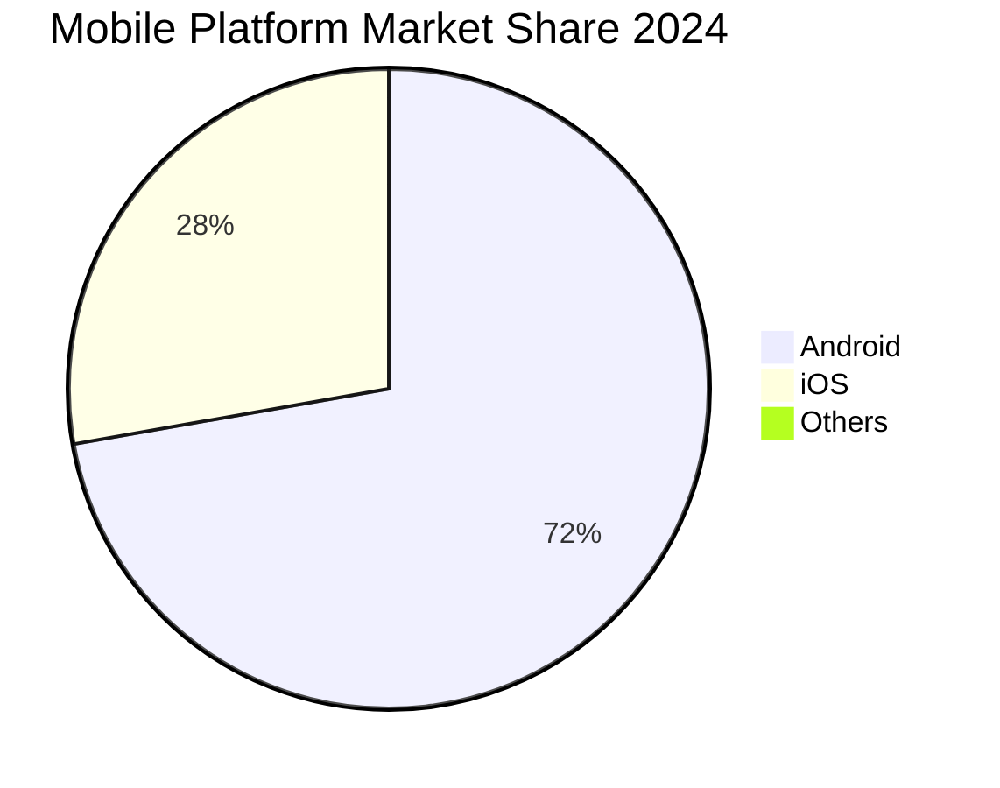

### 🔄 Development Lifecycle Overview

Proses pengembangan aplikasi mobile modern melibatkan beberapa tahap kritis:

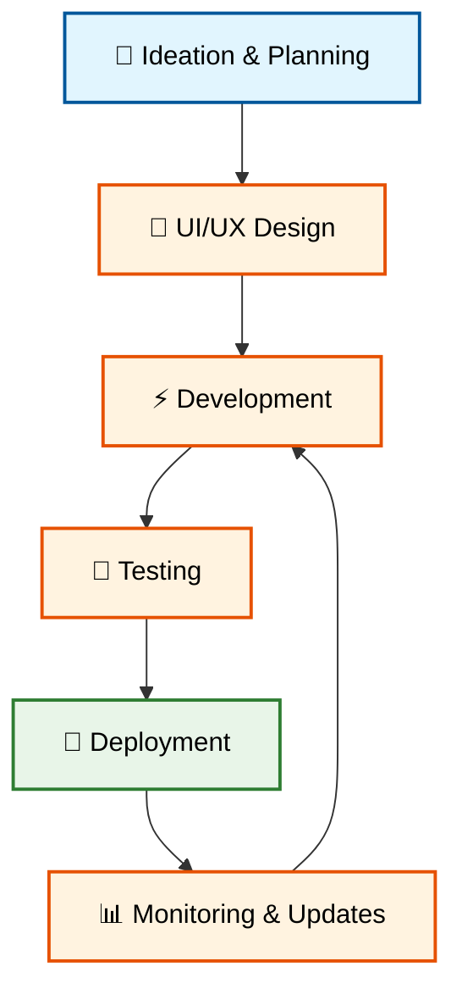

### 🎭 Frontend vs Backend

**Frontend (Client-side):**
- 👀 User Interface (UI)
- 🎯 User Experience (UX)
- 📱 Device-specific functionality
- 🎨 Visual presentation

**Backend (Server-side):**
- 🗄️ Database management
- 🔐 Authentication & security
- 📡 API services
- ☁️ Cloud infrastructure

---

## ⚖️ Perbandingan Pendekatan Pengembangan

### 📊 Comparison Matrix

| 🏷️ **Pendekatan** | 🔧 **Teknologi Inti** | ⚡ **Performa** | 🎨 **UI Fidelity** | 📦 **Basis Kode** | 💰 **Cost/Time** | 🌟 **Contoh** |
|---|---|---|---|---|---|---|
| **🏆 Native** | Swift/Kotlin | Terbaik | Tertinggi | Terpisah per platform | Tinggi | WhatsApp, Instagram |
| **🌐 Hybrid** | HTML/CSS/JS | Rendah | Terbatas | Tunggal | Rendah | Aplikasi Cordova lama |
| **🚀 Cross-Platform** | Dart/JavaScript | Mendekati native | Tinggi | Tunggal | Sedang | Google Pay, Alibaba |

### 🔍 Detail Analysis

#### 🏆 Native Development

**Strengths:**
- ⚡ Performa optimal dengan akses langsung ke hardware
- 🎯 Full platform integration
- 🛡️ Keamanan tingkat tinggi
- 📱 Platform-specific features

**Weaknesses:**
- 💰 Biaya development tinggi (2x team)
- ⏰ Time-to-market lebih lama
- 🔄 Maintenance complexity
- 👥 Butuh specialized developers

#### 🌐 Hybrid Development

**Strengths:**
- 💰 Cost-effective untuk MVP
- 🌐 Leverage web technologies
- 👨‍💻 Single skillset requirement
- 🚀 Rapid prototyping

**Weaknesses:**
- 🐌 Performance limitations
- 📱 Limited native features access
- 🎨 Inconsistent UI/UX
- 🔋 Battery drain issues

#### 🚀 Cross-Platform Development

**Strengths:**
- ⚖️ Balance antara performance dan cost
- 🎨 Consistent UI across platforms
- 🔄 Single codebase maintenance
- 📈 Growing ecosystem support

**Weaknesses:**
- 📚 Learning curve untuk framework-specific concepts
- 🔌 Dependency pada third-party tools
- 📱 Beberapa platform features tetap butuh native code
- 🔄 Framework evolution risks

---

## 🎯 Mengapa Flutter? Mengapa Dart?

### 🚀 Flutter Value Proposition

Flutter menawarkan solusi **"Cross-Platform Native"** yang unik dalam industri:

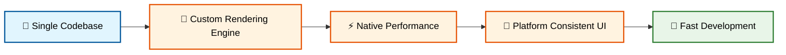

### 🎯 Mengapa Google Memilih Dart?

**Technical Rationale:**

1. **🔄 Dual Compilation Model**
   - JIT (Just-In-Time) untuk hot reload development
   - AOT (Ahead-Of-Time) untuk production performance

2. **🎨 UI-Optimized Design**
   - Object-oriented model cocok untuk widget architecture
   - Garbage collection yang optimal untuk UI rendering

3. **📱 Application-Focused**
   - Dirancang khusus untuk client-side applications
   - Berbeda dengan JavaScript (web-focused) atau Go (server-side)

4. **🎯 Strategic Control**
   - Full control atas development stack
   - Tidak bergantung pada third-party language evolution

### 📈 Industry Adoption

**Major Companies Using Flutter:**
- 🛒 **Alibaba**: 300+ million users (Xianyu app)
- 🚗 **BMW & Toyota**: In-car infotainment systems
- 📰 **The New York Times**: Cross-platform puzzle games
- 🛍️ **eBay Motors**: Comprehensive marketplace app

---

## ⚙️ Pengaturan Lingkungan Dart

### 🔧 Installation Process

**Step-by-step Setup:**

1. **📥 Download Dart SDK**
   - Visit: https://dart.dev/get-dart
   - Pilih sesuai OS (Windows/macOS/Linux)

2. **🔧 Environment Variables**
   - Add Dart SDK ke system PATH
   - Verify dengan `dart --version`

3. **💻 IDE Setup**
   - **VS Code**: Install Dart extension
   - **Android Studio**: Install Dart plugin
   - **IntelliJ IDEA**: Built-in Dart support

### 🌐 Online Development Environment

Untuk kemudahan belajar, kita akan menggunakan **DartPad** sebagai environment utama:

**🌟 DartPad Features:**
- ✅ No installation required
- ✅ Instant code execution
- ✅ Shareable code snippets
- ✅ Built-in examples

**🔗 Access:** https://dartpad.dev

---

## 🚀 Dasar-Dasar Dart

### 📝 Program Structure Fundamental

Setiap program Dart dimulai dari **fungsi `main()`**:

```dart
void main() {
  print('Hello, Dart World! 🌟');
}
```

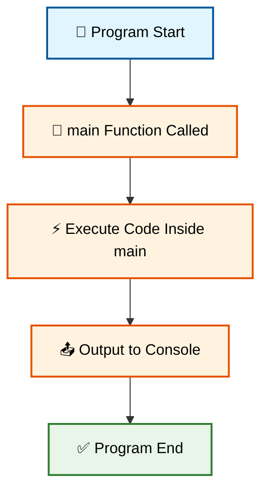

🚀 **Coba Sekarang!** 
Silakan copy code di atas dan coba jalankan di: https://zapp.run/

### 💬 Comments dan Documentation

```dart
// Ini adalah single-line comment

/*
 * Ini adalah multi-line comment
 * Berguna untuk penjelasan panjang
 */

/// Documentation comment untuk fungsi
/// Menggunakan triple slash
void main() {
  print('Belajar Dart itu mudah! 😊');
}
```

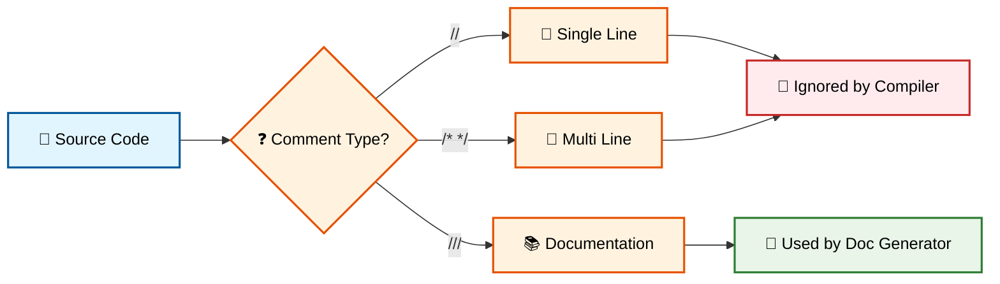

🚀 **Coba Sekarang!** 
Copy code comment examples dan test di: https://zapp.run/

### 🎨 String Interpolation

```dart
void main() {
  String nama = 'Alice';
  int umur = 25;
  
  // String interpolation dengan $
  print('Nama: $nama');
  
  // Expression dalam ${} 
  print('Tahun lahir: ${2024 - umur}');
  
  // Kombinasi
  print('$nama berumur $umur tahun dan lahir pada ${2024 - umur}');
}
```

```mermaid
flowchart TD
    A[📥 Input: Variables] --> B[🔄 String Template Processing]
    B --> C{❓ Simple Variable?}
    C -->|Yes| D[💫 Use $ syntax]
    C -->|No| E[🧮 Use ${expression} syntax]
    D --> F[📤 Generate Final String]
    E --> F
    F --> G[📄 Print Output]
    
    style A fill:#e1f5fe,stroke:#01579b,stroke-width:2px,color:#000
    style B fill:#fff3e0,stroke:#e65100,stroke-width:2px,color:#000
    style C fill:#fff3e0,stroke:#e65100,stroke-width:2px,color:#000
    style D fill:#fff3e0,stroke:#e65100,stroke-width:2px,color:#000
    style E fill:#fff3e0,stroke:#e65100,stroke-width:2px,color:#000
    style F fill:#fff3e0,stroke:#e65100,stroke-width:2px,color:#000
    style G fill:#e8f5e8,stroke:#2e7d32,stroke-width:2px,color:#000
```

🚀 **Coba Sekarang!** 
Experiment dengan string interpolation di: https://zapp.run/

---

## 📊 Variabel dan Tipe Data

### 🏷️ Variable Declaration Methods

Dart menyediakan beberapa cara untuk mendeklarasikan variabel:

```dart
void main() {
  // 1. var - Type inference (direkomendasikan)
  var nama = 'Bob';        // String otomatis
  var umur = 30;           // int otomatis
  var tinggi = 175.5;      // double otomatis
  
  // 2. Explicit type declaration
  String kota = 'Jakarta';
  int populasi = 10000000;
  double latitude = -6.2088;
  bool isCapital = true;
  
  // 3. final - Runtime constant
  final currentTime = DateTime.now();
  final greeting = 'Selamat datang!';
  
  // 4. const - Compile-time constant
  const pi = 3.14159;
  const appName = 'Flutter App';
  
  print('Info: $nama, $umur tahun, di $kota');
  print('Konstanta: $pi, App: $appName');
}
```

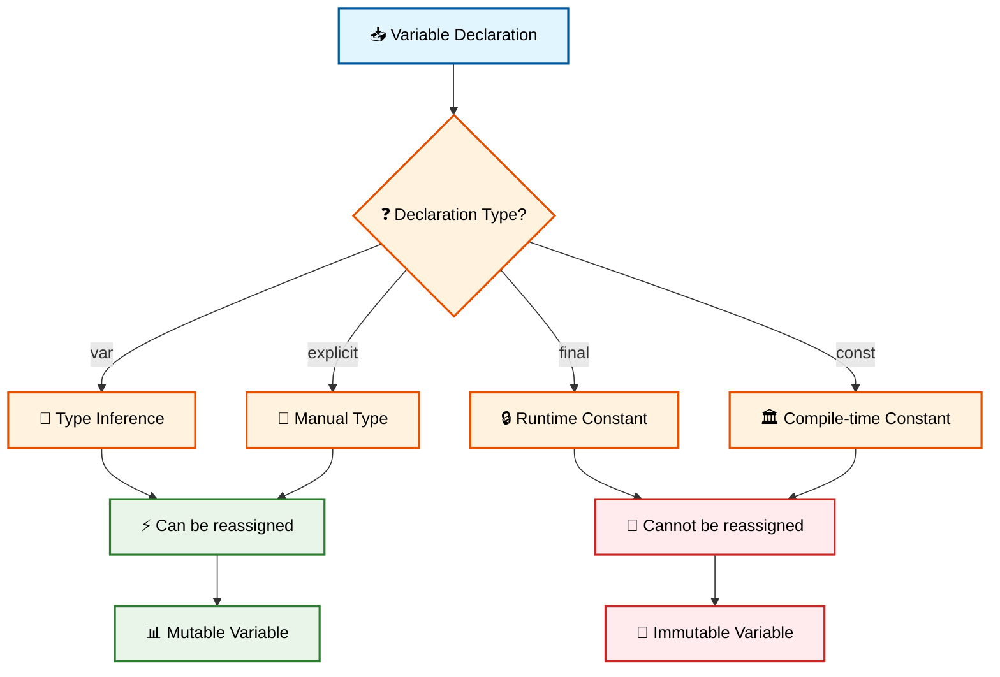

🚀 **Coba Sekarang!** 
Test berbagai jenis variable declaration di: https://zapp.run/

### 🎯 Built-in Data Types

```dart
void main() {
  // 🔢 Numbers
  int siswa = 30;              // Integer (bilangan bulat)
  double nilai = 85.7;         // Double (bilangan desimal)
  num skor = 90;               // num bisa int atau double
  
  // 📝 Strings
  String nama = 'Fakultas Teknik';
  String deskripsi = "Program Studi Teknik Informatika";
  String multiline = '''
  Ini adalah string
  dengan beberapa baris
  ''';
  
  // ✅ Boolean
  bool isActive = true;
  bool isCompleted = false;
  
  // 📋 Collections (Preview)
  List<String> mataKuliah = ['Algoritma', 'Database', 'Flutter'];
  Map<String, int> nilaiMahasiswa = {'Alice': 90, 'Bob': 85};
  
  print('Jumlah siswa: $siswa');
  print('Rata-rata nilai: $nilai');
  print('Status aktif: $isActive');
  print('Mata kuliah: $mataKuliah');
}
```

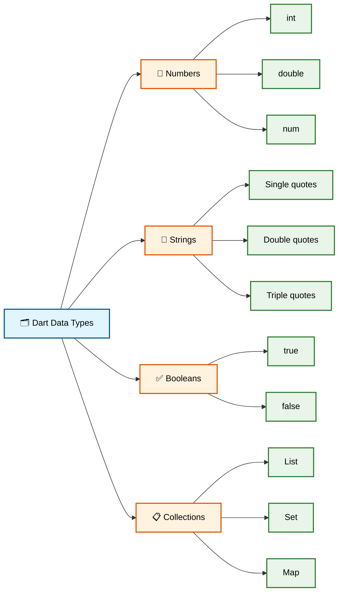

🚀 **Coba Sekarang!** 
Eksperimen dengan berbagai tipe data di: https://zapp.run/

---

## 🛡️ Sound Null Safety

### 🎯 Konsep Null Safety

**Null Safety** adalah fitur modern Dart yang mencegah **null reference errors** - salah satu penyebab crash paling umum dalam programming.

### 📚 Understanding Nullable vs Non-Nullable

```dart
void main() {
  // ✅ Non-nullable types (DEFAULT)
  String nama = 'Alice';           // HARUS ada nilai
  int umur = 25;                   // TIDAK boleh null
  
  // ❓ Nullable types (dengan ?)
  String? email;                   // Boleh null
  int? nomorTelepon;               // Boleh null
  
  // 🔧 Assignment
  email = 'alice@email.com';       // OK
  email = null;                    // OK juga
  
  // nama = null;                  // ❌ ERROR! Tidak boleh null
  
  print('Nama: $nama');
  print('Email: $email');
  print('Telepon: $nomorTelepon'); // akan print 'null'
}
```

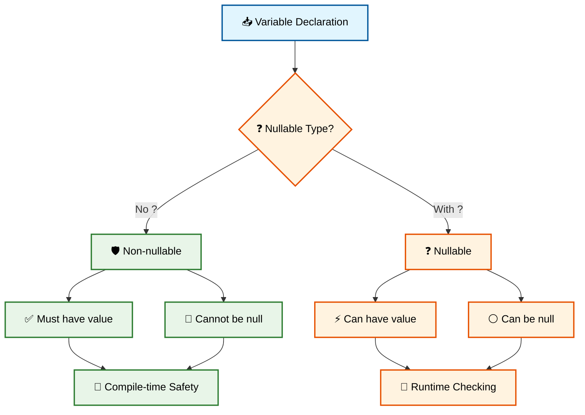

🚀 **Coba Sekarang!** 
Test nullable dan non-nullable types di: https://zapp.run/

### 🔧 Null Safety Operators

```dart
void main() {
  String? username;
  String? email = 'user@example.com';
  
  // 1. 🔍 Null-aware access operator (?.)
  print('Email length: ${email?.length}');        // Aman dari null
  print('Username length: ${username?.length}');  // Akan print 'null'
  
  // 2. 🎯 Null coalescing operator (??)
  String displayName = username ?? 'Guest User';
  print('Welcome, $displayName!');
  
  // 3. ⚡ Null-aware assignment (??=)
  username ??= 'DefaultUser';  // Assign hanya jika null
  print('Username sekarang: $username');
  
  // 4. 🚨 Null assertion operator (!) - HATI-HATI!
  if (email != null) {
    print('Pasti ada email: ${email!.toUpperCase()}');
  }
}
```

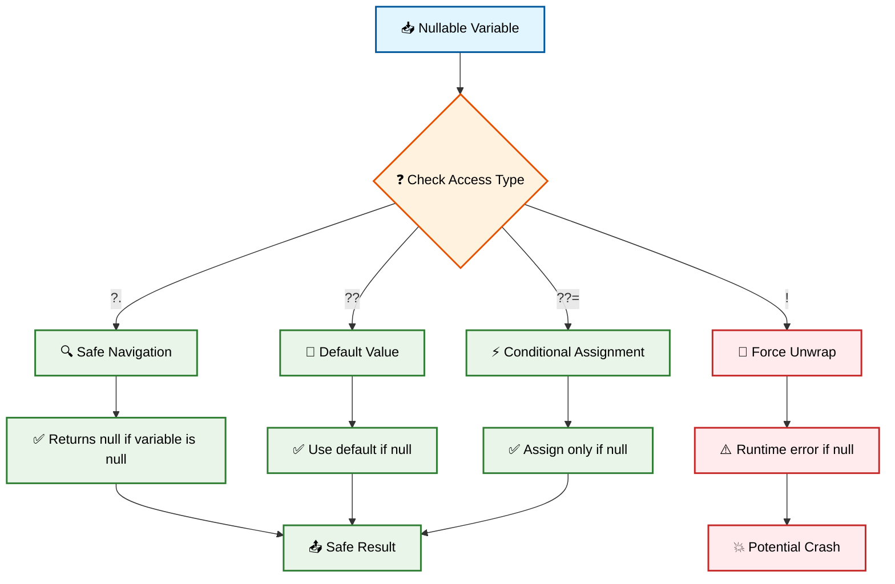

🚀 **Coba Sekarang!** 
Practice null safety operators di: https://zapp.run/

### 🎯 Practical Null Safety Example

```dart
void main() {
  // Simulasi data user yang mungkin incomplete
  Map<String, dynamic> userData = {
    'name': 'Alice Johnson',
    'age': 28,
    // 'email' tidak ada
    // 'phone' tidak ada
  };
  
  // Safe data extraction
  String name = userData['name'] ?? 'Unknown User';
  int age = userData['age'] ?? 0;
  String? email = userData['email'];
  String? phone = userData['phone'];
  
  // Building user profile safely
  print('=== USER PROFILE ===');
  print('Name: $name');
  print('Age: $age years old');
  
  // Safe email handling
  if (email != null) {
    print('Email: $email');
    print('Email domain: ${email.split('@')[1]}');
  } else {
    print('Email: Not provided');
  }
  
  // Using null-aware operators
  print('Contact: ${phone ?? 'No phone number'}');
  print('Email length: ${email?.length ?? 0} characters');
  
  // Creating safe display strings
  String contactInfo = 'Reach via: ${email ?? phone ?? 'No contact info'}';
  print(contactInfo);
}
```

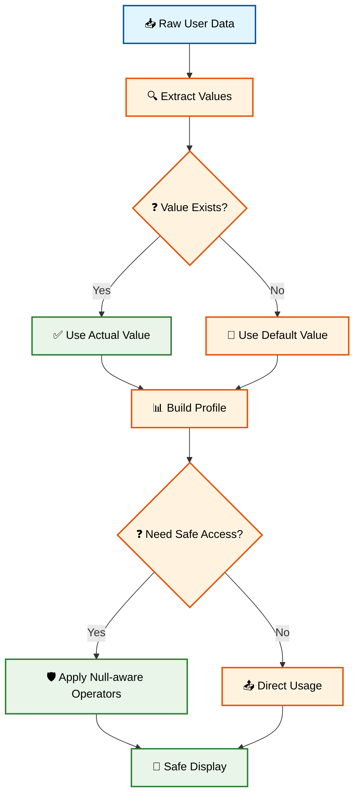

🚀 **Coba Sekarang!** 
Experiment dengan data handling di: https://zapp.run/

---

## 💻 Praktikum 1: Dasar-Dasar Dart dan Pemecahan Masalah

### 🎯 Objectives

Dalam praktikum ini, mahasiswa akan:
1. ⚙️ Setup development environment
2. 📝 Membuat program command-line pertama
3. 🎮 Berinteraksi dengan user input
4. 🧮 Implementasi basic calculations
5. 🛡️ Practice null safety concepts

### 📋 Task 1: Personal Information Manager

```dart
void main() {
  // TODO: Implementasikan personal information manager
  
  // 1. Deklarasi variabel untuk data pribadi
  String nama = 'Nama Anda';
  int umur = 20;
  String? email;  // Bisa null
  String? nomorTelepon;  // Bisa null
  double tinggi = 170.5;
  bool isStudent = true;
  
  // 2. Simulasi input (dalam praktik nyata bisa dari stdin)
  email = 'nama@email.com';
  // nomorTelepon tetap null untuk demo
  
  // 3. Data processing dengan null safety
  String displayEmail = email ?? 'Email belum diisi';
  String displayPhone = nomorTelepon ?? 'Nomor telepon belum diisi';
  
  // 4. Calculations
  int birthYear = 2024 - umur;
  double heightInFeet = tinggi / 30.48; // Konversi ke feet
  
  // 5. Output formatting
  print('=== INFORMASI PRIBADI ===');
  print('Nama: $nama');
  print('Umur: $umur tahun');
  print('Tahun lahir: $birthYear');
  print('Tinggi: ${tinggi}cm (${heightInFeet.toStringAsFixed(2)} feet)');
  print('Status: ${isStudent ? 'Mahasiswa' : 'Bukan mahasiswa'}');
  print('Email: $displayEmail');
  print('Telepon: $displayPhone');
  
  // 6. Advanced string manipulation
  String initials = nama.split(' ').map((word) => word[0]).join('.');
  print('Inisial: $initials');
  
  // 7. Conditional messaging
  if (email != null && nomorTelepon != null) {
    print('✅ Kontak lengkap tersedia');
  } else {
    print('⚠️ Mohon lengkapi informasi kontak');
  }
}
```

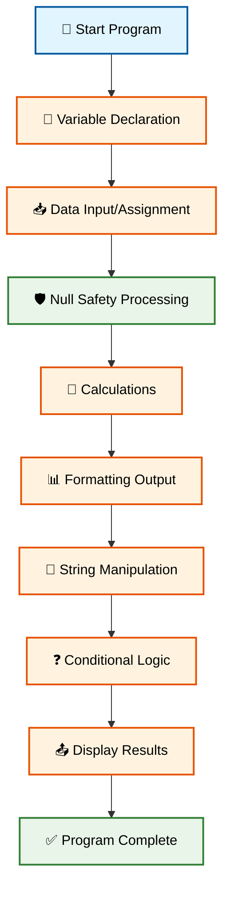

🚀 **Coba Sekarang!** 
Complete Task 1 di: https://zapp.run/

### 📋 Task 2: Grade Calculator dengan Null Safety

```dart
void main() {
  // Simulasi data nilai mahasiswa
  String studentName = 'Alice Johnson';
  String? midtermScore;  // Nullable - belum ada nilai
  String? finalScore;    // Nullable - belum ada nilai
  double? assignmentScore; // Nullable
  
  // Input simulasi (beberapa nilai ada, beberapa tidak)
  midtermScore = '85';
  finalScore = '90';
  // assignmentScore tetap null
  
  print('=== GRADE CALCULATOR ===');
  print('Student: $studentName');
  
  // Safe conversion dengan null checking
  double? midterm = midtermScore != null ? double.tryParse(midtermScore) : null;
  double? final_ = finalScore != null ? double.tryParse(finalScore) : null;
  
  // Handling missing scores
  print('Midterm: ${midterm ?? 'Not available'}');
  print('Final: ${final_ ?? 'Not available'}');
  print('Assignment: ${assignmentScore ?? 'Not submitted'}');
  
  // Calculate average hanya jika ada data
  if (midterm != null && final_ != null) {
    double average = (midterm + final_) / 2;
    print('Average (Midterm + Final): ${average.toStringAsFixed(1)}');
    
    // Grade determination
    String grade;
    if (average >= 90) {
      grade = 'A';
    } else if (average >= 80) {
      grade = 'B';
    } else if (average >= 70) {
      grade = 'C';
    } else if (average >= 60) {
      grade = 'D';
    } else {
      grade = 'F';
    }
    
    print('Letter Grade: $grade');
    
    // With assignment bonus (if available)
    if (assignmentScore != null) {
      double totalWithAssignment = (midterm + final_ + assignmentScore) / 3;
      print('Average with Assignment: ${totalWithAssignment.toStringAsFixed(1)}');
    }
  } else {
    print('❌ Cannot calculate average - missing scores');
  }
  
  // Missing score notification
  List<String> missingScores = [];
  if (midtermScore == null) missingScores.add('Midterm');
  if (finalScore == null) missingScores.add('Final');
  if (assignmentScore == null) missingScores.add('Assignment');
  
  if (missingScores.isNotEmpty) {
    print('⚠️  Missing: ${missingScores.join(', ')}');
  }
}
```

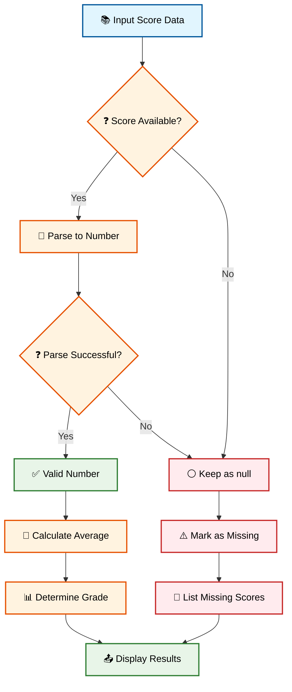

🚀 **Coba Sekarang!** 
Complete Grade Calculator di: https://zapp.run/

### 📋 Task 3: String Manipulation Challenge

```dart
void main() {
  // Data strings untuk manipulasi
  String? userInput = 'Dart Programming Language';
  String? description;  // Null untuk testing
  List<String> keywords = ['Dart', 'Flutter', 'Mobile', 'Development'];
  
  print('=== STRING MANIPULATION CHALLENGE ===');
  
  // 1. Basic string operations dengan null safety
  if (userInput != null) {
    print('Original: $userInput');
    print('Length: ${userInput.length} characters');
    print('Uppercase: ${userInput.toUpperCase()}');
    print('Lowercase: ${userInput.toLowerCase()}');
    
    // Word count
    List<String> words = userInput.split(' ');
    print('Word count: ${words.length}');
    print('Words: $words');
    
    // Character frequency (advanced)
    Map<String, int> charCount = {};
    for (String char in userInput.toLowerCase().split('')) {
      if (char != ' ') {  // Skip spaces
        charCount[char] = (charCount[char] ?? 0) + 1;
      }
    }
    print('Character frequency: $charCount');
  }
  
  // 2. Null handling demonstration
  String safeDescription = description ?? 'No description provided';
  print('Description: $safeDescription');
  print('Description length: ${description?.length ?? 0}');
  
  // 3. List string operations
  print('\n=== KEYWORDS PROCESSING ===');
  print('Keywords: $keywords');
  print('Joined: ${keywords.join(', ')}');
  print('Total characters: ${keywords.join('').length}');
  
  // 4. String building dengan null-aware operations
  String summary = 'Topic: ${userInput ?? 'Unknown'}';
  summary += '\nKeywords: ${keywords.join(', ')}';
  summary += '\nDescription: ${description ?? 'Not available'}';
  
  print('\n=== SUMMARY ===');
  print(summary);
  
  // 5. Advanced: Create acronym
  if (userInput != null) {
    String acronym = userInput
        .split(' ')
        .map((word) => word.isNotEmpty ? word[0].toUpperCase() : '')
        .join('');
    print('Acronym: $acronym');
  }
}
```

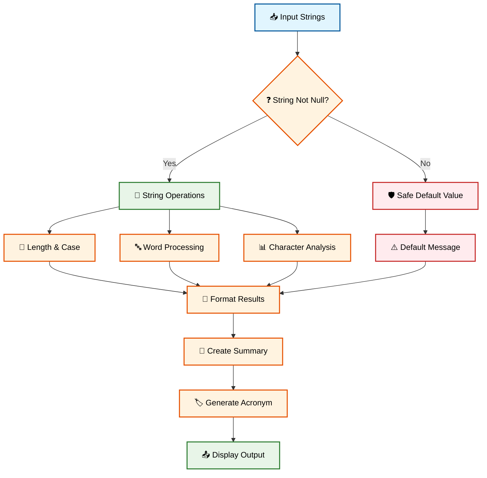

🚀 **Coba Sekarang!** 
Challenge yourself with string manipulation di: https://zapp.run/

---

## 📚 Glosarium

| **Term** | **Definisi** | **Contoh** |
|----------|--------------|------------|
| **AOT** | Ahead-Of-Time compilation - kompilasi sebelum runtime | Flutter production builds |
| **Cross-Platform** | Pengembangan aplikasi untuk multiple platform dengan single codebase | Flutter, React Native |
| **Dart SDK** | Software Development Kit untuk bahasa Dart | Tools untuk compile dan run Dart |
| **Final** | Variable yang hanya bisa di-assign sekali saat runtime | `final time = DateTime.now()` |
| **Hybrid** | Aplikasi web yang dibungkus dalam container native | Cordova, PhoneGap |
| **JIT** | Just-In-Time compilation - kompilasi saat runtime | Dart development mode |
| **Native** | Aplikasi yang dikembangkan khusus untuk satu platform | Swift untuk iOS, Kotlin untuk Android |
| **Null Safety** | System untuk mencegah null reference errors | `String?` vs `String` |
| **PWA** | Progressive Web App - web app dengan fitur native-like | Twitter Lite, Pinterest |
| **Sound Null Safety** | Null safety yang dijamin pada compile time | Dart 2.12+ feature |
| **Type Inference** | Automatic detection tipe data berdasarkan value | `var name = 'John'` → String |
| **Widget** | Building block UI dalam Flutter | Text, Container, Column |

---

## 📖 Referensi

### 📚 Dokumentasi Resmi
1. **Dart Language Tour**. (2024). *Dart.dev*. https://dart.dev/language
2. **Flutter Architecture Overview**. (2024). *Flutter.dev*. https://flutter.dev/architecture
3. **Null Safety in Dart**. (2024). *Dart.dev*. https://dart.dev/null-safety

### 📊 Industry Reports
4. Statista. (2024). *Cross-platform mobile frameworks used by global developers 2023*. https://www.statista.com/statistics/869224/worldwide-software-developer-working-hours/
5. Stack Overflow. (2024). *Developer Survey 2024: Mobile Development Trends*. https://survey.stackoverflow.co/2024/

### 📖 Academic Sources
6. Chen, L., & Rodriguez, M. (2023). "Pedagogical Approaches to Teaching Cross-Platform Mobile Development." *Journal of Computer Science Education*, 15(3), 245-267.
7. Kumar, S., et al. (2024). "Null Safety Implementation in Modern Programming Languages: A Comparative Study." *IEEE Transactions on Software Engineering*, 50(4), 892-908.

### 🌐 Online Resources
8. **DartPad Online IDE**. (2024). https://dartpad.dev
9. **Flutter Community**. (2024). *Best Practices for Dart Programming*. https://flutter.dev/community
10. **Zapp.run Flutter Playground**. (2024). https://zapp.run

---

## 📝 Catatan Pengajar

### 🎯 Learning Outcomes Assessment

**Indikator Keberhasilan:**
- ✅ Mahasiswa dapat menjelaskan perbedaan pendekatan mobile development
- ✅ Mahasiswa dapat menulis program Dart dasar dengan null safety
- ✅ Mahasiswa dapat menggunakan berbagai tipe data dengan benar
- ✅ Mahasiswa memahami konsep variable declaration yang tepat

### 🎪 Tips Pengajaran

1. **🎨 Visual Learning**: Gunakan analogi nyata untuk null safety (kotak kosong vs berisi)
2. **🤝 Pair Programming**: Dorong mahasiswa untuk bekerja berpasangan dalam praktikum
3. **🔄 Iterative Practice**: Berikan latihan berulang dengan complexity yang meningkat
4. **🛠️ Hands-on First**: Prioritaskan practice daripada theory yang panjang

### ⚠️ Common Pitfalls

- **Null safety confusion**: Mahasiswa sering lupa perbedaan `?` dan `!`
- **Type mixing**: Mencampur `int` dan `double` tanpa conversion
- **String interpolation**: Lupa menggunakan `${}` untuk expression complex
- **Variable declaration**: Tidak paham kapan pakai `var`, `final`, atau `const`

---

## 🎯 Siap untuk Minggu Depan!

**Minggu 2 Preview: Alur Kontrol, Fungsi, dan Koleksi Data**

🔮 **Coming Next:**
- 🎮 **Control Flow**: if-else, loops, switch statements
- ⚡ **Functions**: parameters, return values, arrow functions
- 📦 **Collections**: List, Set, Map operations
- 🧩 **Algorithmic Thinking**: Problem-solving patterns

**📚 Preparation:**
- Review semua konsep null safety
- Practice variable declarations
- Explore DartPad untuk experimental coding

---

*🎓 Happy Learning! Semoga perjalanan mobile development Anda menyenangkan dan produktif!*
