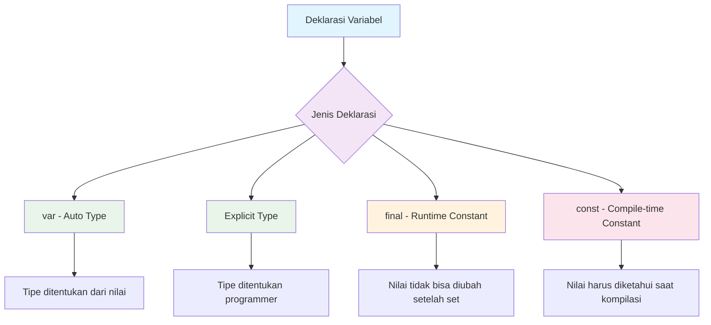
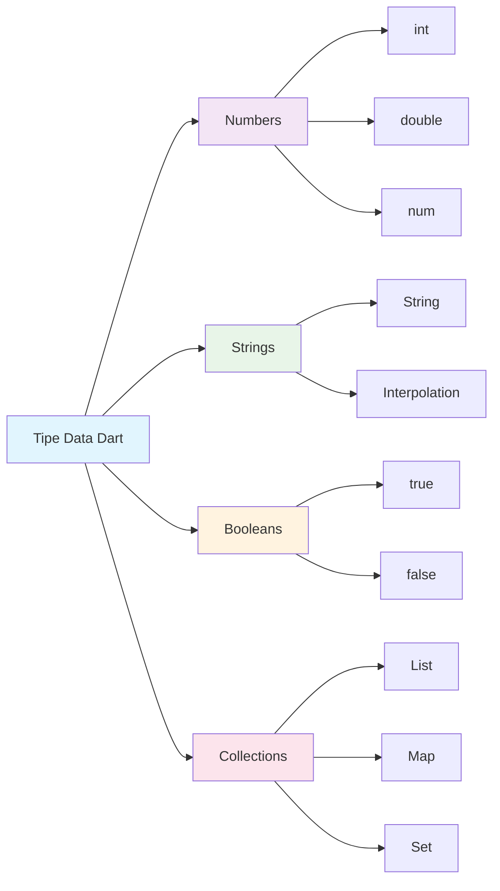
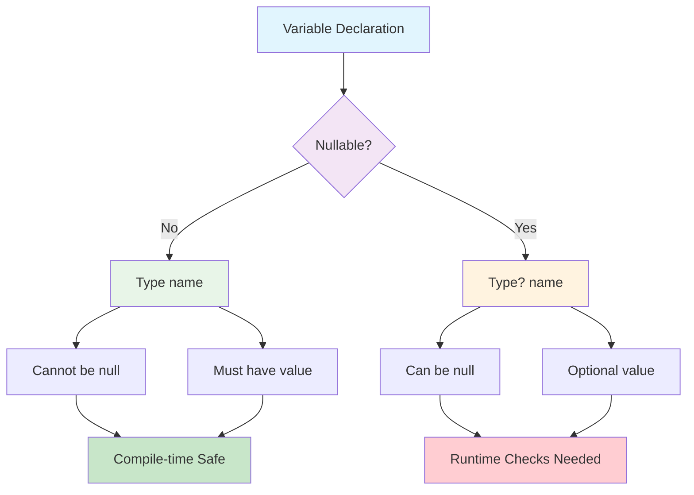
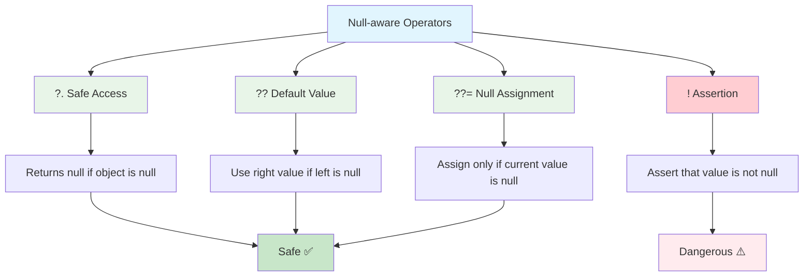
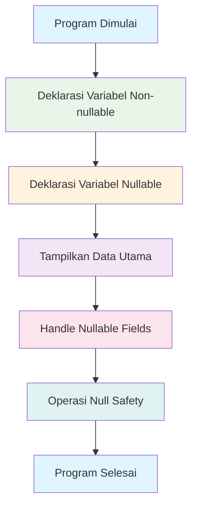

# 📱 Minggu 1: Pengenalan Ekosistem Aplikasi Bergerak dan Dasar-Dasar Dart


---

## 🎯 Tujuan Pembelajaran

Setelah menyelesaikan materi minggu ini, mahasiswa diharapkan mampu:

- ✅ **Mengartikulasikan** perbedaan, kelebihan, dan kekurangan dari pengembangan aplikasi bergerak *native*, *hybrid*, dan *cross-platform*
- ✅ **Menjelaskan** proposisi nilai Flutter dalam ekosistem aplikasi bergerak
- ✅ **Menyiapkan** lingkungan pengembangan Dart yang fungsional dan menulis program baris perintah (*command-line*) dasar
- ✅ **Mendeklarasikan** variabel menggunakan inferensi tipe (var) dan tipe eksplisit, serta memahami *sound null safety* pada Dart

---

## 📋 Daftar Isi

1. [🌍 Pengenalan Ekosistem Aplikasi Bergerak](#-pengenalan-ekosistem-aplikasi-bergerak)
2. [🚀 Mengapa Flutter? Mengapa Dart?](#-mengapa-flutter-mengapa-dart)
3. [⚙️ Pengaturan Lingkungan Dart](#️-pengaturan-lingkungan-dart)
4. [💻 Dasar-Dasar Pemrograman Dart](#-dasar-dasar-pemrograman-dart)
5. [🔒 Sound Null Safety](#-sound-null-safety)
6. [🛠️ Praktikum](#️-praktikum)
7. [📚 Glosarium](#-glosarium)
8. [📖 Referensi](#-referensi)

---

## 🌍 Pengenalan Ekosistem Aplikasi Bergerak

### 📊 Lanskap Pengembangan Aplikasi Bergerak

Industri aplikasi bergerak telah berkembang pesat dan menjadi salah satu sektor teknologi yang paling dinamis. Dari ide hingga peluncuran, proses pengembangan aplikasi melibatkan berbagai komponen:

- **Front-end**: Antarmuka pengguna yang terlihat dan berinteraksi langsung dengan pengguna
- **Back-end**: Server, database, dan logika bisnis yang bekerja di belakang layar
- **Platform Dominan**: iOS (Apple) dan Android (Google) menguasai 99% pasar smartphone global

### 🔍 Pendekatan Pengembangan Aplikasi

Terdapat tiga pendekatan utama dalam pengembangan aplikasi bergerak:

#### 📱 **1. Native Development**
Pengembangan aplikasi menggunakan bahasa dan tools resmi platform:
- **iOS**: Swift/Objective-C dengan Xcode
- **Android**: Kotlin/Java dengan Android Studio

**Kelebihan:**
- Performa terbaik dengan akses langsung ke API perangkat
- Fidelitas UI/UX paling tinggi, sesuai dengan guideline platform
- Akses penuh ke fitur platform-specific

**Kekurangan:**
- Basis kode terpisah untuk setiap platform
- Biaya dan waktu pengembangan tinggi
- Memerlukan expertise berbeda untuk setiap platform

#### 🌐 **2. Hybrid Development**
Menggunakan teknologi web (HTML, CSS, JavaScript) yang dibungkus dalam container native:

**Kelebihan:**
- Basis kode tunggal yang dapat digunakan kembali
- Biaya pengembangan rendah
- Developer web dapat beradaptasi dengan mudah

**Kekurangan:**
- Performa lebih rendah karena bergantung pada web container
- UI/UX terbatas, tidak selalu terasa "native"
- Akses terbatas ke fitur platform

#### ⚡ **3. Cross-Platform Development**
Menggunakan framework khusus yang mengompilasi ke kode native:

**Kelebihan:**
- Satu basis kode untuk multiple platform
- Performa mendekati native
- Fidelitas UI tinggi dengan rendering engine sendiri

**Kekurangan:**
- Learning curve untuk framework baru
- Ketergantungan pada framework vendor
- Beberapa fitur platform mungkin terlambat didukung

### 📈 Perbandingan Pendekatan Development

| Aspek | Native | Hybrid | Cross-Platform |
|-------|--------|---------|----------------|
| **Performa** | 🟢 Excellent | 🟡 Good | 🟢 Very Good |
| **Biaya Development** | 🔴 High | 🟢 Low | 🟡 Medium |
| **Time to Market** | 🔴 Slow | 🟢 Fast | 🟡 Medium |
| **UI/UX Fidelity** | 🟢 Perfect | 🔴 Limited | 🟢 Excellent |
| **Code Reusability** | 🔴 None | 🟢 High | 🟢 High |
| **Learning Curve** | 🟡 Platform-specific | 🟢 Easy | 🟡 Medium |

---

## 🚀 Mengapa Flutter? Mengapa Dart?

### 🎯 Flutter sebagai Solusi Cross-Platform

Flutter, yang dikembangkan oleh Google, telah menjadi pilihan utama untuk cross-platform development dengan alasan-alasan berikut:

#### **📊 Statistik Market Share (2024-2025)**
- **42% market share** dalam cross-platform development
- **2 juta developer** aktif secara global
- **500,000+ aplikasi** telah dipublikasikan menggunakan Flutter

#### **🏆 Keunggulan Flutter**

1. **Single Codebase, Multiple Platforms**
   - Satu kode untuk iOS, Android, Web, Desktop, dan Embedded
   - Konsistensi UI yang pixel-perfect di semua platform

2. **Performance Tinggi**
   - Kompilasi AOT (Ahead-of-Time) untuk production
   - Rendering langsung ke canvas tanpa bridge

3. **Hot Reload untuk Development Speed**
   - Perubahan kode terlihat dalam hitungan detik
   - Meningkatkan produktivitas developer hingga 50%

4. **Rich Widget Library**
   - Material Design (Android) dan Cupertino (iOS) widgets
   - Customizable dan extensible

### 🎨 Mengapa Google Memilih Dart?

Dart dipilih sebagai bahasa untuk Flutter karena karakteristik unik yang mendukung UI development:

#### **⚡ Dual Compilation**
- **JIT (Just-in-Time)**: Untuk development dengan hot reload
- **AOT (Ahead-of-Time)**: Untuk production dengan performa optimal

#### **🎯 UI-Optimized Design**
- Object-oriented model cocok untuk widget architecture
- Garbage collection yang optimized untuk UI rendering
- Async/await yang built-in untuk handling user interactions

#### **🔧 Developer Experience**
- Syntax yang familiar bagi developer Java/JavaScript
- Strong typing dengan type inference
- Null safety untuk mencegah runtime errors

### 🏢 Success Stories Flutter

**Perusahaan Besar yang Menggunakan Flutter:**
- **Alibaba**: Aplikasi Xianyu dengan 300+ juta pengguna
- **Google Pay**: Aplikasi pembayaran global
- **BMW & Toyota**: Sistem infotainment mobil
- **eBay Motors**: Platform otomotif terlengkap

---

## ⚙️ Pengaturan Lingkungan Dart

### 💾 Instalasi Dart SDK

Sebelum mulai coding, kita perlu menginstal Dart SDK secara terpisah dari Flutter untuk memahami pemisahan antara bahasa dan framework.

#### **🖥️ Windows**
```bash
# Menggunakan Chocolatey
choco install dart-sdk

# Atau download dari https://dart.dev/get-dart
```

#### **🍎 macOS**
```bash
# Menggunakan Homebrew
brew tap dart-lang/dart
brew install dart
```

#### **🐧 Linux**
```bash
# Ubuntu/Debian
sudo apt update
sudo apt install apt-transport-https
wget -qO- https://dl-ssl.google.com/linux/linux_signing_key.pub | sudo apt-key add -
sudo sh -c 'curl https://storage.googleapis.com/download.dartlang.org/linux/debian/dart_stable.list > /etc/apt/sources.list.d/dart_stable.list'
sudo apt update
sudo apt install dart
```

### 🔧 Verifikasi Instalasi

```bash
dart --version
```

**Output yang diharapkan:**
```
Dart SDK version: 3.4.0 (stable)
```

### 🌐 Alternatif: DartPad (Online)

Untuk pembelajaran dan eksperimen cepat, gunakan **DartPad** di https://dartpad.dev - tidak memerlukan instalasi apapun!

---

## 💻 Dasar-Dasar Pemrograman Dart

### 🎯 Program Pertama: Hello World

Mari mulai dengan program Dart yang paling sederhana:

```dart
void main() {
  print('Hello, World!');
}
```

```mermaid
flowchart TD
    A[Program Dimulai] --> B[Fungsi main() dipanggil]
    B --> C[Eksekusi print()]
    C --> D[Output: 'Hello, World!']
    D --> E[Program Selesai]
    
    style A fill:#e1f5fe
    style B fill:#f3e5f5
    style C fill:#e8f5e8
    style D fill:#fff3e0
    style E fill:#fce4ec
```

🚀 **Coba Sekarang!** Silakan copy code di atas dan jalankan di: https://zapp.run/

#### **📝 Penjelasan:**
- `void main()` adalah titik masuk (entry point) setiap program Dart
- `print()` adalah fungsi built-in untuk menampilkan output ke console
- Setiap statement diakhiri dengan semicolon (`;`)

### 📦 Variabel dan Tipe Data

#### **🏷️ Deklarasi Variabel**

Dart menyediakan beberapa cara untuk mendeklarasikan variabel:

```dart
void main() {
  // 1. Menggunakan 'var' - tipe ditentukan otomatis
  var nama = 'Alice';
  var umur = 25;
  
  // 2. Menentukan tipe secara eksplisit
  String kota = 'Jakarta';
  int tahunLahir = 1999;
  double tinggi = 165.5;
  bool sudahMenikah = false;
  
  // 3. Konstanta
  final String negara = 'Indonesia';  // Nilai ditentukan saat runtime
  const double pi = 3.14159;          // Nilai ditentukan saat compile-time
  
  print('Nama: $nama');
  print('Umur: $umur tahun');
  print('Kota: $kota');
  print('Tinggi: ${tinggi}cm');
}
```



🚀 **Coba Sekarang!** Silakan copy code di atas dan jalankan di: https://zapp.run/

#### **📊 Tipe Data Fundamental**

```dart
void main() {
  // Tipe Data Numerik
  int jumlahMahasiswa = 150;           // Bilangan bulat
  double rataRataIPK = 3.45;           // Bilangan desimal
  num flexibleNumber = 42;             // Bisa int atau double
  
  // Tipe Data String
  String universitasNama = 'Universitas Indonesia';
  String motto = 'Veritas, Probitas, Iustitia';
  
  // Tipe Data Boolean
  bool isActive = true;
  bool isGraduated = false;
  
  // String Interpolation
  print('Universitas: $universitasNama');
  print('Jumlah Mahasiswa: $jumlahMahasiswa');
  print('Rata-rata IPK: $rataRataIPK');
  print('Status Aktif: ${isActive ? 'Ya' : 'Tidak'}');
}
```



🚀 **Coba Sekarang!** Silakan copy code di atas dan jalankan di: https://zapp.run/

### 💬 Komentar dalam Kode

```dart
void main() {
  // Ini adalah komentar satu baris
  
  /*
   * Ini adalah komentar
   * multi-baris untuk penjelasan
   * yang lebih panjang
   */
  
  /// Ini adalah documentation comment
  /// Biasanya digunakan untuk fungsi dan class
  
  print('Hello, Dart!'); // Komentar di akhir baris
}
```

🚀 **Coba Sekarang!** Silakan copy code di atas dan jalankan di: https://zapp.run/

---

## 🔒 Sound Null Safety

### 🛡️ Apa itu Null Safety?

Null safety adalah fitur penting di Dart yang membantu mencegah error runtime yang disebabkan oleh nilai `null`. Fitur ini memastikan bahwa variabel tidak dapat berisi nilai `null` kecuali secara eksplisit diizinkan.

### 📋 Non-nullable vs Nullable Types

```dart
void main() {
  // NON-NULLABLE (Tidak boleh null)
  String nama = 'John Doe';           // ✅ Valid
  // String nama2 = null;             // ❌ Error! Tidak boleh null
  
  // NULLABLE (Boleh null)
  String? emailOpsional = null;       // ✅ Valid
  String? telepon = '08123456789';    // ✅ Valid juga
  
  // Mengubah nilai nullable
  emailOpsional = 'john@email.com';   // ✅ Sekarang ada nilai
  
  print('Nama: $nama');
  print('Email: ${emailOpsional ?? 'Tidak ada email'}');
}
```



🚀 **Coba Sekarang!** Silakan copy code di atas dan jalankan di: https://zapp.run/

### ⚡ Null-aware Operators

```dart
void main() {
  String? userName;
  String? userEmail = 'user@email.com';
  
  // 1. Null-aware access operator (?.)
  print('Panjang email: ${userEmail?.length}');  // Safe access
  print('Panjang nama: ${userName?.length}');    // Returns null, tidak error
  
  // 2. Null coalescing operator (??)
  String displayName = userName ?? 'Guest User';
  print('Display name: $displayName');
  
  // 3. Null assignment operator (??=)
  userName ??= 'Default User';  // Assign hanya jika null
  print('User name setelah assignment: $userName');
  
  // 4. Null assertion operator (!)
  // Hanya gunakan jika yakin nilai tidak null!
  String? confirmedEmail = 'confirmed@email.com';
  String definitiveEmail = confirmedEmail!;  // Berbahaya jika null!
  print('Definitive email: $definitiveEmail');
}
```



🚀 **Coba Sekarang!** Silakan copy code di atas dan jalankan di: https://zapp.run/

### 🎯 Praktik Terbaik Null Safety

```dart
void main() {
  String? userInput;
  
  // ❌ BURUK: Langsung menggunakan tanpa check
  // print(userInput.length); // Runtime error!
  
  // ✅ BAIK: Check null terlebih dahulu
  if (userInput != null) {
    print('Panjang input: ${userInput.length}');
  } else {
    print('Input kosong');
  }
  
  // ✅ BAIK: Menggunakan null-aware operator
  print('Panjang input: ${userInput?.length ?? 0}');
  
  // ✅ BAIK: Memberikan default value
  String safeInput = userInput ?? 'Default input';
  print('Safe input: $safeInput');
}
```

🚀 **Coba Sekarang!** Silakan copy code di atas dan jalankan di: https://zapp.run/

---

## 🛠️ Praktikum

### 🎯 Praktikum 1: Program Biodata Mahasiswa

Buatlah program yang menampilkan biodata mahasiswa dengan memanfaatkan semua konsep yang telah dipelajari:

```dart
void main() {
  // Data mahasiswa
  final String npm = '2106123456';
  final String nama = 'Alice Wonderland';
  var jurusan = 'Teknik Informatika';
  int semester = 5;
  double ipk = 3.75;
  bool statusAktif = true;
  
  // Data opsional (bisa null)
  String? email = 'alice@ui.ac.id';
  String? telepon;  // Belum diisi
  String? alamat = null;  // Eksplisit null
  
  // Tampilkan biodata
  print('=== BIODATA MAHASISWA ===');
  print('NPM: $npm');
  print('Nama: $nama');
  print('Jurusan: $jurusan');
  print('Semester: $semester');
  print('IPK: $ipk');
  print('Status: ${statusAktif ? 'Aktif' : 'Tidak Aktif'}');
  
  // Handle nullable fields dengan aman
  print('Email: ${email ?? 'Belum diisi'}');
  print('Telepon: ${telepon ?? 'Belum diisi'}');
  print('Alamat: ${alamat ?? 'Belum diisi'}');
  
  // Operasi dengan null safety
  print('Panjang nama: ${nama.length} karakter');
  print('Email tersedia: ${email != null}');
  print('Panjang email: ${email?.length ?? 0} karakter');
}
```



🚀 **Coba Sekarang!** Silakan copy code di atas dan jalankan di: https://zapp.run/

### 🎮 Tantangan: Kalkulator Sederhana

```dart
void main() {
  // Input untuk kalkulator
  double? angka1 = 10.5;
  double? angka2 = 5.2;
  String? operasi = '+';
  
  // Validasi input
  if (angka1 == null || angka2 == null || operasi == null) {
    print('Error: Input tidak lengkap!');
    return;
  }
  
  // Perhitungan berdasarkan operasi
  double? hasil;
  String operasiNama = '';
  
  if (operasi == '+') {
    hasil = angka1 + angka2;
    operasiNama = 'Penjumlahan';
  } else if (operasi == '-') {
    hasil = angka1 - angka2;
    operasiNama = 'Pengurangan';
  } else if (operasi == '*') {
    hasil = angka1 * angka2;
    operasiNama = 'Perkalian';
  } else if (operasi == '/') {
    if (angka2 != 0) {
      hasil = angka1 / angka2;
      operasiNama = 'Pembagian';
    } else {
      print('Error: Tidak bisa membagi dengan nol!');
      return;
    }
  } else {
    print('Error: Operasi tidak dikenali!');
    return;
  }
  
  // Tampilkan hasil
  print('=== KALKULATOR SEDERHANA ===');
  print('$operasiNama: $angka1 $operasi $angka2 = $hasil');
}
```

🚀 **Coba Sekarang!** Silakan copy code di atas dan jalankan di: https://zapp.run/

---

## 📚 Glosarium

| Istilah | Definisi |
|---------|----------|
| **AOT** | Ahead-of-Time compilation - kompilasi sebelum runtime |
| **API** | Application Programming Interface - antarmuka pemrograman aplikasi |
| **Cross-platform** | Dapat berjalan di multiple platform dengan satu codebase |
| **Dart SDK** | Software Development Kit untuk bahasa Dart |
| **Flutter** | Framework UI Google untuk cross-platform development |
| **Hot Reload** | Fitur untuk melihat perubahan kode secara real-time |
| **Hybrid App** | Aplikasi yang menggunakan teknologi web dalam container native |
| **JIT** | Just-in-Time compilation - kompilasi saat runtime |
| **Native App** | Aplikasi yang dibuat khusus untuk satu platform |
| **Null Safety** | Fitur untuk mencegah null reference errors |
| **Type Inference** | Kemampuan compiler menentukan tipe data secara otomatis |
| **Widget** | Komponen UI building block dalam Flutter |

---

## 📖 Referensi

1. **Dart Language Tour**. (2024). *Official Dart Documentation*. Retrieved from https://dart.dev/language

2. **Flutter Documentation**. (2024). *Getting Started with Flutter*. Retrieved from https://docs.flutter.dev/get-started

3. **Google Developers**. (2024). *Dart Null Safety*. Retrieved from https://dart.dev/null-safety

4. **Stack Overflow Developer Survey**. (2024). *Most Popular Mobile Frameworks*. Retrieved from https://survey.stackoverflow.co/2024

5. **Statista Research Department**. (2024). *Cross-platform mobile frameworks used by global developers*. Retrieved from https://www.statista.com/statistics/869224

6. **Medium Engineering Blog**. (2024). *Why Google Chose Dart for Flutter*. Retrieved from https://medium.com/flutter/

7. **GitHub**. (2024). *Flutter Repository Statistics*. Retrieved from https://github.com/flutter/flutter

8. **Dartpad Development Team**. (2024). *Online Dart Editor*. Retrieved from https://dartpad.dev

---

## 📝 Catatan Pembelajaran

> **💡 Tips untuk Sukses:**
> - Praktikkan setiap contoh kode di DartPad atau zapp.run
> - Jangan ragu untuk bereksperimen dengan variasi kode
> - Pahami konsep null safety karena ini fundamental dalam Dart modern
> - Mulai biasakan menulis kode yang aman dari null errors

> **⚠️ Hal yang Perlu Diperhatikan:**
> - Selalu gunakan null-aware operators untuk variabel nullable
> - Hindari penggunaan null assertion (!) kecuali benar-benar yakin
> - Perhatikan perbedaan antara `final` dan `const`
> - String interpolation dengan `${}` untuk expression yang kompleks

---

**🎉 Selamat!** Anda telah menyelesaikan materi minggu pertama. Selanjutnya kita akan mempelajari alur kontrol, fungsi, dan koleksi data di Dart pada minggu kedua.

---

*Materi ini disusun untuk mata kuliah Pemrograman Piranti Bergerak menggunakan Flutter*  
*Universitas - Semester Ganjil 2024/2025*
