# 📱 Minggu 2: Alur Kontrol, Fungsi, dan Koleksi Data di Dart


## 🎯 Tujuan Pembelajaran

Setelah menyelesaikan materi minggu ini, mahasiswa diharapkan dapat:

- 🧮 **Mengimplementasikan** logika kondisional menggunakan operator, pernyataan if/else, dan switch
- 🔄 **Mengontrol** alur program dengan perulangan for dan while
- ⚡ **Mendefinisikan** dan memanggil fungsi dengan parameter posisional, bernama, dan opsional
- 📦 **Menyimpan** dan memanipulasi koleksi data menggunakan List, Set, dan Map

---

## 📋 Outline Materi

1. [🧮 Operator di Dart](#-operator-di-dart)
2. [🔀 Pernyataan Alur Kontrol](#-pernyataan-alur-kontrol)
3. [⚡ Fungsi di Dart](#-fungsi-di-dart)
4. [📦 Koleksi Data](#-koleksi-data)
5. [💻 Praktikum 2](#-praktikum-2)

---

## 🧮 Operator di Dart

### 🔢 Operator Aritmetika

Dart menyediakan operator aritmetika lengkap untuk komputasi matematika:

```dart
void main() {
  int a = 10;
  int b = 3;
  
  // Operator aritmetika dasar
  print('Penjumlahan: $a + $b = ${a + b}');        // 13
  print('Pengurangan: $a - $b = ${a - b}');        // 7
  print('Perkalian: $a * $b = ${a * b}');          // 30
  print('Pembagian: $a / $b = ${a / b}');          // 3.3333333333333335
  print('Pembagian bulat: $a ~/ $b = ${a ~/ b}');  // 3 (khusus Dart!)
  print('Modulo: $a % $b = ${a % b}');             // 1
  
  // Operator increment/decrement
  print('a++ = ${a++}'); // Print lalu increment
  print('++a = ${++a}'); // Increment lalu print
}
```

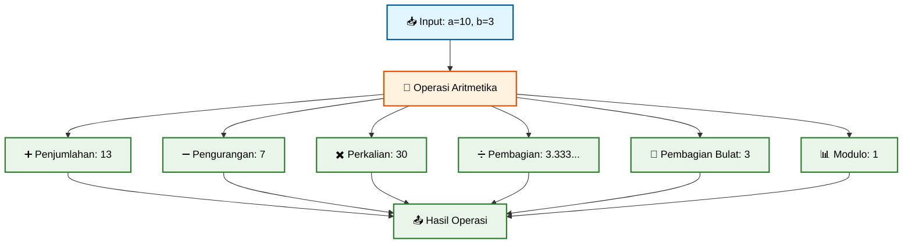

🚀 **Coba Sekarang!** 
Eksperimen dengan operator aritmetika dan lihat perbedaan `/` vs `~/` di: https://zapp.run/

### ⚖️ Operator Kesetaraan dan Relasional

```dart
void main() {
  int x = 5;
  int y = 10;
  String nama1 = 'Alice';
  String nama2 = 'Bob';
  
  // Operator kesetaraan
  print('x == y: ${x == y}');         // false
  print('x != y: ${x != y}');         // true
  print('nama1 == nama2: ${nama1 == nama2}'); // false
  
  // Operator relasional
  print('x > y: ${x > y}');           // false
  print('x < y: ${x < y}');           // true
  print('x >= 5: ${x >= 5}');         // true
  print('y <= 10: ${y <= 10}');       // true
  
  // Perbandingan string
  print('Alice vs Bob: ${nama1.compareTo(nama2)}'); // negatif (Alice < Bob)
}
```

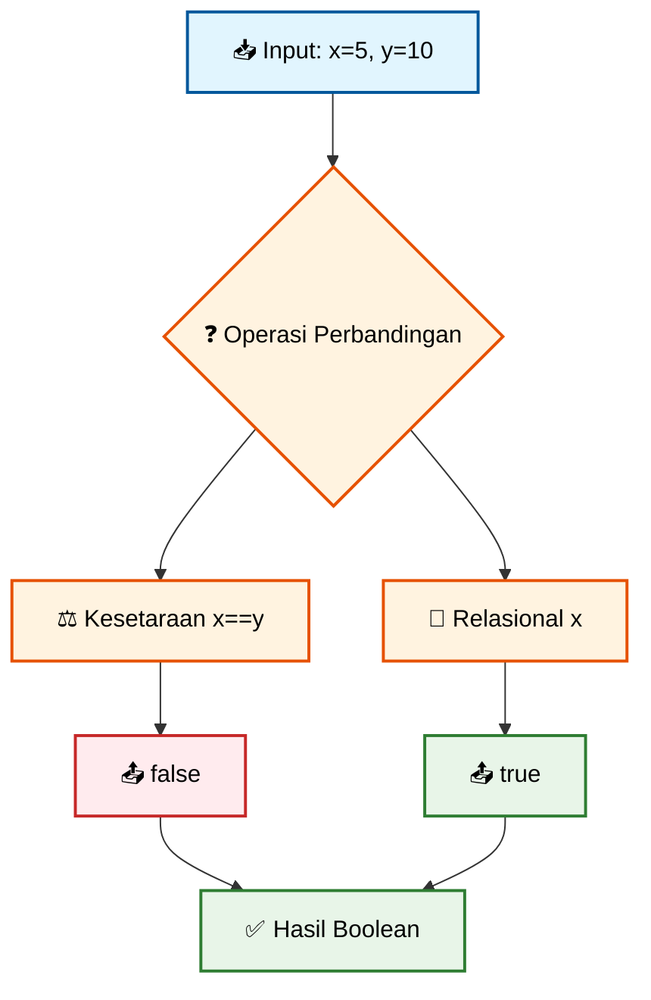

🚀 **Coba Sekarang!** 
Practice operator perbandingan dengan berbagai tipe data di: https://zapp.run/

### 🧠 Operator Logika

```dart
void main() {
  bool isActive = true;
  bool isVisible = false;
  bool hasPermission = true;
  
  // Operator logika dasar
  print('AND: isActive && isVisible = ${isActive && isVisible}');     // false
  print('OR: isActive || isVisible = ${isActive || isVisible}');      // true
  print('NOT: !isVisible = ${!isVisible}');                          // true
  
  // Kombinasi kompleks
  bool canAccess = isActive && (isVisible || hasPermission);
  print('Can access: $canAccess'); // true
  
  // Short-circuit evaluation
  print('Short-circuit: ${false && (5/0 > 1)}'); // false (tidak error!)
}
```

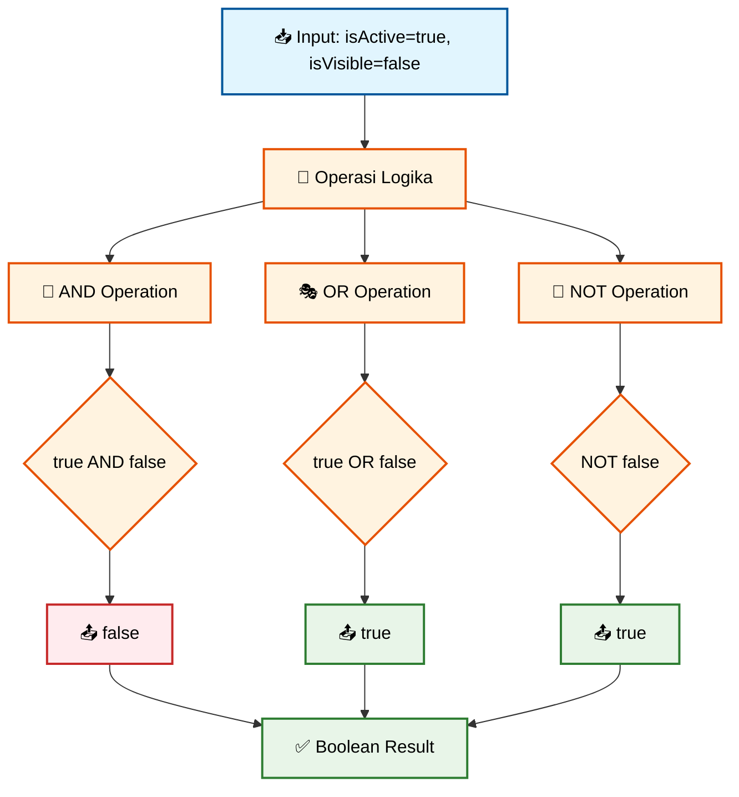

🚀 **Coba Sekarang!** 
Eksplorasi operator logika dan short-circuit evaluation di: https://zapp.run/

---

## 🔀 Pernyataan Alur Kontrol

### 🎯 If-Else Statement

Pernyataan if-else memungkinkan program membuat keputusan berdasarkan kondisi:

```dart
void main() {
  int nilai = 85;
  
  // If-else dasar
  if (nilai >= 90) {
    print('Grade: A - Excellent!');
  } else if (nilai >= 80) {
    print('Grade: B - Good work!');
  } else if (nilai >= 70) {
    print('Grade: C - Satisfactory');
  } else if (nilai >= 60) {
    print('Grade: D - Needs improvement');
  } else {
    print('Grade: F - Please study more');
  }
  
  // Ternary operator untuk kondisi sederhana
  String status = nilai >= 60 ? 'Lulus' : 'Tidak Lulus';
  print('Status: $status');
  
  // Nested conditions
  if (nilai >= 60) {
    if (nilai >= 90) {
      print('Congratulations! You got the highest grade!');
    } else {
      print('Good job! Keep improving!');
    }
  }
}
```

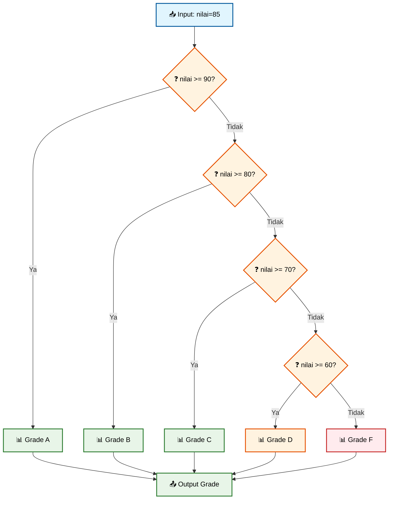

🚀 **Coba Sekarang!** 
Buat sistem grading yang lebih kompleks di: https://zapp.run/

### 🔄 For Loop

Loop for digunakan untuk mengulang tindakan dengan jumlah iterasi yang sudah diketahui:

```dart
void main() {
  // Traditional for loop
  print('=== Counting 1 to 5 ===');
  for (int i = 1; i <= 5; i++) {
    print('Count: $i');
  }
  
  // For-in loop dengan List
  print('\n=== Daftar Buah ===');
  List<String> buah = ['apel', 'pisang', 'jeruk', 'mangga'];
  for (String item in buah) {
    print('🍎 $item');
  }
  
  // For loop dengan step berbeda
  print('\n=== Bilangan Genap ===');
  for (int i = 2; i <= 10; i += 2) {
    print('Even: $i');
  }
  
  // Nested loops
  print('\n=== Tabel Perkalian ===');
  for (int i = 1; i <= 3; i++) {
    for (int j = 1; j <= 3; j++) {
      print('$i x $j = ${i * j}');
    }
  }
}
```

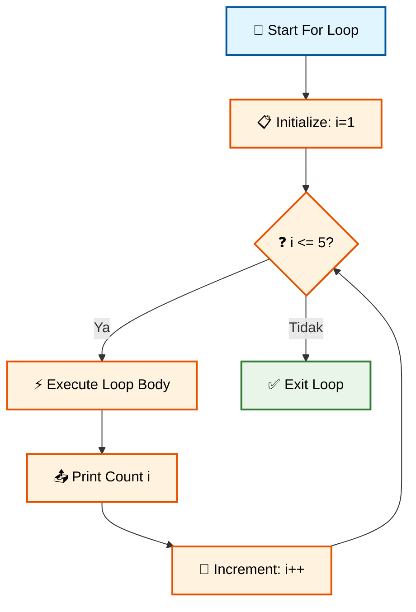

🚀 **Coba Sekarang!** 
Buat berbagai pattern dengan for loop di: https://zapp.run/

### 🌀 While Loop dan Break/Continue

While loop mengulang selama kondisi masih true:

```dart
void main() {
  // While loop dasar
  print('=== Countdown ===');
  int countdown = 5;
  while (countdown > 0) {
    print('⏰ $countdown detik...');
    countdown--;
  }
  print('🚀 Launch!');
  
  // Do-while loop
  print('\n=== Menu Selector ===');
  int menu = 0;
  do {
    menu++;
    print('Menu option: $menu');
  } while (menu < 3);
  
  // Break dan Continue
  print('\n=== Processing Numbers 1-10 ===');
  for (int i = 1; i <= 10; i++) {
    if (i == 3) {
      print('⏭️ Skipping number $i');
      continue; // Skip ke iterasi berikutnya
    }
    
    if (i == 8) {
      print('🛑 Stopping at number $i');
      break; // Keluar dari loop
    }
    
    print('✅ Processing number $i');
  }
  
  print('Loop finished!');
}
```

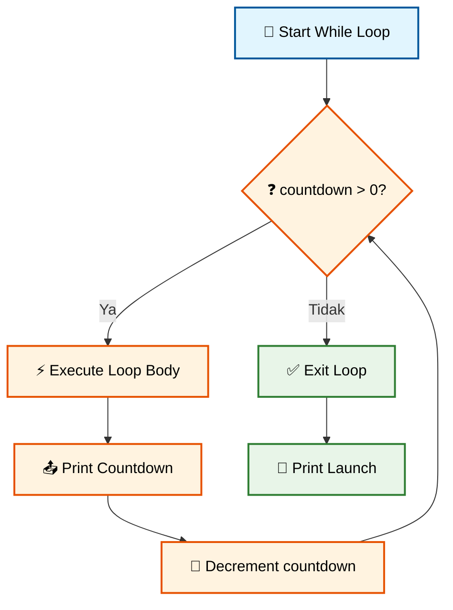

🚀 **Coba Sekarang!** 
Practice while loop dan control statements di: https://zapp.run/

---

## ⚡ Fungsi di Dart

### 📝 Sintaks Fungsi Dasar

Fungsi adalah blok kode yang dapat digunakan berulang kali:

```dart
void main() {
  // Memanggil berbagai fungsi
  sapa();
  String pesan = buatSalam('Alice');
  print(pesan);
  
  int hasil = tambah(5, 3);
  print('5 + 3 = $hasil');
  
  double luas = hitungLuasLingkaran(7.0);
  print('Luas lingkaran: ${luas.toStringAsFixed(2)}');
}

// Fungsi tanpa parameter dan return value
void sapa() {
  print('👋 Hello, World!');
}

// Fungsi dengan parameter dan return value
String buatSalam(String nama) {
  return '🎉 Selamat datang, $nama!';
}

// Fungsi dengan multiple parameters
int tambah(int a, int b) {
  return a + b;
}

// Fungsi dengan type inference
hitungLuasLingkaran(double radius) {
  const double pi = 3.14159;
  return pi * radius * radius;
}
```

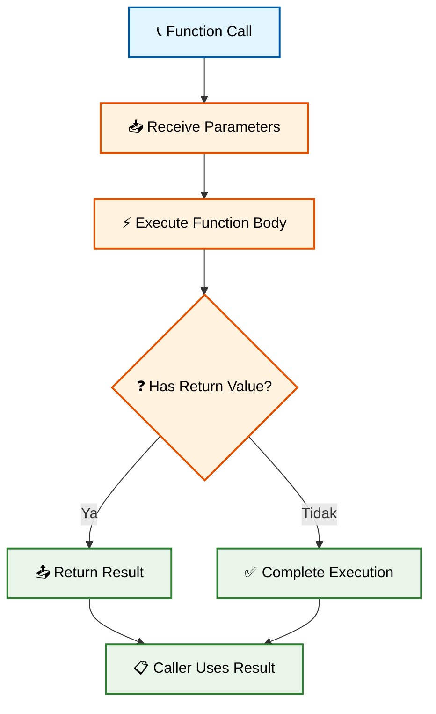

🚀 **Coba Sekarang!** 
Buat fungsi-fungsi matematika sederhana di: https://zapp.run/

### 🎯 Parameter Fleksibel di Dart

Dart menyediakan berbagai cara untuk mendefinisikan parameter fungsi:

```dart
void main() {
  // Required positional parameters
  print(formatNama('John', 'Doe'));
  
  // Optional positional parameters
  print(salamUser('Alice'));
  print(salamUser('Bob', 'Dr.'));
  
  // Named parameters
  buatProfil(
    email: 'alice@example.com',
    nama: 'Alice Smith',
    umur: 25,
  );
  
  // Mixed parameters
  String biodata = buatBiodata('Charlie', umur: 30, kota: 'Jakarta');
  print(biodata);
}

// Required positional parameters
String formatNama(String depan, String belakang) {
  return '$depan $belakang';
}

// Optional positional parameters dengan default value
String salamUser(String nama, [String? gelar]) {
  if (gelar != null) {
    return 'Hello $gelar $nama!';
  }
  return 'Hello $nama!';
}

// Named parameters
void buatProfil({
  required String email,    // Wajib diisi
  String? nama,            // Optional, bisa null
  int umur = 18,           // Optional dengan default value
}) {
  print('=== PROFIL USER ===');
  print('Email: $email');
  print('Nama: ${nama ?? 'Belum diisi'}');
  print('Umur: $umur tahun');
}

// Kombinasi positional dan named parameters
String buatBiodata(String nama, {int? umur, String? kota}) {
  String bio = 'Nama: $nama';
  if (umur != null) bio += ', Umur: $umur';
  if (kota != null) bio += ', Kota: $kota';
  return bio;
}
```

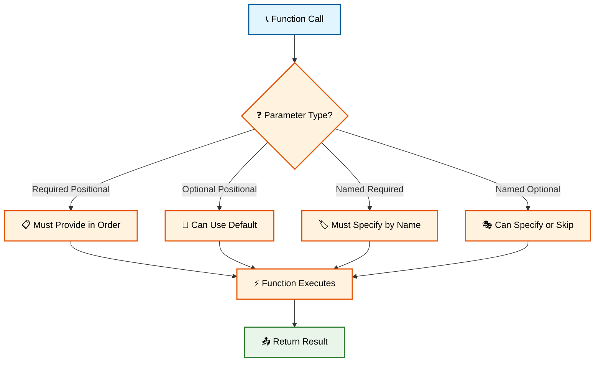

🚀 **Coba Sekarang!** 
Eksperimen dengan berbagai jenis parameter di: https://zapp.run/

### 🏹 Arrow Function

Untuk fungsi sederhana dengan satu ekspresi, Dart menyediakan syntax arrow:

```dart
void main() {
  // Contoh penggunaan arrow functions
  print('Square of 5: ${kuadrat(5)}');
  print('Is 8 even? ${isGenap(8)}');
  print('Currency: ${formatMata(1299.50)}');
  print('Full name: ${namaLengkap('John', 'Doe')}');
  
  // Arrow function dalam collection operations
  List<int> numbers = [1, 2, 3, 4, 5];
  var kuadratList = numbers.map((n) => n * n).toList();
  print('Squares: $kuadratList');
  
  var genapList = numbers.where((n) => n % 2 == 0).toList();
  print('Even numbers: $genapList');
}

// Traditional function
int kuadratTraditional(int n) {
  return n * n;
}

// Arrow function equivalent
int kuadrat(int n) => n * n;

// Lebih banyak contoh arrow functions
bool isGenap(int n) => n % 2 == 0;
String formatMata(double amount) => 'Rp ${amount.toStringAsFixed(0)}';
String namaLengkap(String depan, String belakang) => '$depan $belakang';
double luasLingkaran(double r) => 3.14159 * r * r;

// Arrow function dengan conditional
String statusLulus(int nilai) => nilai >= 60 ? 'Lulus' : 'Tidak Lulus';

// Arrow function dengan multiple operations (gunakan traditional jika kompleks)
String infoMahasiswa(String nama, int nilai) => 
    '$nama: ${nilai}pt (${nilai >= 60 ? 'Lulus' : 'Tidak Lulus'})';
```

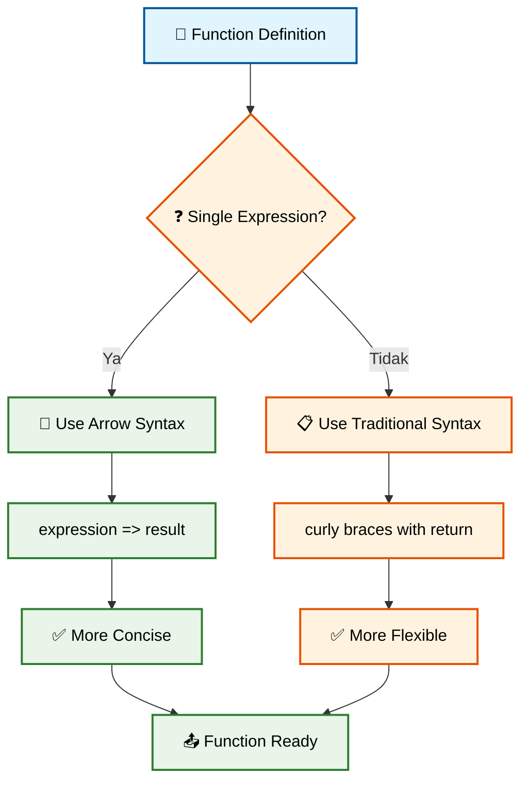

🚀 **Coba Sekarang!** 
Practice arrow functions dan collection operations di: https://zapp.run/

---

## 📦 Koleksi Data

### 📋 List - Koleksi Terurut

List menyimpan koleksi item yang terurut dan memungkinkan duplikasi:

```dart
void main() {
  // Membuat List
  List<String> buah = ['apel', 'pisang', 'jeruk'];
  var angka = [1, 2, 3, 4, 5];
  List<dynamic> campuran = [1, 'hello', true, 3.14];
  
  print('Original fruits: $buah');
  
  // Menambah elemen
  buah.add('mangga');                    // Tambah di akhir
  buah.addAll(['anggur', 'kiwi']);      // Tambah multiple
  buah.insert(1, 'strawberry');         // Insert di index tertentu
  print('After additions: $buah');
  
  // Mengakses elemen
  print('First fruit: ${buah.first}');
  print('Last fruit: ${buah.last}');
  print('Fruit at index 2: ${buah[2]}');
  print('Length: ${buah.length}');
  
  // Menghapus elemen
  buah.remove('pisang');               // Hapus berdasarkan value
  buah.removeAt(0);                    // Hapus berdasarkan index
  print('After removals: $buah');
  
  // Operasi pencarian dan iterasi
  print('Contains apel? ${buah.contains('apel')}');
  print('Index of jeruk: ${buah.indexOf('jeruk')}');
  
  // Iterasi dengan berbagai cara
  print('\n=== Iterating List ===');
  for (int i = 0; i < buah.length; i++) {
    print('[$i]: ${buah[i]}');
  }
  
  // Advanced operations
  var upperFruits = buah.map((f) => f.toUpperCase()).toList();
  print('Uppercase: $upperFruits');
}
```

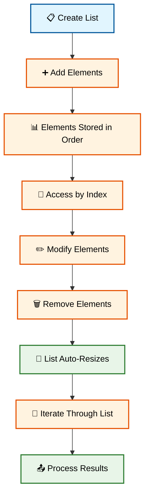

🚀 **Coba Sekarang!** 
Eksplorasi operasi List yang lengkap di: https://zapp.run/

### 🎯 Set - Koleksi Unik

Set menyimpan elemen unik tanpa duplikasi:

```dart
void main() {
  // Membuat Set
  Set<int> angkaUnik = {1, 2, 3, 4, 5};
  var warna = <String>{'merah', 'biru', 'hijau'};
  
  print('Original set: $angkaUnik');
  
  // Menambah elemen (duplikasi akan diabaikan)
  angkaUnik.add(3);           // Tidak akan ditambah
  angkaUnik.add(6);           // Akan ditambah
  angkaUnik.addAll([7, 8, 3]); // Hanya 7 dan 8 yang ditambah
  print('After additions: $angkaUnik');
  
  // Operasi Set matematika
  var set1 = {1, 2, 3, 4};
  var set2 = {3, 4, 5, 6};
  
  print('Set 1: $set1');
  print('Set 2: $set2');
  print('Union (gabungan): ${set1.union(set2)}');
  print('Intersection (irisan): ${set1.intersection(set2)}');
  print('Difference (selisih): ${set1.difference(set2)}');
  
  // Membership testing - sangat cepat!
  print('Contains 3? ${set1.contains(3)}');
  print('Length: ${set1.length}');
  
  // Konversi List ke Set (menghilangkan duplikasi)
  var listDenganDuplikasi = [1, 2, 2, 3, 3, 4, 1];
  var setUnik = listDenganDuplikasi.toSet();
  print('Original list: $listDenganDuplikasi');
  print('As unique set: $setUnik');
  print('Back to list: ${setUnik.toList()}');
  
  // Practical example: menghilangkan duplikasi
  List<String> namaSiswa = ['Alice', 'Bob', 'Alice', 'Charlie', 'Bob'];
  Set<String> namaUnik = namaSiswa.toSet();
  print('\nDaftar siswa: $namaSiswa');
  print('Siswa unik: $namaUnik');
  print('Jumlah siswa unik: ${namaUnik.length}');
}
```

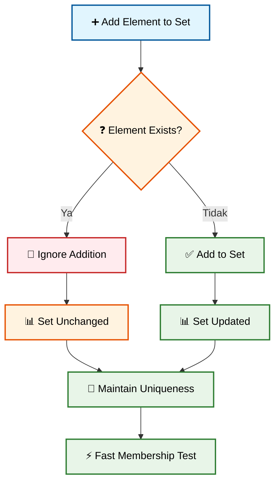

🚀 **Coba Sekarang!** 
Practice Set operations dan mathematical operations di: https://zapp.run/

### 🗝️ Map - Koleksi Key-Value

Map menyimpan data sebagai pasangan key-value:

```dart
void main() {
  // Membuat Map
  Map<String, int> nilaiSiswa = {
    'Alice': 95,
    'Bob': 87,
    'Charlie': 92,
  };
  
  var profilUser = <String, dynamic>{
    'nama': 'John Doe',
    'umur': 25,
    'email': 'john@example.com',
    'aktif': true,
  };
  
  print('Student grades: $nilaiSiswa');
  
  // Mengakses nilai
  print('Alice grade: ${nilaiSiswa['Alice']}');
  print('Non-existent: ${nilaiSiswa['David']}'); // null
  
  // Menambah dan mengupdate
  nilaiSiswa['David'] = 89;        // Tambah baru
  nilaiSiswa['Alice'] = 98;        // Update existing
  print('Updated grades: $nilaiSiswa');
  
  // Properties dan methods Map
  print('Keys: ${nilaiSiswa.keys}');
  print('Values: ${nilaiSiswa.values}');
  print('Contains key Alice? ${nilaiSiswa.containsKey('Alice')}');
  print('Contains value 87? ${nilaiSiswa.containsValue(87)}');
  print('Length: ${nilaiSiswa.length}');
  print('Is empty? ${nilaiSiswa.isEmpty}');
  
  // Iterasi Map
  print('\n=== All Student Grades ===');
  for (var entry in nilaiSiswa.entries) {
    print('${entry.key}: ${entry.value}');
  }
  
  // Alternative iteration
  nilaiSiswa.forEach((nama, nilai) {
    print('$nama scored $nilai points');
  });
  
  // Safe access dengan null-aware operators
  var gradeWithDefault = nilaiSiswa['Unknown'] ?? 0;
  print('Grade with default: $gradeWithDefault');
  
  // Practical example: counting occurrences
  String text = 'hello world hello dart';
  Map<String, int> wordCount = {};
  
  for (String word in text.split(' ')) {
    wordCount[word] = (wordCount[word] ?? 0) + 1;
  }
  
  print('\nWord frequency: $wordCount');
}
```

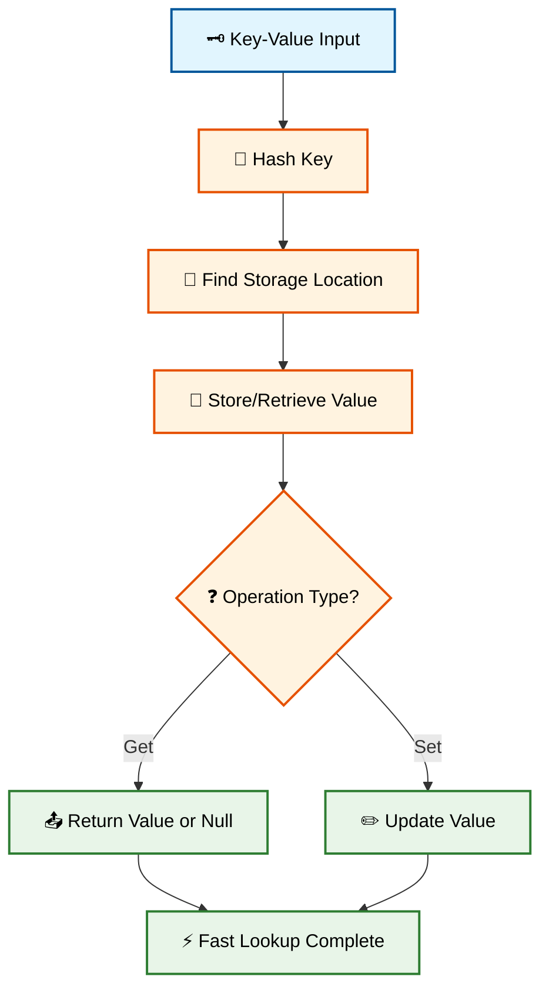

🚀 **Coba Sekarang!** 
Eksplorasi Map operations dan real-world examples di: https://zapp.run/

---

## 💻 Praktikum 2: Tantangan Algoritmik di Dart

### 🎯 Challenge 1: Number Analyzer

```dart
void main() {
  // Test data
  List<int> numbers = [34, 12, 89, 23, 67, 91, 45, 23, 89];
  
  print('=== NUMBER ANALYZER ===');
  print('Numbers: $numbers');
  
  // Find largest
  int largest = findLargest(numbers);
  print('Largest: $largest');
  
  // Find smallest
  int smallest = findSmallest(numbers);
  print('Smallest: $smallest');
  
  // Calculate average
  double average = calculateAverage(numbers);
  print('Average: ${average.toStringAsFixed(2)}');
  
  // Find duplicates
  Set<int> duplicates = findDuplicates(numbers);
  print('Duplicates: $duplicates');
  
  // Count occurrences
  Map<int, int> occurrences = countOccurrences(numbers);
  print('Occurrences: $occurrences');
}

// Function to find largest number
int findLargest(List<int> numbers) {
  if (numbers.isEmpty) {
    throw ArgumentError('List cannot be empty');
  }
  
  int largest = numbers[0];
  for (int number in numbers) {
    if (number > largest) {
      largest = number;
    }
  }
  return largest;
}

// Function to find smallest number
int findSmallest(List<int> numbers) {
  if (numbers.isEmpty) return 0;
  
  int smallest = numbers[0];
  for (int number in numbers) {
    if (number < smallest) {
      smallest = number;
    }
  }
  return smallest;
}

// Function to calculate average
double calculateAverage(List<int> numbers) {
  if (numbers.isEmpty) return 0.0;
  
  int sum = 0;
  for (int number in numbers) {
    sum += number;
  }
  return sum / numbers.length;
}

// Function to find duplicates
Set<int> findDuplicates(List<int> numbers) {
  Set<int> seen = {};
  Set<int> duplicates = {};
  
  for (int number in numbers) {
    if (seen.contains(number)) {
      duplicates.add(number);
    } else {
      seen.add(number);
    }
  }
  return duplicates;
}

// Function to count occurrences
Map<int, int> countOccurrences(List<int> numbers) {
  Map<int, int> count = {};
  for (int number in numbers) {
    count[number] = (count[number] ?? 0) + 1;
  }
  return count;
}
```

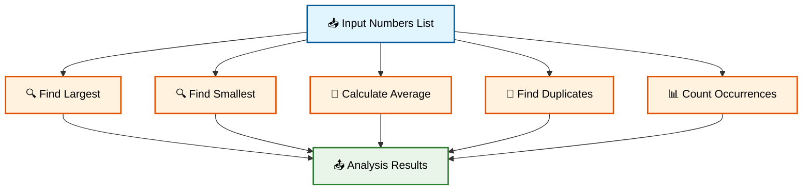

🚀 **Coba Sekarang!** 
Implementasikan number analyzer dan test dengan data berbeda di: https://zapp.run/

### 📝 Challenge 2: Text Processing Engine

```dart
void main() {
  String sampleText = '''
  Dart adalah bahasa pemrograman yang dikembangkan oleh Google.
  Dart digunakan untuk mengembangkan aplikasi mobile, web, dan desktop.
  Flutter framework menggunakan Dart sebagai bahasa utamanya.
  Dart memiliki fitur null safety yang membantu mencegah runtime errors.
  ''';
  
  print('=== TEXT PROCESSING ENGINE ===');
  print('Original text:');
  print(sampleText);
  
  // Word frequency analysis
  Map<String, int> wordFreq = analyzeWordFrequency(sampleText);
  print('\n=== Word Frequency ===');
  displayWordFrequency(wordFreq);
  
  // Text statistics
  Map<String, int> stats = getTextStatistics(sampleText);
  print('\n=== Text Statistics ===');
  stats.forEach((key, value) {
    print('$key: $value');
  });
  
  // Find longest words
  List<String> longestWords = findLongestWords(sampleText, 3);
  print('\nLongest words: $longestWords');
}

// Analyze word frequency
Map<String, int> analyzeWordFrequency(String text) {
  // Clean text: lowercase, remove punctuation, split by spaces
  String cleanedText = text
      .toLowerCase()
      .replaceAll(RegExp(r'[^\w\s]'), '')
      .replaceAll(RegExp(r'\s+'), ' ')
      .trim();
  
  List<String> words = cleanedText
      .split(' ')
      .where((word) => word.isNotEmpty)
      .toList();
  
  Map<String, int> frequency = {};
  
  for (String word in words) {
    frequency[word] = (frequency[word] ?? 0) + 1;
  }
  
  return frequency;
}

// Display word frequency sorted by frequency
void displayWordFrequency(Map<String, int> wordFreq) {
  // Convert to list and sort by frequency (descending)
  var sortedEntries = wordFreq.entries.toList()
    ..sort((a, b) => b.value.compareTo(a.value));
  
  for (var entry in sortedEntries) {
    print('  ${entry.key}: ${entry.value}');
  }
}

// Get comprehensive text statistics
Map<String, int> getTextStatistics(String text) {
  int charCount = text.length;
  int charCountNoSpaces = text.replaceAll(' ', '').length;
  int wordCount = text.split(RegExp(r'\s+')).where((w) => w.isNotEmpty).length;
  int sentenceCount = text.split(RegExp(r'[.!?]')).where((s) => s.trim().isNotEmpty).length;
  int paragraphCount = text.split('\n').where((p) => p.trim().isNotEmpty).length;
  
  return {
    'Characters': charCount,
    'Characters (no spaces)': charCountNoSpaces,
    'Words': wordCount,
    'Sentences': sentenceCount,
    'Paragraphs': paragraphCount,
  };
}

// Find n longest words
List<String> findLongestWords(String text, int n) {
  String cleanedText = text
      .toLowerCase()
      .replaceAll(RegExp(r'[^\w\s]'), '');
  
  Set<String> uniqueWords = cleanedText
      .split(RegExp(r'\s+'))
      .where((word) => word.isNotEmpty)
      .toSet();
  
  var sortedWords = uniqueWords.toList()
    ..sort((a, b) => b.length.compareTo(a.length));
  
  return sortedWords.take(n).toList();
}
```

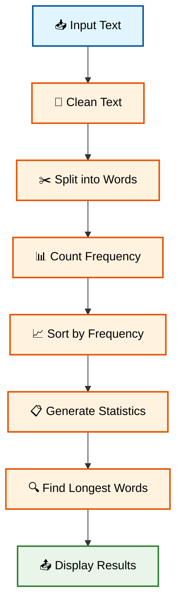

🚀 **Coba Sekarang!** 
Build your own text processing engine di: https://zapp.run/

### 🎓 Challenge 3: Student Grade Management System

```dart
void main() {
  var gradeSystem = GradeManagementSystem();
  
  // Add students with grades
  gradeSystem.addStudent('Alice', [95, 87, 92, 88, 94]);
  gradeSystem.addStudent('Bob', [78, 82, 85, 79, 81]);
  gradeSystem.addStudent('Charlie', [92, 95, 88, 91, 89]);
  gradeSystem.addStudent('Diana', [88, 91, 86, 93, 90]);
  gradeSystem.addStudent('Eve', [76, 84, 82, 88, 85]);
  
  // Display comprehensive analysis
  gradeSystem.displayCompleteAnalysis();
}

class GradeManagementSystem {
  Map<String, List<int>> studentGrades = {};
  
  // Add student with grades
  void addStudent(String name, List<int> grades) {
    studentGrades[name] = grades;
  }
  
  // Calculate average grade for a student
  double calculateStudentAverage(String name) {
    List<int>? grades = studentGrades[name];
    if (grades == null || grades.isEmpty) return 0.0;
    
    int sum = grades.fold(0, (prev, grade) => prev + grade);
    return sum / grades.length;
  }
  
  // Get letter grade based on average
  String getLetterGrade(double average) {
    if (average >= 90) return 'A';
    if (average >= 80) return 'B';
    if (average >= 70) return 'C';
    if (average >= 60) return 'D';
    return 'F';
  }
  
  // Find student with highest average
  String findTopStudent() {
    if (studentGrades.isEmpty) return 'No students';
    
    String topStudent = '';
    double topAverage = 0.0;
    
    for (String name in studentGrades.keys) {
      double average = calculateStudentAverage(name);
      if (average > topAverage) {
        topAverage = average;
        topStudent = name;
      }
    }
    
    return '$topStudent (${topAverage.toStringAsFixed(2)})';
  }
  
  // Calculate class average
  double calculateClassAverage() {
    if (studentGrades.isEmpty) return 0.0;
    
    double totalSum = 0.0;
    int totalStudents = 0;
    
    for (String name in studentGrades.keys) {
      totalSum += calculateStudentAverage(name);
      totalStudents++;
    }
    
    return totalSum / totalStudents;
  }
  
  // Get grade distribution
  Map<String, int> getGradeDistribution() {
    Map<String, int> distribution = {
      'A': 0, 'B': 0, 'C': 0, 'D': 0, 'F': 0
    };
    
    for (String name in studentGrades.keys) {
      double average = calculateStudentAverage(name);
      String letterGrade = getLetterGrade(average);
      distribution[letterGrade] = (distribution[letterGrade] ?? 0) + 1;
    }
    
    return distribution;
  }
  
  // Find students at risk (below 70)
  List<String> findStudentsAtRisk() {
    List<String> atRisk = [];
    
    for (String name in studentGrades.keys) {
      double average = calculateStudentAverage(name);
      if (average < 70) {
        atRisk.add('$name (${average.toStringAsFixed(1)})');
      }
    }
    
    return atRisk;
  }
  
  // Display complete analysis
  void displayCompleteAnalysis() {
    print('=== 📚 GRADE MANAGEMENT SYSTEM ===\n');
    
    // Individual student performance
    print('🎓 Individual Student Performance:');
    print('-' * 40);
    for (String name in studentGrades.keys) {
      double average = calculateStudentAverage(name);
      String letterGrade = getLetterGrade(average);
      print('$name: ${average.toStringAsFixed(1)}% ($letterGrade)');
    }
    
    // Class statistics
    print('\n📊 Class Statistics:');
    print('-' * 40);
    print('Class Average: ${calculateClassAverage().toStringAsFixed(2)}%');
    print('Top Performer: ${findTopStudent()}');
    print('Total Students: ${studentGrades.length}');
    
    // Grade distribution
    print('\n📈 Grade Distribution:');
    print('-' * 40);
    var distribution = getGradeDistribution();
    distribution.forEach((grade, count) {
      print('Grade $grade: $count students');
    });
    
    // Students at risk
    var atRisk = findStudentsAtRisk();
    if (atRisk.isNotEmpty) {
      print('\n⚠️  Students at Risk (< 70%):');
      print('-' * 40);
      for (String student in atRisk) {
        print('• $student');
      }
    } else {
      print('\n✅ All students performing well!');
    }
  }
}
```

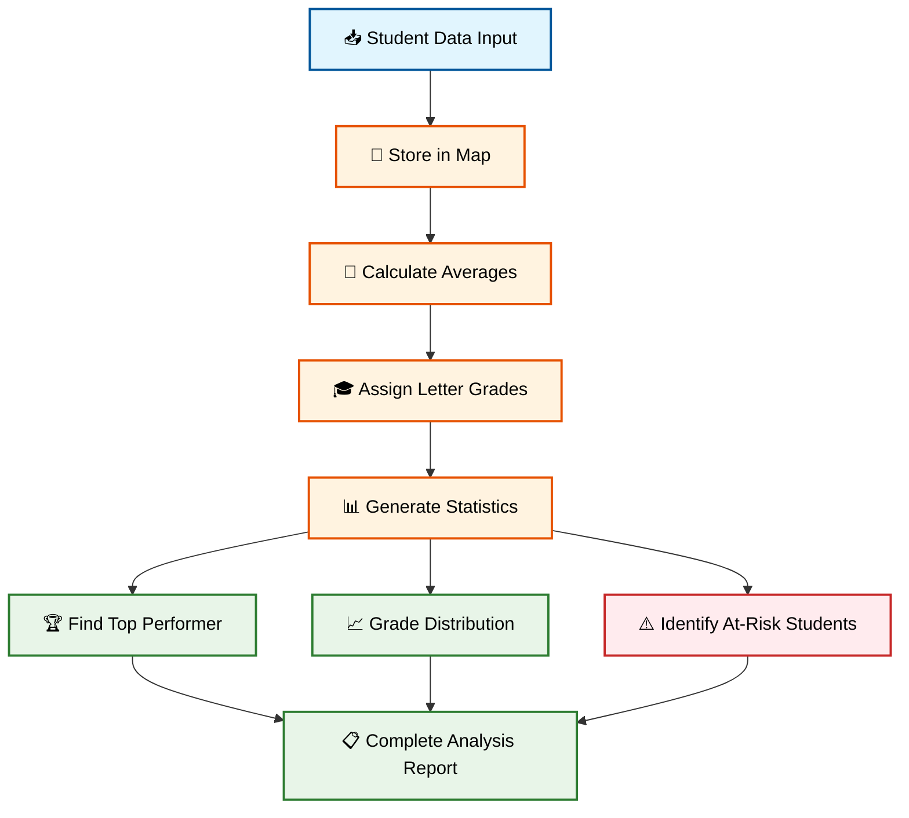

🚀 **Coba Sekarang!** 
Buat sistem manajemen nilai yang lebih canggih di: https://zapp.run/

---

## 📚 Glosarium

| **Term** | **Definisi** | **Contoh** |
|----------|--------------|------------|
| **Arrow Function** | Sintaks singkat untuk fungsi dengan satu ekspresi menggunakan `=>` | `int square(int n) => n * n` |
| **Break** | Statement untuk keluar dari loop atau switch sebelum selesai | `if (i == 5) break;` |
| **Collection** | Struktur data yang menyimpan multiple values | List, Set, Map |
| **Continue** | Statement untuk skip iterasi saat ini dan lanjut ke berikutnya | `if (i % 2 == 0) continue;` |
| **Control Flow** | Urutan eksekusi statement berdasarkan kondisi | if-else, loops, switch |
| **For-in Loop** | Loop untuk iterasi melalui elemen collection | `for (item in list)` |
| **Function** | Blok kode reusable yang melakukan tugas tertentu | `void printHello() {...}` |
| **List** | Collection ordered yang memungkinkan duplikasi | `[1, 2, 3, 2]` |
| **Map** | Collection key-value pairs untuk lookup cepat | `{'name': 'John', 'age': 25}` |
| **Named Parameters** | Parameter yang dipanggil dengan menyebutkan nama | `createUser(name: 'John')` |
| **Null-aware Operators** | Operator untuk menangani nullable values safely | `??`, `?.`, `??=` |
| **Operator** | Symbol untuk melakukan operasi pada values | `+`, `==`, `&&`, `~/` |
| **Optional Parameters** | Parameter yang tidak wajib disediakan saat pemanggilan | `[String? title]` |
| **Positional Parameters** | Parameter yang dipanggil berdasarkan urutan | `add(5, 3)` |
| **Set** | Collection yang hanya menyimpan unique elements | `{1, 2, 3}` |
| **Ternary Operator** | Operator kondisional singkat | `condition ? true : false` |
| **Type Inference** | Kemampuan Dart menentukan tipe secara otomatis | `var name = 'John'` // String |
| **While Loop** | Loop yang berjalan selama kondisi true | `while (count > 0)` |

---

## 📖 Referensi

### 📚 Dokumentasi Resmi
1. **Dart Language Tour**. (2025). *Dart.dev*. https://dart.dev/language
2. **Dart Operators**. (2025). *Dart.dev*. https://dart.dev/language/operators
3. **Dart Control Flow**. (2025). *Dart.dev*. https://dart.dev/language/branches
4. **Dart Functions**. (2025). *Dart.dev*. https://dart.dev/language/functions
5. **Dart Collections**. (2025). *Dart.dev*. https://dart.dev/language/collections

### 📊 Tutorial dan Guides
6. GeeksforGeeks. (2025). *Dart Collections Tutorial*. https://www.geeksforgeeks.org/dart/dart-collections/
7. Flutter Community. (2025). *Dart Functions Guide*. https://flutter.dev/docs/dart-functions
8. DartPad Team. (2025). *Interactive Dart Examples*. https://dartpad.dev

### 📖 Academic Sources
9. Bracha, G., & Meijer, E. (2015). *The Dart Programming Language*. Addison-Wesley Professional.
10. IEEE Computer Society. (2024). "Control Flow Patterns in Modern Programming Languages." *IEEE Software*, 41(3), 45-52.

### 🌐 Online Resources
11. **Zapp.run Flutter Playground**. (2025). https://zapp.run
12. **Dart API Documentation**. (2025). https://api.dart.dev
13. **Effective Dart Guidelines**. (2025). https://dart.dev/effective-dart

---

## 📝 Catatan Pengajar

### 🎯 Assessment Indicators

**Berhasil jika mahasiswa dapat:**
- ✅ Menggunakan semua jenis operator dengan benar dan memahami prioritasnya
- ✅ Menulis control flow yang logis dan efisien untuk berbagai kasus
- ✅ Membuat fungsi dengan parameter yang tepat dan readable
- ✅ Memilih collection type yang sesuai untuk masalah spesifik

### 🎪 Tips Pengajaran

1. **🔄 Practice Loop**: Berikan banyak latihan hands-on dengan variasi data
2. **🎯 Real Examples**: Gunakan contoh nyata seperti grade management system
3. **🚫 Common Mistakes**: Highlight error umum seperti infinite loops
4. **🏗️ Building Blocks**: Tekankan bahwa ini adalah fondasi untuk OOP nanti

### ⚠️ Common Pitfalls

- **Infinite loops**: Lupa increment counter dalam while loop
- **Index out of bounds**: Akses List dengan index yang tidak valid
- **Parameter confusion**: Mixing positional dan named parameters
- **Collection type selection**: Menggunakan List ketika Set lebih tepat

---

## 🎯 Siap untuk Minggu Depan!

**Minggu 3 Preview: Pemrograman Berorientasi Objek (OOP) di Dart**

🔮 **Coming Next:**
- 🏗️ **Classes & Objects**: Modeling real-world entities
- 🔒 **Encapsulation**: Data hiding dan access control
- 🧬 **Inheritance**: Code reuse through class hierarchy
- 🎭 **Polymorphism**: Multiple forms of same interface
- 🔧 **Advanced Features**: Abstract classes, mixins, interfaces

**📚 Preparation:**
- Master semua konsep functions dan collections
- Practice algorithmic thinking dari praktikum
- Review konsep modular programming

---

*🎓 Excellent progress! Anda sudah menguasai building blocks penting untuk programming yang solid!*
