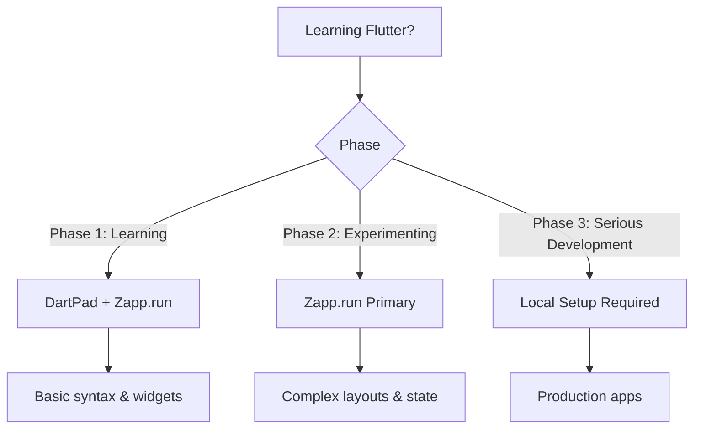

# 📱 Minggu 4: Pengaturan Lingkungan Flutter dan Aplikasi Pertama

   

## 🎯 Tujuan Pembelajaran

Setelah menyelesaikan materi ini, mahasiswa diharapkan mampu:
- 🛠️ Menginstal dan mengkonfigurasi Flutter SDK pada berbagai platform
- 💻 Setup IDE untuk pengembangan Flutter
- ⚙️ Melakukan konfigurasi platform-specific untuk Android dan iOS
- 📋 Memahami struktur proyek Flutter
- 🔥 Menggunakan Hot Reload dan Hot Restart secara efektif
- 🚀 Membuat aplikasi Flutter pertama

---

## 📋 Daftar Isi

1. [Instalasi Flutter SDK](#-1-instalasi-flutter-sdk)
2. [Setup IDE](#-2-setup-ide)
3. [Konfigurasi Platform-Specific](#-3-konfigurasi-platform-specific)
4. [Verifikasi Instalasi](#-4-verifikasi-instalasi)
5. [Membuat Proyek Flutter Pertama](#-5-membuat-proyek-flutter-pertama)
6. [Struktur Direktori Flutter](#-6-struktur-direktori-flutter)
7. [Hot Reload vs Hot Restart](#-7-hot-reload-vs-hot-restart)
8. [Praktikum: Hello World](#-8-praktikum-hello-world)
9. [Troubleshooting](#-troubleshooting)
10. [Alternatif Testing Online](#-alternatif-testing-online)

---

## 🛠️ 1. Instalasi Flutter SDK

Flutter SDK adalah kumpulan alat pengembangan yang diperlukan untuk membuat aplikasi Flutter. Mari kita pelajari cara instalasi untuk berbagai sistem operasi.

### 📋 System Requirements

| Platform | Minimum Requirements |
|----------|---------------------|
| **Windows** | Windows 10/11 64-bit, 1.65 GB storage |
| **macOS** | macOS 12+ (Monterey), Xcode Command Line Tools |
| **Linux** | Ubuntu 22.04+ atau Debian 11+, 64-bit x86_64 |

### 🪟 Windows Installation

#### Langkah 1: Prerequisites
🔹 **Git for Windows** (version 2.0+)
```bash
# Download dari: https://git-scm.com/downloads/win
# Pastikan Git terinstall dengan menjalankan:
git --version
```

🔹 **Visual Studio 2022** (untuk desktop development)
- Install workload "Desktop development with C++"
- ⚠️ **Catatan**: Berbeda dengan Visual Studio Code

#### Langkah 2: Download dan Install Flutter
📥 **Method 1: Via VS Code (Recommended)**
```bash
# 1. Install VS Code dan Flutter extension
# 2. Buka Command Palette (Ctrl + Shift + P)
# 3. Ketik "flutter" dan pilih "Flutter: New Project"
# 4. Klik "Download SDK" jika Flutter belum terinstall
# 5. Pilih direktori instalasi (hindari C:\Program Files\)
```

📥 **Method 2: Manual Installation**
```powershell
# 1. Buat direktori instalasi
mkdir C:\Users\%USERNAME%\develop

# 2. Extract Flutter SDK ke direktori tersebut
# Download dari: https://docs.flutter.dev/get-started/install/windows
# Extract ke: C:\Users\%USERNAME%\develop\flutter
```

#### Langkah 3: Environment Variables Setup
🌍 **Konfigurasi PATH:**

Pengaturan PATH environment variable sangat penting karena memungkinkan sistem operasi menemukan command Flutter dari direktori mana pun. Tanpa ini, Anda hanya bisa menjalankan Flutter dari direktori instalasi saja.

💻 **Step-by-Step PATH Configuration:**
```
📋 **Environment Variables Setup Process:**
🎯 START: Buka System Properties
  ↓
1️⃣ Windows + Pause → Advanced System Settings
  ↓
2️⃣ Advanced Tab → Environment Variables Button
  ↓
3️⃣ User Variables Section → Find "Path" entry
  ↓
4️⃣ Edit Path → New → Add: %USERPROFILE%\develop\flutter\bin
  ↓
5️⃣ Move Flutter entry to TOP of list (important!)
  ↓
6️⃣ OK → OK → OK (save all dialogs)
  ↓
7️⃣ Restart Command Prompt/PowerShell
  ↓
✅ END: Test with flutter --version
```

🚀 **Coba Sekarang!** 
Buka Command Prompt baru dan test command: `flutter --version`

### 🍎 macOS Installation

#### Langkah 1: Prerequisites
🔹 **Xcode Command Line Tools**
```bash
xcode-select --install
```

🔹 **Rosetta 2 (untuk Apple Silicon Mac)**
```bash
sudo softwareupdate --install-rosetta --agree-to-license
```

🔹 **CocoaPods (untuk iOS development)**
```bash
sudo gem install cocoapods
# Untuk Apple Silicon:
sudo gem uninstall ffi && sudo gem install ffi -- --enable-libffi-alloc
```

#### Langkah 2: Download dan Extract SDK
```bash
# 1. Buat direktori development
mkdir ~/develop

# 2. Download Flutter SDK
# Intel Macs: flutter_macos_x64_3.35.0-stable.zip
# Apple Silicon: flutter_macos_arm64_3.35.0-stable.zip

# 3. Extract SDK
unzip ~/Downloads/flutter_macos_3.35.0-stable.zip -d ~/develop/
```

#### Langkah 3: Environment Variables Setup
```bash
# 1. Buka atau buat file ~/.zshenv
nano ~/.zshenv

# 2. Tambahkan Flutter ke PATH
export PATH="$HOME/develop/flutter/bin:$PATH"

# 3. Apply perubahan
source ~/.zshenv

# 4. Verifikasi PATH
echo $PATH
```

Mari kita pahami mengapa langkah-langkah ini penting. File `.zshenv` adalah file konfigurasi shell yang memuat environment variables setiap kali terminal baru dibuka. Dengan menambahkan Flutter ke PATH, sistem operasi akan tahu di mana mencari executable Flutter sehingga Anda bisa menjalankan command `flutter` dari direktori mana pun.

📋 **macOS Environment Setup Process:**
```
🎯 START: Configure shell environment
  ↓
1️⃣ Open ~/.zshenv file → Create if doesn't exist
  ↓
2️⃣ Add export PATH line → Points to flutter/bin directory  
  ↓
3️⃣ Source the file → Reload environment variables
  ↓
4️⃣ Verify PATH contains flutter → Check with echo $PATH
  ↓
5️⃣ Test flutter command → Should show version info
  ↓
✅ END: Flutter command available globally
```

🚀 **Coba Sekarang!** 
Test setup dengan menjalankan `flutter --version` di terminal baru. Jika berhasil, Anda akan melihat informasi versi Flutter yang terinstall.

### 🐧 Linux Installation

#### Langkah 1: Prerequisites
```bash
# Update system packages
sudo apt-get update -y && sudo apt-get upgrade -y

# Install required packages
sudo apt-get install -y curl git unzip xz-utils zip libglu1-mesa

# Untuk desktop development
sudo apt-get install -y clang cmake ninja-build pkg-config libgtk-3-dev libstdc++-12-dev
```

#### Langkah 2: Download dan Extract SDK
```bash
# 1. Buat direktori development
mkdir ~/develop

# 2. Download Flutter SDK
wget https://storage.googleapis.com/flutter_infra_release/releases/stable/linux/flutter_linux_3.35.0-stable.tar.xz

# 3. Extract SDK
tar -xf ~/Downloads/flutter_linux_3.35.0-stable.tar.xz -C ~/develop/
```

#### Langkah 3: Environment Variables Setup
```bash
# Untuk Bash
echo 'export PATH="$HOME/develop/flutter/bin:$PATH"' >> ~/.bash_profile
source ~/.bash_profile

# Untuk Zsh
echo 'export PATH="$HOME/develop/flutter/bin:$PATH"' >> ~/.zshenv
source ~/.zshenv
```

Pemahaman yang perlu Anda miliki tentang shell configuration ini adalah bahwa setiap shell (Bash, Zsh, dll) memiliki file konfigurasi yang berbeda. File-file ini dibaca saat shell dimulai, sehingga environment variables yang Anda definisikan akan tersedia di setiap session terminal baru.

📋 **Linux Environment Setup Process:**
```
🎯 START: Determine your shell type
  ↓
1️⃣ Check shell: echo $SHELL → Shows /bin/bash or /bin/zsh
  ↓
2️⃣ Choose config file → .bash_profile for Bash, .zshenv for Zsh
  ↓
3️⃣ Append PATH export → Adds Flutter to existing PATH
  ↓
4️⃣ Source config file → Reloads environment without restart
  ↓
5️⃣ Verify in new terminal → flutter --version should work
  ↓
✅ END: Flutter globally accessible
```

Mengapa kita menggunakan `>>` instead of `>`? Operator `>>` menambahkan text ke akhir file tanpa menghapus isi yang sudah ada, sedangkan `>` akan menimpa seluruh isi file. Ini penting untuk menjaga konfigurasi shell yang sudah ada.

🚀 **Coba Sekarang!** 
Buka terminal baru dan jalankan `flutter --version`. Jika muncul informasi versi, setup berhasil!

---

## 💻 2. Setup IDE

### 🔧 Android Studio Setup

Android Studio adalah IDE resmi untuk pengembangan Android yang juga sangat baik untuk Flutter development.

#### Instalasi dan Konfigurasi
🔸 **Step 1: Install Android Studio**
```bash
# Download dari: https://developer.android.com/studio
# Install dengan opsi default
# Pastikan "Android Virtual Device" terseleksi
```

🔸 **Step 2: Install Flutter Plugin**
1. Buka Android Studio
2. **Windows/Linux**: File → Settings → Plugins
3. **macOS**: Android Studio → Preferences → Plugins
4. Klik tab "Marketplace"
5. Cari "Flutter" dan klik "Install"
6. Klik "Yes" untuk install Dart plugin
7. Restart Android Studio

🔸 **Step 3: Konfigurasi SDK Paths**
```
File → Settings → Languages & Frameworks → Flutter
- Set Flutter SDK path: /path/to/flutter
- Dart SDK path akan terisi otomatis
```

#### ✅ Keunggulan Android Studio untuk Flutter
- 🏗️ **Visual Layout Editor**: Tools GUI design yang advanced
- 📱 **Built-in Android Emulator**: Test langsung dalam IDE
- 🐛 **Comprehensive Debugging**: Advanced breakpoints dan variable inspection
- 🔧 **Flutter Property Editor**: Visual widget property editing
- 📊 **Flutter Inspector**: Tree view dari widget hierarchy

### 📝 VS Code Setup

VS Code adalah editor yang ringan dan sangat populer untuk pengembangan Flutter.

#### Instalasi dan Konfigurasi
🔸 **Step 1: Install VS Code**
```bash
# Download dari: https://code.visualstudio.com
# Install sesuai platform
```

🔸 **Step 2: Install Flutter Extension**
1. Buka VS Code
2. Tekan `Ctrl+Shift+X` (Windows/Linux) atau `Cmd+Shift+X` (macOS)
3. Cari "Flutter"
4. Install extension resmi "Flutter" oleh Dart-Code
5. Dart extension akan terinstall otomatis

🔸 **Step 3: Konfigurasi Flutter SDK**
```bash
# Via Command Palette
Ctrl+Shift+P → "Flutter: New Project"
# Jika diminta, pilih "Download SDK" atau "Locate SDK"
```

#### ⚙️ Recommended Settings (settings.json)
```json
{
  "dart.enableSdkFormatter": true,
  "dart.flutterHotReloadOnSave": "manual",
  "editor.formatOnSave": true,
  "editor.codeActionsOnSave": {
    "source.fixAll": true,
    "source.organizeImports": true
  },
  "dart.lineLength": 100,
  "editor.rulers": [100],
  "dart.flutterOutline": true,
  "dart.showTestCodeLens": true
}
```

#### ⚡ Keunggulan VS Code untuk Flutter
- 🚀 **Lightweight dan Fast**: Startup cepat, penggunaan memory rendah
- 🎨 **Highly Customizable**: Ribuan extensions dan themes
- 📚 **Integrated Git Support**: Built-in version control
- 🔥 **Hot Reload**: Ctrl+F5 untuk hot reload
- 💡 **IntelliSense**: Code completion dan suggestions

### 🆚 Perbandingan Android Studio vs VS Code

| Aspect | Android Studio | VS Code |
|--------|----------------|---------|
| **Memory Usage** | Tinggi (1-3GB+) | Rendah (100-500MB) |
| **Startup Time** | Lambat (30+ detik) | Cepat (2-5 detik) |
| **Debugging Tools** | Advanced visual debugger | Good debugging support |
| **Emulator Integration** | Built-in seamless | External tools required |
| **Customization** | Moderate | Highly customizable |

📝 **Rekomendasi**: Gunakan **Android Studio** untuk project besar dan debugging kompleks, **VS Code** untuk development ringan dan cepat.

---

## ⚙️ 3. Konfigurasi Platform-Specific

### 🤖 Android SDK Setup

#### Langkah 1: Android Studio SDK Manager
```bash
# Di Android Studio:
# Tools → SDK Manager
# Tab "SDK Platforms": Pilih API Level 35 (Android 15)
# Tab "SDK Tools", pastikan terinstall:
# - Android SDK Build-Tools
# - Android SDK Command-line Tools (latest)
# - Android SDK Platform-Tools
# - Android Emulator
# - Intel x86 Emulator Accelerator (HAXM)
```

#### Langkah 2: Environment Variables
🪟 **Windows:**
```batch
ANDROID_HOME=C:\Users\%USERNAME%\AppData\Local\Android\sdk
PATH=%PATH%;%ANDROID_HOME%\platform-tools;%ANDROID_HOME%\cmdline-tools\latest\bin
```

🍎🐧 **macOS/Linux:**
```bash
export ANDROID_HOME=$HOME/Library/Android/sdk  # atau path custom
export PATH=$PATH:$ANDROID_HOME/platform-tools:$ANDROID_HOME/cmdline-tools/latest/bin
```

#### Langkah 3: Accept SDK Licenses
```bash
flutter doctor --android-licenses
# Ketik 'y' untuk semua lisensi yang muncul
```

### 📱 AVD (Android Virtual Device) Manager

AVD Manager adalah tool untuk membuat dan mengelola virtual Android devices - pada dasarnya simulator ponsel Android yang berjalan di komputer Anda. Think of it as having multiple Android phones dengan specifications berbeda tanpa perlu membeli device fisik.

#### Mengapa AVD Penting untuk Flutter Development?

Virtual devices memberikan Anda flexibilitas untuk testing aplikasi di berbagai screen sizes, Android versions, dan hardware configurations. Sebagai developer, Anda perlu memastikan aplikasi bekerja baik di ponsel layar kecil maupun tablet besar, di Android versi lama maupun terbaru.

#### Membuat Virtual Device

🔸 **Step 1: Buka Device Manager**

Di Android Studio, Device Manager adalah your control center untuk all virtual devices. Anda bisa menemukannya through multiple paths, yang menunjukkan seberapa important tool ini dalam development workflow.

```
Android Studio → Tools → Device Manager
```

Alternative access: Toolbar icon yang berbentuk phone dengan layar kecil, atau melalui Welcome screen ketika membuka Android Studio untuk pertama kali.

🔸 **Step 2: Create Virtual Device Process**

Mari kita walk through proses creating virtual device step by step, because understanding each choice akan membantu Anda membuat emulator yang optimal untuk testing.

```
1. Klik "Create Device"
2. Pilih Phone/Tablet category
3. Pilih device definition (Google Pixel recommended)
4. Pilih system image (x86 untuk Intel, ARM untuk M1/M2 Mac)
5. Download system image jika belum terinstall
```

📋 **Virtual Device Creation Process:**
```
🎯 START: Click "Create Device" in Device Manager
  ↓
1️⃣ Select Category → Phone for mobile, Tablet for larger screens
  ↓
2️⃣ Choose Device Definition → Google Pixel series recommended
  ↓
3️⃣ Select Screen Resolution → Matches real device specifications  
  ↓
4️⃣ Pick System Image → Android version for your target audience
  ↓
5️⃣ Download Image if needed → Usually 1-2GB download per version
  ↓
6️⃣ Configure AVD Settings → RAM, storage, hardware features
  ↓
7️⃣ Verify Configuration → Review all settings before creation
  ↓
✅ END: Virtual device ready for Flutter development
```

**Device Definition Choice**: Google Pixel devices adalah excellent choice because they represent "pure Android" experience tanpa manufacturer customizations. Ini memberikan Anda testing environment yang closest to Android as Google intended it.

**System Image Architecture**: Pilihannya antara x86 dan ARM bergantung pada processor komputer Anda. Intel processors menggunakan x86 (termasuk x86_64), sedangkan Apple Silicon Macs (M1/M2) menggunakan ARM. Choosing the right architecture akan significantly impact emulator performance.

🔸 **Step 3: Konfigurasi AVD**

Configuration step ini crucial untuk performance optimization. Let me explain each setting dan why it matters untuk Flutter development.

**Hardware Acceleration**: Pilih "Hardware - GLES 2.0" karena Flutter relies heavily pada GPU rendering untuk smooth animations dan transitions. Software rendering akan membuat UI terasa laggy dan tidak representative dari real device performance.

**RAM Allocation**: 4GB+ untuk performa smooth karena Flutter applications, especially during development dengan hot reload, membutuhkan memory yang cukup. Too little RAM akan menyebabkan out-of-memory errors atau slow performance.

**Storage**: 8GB+ internal storage karena Android system sendiri membutuhkan space, plus aplikasi Flutter dengan assets (images, fonts, dll) bisa membutuhkan significant storage.

**Advanced Settings**: Enabling advanced settings memberikan Anda control over camera simulation, network speed, sensors, dan features lain yang mungkin dibutuhkan aplikasi Anda.

📋 **AVD Configuration Process:**
```
🎯 START: Advanced Settings configuration
  ↓
1️⃣ Graphics Hardware Acceleration → Enable GLES 2.0 for Flutter
  ↓
2️⃣ Set RAM Allocation → 4GB minimum, 8GB optimal
  ↓
3️⃣ Configure Internal Storage → 8GB+ for app data and updates
  ↓
4️⃣ Enable Camera Support → Front/back camera simulation
  ↓
5️⃣ Set Network Speed → Full speed for API testing
  ↓
6️⃣ Configure Sensors → Accelerometer, GPS for feature testing
  ↓
✅ END: Optimized virtual device for Flutter development
```

#### Menjalankan Emulator

Understanding different ways to start emulator akan make your development workflow more efficient. Command line methods particularly useful ketika working dengan CI/CD atau automated testing.

```bash
# List available emulators
flutter emulators

# Start specific emulator
flutter emulators --launch <emulator_id>

# Verify connection
flutter devices
```

📋 **Emulator Launch Process:**
```
🎯 START: Command flutter emulators  
  ↓
1️⃣ Scan AVD Directory → Find all created virtual devices
  ↓
2️⃣ List Available Emulators → Shows IDs and display names
  ↓
3️⃣ Select Target Emulator → Choose appropriate device for testing
  ↓
4️⃣ Launch Emulator Process → Start Android system boot
  ↓
5️⃣ Wait for Boot Complete → Usually 30-60 seconds first time
  ↓
6️⃣ Flutter Device Detection → Appears in flutter devices list
  ↓
✅ END: Emulator ready for Flutter app deployment
```

**Pro Tip**: First boot of a new emulator takes longer because Android system needs to initialize. Subsequent launches akan much faster karena system sudah configured.

🚀 **Coba Sekarang!** 
Create your first AVD with Google Pixel 6 template dan jalankan dengan `flutter emulators --launch [device_name]`. Verify it appears ketika menjalankan `flutter devices`.

### 🍎 iOS Development Setup (macOS Only)

#### Prerequisites untuk iOS Development
🔹 **macOS**: Version 12 (Monterey) atau lebih baru
🔹 **Xcode**: Version 16+ (required untuk App Store compliance 2025)
🔹 **iOS Deployment Target**: iOS 13.0 minimum

#### Langkah 1: Install Xcode
```bash
# Via Mac App Store (recommended)
# Atau dari Apple Developer Portal

# Konfigurasi Command Line Tools
sudo xcode-select --switch /Applications/Xcode.app/Contents/Developer
sudo xcodebuild -runFirstLaunch
```

#### Langkah 2: Install CocoaPods
```bash
sudo gem install cocoapods
pod setup
```

#### Langkah 3: iOS Simulator Setup
```bash
# Launch simulator
open -a Simulator

# List available simulators
xcrun simctl list devices
```

#### Physical Device Setup
🔸 **Enable Developer Mode**: Settings → Privacy & Security → Developer Mode
🔸 **Trust Computer**: Connect via USB, tap "Trust"
🔸 **Apple Developer Account**: Required untuk physical device deployment

---

## 📋 4. Verifikasi Instalasi

### 🩺 Flutter Doctor Command

Flutter Doctor adalah tool diagnostik utama untuk memverifikasi instalasi Flutter. Bayangkan Flutter Doctor sebagai dokter yang melakukan general checkup untuk memastikan semua komponen development environment Anda sehat dan siap digunakan.

```bash
# Basic check
flutter doctor

# Verbose output untuk detail lengkap
flutter doctor -v

# Check specific issues
flutter doctor --android-licenses
```

Mari kita pahami mengapa Flutter Doctor sangat penting. Tool ini mengecek semua dependency yang dibutuhkan Flutter, mulai dari Flutter SDK itu sendiri, platform toolchains, IDE yang terinstall, hingga device yang terhubung. Tanpa pemeriksaan ini, Anda mungkin mengalami masalah development yang sulit di-diagnose.

📋 **Flutter Doctor Execution Process:**
```
🎯 START: Run flutter doctor command
  ↓
1️⃣ Scan Flutter SDK → Check version and installation path
  ↓
2️⃣ Check Android toolchain → SDK, build tools, licenses
  ↓  
3️⃣ Check Xcode toolchain → Version, command line tools (macOS)
  ↓
4️⃣ Check Chrome → Web development capability
  ↓
5️⃣ Scan IDE plugins → VS Code, Android Studio extensions
  ↓
6️⃣ Detect devices → Emulators, simulators, physical devices
  ↓
7️⃣ Check network → Pub.dev accessibility for packages
  ↓
✅ END: Generate comprehensive health report
```

#### Interpretasi Output Flutter Doctor

Memahami output Flutter Doctor adalah kunci untuk troubleshooting yang efektif. Setiap symbol memiliki makna spesifik yang akan memandu Anda dalam menyelesaikan masalah setup.

**✓ Green checkmark**: Komponen terinstall dan terkonfigurasi dengan benar. Ini adalah hasil yang ideal dan menunjukkan bahwa komponen tersebut siap untuk development.

**⚠️ Yellow warning**: Komponen berfungsi tapi ada issues yang perlu diatasi. Aplikasi masih bisa di-develop, tapi Anda mungkin mengalami keterbatasan atau masalah performance. Sebaiknya diselesaikan untuk pengalaman development yang optimal.

**✗ Red X**: Komponen missing atau broken, perlu immediate attention. Tanpa menyelesaikan masalah ini, Anda tidak akan bisa develop untuk platform yang terkait.

#### Expected Output Example

Mari kita lihat contoh output yang ideal dan pelajari apa artinya masing-masing section:

```bash
Doctor summary (to see all details, run flutter doctor -v):
[✓] Flutter (Channel stable, 3.35.x, on [OS]...)
    • Flutter SDK telah terinstall dengan benar
    • Version stable menunjukkan Anda menggunakan release yang tested
    
[✓] Android toolchain - develop for Android devices
    • Android SDK terinstall dan licenses sudah diterima  
    • Build tools siap untuk kompilasi APK/AAB
    
[✓] Xcode - develop for iOS and macOS (macOS only)
    • Xcode terinstall dengan command line tools
    • CocoaPods siap untuk dependency management iOS
    
[✓] Chrome - develop for the web  
    • Browser tersedia untuk testing web applications
    
[✓] Android Studio
    • IDE terinstall dengan Flutter dan Dart plugins
    • Siap untuk comprehensive development
    
[✓] VS Code
    • Lightweight editor dengan Flutter extension
    • Alternative untuk development yang cepat
    
[✓] Connected device
    • Ada device (emulator/physical) yang siap untuk testing
    
[✓] Network resources
    • Akses ke pub.dev untuk package management
    • Internet connection stable untuk downloads
```

🚀 **Coba Sekarang!** 
Jalankan `flutter doctor` di terminal Anda dan bandingkan hasilnya dengan contoh di atas. Jangan khawatir jika ada beberapa warning atau error - ini normal pada instalasi pertama!

### 🔧 Version Checks
```bash
# Verifikasi versi
flutter --version          # Flutter version dan channel
dart --version             # Dart version
flutter channel            # Current channel (stable/beta/main)
flutter devices            # List available devices
flutter config             # Flutter configuration
```

---

## 🚀 5. Membuat Proyek Flutter Pertama

### 📦 Flutter Create Command

#### Basic Project Creation
```bash
# Membuat proyek baru
flutter create my_first_app
cd my_first_app
flutter run
```

#### Advanced Options
```bash
# Membuat dengan platform specific
flutter create --platforms=android,ios,web my_app

# Membuat dengan template kosong
flutter create --empty my_app

# Membuat dengan organization custom
flutter create --org com.example my_app

# Membuat plugin project
flutter create --template=plugin my_plugin
```

#### 📝 Naming Conventions
- ✅ **Gunakan**: `lowercase_with_underscores`
- ❌ **Hindari**: Spaces, special characters, camelCase
- 📚 **Contoh**: `todo_app`, `weather_forecast`, `my_flutter_app`

---

## 📁 6. Struktur Direktori Flutter

Memahami struktur direktori Flutter sangat penting untuk pengembangan yang efisien.

### 🏗️ Root-Level Directories

```
my_flutter_app/
├── android/           # 🤖 Android-specific files
├── ios/              # 🍎 iOS-specific files  
├── web/              # 🌐 Web-specific files
├── windows/          # 🪟 Windows desktop files
├── macos/            # 🍎 macOS desktop files
├── linux/            # 🐧 Linux desktop files
├── lib/              # 📚 MAIN: Dart source code
├── test/             # 🧪 Test files
├── build/            # 🔨 Generated build files
├── pubspec.yaml      # 📋 Project configuration
├── pubspec.lock      # 🔒 Locked dependency versions
├── analysis_options.yaml # 📊 Code analyzer config
└── README.md         # 📖 Project documentation
```

### 📚 The lib/ Directory (Paling Penting)

Ini adalah direktori tempat Anda akan menghabiskan sebagian besar waktu development:

```
lib/
├── main.dart         # 🎯 Entry point aplikasi
├── core/            # 🔧 App-wide utilities
├── features/        # 🎨 Feature-specific code
├── shared/          # 🔄 Reusable components
└── models/          # 📊 Data models
```

#### 🎯 main.dart - Entry Point
```dart
import 'package:flutter/material.dart';

void main() => runApp(MyApp());

class MyApp extends StatelessWidget {
  const MyApp({super.key});

  @override
  Widget build(BuildContext context) {
    return MaterialApp(
      title: 'My Flutter App',
      theme: ThemeData(
        primarySwatch: Colors.blue,
      ),
      home: MyHomePage(),
    );
  }
}
```

### 📋 pubspec.yaml Configuration

File `pubspec.yaml` adalah jantung konfigurasi proyek Flutter:

```yaml
name: my_flutter_app                    # 📛 Nama proyek
description: A new Flutter project     # 📝 Deskripsi
version: 1.0.0+1                      # 🏷️ Version (semantic versioning)

environment:                          # 🔧 Environment constraints
  sdk: ^3.8.0                         # Dart SDK version

dependencies:                         # 📦 Third-party packages
  flutter:
    sdk: flutter
  cupertino_icons: ^1.0.8            # iOS style icons
  http: ^1.1.0                       # HTTP requests
  
dev_dependencies:                     # 🛠️ Development tools
  flutter_test:
    sdk: flutter
  flutter_lints: ^6.0.0             # Code analysis

flutter:                             # 🎨 Flutter-specific config
  uses-material-design: true         # Enable Material Design
  
  assets:                            # 📁 Asset management
    - images/
    - data/config.json
    
  fonts:                             # 🔤 Custom fonts
    - family: CustomFont
      fonts:
        - asset: fonts/CustomFont-Regular.ttf
        - asset: fonts/CustomFont-Bold.ttf
          weight: 700
```

#### 📦 Dependency Management Commands
```bash
flutter pub get         # 📥 Install dependencies
flutter pub upgrade     # ⬆️ Upgrade dependencies  
flutter pub outdated    # 📊 Check for updates
flutter pub deps        # 🌳 Show dependency tree
```

---

## 🔥 7. Hot Reload vs Hot Restart

Understanding perbedaan Hot Reload dan Hot Restart sangat penting untuk development workflow yang efisien.

### ⚡ Hot Reload (Lebih Cepat)

#### ❓ Apa yang dilakukan Hot Reload:
- 🔄 Inject updated source code ke running Dart VM
- 💾 **Preserve app state** dan current position
- 🏗️ Rebuild widget tree
- ⏱️ Waktu eksekusi: ~1 detik

#### ✅ Kapan menggunakan Hot Reload:
```dart
// ✅ UI changes dan tweaks
Container(
  color: Colors.blue,  // Ganti ke Colors.red → Hot Reload works
  child: Text('Hello'),
)

// ✅ Menambah/modify widgets
Column(
  children: [
    Text('Existing'),
    Text('New widget'),  // Tambah ini → Hot Reload works
  ],
)

// ✅ Mengubah widget properties
Text(
  'Hello World',
  style: TextStyle(
    fontSize: 24,      // Ganti nilai → Hot Reload works
    color: Colors.red, // Tambah property → Hot Reload works
  ),
)
```

#### ❌ Limitasi Hot Reload:
```dart
// ❌ Changes to main() function
void main() {
  print('New debug info'); // Tidak akan terlihat dengan Hot Reload
  runApp(MyApp());
}

// ❌ Changes to initState()
class _MyWidgetState extends State<MyWidget> {
  @override
  void initState() {
    super.initState();
    print('This will not update'); // Perlu Hot Restart
  }
}

// ❌ Global variables dan static fields
static String appTitle = 'New Title'; // Perlu Hot Restart

// ❌ Enum changes
enum Status { loading, success, error } // Add new value → Hot Restart
```

### 🔄 Hot Restart (Lebih Lambat, Lebih Lengkap)

#### ❓ Apa yang dilakukan Hot Restart:
- 🔄 Restart aplikasi completely
- 🗑️ **Destroy current app state**
- 🔨 Recompile semua code
- ⏱️ Waktu eksekusi: beberapa detik

#### ✅ Kapan menggunakan Hot Restart:
```dart
// ✅ Changes to main() function
void main() {
  SystemChrome.setPreferredOrientations([
    DeviceOrientation.portraitUp, // Perlu Hot Restart
  ]);
  runApp(MyApp());
}

// ✅ Adding new dependencies
// Setelah menambah package di pubspec.yaml

// ✅ Modifying static fields
class Constants {
  static const String apiUrl = 'https://new-api.com'; // Hot Restart
}

// ✅ Enum modifications
enum Theme { light, dark, system } // Tambah 'system' → Hot Restart
```

### ⌨️ Keyboard Shortcuts

| Action | Terminal | VS Code | Android Studio |
|--------|----------|---------|----------------|
| **Hot Reload** | `r` | `Ctrl+F5` | `Ctrl+\` |
| **Hot Restart** | `R` | `Ctrl+Shift+F5` | `Ctrl+Shift+\` |
| **Quit** | `q` | `Shift+F5` | `Stop` button |

### 🎯 Best Practices untuk Hot Reload/Restart

#### ⚡ Optimized Development Workflow:
1. **Start dengan Hot Reload**: Coba Hot Reload untuk semua perubahan UI
2. **Jika tidak bekerja**: Fallback ke Hot Restart
3. **Restart untuk struktur changes**: Main function, dependencies, enums
4. **Save frequently**: Hot Reload bekerja dengan saved files

#### 📝 Tips untuk Maximize Hot Reload:
```dart
// ✅ Good: Extracting widgets untuk better hot reload
class MyButton extends StatelessWidget {
  final String title;
  const MyButton({required this.title, super.key});
  
  @override
  Widget build(BuildContext context) {
    return ElevatedButton(
      onPressed: () {
        print('Button pressed: $title'); // Hot Reload friendly
      },
      child: Text(title),
    );
  }
}

// ❌ Avoid: Complex logic dalam build methods
Widget build(BuildContext context) {
  // Kompleks business logic disini akan slow hot reload
  var complexCalculation = heavyComputation(); 
  return Text('Result: $complexCalculation');
}
```

---

## 🚀 8. Praktikum: Hello World

Mari kita buat aplikasi Flutter pertama kita! Praktikum ini akan membantu Anda memahami struktur dasar aplikasi Flutter.

### 🎯 Objektif Praktikum
- ✅ Membuat proyek Flutter baru
- ✅ Memahami struktur kode dasar
- ✅ Mengimplementasi UI sederhana
- ✅ Menggunakan Hot Reload untuk pengembangan

### 📝 Step 1: Membuat Proyek Baru

```bash
# 🚀 Membuat proyek Flutter baru
flutter create hello_flutter
cd hello_flutter

# 📋 Verifikasi proyek berhasil dibuat
ls -la
```

### 📝 Step 2: Memahami Struktur Kode Default

Buka `lib/main.dart` dan amati struktur default:

```dart
import 'package:flutter/material.dart';

void main() {
  runApp(const MyApp()); // 🎯 Entry point aplikasi
}

class MyApp extends StatelessWidget {
  const MyApp({super.key});

  @override
  Widget build(BuildContext context) {
    return MaterialApp( // 🎨 Root widget untuk Material Design
      title: 'Flutter Demo',
      theme: ThemeData(
        colorScheme: ColorScheme.fromSeed(seedColor: Colors.deepPurple),
        useMaterial3: true,
      ),
      home: const MyHomePage(title: 'Flutter Demo Home Page'),
    );
  }
}
```

### 📝 Step 3: Membuat Hello World App

Ganti isi `lib/main.dart` dengan kode Hello World sederhana:

```dart
import 'package:flutter/material.dart';

// 🎯 Fungsi main - entry point aplikasi
void main() {
  runApp(HelloWorldApp());
}

// 🏗️ Root widget aplikasi
class HelloWorldApp extends StatelessWidget {
  const HelloWorldApp({super.key});

  @override
  Widget build(BuildContext context) {
    return MaterialApp(
      title: 'Hello Flutter App', // 📱 Title aplikasi
      theme: ThemeData(
        primarySwatch: Colors.blue,
        fontFamily: 'Arial',
      ),
      home: HelloWorldScreen(), // 🏠 Home screen aplikasi
      debugShowCheckedModeBanner: false, // 🚫 Sembunyikan debug banner
    );
  }
}

// 🖼️ Main screen widget
class HelloWorldScreen extends StatelessWidget {
  const HelloWorldScreen({super.key});

  @override
  Widget build(BuildContext context) {
    return Scaffold( // 🏗️ Struktur dasar layout
      appBar: AppBar(
        title: const Text(
          'Hello Flutter! 👋',
          style: TextStyle(
            color: Colors.white,
            fontWeight: FontWeight.bold,
          ),
        ),
        backgroundColor: Colors.blue,
        centerTitle: true,
        elevation: 4.0, // 🌟 Shadow effect
      ),
      body: Container(
        width: double.infinity,
        decoration: const BoxDecoration(
          gradient: LinearGradient( // 🎨 Gradient background
            begin: Alignment.topCenter,
            end: Alignment.bottomCenter,
            colors: [
              Colors.lightBlue,
              Colors.indigo,
            ],
          ),
        ),
        child: Column(
          mainAxisAlignment: MainAxisAlignment.center,
          crossAxisAlignment: CrossAxisAlignment.center,
          children: [
            // 🎉 Welcome message
            const Text(
              'Selamat Datang di Flutter!',
              style: TextStyle(
                fontSize: 28,
                fontWeight: FontWeight.bold,
                color: Colors.white,
                shadows: [
                  Shadow(
                    blurRadius: 10.0,
                    color: Colors.black26,
                    offset: Offset(2.0, 2.0),
                  ),
                ],
              ),
            ),
            
            const SizedBox(height: 20), // 📏 Spacer
            
            // 📱 Flutter icon
            const Icon(
              Icons.flutter_dash,
              size: 100,
              color: Colors.white,
            ),
            
            const SizedBox(height: 20),
            
            // 📝 Description text
            Container(
              margin: const EdgeInsets.symmetric(horizontal: 40),
              padding: const EdgeInsets.all(20),
              decoration: BoxDecoration(
                color: Colors.white.withOpacity(0.9),
                borderRadius: BorderRadius.circular(15),
                boxShadow: [
                  BoxShadow(
                    color: Colors.black26,
                    blurRadius: 10,
                    offset: const Offset(0, 5),
                  ),
                ],
              ),
              child: const Text(
                'Ini adalah aplikasi Flutter pertama saya!\n\n'
                '🚀 Flutter memungkinkan pengembangan aplikasi '
                'cross-platform dengan satu codebase.\n\n'
                '💙 Dibuat dengan Material Design',
                textAlign: TextAlign.center,
                style: TextStyle(
                  fontSize: 16,
                  color: Colors.indigo,
                  height: 1.5,
                ),
              ),
            ),
            
            const SizedBox(height: 30),
            
            // 🔘 Action button
            ElevatedButton.icon(
              onPressed: () {
                // 🎯 Button action - untuk sekarang hanya print
                print('Hello World button pressed! 🎉');
                
                // 💡 Nanti bisa ditambahkan navigasi atau action lain
                ScaffoldMessenger.of(context).showSnackBar(
                  const SnackBar(
                    content: Text('Hello World dari Flutter! 👋'),
                    backgroundColor: Colors.green,
                    duration: Duration(seconds: 2),
                  ),
                );
              },
              icon: const Icon(Icons.waving_hand),
              label: const Text(
                'Say Hello! 👋',
                style: TextStyle(fontSize: 18),
              ),
              style: ElevatedButton.styleFrom(
                backgroundColor: Colors.orange,
                foregroundColor: Colors.white,
                padding: const EdgeInsets.symmetric(
                  horizontal: 30,
                  vertical: 15,
                ),
                shape: RoundedRectangleBorder(
                  borderRadius: BorderRadius.circular(25),
                ),
                elevation: 5,
              ),
            ),
          ],
        ),
      ),
      
      // 🎈 Floating Action Button
      floatingActionButton: FloatingActionButton(
        onPressed: () {
          print('FAB pressed! ✨');
        },
        backgroundColor: Colors.pink,
        child: const Icon(
          Icons.favorite,
          color: Colors.white,
        ),
        tooltip: 'Love Flutter',
      ),
    );
  }
}
```

### 📝 Step 4: Menjalankan Aplikasi

```bash
# 🚀 Jalankan aplikasi di emulator/device
flutter run

# 📱 Atau pilih device specific
flutter run -d chrome        # Web browser
flutter run -d "iPhone 15"   # iOS Simulator
flutter devices              # List available devices
```

### 📝 Step 5: Praktik Hot Reload

Sekarang mari coba Hot Reload dengan mengubah beberapa elemen:

```dart
// 🔥 Experiment 1: Ubah warna tema
theme: ThemeData(
  primarySwatch: Colors.purple, // Ganti dari Colors.blue
),

// 🔥 Experiment 2: Ubah text
const Text(
  'Selamat Datang di Dunia Flutter!', // Tambah "Dunia"
  style: TextStyle(
    fontSize: 32, // Perbesar font size
    fontWeight: FontWeight.bold,
    color: Colors.white,
  ),
),

// 🔥 Experiment 3: Ubah gradient colors
colors: [
  Colors.purple,     // Ganti dari lightBlue
  Colors.deepPurple, // Ganti dari indigo
],
```

⚡ **Setelah setiap perubahan**: Simpan file (`Ctrl+S`) dan tekan `r` di terminal atau `Ctrl+F5` di VS Code untuk Hot Reload!

### 📝 Step 6: Menggunakan Hot Restart

Coba perubahan yang memerlukan Hot Restart:

```dart
// 🔄 Tambah import baru (perlu Hot Restart)
import 'package:flutter/services.dart';

// 🔄 Ubah main function (perlu Hot Restart)
void main() {
  WidgetsFlutterBinding.ensureInitialized();
  
  // Set orientasi portrait only
  SystemChrome.setPreferredOrientations([
    DeviceOrientation.portraitUp,
  ]);
  
  runApp(HelloWorldApp());
}
```

⚡ **Hot Restart**: Tekan `R` di terminal atau `Ctrl+Shift+F5` di VS Code.

### 🎯 Hasil yang Diharapkan

Setelah menyelesaikan praktikum ini, Anda akan memiliki:

1. ✅ **Aplikasi Hello World yang berfungsi** dengan UI yang menarik
2. ✅ **Pemahaman struktur dasar Flutter app** (main, MaterialApp, Scaffold)
3. ✅ **Pengalaman praktis Hot Reload dan Hot Restart**
4. ✅ **Kemampuan mengubah UI dan melihat perubahan instantly**

### 📸 Screenshots Expected

Aplikasi yang berhasil akan menampilkan:
- 🎨 **AppBar biru** dengan title "Hello Flutter! 👋"
- 🌈 **Gradient background** dari biru muda ke indigo
- 🎯 **Text selamat datang** dengan shadow effect
- 🎨 **Flutter icon** besar di tengah
- 📝 **Description box** dengan background putih transparan
- 🔘 **Orange button** "Say Hello! 👋"
- 💖 **Pink floating action button** dengan heart icon

### 💡 Tips untuk Eksperimen Lanjutan

```dart
// 🎨 Coba berbagai warna tema
primarySwatch: Colors.green,   // atau red, orange, purple, etc.

// 🔤 Coba berbagai font sizes
fontSize: 24,    // atau 16, 20, 28, 32

// 🎪 Coba berbagai icons
Icons.star,      // atau favorite, home, settings, etc.

// 🎭 Coba berbagai gradient combinations
colors: [Colors.pink, Colors.orange],  // sunset theme
colors: [Colors.green, Colors.teal],   // nature theme
```

**Selamat!** 🎉 Anda telah berhasil membuat aplikasi Flutter pertama dan memahami development workflow dasar Flutter!

---

## 🚨 Troubleshooting

### ❌ Common Installation Problems

#### 🪟 Windows Issues
```
❌ Problem: "flutter is not recognized as internal command"
✅ Solution: 
1. Pastikan Flutter SDK path sudah ditambahkan ke environment variables
2. Restart terminal/command prompt
3. Verifikasi: echo %PATH% | findstr flutter
```

```
❌ Problem: "cmdline-tools component is missing"
✅ Solution:
1. Buka Android Studio → SDK Manager → SDK Tools
2. Install "Android SDK Command-line Tools (latest)"
3. Run: flutter doctor --android-licenses
```

#### 🍎 macOS Issues
```
❌ Problem: "Xcode license not accepted"  
✅ Solution:
sudo xcodebuild -license accept
```

```
❌ Problem: "CocoaPods not working"
✅ Solution:
sudo gem install cocoapods
pod setup
```

#### 🐧 Linux Issues
```
❌ Problem: "Unable to locate package"
✅ Solution:
sudo apt-get update
sudo apt-get install curl git unzip xz-utils zip libglu1-mesa
```

### 🔧 Flutter Doctor Issues

#### Android Toolchain Problems
```bash
# ❌ Android licenses not accepted
flutter doctor --android-licenses

# ❌ SDK path not found  
flutter config --android-sdk /path/to/android/sdk

# ❌ Build tools missing
# Install via Android Studio SDK Manager
```

#### IDE Plugin Issues
```bash
# ❌ Flutter plugin not detected
# Android Studio: File → Settings → Plugins → Install Flutter
# VS Code: Extensions → Search "Flutter" → Install

# ❌ Plugin version conflicts
# Update plugins to latest version
# Restart IDE after installation
```

### 🚀 Project Creation Issues

```bash
# ❌ Project name validation failed
# ✅ Use lowercase_with_underscores only
flutter create my_app  # ✅ Good
flutter create MyApp   # ❌ Bad

# ❌ Permission denied
# ✅ Ensure write permissions in directory
sudo chown -R $(whoami) /path/to/project/directory
```

### 📱 Device Connection Issues

#### Android Device Issues
```
❌ Device not detected
✅ Solutions:
1. Enable USB Debugging di Developer Options
2. Install device-specific USB drivers (Windows)
3. Accept "Trust this computer" prompt on device
4. Try different USB cable/port
```

#### iOS Simulator Issues
```
❌ iOS Simulator not starting
✅ Solutions:
1. Ensure Xcode is fully installed
2. Run: xcode-select --install  
3. Open Simulator app manually first
4. Check iOS Simulator device availability
```

### 🔥 Hot Reload Issues

```dart
// ❌ Hot Reload not working after changes
// ✅ Try these solutions:
flutter clean           // Clear build cache
flutter pub get         // Refresh dependencies
// Restart app completely if issues persist
```

### 💡 Performance Issues

```bash
# 🐌 Slow compilation
flutter clean && flutter pub get  # Clear cache
flutter run --release            # Use release mode for testing

# 🔋 High CPU usage  
# Close unnecessary apps
# Use smaller emulator screen resolution
# Increase allocated RAM to emulator
```

### 📋 Emergency Recovery Commands

```bash
# 🆘 Complete Flutter reset
flutter clean
flutter pub cache repair  
flutter doctor --verbose

# 🔄 Reinstall Flutter (last resort)
# Delete flutter directory and reinstall from scratch
```

---

## 🌐 Alternatif Testing Online

Meskipun setup lokal adalah yang terbaik untuk development Flutter, ada beberapa alternatif online untuk eksperimen dan pembelajaran.

### 🚀 Zapp.run (Highly Recommended)

**Zapp.run** adalah Flutter IDE online yang powerful dan paling mendekati pengalaman development lokal.

#### ✨ Fitur Zapp.run:
- 🔥 **Full Flutter IDE** di browser dengan hot reload
- 📁 **Multi-file support** untuk project structure yang proper
- 📦 **pub.dev integration** untuk menambah packages
- 🔗 **GitHub integration** untuk import/export projects
- 🌐 **Share via URL** untuk collaboration dan demonstration
- 📱 **Mobile preview** yang responsive

#### 🎯 Cara Menggunakan Zapp.run:
1. **Kunjungi**: [zapp.run](https://zapp.run)
2. **Create New Project**: Klik "New Flutter Project"
3. **Pilih Template**: Starter template atau blank project
4. **Edit Code**: Gunakan editor built-in dengan syntax highlighting
5. **Preview**: Lihat hasil di panel kanan secara real-time
6. **Share**: Copy URL untuk sharing dengan others

#### 💻 Example Code untuk Zapp.run:
```dart
import 'package:flutter/material.dart';

void main() {
  runApp(MyApp());
}

class MyApp extends StatelessWidget {
  @override
  Widget build(BuildContext context) {
    return MaterialApp(
      title: 'Zapp.run Demo',
      home: Scaffold(
        appBar: AppBar(
          title: Text('Hello from Zapp.run! 🚀'),
          backgroundColor: Colors.blue,
        ),
        body: Center(
          child: Column(
            mainAxisAlignment: MainAxisAlignment.center,
            children: [
              Icon(
                Icons.cloud,
                size: 80,
                color: Colors.blue,
              ),
              SizedBox(height: 20),
              Text(
                'Flutter di Browser!',
                style: TextStyle(
                  fontSize: 24,
                  fontWeight: FontWeight.bold,
                ),
              ),
              SizedBox(height: 10),
              Text(
                'Powered by Zapp.run',
                style: TextStyle(
                  fontSize: 16,
                  color: Colors.grey[600],
                ),
              ),
            ],
          ),
        ),
        floatingActionButton: FloatingActionButton(
          onPressed: () {
            print('FAB pressed in Zapp.run!');
          },
          child: Icon(Icons.add),
        ),
      ),
    );
  }
}
```

### 📝 DartPad

**DartPad** adalah online editor resmi dari Dart team untuk eksperimen kode Dart dan Flutter sederhana.

#### 🎯 Kapan menggunakan DartPad:
- 📚 **Learning Dart basics** dan syntax
- 🧪 **Quick code experiments** dan testing
- 👨‍🏫 **Teaching/sharing code snippets**
- 🐛 **Debugging small code pieces**

#### 🔗 Cara menggunakan:
1. Kunjungi: [dartpad.dev](https://dartpad.dev)
2. Pilih "Flutter" mode
3. Write dan run kode Flutter sederhana

### 🌐 FlutLab.io

**FlutLab.io** adalah online IDE dengan collaborative features.

#### ✨ Fitur FlutLab:
- 👥 **Real-time collaboration**
- 🔗 **GitHub integration**  
- 📱 **Android/iOS compilation** di cloud
- 📁 **Multi-file project support**

### ⚠️ Limitations Online Editors

#### 🚫 Yang tidak bisa dilakukan:
- **Native platform APIs**: Camera, location, sensors
- **Complex packages**: Yang memerlukan native code
- **Performance testing**: Tidak akurat untuk production apps
- **Platform-specific debugging**: iOS/Android specific issues
- **Large-scale projects**: File management jadi sulit

#### ✅ Yang cocok untuk online editors:
- **UI prototyping dan layout experiments**
- **Learning Flutter concepts dan widgets**
- **Code sharing dan demonstrations**
- **Quick testing ideas sebelum implement locally**

### 🎯 Recommendation Strategy



**💡 Best Practice**: Gunakan online editors untuk learning dan prototyping, tapi setup lokal tetap essential untuk development serius.

---

## 📚 Glosarium

| Term | Indonesian | Penjelasan |
|------|-----------|------------|
| **SDK** | Software Development Kit | Kumpulan tools dan libraries untuk development |
| **IDE** | Integrated Development Environment | Editor kode dengan fitur lengkap untuk programming |
| **Hot Reload** | Reload Panas | Fitur untuk update UI instantly tanpa restart app |
| **Hot Restart** | Restart Panas | Restart aplikasi dengan tetap maintain debug session |
| **Widget** | Widget | Building block UI dalam Flutter (seperti component) |
| **Scaffold** | Kerangka | Widget yang menyediakan struktur dasar layout |
| **MaterialApp** | Aplikasi Material | Root widget yang mengimplementasi Material Design |
| **StatelessWidget** | Widget Tanpa State | Widget yang tidak berubah setelah dibuat |
| **StatefulWidget** | Widget Dengan State | Widget yang dapat berubah state-nya |
| **pubspec.yaml** | File Konfigurasi Proyek | File untuk manage dependencies dan konfigurasi |
| **Build Method** | Method Build | Method yang mengembalikan UI widget tree |
| **Emulator** | Emulator | Virtual device untuk testing aplikasi |
| **AVD** | Android Virtual Device | Virtual Android device untuk development |
| **Package** | Paket | Library atau plugin yang bisa digunakan dalam proyek |
| **Dependency** | Dependensi | Library external yang dibutuhkan proyek |
| **Cross-platform** | Lintas Platform | Bisa berjalan di multiple platform (iOS, Android, Web) |

---

## 📖 Referensi dan Sumber

### 📚 Official Documentation
1. **Flutter Documentation**. (2025). *Getting Started with Flutter*. Google. [https://docs.flutter.dev/get-started](https://docs.flutter.dev/get-started)

2. **Dart Documentation**. (2025). *Dart Programming Language*. Google. [https://dart.dev/guides](https://dart.dev/guides)

3. **Android Developers**. (2025). *Android Studio Setup Guide*. Google. [https://developer.android.com/studio](https://developer.android.com/studio)

### 📖 Academic Sources
4. Windmill, Eric. (2024). *Flutter in Action*. 2nd Edition. Manning Publications.

5. Biessek, Marco L. (2024). *Beginning App Development with Flutter: Create Cross-Platform Apps*. 3rd Edition. Apress.

6. Wu, Frank. (2024). *Flutter Recipes: Mobile Development Solutions*. Apress.

### 🌐 Online Resources
7. **Flutter Community**. (2025). *Flutter Development Best Practices*. [https://flutter.dev/docs/development](https://flutter.dev/docs/development)

8. **pub.dev**. (2025). *Dart and Flutter Package Repository*. [https://pub.dev](https://pub.dev)

9. **Zapp.run Documentation**. (2025). *Online Flutter IDE Guide*. [https://zapp.run/docs](https://zapp.run/docs)

### 📱 Platform-Specific Resources
10. **Apple Developer Documentation**. (2025). *iOS Development with Xcode*. Apple Inc.

11. **Android Open Source Project**. (2025). *Android SDK Documentation*. Google.

---

## 🎯 Kesimpulan

Minggu 4 ini telah memberikan Anda foundation yang solid untuk pengembangan Flutter:

### ✅ Yang Telah Dipelajari:
- 🛠️ **Setup Environment**: Flutter SDK, IDE configuration, platform-specific setup
- 📱 **Development Tools**: Android Studio, VS Code, emulators, dan simulators  
- 🔧 **Project Structure**: Memahami anatomy Flutter project dan file-file penting
- 🔥 **Development Workflow**: Hot Reload, Hot Restart, dan debugging basics
- 🚀 **First App**: Hands-on experience membuat aplikasi Hello World

### 🎯 Key Takeaways:
1. **Flutter menyederhanakan cross-platform development** dengan single codebase
2. **Setup yang proper adalah foundation** untuk development experience yang smooth  
3. **Hot Reload adalah game-changer** untuk rapid UI development
4. **Understanding struktur proyek** essential untuk scalable development
5. **Online editors bagus untuk learning**, tapi local setup essential untuk production

### 🔄 Koneksi dengan Minggu Sebelumnya:
- **Minggu 1-3**: Dart programming fundamentals → **Minggu 4**: Applied dalam Flutter context
- **Variables, functions, classes** dari Dart → **Widgets, state management** dalam Flutter
- **OOP concepts** → **Widget composition** dan **inheritance**

### 🚀 Persiapan Minggu Depan:
Dengan environment yang sudah setup dan pemahaman struktur dasar Flutter, Anda siap untuk:
- **Advanced Widget Development** 📱
- **State Management** 🔄  
- **Navigation dan Routing** 🛣️
- **Interaksi User dan Event Handling** 👆

### 💡 Tips untuk Lanjutan:
1. **Practice regularly** dengan membuat small projects
2. **Experiment dengan widgets** yang berbeda
3. **Join Flutter community** untuk learning resources
4. **Keep Flutter updated** untuk latest features
5. **Document learning journey** untuk future reference

**Selamat!** 🎉 Anda telah menyelesaikan setup Flutter environment dan siap untuk journey pengembangan aplikasi mobile yang exciting!

---

*📘 Materi ini merupakan bagian dari kurikulum Flutter Development untuk mahasiswa tingkat pemula. Untuk pertanyaan atau feedback, silakan diskusikan dalam forum kelas atau konsultasi dengan instructor.*

**Happy Fluttering!** 💙🚀
