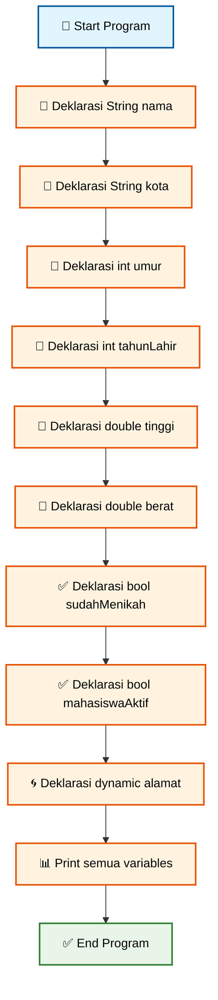
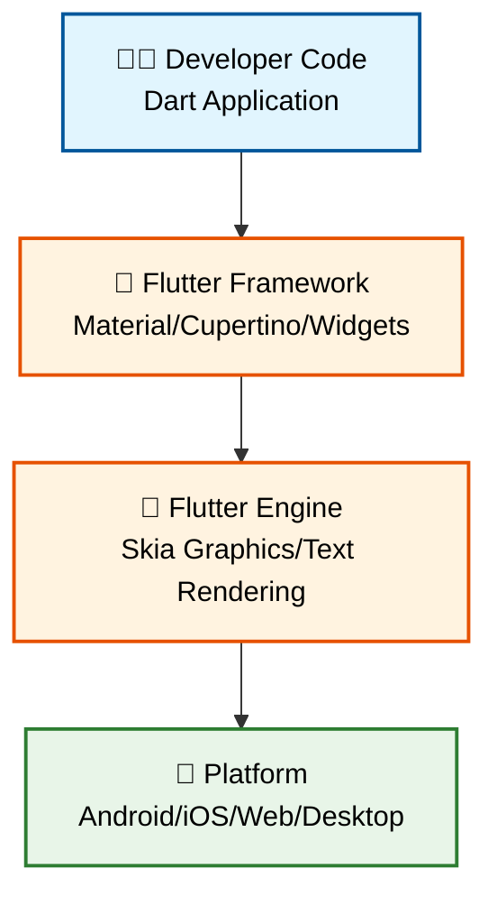
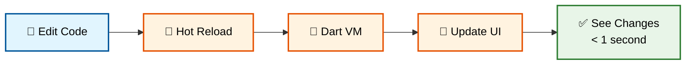
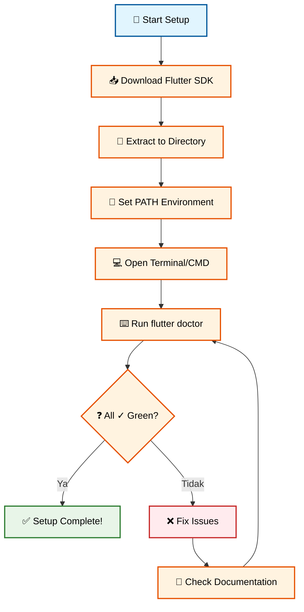

# 📱 Pertemuan 1: Pengenalan Flutter dan Setup Environment


---

## 📋 Daftar Isi

1. [🎯 Learning Objectives](#-learning-objectives)
2. [🌟 Pengenalan Flutter](#-pengenalan-flutter)
3. [🚀 Flutter vs Platform Lain](#-flutter-vs-platform-lain)
4. [📚 Dart Language Fundamentals](#-dart-language-fundamentals)
5. [🏗️ Flutter Architecture](#️-flutter-architecture)
6. [🛠️ Setup Development Environment](#️-setup-development-environment)
7. [👨‍💻 Praktikum: Hello Indonesia App](#-praktikum-hello-indonesia-app)
8. [📝 Assessment & Quiz](#-assessment--quiz)
9. [📖 Daftar Istilah](#-daftar-istilah)
10. [📚 Referensi](#-referensi)

---

## 🎯 Learning Objectives

Setelah menyelesaikan pertemuan ini, mahasiswa diharapkan mampu:

- ✅ **Memahami konsep cross-platform development** dan keunggulan Flutter
- ✅ **Menguasai Dart language fundamentals** (variables, data types, functions)
- ✅ **Berhasil setup development environment** dan menjalankan first Flutter app
- ✅ **Memahami Flutter architecture** dan rendering engine dasar
- ✅ **Membuat aplikasi sederhana** dengan modifikasi basic text dan styling

---

## 🌟 Pengenalan Flutter

### Apa itu Flutter?

**Flutter** adalah **UI toolkit open-source** yang dikembangkan oleh Google untuk membuat aplikasi yang **compiled secara native** untuk mobile, web, dan desktop dari **single codebase**.

### 🇮🇩 Flutter di Indonesia

Flutter sangat populer di Indonesia karena:

- 🏢 **Digunakan oleh Unicorn Indonesia**: Gojek, Tokopedia, Bukalapak
- 💰 **Cost-effective**: Satu tim developer untuk multiple platform
- ⚡ **Development cepat**: Hot reload untuk iterasi yang cepat
- 🎨 **UI konsisten**: Material Design cocok dengan user Indonesia
- 📱 **Performance native**: Mendekati performance aplikasi native

### 📈 Statistik Flutter Indonesia (2024-2025)

- 📊 **85%** developer Indonesia tertarik belajar Flutter
- 🚀 **300%** peningkatan job opening Flutter developer
- 💼 **Average salary**: Rp 8-15 juta/bulan untuk Flutter developer
- 🏆 **#2** framework mobile paling populer setelah React Native

---

## 🚀 Flutter vs Platform Lain

### 📊 Perbandingan Komprehensif

| Kriteria | 🔵 Flutter | 🟢 Native (Java/Kotlin + Swift) | 🟡 React Native |
|----------|------------|----------------------------------|-----------------|
| **Performance** | ⭐⭐⭐⭐ | ⭐⭐⭐⭐⭐ | ⭐⭐⭐ |
| **Development Speed** | ⭐⭐⭐⭐⭐ | ⭐⭐ | ⭐⭐⭐⭐ |
| **Code Reusability** | ⭐⭐⭐⭐⭐ | ⭐ | ⭐⭐⭐⭐ |
| **Learning Curve** | ⭐⭐⭐⭐ | ⭐⭐ | ⭐⭐⭐ |
| **Community Support** | ⭐⭐⭐⭐ | ⭐⭐⭐⭐⭐ | ⭐⭐⭐⭐⭐ |
| **Job Market (ID)** | ⭐⭐⭐⭐ | ⭐⭐⭐⭐⭐ | ⭐⭐⭐⭐ |

### 💡 Mengapa Memilih Flutter untuk Mahasiswa Indonesia?

1. **🎯 Single Codebase**: Belajar satu bahasa (Dart) untuk semua platform
2. **💸 Cost-effective**: Cocok untuk UMKM dan startup Indonesia
3. **🔥 Hot Reload**: Feedback instant saat development
4. **🎨 Rich UI**: Material Design dan Cupertino widgets built-in
5. **📈 Growing Market**: Banyak perusahaan Indonesia beralih ke Flutter

---

## 📚 Dart Language Fundamentals

### Mengapa Dart?

**Dart** adalah bahasa pemrograman yang dibuat Google khusus untuk UI development. Dart dipilih untuk Flutter karena:

- ⚡ **Just-in-Time (JIT) compilation** untuk hot reload
- 🏗️ **Ahead-of-Time (AOT) compilation** untuk performance production
- 🧹 **Garbage collection** untuk memory management
- 🎯 **Strongly typed** dengan type inference
- 📱 **Optimized for UI** development

### 🔤 Dart Basic Syntax

#### 1. Variables dan Data Types

```dart
void main() {
  // String - untuk teks
  String nama = 'Budi Santoso';
  String kota = "Jakarta";
  
  // Integer - untuk angka bulat
  int umur = 23;
  int tahunLahir = 2001;
  
  // Double - untuk angka desimal
  double tinggi = 175.5;
  double berat = 68.7;
  
  // Boolean - true/false
  bool sudahMenikah = false;
  bool mahasiswaAktif = true;
  
  // Dynamic - tipe data fleksibel
  dynamic alamat = 'Jl. Sudirman No. 123';
  
  // Print output
  print('Nama: $nama');
  print('Umur: $umur tahun');
  print('Tinggi: ${tinggi}cm');
  print('Status: ${sudahMenikah ? "Menikah" : "Belum Menikah"}');
}
```

**🔧 [Copy Code]** | **🌐 [Test di zapp.run](https://zapp.run/)**

#### Alur Eksekusi Variables:



#### 2. Functions dalam Dart

```dart
void main() {
  // Memanggil functions
  sapaPengguna();
  String hasil = buatSalam('Siti', 'Bandung');
  print(hasil);
  
  int total = hitungTotal(50000, 10000);
  print('Total belanja: Rp ${total}');
  
  // Function dengan named parameters
  buatProfilMahasiswa(
    nama: 'Ahmad Rizki', 
    nim: '2021001',
    jurusan: 'Teknik Informatika'
  );
}

// Function void (tidak return value)
void sapaPengguna() {
  print('=== Selamat Datang di Aplikasi Indonesia ===');
}

// Function dengan return value
String buatSalam(String nama, String kota) {
  return 'Halo $nama dari $kota, semoga harimu menyenangkan!';
}

// Function dengan multiple parameters
int hitungTotal(int hargaBarang, int ongkir) {
  return hargaBarang + ongkir;
}

// Function dengan named parameters
void buatProfilMahasiswa({
  required String nama,
  required String nim,
  String jurusan = 'Belum Ditentukan'
}) {
  print('\n--- Profil Mahasiswa ---');
  print('Nama: $nama');
  print('NIM: $nim');
  print('Jurusan: $jurusan');
}
```

**🔧 [Copy Code]** | **🌐 [Test di zapp.run](https://zapp.run/)**

#### Alur Eksekusi Functions:

```mermaid
flowchart TD
    A[🎯 Start main()] --> B[📞 Call sapaPengguna()]
    B --> C[📝 Print welcome message]
    C --> D[📞 Call buatSalam()]
    D --> E[🔄 Return greeting string]
    E --> F[📊 Print hasil]
    F --> G[📞 Call hitungTotal()]
    G --> H[➕ Calculate sum]
    H --> I[🔄 Return total]
    I --> J[📊 Print total]
    J --> K[📞 Call buatProfilMahasiswa()]
    K --> L[📋 Print profile data]
    L --> M[✅ End Program]
    
    style A fill:#e1f5fe,stroke:#01579b,stroke-width:2px,color:#000
    style B fill:#fff3e0,stroke:#e65100,stroke-width:2px,color:#000
    style C fill:#fff3e0,stroke:#e65100,stroke-width:2px,color:#000
    style D fill:#fff3e0,stroke:#e65100,stroke-width:2px,color:#000
    style E fill:#e8f5e8,stroke:#2e7d32,stroke-width:2px,color:#000
    style F fill:#fff3e0,stroke:#e65100,stroke-width:2px,color:#000
    style G fill:#fff3e0,stroke:#e65100,stroke-width:2px,color:#000
    style H fill:#fff3e0,stroke:#e65100,stroke-width:2px,color:#000
    style I fill:#e8f5e8,stroke:#2e7d32,stroke-width:2px,color:#000
    style J fill:#fff3e0,stroke:#e65100,stroke-width:2px,color:#000
    style K fill:#fff3e0,stroke:#e65100,stroke-width:2px,color:#000
    style L fill:#fff3e0,stroke:#e65100,stroke-width:2px,color:#000
    style M fill:#e8f5e8,stroke:#2e7d32,stroke-width:2px,color:#000
```

#### 3. Control Flow (If-Else, Loops)

```dart
void main() {
  // If-Else untuk kondisi cuaca Indonesia
  String cuaca = 'hujan';
  cekCuaca(cuaca);
  
  // For loop untuk daftar kota
  List<String> kotaIndonesia = ['Jakarta', 'Bandung', 'Surabaya', 'Medan', 'Makassar'];
  print('\n=== Kota-kota Besar Indonesia ===');
  
  for (int i = 0; i < kotaIndonesia.length; i++) {
    print('${i + 1}. ${kotaIndonesia[i]}');
  }
  
  // Enhanced for loop (for-in)
  print('\n=== Cuaca per Kota ===');
  for (String kota in kotaIndonesia) {
    int suhu = (25 + (kota.length % 8)); // Simulasi suhu
    print('$kota: ${suhu}°C');
  }
  
  // While loop untuk countdown
  print('\n=== Countdown Kemerdekaan ===');
  int hari = 5;
  while (hari > 0) {
    print('$hari hari lagi sampai 17 Agustus!');
    hari--;
  }
  print('🇮🇩 Selamat Hari Kemerdekaan Indonesia! 🇮🇩');
}

void cekCuaca(String kondisiCuaca) {
  if (kondisiCuaca == 'cerah') {
    print('☀️ Cuaca cerah! Cocok untuk jalan-jalan ke Monas');
  } else if (kondisiCuaca == 'hujan') {
    print('🌧️ Hujan turun! Saatnya makan bakso hangat');
  } else if (kondisiCuaca == 'berawan') {
    print('☁️ Berawan tipis, sempurna untuk foto di Bromo');
  } else {
    print('🌈 Cuaca tidak terduga, siap-siap bawa payung!');
  }
}
```

**🔧 [Copy Code]** | **🌐 [Test di zapp.run](https://zapp.run/)**

#### Alur Eksekusi Control Flow:

```mermaid
flowchart TD
    A[🎯 Start Program] --> B[📝 Set cuaca = hujan]
    B --> C[📞 Call cekCuaca()]
    C --> D{❓ cuaca == cerah?}
    D -->|Tidak| E{❓ cuaca == hujan?}
    D -->|Ya| F[☀️ Print cerah message]
    E -->|Ya| G[🌧️ Print hujan message]
    E -->|Tidak| H{❓ cuaca == berawan?}
    H -->|Ya| I[☁️ Print berawan message]
    H -->|Tidak| J[🌈 Print default message]
    
    F --> K[📋 Initialize kotaIndonesia list]
    G --> K
    I --> K
    J --> K
    
    K --> L[🔄 For loop: i = 0 to length]
    L --> M[📊 Print city with index]
    M --> N{❓ i < length?}
    N -->|Ya| M
    N -->|Tidak| O[🔄 Enhanced for loop cities]
    O --> P[🌡️ Calculate temperature]
    P --> Q[📊 Print city temperature]
    Q --> R{❓ More cities?}
    R -->|Ya| O
    R -->|Tidak| S[🔄 While loop countdown]
    S --> T{❓ hari > 0?}
    T -->|Ya| U[📊 Print countdown]
    U --> V[➖ hari--]
    V --> S
    T -->|Tidak| W[🇮🇩 Print final message]
    W --> X[✅ End Program]
    
    style A fill:#e1f5fe,stroke:#01579b,stroke-width:2px,color:#000
    style B fill:#fff3e0,stroke:#e65100,stroke-width:2px,color:#000
    style C fill:#fff3e0,stroke:#e65100,stroke-width:2px,color:#000
    style D fill:#fff3e0,stroke:#e65100,stroke-width:2px,color:#000
    style E fill:#fff3e0,stroke:#e65100,stroke-width:2px,color:#000
    style F fill:#e8f5e8,stroke:#2e7d32,stroke-width:2px,color:#000
    style G fill:#e8f5e8,stroke:#2e7d32,stroke-width:2px,color:#000
    style H fill:#fff3e0,stroke:#e65100,stroke-width:2px,color:#000
    style I fill:#e8f5e8,stroke:#2e7d32,stroke-width:2px,color:#000
    style J fill:#e8f5e8,stroke:#2e7d32,stroke-width:2px,color:#000
    style K fill:#fff3e0,stroke:#e65100,stroke-width:2px,color:#000
    style L fill:#fff3e0,stroke:#e65100,stroke-width:2px,color:#000
    style M fill:#fff3e0,stroke:#e65100,stroke-width:2px,color:#000
    style N fill:#fff3e0,stroke:#e65100,stroke-width:2px,color:#000
    style O fill:#fff3e0,stroke:#e65100,stroke-width:2px,color:#000
    style P fill:#fff3e0,stroke:#e65100,stroke-width:2px,color:#000
    style Q fill:#fff3e0,stroke:#e65100,stroke-width:2px,color:#000
    style R fill:#fff3e0,stroke:#e65100,stroke-width:2px,color:#000
    style S fill:#fff3e0,stroke:#e65100,stroke-width:2px,color:#000
    style T fill:#fff3e0,stroke:#e65100,stroke-width:2px,color:#000
    style U fill:#fff3e0,stroke:#e65100,stroke-width:2px,color:#000
    style V fill:#fff3e0,stroke:#e65100,stroke-width:2px,color:#000
    style W fill:#e8f5e8,stroke:#2e7d32,stroke-width:2px,color:#000
    style X fill:#e8f5e8,stroke:#2e7d32,stroke-width:2px,color:#000
```

---

## 🏗️ Flutter Architecture

### 🔍 Flutter Framework Overview

Flutter menggunakan **layered architecture** yang terdiri dari:



### 📊 Layer-by-Layer Explanation

#### 1. **Developer Code Layer** 
- 🎯 **Fungsi**: Tempat kita menulis aplikasi Dart
- 🛠️ **Tools**: VS Code, Android Studio
- 📝 **Content**: Business logic, UI components, state management

#### 2. **Flutter Framework Layer**
- 🎨 **Widgets**: Building blocks untuk UI (Text, Button, Container)
- 🎭 **Material Design**: Android-style components
- 🍎 **Cupertino**: iOS-style components
- 📐 **Rendering**: Layout dan painting system

#### 3. **Flutter Engine Layer**
- 🎨 **Skia**: Graphics library untuk rendering
- 📝 **Dart VM**: Runtime untuk development
- ⚡ **AOT compiled**: Native machine code untuk production

#### 4. **Platform Layer**
- 📱 **Android**: Via Android NDK
- 🍎 **iOS**: Via LLVM
- 🌐 **Web**: Via HTML/CSS/JavaScript
- 💻 **Desktop**: Via native APIs

### 🔥 Hot Reload Architecture



**Hot Reload** memungkinkan perubahan code langsung terlihat tanpa restart aplikasi - ini yang membuat Flutter sangat produktif!

---

## 🛠️ Setup Development Environment

### 📋 System Requirements

#### Minimum Requirements:
- **OS**: Windows 10/macOS Catalina/Ubuntu 18.04
- **RAM**: 8GB (16GB recommended)
- **Storage**: 256GB SSD (512GB recommended) 
- **Processor**: Intel i5/AMD Ryzen 5
- **Internet**: Stable connection untuk download

### 🚀 Step-by-Step Installation

#### 1. **Download Flutter SDK**

```bash
# Download Flutter untuk Windows
# Kunjungi: https://docs.flutter.dev/get-started/install/windows

# Untuk macOS
brew install --cask flutter

# Untuk Linux
sudo snap install flutter --classic
```

**🔧 [Copy Command]**

#### 2. **Setup Environment Variables**

**Windows:**
1. Extract Flutter ke `C:\flutter`
2. Tambahkan `C:\flutter\bin` ke PATH
3. Buka Command Prompt dan jalankan `flutter doctor`

**macOS/Linux:**
```bash
# Tambahkan ke ~/.bashrc atau ~/.zshrc
export PATH="$PATH:[PATH_TO_FLUTTER_GIT_DIRECTORY]/flutter/bin"

# Reload terminal
source ~/.bashrc  # atau source ~/.zshrc
```

**🔧 [Copy Command]**

#### 3. **Verifikasi Installation**

```bash
flutter doctor
```

**🔧 [Copy Command]**

Output yang diharapkan:
```
Doctor summary (to see all details, run flutter doctor -v):
[✓] Flutter (Channel stable, 3.32.0, on macOS 14.0 23A344 darwin-arm64)
[✓] Android toolchain - develop for Android devices
[✓] Xcode - develop for iOS and macOS (Xcode 15.0)
[✓] Chrome - develop for the web
[✓] Android Studio (version 2023.1)
[✓] VS Code (version 1.85.0)
[✓] Connected device (3 available)
[✓] Network resources
```

#### Setup Verification Flow:



#### 4. **Setup IDE (VS Code)**

**Install VS Code:**
- Download dari: https://code.visualstudio.com/

**Install Extensions Wajib:**
1. **Flutter** (by Dart Code)
2. **Dart** (by Dart Code)
3. **Flutter Widget Snippets**
4. **Awesome Flutter Snippets**

```bash
# Install via command line
code --install-extension dart-code.flutter
code --install-extension dart-code.dart-code
```

**🔧 [Copy Command]**

---

## 👨‍💻 Praktikum: Hello Indonesia App

### 🎯 Project Overview

Kita akan membuat aplikasi pertama dengan nama **"Hello Indonesia"** yang menampilkan:
- ✅ Sambutan dalam bahasa Indonesia  
- ✅ Logo/gambar Indonesia
- ✅ Styling dengan warna merah putih
- ✅ Basic navigation

### 🚀 Step 1: Create Project

```bash
# Buat project Flutter baru
flutter create hello_indonesia

# Masuk ke directory project
cd hello_indonesia

# Buka dengan VS Code
code .
```

**🔧 [Copy Command]** | **🌐 [Test di zapp.run](https://zapp.run/)**

### 📁 Project Structure

```
hello_indonesia/
├── lib/
│   └── main.dart          # File utama aplikasi
├── android/               # Konfigurasi Android
├── ios/                   # Konfigurasi iOS  
├── web/                   # Konfigurasi Web
├── pubspec.yaml           # Dependencies & assets
└── README.md              # Dokumentasi project
```

### 🎨 Step 2: Edit main.dart

Ganti isi file `lib/main.dart` dengan code berikut:

```dart
import 'package:flutter/material.dart';

void main() {
  runApp(HelloIndonesiaApp());
}

class HelloIndonesiaApp extends StatelessWidget {
  @override
  Widget build(BuildContext context) {
    return MaterialApp(
      title: 'Hello Indonesia',
      theme: ThemeData(
        // Tema warna merah putih Indonesia
        primarySwatch: Colors.red,
        visualDensity: VisualDensity.adaptivePlatformDensity,
      ),
      home: HomePage(),
      debugShowCheckedModeBanner: false, // Hilangkan banner debug
    );
  }
}

class HomePage extends StatelessWidget {
  @override
  Widget build(BuildContext context) {
    return Scaffold(
      appBar: AppBar(
        title: Text('Hello Indonesia 🇮🇩'),
        backgroundColor: Colors.red,
        foregroundColor: Colors.white,
        centerTitle: true,
      ),
      body: Center(
        child: Column(
          mainAxisAlignment: MainAxisAlignment.center,
          children: <Widget>[
            // Icon Indonesia
            Icon(
              Icons.flag,
              size: 100,
              color: Colors.red,
            ),
            
            SizedBox(height: 20),
            
            // Teks sambutan
            Text(
              'Selamat Datang',
              style: TextStyle(
                fontSize: 32,
                fontWeight: FontWeight.bold,
                color: Colors.red,
              ),
            ),
            
            SizedBox(height: 10),
            
            Text(
              'di Aplikasi Flutter Pertama',
              style: TextStyle(
                fontSize: 18,
                color: Colors.grey[700],
              ),
            ),
            
            SizedBox(height: 30),
            
            // Container info
            Container(
              padding: EdgeInsets.all(20),
              margin: EdgeInsets.symmetric(horizontal: 40),
              decoration: BoxDecoration(
                color: Colors.red[50],
                borderRadius: BorderRadius.circular(15),
                border: Border.all(color: Colors.red, width: 2),
              ),
              child: Column(
                children: [
                  Text(
                    'Dibuat dengan ❤️',
                    style: TextStyle(
                      fontSize: 16,
                      fontWeight: FontWeight.w500,
                    ),
                  ),
                  
                  SizedBox(height: 8),
                  
                  Text(
                    'oleh Mahasiswa Indonesia',
                    style: TextStyle(
                      fontSize: 14,
                      color: Colors.grey[600],
                    ),
                  ),
                ],
              ),
            ),
            
            SizedBox(height: 30),
            
            // Button untuk interaksi
            ElevatedButton(
              onPressed: () {
                // Fungsi yang akan dijalankan saat button ditekan
                _showIndonesiaDialog(context);
              },
              style: ElevatedButton.styleFrom(
                backgroundColor: Colors.red,
                foregroundColor: Colors.white,
                padding: EdgeInsets.symmetric(horizontal: 30, vertical: 15),
                shape: RoundedRectangleBorder(
                  borderRadius: BorderRadius.circular(25),
                ),
              ),
              child: Text(
                'Tap untuk Surprise! 🎉',
                style: TextStyle(fontSize: 16),
              ),
            ),
          ],
        ),
      ),
    );
  }
  
  // Function untuk menampilkan dialog
  void _showIndonesiaDialog(BuildContext context) {
    showDialog(
      context: context,
      builder: (BuildContext context) {
        return AlertDialog(
          title: Text('🇮🇩 Merdeka! 🇮🇩'),
          content: Column(
            mainAxisSize: MainAxisSize.min,
            children: [
              Text('Selamat belajar Flutter!'),
              SizedBox(height: 10),
              Text('Indonesia Jaya! 🚀'),
            ],
          ),
          actions: [
            TextButton(
              onPressed: () {
                Navigator.of(context).pop();
              },
              child: Text('Tutup'),
            ),
          ],
        );
      },
    );
  }
}
```

**🔧 [Copy Code]** | **🌐 [Test di zapp.run](https://zapp.run/)**

### 🔍 Code Explanation

#### Flutter App Structure Flow:

```mermaid
flowchart TD
    A[🎯 main() Function] --> B[🚀 runApp()]
    B --> C[📱 HelloIndonesiaApp]
    C --> D[🎨 MaterialApp Widget]
    D --> E[🏠 HomePage Widget]
    E --> F[📋 Scaffold Structure]
    F --> G[📱 AppBar]
    F --> H[📄 Body Content]
    H --> I[📊 Column Layout]
    I --> J[🎌 Icon Widget]
    I --> K[📝 Text Widgets]
    I --> L[📦 Container Widget]
    I --> M[🔘 ElevatedButton]
    M --> N[💬 Dialog Function]
    
    style A fill:#e1f5fe,stroke:#01579b,stroke-width:2px,color:#000
    style B fill:#fff3e0,stroke:#e65100,stroke-width:2px,color:#000
    style C fill:#fff3e0,stroke:#e65100,stroke-width:2px,color:#000
    style D fill:#fff3e0,stroke:#e65100,stroke-width:2px,color:#000
    style E fill:#fff3e0,stroke:#e65100,stroke-width:2px,color:#000
    style F fill:#fff3e0,stroke:#e65100,stroke-width:2px,color:#000
    style G fill:#e8f5e8,stroke:#2e7d32,stroke-width:2px,color:#000
    style H fill:#e8f5e8,stroke:#2e7d32,stroke-width:2px,color:#000
    style I fill:#fff3e0,stroke:#e65100,stroke-width:2px,color:#000
    style J fill:#e8f5e8,stroke:#2e7d32,stroke-width:2px,color:#000
    style K fill:#e8f5e8,stroke:#2e7d32,stroke-width:2px,color:#000
    style L fill:#e8f5e8,stroke:#2e7d32,stroke-width:2px,color:#000
    style M fill:#e8f5e8,stroke:#2e7d32,stroke-width:2px,color:#000
    style N fill:#fff3e0,stroke:#e65100,stroke-width:2px,color:#000
```

#### Key Components Explained:

1. **`main()` Function**: Entry point aplikasi Flutter
2. **`runApp()`**: Function yang menjalankan aplikasi
3. **`MaterialApp`**: Root widget yang mengatur tema dan routing
4. **`StatelessWidget`**: Widget yang tidak berubah-ubah
5. **`Scaffold`**: Struktur dasar halaman (AppBar, Body, dll)
6. **`Column`**: Layout vertical untuk menyusun widgets
7. **`Container`**: Widget untuk styling dan layout
8. **`ElevatedButton`**: Button dengan efek elevated

### 🏃‍♂️ Step 3: Run the App

```bash
# Jalankan aplikasi
flutter run

# Atau untuk web
flutter run -d chrome

# Atau untuk specific device
flutter devices  # Lihat daftar device
flutter run -d [device-id]
```

**🔧 [Copy Command]**

### 🎉 Expected Result

Aplikasi yang berhasil akan menampilkan:
- ✅ **AppBar merah** dengan tulisan "Hello Indonesia 🇮🇩"
- ✅ **Icon flag** berwarna merah
- ✅ **Teks sambutan** dengan styling yang menarik
- ✅ **Container** dengan border merah dan background pink muda
- ✅ **Button** yang menampilkan dialog saat ditekan

### 🎨 Step 4: Kustomisasi (Opsional)

Coba modifikasi aplikasi dengan:

```dart
// Ganti warna tema
primarySwatch: Colors.blue,  // Atau Colors.green

// Ganti icon
Icons.home,  // Atau Icons.star

// Tambah animasi sederhana
AnimatedContainer(
  duration: Duration(seconds: 1),
  padding: EdgeInsets.all(20),
  // ... styling lainnya
)
```

**🔧 [Copy Code]** | **🌐 [Test di zapp.run](https://zapp.run/)**

---

## 📝 Assessment & Quiz

### ✅ Environment Setup Verification (5%)

**Checklist yang harus diselesaikan:**

- [ ] Flutter SDK terinstall dan `flutter doctor` semua ✓
- [ ] VS Code dengan extensions Flutter & Dart
- [ ] Berhasil membuat project hello_indonesia
- [ ] Aplikasi berjalan tanpa error
- [ ] Hot reload berfungsi dengan baik

**Cara Submit:**
1. Screenshot hasil `flutter doctor`
2. Screenshot aplikasi running
3. Upload ke LMS dengan format: `NIM_Nama_Setup.zip`

### 🧠 Quiz Dart Basics (5%)

#### **Soal 1 (20 poin)**
Apa output dari code Dart berikut?

```dart
void main() {
  String nama = 'Budi';
  int umur = 23;
  bool mahasiswa = true;
  
  print('Nama: $nama');
  print('Umur: ${umur + 2}');
  print('Status: ${mahasiswa ? "Mahasiswa" : "Bukan Mahasiswa"}');
}
```

**A.** 
```
Nama: Budi
Umur: 23
Status: Mahasiswa
```

**B.**
```
Nama: Budi
Umur: 25
Status: Mahasiswa
```

**C.**
```
Nama: $nama
Umur: ${umur + 2}
Status: ${mahasiswa ? "Mahasiswa" : "Bukan Mahasiswa"}
```

**Jawaban:** B ✅

#### **Soal 2 (20 poin)**
Manakah penulisan function yang BENAR dalam Dart?

**A.**
```dart
function hitungLuas(int panjang, int lebar) {
  return panjang * lebar;
}
```

**B.**
```dart
int hitungLuas(int panjang, int lebar) {
  return panjang * lebar;
}
```

**C.**
```dart
def hitungLuas(panjang, lebar):
  return panjang * lebar
```

**Jawaban:** B ✅

#### **Soal 3 (30 poin)**
Lengkapi code berikut untuk menampilkan angka 1-5:

```dart
void main() {
  for (int i = 1; i <= ___; i___) {
    print('Angka: $i');
  }
}
```

**Jawaban:** `5` dan `++` ✅

#### **Soal 4 (30 poin)**
Apa fungsi dari `MaterialApp` dalam Flutter?

**A.** Membuat material/bahan untuk aplikasi
**B.** Widget root yang mengatur tema dan routing aplikasi
**C.** Aplikasi khusus untuk Android saja
**D.** Function untuk menjalankan aplikasi

**Jawaban:** B ✅

### 🏆 Rubrik Penilaian Project (15%)

| Kriteria | Excellent (A) | Good (B) | Fair (C) | Poor (D) |
|----------|---------------|----------|-----------|----------|
| **Setup Environment** | Semua tool terinstall perfect, no issues | Minor issues tapi resolved | Beberapa issues, perlu bantuan | Banyak problems, tidak jalan |
| **Code Understanding** | Paham semua konsep, bisa explain | Paham sebagian besar | Paham basic saja | Tidak paham code |
| **Customization** | Banyak modifikasi kreatif | Beberapa modifikasi | Modifikasi minimal | Copy paste tanpa modifikasi |
| **Indonesian Context** | Sangat relevan dengan budaya ID | Cukup relevan | Sedikit unsur Indonesia | Tidak ada konteks Indonesia |

---

## 📖 Daftar Istilah

| Istilah | Singkatan | Pengertian |
|---------|-----------|-------------|
| **SDK** | Software Development Kit | Kumpulan tools untuk mengembangkan aplikasi |
| **API** | Application Programming Interface | Antarmuka untuk komunikasi antar aplikasi |
| **IDE** | Integrated Development Environment | Software untuk menulis dan debug code |
| **UI** | User Interface | Tampilan antarmuka pengguna |
| **UX** | User Experience | Pengalaman pengguna saat menggunakan aplikasi |
| **Widget** | - | Komponen UI dalam Flutter (Text, Button, dll) |
| **Hot Reload** | - | Fitur update UI tanpa restart aplikasi |
| **JIT** | Just-in-Time | Kompilasi code saat runtime |
| **AOT** | Ahead-of-Time | Kompilasi code sebelum runtime |
| **Scaffold** | - | Struktur dasar halaman Flutter |
| **StatelessWidget** | - | Widget yang tidak berubah state |
| **StatefulWidget** | - | Widget yang bisa berubah state |
| **MaterialApp** | - | Root widget untuk Material Design |
| **Cross-platform** | - | Satu code untuk multiple platform |
| **Native Performance** | - | Performance mendekati aplikasi native |

---

## 📚 Referensi

### 📖 Sumber Utama

1. **Flutter Official Documentation**. (2025). *Flutter - Build apps for any screen*. Google LLC. https://docs.flutter.dev/

2. **Windmill, E.** (2024). *Flutter in Action*. Manning Publications. 

3. **Moroney, L. & Biørn-Hansen, A.** (2024). *Programming Flutter: Native, Cross-Platform Apps the Easy Way*. Pragmatic Bookshelf.

### 🇮🇩 Sumber Indonesia

4. **Dicoding Indonesia**. (2024). *Belajar Membuat Aplikasi Flutter untuk Pemula*. https://www.dicoding.com/academies/159

5. **Kodingindonesia.com**. (2024). *Tutorial Flutter Bahasa Indonesia Lengkap*. https://kodingindonesia.com/tutorial-flutter-bahasa-indonesia/

6. **Petanikode**. (2024). *Tutorial Flutter: Pengenalan dan Persiapan*. https://www.petanikode.com/flutter-linux/

### 📊 Sumber Akademik

7. **Biørn-Hansen, A., Majchrzak, T. A., & Grønli, T. M.** (2017). Progressive web apps: The possible web-native unifier for mobile development. *Proceedings of the 13th International Conference on Web Information Systems and Technologies*, 344-351.

8. **Latif, M., Lakhrissi, Y., Nfaoui, E. H., & Es-Sbai, N.** (2020). Cross platform approach for mobile application development: A survey. *2020 International Conference on Information Technology for Organizations Development (IT4OD)*, 1-5.

### 🛠️ Tools dan Resources

9. **Dart Language Tour**. (2025). *A tour of the Dart language*. https://dart.dev/guides/language/language-tour

10. **VS Code Flutter Extension**. (2025). *Flutter - Visual Studio Marketplace*. https://marketplace.visualstudio.com/items?itemName=Dart-Code.flutter

---

## 🎯 Next Week Preview

**Pertemuan 2: Dart Programming dan OOP Concepts**
- ✅ Advanced Dart: Classes, Objects, Inheritance
- ✅ Collections: Lists, Maps, Sets
- ✅ Async Programming: Future, async/await
- ✅ Project: BMI Calculator Indonesia

---

## 💡 Tips Sukses

1. **⏰ Practice Daily**: Code minimal 30 menit setiap hari
2. **🤝 Join Community**: Ikut Flutter Indonesia groups
3. **📱 Test Real Device**: Selalu test di smartphone asli
4. **📖 Read Documentation**: Biasakan baca docs resmi
5. **🐛 Embrace Errors**: Error adalah teman belajar terbaik!

---

**🎉 Selamat! Anda telah menyelesaikan Pertemuan 1!**

Lanjutkan ke **Pertemuan 2** untuk memperdalam Dart programming dan OOP concepts! 🚀

---

*© 2025 Mata Kuliah Pemrograman Piranti Bergerak dengan Flutter*  
*Dibuat dengan ❤️ untuk mahasiswa Indonesia*
