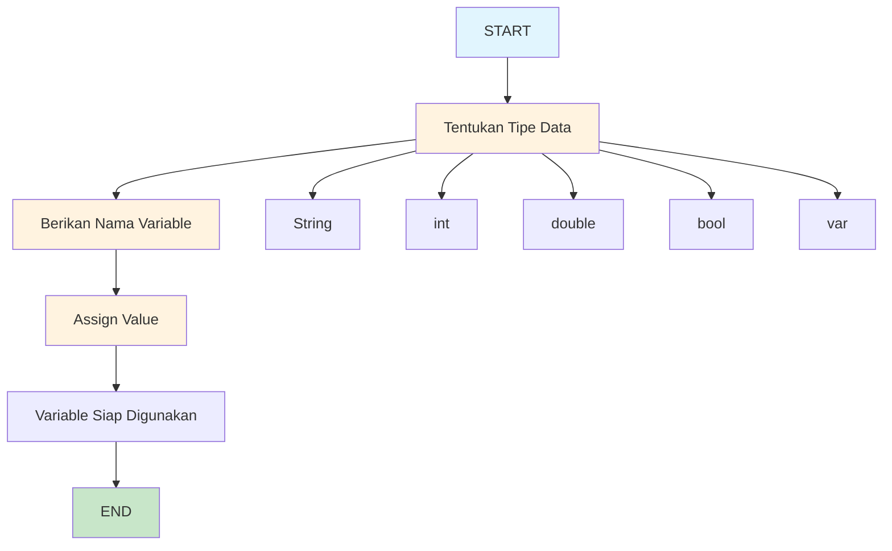
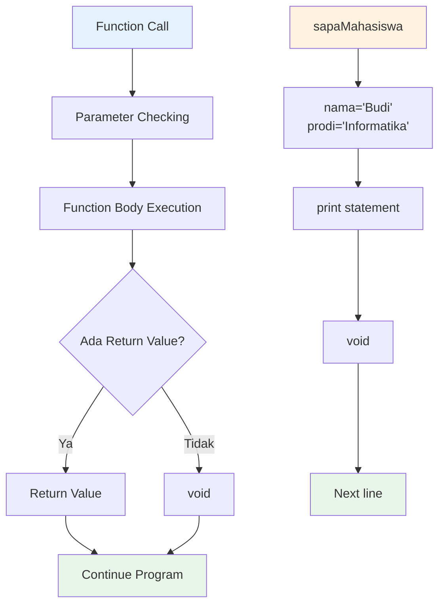
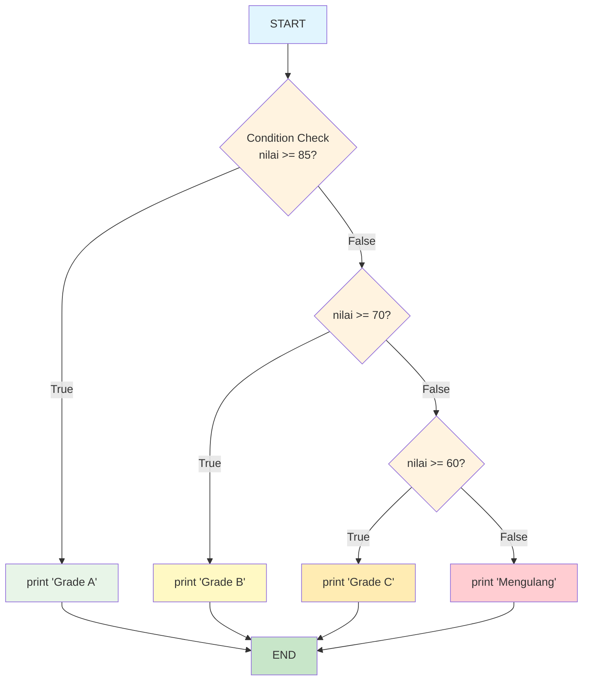
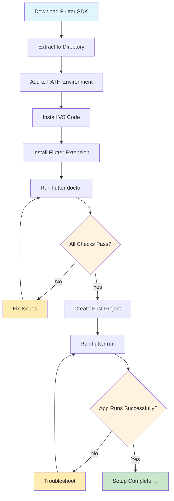
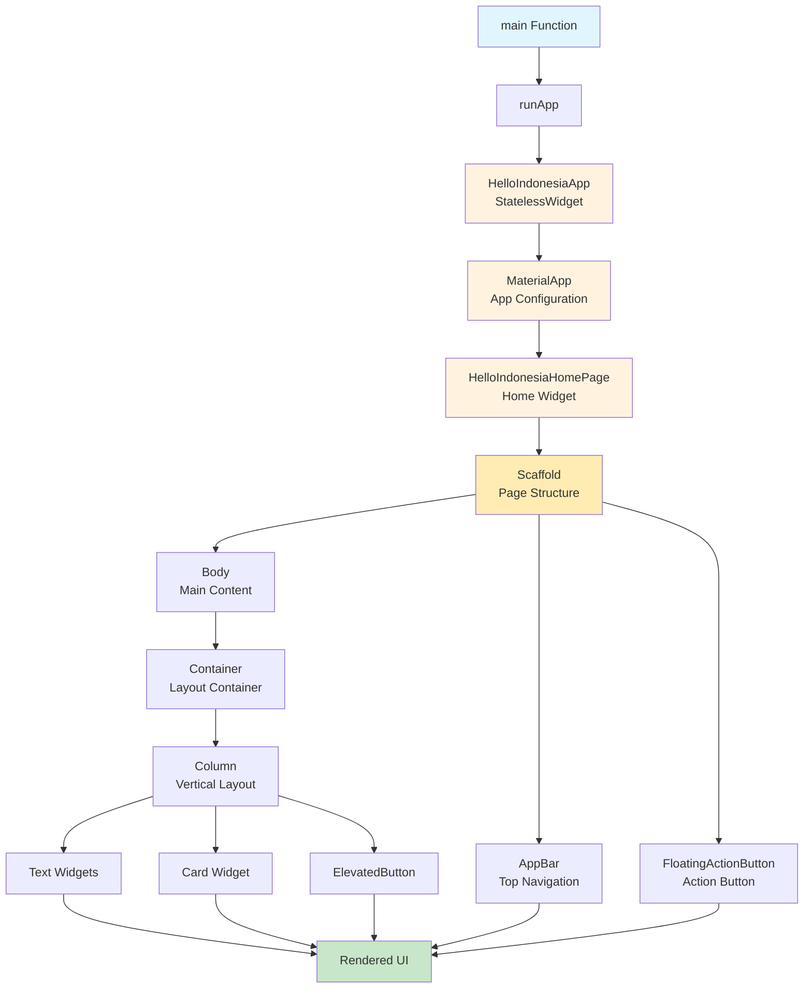
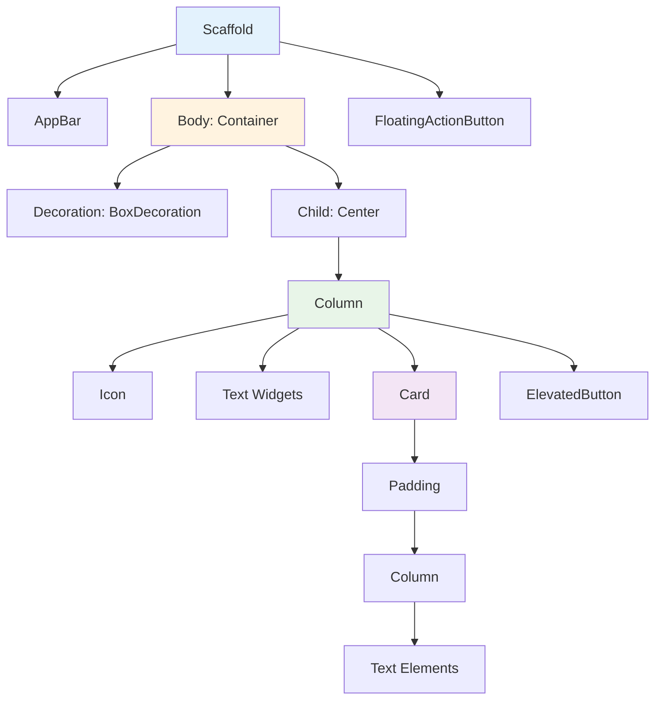
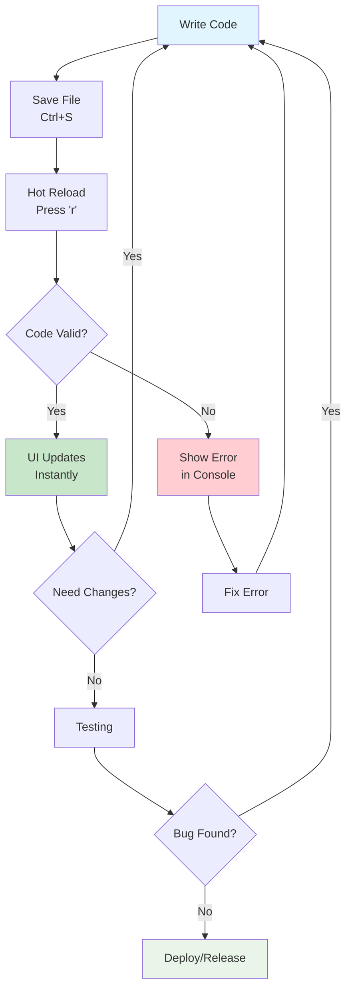
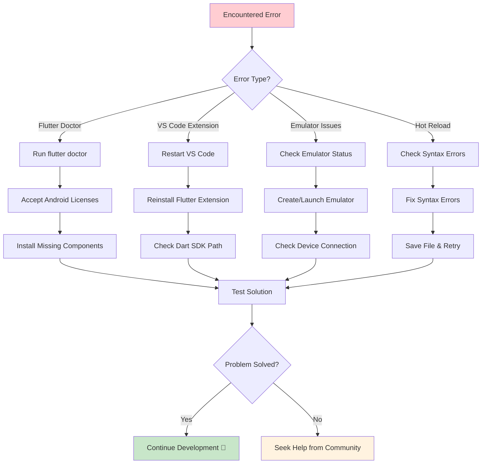
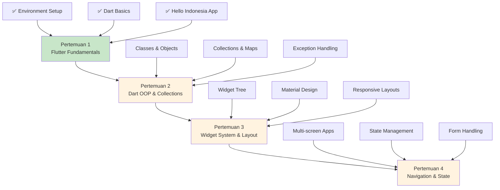

# 🚀 Pertemuan 1: Pengenalan Flutter dan Setup Environment

**Mata Kuliah**: Pemrograman Piranti Bergerak dengan Flutter  
**Kode**: PPB-FLT-101  
**Durasi**: 3 SKS (2 teori + 1 praktikum)  
**Tanggal**: [Disesuaikan dengan jadwal]

---

## 🎯 **Learning Objectives**

Setelah menyelesaikan pertemuan ini, mahasiswa diharapkan mampu:

1. **Memahami konsep cross-platform development** dan keunggulan Flutter dibandingkan pendekatan lain
2. **Menguasai Dart language fundamentals** termasuk variables, data types, dan functions
3. **Berhasil setup development environment** yang lengkap dan siap untuk development
4. **Membuat dan menjalankan aplikasi Flutter pertama** dengan modifikasi sederhana

---

## 📚 **Daftar Istilah dan Singkatan**

| Istilah/Singkatan | Pengertian |
|-------------------|------------|
| **Flutter** | Framework UI toolkit dari Google untuk membuat aplikasi multi-platform |
| **Dart** | Bahasa pemrograman yang dikembangkan Google, dioptimalkan untuk UI |
| **SDK** | Software Development Kit - kumpulan tools untuk development |
| **IDE** | Integrated Development Environment - editor code dengan fitur lengkap |
| **Cross-platform** | Pengembangan aplikasi yang dapat berjalan di multiple platform |
| **Widget** | Komponen UI dasar dalam Flutter (seperti building blocks) |
| **Hot Reload** | Fitur Flutter untuk melihat perubahan code secara real-time |
| **Rendering Engine** | Sistem yang menggambar UI ke layar |
| **AOT** | Ahead-of-Time compilation - kompilasi sebelum runtime |
| **JIT** | Just-in-Time compilation - kompilasi saat runtime |

---

## 🌟 **Bagian I: Pengenalan Flutter**

### **1.1 Apa itu Flutter?**

Flutter adalah **UI toolkit open-source** yang dikembangkan oleh Google untuk membuat aplikasi yang **natively compiled** untuk mobile, web, dan desktop dari **single codebase**. 

#### **Keunggulan Flutter:**

✅ **Single Codebase** - Tulis sekali, jalankan di berbagai platform  
✅ **Performance Native** - Compiled langsung ke machine code  
✅ **Hot Reload** - Development yang cepat dan produktif  
✅ **Rich UI Widgets** - Komponen UI yang lengkap dan customizable  
✅ **Growing Community** - Komunitas yang aktif dan berkembang  

### **1.2 Flutter vs Teknologi Lain**

| Aspek | **Flutter** | **React Native** | **Native (Java/Kotlin)** |
|-------|-------------|------------------|---------------------------|
| **Bahasa** | Dart | JavaScript | Java/Kotlin |
| **Performance** | ⭐⭐⭐⭐⭐ | ⭐⭐⭐⭐ | ⭐⭐⭐⭐⭐ |
| **Development Speed** | ⭐⭐⭐⭐⭐ | ⭐⭐⭐⭐ | ⭐⭐⭐ |
| **Code Reusability** | ⭐⭐⭐⭐⭐ | ⭐⭐⭐⭐ | ⭐ |
| **UI Consistency** | ⭐⭐⭐⭐⭐ | ⭐⭐⭐ | ⭐⭐⭐⭐⭐ |
| **Learning Curve** | ⭐⭐⭐⭐ | ⭐⭐⭐ | ⭐⭐ |

### **1.3 Flutter di Indonesia**

Flutter telah diadopsi oleh berbagai perusahaan teknologi Indonesia:

🏢 **Gojek** - Menggunakan Flutter untuk beberapa fitur aplikasi  
🏢 **Tokopedia** - Implementasi Flutter untuk specific features  
🏢 **Bukalapak** - Development dengan Flutter untuk cross-platform  
🏢 **OY! Indonesia** - Migrasi ke Flutter untuk consistency  

---

## 🎨 **Bagian II: Pengenalan Dart Programming**

### **2.1 Mengapa Dart?**

Dart dipilih untuk Flutter karena:

- **Optimized for UI** - Dirancang khusus untuk user interfaces
- **Fast Development** - Hot reload dan fast compilation
- **Productive** - Familiar syntax untuk developers
- **Portable** - Dapat compile ke JavaScript, ARM, x86

### **2.2 Dart Fundamentals**

#### **2.2.1 Variables dan Data Types**

```dart
// Pencoba code ini di: https://zapp.run/
void main() {
  // String - untuk teks
  String nama = 'Mahasiswa Indonesia';
  String universitas = "Universitas Mulawarman";
  
  // Integer - untuk angka bulat
  int umur = 20;
  int semester = 5;
  
  // Double - untuk angka desimal
  double ipk = 3.75;
  double tinggi = 170.5;
  
  // Boolean - untuk true/false
  bool sudahLulus = false;
  bool aktifKuliah = true;
  
  // Var - Dart akan mendeteksi tipe secara otomatis
  var kota = 'Samarinda';
  var jumlahMataKuliah = 8;
  
  // Menampilkan output
  print('Nama: $nama');
  print('Universitas: $universitas');
  print('Umur: $umur tahun');
  print('IPK: $ipk');
  print('Sudah Lulus: $sudahLulus');
  print('Kota: $kota');
}
```

**📊 Flow Diagram - Deklarasi Variables:**



#### **2.2.2 Functions**

```dart
// Pencoba code ini di: https://zapp.run/
// Function tanpa return value (void)
void sapaMahasiswa(String nama, String prodi) {
  print('Halo $nama, selamat datang di Program Studi $prodi!');
}

// Function dengan return value
String buatSalam(String nama) {
  return 'Selamat pagi, $nama! Semangat kuliahnya!';
}

// Function dengan parameter opsional
int hitungTotalSKS(int sksMajor, [int sksMinor = 0]) {
  return sksMajor + sksMinor;
}

// Function dengan named parameters
double hitungIPK({required int totalSKS, required double totalNilai}) {
  return totalNilai / totalSKS;
}

void main() {
  // Memanggil function
  sapaMahasiswa('Budi', 'Informatika');
  
  String salam = buatSalam('Sari');
  print(salam);
  
  int totalSKS = hitungTotalSKS(120, 20);
  print('Total SKS: $totalSKS');
  
  double ipk = hitungIPK(totalSKS: 144, totalNilai: 540);
  print('IPK: ${ipk.toStringAsFixed(2)}');
}
```

**📊 Flow Diagram - Function Execution:**



#### **2.2.3 Control Flow**

```dart
// Pencoba code ini di: https://zapp.run/
void main() {
  int nilai = 85;
  String nama = 'Ahmad';
  
  // If-else statement
  if (nilai >= 85) {
    print('$nama mendapat nilai A');
  } else if (nilai >= 70) {
    print('$nama mendapat nilai B');
  } else if (nilai >= 60) {
    print('$nama mendapat nilai C');
  } else {
    print('$nama perlu mengulang mata kuliah');
  }
  
  // Switch statement
  String grade = 'A';
  switch (grade) {
    case 'A':
      print('Excellent! IPK 4.0');
      break;
    case 'B':
      print('Good! IPK 3.0-3.9');
      break;
    case 'C':
      print('Average! IPK 2.0-2.9');
      break;
    default:
      print('Perlu perbaikan');
  }
  
  // For loop
  print('\nDaftar semester:');
  for (int i = 1; i <= 8; i++) {
    print('Semester $i');
  }
  
  // While loop
  print('\nCountdown mata kuliah tersisa:');
  int sisaMataKuliah = 5;
  while (sisaMataKuliah > 0) {
    print('Sisa $sisaMataKuliah mata kuliah');
    sisaMataKuliah--;
  }
  
  // For-in loop dengan List
  List<String> mataKuliah = ['Flutter', 'Database', 'AI', 'Networking'];
  print('\nMata kuliah semester ini:');
  for (String mk in mataKuliah) {
    print('- $mk');
  }
}
```

**📊 Flow Diagram - Control Flow:**



---

## 💻 **Bagian III: Setup Development Environment**

### **3.1 System Requirements**

#### **Minimum Requirements:**
- **OS**: Windows 10 (64-bit) / macOS 10.14 / Ubuntu 18.04
- **RAM**: 8 GB (16 GB recommended)
- **Storage**: 256 GB SSD
- **Processor**: Intel i5 / AMD Ryzen 5

#### **Recommended Requirements:**
- **OS**: Windows 11 / macOS Big Sur+ / Ubuntu 20.04+
- **RAM**: 16 GB atau lebih
- **Storage**: 512 GB SSD
- **Processor**: Intel i5 10th gen+ / AMD Ryzen 5

### **3.2 Langkah-langkah Instalasi**

**📊 Flow Diagram - Setup Process:**



#### **Step 1: Download Flutter SDK**

1. Kunjungi [flutter.dev](https://flutter.dev)
2. Pilih operating system Anda
3. Download Flutter SDK terbaru (versi 3.32+)

#### **Step 2: Extract dan Setup Path**

**Windows:**
```bash
# Extract ke C:\flutter
# Tambahkan C:\flutter\bin ke PATH environment variable
```

**macOS/Linux:**
```bash
# Extract ke /home/username/flutter
export PATH="$PATH:/home/username/flutter/bin"
# Tambahkan ke ~/.bashrc atau ~/.zshrc untuk permanent
```

#### **Step 3: Verifikasi Instalasi**

```bash
flutter doctor
```

### **3.3 Setup IDE (VS Code)**

1. **Install VS Code** dari [code.visualstudio.com](https://code.visualstudio.com)

2. **Install Extensions:**
   - Flutter (otomatis install Dart extension)
   - Flutter Widget Snippets
   - Bracket Pair Colorizer
   - Material Icon Theme

3. **Konfigurasi VS Code:**
   ```json
   // settings.json
   {
     "dart.flutterSdkPath": "C:\\flutter",
     "dart.checkForSdkUpdates": true,
     "editor.formatOnSave": true
   }
   ```

---

## 📱 **Bagian IV: Praktikum - "Hello Indonesia" App**

### **4.1 Membuat Project Pertama**

```bash
# Buka terminal/command prompt
flutter create hello_indonesia
cd hello_indonesia

# Buka di VS Code
code .
```

### **4.2 Struktur Project Flutter**

```
hello_indonesia/
├── android/          # Platform-specific Android code
├── ios/              # Platform-specific iOS code  
├── lib/              # Dart code utama aplikasi
│   └── main.dart     # Entry point aplikasi
├── test/             # Unit tests
├── web/              # Web-specific files
├── pubspec.yaml      # Dependencies dan metadata project
└── README.md         # Dokumentasi project
```

### **4.3 Kode "Hello Indonesia" App**

```dart
// File: lib/main.dart
// Coba code ini di: https://zapp.run/

import 'package:flutter/material.dart';

// Entry point aplikasi Flutter
void main() {
  runApp(HelloIndonesiaApp());
}

// Root widget aplikasi
class HelloIndonesiaApp extends StatelessWidget {
  @override
  Widget build(BuildContext context) {
    return MaterialApp(
      title: 'Hello Indonesia',
      theme: ThemeData(
        primarySwatch: Colors.red, // Warna merah seperti bendera Indonesia
        visualDensity: VisualDensity.adaptivePlatformDensity,
      ),
      home: HelloIndonesiaHomePage(),
    );
  }
}

// Halaman utama aplikasi
class HelloIndonesiaHomePage extends StatelessWidget {
  @override
  Widget build(BuildContext context) {
    return Scaffold(
      appBar: AppBar(
        title: Text(
          'Hello Indonesia App',
          style: TextStyle(
            fontWeight: FontWeight.bold,
            color: Colors.white,
          ),
        ),
        backgroundColor: Colors.red[700], // Merah Indonesia
        centerTitle: true,
      ),
      body: Container(
        // Gradient background dengan warna bendera Indonesia
        decoration: BoxDecoration(
          gradient: LinearGradient(
            begin: Alignment.topCenter,
            end: Alignment.bottomCenter,
            colors: [
              Colors.red[400]!,
              Colors.white,
            ],
            stops: [0.5, 0.5], // Membagi background 50-50
          ),
        ),
        child: Center(
          child: Column(
            mainAxisAlignment: MainAxisAlignment.center,
            children: <Widget>[
              // Icon Indonesia
              Icon(
                Icons.flag,
                size: 80,
                color: Colors.red[800],
              ),
              SizedBox(height: 20),
              
              // Text utama
              Text(
                'Selamat Datang di Flutter!',
                style: TextStyle(
                  fontSize: 28,
                  fontWeight: FontWeight.bold,
                  color: Colors.red[800],
                  shadows: [
                    Shadow(
                      blurRadius: 10.0,
                      color: Colors.grey,
                      offset: Offset(2.0, 2.0),
                    ),
                  ],
                ),
                textAlign: TextAlign.center,
              ),
              
              SizedBox(height: 10),
              
              // Subtitle
              Text(
                'Belajar Flutter untuk Indonesia yang Lebih Maju',
                style: TextStyle(
                  fontSize: 16,
                  fontStyle: FontStyle.italic,
                  color: Colors.red[600],
                ),
                textAlign: TextAlign.center,
              ),
              
              SizedBox(height: 30),
              
              // Card informasi
              Card(
                margin: EdgeInsets.symmetric(horizontal: 20),
                elevation: 8,
                child: Padding(
                  padding: EdgeInsets.all(20),
                  child: Column(
                    children: [
                      Text(
                        'Aplikasi Flutter Pertamaku',
                        style: TextStyle(
                          fontSize: 20,
                          fontWeight: FontWeight.bold,
                          color: Colors.red[700],
                        ),
                      ),
                      SizedBox(height: 10),
                      Text(
                        'Dibuat dengan ❤️ untuk mahasiswa Indonesia\n'
                        'Framework: Flutter 3.32+\n'
                        'Bahasa: Dart\n'
                        'Platform: Android, iOS, Web',
                        style: TextStyle(
                          fontSize: 14,
                          color: Colors.grey[700],
                        ),
                        textAlign: TextAlign.center,
                      ),
                    ],
                  ),
                ),
              ),
              
              SizedBox(height: 30),
              
              // Tombol action
              ElevatedButton(
                onPressed: () {
                  // Menampilkan snackbar
                  ScaffoldMessenger.of(context).showSnackBar(
                    SnackBar(
                      content: Text('Selamat! Aplikasi Flutter pertamamu berhasil!'),
                      backgroundColor: Colors.green,
                      duration: Duration(seconds: 3),
                    ),
                  );
                },
                child: Padding(
                  padding: EdgeInsets.symmetric(horizontal: 20, vertical: 12),
                  child: Text(
                    'Tekan Aku!',
                    style: TextStyle(fontSize: 18, fontWeight: FontWeight.bold),
                  ),
                ),
                style: ElevatedButton.styleFrom(
                  backgroundColor: Colors.red[700],
                  foregroundColor: Colors.white,
                  shape: RoundedRectangleBorder(
                    borderRadius: BorderRadius.circular(25),
                  ),
                  elevation: 5,
                ),
              ),
            ],
          ),
        ),
      ),
      
      // Floating Action Button
      floatingActionButton: FloatingActionButton(
        onPressed: () {
          print('FAB ditekan!'); // Log ke console
        },
        tooltip: 'Indonesia Flag',
        backgroundColor: Colors.red[700],
        child: Text(
          '🇮🇩',
          style: TextStyle(fontSize: 24),
        ),
      ),
    );
  }
}
```

**📊 Flow Diagram - Flutter App Structure:**



### **4.4 Menjalankan Aplikasi**

```bash
# Pastikan device/emulator tersedia
flutter devices

# Jalankan aplikasi
flutter run

# Untuk web
flutter run -d chrome

# Untuk release build
flutter run --release
```

### **4.5 Penjelasan Kode Detail**

#### **4.5.1 Import Statement**
```dart
import 'package:flutter/material.dart';
```
- Mengimpor Material Design components dari Flutter
- Material Design adalah design system dari Google
- Menyediakan widgets seperti Scaffold, AppBar, Button, dll.

#### **4.5.2 Main Function**
```dart
void main() {
  runApp(HelloIndonesiaApp());
}
```
- `main()` adalah entry point aplikasi Flutter
- `runApp()` menjalankan aplikasi dan menerima root widget
- `HelloIndonesiaApp()` adalah instance dari root widget

#### **4.5.3 StatelessWidget**
```dart
class HelloIndonesiaApp extends StatelessWidget {
  @override
  Widget build(BuildContext context) {
    // Widget tree
  }
}
```
- **StatelessWidget**: Widget yang tidak berubah state-nya
- **build()**: Method yang mengembalikan widget tree
- **context**: Informasi lokasi widget dalam tree

#### **4.5.4 MaterialApp**
```dart
MaterialApp(
  title: 'Hello Indonesia',
  theme: ThemeData(primarySwatch: Colors.red),
  home: HelloIndonesiaHomePage(),
)
```
- **title**: Judul aplikasi (terlihat di app switcher)
- **theme**: Konfigurasi tema global aplikasi
- **home**: Widget yang ditampilkan pertama kali

#### **4.5.5 Scaffold**
```dart
Scaffold(
  appBar: AppBar(...),
  body: Container(...),
  floatingActionButton: FloatingActionButton(...),
)
```
- **Scaffold**: Struktur dasar halaman Material Design
- **appBar**: Bar di bagian atas
- **body**: Konten utama halaman
- **floatingActionButton**: Tombol melayang

**📊 Flow Diagram - Widget Hierarchy:**



---

## 🎨 **Bagian V: Customization dan Styling**

### **5.1 Mengubah Tema Aplikasi**

```dart
// Coba code ini di: https://zapp.run/
ThemeData(
  primarySwatch: Colors.blue, // Ganti dari red ke blue
  visualDensity: VisualDensity.adaptivePlatformDensity,
  
  // Custom font
  fontFamily: 'Roboto',
  
  // Text theme
  textTheme: TextTheme(
    headline1: TextStyle(fontSize: 32, fontWeight: FontWeight.bold),
    bodyText1: TextStyle(fontSize: 16),
  ),
  
  // Button theme
  elevatedButtonTheme: ElevatedButtonThemeData(
    style: ElevatedButton.styleFrom(
      backgroundColor: Colors.blue[700],
      shape: RoundedRectangleBorder(
        borderRadius: BorderRadius.circular(20),
      ),
    ),
  ),
)
```

### **5.2 Menambah Assets**

#### **pubspec.yaml**
```yaml
flutter:
  assets:
    - assets/images/
    - assets/icons/
  
  fonts:
    - family: CustomFont
      fonts:
        - asset: assets/fonts/CustomFont-Regular.ttf
        - asset: assets/fonts/CustomFont-Bold.ttf
          weight: 700
```

### **5.3 Responsive Design**

```dart
// Coba code ini di: https://zapp.run/
Widget build(BuildContext context) {
  double screenWidth = MediaQuery.of(context).size.width;
  double screenHeight = MediaQuery.of(context).size.height;
  
  return Container(
    width: screenWidth * 0.8, // 80% dari lebar layar
    height: screenHeight * 0.3, // 30% dari tinggi layar
    child: Text(
      'Responsive Text',
      style: TextStyle(
        fontSize: screenWidth > 600 ? 24 : 18, // Responsive font size
      ),
    ),
  );
}
```

---

## 🧪 **Bagian VI: Testing dan Debugging**

### **6.1 Hot Reload**

Hot Reload adalah fitur Flutter yang memungkinkan melihat perubahan kode secara real-time:

```bash
# Saat aplikasi berjalan, tekan:
r  # Hot reload
R  # Hot restart (restart app)
q  # Quit
```

**📊 Flow Diagram - Flutter Development Workflow:**



### **6.2 Debug Console**

```dart
// Menggunakan print() untuk debugging
void main() {
  print('Aplikasi dimulai'); // Output ke debug console
  runApp(HelloIndonesiaApp());
}

// Debugging dengan debugPrint()
debugPrint('Debug information: ${variableName}');
```

### **6.3 Flutter Inspector**

Gunakan Flutter Inspector di VS Code untuk:
- Melihat widget tree
- Inspect widget properties
- Debug layout issues

```dart
// Menggunakan debug mode
flutter run --debug
```

---

## 📊 **Assessment dan Evaluasi**

### **6.1 Environment Setup Verification (5%)**

**Checklist:**
- [ ] Flutter SDK terinstal dengan benar
- [ ] `flutter doctor` tidak menunjukkan error kritis
- [ ] VS Code dengan Flutter extension berfungsi
- [ ] Dapat menjalankan aplikasi di device/emulator
- [ ] Hot reload berfungsi normal

### **6.2 Quiz Dart Basics (15%)**

**Contoh Soal:**

1. **Multiple Choice**: Tipe data apa yang digunakan untuk menyimpan teks?
   - a) int
   - b) double
   - c) String ✓
   - d) bool

2. **Code Completion**: Lengkapi kode berikut:
   ```dart
   void main() {
     String nama = _____;
     print('Hello $_____');
   }
   ```

3. **Bug Finding**: Temukan error dalam kode:
   ```dart
   int umur = "20"; // Error: String assigned to int
   ```

### **6.3 Mini Project Assessment**

**Criteria:**
- **Functionality (40%)**: Aplikasi berjalan tanpa error
- **Code Quality (30%)**: Clean code, proper naming
- **Creativity (20%)**: Modifikasi dan personalisasi
- **Documentation (10%)**: Komentar dan README

---

## 🔧 **Troubleshooting Common Issues**

**📊 Flow Diagram - Troubleshooting Process:**



### **Issue 1: Flutter Doctor Errors**

```bash
# Android toolchain issues
flutter doctor --android-licenses

# iOS toolchain (macOS only)
sudo xcode-select --switch /Applications/Xcode.app/Contents/Developer
```

### **Issue 2: VS Code Extension Issues**

1. Restart VS Code
2. Reinstall Flutter extension
3. Check Dart SDK path in settings

### **Issue 3: Emulator Issues**

```bash
# List available emulators
flutter emulators

# Create new emulator
flutter emulators --create --name android_emulator

# Launch emulator
flutter emulators --launch android_emulator
```

### **Issue 4: Hot Reload Not Working**

- Save file (Ctrl+S / Cmd+S)
- Check for syntax errors
- Restart app (R in terminal)
- Restart VS Code

---

## 📚 **Tugas dan Latihan**

### **Tugas 1: Modifikasi Hello Indonesia App**

**Requirements:**
1. Ganti tema warna dari merah ke warna favoritmu
2. Tambahkan informasi pribadi (nama, NIM, prodi)
3. Tambahkan minimal 2 tombol dengan fungsi berbeda
4. Implementasikan responsive design untuk different screen sizes
5. Tambahkan komentar untuk setiap section kode

### **Tugas 2: Dart Programming Exercise**

Buat program Dart yang:
1. Menghitung IPK berdasarkan nilai mata kuliah
2. Menggunakan function dengan parameter
3. Implementasi control flow (if-else)
4. Menggunakan List untuk menyimpan data mata kuliah

```dart
// Template untuk Tugas 2
// Coba code ini di: https://zapp.run/
void main() {
  // Implementasi perhitungan IPK
  List<String> mataKuliah = ['Flutter', 'Database', 'AI'];
  List<double> nilaiMataKuliah = [85.5, 78.0, 92.5];
  
  // Tulis kode Anda di sini
}
```

---

## 🌐 **Sumber Belajar Tambahan**

### **Video Tutorial (Bahasa Indonesia)**
- [Flutter.id - Tutorial Flutter Bahasa Indonesia](https://flutter.id)
- [Koding Indonesia - Flutter Series](https://kodingindonesia.com)
- [BuildWithAngga - Flutter Course](https://buildwithangga.com)

### **Dokumentasi Resmi**
- [Flutter Documentation](https://flutter.dev/docs)
- [Dart Language Tour](https://dart.dev/guides/language/language-tour)
- [Material Design Guidelines](https://material.io/design)

### **Community**
- [Flutter Indonesia Telegram](https://t.me/flutter_id)
- [Sekolah Koding Forum](https://sekolahkoding.com/forum)
- [Stack Overflow Flutter Tag](https://stackoverflow.com/questions/tagged/flutter)

---

## 🚀 **Persiapan Pertemuan Selanjutnya**

**📊 Learning Path Diagram:**



### **Yang Harus Dikuasai:**
- [x] Flutter development environment setup
- [x] Dart basic syntax dan concepts
- [x] Basic widget structure
- [x] Hot reload workflow

### **Yang Akan Dipelajari Selanjutnya:**
- Object-Oriented Programming dalam Dart
- Advanced Dart concepts (Collections, Classes)
- Exception handling
- Async programming basics

### **Preparation:**
1. Pastikan environment setup sempurna
2. Latihan Dart programming di [DartPad](https://dartpad.dev)
3. Eksplorasi Flutter widget catalog
4. Join komunitas Flutter Indonesia

---

## 📖 **Referensi**

### **Sumber Utama**
1. Google LLC. (2024). *Flutter Documentation*. Retrieved from https://flutter.dev/docs
2. Google LLC. (2024). *Dart Language Tour*. Retrieved from https://dart.dev/guides/language/language-tour
3. Material Design Team. (2024). *Material Design Guidelines*. Retrieved from https://material.io/design

### **Sumber Pembelajaran**
4. Dicoding Indonesia. (2024). *Belajar Membuat Aplikasi Flutter untuk Pemula*. Retrieved from https://www.dicoding.com/academies/159
5. Koding Indonesia. (2024). *Tutorial Flutter Bahasa Indonesia*. Retrieved from https://kodingindonesia.com/tutorial-flutter-bahasa-indonesia/
6. BuildWithAngga. (2024). *Flutter Tutorial Tips untuk Pemula*. Retrieved from https://buildwithangga.com/tips/flutter-tutorial-tips-belajar-flutter-untuk-pemula

### **Sumber Industri**
7. OY! Indonesia Engineering Team. (2023). *Flutter at OY! Indonesia: The Motivation*. Medium. Retrieved from https://medium.com/oyindonesia/flutter-at-oy-indonesia-the-motivation-42e8c085002f
8. TechBehemoths. (2024). *Top Flutter Development Companies in Indonesia*. Retrieved from https://techbehemoths.com/companies/flutter/indonesia

### **Sumber Teknis**
9. Flutter Team. (2024). *Flutter System Requirements*. Retrieved from https://docs.flutter.dev/get-started/install
10. Visual Studio Code Team. (2024). *Flutter in Visual Studio Code*. Retrieved from https://code.visualstudio.com/docs/languages/dart

---

*© 2025 Mata Kuliah Pemrograman Piranti Bergerak dengan Flutter - Universitas Mulawarman*

**Prepared by**: [Nama Dosen]  
**Contact**: [Email Dosen]  
**Office Hours**: [Jadwal Konsultasi]

---

> 💡 **Tips Sukses**: Konsistensi dalam berlatih adalah kunci menguasai Flutter. Luangkan waktu minimal 30 menit setiap hari untuk coding dan eksplorasi. Join komunitas untuk networking dan problem solving bersama!
