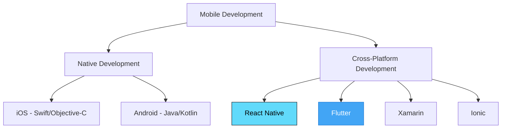
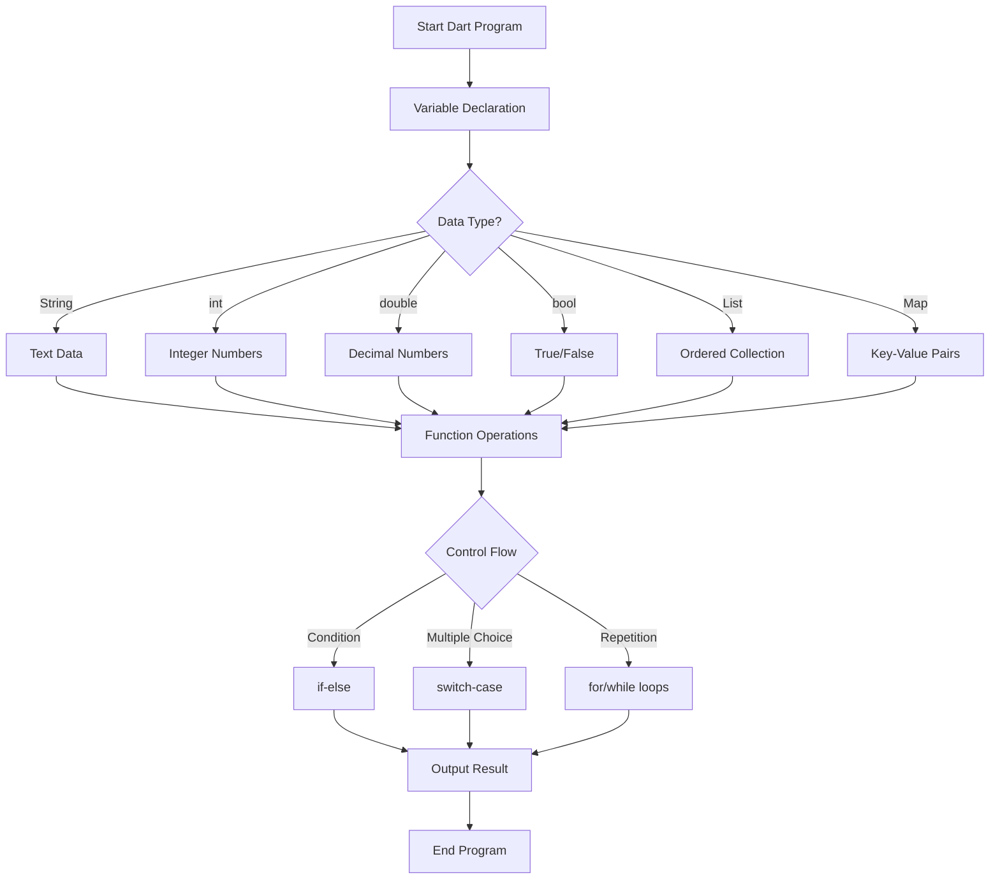

# 📱 Pertemuan 1: Pengenalan Flutter dan Setup Environment

<div align="center">


**Mata Kuliah: Pemrograman Piranti Bergerak dengan Flutter**  
**Kode: PPB-FLT-101 | SKS: 3 | Semester: 5/6**

</div>

---

## 🎯 Learning Objectives

Setelah mengikuti pertemuan ini, mahasiswa diharapkan mampu:

1. **Memahami** konsep cross-platform development dan keunggulan Flutter
2. **Menguasai** Dart language fundamentals (variables, data types, functions)
3. **Berhasil** setup development environment dan menjalankan first Flutter app
4. **Mengimplementasikan** project "Hello Indonesia" app dengan modifikasi styling

---

## 📋 Agenda Pertemuan

| Waktu | Aktivitas | Durasi |
|-------|-----------|--------|
| 08.00 - 08.30 | Opening & Review Prerequisites | 30 menit |
| 08.30 - 09.15 | Teori: Pengenalan Flutter | 45 menit |
| 09.15 - 09.30 | Break | 15 menit |
| 09.30 - 10.30 | Teori: Dart Programming Fundamentals | 60 menit |
| 10.30 - 11.30 | Praktikum: Setup Environment | 60 menit |
| 11.30 - 12.00 | Praktikum: Hello Indonesia App | 30 menit |

---

## 🚀 Bagian 1: Pengenalan Flutter

### Apa itu Flutter?

**Flutter** adalah framework pengembangan aplikasi mobile open-source yang dibuat oleh Google. Flutter memungkinkan developer untuk membuat aplikasi native yang indah dan performant untuk iOS dan Android dari single codebase.

### 📊 Flutter vs Framework Lainnya



#### Perbandingan Detail

| Aspek | Flutter | React Native | Native |
|-------|---------|--------------|--------|
| **Language** | Dart | JavaScript | Swift/Kotlin |
| **Performance** | Hampir Native | Good | Excellent |
| **Learning Curve** | Medium | Easy (jika tahu JS) | Steep |
| **Code Reuse** | ~95% | ~80% | 0% |
| **Community** | Growing Fast | Large | Platform Specific |
| **Companies Using** | Google, Alibaba, BMW | Facebook, Uber, Airbnb | All Major Apps |

### 🌟 Keunggulan Flutter

1. **Single Codebase** - Satu kode untuk iOS dan Android
2. **Hot Reload** - Melihat perubahan secara real-time
3. **Native Performance** - Kompilasi ke native ARM code
4. **Rich UI** - Widget system yang fleksibel
5. **Google Support** - Didukung penuh oleh Google

### 📈 Flutter di Indonesia

Flutter sangat populer di Indonesia dengan:
- **Gojek** menggunakan Flutter untuk beberapa fitur
- **Tokopedia** mengadopsi Flutter untuk aplikasi seller
- **Bukalapak** menggunakan Flutter untuk internal tools
- **Komunitas Flutter Indonesia** yang aktif dengan 10,000+ developer

---

## 💙 Bagian 2: Dart Programming Fundamentals

### Mengapa Dart?

**Dart** adalah bahasa pemrograman yang dikembangkan Google, dioptimalkan untuk UI development. Dart dipilih untuk Flutter karena:

- **Familiar syntax** - Mirip dengan Java/JavaScript
- **Strong typing** - Type safety dengan flexibility
- **Optimized for UI** - Hot reload dan tree shaking
- **Async support** - Built-in support untuk async programming

### 🔧 Dart Syntax Basics

#### 1. Variables dan Data Types

```dart
// ✅ Coba kode ini di https://zapp.run/
void main() {
  // Deklarasi Variables
  String nama = "Budi Santoso";
  int umur = 20;
  double ipk = 3.85;
  bool lulusTepat = true;
  
  // Variable dengan auto-type inference
  var universitas = "Universitas Indonesia";
  var tahunMasuk = 2022;
  
  // Konstanta
  const String kota = "Jakarta";
  final DateTime sekarang = DateTime.now();
  
  print("Nama: $nama");
  print("Umur: $umur tahun");
  print("IPK: $ipk");
  print("Lulus tepat waktu: $lulusTepat");
  print("Universitas: $universitas");
  print("Kota: $kota");
}
```

**Penjelasan Kode:**
- `String`, `int`, `double`, `bool` adalah data types dasar di Dart
- `var` memungkinkan Dart menentukan type secara otomatis
- `const` untuk nilai yang tidak berubah saat compile time
- `final` untuk nilai yang hanya bisa di-set sekali saat runtime
- `$variableName` untuk string interpolation

#### 2. Collections (List, Map, Set)

```dart
// ✅ Coba kode ini di https://zapp.run/
void main() {
  // List - Array yang bisa berubah ukurannya
  List<String> mataKuliah = [
    "Pemrograman Mobile",
    "Basis Data",
    "Sistem Operasi",
    "Jaringan Komputer"
  ];
  
  // Map - Key-Value pairs seperti Dictionary
  Map<String, dynamic> mahasiswa = {
    'nama': 'Siti Nurhaliza',
    'nim': '2022001234',
    'semester': 5,
    'ipk': 3.75,
    'aktif': true
  };
  
  // Set - Collection yang tidak memiliki duplikat
  Set<String> hobi = {'membaca', 'coding', 'traveling', 'gaming'};
  
  // Mengakses dan memodifikasi
  print("Mata kuliah pertama: ${mataKuliah[0]}");
  print("Nama mahasiswa: ${mahasiswa['nama']}");
  print("Hobi: $hobi");
  
  // Menambah elemen
  mataKuliah.add("Algoritma dan Struktur Data");
  mahasiswa['email'] = 'siti@email.com';
  hobi.add('musik');
  
  print("\nSetelah ditambah:");
  print("Total mata kuliah: ${mataKuliah.length}");
  print("Data mahasiswa: $mahasiswa");
  print("Hobi baru: $hobi");
}
```

#### 3. Functions

```dart
// ✅ Coba kode ini di https://zapp.run/
void main() {
  // Memanggil functions
  sapa("Andi");
  
  double hasil = hitungIPK([3.5, 4.0, 3.75, 3.25]);
  print("IPK: ${hasil.toStringAsFixed(2)}");
  
  String grade = tentukanGrade(hasil);
  print("Grade: $grade");
  
  // Arrow function untuk operasi sederhana
  var kuadrat = (int x) => x * x;
  print("5 kuadrat = ${kuadrat(5)}");
}

// Function void (tidak mengembalikan nilai)
void sapa(String nama) {
  print("Halo, $nama! Selamat datang di kuliah Flutter.");
}

// Function yang mengembalikan nilai
double hitungIPK(List<double> nilaiList) {
  if (nilaiList.isEmpty) return 0.0;
  
  double total = 0;
  for (double nilai in nilaiList) {
    total += nilai;
  }
  return total / nilaiList.length;
}

// Function dengan parameter optional
String tentukanGrade(double ipk, {String sistem = "4.0"}) {
  if (sistem == "4.0") {
    if (ipk >= 3.5) return "Cum Laude";
    if (ipk >= 3.0) return "Sangat Memuaskan";
    if (ipk >= 2.5) return "Memuaskan";
    return "Cukup";
  }
  return "Sistem tidak dikenal";
}
```

#### 4. Control Flow

```dart
// ✅ Coba kode ini di https://zapp.run/
void main() {
  int semester = 5;
  List<String> mataKuliah = ["Flutter", "AI", "Blockchain"];
  
  // If-else statement
  if (semester >= 7) {
    print("Sudah boleh mengambil skripsi");
  } else if (semester >= 5) {
    print("Bisa mengambil mata kuliah pilihan");
  } else {
    print("Focus pada mata kuliah wajib");
  }
  
  // Switch-case
  String status = getStatusMahasiswa(semester);
  switch (status) {
    case "junior":
      print("Mahasiswa tingkat awal");
      break;
    case "senior":
      print("Mahasiswa tingkat akhir");
      break;
    default:
      print("Status tidak dikenal");
  }
  
  // For loop
  print("\nMata kuliah semester ini:");
  for (int i = 0; i < mataKuliah.length; i++) {
    print("${i + 1}. ${mataKuliah[i]}");
  }
  
  // Enhanced for loop
  print("\nDengan enhanced for:");
  for (String mk in mataKuliah) {
    print("- $mk");
  }
  
  // While loop
  int nilai = 0;
  print("\nHitung mundur:");
  while (nilai < 5) {
    print("Nilai: $nilai");
    nilai++;
  }
}

String getStatusMahasiswa(int semester) {
  return semester <= 4 ? "junior" : "senior";
}
```

### 📊 Diagram Alir Dart Basics



---

## 🛠️ Bagian 3: Setup Development Environment

### Persyaratan Sistem

#### Minimum Requirements:
- **OS**: Windows 10+, macOS 10.14+, atau Linux (Ubuntu 18.04+)
- **RAM**: 8 GB (16 GB recommended)
- **Storage**: 10 GB free space
- **Processor**: Intel Core i5 atau AMD Ryzen 5

### 📥 Langkah Instalasi

#### 1. Download Flutter SDK

```bash
# Windows (PowerShell)
# Download dari https://flutter.dev/docs/get-started/install/windows
# Extract ke C:\src\flutter

# macOS (Terminal)
cd ~/development
curl -O https://storage.googleapis.com/flutter_infra_release/releases/stable/macos/flutter_macos_3.24.0-stable.zip
unzip flutter_macos_3.24.0-stable.zip

# Linux (Terminal)
cd ~/development
wget https://storage.googleapis.com/flutter_infra_release/releases/stable/linux/flutter_linux_3.24.0-stable.tar.xz
tar xf flutter_linux_3.24.0-stable.tar.xz
```

#### 2. Setup Environment Variables

```bash
# Windows - Tambahkan ke PATH:
# C:\src\flutter\bin

# macOS/Linux - Tambahkan ke ~/.bashrc atau ~/.zshrc:
export PATH="$PATH:`pwd`/flutter/bin"
source ~/.bashrc  # atau ~/.zshrc
```

#### 3. Verifikasi Instalasi

```bash
# Jalankan flutter doctor untuk cek setup
flutter doctor

# Output yang diharapkan:
# ✓ Flutter (Channel stable, 3.24.0)
# ✓ Android toolchain
# ✓ VS Code
# ✓ Connected device
```

#### 4. Setup Android Development

```bash
# Download Android Studio dari:
# https://developer.android.com/studio

# Atau install Android SDK tools saja:
flutter doctor --android-licenses
```

### 🔧 Setup IDE (VS Code)

#### Extensions yang Diperlukan:

1. **Flutter** (Dart-Code.flutter)
2. **Dart** (Dart-Code.dart-code)
3. **Android iOS Emulator** (DiemasMichiels.emulate)
4. **Flutter Tree** (marcelovelasquez.flutter-tree)

```json
// settings.json untuk VS Code
{
  "dart.flutterSdkPath": "C:\\src\\flutter",
  "dart.debugSdkLibraries": false,
  "dart.debugExternalPackageLibraries": false,
  "editor.formatOnSave": true,
  "editor.rulers": [80],
  "dart.lineLength": 80
}
```

---

## 📱 Bagian 4: Project "Hello Indonesia" App

### 🎯 Tujuan Project

Membuat aplikasi Flutter pertama yang menampilkan informasi tentang Indonesia dengan styling yang menarik.

### 🚀 Langkah-langkah

#### 1. Create New Flutter Project

```bash
# Buat project baru
flutter create hello_indonesia
cd hello_indonesia

# Jalankan aplikasi
flutter run
```

#### 2. Struktur Project Flutter

```
hello_indonesia/
├── android/          # Konfigurasi Android
├── ios/              # Konfigurasi iOS  
├── lib/              # Kode Dart utama
│   └── main.dart     # Entry point aplikasi
├── test/             # Unit tests
├── pubspec.yaml      # Dependencies dan assets
└── README.md         # Dokumentasi project
```

#### 3. Modifikasi main.dart

```dart
// ✅ Coba kode ini di https://zapp.run/
import 'package:flutter/material.dart';

void main() {
  runApp(HelloIndonesiaApp());
}

class HelloIndonesiaApp extends StatelessWidget {
  @override
  Widget build(BuildContext context) {
    return MaterialApp(
      title: 'Hello Indonesia',
      theme: ThemeData(
        primarySwatch: Colors.red,
        visualDensity: VisualDensity.adaptivePlatformDensity,
      ),
      home: HomePage(),
      debugShowCheckedModeBanner: false,
    );
  }
}

class HomePage extends StatelessWidget {
  @override
  Widget build(BuildContext context) {
    return Scaffold(
      appBar: AppBar(
        title: Text(
          'Hello Indonesia 🇮🇩',
          style: TextStyle(
            fontWeight: FontWeight.bold,
            color: Colors.white,
          ),
        ),
        backgroundColor: Colors.red[700],
        elevation: 0,
      ),
      body: Container(
        decoration: BoxDecoration(
          gradient: LinearGradient(
            begin: Alignment.topCenter,
            end: Alignment.bottomCenter,
            colors: [
              Colors.red[700]!,
              Colors.white,
            ],
          ),
        ),
        child: Center(
          child: Column(
            mainAxisAlignment: MainAxisAlignment.center,
            children: [
              // Logo atau Icon Indonesia
              Container(
                width: 120,
                height: 120,
                decoration: BoxDecoration(
                  color: Colors.white,
                  shape: BoxShape.circle,
                  boxShadow: [
                    BoxShadow(
                      color: Colors.black26,
                      blurRadius: 10,
                      offset: Offset(0, 5),
                    ),
                  ],
                ),
                child: Icon(
                  Icons.flag,
                  size: 60,
                  color: Colors.red[700],
                ),
              ),
              
              SizedBox(height: 30),
              
              // Judul Utama
              Text(
                'Selamat Datang',
                style: TextStyle(
                  fontSize: 32,
                  fontWeight: FontWeight.bold,
                  color: Colors.white,
                  shadows: [
                    Shadow(
                      blurRadius: 10.0,
                      color: Colors.black45,
                      offset: Offset(2.0, 2.0),
                    ),
                  ],
                ),
              ),
              
              SizedBox(height: 10),
              
              // Subtitle
              Text(
                'di Aplikasi Flutter Indonesia',
                style: TextStyle(
                  fontSize: 18,
                  color: Colors.white70,
                  fontStyle: FontStyle.italic,
                ),
              ),
              
              SizedBox(height: 40),
              
              // Card dengan informasi
              Card(
                margin: EdgeInsets.symmetric(horizontal: 30),
                elevation: 8,
                shape: RoundedRectangleBorder(
                  borderRadius: BorderRadius.circular(15),
                ),
                child: Padding(
                  padding: EdgeInsets.all(20),
                  child: Column(
                    children: [
                      Text(
                        'Indonesia',
                        style: TextStyle(
                          fontSize: 24,
                          fontWeight: FontWeight.bold,
                          color: Colors.red[700],
                        ),
                      ),
                      SizedBox(height: 15),
                      InfoRow(
                        icon: Icons.location_on,
                        label: 'Ibukota',
                        value: 'Jakarta',
                      ),
                      InfoRow(
                        icon: Icons.people,
                        label: 'Populasi',
                        value: '273+ Juta',
                      ),
                      InfoRow(
                        icon: Icons.language,
                        label: 'Bahasa',
                        value: 'Bahasa Indonesia',
                      ),
                      InfoRow(
                        icon: Icons.terrain,
                        label: 'Pulau',
                        value: '17.508 Pulau',
                      ),
                    ],
                  ),
                ),
              ),
              
              SizedBox(height: 30),
              
              // Button
              ElevatedButton(
                onPressed: () {
                  // Aksi ketika button ditekan
                  print('Button ditekan!');
                },
                child: Text(
                  'Jelajahi Indonesia',
                  style: TextStyle(
                    fontSize: 16,
                    fontWeight: FontWeight.bold,
                  ),
                ),
                style: ElevatedButton.styleFrom(
                  backgroundColor: Colors.red[700],
                  foregroundColor: Colors.white,
                  padding: EdgeInsets.symmetric(
                    horizontal: 30,
                    vertical: 15,
                  ),
                  shape: RoundedRectangleBorder(
                    borderRadius: BorderRadius.circular(25),
                  ),
                ),
              ),
            ],
          ),
        ),
      ),
    );
  }
}

// Widget custom untuk informasi
class InfoRow extends StatelessWidget {
  final IconData icon;
  final String label;
  final String value;
  
  const InfoRow({
    required this.icon,
    required this.label,
    required this.value,
  });
  
  @override
  Widget build(BuildContext context) {
    return Padding(
      padding: EdgeInsets.symmetric(vertical: 5),
      child: Row(
        children: [
          Icon(
            icon,
            color: Colors.red[700],
            size: 20,
          ),
          SizedBox(width: 10),
          Text(
            '$label: ',
            style: TextStyle(
              fontWeight: FontWeight.w600,
              color: Colors.grey[700],
            ),
          ),
          Text(
            value,
            style: TextStyle(
              color: Colors.grey[600],
            ),
          ),
        ],
      ),
    );
  }
}
```

### 📊 Diagram Struktur Widget

```mermaid
graph TD
    A[MaterialApp] --> B[HomePage - Scaffold]
    B --> C[AppBar]
    B --> D[Body - Container]
    
    D --> E[Gradient Background]
    D --> F[Center Widget]
    
    F --> G[Column]
    G --> H[Circle Avatar]
    G --> I[Welcome Text]
    G --> J[Subtitle Text]
    G --> K[Info Card]
    G --> L[Action Button]
    
    K --> M[Indonesia Info]
    M --> N[InfoRow - Capital]
    M --> O[InfoRow - Population]
    M --> P[InfoRow - Language]
    M --> Q[InfoRow - Islands]
```



### 🎨 Penjelasan Komponen UI

#### 1. **MaterialApp**
- Root widget yang mengatur tema dan navigasi
- Menggunakan Material Design guidelines

#### 2. **Scaffold**
- Menyediakan struktur layout dasar (AppBar, Body, FloatingActionButton)
- Framework untuk screen layout

#### 3. **Container dengan Gradient**
- Background dengan gradient warna merah-putih (bendera Indonesia)
- Menggunakan `LinearGradient` untuk efek visual

#### 4. **Custom InfoRow Widget**
- Widget reusable untuk menampilkan informasi
- Mendemonstrasikan pembuatan custom widget

---

## 🧪 Testing dan Debugging

### 1. Hot Reload

```bash
# Saat aplikasi berjalan, tekan:
r  # Hot reload
R  # Hot restart
q  # Quit
```

### 2. Debug dengan Print

```dart
// Tambahkan print statements untuk debugging
print('Debug: Widget sedang di-build');
print('Debug: Nilai variabel = $nilai');
```

### 3. Flutter Inspector

- Buka Flutter Inspector di VS Code
- Analyze widget tree structure
- Debug layout issues

---

## 📚 Istilah dan Singkatan

| Istilah | Pengertian |
|---------|------------|
| **SDK** | Software Development Kit - Kumpulan tools untuk development |
| **IDE** | Integrated Development Environment - Editor kode lengkap |
| **Widget** | Komponen UI dasar di Flutter |
| **Hot Reload** | Refresh aplikasi tanpa restart untuk melihat perubahan |
| **Scaffold** | Widget yang menyediakan struktur layout dasar |
| **StatelessWidget** | Widget yang tidak memiliki state yang berubah |
| **StatefulWidget** | Widget yang memiliki state yang bisa berubah |
| **Material Design** | Design system dari Google |
| **Dart** | Bahasa pemrograman untuk Flutter |
| **Cross-platform** | Aplikasi yang bisa berjalan di multiple platform |

---

## 🎯 Assessment dan Evaluasi

### 1. Environment Setup Verification (5%)

**Kriteria Penilaian:**
- [ ] Flutter SDK terinstall dengan benar
- [ ] `flutter doctor` menunjukkan hasil OK
- [ ] IDE setup dengan extensions Flutter
- [ ] Mampu menjalankan aplikasi di emulator/device

### 2. Quiz Dart Basics (5%)

**Sample Questions:**

1. Apa perbedaan antara `var`, `final`, dan `const` di Dart?
2. Bagaimana cara membuat function yang mengembalikan nilai di Dart?
3. Apa kegunaan string interpolation dengan `$` di Dart?

### 3. Praktikum Hello Indonesia (Bonus)

**Kriteria:**
- [ ] Aplikasi berjalan tanpa error
- [ ] UI sesuai dengan design requirements
- [ ] Custom InfoRow widget implemented
- [ ] Kode clean dan commented

---

## 🔗 Referensi dan Sumber Belajar

### Dokumentasi Resmi
1. Flutter Official Documentation. (2024). *Get Started with Flutter*. Google. https://docs.flutter.dev/get-started
2. Dart Team. (2024). *Dart Language Tour*. Google. https://dart.dev/guides/language/language-tour
3. Google Developers. (2024). *Flutter Codelabs*. https://codelabs.developers.google.com/codelabs/flutter-codelab-first

### Sumber Bahasa Indonesia
4. Dicoding Indonesia. (2024). *Belajar Membuat Aplikasi Flutter untuk Pemula*. https://www.dicoding.com/academies/159
5. Petani Kode. (2024). *Tutorial Flutter - Pengenalan dan Persiapan*. https://www.petanikode.com/flutter-linux/
6. BuildWithAngga. (2024). *Flutter Tutorial untuk Pemula*. https://buildwithangga.com/tips/flutter-tutorial-tips-belajar-flutter-untuk-pemula

### Video Tutorial
7. Handoyo, E. D. (2024). *Flutter Indonesia Complete Course*. YouTube Channel Flutter.id. https://flutter.id/
8. Koding Indonesia. (2024). *Tutorial Flutter Bahasa Indonesia*. https://kodingindonesia.com/tutorial-flutter-bahasa-indonesia/

### Artikel dan Blog
9. Medium OY! Indonesia. (2024). *Flutter at OY! Indonesia: The Motivation*. https://medium.com/oyindonesia/flutter-at-oy-indonesia-the-motivation-42e8c085002f
10. GeeksforGeeks. (2024). *Flutter Tutorial - Learn Flutter Step by Step*. https://www.geeksforgeeks.org/flutter/flutter-tutorial/

---

## 📝 Tugas dan Follow-up

### Tugas Rumah
1. **Setup Environment** - Pastikan semua tools terinstall dengan benar
2. **Explore Dart** - Coba semua contoh kode di DartPad atau Zapp.run
3. **Modify Hello Indonesia** - Tambahkan informasi daerah asal masing-masing

### Persiapan Pertemuan Selanjutnya
- Review OOP concepts (Class, Object, Inheritance)
- Install Git untuk version control
- Join Flutter Indonesia Telegram Group

---

<div align="center">

**🎉 Selamat! Anda telah menyelesaikan Pertemuan 1 🎉**

*Lanjutkan ke [Pertemuan 2: Dart Programming dan OOP Concepts →]()*

---

**📧 Kontak Dosen**  
Email: [dosen@university.ac.id]  
Office Hours: Senin-Jumat 09:00-16:00

</div>