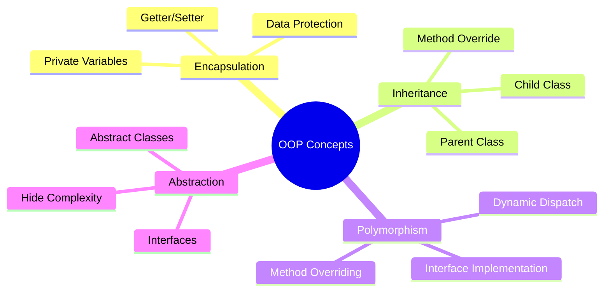

# 📱 Pertemuan 2: Dart Programming dan Object-Oriented Programming

<div align="center">


**Mata Kuliah: Pemrograman Piranti Bergerak dengan Flutter**  
**Kode: PPB-FLT-101 | SKS: 3 | Semester: 5/6**

</div>

---

## 🎯 Learning Objectives

Setelah mengikuti pertemuan ini, mahasiswa diharapkan mampu:

1. **Menguasai** Object-Oriented Programming (OOP) dalam bahasa Dart secara mendalam
2. **Memahami** penggunaan Collections (Lists, Maps, Sets) untuk manipulasi data kompleks
3. **Menerapkan** exception handling dan error management yang proper
4. **Mengimplementasikan** async programming basics dengan Future dan async/await
5. **Membuat** aplikasi "BMI Calculator Indonesia" dengan penerapan semua konsep OOP

---

## 📋 Agenda Pertemuan

| Waktu | Aktivitas | Durasi |
|-------|-----------|--------|
| 08.00 - 08.15 | Review Pertemuan 1 & Q&A | 15 menit |
| 08.15 - 09.30 | Teori: Object-Oriented Programming di Dart | 75 menit |
| 09.30 - 09.45 | Break | 15 menit |
| 09.45 - 10.30 | Teori: Collections dan Data Structures | 45 menit |
| 10.30 - 11.00 | Teori: Exception Handling & Async Programming | 30 menit |
| 11.00 - 12.00 | Praktikum: BMI Calculator Indonesia | 60 menit |

---

## 🏗️ Bagian 1: Object-Oriented Programming di Dart

### Apa itu OOP?

**Object-Oriented Programming (OOP)** adalah paradigma pemrograman yang menggunakan objek dan kelas untuk mengorganisir kode. Di Dart, semua adalah objek - bahkan numbers, functions, dan null!

### 🧱 Konsep Dasar OOP



### 1. Classes dan Objects

#### Definisi Class Dasar

```dart
// ✅ Coba kode ini di https://zapp.run/
class Mahasiswa {
  // Properties (Attributes)
  String nama;
  String nim;
  String jurusan;
  int semester;
  double ipk;
  
  // Constructor
  Mahasiswa(this.nama, this.nim, this.jurusan, this.semester, this.ipk);
  
  // Named Constructor
  Mahasiswa.baru(this.nama, this.nim, this.jurusan) 
    : semester = 1, ipk = 0.0;
  
  // Methods (Functions)
  void perkenalkan() {
    print("Halo! Nama saya $nama dari jurusan $jurusan");
  }
  
  String getStatus() {
    if (ipk >= 3.5) return "Cum Laude";
    if (ipk >= 3.0) return "Sangat Memuaskan";
    if (ipk >= 2.5) return "Memuaskan";
    return "Cukup";
  }
  
  void updateIPK(double ipkBaru) {
    if (ipkBaru >= 0.0 && ipkBaru <= 4.0) {
      ipk = ipkBaru;
      print("IPK berhasil diupdate menjadi $ipk");
    } else {
      print("Error: IPK harus antara 0.0 - 4.0");
    }
  }
}

void main() {
  // Membuat objek (instantiation)
  Mahasiswa mhs1 = Mahasiswa("Budi Santoso", "2022001", "Teknik Informatika", 5, 3.75);
  Mahasiswa mhs2 = Mahasiswa.baru("Siti Nurhaliza", "2024001", "Sistem Informasi");
  
  // Menggunakan methods
  mhs1.perkenalkan();
  print("Status akademik: ${mhs1.getStatus()}");
  
  mhs2.perkenalkan();
  mhs2.updateIPK(3.25);
  print("Status akademik: ${mhs2.getStatus()}");
}
```

**Penjelasan Kode:**

- **Class** adalah blueprint/template untuk membuat objek
- **Properties** adalah variabel yang menyimpan data objek
- **Constructor** adalah method khusus untuk inisialisasi objek
- **Named Constructor** memberikan cara alternatif membuat objek
- **Methods** adalah functions yang terkait dengan class
- **this** keyword merujuk pada instance saat ini

### 2. Encapsulation - Data Privacy

```dart
// ✅ Coba kode ini di https://zapp.run/
class RekeningBank {
  String _nomorRekening; // Private variable (underscore prefix)
  String _namaPemilik;
  double _saldo;
  
  // Constructor
  RekeningBank(this._nomorRekening, this._namaPemilik, this._saldo);
  
  // Getter methods
  String get nomorRekening => _nomorRekening;
  String get namaPemilik => _namaPemilik;
  double get saldo => _saldo;
  
  // Setter dengan validation
  set namaPemilik(String nama) {
    if (nama.isNotEmpty && nama.length >= 3) {
      _namaPemilik = nama;
    } else {
      print("Error: Nama pemilik tidak valid");
    }
  }
  
  // Method untuk deposit
  void deposit(double jumlah) {
    if (jumlah > 0) {
      _saldo += jumlah;
      print("Deposit Rp${jumlah.toStringAsFixed(0)} berhasil. Saldo: Rp${_saldo.toStringAsFixed(0)}");
    } else {
      print("Error: Jumlah deposit harus lebih dari 0");
    }
  }
  
  // Method untuk withdrawal
  bool withdraw(double jumlah) {
    if (jumlah > 0 && jumlah <= _saldo) {
      _saldo -= jumlah;
      print("Withdraw Rp${jumlah.toStringAsFixed(0)} berhasil. Saldo: Rp${_saldo.toStringAsFixed(0)}");
      return true;
    } else {
      print("Error: Saldo tidak mencukupi atau jumlah tidak valid");
      return false;
    }
  }
  
  // Method untuk transfer
  bool transfer(RekeningBank tujuan, double jumlah) {
    if (withdraw(jumlah)) {
      tujuan.deposit(jumlah);
      print("Transfer ke ${tujuan.namaPemilik} berhasil");
      return true;
    }
    return false;
  }
  
  void cekSaldo() {
    print("Saldo rekening ${_namaPemilik}: Rp${_saldo.toStringAsFixed(0)}");
  }
}

void main() {
  // Membuat objek rekening
  RekeningBank rekening1 = RekeningBank("1234567890", "Ahmad Dahlan", 1000000);
  RekeningBank rekening2 = RekeningBank("0987654321", "Kartini Putri", 500000);
  
  // Menggunakan methods
  rekening1.cekSaldo();
  rekening2.cekSaldo();
  
  // Operasi banking
  rekening1.deposit(250000);
  rekening1.withdraw(100000);
  rekening1.transfer(rekening2, 200000);
  
  // Cek saldo akhir
  print("\n=== Saldo Akhir ===");
  rekening1.cekSaldo();
  rekening2.cekSaldo();
}
```

**Konsep Encapsulation:**
- **Private variables** (`_variableName`) hanya bisa diakses dalam class
- **Getter** memberikan akses read-only ke private variables
- **Setter** memberikan kontrol akses write dengan validation
- **Data protection** mencegah akses langsung yang tidak diinginkan

### 3. Inheritance - Pewarisan

```dart
// ✅ Coba kode ini di https://zapp.run/
// Parent Class (Superclass)
class Kendaraan {
  String merk;
  String model;
  int tahun;
  String warna;
  
  Kendaraan(this.merk, this.model, this.tahun, this.warna);
  
  void info() {
    print("Kendaraan: $merk $model ($tahun) - Warna: $warna");
  }
  
  void nyalakan() {
    print("$merk $model dinyalakan");
  }
  
  void matikan() {
    print("$merk $model dimatikan");
  }
}

// Child Class - Mobil
class Mobil extends Kendaraan {
  int jumlahPintu;
  String jenisBahanBakar;
  
  // Constructor dengan super keyword
  Mobil(String merk, String model, int tahun, String warna, 
        this.jumlahPintu, this.jenisBahanBakar) 
    : super(merk, model, tahun, warna);
  
  // Method Override
  @override
  void info() {
    super.info(); // Memanggil method parent
    print("Tipe: Mobil - Pintu: $jumlahPintu - Bahan Bakar: $jenisBahanBakar");
  }
  
  // Method khusus mobil
  void klakson() {
    print("Beep beep! $merk sedang membunyikan klakson");
  }
  
  void parkir() {
    print("$merk $model diparkir di tempat parkir mobil");
  }
}

// Child Class - Motor
class Motor extends Kendaraan {
  int kapasitasMesin;
  bool adaBoncengan;
  
  Motor(String merk, String model, int tahun, String warna,
        this.kapasitasMesin, this.adaBoncengan)
    : super(merk, model, tahun, warna);
  
  @override
  void info() {
    super.info();
    print("Tipe: Motor - CC: $kapasitasMesin - Boncengan: ${adaBoncengan ? 'Ada' : 'Tidak Ada'}");
  }
  
  void gas() {
    print("Ngeeeng! $merk sedang di-gas");
  }
  
  void parkir() {
    print("$merk $model diparkir di area parkir motor");
  }
}

// Grandchild Class - Mobil Listrik
class MobilListrik extends Mobil {
  int kapasitasBaterai; // dalam kWh
  int jangkauan; // dalam km
  
  MobilListrik(String merk, String model, int tahun, String warna,
               int jumlahPintu, this.kapasitasBaterai, this.jangkauan)
    : super(merk, model, tahun, warna, jumlahPintu, "Listrik");
  
  @override
  void info() {
    super.info();
    print("Baterai: ${kapasitasBaterai}kWh - Jangkauan: ${jangkauan}km");
  }
  
  @override
  void nyalakan() {
    print("$merk $model dinyalakan secara silent (tanpa suara)");
  }
  
  void charge() {
    print("$merk sedang di-charge baterainya");
  }
}

void main() {
  // Membuat berbagai jenis kendaraan
  Kendaraan kendaraanUmum = Kendaraan("Isuzu", "Elf", 2020, "Putih");
  Mobil mobil = Mobil("Toyota", "Avanza", 2022, "Silver", 4, "Bensin");
  Motor motor = Motor("Honda", "Beat", 2021, "Merah", 110, true);
  MobilListrik mobilListrik = MobilListrik("Tesla", "Model 3", 2023, "Hitam", 4, 75, 500);
  
  print("=== Informasi Kendaraan ===");
  kendaraanUmum.info();
  print();
  
  mobil.info();
  mobil.klakson();
  mobil.parkir();
  print();
  
  motor.info();
  motor.gas();
  motor.parkir();
  print();
  
  mobilListrik.info();
  mobilListrik.nyalakan();
  mobilListrik.charge();
  print();
  
  // Demonstrasi Polymorphism
  print("=== Polimorfisme ===");
  List<Kendaraan> daftarKendaraan = [mobil, motor, mobilListrik];
  
  for (Kendaraan k in daftarKendaraan) {
    k.info(); // Method yang dipanggil tergantung pada tipe objek actual
    print("---");
  }
}
```

**Konsep Inheritance:**
- **extends** keyword untuk membuat inheritance relationship
- **super** keyword untuk mengakses parent class
- **@override** annotation untuk method overriding
- **Polymorphism** - objek yang berbeda merespons method call yang sama dengan cara berbeda

### 4. Abstract Classes dan Interfaces

```dart
// ✅ Coba kode ini di https://zapp.run/
// Abstract Class
abstract class Bentuk {
  String nama;
  
  Bentuk(this.nama);
  
  // Abstract method - harus diimplementasikan oleh child class
  double hitungLuas();
  double hitungKeliling();
  
  // Concrete method - bisa digunakan langsung
  void tampilkanInfo() {
    print("Bentuk: $nama");
    print("Luas: ${hitungLuas().toStringAsFixed(2)}");
    print("Keliling: ${hitungKeliling().toStringAsFixed(2)}");
  }
}

// Interface menggunakan abstract class
abstract class Warna {
  void setWarna(String warna);
  String getWarna();
}

// Implementation
class PersegiPanjang extends Bentuk implements Warna {
  double panjang;
  double lebar;
  String _warna = "Putih";
  
  PersegiPanjang(this.panjang, this.lebar) : super("Persegi Panjang");
  
  @override
  double hitungLuas() {
    return panjang * lebar;
  }
  
  @override
  double hitungKeliling() {
    return 2 * (panjang + lebar);
  }
  
  @override
  void setWarna(String warna) {
    _warna = warna;
  }
  
  @override
  String getWarna() {
    return _warna;
  }
}

class Lingkaran extends Bentuk implements Warna {
  double radius;
  String _warna = "Putih";
  
  Lingkaran(this.radius) : super("Lingkaran");
  
  @override
  double hitungLuas() {
    return 3.14159 * radius * radius;
  }
  
  @override
  double hitungKeliling() {
    return 2 * 3.14159 * radius;
  }
  
  @override
  void setWarna(String warna) {
    _warna = warna;
  }
  
  @override
  String getWarna() {
    return _warna;
  }
}

class Segitiga extends Bentuk implements Warna {
  double alas;
  double tinggi;
  double sisiA, sisiB, sisiC;
  String _warna = "Putih";
  
  Segitiga(this.alas, this.tinggi, this.sisiA, this.sisiB, this.sisiC) 
    : super("Segitiga");
  
  @override
  double hitungLuas() {
    return 0.5 * alas * tinggi;
  }
  
  @override
  double hitungKeliling() {
    return sisiA + sisiB + sisiC;
  }
  
  @override
  void setWarna(String warna) {
    _warna = warna;
  }
  
  @override
  String getWarna() {
    return _warna;
  }
}

void main() {
  // Membuat berbagai bentuk
  PersegiPanjang persegi = PersegiPanjang(10, 5);
  Lingkaran lingkaran = Lingkaran(7);
  Segitiga segitiga = Segitiga(8, 6, 6, 8, 10);
  
  // Set warna
  persegi.setWarna("Merah");
  lingkaran.setWarna("Biru");
  segitiga.setWarna("Hijau");
  
  // List polimorfik
  List<Bentuk> daftarBentuk = [persegi, lingkaran, segitiga];
  
  print("=== Perhitungan Bentuk Geometri ===");
  for (Bentuk bentuk in daftarBentuk) {
    bentuk.tampilkanInfo();
    if (bentuk is Warna) {
      print("Warna: ${bentuk.getWarna()}");
    }
    print("" + "="*30);
  }
}
```

---

## 📚 Bagian 2: Collections dan Data Structures

### Apa itu Collections?

**Collections** adalah struktur data yang dapat menyimpan multiple values. Dart menyediakan tiga jenis collection utama: **List**, **Set**, dan **Map**.

### 1. Lists - Array yang Fleksibel

```dart
// ✅ Coba kode ini di https://zapp.run/
void main() {
  print("=== DART LISTS DEMO ===\n");
  
  // 1. Deklarasi List
  List<String> provinsiIndonesia = [
    "DKI Jakarta", "Jawa Barat", "Jawa Tengah", "Jawa Timur",
    "Sumatera Utara", "Sumatera Barat", "Kalimantan Timur"
  ];
  
  List<int> populasi = [10560000, 48274000, 34490000, 39293000, 14799000, 5534000, 3721000];
  
  // 2. Akses elemen
  print("Provinsi pertama: ${provinsiIndonesia[0]}");
  print("Provinsi terakhir: ${provinsiIndonesia.last}");
  print("Jumlah provinsi: ${provinsiIndonesia.length}");
  
  // 3. Menambah elemen
  provinsiIndonesia.add("Bali");
  populasi.add(4362000);
  
  // 4. Menambah multiple elemen
  provinsiIndonesia.addAll(["Sulawesi Selatan", "Lampung"]);
  populasi.addAll([8690000, 9007000]);
  
  // 5. Insert di posisi tertentu
  provinsiIndonesia.insert(2, "DIY Yogyakarta");
  populasi.insert(2, 3842000);
  
  print("\n=== Data Provinsi Indonesia ===");
  for (int i = 0; i < provinsiIndonesia.length; i++) {
    print("${i + 1}. ${provinsiIndonesia[i]} - ${populasi[i].toStringAsFixed(0)} jiwa");
  }
  
  // 6. List Methods
  print("\n=== List Operations ===");
  
  // Cari provinsi dengan populasi > 10 juta
  List<String> provinsiPadat = [];
  for (int i = 0; i < provinsiIndonesia.length; i++) {
    if (populasi[i] > 10000000) {
      provinsiPadat.add(provinsiIndonesia[i]);
    }
  }
  
  print("Provinsi dengan populasi > 10 juta:");
  for (String provinsi in provinsiPadat) {
    print("- $provinsi");
  }
  
  // 7. Sort dan Reverse
  List<String> provinsiSorted = List.from(provinsiIndonesia)..sort();
  print("\nProvinsi (A-Z): ${provinsiSorted.join(', ')}");
  
  // 8. Where, Map, Reduce operations
  List<int> populasiBesar = populasi.where((pop) => pop > 5000000).toList();
  print("\nPopulasi > 5 juta: ${populasiBesar.map((p) => '${(p / 1000000).toStringAsFixed(1)}M').join(', ')}");
  
  int totalPopulasi = populasi.reduce((a, b) => a + b);
  print("Total populasi: ${(totalPopulasi / 1000000).toStringAsFixed(1)} juta jiwa");
  
  // 9. List Comprehension alternative
  List<String> infoProvinsi = [];
  for (int i = 0; i < provinsiIndonesia.length; i++) {
    String kategori = populasi[i] > 10000000 ? "Sangat Padat" : 
                     populasi[i] > 5000000 ? "Padat" : "Sedang";
    infoProvinsi.add("${provinsiIndonesia[i]} ($kategori)");
  }
  
  print("\n=== Kategorisasi Kepadatan ===");
  for (String info in infoProvinsi) {
    print("- $info");
  }
}
```

### 2. Sets - Collection Unik

```dart
// ✅ Coba kode ini di https://zapp.run/
void main() {
  print("=== DART SETS DEMO ===\n");
  
  // 1. Deklarasi Set
  Set<String> bahasaDaerah = {
    "Jawa", "Sunda", "Batak", "Minang", "Bugis", "Bali", "Dayak"
  };
  
  Set<String> makananKhas = {
    "Gudeg", "Rendang", "Pempek", "Sate", "Gado-gado", "Rujak", "Bakso"
  };
  
  print("Bahasa Daerah Indonesia: ${bahasaDaerah.join(', ')}");
  print("Jumlah bahasa: ${bahasaDaerah.length}");
  
  // 2. Menambah elemen (duplikat akan diabaikan)
  bahasaDaerah.add("Betawi");
  bahasaDaerah.add("Jawa"); // Duplikat - tidak akan ditambahkan
  
  print("\nSetelah menambah 'Betawi' dan 'Jawa' (duplikat):");
  print("Bahasa Daerah: ${bahasaDaerah.join(', ')}");
  print("Jumlah bahasa: ${bahasaDaerah.length}");
  
  // 3. Set Operations
  Set<String> wisataBudaya = {"Borobudur", "Prambanan", "Keraton", "Museum"};
  Set<String> wisataAlam = {"Bromo", "Komodo", "Danau Toba", "Borobudur"}; // Borobudur ada di kedua set
  
  // Union (gabungan)
  Set<String> semuaWisata = wisataBudaya.union(wisataAlam);
  print("\n=== Operasi Set ===");
  print("Wisata Budaya: ${wisataBudaya.join(', ')}");
  print("Wisata Alam: ${wisataAlam.join(', ')}");
  print("Semua Wisata (Union): ${semuaWisata.join(', ')}");
  
  // Intersection (irisan)
  Set<String> wisataCampuran = wisataBudaya.intersection(wisataAlam);
  print("Wisata yang ada di kedua kategori: ${wisataCampuran.join(', ')}");
  
  // Difference (selisih)
  Set<String> wisataBudayaMurni = wisataBudaya.difference(wisataAlam);
  print("Wisata budaya murni: ${wisataBudayaMurni.join(', ')}");
  
  // 4. Contains dan operasi Boolean
  print("\n=== Pengecekan Elemen ===");
  print("Apakah ada bahasa Jawa? ${bahasaDaerah.contains('Jawa')}");
  print("Apakah ada bahasa Inggris? ${bahasaDaerah.contains('Inggris')}");
  
  // 5. Konversi Set ke List dan sebaliknya
  List<String> listBahasa = bahasaDaerah.toList()..sort();
  print("\nBahasa daerah (sorted): ${listBahasa.join(', ')}");
  
  Set<String> setMakanan = makananKhas.toSet();
  print("Makanan khas (Set): ${setMakanan.join(', ')}");
  
  // 6. Set dari List dengan duplikat
  List<String> kotaWithDuplicates = [
    "Jakarta", "Surabaya", "Bandung", "Jakarta", "Medan", "Bandung", "Semarang", "Jakarta"
  ];
  
  Set<String> kotaUnique = kotaWithDuplicates.toSet();
  print("\n=== Menghilangkan Duplikat ===");
  print("Kota asli: ${kotaWithDuplicates.join(', ')}");
  print("Kota unique: ${kotaUnique.join(', ')}");
  print("Dari ${kotaWithDuplicates.length} menjadi ${kotaUnique.length} kota");
}
```

### 3. Maps - Key-Value Pairs

```dart
// ✅ Coba kode ini di https://zapp.run/
void main() {
  print("=== DART MAPS DEMO ===\n");
  
  // 1. Deklarasi Map
  Map<String, String> ibukotaProvinsi = {
    "DKI Jakarta": "Jakarta",
    "Jawa Barat": "Bandung", 
    "Jawa Tengah": "Semarang",
    "Jawa Timur": "Surabaya",
    "Bali": "Denpasar",
    "Sumatera Utara": "Medan"
  };
  
  Map<String, dynamic> profilMahasiswa = {
    "nama": "Ahmad Dahlan",
    "nim": "2022001234",
    "umur": 20,
    "ipk": 3.75,
    "aktif": true,
    "alamat": {
      "kota": "Yogyakarta",
      "provinsi": "DIY"
    },
    "hobi": ["coding", "membaca", "traveling"]
  };
  
  // 2. Akses nilai
  print("Ibukota Jawa Barat: ${ibukotaProvinsi['Jawa Barat']}");
  print("Nama mahasiswa: ${profilMahasiswa['nama']}");
  print("IPK mahasiswa: ${profilMahasiswa['ipk']}");
  
  // 3. Menambah/update elemen
  ibukotaProvinsi['Sulawesi Selatan'] = 'Makassar';
  ibukotaProvinsi['Kalimantan Timur'] = 'Samarinda';
  
  // Update existing
  profilMahasiswa['umur'] = 21;
  profilMahasiswa['semester'] = 5;
  
  print("\n=== Data Ibukota Provinsi ===");
  ibukotaProvinsi.forEach((provinsi, ibukota) {
    print("$provinsi -> $ibukota");
  });
  
  // 4. Map methods
  print("\n=== Informasi Map ===");
  print("Jumlah provinsi: ${ibukotaProvinsi.length}");
  print("Keys: ${ibukotaProvinsi.keys.join(', ')}");
  print("Values: ${ibukotaProvinsi.values.join(', ')}");
  
  // 5. Pengecekan
  print("\nApakah ada data Bali? ${ibukotaProvinsi.containsKey('Bali')}");
  print("Apakah ada ibukota Denpasar? ${ibukotaProvinsi.containsValue('Denpasar')}");
  
  // 6. Complex Map operations
  print("\n=== Profil Mahasiswa Lengkap ===");
  profilMahasiswa.forEach((key, value) {
    if (value is Map) {
      print("$key:");
      (value as Map).forEach((subKey, subValue) {
        print("  $subKey: $subValue");
      });
    } else if (value is List) {
      print("$key: ${(value as List).join(', ')}");
    } else {
      print("$key: $value");
    }
  });
  
  // 7. Map dari List
  List<String> mahasiswaList = ["Ahmad", "Budi", "Citra", "Dewi"];
  List<double> ipkList = [3.75, 3.25, 3.95, 3.45];
  
  Map<String, double> mahasiswaIPK = {};
  for (int i = 0; i < mahasiswaList.length; i++) {
    mahasiswaIPK[mahasiswaList[i]] = ipkList[i];
  }
  
  print("\n=== Data IPK Mahasiswa ===");
  mahasiswaIPK.forEach((nama, ipk) {
    String predikat = ipk >= 3.5 ? "Cum Laude" : ipk >= 3.0 ? "Sangat Memuaskan" : "Memuaskan";
    print("$nama: $ipk ($predikat)");
  });
  
  // 8. Nested Map - Data Universitas
  Map<String, Map<String, dynamic>> dataUniversitas = {
    "UI": {
      "nama": "Universitas Indonesia",
      "lokasi": "Depok",
      "tahun_berdiri": 1950,
      "fakultas": ["FASILKOM", "FK", "FT", "FE"]
    },
    "ITB": {
      "nama": "Institut Teknologi Bandung", 
      "lokasi": "Bandung",
      "tahun_berdiri": 1920,
      "fakultas": ["STEI", "FTMD", "SITH", "SBM"]
    },
    "UGM": {
      "nama": "Universitas Gadjah Mada",
      "lokasi": "Yogyakarta", 
      "tahun_berdiri": 1949,
      "fakultas": ["Teknik", "MIPA", "Kedokteran", "Ekonomi"]
    }
  };
  
  print("\n=== Data Universitas Indonesia ===");
  dataUniversitas.forEach((kode, info) {
    print("$kode - ${info['nama']}");
    print("  Lokasi: ${info['lokasi']}");
    print("  Tahun: ${info['tahun_berdiri']}");
    print("  Fakultas: ${(info['fakultas'] as List).join(', ')}");
    print("");
  });
}
```

---

## ⚠️ Bagian 3: Exception Handling dan Error Management

### Apa itu Exception?

**Exception** adalah error yang terjadi saat runtime yang dapat mengganggu normal flow program. Dart menyediakan mekanisme try-catch untuk handle exceptions dengan graceful.

```dart
// ✅ Coba kode ini di https://zapp.run/
void main() {
  print("=== EXCEPTION HANDLING DEMO ===\n");
  
  // 1. Basic Try-Catch
  try {
    int hasil = 10 ~/ 0; // Integer division by zero
    print("Hasil: $hasil");
  } catch (e) {
    print("Error terjadi: $e");
  }
  
  // 2. Specific Exception Types
  demonstrasiPembagian();
  print("");
  
  // 3. Multiple Catch Blocks
  demonstrasiMultipleCatch();
  print("");
  
  // 4. Finally Block
  demonstrasiFinally();
  print("");
  
  // 5. Custom Exception
  demonstrasiCustomException();
  print("");
  
  // 6. Exception dalam Function
  demonstrasiValidasiInput();
}

void demonstrasiPembagian() {
  print("=== Demonstrasi Pembagian ===");
  
  List<List<int>> operasi = [
    [10, 2],    // Normal
    [15, 0],    // Division by zero
    [20, 4]     // Normal
  ];
  
  for (List<int> op in operasi) {
    try {
      double hasil = op[0] / op[1];
      print("${op[0]} / ${op[1]} = $hasil");
    } on UnsupportedError {
      print("Error: Operasi tidak didukung");
    } catch (e) {
      print("Error pada ${op[0]} / ${op[1]}: $e");
    }
  }
}

void demonstrasiMultipleCatch() {
  print("=== Multiple Catch Blocks ===");
  
  List<dynamic> data = [1, "hello", 3.14, null, []];
  
  for (var item in data) {
    try {
      // Coba konversi ke integer
      int angka = item as int;
      int hasil = 100 ~/ angka;
      print("100 / $angka = $hasil");
    } on TypeError catch (e) {
      print("TypeError: $item bukan integer - $e");
    } on IntegerDivisionByZeroException {
      print("Error: Tidak bisa membagi dengan nol");
    } catch (e) {
      print("Error lainnya dengan $item: $e");
    }
  }
}

void demonstrasiFinally() {
  print("=== Finally Block Demo ===");
  
  for (int i = 0; i < 3; i++) {
    try {
      if (i == 0) {
        print("Operasi normal untuk i = $i");
      } else if (i == 1) {
        throw Exception("Error sengaja untuk i = $i");
      } else {
        print("Operasi sukses untuk i = $i");
      }
    } catch (e) {
      print("Menangkap error: $e");
    } finally {
      print("Finally block selalu dijalankan untuk i = $i");
    }
    print("---");
  }
}

// Custom Exception Classes
class NilaiNegatifException implements Exception {
  final String message;
  NilaiNegatifException(this.message);
  
  @override
  String toString() => "NilaiNegatifException: $message";
}

class NilaiTerlaluBesarException implements Exception {
  final String message;
  final int nilai;
  NilaiTerlaluBesarException(this.message, this.nilai);
  
  @override
  String toString() => "NilaiTerlaluBesarException: $message (nilai: $nilai)";
}

double hitungAkarKuadrat(int angka) {
  if (angka < 0) {
    throw NilaiNegatifException("Tidak bisa menghitung akar kuadrat dari bilangan negatif");
  }
  if (angka > 1000000) {
    throw NilaiTerlaluBesarException("Nilai terlalu besar untuk dihitung", angka);
  }
  
  // Implementasi sederhana akar kuadrat (tidak optimal)
  double hasil = angka.toDouble();
  for (int i = 0; i < 10; i++) {
    hasil = (hasil + angka / hasil) / 2;
  }
  return hasil;
}

void demonstrasiCustomException() {
  print("=== Custom Exception Demo ===");
  
  List<int> testValues = [-4, 25, 100, 1500000, 16];
  
  for (int nilai in testValues) {
    try {
      double hasil = hitungAkarKuadrat(nilai);
      print("√$nilai = ${hasil.toStringAsFixed(2)}");
    } on NilaiNegatifException catch (e) {
      print("Error: $e");
    } on NilaiTerlaluBesarException catch (e) {
      print("Error: $e");
    } catch (e) {
      print("Error tidak terduga: $e");
    }
  }
}

class ValidasiIPK {
  static double validasiIPK(String input) {
    if (input.isEmpty) {
      throw FormatException("IPK tidak boleh kosong");
    }
    
    double? ipk = double.tryParse(input);
    if (ipk == null) {
      throw FormatException("IPK harus berupa angka");
    }
    
    if (ipk < 0.0 || ipk > 4.0) {
      throw RangeError("IPK harus antara 0.0 - 4.0");
    }
    
    return ipk;
  }
  
  static String tentukanPredikat(double ipk) {
    if (ipk >= 3.5) return "Cum Laude";
    if (ipk >= 3.0) return "Sangat Memuaskan";
    if (ipk >= 2.5) return "Memuaskan";
    return "Cukup";
  }
}

void demonstrasiValidasiInput() {
  print("=== Validasi Input Demo ===");
  
  List<String> inputIPK = ["3.75", "", "5.0", "abc", "-1.0", "2.8"];
  
  for (String input in inputIPK) {
    try {
      double ipk = ValidasiIPK.validasiIPK(input);
      String predikat = ValidasiIPK.tentukanPredikat(ipk);
      print("Input '$input': IPK = $ipk, Predikat = $predikat");
    } on FormatException catch (e) {
      print("Input '$input': Format Error - ${e.message}");
    } on RangeError catch (e) {
      print("Input '$input': Range Error - ${e.message}");
    } catch (e) {
      print("Input '$input': Unexpected Error - $e");
    }
  }
}
```

---

## ⚡ Bagian 4: Async Programming Basics

### Apa itu Asynchronous Programming?

**Asynchronous Programming** memungkinkan program menjalankan operasi yang memakan waktu lama (seperti network request, file I/O) tanpa memblokir execution thread utama.

### Konsep Future dan async/await

```dart
// ✅ Coba kode ini di https://zapp.run/
import 'dart:math';

void main() async {
  print("=== ASYNC PROGRAMMING DEMO ===\n");
  
  // 1. Basic Future
  demonstrasiFutureBasic();
  
  // Menunggu sebentar sebelum demo selanjutnya
  await Future.delayed(Duration(seconds: 1));
  print("");
  
  // 2. Async/Await
  await demonstrasiAsyncAwait();
  print("");
  
  // 3. Multiple Futures
  await demonstrasiMultipleFutures();
  print("");
  
  // 4. Error Handling dalam Async
  await demonstrasiAsyncErrorHandling();
  print("");
  
  // 5. Simulasi API Call
  await demonstrasiAPICall();
}

// 1. Future Basic - tanpa async/await
void demonstrasiFutureBasic() {
  print("=== Future Basic Demo ===");
  
  print("Mulai operasi...");
  
  // Future yang resolve setelah 2 detik
  Future<String> operasiLambat = Future.delayed(
    Duration(seconds: 1),
    () => "Operasi selesai!"
  );
  
  // Handle Future dengan .then()
  operasiLambat.then((hasil) {
    print("Hasil: $hasil");
  }).catchError((error) {
    print("Error: $error");
  });
  
  print("Kode ini jalan langsung (non-blocking)");
}

// 2. Async/Await - lebih mudah dibaca
Future<void> demonstrasiAsyncAwait() async {
  print("=== Async/Await Demo ===");
  
  print("Mulai download data...");
  
  try {
    String data1 = await downloadData("Data User");
    print("✅ $data1");
    
    String data2 = await downloadData("Data Settings");
    print("✅ $data2");
    
    String data3 = await downloadData("Data Profile");
    print("✅ $data3");
    
    print("Semua data berhasil didownload!");
    
  } catch (e) {
    print("❌ Error: $e");
  }
}

// Simulasi fungsi download dengan random delay
Future<String> downloadData(String namaData) async {
  // Random delay 1-3 detik
  int delay = Random().nextInt(2) + 1;
  
  print("  Downloading $namaData... (${delay}s)");
  await Future.delayed(Duration(seconds: delay));
  
  // 10% chance error
  if (Random().nextInt(10) == 0) {
    throw Exception("Gagal download $namaData");
  }
  
  return "$namaData berhasil didownload";
}

// 3. Multiple Futures - Parallel vs Sequential
Future<void> demonstrasiMultipleFutures() async {
  print("=== Multiple Futures Demo ===");
  
  // Sequential (satu per satu)
  print("📥 Sequential Download:");
  Stopwatch stopwatch = Stopwatch()..start();
  
  await downloadData("File A");
  await downloadData("File B"); 
  await downloadData("File C");
  
  stopwatch.stop();
  print("Sequential selesai dalam ${stopwatch.elapsedMilliseconds}ms\n");
  
  // Parallel (bersamaan)
  print("🚀 Parallel Download:");
  stopwatch.reset();
  stopwatch.start();
  
  List<Future<String>> futures = [
    downloadData("File X"),
    downloadData("File Y"),
    downloadData("File Z")
  ];
  
  List<String> results = await Future.wait(futures);
  
  stopwatch.stop();
  print("Hasil parallel:");
  for (String result in results) {
    print("  ✅ $result");
  }
  print("Parallel selesai dalam ${stopwatch.elapsedMilliseconds}ms");
}

// 4. Error Handling dalam Async
Future<void> demonstrasiAsyncErrorHandling() async {
  print("=== Async Error Handling Demo ===");
  
  List<String> urls = [
    "https://api.valid.com/data",
    "https://api.error.com/data",  // akan error
    "https://api.timeout.com/data" // akan timeout
  ];
  
  for (String url in urls) {
    try {
      String response = await simulasiAPIRequest(url);
      print("✅ Success: $response");
    } on TimeoutException catch (e) {
      print("⏰ Timeout: ${e.message}");
    } on HttpException catch (e) {
      print("🌐 HTTP Error: ${e.message}");
    } catch (e) {
      print("❌ Unknown Error: $e");
    }
  }
}

// Custom Exception Classes untuk demo
class TimeoutException implements Exception {
  final String message;
  TimeoutException(this.message);
}

class HttpException implements Exception {
  final String message;
  HttpException(this.message);
}

// Simulasi API Request dengan berbagai skenario
Future<String> simulasiAPIRequest(String url) async {
  print("  Requesting: $url");
  
  // Simulasi delay
  await Future.delayed(Duration(milliseconds: 500));
  
  if (url.contains("error")) {
    throw HttpException("404 Not Found");
  } else if (url.contains("timeout")) {
    throw TimeoutException("Request timeout after 30s");
  } else {
    return "Data dari $url";
  }
}

// 5. Realistic API Demo
Future<void> demonstrasiAPICall() async {
  print("=== Simulasi Real API Call ===");
  
  try {
    // Login
    print("🔐 Login...");
    Map<String, dynamic> loginResponse = await loginUser("ahmad@email.com", "password123");
    print("✅ Login berhasil: ${loginResponse['message']}");
    
    String token = loginResponse['token'];
    
    // Get Profile
    print("\n👤 Mengambil profil user...");
    Map<String, dynamic> profile = await getUserProfile(token);
    print("✅ Profil: ${profile['nama']} (${profile['email']})");
    
    // Get Notifications
    print("\n📱 Mengambil notifikasi...");
    List<Map<String, dynamic>> notifications = await getNotifications(token);
    print("✅ ${notifications.length} notifikasi ditemukan:");
    for (var notif in notifications) {
      print("  - ${notif['judul']}: ${notif['pesan']}");
    }
    
  } catch (e) {
    print("❌ Error: $e");
  }
}

// Simulasi API Functions
Future<Map<String, dynamic>> loginUser(String email, String password) async {
  await Future.delayed(Duration(seconds: 1)); // Simulasi network delay
  
  if (email.isEmpty || password.isEmpty) {
    throw Exception("Email dan password tidak boleh kosong");
  }
  
  if (!email.contains("@")) {
    throw Exception("Format email tidak valid");
  }
  
  return {
    "success": true,
    "message": "Login berhasil",
    "token": "jwt_token_${Random().nextInt(1000)}",
    "user_id": 12345
  };
}

Future<Map<String, dynamic>> getUserProfile(String token) async {
  await Future.delayed(Duration(milliseconds: 800));
  
  if (token.isEmpty) {
    throw Exception("Token tidak valid");
  }
  
  return {
    "id": 12345,
    "nama": "Ahmad Dahlan",
    "email": "ahmad@email.com",
    "nim": "2022001234",
    "jurusan": "Teknik Informatika",
    "semester": 5,
    "ipk": 3.75
  };
}

Future<List<Map<String, dynamic>>> getNotifications(String token) async {
  await Future.delayed(Duration(milliseconds: 600));
  
  if (token.isEmpty) {
    throw Exception("Token tidak valid");
  }
  
  return [
    {
      "id": 1,
      "judul": "Tugas Baru",
      "pesan": "Anda memiliki tugas Flutter yang harus dikumpulkan",
      "waktu": "2 jam yang lalu"
    },
    {
      "id": 2,
      "judul": "Pengumuman",
      "pesan": "Kelas akan dimulai 30 menit lagi",
      "waktu": "30 menit yang lalu"
    },
    {
      "id": 3,
      "judul": "Nilai Keluar",
      "pesan": "Nilai UTS Pemrograman Mobile sudah keluar",
      "waktu": "1 hari yang lalu"
    }
  ];
}
```

---

## 🏗️ Bagian 5: Project Praktikum - "BMI Calculator Indonesia"

### 🎯 Tujuan Project

Membuat aplikasi kalkulator BMI (Body Mass Index) dengan penerapan semua konsep OOP, Collections, Exception Handling, dan Async Programming yang telah dipelajari.

### 📋 Fitur Aplikasi

1. **Input validation** dengan exception handling
2. **Perhitungan BMI** dengan formula WHO
3. **Kategorisasi berdasarkan standar Indonesia**
4. **History tracking** menggunakan collections
5. **Data persistence simulation** dengan async operations
6. **User profile management** dengan OOP concepts

### 🚀 Implementation

```dart
// ✅ Coba kode ini di https://zapp.run/
// BMI Calculator Indonesia - Object-Oriented Implementation

import 'dart:math';

// ====================
// CUSTOM EXCEPTIONS
// ====================

class BMIException implements Exception {
  final String message;
  BMIException(this.message);
  
  @override
  String toString() => "BMIException: $message";
}

class InvalidDataException extends BMIException {
  InvalidDataException(String message) : super(message);
}

class OutOfRangeException extends BMIException {
  OutOfRangeException(String message) : super(message);
}

// ====================
// ENUM DEFINITIONS
// ====================

enum Gender { pria, wanita }
enum ActivityLevel { rendah, sedang, tinggi, atlet }

// ====================
// DATA MODELS
// ====================

class BMIResult {
  final double bmi;
  final String kategori;
  final String deskripsi;
  final String saran;
  final DateTime tanggal;
  
  BMIResult({
    required this.bmi,
    required this.kategori, 
    required this.deskripsi,
    required this.saran,
    required this.tanggal
  });
  
  Map<String, dynamic> toMap() {
    return {
      'bmi': bmi,
      'kategori': kategori,
      'deskripsi': deskripsi,
      'saran': saran,
      'tanggal': tanggal.toIso8601String()
    };
  }
  
  factory BMIResult.fromMap(Map<String, dynamic> map) {
    return BMIResult(
      bmi: map['bmi'],
      kategori: map['kategori'],
      deskripsi: map['deskripsi'],
      saran: map['saran'],
      tanggal: DateTime.parse(map['tanggal'])
    );
  }
  
  @override
  String toString() {
    return 'BMI: ${bmi.toStringAsFixed(1)} - $kategori';
  }
}

class UserProfile {
  String _nama;
  int _umur;
  Gender _gender;
  ActivityLevel _activityLevel;
  List<BMIResult> _riwayatBMI;
  
  UserProfile(this._nama, this._umur, this._gender, this._activityLevel) 
    : _riwayatBMI = [];
  
  // Getters
  String get nama => _nama;
  int get umur => _umur;
  Gender get gender => _gender;
  ActivityLevel get activityLevel => _activityLevel;
  List<BMIResult> get riwayatBMI => List.unmodifiable(_riwayatBMI);
  
  // Setters with validation
  set nama(String nama) {
    if (nama.isEmpty || nama.length < 2) {
      throw InvalidDataException("Nama harus minimal 2 karakter");
    }
    _nama = nama;
  }
  
  set umur(int umur) {
    if (umur < 15 || umur > 100) {
      throw OutOfRangeException("Umur harus antara 15-100 tahun");
    }
    _umur = umur;
  }
  
  set gender(Gender gender) {
    _gender = gender;
  }
  
  set activityLevel(ActivityLevel level) {
    _activityLevel = level;
  }
  
  void tambahRiwayatBMI(BMIResult result) {
    _riwayatBMI.add(result);
    
    // Keep only last 10 records
    if (_riwayatBMI.length > 10) {
      _riwayatBMI.removeAt(0);
    }
  }
  
  BMIResult? getBMITerakhir() {
    return _riwayatBMI.isNotEmpty ? _riwayatBMI.last : null;
  }
  
  double getAverageBMI() {
    if (_riwayatBMI.isEmpty) return 0.0;
    
    double total = _riwayatBMI
        .map((result) => result.bmi)
        .reduce((a, b) => a + b);
    
    return total / _riwayatBMI.length;
  }
  
  Map<String, int> getKategoriCount() {
    Map<String, int> count = {};
    
    for (BMIResult result in _riwayatBMI) {
      count[result.kategori] = (count[result.kategori] ?? 0) + 1;
    }
    
    return count;
  }
  
  @override
  String toString() {
    return 'UserProfile(nama: $_nama, umur: $_umur, gender: $_gender)';
  }
}

// ====================
// ABSTRACT BASE CLASS
// ====================

abstract class BMICalculatorBase {
  double hitungBMI(double beratKg, double tinggiCm);
  BMIResult analisisBMI(double beratKg, double tinggiCm, UserProfile user);
  String getKategori(double bmi, Gender gender, int umur);
  String getDeskripsi(String kategori);
  String getSaran(String kategori, Gender gender, ActivityLevel activityLevel);
}

// ====================
// MAIN BMI CALCULATOR CLASS
// ====================

class BMICalculatorIndonesia extends BMICalculatorBase {
  static const Map<String, List<double>> _bmiRanges = {
    'Kurus Tingkat Berat': [0.0, 16.0],
    'Kurus Tingkat Ringan': [16.0, 17.0],
    'Kurus': [17.0, 18.5],
    'Normal': [18.5, 25.0],
    'Gemuk Tingkat Ringan': [25.0, 27.0],
    'Gemuk Tingkat Berat': [27.0, 30.0],
    'Obesitas Kelas I': [30.0, 35.0],
    'Obesitas Kelas II': [35.0, 40.0],
    'Obesitas Kelas III': [40.0, double.infinity],
  };
  
  @override
  double hitungBMI(double beratKg, double tinggiCm) {
    // Validasi input
    if (beratKg <= 0) {
      throw InvalidDataException("Berat badan harus lebih dari 0 kg");
    }
    
    if (tinggiCm <= 0) {
      throw InvalidDataException("Tinggi badan harus lebih dari 0 cm");
    }
    
    if (beratKg < 30 || beratKg > 300) {
      throw OutOfRangeException("Berat badan harus antara 30-300 kg");
    }
    
    if (tinggiCm < 100 || tinggiCm > 250) {
      throw OutOfRangeException("Tinggi badan harus antara 100-250 cm");
    }
    
    // Konversi tinggi ke meter
    double tinggiM = tinggiCm / 100;
    
    // Hitung BMI = berat (kg) / tinggi (m)²
    return beratKg / (tinggiM * tinggiM);
  }
  
  @override
  BMIResult analisisBMI(double beratKg, double tinggiCm, UserProfile user) {
    double bmi = hitungBMI(beratKg, tinggiCm);
    String kategori = getKategori(bmi, user.gender, user.umur);
    String deskripsi = getDeskripsi(kategori);
    String saran = getSaran(kategori, user.gender, user.activityLevel);
    
    return BMIResult(
      bmi: bmi,
      kategori: kategori,
      deskripsi: deskripsi,
      saran: saran,
      tanggal: DateTime.now()
    );
  }
  
  @override
  String getKategori(double bmi, Gender gender, int umur) {
    // Adjustment untuk gender dan umur (simplified)
    double adjustedBMI = bmi;
    
    // Wanita cenderung memiliki lemak tubuh lebih tinggi
    if (gender == Gender.wanita) {
      adjustedBMI *= 0.95;
    }
    
    // Orang tua memiliki toleransi BMI lebih tinggi
    if (umur > 65) {
      adjustedBMI *= 0.90;
    }
    
    for (String kategori in _bmiRanges.keys) {
      List<double> range = _bmiRanges[kategori]!;
      if (adjustedBMI >= range[0] && adjustedBMI < range[1]) {
        return kategori;
      }
    }
    
    return 'Tidak Diketahui';
  }
  
  @override
  String getDeskripsi(String kategori) {
    Map<String, String> deskripsi = {
      'Kurus Tingkat Berat': 'Anda mengalami kekurangan berat badan yang sangat serius.',
      'Kurus Tingkat Ringan': 'Anda mengalami kekurangan berat badan tingkat ringan.',
      'Kurus': 'Berat badan Anda kurang dari normal.',
      'Normal': 'Selamat! Berat badan Anda ideal dan sehat.',
      'Gemuk Tingkat Ringan': 'Anda memiliki kelebihan berat badan tingkat ringan.',
      'Gemuk Tingkat Berat': 'Anda memiliki kelebihan berat badan yang perlu perhatian.',
      'Obesitas Kelas I': 'Anda mengalami obesitas tingkat I.',
      'Obesitas Kelas II': 'Anda mengalami obesitas tingkat II yang berisiko tinggi.',
      'Obesitas Kelas III': 'Anda mengalami obesitas morbid yang sangat berbahaya.',
    };
    
    return deskripsi[kategori] ?? 'Deskripsi tidak tersedia.';
  }
  
  @override
  String getSaran(String kategori, Gender gender, ActivityLevel activityLevel) {
    Map<String, Map<String, String>> saranBase = {
      'Kurus Tingkat Berat': {
        'umum': 'Segera konsultasi dengan dokter untuk penambahan berat badan yang sehat.',
        'rendah': 'Tingkatkan asupan kalori dan protein. Mulai olahraga ringan.',
        'tinggi': 'Fokus pada nutrisi untuk massa otot. Konsultasi ahli gizi.'
      },
      'Normal': {
        'umum': 'Pertahankan pola makan sehat dan olahraga teratur.',
        'rendah': 'Tingkatkan aktivitas fisik untuk kesehatan jantung.',
        'tinggi': 'Lanjutkan rutina olahraga yang sudah baik.'
      },
      'Gemuk Tingkat Ringan': {
        'umum': 'Kurangi 5-10% berat badan dengan pola makan seimbang.',
        'rendah': 'Mulai olahraga 150 menit/minggu dan kurangi kalori.',
        'tinggi': 'Sesuaikan intensitas latihan dan perhatikan nutrisi.'
      },
      'Obesitas Kelas I': {
        'umum': 'Target penurunan 5-10% berat badan dalam 6 bulan.',
        'rendah': 'Konsultasi ahli gizi dan mulai program olahraga bertahap.',
        'tinggi': 'Review program latihan dengan pelatih profesional.'
      }
    };
    
    String levelKey = activityLevel == ActivityLevel.rendah ? 'rendah' : 
                     activityLevel == ActivityLevel.tinggi || activityLevel == ActivityLevel.atlet ? 'tinggi' : 'umum';
    
    return saranBase[kategori]?[levelKey] ?? 
           saranBase[kategori]?['umum'] ?? 
           'Konsultasikan dengan tenaga medis untuk saran yang tepat.';
  }
  
  // Additional utility methods
  double hitungBeratIdeal(double tinggiCm, Gender gender) {
    // Rumus Devine (modified for Indonesian)
    double baseWeight = gender == Gender.pria ? 50.0 : 45.5;
    double heightFactor = gender == Gender.pria ? 2.3 : 2.3;
    double heightInches = (tinggiCm - 152.4) / 2.54;
    
    return baseWeight + (heightFactor * heightInches);
  }
  
  double hitungKebutuhanKalori(UserProfile user, double beratKg, double tinggiCm) {
    // Mifflin-St Jeor Equation
    double bmr;
    
    if (user.gender == Gender.pria) {
      bmr = 88.362 + (13.397 * beratKg) + (4.799 * tinggiCm) - (5.677 * user.umur);
    } else {
      bmr = 447.593 + (9.247 * beratKg) + (3.098 * tinggiCm) - (4.330 * user.umur);
    }
    
    // Activity factor
    Map<ActivityLevel, double> activityFactors = {
      ActivityLevel.rendah: 1.2,
      ActivityLevel.sedang: 1.55,
      ActivityLevel.tinggi: 1.725,
      ActivityLevel.atlet: 1.9
    };
    
    return bmr * (activityFactors[user.activityLevel] ?? 1.55);
  }
}

// ====================
// DATA MANAGER CLASS
// ====================

class BMIDataManager {
  static final Map<String, UserProfile> _users = {};
  static const int _saveDelayMs = 1000; // Simulasi delay save
  
  static Future<void> saveUserProfile(UserProfile user) async {
    print("💾 Menyimpan profil ${user.nama}...");
    
    // Simulasi async operation
    await Future.delayed(Duration(milliseconds: _saveDelayMs));
    
    _users[user.nama.toLowerCase()] = user;
    print("✅ Profil ${user.nama} berhasil disimpan");
  }
  
  static Future<UserProfile?> loadUserProfile(String nama) async {
    print("📂 Memuat profil $nama...");
    
    await Future.delayed(Duration(milliseconds: 500));
    
    UserProfile? user = _users[nama.toLowerCase()];
    if (user != null) {
      print("✅ Profil $nama berhasil dimuat");
    } else {
      print("❌ Profil $nama tidak ditemukan");
    }
    
    return user;
  }
  
  static Future<List<UserProfile>> getAllUsers() async {
    print("📋 Memuat semua pengguna...");
    await Future.delayed(Duration(milliseconds: 300));
    
    return _users.values.toList();
  }
  
  static Future<bool> deleteUserProfile(String nama) async {
    print("🗑️ Menghapus profil $nama...");
    await Future.delayed(Duration(milliseconds: 500));
    
    bool exists = _users.containsKey(nama.toLowerCase());
    if (exists) {
      _users.remove(nama.toLowerCase());
      print("✅ Profil $nama berhasil dihapus");
    } else {
      print("❌ Profil $nama tidak ditemukan");
    }
    
    return exists;
  }
  
  static Future<Map<String, dynamic>> getStatistik() async {
    print("📊 Menghitung statistik...");
    await Future.delayed(Duration(milliseconds: 800));
    
    List<UserProfile> users = _users.values.toList();
    
    if (users.isEmpty) {
      return {
        'total_users': 0,
        'avg_bmi': 0.0,
        'kategori_terbanyak': 'Tidak ada data'
      };
    }
    
    // Hitung rata-rata BMI
    List<double> allBMIs = [];
    Map<String, int> kategoriCount = {};
    
    for (UserProfile user in users) {
      BMIResult? lastBMI = user.getBMITerakhir();
      if (lastBMI != null) {
        allBMIs.add(lastBMI.bmi);
        kategoriCount[lastBMI.kategori] = (kategoriCount[lastBMI.kategori] ?? 0) + 1;
      }
    }
    
    double avgBMI = allBMIs.isNotEmpty ? 
        allBMIs.reduce((a, b) => a + b) / allBMIs.length : 0.0;
    
    String kategoriTerbanyak = 'Tidak ada data';
    if (kategoriCount.isNotEmpty) {
      kategoriTerbanyak = kategoriCount.entries
          .reduce((a, b) => a.value > b.value ? a : b)
          .key;
    }
    
    return {
      'total_users': users.length,
      'avg_bmi': avgBMI,
      'kategori_terbanyak': kategoriTerbanyak,
      'distribusi_kategori': kategoriCount
    };
  }
}

// ====================
// MAIN APPLICATION
// ====================

class BMIApp {
  final BMICalculatorIndonesia _calculator = BMICalculatorIndonesia();
  UserProfile? _currentUser;
  
  Future<void> run() async {
    print("🏥 === BMI Calculator Indonesia === 🏥");
    print("Aplikasi Kalkulator BMI dengan Standar Indonesia\n");
    
    try {
      // Demo user creation
      await _createDemoUsers();
      
      // Demo BMI calculations
      await _demoBMICalculations();
      
      // Demo data persistence
      await _demoDataPersistence();
      
      // Demo statistics
      await _demoStatistics();
      
    } catch (e) {
      print("❌ Error dalam aplikasi: $e");
    }
  }
  
  Future<void> _createDemoUsers() async {
    print("👥 === Membuat Profil Demo === \n");
    
    List<Map<String, dynamic>> demoData = [
      {
        'nama': 'Ahmad Dahlan',
        'umur': 22,
        'gender': Gender.pria,
        'activity': ActivityLevel.sedang,
        'measurements': [
          {'berat': 70.0, 'tinggi': 175.0},
          {'berat': 68.5, 'tinggi': 175.0},
        ]
      },
      {
        'nama': 'Siti Nurhaliza',
        'umur': 20,
        'gender': Gender.wanita,
        'activity': ActivityLevel.tinggi,
        'measurements': [
          {'berat': 55.0, 'tinggi': 160.0},
          {'berat': 54.0, 'tinggi': 160.0},
        ]
      },
      {
        'nama': 'Budi Santoso',
        'umur': 25,
        'gender': Gender.pria,
        'activity': ActivityLevel.rendah,
        'measurements': [
          {'berat': 85.0, 'tinggi': 170.0},
        ]
      }
    ];
    
    for (Map<String, dynamic> data in demoData) {
      try {
        UserProfile user = UserProfile(
          data['nama'],
          data['umur'],
          data['gender'],
          data['activity']
        );
        
        // Add BMI calculations
        for (Map<String, dynamic> measurement in data['measurements']) {
          BMIResult result = _calculator.analisisBMI(
            measurement['berat'],
            measurement['tinggi'],
            user
          );
          user.tambahRiwayatBMI(result);
        }
        
        await BMIDataManager.saveUserProfile(user);
        print("✅ Profil ${user.nama} berhasil dibuat\n");
        
      } catch (e) {
        print("❌ Error membuat profil ${data['nama']}: $e\n");
      }
    }
  }
  
  Future<void> _demoBMICalculations() async {
    print("🧮 === Demo Perhitungan BMI === \n");
    
    // Load user for demo
    _currentUser = await BMIDataManager.loadUserProfile("Ahmad Dahlan");
    
    if (_currentUser == null) {
      print("❌ User tidak ditemukan untuk demo");
      return;
    }
    
    print("👤 User: ${_currentUser!.nama}");
    print("📊 Riwayat BMI: ${_currentUser!.riwayatBMI.length} record\n");
    
    // Test various BMI calculations
    List<Map<String, dynamic>> testCases = [
      {'berat': 72.0, 'tinggi': 175.0, 'note': 'Normal weight'},
      {'berat': 85.0, 'tinggi': 175.0, 'note': 'Overweight'},
      {'berat': 95.0, 'tinggi': 175.0, 'note': 'Obese'},
      {'berat': 60.0, 'tinggi': 175.0, 'note': 'Underweight'},
    ];
    
    for (Map<String, dynamic> testCase in testCases) {
      try {
        print("🔍 Test: ${testCase['note']}");
        print("   Berat: ${testCase['berat']} kg, Tinggi: ${testCase['tinggi']} cm");
        
        BMIResult result = _calculator.analisisBMI(
          testCase['berat'],
          testCase['tinggi'],
          _currentUser!
        );
        
        print("   BMI: ${result.bmi.toStringAsFixed(1)}");
        print("   Kategori: ${result.kategori}");
        print("   Deskripsi: ${result.deskripsi}");
        print("   Saran: ${result.saran}");
        
        // Calculate additional info
        double beratIdeal = _calculator.hitungBeratIdeal(
          testCase['tinggi'], 
          _currentUser!.gender
        );
        
        double kebutuhanKalori = _calculator.hitungKebutuhanKalori(
          _currentUser!,
          testCase['berat'],
          testCase['tinggi']
        );
        
        print("   Berat Ideal: ${beratIdeal.toStringAsFixed(1)} kg");
        print("   Kebutuhan Kalori: ${kebutuhanKalori.toStringAsFixed(0)} kal/hari");
        print("");
        
      } catch (e) {
        print("   ❌ Error: $e\n");
      }
    }
  }
  
  Future<void> _demoDataPersistence() async {
    print("💾 === Demo Data Persistence === \n");
    
    // Load all users
    List<UserProfile> users = await BMIDataManager.getAllUsers();
    print("📋 Total pengguna tersimpan: ${users.length}\n");
    
    for (UserProfile user in users) {
      print("👤 ${user.nama} (${user.gender.name}, ${user.umur} tahun)");
      print("   Activity Level: ${user.activityLevel.name}");
      print("   Riwayat BMI: ${user.riwayatBMI.length} record");
      
      if (user.riwayatBMI.isNotEmpty) {
        BMIResult? lastBMI = user.getBMITerakhir();
        double avgBMI = user.getAverageBMI();
        
        print("   BMI Terakhir: ${lastBMI?.bmi.toStringAsFixed(1)} (${lastBMI?.kategori})");
        print("   BMI Rata-rata: ${avgBMI.toStringAsFixed(1)}");
        
        Map<String, int> kategoriCount = user.getKategoriCount();
        if (kategoriCount.isNotEmpty) {
          print("   Distribusi Kategori:");
          kategoriCount.forEach((kategori, count) {
            print("     - $kategori: $count kali");
          });
        }
      }
      print("");
    }
  }
  
  Future<void> _demoStatistics() async {
    print("📊 === Demo Statistik Global === \n");
    
    Map<String, dynamic> stats = await BMIDataManager.getStatistik();
    
    print("📈 Statistik Pengguna BMI Calculator:");
    print("   Total Pengguna: ${stats['total_users']}");
    print("   BMI Rata-rata: ${stats['avg_bmi'].toStringAsFixed(1)}");
    print("   Kategori Terbanyak: ${stats['kategori_terbanyak']}");
    
    Map<String, int> distribusi = stats['distribusi_kategori'];
    if (distribusi.isNotEmpty) {
      print("\n📊 Distribusi Kategori BMI:");
      distribusi.forEach((kategori, count) {
        double percentage = (count / stats['total_users']) * 100;
        print("   $kategori: $count orang (${percentage.toStringAsFixed(1)}%)");
      });
    }
    
    print("\n🎯 Rekomendasi Berdasarkan Data:");
    if (stats['avg_bmi'] > 25.0) {
      print("   📢 Rata-rata BMI menunjukkan kelebihan berat badan.");
      print("   💡 Disarankan program penurunan berat badan komunitas.");
    } else if (stats['avg_bmi'] < 18.5) {
      print("   📢 Rata-rata BMI menunjukkan kekurangan berat badan.");
      print("   💡 Disarankan program penambahan berat badan sehat.");
    } else {
      print("   ✅ Rata-rata BMI dalam kategori normal. Pertahankan!");
    }
  }
}

// ====================
// MAIN FUNCTION
// ====================

void main() async {
  print("🚀 Memulai BMI Calculator Indonesia...\n");
  
  BMIApp app = BMIApp();
  await app.run();
  
  print("\n🎉 Demo selesai! Terima kasih telah menggunakan BMI Calculator Indonesia.");
  print("💻 Kode ini mendemonstrasikan:");
  print("   ✅ Object-Oriented Programming");
  print("   ✅ Exception Handling");
  print("   ✅ Collections (List, Map, Set)");
  print("   ✅ Async Programming");
  print("   ✅ Data Persistence Simulation");
  print("\n📚 Siap untuk Flutter implementation!");
}
```

---

## 🧪 Testing dan Debugging

### 1. Unit Testing Example

```dart
// ✅ Coba kode ini di https://zapp.run/
// Test Cases untuk BMI Calculator

void runTests() {
  print("🧪 === RUNNING TESTS === \n");
  
  testBMICalculation();
  testExceptionHandling();
  testUserProfileValidation();
  testCollectionsOperations();
  
  print("✅ All tests completed!");
}

void testBMICalculation() {
  print("🔬 Test: BMI Calculation");
  
  BMICalculatorIndonesia calculator = BMICalculatorIndonesia();
  
  // Test case 1: Normal BMI
  try {
    double bmi = calculator.hitungBMI(70.0, 175.0);
    double expected = 22.86; // 70 / (1.75^2)
    
    if ((bmi - expected).abs() < 0.01) {
      print("  ✅ Normal BMI calculation: PASS");
    } else {
      print("  ❌ Normal BMI calculation: FAIL (expected: $expected, got: $bmi)");
    }
  } catch (e) {
    print("  ❌ Normal BMI calculation: ERROR - $e");
  }
  
  // Test case 2: Edge cases
  List<Map<String, dynamic>> edgeCases = [
    {'berat': 30.0, 'tinggi': 100.0, 'should_pass': true},
    {'berat': 300.0, 'tinggi': 250.0, 'should_pass': true},
    {'berat': 0.0, 'tinggi': 175.0, 'should_pass': false},
    {'berat': 70.0, 'tinggi': 0.0, 'should_pass': false},
  ];
  
  for (Map<String, dynamic> testCase in edgeCases) {
    try {
      calculator.hitungBMI(testCase['berat'], testCase['tinggi']);
      if (testCase['should_pass']) {
        print("  ✅ Edge case (${testCase['berat']}, ${testCase['tinggi']}): PASS");
      } else {
        print("  ❌ Edge case should have failed but didn't");
      }
    } catch (e) {
      if (!testCase['should_pass']) {
        print("  ✅ Edge case correctly threw exception: ${e.toString().split(':')[0]}");
      } else {
        print("  ❌ Edge case unexpectedly failed: $e");
      }
    }
  }
  print("");
}

void testExceptionHandling() {
  print("🔬 Test: Exception Handling");
  
  // Test InvalidDataException
  try {
    UserProfile user = UserProfile("", 20, Gender.pria, ActivityLevel.sedang);
    print("  ❌ Should have thrown InvalidDataException");
  } catch (InvalidDataException e) {
    print("  ✅ InvalidDataException correctly thrown");
  } catch (e) {
    print("  ❌ Wrong exception type: $e");
  }
  
  // Test OutOfRangeException
  try {
    UserProfile user = UserProfile("Test", 150, Gender.pria, ActivityLevel.sedang);
    print("  ❌ Should have thrown OutOfRangeException");
  } catch (OutOfRangeException e) {
    print("  ✅ OutOfRangeException correctly thrown");
  } catch (e) {
    print("  ❌ Wrong exception type: $e");
  }
  
  print("");
}

void testUserProfileValidation() {
  print("🔬 Test: UserProfile Validation");
  
  try {
    UserProfile user = UserProfile("Ahmad", 22, Gender.pria, ActivityLevel.sedang);
    
    // Test valid operations
    user.nama = "Ahmad Dahlan";
    user.umur = 25;
    print("  ✅ Valid operations: PASS");
    
    // Test invalid name
    try {
      user.nama = "A";
      print("  ❌ Should have rejected short name");
    } catch (InvalidDataException e) {
      print("  ✅ Short name rejection: PASS");
    }
    
    // Test invalid age
    try {
      user.umur = 10;
      print("  ❌ Should have rejected invalid age");
    } catch (OutOfRangeException e) {
      print("  ✅ Invalid age rejection: PASS");
    }
    
  } catch (e) {
    print("  ❌ UserProfile test failed: $e");
  }
  
  print("");
}

void testCollectionsOperations() {
  print("🔬 Test: Collections Operations");
  
  // Test List operations
  List<String> provinsi = ["Jakarta", "Bandung", "Surabaya"];
  provinsi.add("Medan");
  
  if (provinsi.length == 4 && provinsi.contains("Medan")) {
    print("  ✅ List operations: PASS");
  } else {
    print("  ❌ List operations: FAIL");
  }
  
  // Test Map operations
  Map<String, int> populasi = {"Jakarta": 10000000, "Surabaya": 3000000};
  populasi["Bandung"] = 2500000;
  
  if (populasi.length == 3 && populasi.containsKey("Bandung")) {
    print("  ✅ Map operations: PASS");
  } else {
    print("  ❌ Map operations: FAIL");
  }
  
  // Test Set operations (remove duplicates)
  List<String> kotaWithDuplicates = ["Jakarta", "Bandung", "Jakarta", "Surabaya"];
  Set<String> kotaUnique = kotaWithDuplicates.toSet();
  
  if (kotaUnique.length == 3) {
    print("  ✅ Set duplicate removal: PASS");
  } else {
    print("  ❌ Set duplicate removal: FAIL");
  }
  
  print("");
}

// Uncomment untuk menjalankan tests
// void main() {
//   runTests();
// }
```

---

## 📚 Istilah dan Singkatan

| Istilah | Pengertian |
|---------|------------|
| **OOP** | Object-Oriented Programming - Paradigma pemrograman berbasis objek |
| **Class** | Blueprint/template untuk membuat objek |
| **Object** | Instance dari sebuah class |
| **Encapsulation** | Menyembunyikan detail implementasi internal |
| **Inheritance** | Pewarisan sifat dari parent class ke child class |
| **Polymorphism** | Kemampuan objek berbeda merespons method yang sama dengan cara berbeda |
| **Abstraction** | Menyembunyikan kompleksitas dan menampilkan interface yang sederhana |
| **Constructor** | Method khusus untuk inisialisasi objek |
| **Getter/Setter** | Method untuk mengakses dan mengubah nilai property |
| **Abstract Class** | Class yang tidak bisa diinstansiasi langsung |
| **Interface** | Contract yang harus diimplementasi oleh class |
| **Collection** | Struktur data yang menyimpan multiple values |
| **List** | Collection ordered yang bisa mengandung duplikat |
| **Set** | Collection yang tidak mengandung duplikat |
| **Map** | Collection key-value pairs |
| **Exception** | Error yang terjadi saat runtime |
| **Try-Catch** | Mekanisme untuk menangani exception |
| **Future** | Objek yang merepresentasikan nilai yang akan datang |
| **Async/Await** | Syntax untuk menangani asynchronous operations |
| **BMI** | Body Mass Index - Indeks massa tubuh |

---

## 🎯 Assessment dan Evaluasi

### 1. Quiz Pemahaman OOP (30%)

**Sample Questions:**

1. Jelaskan perbedaan antara **class** dan **object** dengan contoh dari kehidupan sehari-hari!
2. Apa keuntungan menggunakan **private variables** dalam encapsulation?
3. Bagaimana cara mengimplementasikan **inheritance** di Dart? Berikan contoh!
4. Kapan kita menggunakan **abstract class** vs **concrete class**?

### 2. Praktikum Collections (40%)

**Task:**
Buat program manajemen data mahasiswa dengan requirements:
- Gunakan **List** untuk menyimpan daftar mahasiswa
- Gunakan **Map** untuk menyimpan data detail mahasiswa (nama, nim, ipk)
- Gunakan **Set** untuk menyimpan unique jurusan
- Implementasi operasi CRUD (Create, Read, Update, Delete)

### 3. Project BMI Calculator Implementation (30%)

**Kriteria Penilaian:**
- [ ] **OOP Implementation (40%)**: Proper class design, encapsulation, inheritance
- [ ] **Exception Handling (25%)**: Comprehensive error handling dan validation
- [ ] **Collections Usage (20%)**: Effective use of Lists, Maps, Sets
- [ ] **Async Programming (15%)**: Future dan async/await implementation

---

## 🔗 Referensi dan Sumber Belajar

### Dokumentasi Resmi
1. **Dart Language Tour - Classes**. (2024). *Classes*. Dart Team. https://dart.dev/guides/language/language-tour#classes
2. **Dart Language Tour - Generics**. (2024). *Generics and Collections*. Dart Team. https://dart.dev/guides/language/language-tour#generics
3. **Dart Language Tour - Asynchrony**. (2024). *Asynchrony support*. Dart Team. https://dart.dev/guides/language/language-tour#asynchrony-support

### Sumber Bahasa Indonesia
4. **Koding Indonesia**. (2024). *Tutorial OOP Dart Bahasa Indonesia*. https://kodingindonesia.com/tutorial-oop-dart/
5. **Sekolah Koding**. (2024). *Pemrograman Berorientasi Objek dengan Dart*. https://sekolahkoding.com/kelas/dart-oop
6. **BuildWithAngga**. (2024). *Dart Collections dan Exception Handling*. https://buildwithangga.com/kelas/dart-collections

### Video Tutorial
7. **Erico Darmawan Handoyo**. (2024). *Flutter Indonesia - Dart OOP Complete*. YouTube. https://www.youtube.com/c/FlutterIndonesia
8. **Koding Indonesia**. (2024). *Dart Async Programming Tutorial*. YouTube. https://www.youtube.com/c/KodingIndonesia

### Artikel dan Research
9. **Medium - Flutter Indonesia**. (2024). *Best Practices OOP in Dart for Flutter Development*. https://medium.com/flutter-indonesia
10. **GeeksforGeeks**. (2024). *Object Oriented Programming in Dart*. https://www.geeksforgeeks.org/dart-object-oriented-programming/

---

## 📝 Tugas dan Follow-up

### Tugas Rumah
1. **Extend BMI Calculator** - Tambahkan fitur tracking berat badan harian
2. **Implementation Challenge** - Buat sistem inventory UMKM dengan OOP
3. **Collections Practice** - Implementasi aplikasi kontak dengan search dan filter

### Persiapan Pertemuan Selanjutnya
- Review widget system Flutter
- Install Flutter extensions di VS Code
- Pelajari basic Material Design concepts
- Join Flutter Indonesia Discord/Telegram group

---

<div align="center">

**🎉 Selamat! Anda telah menyelesaikan Pertemuan 2 🎉**

*Lanjutkan ke [Pertemuan 3: Flutter Widget System dan Layout →]()*

---

**📧 Kontak Dosen**  
Email: [dosen@university.ac.id]  
Office Hours: Senin-Jumat 09:00-16:00  
**💬 Discord**: Flutter Indonesia Community

</div>
