# 🎯 Pertemuan 2: Dart Programming dan OOP Concepts

<div align="center">


**Mata Kuliah**: Pemrograman Piranti Bergerak dengan Flutter  
**Kode**: PPB-FLT-101  
**Durasi**: 3 SKS (2 teori + 1 praktikum)  
**Tanggal**: [Disesuaikan dengan jadwal]

</div>

## 🎯 **Learning Objectives**

Setelah menyelesaikan pertemuan ini, mahasiswa diharapkan mampu:

1. **Menguasai Object-Oriented Programming dalam Dart** dengan pemahaman mendalam tentang classes, objects, inheritance, dan polymorphism
2. **Memahami collections dan data structures** termasuk Lists, Maps, Sets dan cara manipulasinya secara efektif
3. **Menerapkan exception handling** dan async programming basics untuk menangani error dan operasi asynchronous
4. **Mengimplementasikan konsep OOP** dalam project praktikum BMI Calculator dengan validasi data dan logic yang robust

---

## 📚 **Daftar Istilah dan Singkatan**

| Istilah/Singkatan | Pengertian |
|-------------------|------------|
| **OOP** | Object-Oriented Programming - paradigma pemrograman berbasis objek |
| **Class** | Blueprint/template untuk membuat objek dengan properties dan methods |
| **Object** | Instance dari sebuah class yang memiliki state dan behavior |
| **Inheritance** | Pewarisan properties dan methods dari parent class ke child class |
| **Polymorphism** | Kemampuan objek untuk memiliki banyak bentuk atau behavior |
| **Encapsulation** | Pembungkusan data dan methods dalam satu unit (class) |
| **Constructor** | Method khusus untuk inisialisasi objek saat dibuat |
| **Getter/Setter** | Method untuk mengakses dan memodifikasi private properties |
| **Collections** | Struktur data untuk menyimpan multiple values (List, Map, Set) |
| **Exception** | Error yang terjadi saat runtime dan dapat di-handle |
| **Async/Await** | Pattern untuk menangani operasi asynchronous |
| **Future** | Objek yang merepresentasikan nilai yang akan tersedia di masa depan |
| **BMI** | Body Mass Index - indeks massa tubuh untuk menilai berat badan ideal |

---

## 🏗️ **Bagian I: Object-Oriented Programming dalam Dart**

### **1.1 Pengenalan Classes dan Objects**

Class adalah template atau blueprint untuk membuat objek, sedangkan object adalah instance dari class tersebut. Dalam Dart, semua adalah object, bahkan angka, string, dan function.

```dart
// 📝 Coba code ini di: https://zapp.run/
// Class sederhana untuk Mahasiswa Indonesia
class Mahasiswa {
  // Properties (attributes)
  String nama;
  String nim;
  String prodi;
  int semester;
  double ipk;
  
  // Constructor - method khusus untuk inisialisasi
  Mahasiswa(this.nama, this.nim, this.prodi, this.semester, this.ipk);
  
  // Method untuk menampilkan info mahasiswa
  void tampilkanInfo() {
    print('=== KARTU MAHASISWA ===');
    print('Nama: $nama');
    print('NIM: $nim');
    print('Program Studi: $prodi');
    print('Semester: $semester');
    print('IPK: ${ipk.toStringAsFixed(2)}');
  }
  
  // Method untuk menghitung status akademik
  String statusAkademik() {
    if (ipk >= 3.5) {
      return 'Cumlaude';
    } else if (ipk >= 3.0) {
      return 'Sangat Memuaskan';
    } else if (ipk >= 2.5) {
      return 'Memuaskan';
    } else {
      return 'Perlu Perbaikan';
    }
  }
}

void main() {
  // Membuat objek mahasiswa
  Mahasiswa mahasiswa1 = Mahasiswa(
    'Andi Kurniawan', 
    '2021015001', 
    'Informatika', 
    5, 
    3.75
  );
  
  // Membuat objek mahasiswa kedua
  Mahasiswa mahasiswa2 = Mahasiswa(
    'Sari Putri', 
    '2021015002', 
    'Sistem Informasi', 
    5, 
    3.85
  );
  
  // Menggunakan methods
  mahasiswa1.tampilkanInfo();
  print('Status: ${mahasiswa1.statusAkademik()}\n');
  
  mahasiswa2.tampilkanInfo();
  print('Status: ${mahasiswa2.statusAkademik()}');
}
```

**📊 Flow Diagram - Class dan Object Creation:**

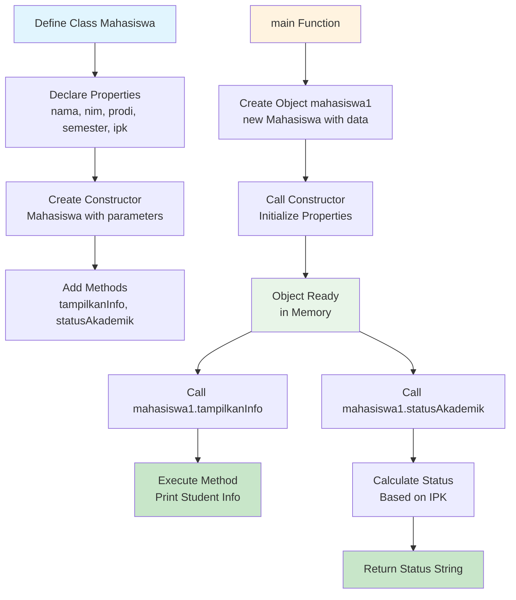

### **1.2 Constructor dan Named Constructor**

Constructor adalah method khusus yang dipanggil saat objek dibuat. Dart mendukung berbagai jenis constructor.

```dart
// 📝 Coba code ini di: https://zapp.run/
class UniversitasIndonesia {
  String nama;
  String kota;
  int tahunBerdiri;
  int jumlahMahasiswa;
  
  // 1. Default constructor
  UniversitasIndonesia(this.nama, this.kota, this.tahunBerdiri, this.jumlahMahasiswa);
  
  // 2. Named constructor untuk universitas baru
  UniversitasIndonesia.universitasBaru(String nama, String kota) {
    this.nama = nama;
    this.kota = kota;
    this.tahunBerdiri = DateTime.now().year;
    this.jumlahMahasiswa = 0;
  }
  
  // 3. Named constructor dari data JSON
  UniversitasIndonesia.fromJson(Map<String, dynamic> json) {
    nama = json['nama'];
    kota = json['kota'];
    tahunBerdiri = json['tahun_berdiri'];
    jumlahMahasiswa = json['jumlah_mahasiswa'];
  }
  
  // Method untuk menampilkan informasi
  void infoUniversitas() {
    print('🏛️ Universitas: $nama');
    print('📍 Kota: $kota');
    print('📅 Tahun Berdiri: $tahunBerdiri');
    print('👥 Jumlah Mahasiswa: ${jumlahMahasiswa.toString().replaceAllMapped(RegExp(r'(\d{1,3})(?=(\d{3})+(?!\d))'), (Match m) => '${m[1]}.')}');
    print('🎂 Usia: ${DateTime.now().year - tahunBerdiri} tahun\n');
  }
}

void main() {
  // Menggunakan default constructor
  UniversitasIndonesia unmul = UniversitasIndonesia(
    'Universitas Mulawarman', 
    'Samarinda', 
    1962, 
    35000
  );
  
  // Menggunakan named constructor
  UniversitasIndonesia univBaru = UniversitasIndonesia.universitasBaru(
    'Universitas Digital Indonesia', 
    'Jakarta'
  );
  
  // Menggunakan named constructor dari JSON
  Map<String, dynamic> dataUI = {
    'nama': 'Universitas Indonesia',
    'kota': 'Depok',
    'tahun_berdiri': 1849,
    'jumlah_mahasiswa': 55000
  };
  UniversitasIndonesia ui = UniversitasIndonesia.fromJson(dataUI);
  
  // Menampilkan informasi
  unmul.infoUniversitas();
  univBaru.infoUniversitas();
  ui.infoUniversitas();
}
```

**📊 Flow Diagram - Constructor Types:**

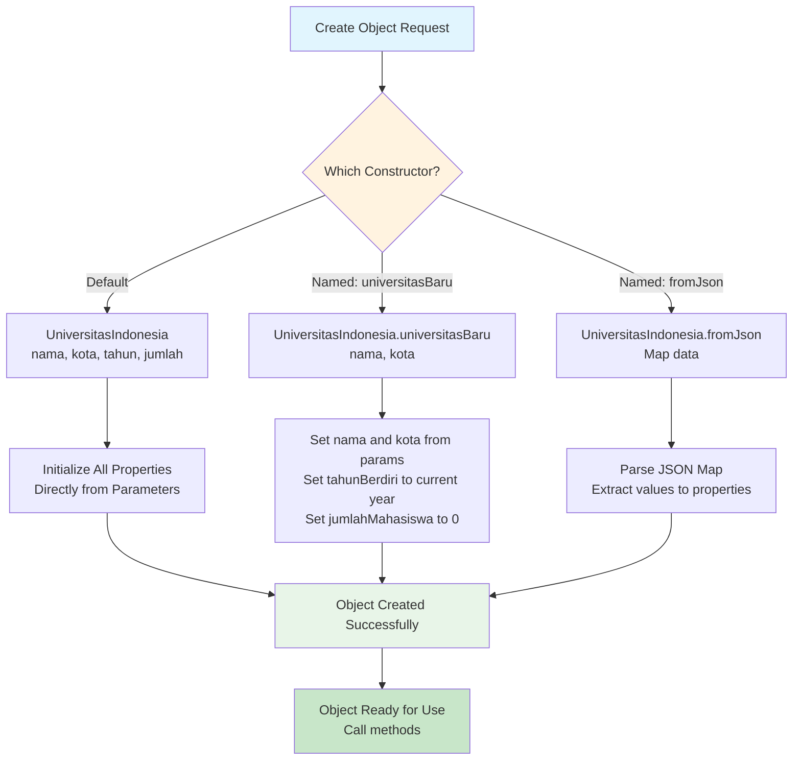

### **1.3 Inheritance dan Polymorphism**

Inheritance memungkinkan class untuk mewarisi properties dan methods dari class lain, sedangkan polymorphism memungkinkan objek memiliki banyak bentuk.

```dart
// 📝 Coba code ini di: https://zapp.run/
// Parent class (superclass)
abstract class Kendaraan {
  String merk;
  String model;
  int tahunProduksi;
  
  Kendaraan(this.merk, this.model, this.tahunProduksi);
  
  // Abstract method - harus diimplementasikan di child class
  void nyalakanMesin();
  
  // Concrete method - bisa digunakan langsung
  void infoKendaraan() {
    print('🚗 Kendaraan: $merk $model');
    print('📅 Tahun: $tahunProduksi');
  }
  
  // Method yang bisa di-override
  double hitungPajak() {
    int umur = DateTime.now().year - tahunProduksi;
    return umur > 5 ? 500000 : 1000000;
  }
}

// Child class 1: Mobil
class Mobil extends Kendaraan {
  int jumlahPintu;
  String tipeBahanBakar;
  
  Mobil(String merk, String model, int tahunProduksi, this.jumlahPintu, this.tipeBahanBakar)
      : super(merk, model, tahunProduksi);
  
  @override
  void nyalakanMesin() {
    print('🔑 Putar kunci starter... Mobil $merk menyala!');
  }
  
  @override
  double hitungPajak() {
    double pajakDasar = super.hitungPajak();
    // Mobil listrik dapat diskon pajak 50%
    return tipeBahanBakar.toLowerCase() == 'listrik' ? pajakDasar * 0.5 : pajakDasar;
  }
  
  void bukaPintu() {
    print('🚪 Membuka $jumlahPintu pintu mobil');
  }
}

// Child class 2: Motor
class Motor extends Kendaraan {
  int kapasitasMesin; // dalam CC
  String tipeTransmisi;
  
  Motor(String merk, String model, int tahunProduksi, this.kapasitasMesin, this.tipeTransmisi)
      : super(merk, model, tahunProduksi);
  
  @override
  void nyalakanMesin() {
    print('⚡ Tekan tombol starter... Motor $merk siap jalan!');
  }
  
  @override
  double hitungPajak() {
    double pajakDasar = super.hitungPajak();
    // Motor dengan mesin kecil (<150cc) dapat diskon
    return kapasitasMesin < 150 ? pajakDasar * 0.3 : pajakDasar * 0.6;
  }
  
  void pasangHelm() {
    print('⛑️ Jangan lupa pakai helm untuk keselamatan!');
  }
}

void main() {
  // Membuat objek mobil
  Mobil avanza = Mobil('Toyota', 'Avanza', 2020, 4, 'Bensin');
  Mobil teslaY = Mobil('Tesla', 'Model Y', 2023, 5, 'Listrik');
  
  // Membuat objek motor
  Motor vario = Motor('Honda', 'Vario 150', 2022, 150, 'Matic');
  Motor ninja = Motor('Kawasaki', 'Ninja 250', 2021, 250, 'Manual');
  
  // Demonstrasi polymorphism dengan List
  List<Kendaraan> daftarKendaraan = [avanza, teslaY, vario, ninja];
  
  print('=== DAFTAR KENDARAAN DI INDONESIA ===\n');
  
  for (Kendaraan kendaraan in daftarKendaraan) {
    kendaraan.infoKendaraan();
    kendaraan.nyalakanMesin(); // Polymorphism: method berbeda tergantung tipe objek
    print('💰 Pajak Tahunan: Rp ${kendaraan.hitungPajak().toStringAsFixed(0)}');
    
    // Type checking dan casting
    if (kendaraan is Mobil) {
      kendaraan.bukaPintu();
    } else if (kendaraan is Motor) {
      kendaraan.pasangHelm();
    }
    print(''); // Empty line untuk spacing
  }
}
```

**📊 Flow Diagram - Inheritance dan Polymorphism:**

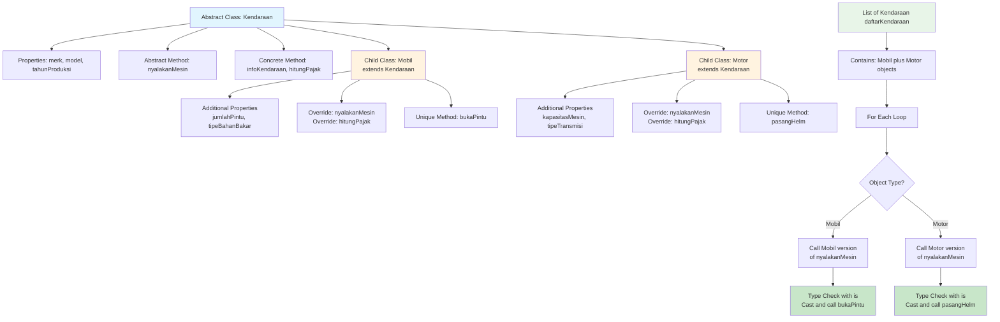

---

## 🗂️ **Bagian II: Collections dan Data Structures**

### **2.1 List - Struktur Data Berurutan**

List adalah collection yang menyimpan elements secara berurutan dan dapat diakses menggunakan index.

```dart
// 📝 Coba code ini di: https://zapp.run/
void main() {
  // 1. DEKLARASI DAN INISIALISASI LIST
  
  // List dengan tipe data eksplisit
  List<String> kotaIndonesia = ['Jakarta', 'Surabaya', 'Medan', 'Bandung', 'Makassar'];
  
  // List dengan var (type inference)
  var makananKhas = ['Rendang', 'Gudeg', 'Pempek', 'Kerak Telor', 'Coto Makassar'];
  
  // List kosong yang akan diisi
  List<int> populasiKota = [];
  
  // List dengan nilai awal
  List<double> suhuHarian = List.filled(7, 0.0); // 7 hari dengan suhu 0.0
  
  print('=== OPERASI DASAR LIST ===');
  print('Kota-kota di Indonesia: $kotaIndonesia');
  print('Jumlah kota: ${kotaIndonesia.length}');
  print('Kota pertama: ${kotaIndonesia.first}');
  print('Kota terakhir: ${kotaIndonesia.last}');
  print('Kota index ke-2: ${kotaIndonesia[2]}\n');
  
  // 2. MENAMBAH DATA KE LIST
  
  // Menambah di akhir
  kotaIndonesia.add('Semarang');
  kotaIndonesia.add('Palembang');
  
  // Menambah multiple items
  kotaIndonesia.addAll(['Yogyakarta', 'Malang', 'Denpasar']);
  
  // Menambah di posisi tertentu
  kotaIndonesia.insert(0, 'Bogor'); // Insert di index 0
  
  print('=== SETELAH MENAMBAH DATA ===');
  print('Daftar kota lengkap: $kotaIndonesia');
  print('Jumlah total: ${kotaIndonesia.length} kota\n');
  
  // 3. MENGUBAH DAN MENGHAPUS DATA
  
  // Mengubah data di index tertentu
  kotaIndonesia[1] = 'DKI Jakarta'; // Ganti 'Jakarta' menjadi 'DKI Jakarta'
  
  // Menghapus berdasarkan nilai
  kotaIndonesia.remove('Bogor');
  
  // Menghapus berdasarkan index
  String kotaDihapus = kotaIndonesia.removeAt(kotaIndonesia.length - 1);
  print('Kota yang dihapus: $kotaDihapus');
  
  // Menghapus semua yang memenuhi kondisi
  kotaIndonesia.removeWhere((kota) => kota.length < 6);
  
  print('=== SETELAH MODIFIKASI ===');
  print('Daftar kota final: $kotaIndonesia\n');
  
  // 4. OPERASI LANJUTAN LIST
  
  // Mencari data
  bool adaYogya = kotaIndonesia.contains('Yogyakarta');
  int indexSurabaya = kotaIndonesia.indexOf('Surabaya');
  
  print('=== PENCARIAN DATA ===');
  print('Ada Yogyakarta? $adaYogya');
  print('Index Surabaya: $indexSurabaya');
  
  // Sorting
  List<String> kotaSorted = List.from(kotaIndonesia)..sort();
  print('Kota A-Z: $kotaSorted');
  
  // Filtering dengan where
  var kotaPanjang = kotaIndonesia.where((kota) => kota.length > 7);
  print('Kota dengan nama panjang: ${kotaPanjang.toList()}');
  
  // Mapping - transformasi data
  var kotaUppercase = kotaIndonesia.map((kota) => kota.toUpperCase());
  print('Kota UPPERCASE: ${kotaUppercase.toList()}');
  
  // 5. LIST NUMERIK DENGAN OPERASI MATEMATIKA
  List<int> nilaiUjian = [85, 90, 78, 92, 88, 76, 95, 83, 89, 91];
  
  print('\n=== ANALISIS NILAI UJIAN ===');
  print('Nilai ujian: $nilaiUjian');
  
  // Perhitungan statistik
  int total = nilaiUjian.reduce((a, b) => a + b);
  double rataRata = total / nilaiUjian.length;
  int nilaiTertinggi = nilaiUjian.reduce((a, b) => a > b ? a : b);
  int nilaiTerendah = nilaiUjian.reduce((a, b) => a < b ? a : b);
  
  print('Rata-rata: ${rataRata.toStringAsFixed(2)}');
  print('Nilai tertinggi: $nilaiTertinggi');
  print('Nilai terendah: $nilaiTerendah');
  
  // Menghitung jumlah yang lulus (>= 80)
  var yangLulus = nilaiUjian.where((nilai) => nilai >= 80);
  print('Jumlah yang lulus (≥80): ${yangLulus.length} dari ${nilaiUjian.length}');
  print('Persentase kelulusan: ${(yangLulus.length / nilaiUjian.length * 100).toStringAsFixed(1)}%');
}
```

**📊 Flow Diagram - List Operations:**

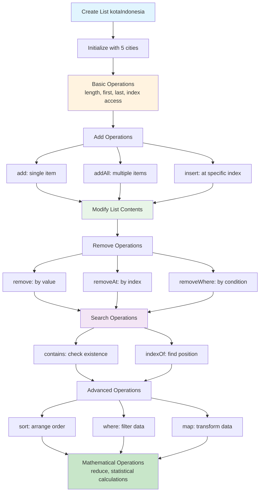

### **2.2 Map - Struktur Data Key-Value**

Map adalah collection yang menyimpan data dalam bentuk pasangan key-value, sangat berguna untuk menyimpan data yang memiliki identifier unik.

```dart
// 📝 Coba code ini di: https://zapp.run/
void main() {
  // 1. DEKLARASI DAN INISIALISASI MAP
  
  // Map dengan tipe eksplisit
  Map<String, String> ibukotaProvinsi = {
    'Jawa Barat': 'Bandung',
    'Jawa Tengah': 'Semarang',
    'Jawa Timur': 'Surabaya',
    'DKI Jakarta': 'Jakarta',
    'Kalimantan Timur': 'Samarinda',
  };
  
  // Map dengan var
  var populasiKota = {
    'Jakarta': 10560000,
    'Surabaya': 2875000,
    'Bandung': 2500000,
    'Medan': 2435000,
    'Bekasi': 2530000,
  };
  
  // Map kosong
  Map<String, dynamic> profilMahasiswa = {};
  
  print('=== OPERASI DASAR MAP ===');
  print('Ibu kota provinsi: $ibukotaProvinsi');
  print('Ibu kota Jawa Barat: ${ibukotaProvinsi['Jawa Barat']}');
  print('Jumlah provinsi: ${ibukotaProvinsi.length}');
  print('Keys: ${ibukotaProvinsi.keys.toList()}');
  print('Values: ${ibukotaProvinsi.values.toList()}\n');
  
  // 2. MENAMBAH DAN MENGUBAH DATA
  
  // Menambah data baru
  ibukotaProvinsi['Bali'] = 'Denpasar';
  ibukotaProvinsi['Sulawesi Selatan'] = 'Makassar';
  ibukotaProvinsi['Sumatera Utara'] = 'Medan';
  
  // Menggunakan addAll
  ibukotaProvinsi.addAll({
    'Papua': 'Jayapura',
    'Maluku': 'Ambon',
    'Aceh': 'Banda Aceh'
  });
  
  // Mengubah data yang sudah ada
  ibukotaProvinsi['DKI Jakarta'] = 'Jakarta Pusat';
  
  print('=== SETELAH PENAMBAHAN ===');
  print('Jumlah provinsi sekarang: ${ibukotaProvinsi.length}');
  
  // 3. PENCARIAN DAN PENGECEKAN
  
  bool adaBali = ibukotaProvinsi.containsKey('Bali');
  bool adaSurabaya = ibukotaProvinsi.containsValue('Surabaya');
  
  print('\n=== PENCARIAN DATA ===');
  print('Ada provinsi Bali? $adaBali');
  print('Ada ibu kota Surabaya? $adaSurabaya');
  
  // Mencari key berdasarkan value
  String? provinsiSurabaya = ibukotaProvinsi.entries
      .firstWhere((entry) => entry.value == 'Surabaya', 
                 orElse: () => MapEntry('', ''))
      .key;
  print('Surabaya adalah ibu kota: $provinsiSurabaya');
  
  // 4. ITERASI MAP
  
  print('\n=== DAFTAR IBU KOTA PROVINSI ===');
  ibukotaProvinsi.forEach((provinsi, ibukota) {
    print('🏛️ $provinsi → $ibukota');
  });
  
  // Iterasi dengan for-in
  print('\n=== DATA POPULASI KOTA ===');
  for (var entry in populasiKota.entries) {
    String kota = entry.key;
    int populasi = entry.value;
    double populasiJuta = populasi / 1000000;
    print('🏙️ $kota: ${populasiJuta.toStringAsFixed(1)} juta jiwa');
  }
  
  // 5. OPERASI LANJUTAN MAP
  
  // Filter berdasarkan kondisi
  var kotaBesar = Map.fromEntries(
    populasiKota.entries.where((entry) => entry.value > 2500000)
  );
  
  print('\n=== KOTA BESAR (>2.5 juta jiwa) ===');
  kotaBesar.forEach((kota, populasi) {
    print('🌆 $kota: ${(populasi/1000000).toStringAsFixed(1)} juta');
  });
  
  // Mengurutkan berdasarkan populasi
  var kotaUrut = Map.fromEntries(
    populasiKota.entries.toList()
      ..sort((a, b) => b.value.compareTo(a.value))
  );
  
  print('\n=== RANKING KOTA BERDASARKAN POPULASI ===');
  int ranking = 1;
  kotaUrut.forEach((kota, populasi) {
    print('${ranking++}. $kota: ${(populasi/1000000).toStringAsFixed(1)} juta');
  });
  
  // 6. MAP UNTUK DATA MAHASISWA
  
  Map<String, dynamic> dataMahasiswa = {
    'nama': 'Budi Santoso',
    'nim': '2021015001',
    'prodi': 'Informatika',
    'semester': 5,
    'ipk': 3.75,
    'aktif': true,
    'mata_kuliah': ['Flutter', 'Database', 'AI', 'Networking'],
    'nilai': {
      'Flutter': 85,
      'Database': 78,
      'AI': 92,
      'Networking': 88
    }
  };
  
  print('\n=== PROFIL MAHASISWA ===');
  print('👤 ${dataMahasiswa['nama']} (${dataMahasiswa['nim']})');
  print('🎓 ${dataMahasiswa['prodi']}, Semester ${dataMahasiswa['semester']}');
  print('📊 IPK: ${dataMahasiswa['ipk']}');
  print('✅ Status: ${dataMahasiswa['aktif'] ? 'Aktif' : 'Tidak Aktif'}');
  
  // Akses nested map
  Map<String, int> nilai = dataMahasiswa['nilai'];
  print('\n📚 Nilai Mata Kuliah:');
  nilai.forEach((mk, nilai) {
    String grade = nilai >= 85 ? 'A' : nilai >= 70 ? 'B' : nilai >= 60 ? 'C' : 'D';
    print('   $mk: $nilai ($grade)');
  });
  
  // Hitung rata-rata nilai
  double rataRata = nilai.values.reduce((a, b) => a + b) / nilai.length;
  print('📈 Rata-rata nilai: ${rataRata.toStringAsFixed(2)}');
}
```

**📊 Flow Diagram - Map Operations:**

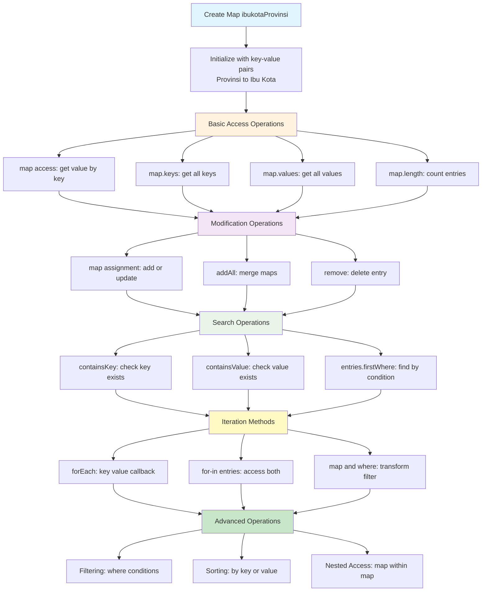

### **2.3 Set - Koleksi Unik**

Set adalah collection yang menyimpan elemen-elemen unik (tidak ada duplikasi). Sangat berguna untuk operasi matematika seperti union, intersection, dan difference.

```dart
// 📝 Coba code ini di: https://zapp.run/
void main() {
  // 1. DEKLARASI DAN INISIALISASI SET
  
  // Set dengan tipe eksplisit
  Set<String> bahasaIndonesia = {'Indonesian', 'Javanese', 'Sundanese', 'Batak', 'Minangkabau'};
  
  // Set dengan var
  var kotaJawa = {'Jakarta', 'Surabaya', 'Bandung', 'Semarang', 'Yogyakarta'};
  
  // Set dari List (menghilangkan duplikasi)
  List<String> kotaDuplikat = ['Jakarta', 'Bandung', 'Jakarta', 'Surabaya', 'Bandung', 'Medan'];
  Set<String> kotaUnik = kotaDuplikat.toSet();
  
  print('=== OPERASI DASAR SET ===');
  print('Bahasa di Indonesia: $bahasaIndonesia');
  print('Kota di Jawa: $kotaJawa');
  print('List dengan duplikasi: $kotaDuplikat');
  print('Set tanpa duplikasi: $kotaUnik');
  print('Jumlah bahasa: ${bahasaIndonesia.length}');
  print('Jumlah kota unik: ${kotaUnik.length}\n');
  
  // 2. MENAMBAH DAN MENGHAPUS ELEMEN
  
  // Menambah elemen tunggal
  bahasaIndonesia.add('Bugis');
  bahasaIndonesia.add('Dayak');
  
  // Mencoba menambah duplikasi (tidak akan berpengaruh)
  bahasaIndonesia.add('Indonesian'); // Tidak akan ditambahkan
  
  // Menambah multiple elemen
  bahasaIndonesia.addAll(['Acehnese', 'Balinese', 'Papuan']);
  
  print('=== SETELAH MENAMBAH ELEMEN ===');
  print('Bahasa setelah ditambah: $bahasaIndonesia');
  print('Jumlah bahasa: ${bahasaIndonesia.length}\n');
  
  // Menghapus elemen
  bahasaIndonesia.remove('Papuan');
  bahasaIndonesia.removeWhere((bahasa) => bahasa.length > 10);
  
  print('=== SETELAH MENGHAPUS ELEMEN ===');
  print('Bahasa setelah dihapus: $bahasaIndonesia\n');
  
  // 3. OPERASI SET (MATEMATIKA)
  
  Set<String> kotaSumatera = {'Medan', 'Palembang', 'Pekanbaru', 'Bandar Lampung', 'Padang'};
  Set<String> kotaBesar = {'Jakarta', 'Surabaya', 'Medan', 'Bandung', 'Makassar'};
  
  print('=== OPERASI MATEMATIKA SET ===');
  print('Kota Jawa: $kotaJawa');
  print('Kota Sumatera: $kotaSumatera');
  print('Kota Besar: $kotaBesar\n');
  
  // Union (gabungan) - semua elemen dari kedua set
  Set<String> semuaKota = kotaJawa.union(kotaSumatera);
  print('Union Jawa ∪ Sumatera: $semuaKota');
  
  // Intersection (irisan) - elemen yang ada di kedua set
  Set<String> kotaJawaDanBesar = kotaJawa.intersection(kotaBesar);
  print('Intersection Jawa ∩ Besar: $kotaJawaDanBesar');
  
  // Difference (selisih) - elemen di set pertama tapi tidak di kedua
  Set<String> kotaJawaSaja = kotaJawa.difference(kotaBesar);
  print('Difference Jawa - Besar: $kotaJawaSaja');
  
  // Symmetric difference - elemen yang ada di salah satu tapi tidak keduanya
  Set<String> kotaSymmetric = kotaJawa.union(kotaBesar).difference(kotaJawa.intersection(kotaBesar));
  print('Symmetric difference: $kotaSymmetric\n');
  
  // 4. PENGECEKAN DAN PENCARIAN
  
  bool adaJakarta = kotaJawa.contains('Jakarta');
  bool isSubset = kotaJawaDanBesar.intersection(kotaJawa) == kotaJawaDanBesar;
  bool isEmpty = kotaJawa.isEmpty;
  
  print('=== PENGECEKAN SET ===');
  print('Ada Jakarta di kota Jawa? $adaJakarta');
  print('Kota Jawa dan Besar subset dari Kota Jawa? $isSubset');
  print('Set kota Jawa kosong? $isEmpty');
  
  // 5. KONVERSI DAN TRANSFORMASI
  
  // Set ke List
  List<String> listBahasa = bahasaIndonesia.toList();
  listBahasa.sort(); // Sort hanya bisa di List, bukan Set
  
  print('\n=== KONVERSI SET KE LIST ===');
  print('Bahasa dalam List terurut: $listBahasa');
  
  // Filtering dan mapping
  var bahasaPanjang = bahasaIndonesia.where((bahasa) => bahasa.length > 6);
  var bahasaUppercase = bahasaIndonesia.map((bahasa) => bahasa.toUpperCase());
  
  print('Bahasa dengan nama panjang: ${bahasaPanjang.toSet()}');
  print('Bahasa UPPERCASE: ${bahasaUppercase.toSet()}');
  
  // 6. APLIKASI PRAKTIS: ANALISIS DATA MAHASISWA
  
  Set<String> mahasiswaAktif = {'Andi', 'Budi', 'Citra', 'Desi', 'Eko', 'Fina'};
  Set<String> mahasiswaLulus = {'Andi', 'Citra', 'Eko', 'Gina', 'Hasan'};
  Set<String> mahasiswaBeasiswa = {'Budi', 'Citra', 'Desi', 'Iko', 'Joko'};
  
  print('\n=== ANALISIS DATA MAHASISWA ===');
  print('Mahasiswa Aktif: $mahasiswaAktif');
  print('Mahasiswa Lulus: $mahasiswaLulus');
  print('Mahasiswa Beasiswa: $mahasiswaBeasiswa\n');
  
  // Mahasiswa aktif yang lulus
  var aktifDanLulus = mahasiswaAktif.intersection(mahasiswaLulus);
  print('Mahasiswa aktif yang lulus: $aktifDanLulus');
  
  // Mahasiswa aktif yang belum lulus
  var aktifBelumLulus = mahasiswaAktif.difference(mahasiswaLulus);
  print('Mahasiswa aktif belum lulus: $aktifBelumLulus');
  
  // Mahasiswa dengan beasiswa dan aktif
  var beasiswaAktif = mahasiswaBeasiswa.intersection(mahasiswaAktif);
  print('Mahasiswa beasiswa yang aktif: $beasiswaAktif');
  
  // Total mahasiswa unik
  var semuaMahasiswa = mahasiswaAktif.union(mahasiswaLulus).union(mahasiswaBeasiswa);
  print('Total mahasiswa unik: ${semuaMahasiswa.length} orang');
  print('Daftar: $semuaMahasiswa');
}
```

**📊 Flow Diagram - Set Operations:**

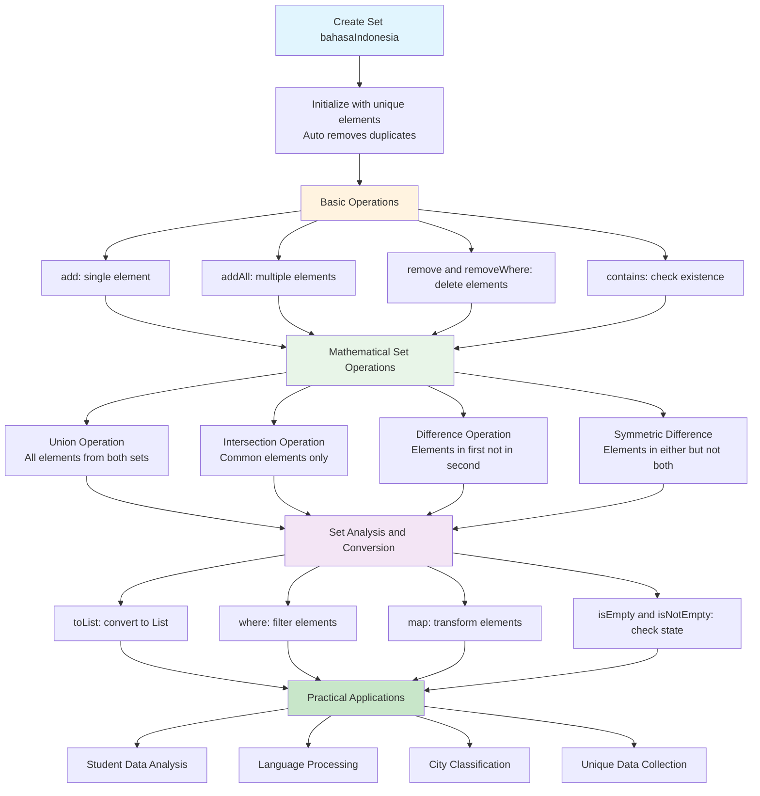

---

## ⚠️ **Bagian III: Exception Handling dan Error Management**

### **3.1 Dasar Exception Handling**

Exception handling adalah mekanisme untuk menangani error yang terjadi saat runtime, sehingga aplikasi tidak crash dan dapat memberikan feedback yang berguna kepada user.

```dart
// 📝 Coba code ini di: https://zapp.run/
void main() {
  // 1. TRY-CATCH DASAR
  
  print('=== BASIC TRY-CATCH ===');
  
  try {
    // Code yang mungkin error
    int hasil = 10 ~/ 0; // Integer division by zero
    print('Hasil: $hasil');
  } catch (e) {
    print('❌ Terjadi error: $e');
  }
  
  // Program tetap lanjut setelah error
  print('✅ Program tetap berjalan setelah error\n');
  
  // 2. TRY-CATCH DENGAN TIPE SPESIFIK
  
  print('=== SPECIFIC EXCEPTION TYPES ===');
  
  List<int> angka = [1, 2, 3];
  
  try {
    // Mengakses index yang tidak ada
    print('Elemen ke-5: ${angka[5]}');
  } on RangeError catch (e) {
    print('❌ RangeError: ${e.message}');
  } on Exception catch (e) {
    print('❌ Exception lain: $e');
  } catch (e) {
    print('❌ Error tidak diketahui: $e');
  }
  
  // 3. TRY-CATCH-FINALLY
  
  print('\n=== TRY-CATCH-FINALLY ===');
  
  try {
    print('🔄 Mencoba membaca file...');
    String content = bacaFile('data.txt'); // Function yang akan error
    print('📄 Isi file: $content');
  } catch (e) {
    print('❌ Gagal membaca file: $e');
  } finally {
    // Block ini selalu dijalankan
    print('🔒 Menutup koneksi file (finally block)');
  }
  
  // 4. VALIDASI INPUT DENGAN EXCEPTION
  
  print('\n=== VALIDASI INPUT ===');
  
  // Simulasi input user
  List<String> inputUser = ['25', 'abc', '30', '-5', '0'];
  
  for (String input in inputUser) {
    try {
      int umur = validasiUmur(input);
      print('✅ Umur valid: $umur tahun');
    } catch (e) {
      print('❌ Input "$input": $e');
    }
  }
}

// Function yang akan throw error
String bacaFile(String namaFile) {
  if (namaFile.isEmpty) {
    throw ArgumentError('Nama file tidak boleh kosong');
  }
  
  if (!namaFile.endsWith('.txt')) {
    throw FormatException('File harus berformat .txt');
  }
  
  // Simulasi file tidak ditemukan
  throw FileSystemException('File $namaFile tidak ditemukan', namaFile);
}

// Function untuk validasi umur dengan custom exception
int validasiUmur(String input) {
  // Cek apakah input kosong
  if (input.trim().isEmpty) {
    throw ArgumentError('Input tidak boleh kosong');
  }
  
  int umur;
  
  try {
    umur = int.parse(input);
  } catch (e) {
    throw FormatException('Input harus berupa angka');
  }
  
  // Validasi range umur
  if (umur < 0) {
    throw RangeError('Umur tidak boleh negatif');
  }
  
  if (umur > 150) {
    throw RangeError('Umur tidak boleh lebih dari 150 tahun');
  }
  
  return umur;
}
```

**📊 Flow Diagram - Exception Handling Process:**

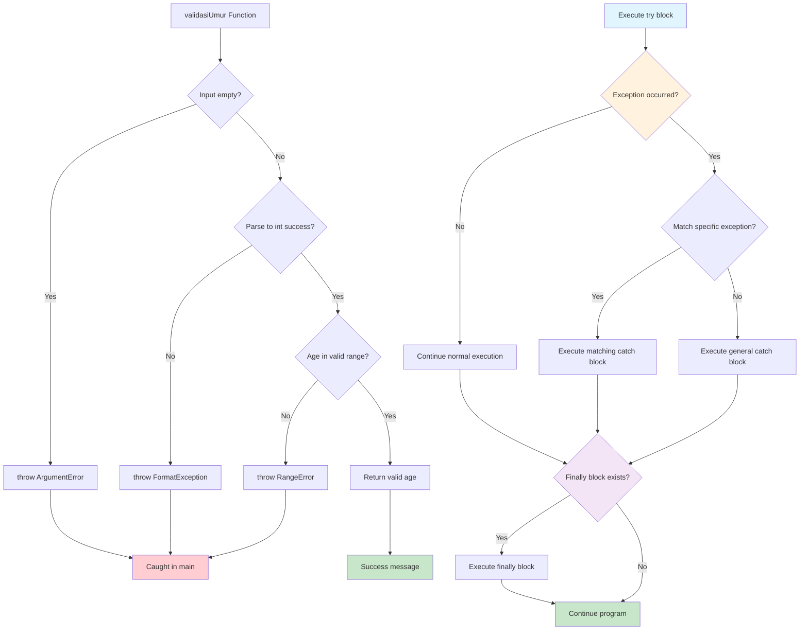

### **3.2 Custom Exceptions**

Membuat exception khusus untuk kebutuhan aplikasi yang spesifik.

```dart
// 📝 Coba code ini di: https://zapp.run/

// Custom Exception untuk Mahasiswa
class MahasiswaException implements Exception {
  final String message;
  final String nim;
  
  const MahasiswaException(this.message, this.nim);
  
  @override
  String toString() => 'MahasiswaException: $message (NIM: $nim)';
}

// Custom Exception untuk IPK
class IPKException implements Exception {
  final String message;
  final double ipk;
  
  const IPKException(this.message, this.ipk);
  
  @override
  String toString() => 'IPKException: $message (IPK: $ipk)';
}

// Class Mahasiswa dengan validasi
class MahasiswaValidator {
  String nama;
  String nim;
  String prodi;
  int semester;
  double ipk;
  
  MahasiswaValidator({
    required this.nama,
    required this.nim,
    required this.prodi,
    required this.semester,
    required this.ipk,
  }) {
    // Validasi saat object dibuat
    _validasiData();
  }
  
  void _validasiData() {
    // Validasi NIM
    if (nim.length != 10) {
      throw MahasiswaException('NIM harus 10 digit', nim);
    }
    
    if (!RegExp(r'^\d+
```

---

## ⚡ **Bagian IV: Async Programming Basics**

### **4.1 Future dan Async/Await**

Async programming memungkinkan aplikasi untuk menjalankan operasi yang membutuhkan waktu (seperti network request atau file I/O) tanpa memblokir UI.

```dart
// 📝 Coba code ini di: https://zapp.run/

// Simulasi operasi yang membutuhkan waktu
Future<String> ambilDataMahasiswa(String nim) async {
  print('🔄 Mengambil data mahasiswa $nim...');
  
  // Simulasi delay network request (2 detik)
  await Future.delayed(Duration(seconds: 2));
  
  // Simulasi kondisi berhasil/gagal
  if (nim == '2021015001') {
    return 'Andi Kurniawan - Informatika - IPK: 3.75';
  } else if (nim == '2021015002') {
    return 'Sari Putri - Sistem Informasi - IPK: 3.85';
  } else {
    throw Exception('Mahasiswa dengan NIM $nim tidak ditemukan');
  }
}

// Simulasi download file
Future<Map<String, dynamic>> downloadNilai(String nim) async {
  print('📥 Mendownload nilai untuk NIM $nim...');
  
  await Future.delayed(Duration(seconds: 1));
  
  return {
    'nim': nim,
    'mata_kuliah': {
      'Flutter': 85,
      'Database': 78,
      'AI': 92,
      'Networking': 88,
    },
    'semester': 5,
    'status': 'completed'
  };
}

// Simulasi upload data
Future<bool> uploadTugas(String nim, String namaFile) async {
  print('📤 Mengupload $namaFile untuk NIM $nim...');
  
  await Future.delayed(Duration(milliseconds: 1500));
  
  // Simulasi kemungkinan gagal upload
  if (namaFile.contains('error')) {
    throw Exception('Gagal upload file $namaFile');
  }
  
  return true;
}

void main() async {
  print('=== ASYNC PROGRAMMING BASICS ===\n');
  
  // 1. BASIC ASYNC/AWAIT
  print('--- Basic Async/Await ---');
  
  try {
    // Operasi async dengan await
    String dataMahasiswa = await ambilDataMahasiswa('2021015001');
    print('✅ Data ditemukan: $dataMahasiswa');
    
    // Operasi async yang gagal
    String dataTidakAda = await ambilDataMahasiswa('9999999999');
    print('✅ Data: $dataTidakAda');
    
  } catch (e) {
    print('❌ Error: $e');
  }
  
  print('\n--- Multiple Async Operations ---');
  
  // 2. MULTIPLE ASYNC OPERATIONS (Sequential)
  
  Stopwatch stopwatch = Stopwatch()..start();
  
  try {
    print('🔄 Menjalankan operasi secara sequential...');
    
    // Sequential execution (satu per satu)
    String data1 = await ambilDataMahasiswa('2021015001');
    String data2 = await ambilDataMahasiswa('2021015002');
    
    stopwatch.stop();
    
    print('✅ Data 1: $data1');
    print('✅ Data 2: $data2');
    print('⏱️ Waktu sequential: ${stopwatch.elapsedMilliseconds}ms');
    
  } catch (e) {
    print('❌ Error sequential: $e');
  }
  
  print('\n--- Concurrent Async Operations ---');
  
  // 3. CONCURRENT ASYNC OPERATIONS
  
  stopwatch.reset();
  stopwatch.start();
  
  try {
    print('🔄 Menjalankan operasi secara concurrent...');
    
    // Concurrent execution (bersamaan)
    Future<String> future1 = ambilDataMahasiswa('2021015001');
    Future<String> future2 = ambilDataMahasiswa('2021015002');
    
    // Menunggu semua selesai
    List<String> results = await Future.wait([future1, future2]);
    
    stopwatch.stop();
    
    print('✅ Data concurrent 1: ${results[0]}');
    print('✅ Data concurrent 2: ${results[1]}');
    print('⏱️ Waktu concurrent: ${stopwatch.elapsedMilliseconds}ms');
    
  } catch (e) {
    print('❌ Error concurrent: $e');
  }
  
  print('\n--- Complex Async Workflow ---');
  
  // 4. COMPLEX ASYNC WORKFLOW
  
  String nimMahasiswa = '2021015001';
  
  try {
    print('🔄 Memulai workflow kompleks untuk NIM $nimMahasiswa...');
    
    // Step 1: Ambil data mahasiswa
    String dataMahasiswa = await ambilDataMahasiswa(nimMahasiswa);
    print('1️⃣ $dataMahasiswa');
    
    // Step 2: Download nilai (concurrent dengan upload)
    Future<Map<String, dynamic>> futureNilai = downloadNilai(nimMahasiswa);
    Future<bool> futureUpload = uploadTugas(nimMahasiswa, 'tugas_flutter.pdf');
    
    // Menunggu kedua operasi selesai
    var results = await Future.wait([futureNilai, futureUpload]);
    Map<String, dynamic> nilai = results[0] as Map<String, dynamic>;
    bool uploadSuccess = results[1] as bool;
    
    print('2️⃣ Nilai berhasil didownload: ${nilai['mata_kuliah']}');
    print('3️⃣ Upload tugas: ${uploadSuccess ? 'Berhasil' : 'Gagal'}');
    
    // Step 3: Hitung rata-rata
    Map<String, int> mataKuliah = nilai['mata_kuliah'].cast<String, int>();
    double rataRata = mataKuliah.values.reduce((a, b) => a + b) / mataKuliah.length;
    
    print('4️⃣ Rata-rata nilai: ${rataRata.toStringAsFixed(2)}');
    print('✅ Workflow selesai!');
    
  } catch (e) {
    print('❌ Workflow error: $e');
  }
  
  print('\n--- Error Handling in Async ---');
  
  // 5. ERROR HANDLING IN ASYNC OPERATIONS
  
  List<String> nimList = ['2021015001', '2021015002', '9999999999', '1111111111'];
  
  for (String nim in nimList) {
    try {
      String result = await ambilDataMahasiswa(nim);
      print('✅ NIM $nim: $result');
    } catch (e) {
      print('❌ NIM $nim: Error - $e');
      // Program tetap lanjut untuk NIM berikutnya
    }
  }
  
  print('\n--- Async dengan Timeout ---');
  
  // 6. ASYNC DENGAN TIMEOUT
  
  try {
    // Operasi dengan timeout 1 detik (akan gagal karena operasi butuh 2 detik)
    String result = await ambilDataMahasiswa('2021015001')
        .timeout(Duration(seconds: 1));
    print('✅ Data dengan timeout: $result');
  } on TimeoutException catch (e) {
    print('❌ Timeout: Operasi terlalu lama (${e.duration})');
  } catch (e) {
    print('❌ Error lain: $e');
  }
  
  // Operasi dengan timeout yang cukup
  try {
    String result = await ambilDataMahasiswa('2021015001')
        .timeout(Duration(seconds: 3));
    print('✅ Data dengan timeout yang cukup: $result');
  } catch (e) {
    print('❌ Error: $e');
  }
}
```

**📊 Flow Diagram - Async Programming:**


---

## 🧮 **Bagian V: Praktikum - BMI Calculator Indonesia**

### **5.1 Project Overview**

Dalam praktikum ini, kita akan membuat aplikasi BMI (Body Mass Index) Calculator yang menerapkan semua konsep OOP dan exception handling yang telah dipelajari.

```dart
// 📝 Coba code ini di: https://zapp.run/

// Enum untuk kategori BMI
enum KategoriBMI {
  kurusKurangBerat,
  kurusNormal, 
  normalBawah,
  normalAtas,
  kegemukan,
  obesitas1,
  obesitas2,
}

// Custom exception untuk BMI
class BMIException implements Exception {
  final String message;
  final double value;
  
  const BMIException(this.message, this.value);
  
  @override
  String toString() => 'BMIException: $message (Value: $value)';
}

// Abstract class untuk Person
abstract class Person {
  String nama;
  int umur;
  String jenisKelamin;
  
  Person(this.nama, this.umur, this.jenisKelamin);
  
  // Abstract methods yang harus diimplementasikan
  void tampilkanInfo();
  String rekomendasiGizi();
}

// Class untuk BMI Calculator
class BMICalculator extends Person {
  double _beratBadan; // Private property
  double _tinggiBadan; // Private property
  double? _bmi; // Nullable untuk lazy calculation
  KategoriBMI? _kategori;
  DateTime _waktuPengukuran;
  
  // Constructor
  BMICalculator({
    required String nama,
    required int umur,
    required String jenisKelamin,
    required double beratBadan,
    required double tinggiBadan,
  }) : _waktuPengukuran = DateTime.now(),
       super(nama, umur, jenisKelamin) {
    this.beratBadan = beratBadan; // Menggunakan setter untuk validasi
    this.tinggiBadan = tinggiBadan;
  }
  
  // Named constructor untuk data dari input string
  BMICalculator.fromString({
    required String nama,
    required String umurStr,
    required String jenisKelamin,
    required String beratStr,
    required String tinggiStr,
  }) : _waktuPengukuran = DateTime.now(),
       super(nama, 0, jenisKelamin) {
    
    // Validasi dan parsing dengan exception handling
    try {
      umur = int.parse(umurStr);
      if (umur <= 0 || umur > 150) {
        throw BMIException('Umur harus antara 1-150 tahun', umur.toDouble());
      }
    } catch (e) {
      throw BMIException('Format umur tidak valid', 0);
    }
    
    try {
      beratBadan = double.parse(beratStr);
    } catch (e) {
      throw BMIException('Format berat badan tidak valid', 0);
    }
    
    try {
      tinggiBadan = double.parse(tinggiStr);
    } catch (e) {
      throw BMIException('Format tinggi badan tidak valid', 0);
    }
  }
  
  // Getter dan Setter dengan validasi
  double get beratBadan => _beratBadan;
  
  set beratBadan(double berat) {
    if (berat <= 0) {
      throw BMIException('Berat badan harus lebih dari 0', berat);
    }
    if (berat > 500) {
      throw BMIException('Berat badan terlalu tinggi (>500kg)', berat);
    }
    _beratBadan = berat;
    _resetCalculation(); // Reset perhitungan saat data berubah
  }
  
  double get tinggiBadan => _tinggiBadan;
  
  set tinggiBadan(double tinggi) {
    if (tinggi <= 0) {
      throw BMIException('Tinggi badan harus lebih dari 0', tinggi);
    }
    if (tinggi < 50) {
      throw BMIException('Tinggi badan terlalu rendah (<50cm)', tinggi);
    }
    if (tinggi > 300) {
      throw BMIException('Tinggi badan terlalu tinggi (>300cm)', tinggi);
    }
    _tinggiBadan = tinggi;
    _resetCalculation();
  }
  
  // Method untuk reset perhitungan
  void _resetCalculation() {
    _bmi = null;
    _kategori = null;
  }
  
  // Method untuk menghitung BMI
  double hitungBMI() {
    if (_bmi == null) {
      double tinggiMeter = _tinggiBadan / 100; // Convert cm to meter
      _bmi = _beratBadan / (tinggiMeter * tinggiMeter);
    }
    return _bmi!;
  }
  
  // Method untuk menentukan kategori BMI
  KategoriBMI tentukanKategori() {
    if (_kategori == null) {
      double bmi = hitungBMI();
      
      if (bmi < 17.0) {
        _kategori = KategoriBMI.kurusKurangBerat;
      } else if (bmi < 18.5) {
        _kategori = KategoriBMI.kurusNormal;
      } else if (bmi < 23.0) {
        _kategori = KategoriBMI.normalBawah;
      } else if (bmi < 25.0) {
        _kategori = KategoriBMI.normalAtas;
      } else if (bmi < 27.0) {
        _kategori = KategoriBMI.kegemukan;
      } else if (bmi < 30.0) {
        _kategori = KategoriBMI.obesitas1;
      } else {
        _kategori = KategoriBMI.obesitas2;
      }
    }
    return _kategori!;
  }
  
  // Method untuk mendapatkan deskripsi kategori
  String deskripsiKategori() {
    switch (tentukanKategori()) {
      case KategoriBMI.kurusKurangBerat:
        return 'Kurus - Kekurangan Berat Badan Tingkat Berat';
      case KategoriBMI.kurusNormal:
        return 'Kurus - Kekurangan Berat Badan Tingkat Ringan';
      case KategoriBMI.normalBawah:
        return 'Normal - Batas Bawah';
      case KategoriBMI.normalAtas:
        return 'Normal - Batas Atas';
      case KategoriBMI.kegemukan:
        return 'Kelebihan Berat Badan - Tingkat Ringan';
      case KategoriBMI.obesitas1:
        return 'Obesitas Tingkat 1';
      case KategoriBMI.obesitas2:
        return 'Obesitas Tingkat 2';
    }
  }
  
  @override
  void tampilkanInfo() {
    print('=' * 50);
    print('🧮 HASIL PERHITUNGAN BMI');
    print('=' * 50);
    print('👤 Nama: $nama');
    print('🎂 Umur: $umur tahun');
    print('⚧️ Jenis Kelamin: $jenisKelamin');
    print('⚖️ Berat Badan: ${_beratBadan.toStringAsFixed(1)} kg');
    print('📏 Tinggi Badan: ${_tinggiBadan.toStringAsFixed(1)} cm');
    print('📊 BMI: ${hitungBMI().toStringAsFixed(2)}');
    print('📋 Kategori: ${deskripsiKategori()}');
    print('⏰ Waktu Pengukuran: ${_waktuPengukuran.day}/${_waktuPengukuran.month}/${_waktuPengukuran.year}');
    print('=' * 50);
  }
  
  @override
  String rekomendasiGizi() {
    KategoriBMI kategori = tentukanKategori();
    String baseRekomendasi = '';
    
    switch (kategori) {
      case KategoriBMI.kurusKurangBerat:
      case KategoriBMI.kurusNormal:
        baseRekomendasi = '''
🍽️ REKOMENDASI GIZI UNTUK MENAIKKAN BERAT BADAN:
• Tingkatkan asupan kalori 300-500 kalori per hari
• Konsumsi protein berkualitas: telur, daging, ikan, tahu
• Makan dalam porsi kecil tapi sering (5-6x sehari)
• Konsumsi karbohidrat kompleks: nasi merah, oats
• Minum susu atau smoothie tinggi protein
• Hindari makanan kosong kalori''';
        break;
        
      case KategoriBMI.normalBawah:
      case KategoriBMI.normalAtas:
        baseRekomendasi = '''
✅ REKOMENDASI GIZI UNTUK MEMPERTAHANKAN BERAT IDEAL:
• Pertahankan pola makan seimbang
• Konsumsi 4 sehat 5 sempurna
• Makan buah dan sayur 5 porsi per hari
• Minum air putih 8 gelas per hari
• Olahraga teratur 3-4x seminggu
• Batasi makanan processed dan fast food''';
        break;
        
      case KategoriBMI.kegemukan:
      case KategoriBMI.obesitas1:
      case KategoriBMI.obesitas2:
        baseRekomendasi = '''
🏃‍♂️ REKOMENDASI GIZI UNTUK MENURUNKAN BERAT BADAN:
• Kurangi asupan kalori 300-500 kalori per hari
• Tingkatkan konsumsi serat: sayur dan buah
• Pilih protein tanpa lemak: ayam tanpa kulit, ikan
• Kurangi karbohidrat sederhana: gula, tepung putih
• Makan dalam porsi kecil, perbanyak aktivitas fisik
• Hindari minuman manis dan gorengan''';
        break;
    }
    
    // Tambahan rekomendasi berdasarkan umur
    if (umur >= 50) {
      baseRekomendasi += '\n\n👴 Tambahan untuk usia 50+: Konsumsi kalsium dan vitamin D';
    } else if (umur < 18) {
      baseRekomendasi += '\n\n🧒 Tambahan untuk remaja: Konsultasi dengan ahli gizi untuk pertumbuhan optimal';
    }
    
    return baseRekomendasi;
  }
  
  // Method untuk membandingkan dengan BMI ideal
  Map<String, double> analisisBeratIdeal() {
    // BMI ideal untuk orang Asia: 21-23
    double bmiIdealRendah = 21.0;
    double bmiIdealTinggi = 23.0;
    
    double tinggiMeter = _tinggiBadan / 100;
    double beratIdealRendah = bmiIdealRendah * (tinggiMeter * tinggiMeter);
    double beratIdealTinggi = bmiIdealTinggi * (tinggiMeter * tinggiMeter);
    
    return {
      'berat_ideal_rendah': beratIdealRendah,
      'berat_ideal_tinggi': beratIdealTinggi,
      'selisih_rendah': _beratBadan - beratIdealRendah,
      'selisih_tinggi': _beratBadan - beratIdealTinggi,
    };
  }
  
  // Method untuk tracking history (simulasi)
  void tampilkanAnalisisLengkap() {
    tampilkanInfo();
    
    Map<String, double> analisis = analisisBeratIdeal();
    
    print('\n📈 ANALISIS BERAT IDEAL:');
    print('• Rentang berat ideal: ${analisis['berat_ideal_rendah']!.toStringAsFixed(1)} - ${analisis['berat_ideal_tinggi']!.toStringAsFixed(1)} kg');
    
    if (_beratBadan < analisis['berat_ideal_rendah']!) {
      print('• Status: Perlu menaikkan ${(-analisis['selisih_rendah']!).toStringAsFixed(1)} kg');
    } else if (_beratBadan > analisis['berat_ideal_tinggi']!) {
      print('• Status: Perlu menurunkan ${analisis['selisih_tinggi']!.toStringAsFixed(1)} kg');
    } else {
      print('• Status: Berat badan sudah ideal! 🎉');
    }
    
    print('\n${rekomendasiGizi()}');
  }
}

// Class untuk multiple BMI calculations
class BMIDatabase {
  List<BMICalculator> _dataHistory = [];
  
  void tambahData(BMICalculator bmi) {
    _dataHistory.add(bmi);
    print('✅ Data BMI untuk ${bmi.nama} berhasil ditambahkan');
  }
  
  List<BMICalculator> ambilDataByNama(String nama) {
    return _dataHistory.where((bmi) => 
        bmi.nama.toLowerCase().contains(nama.toLowerCase())).toList();
  }
  
  void tampilkanStatistik() {
    if (_dataHistory.isEmpty) {
      print('❌ Tidak ada data BMI');
      return;
    }
    
    double totalBMI = _dataHistory.map((bmi) => bmi.hitungBMI()).reduce((a, b) => a + b);
    double rataBMI = totalBMI / _dataHistory.length;
    
    Map<KategoriBMI, int> distribusiKategori = {};
    
    for (BMICalculator bmi in _dataHistory) {
      KategoriBMI kategori = bmi.tentukanKategori();
      distribusiKategori[kategori] = (distribusiKategori[kategori] ?? 0) + 1;
    }
    
    print('\n📊 STATISTIK BMI DATABASE');
    print('=' * 40);
    print('Total data: ${_dataHistory.length}');
    print('Rata-rata BMI: ${rataBMI.toStringAsFixed(2)}');
    print('\nDistribusi Kategori:');
    distribusiKategori.forEach((kategori, jumlah) {
      print('• ${kategori.toString().split('.').last}: $jumlah orang');
    });
  }
}

void main() async {
  print('🇮🇩 BMI CALCULATOR INDONESIA 🇮🇩\n');
  
  BMIDatabase database = BMIDatabase();
  
  // Test data mahasiswa Indonesia
  List<Map<String, String>> dataMahasiswa = [
    {
      'nama': 'Andi Kurniawan',
      'umur': '20',
      'jenis_kelamin': 'Laki-laki',
      'berat': '65',
      'tinggi': '170'
    },
    {
      'nama': 'Sari Putri Dewi',
      'umur': '19',
      'jenis_kelamin': 'Perempuan',
      'berat': '52',
      'tinggi': '160'
    },
    {
      'nama': 'Budi Santoso',
      'umur': '22',
      'jenis_kelamin': 'Laki-laki',
      'berat': '80',
      'tinggi': '175'
    },
    {
      'nama': 'Citra Maharani',
      'umur': 'abc', // Error: format umur salah
      'jenis_kelamin': 'Perempuan',
      'berat': '55',
      'tinggi': '165'
    },
    {
      'nama': 'Dedi Setiawan',
      'umur': '21',
      'jenis_kelamin': 'Laki-laki',
      'berat': '45',
      'tinggi': '180'
    }
  ];
  
  print('=== TESTING BMI CALCULATOR DENGAN DATA MAHASISWA ===\n');
  
  for (Map<String, String> data in dataMahasiswa) {
    try {
      BMICalculator bmi = BMICalculator.fromString(
        nama: data['nama']!,
        umurStr: data['umur']!,
        jenisKelamin: data['jenis_kelamin']!,
        beratStr: data['berat']!,
        tinggiStr: data['tinggi']!,
      );
      
      bmi.tampilkanAnalisisLengkap();
      database.tambahData(bmi);
      
    } on BMIException catch (e) {
      print('❌ Error untuk ${data['nama']}: $e');
    } catch (e) {
      print('❌ Error tidak diketahui untuk ${data['nama']}: $e');
    }
    
    print('\n' + '='*60 + '\n');
    
    // Delay untuk simulasi real-time processing
    await Future.delayed(Duration(milliseconds: 500));
  }
  
  // Tampilkan statistik
  database.tampilkanStatistik();
  
  print('\n=== TESTING UPDATE DATA ===\n');
  
  // Test update data untuk mahasiswa yang sudah ada
  try {
    BMICalculator andi = BMICalculator(
      nama: 'Andi Kurniawan (Updated)',
      umur: 20,
      jenisKelamin: 'Laki-laki',
      beratBadan: 70, // Naik 5kg
      tinggiBadan: 170,
    );
    
    print('Update data Andi setelah 6 bulan:');
    andi.tampilkanAnalisisLengkap();
    
  } catch (e) {
    print('❌ Error update data: $e');
  }
}
```

**📊 Flow Diagram - BMI Calculator Workflow:**

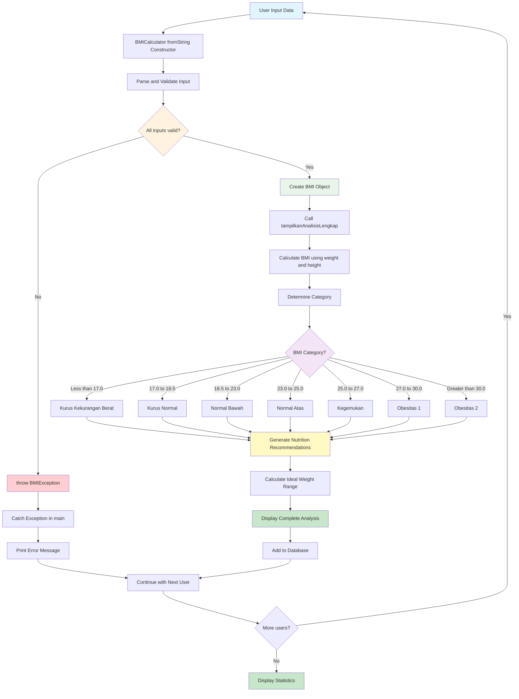

---

## 📊 **Assessment dan Evaluasi**

### **6.1 Practical Assessment: BMI Calculator Extension (40%)**

**Task**: Extend the BMI Calculator dengan fitur-fitur berikut:

#### **Requirements:**
1. **Historical Tracking (15 points)**
   - Tambahkan kemampuan untuk menyimpan multiple measurements per person
   - Implementasi method untuk melihat progress BMI over time
   - Calculate BMI change rate (kg/month)

2. **Advanced Analytics (15 points)**
   - Implement statistical analysis: mean, median, mode untuk BMI groups
   - Add comparison dengan standar BMI populasi Indonesia
   - Generate health risk assessment based on BMI trend

3. **Data Persistence Simulation (10 points)**
   - Simulate saving data to JSON format
   - Implement fromJson dan toJson methods
   - Handle malformed data dengan proper exception handling

#### **Evaluation Criteria:**
- **Code Organization (25%)**: Proper OOP structure, clean separation of concerns
- **Exception Handling (25%)**: Comprehensive error handling dengan custom exceptions
- **Functionality (30%)**: All requirements working correctly
- **Code Quality (20%)**: Comments, naming conventions, efficient algorithms

### **6.2 Theoretical Quiz: OOP dan Collections (25%)**

**Sample Questions:**

1. **Multiple Choice (5 questions x 2 points)**
   ```
   Manakah yang BENAR tentang inheritance di Dart?
   a) Child class tidak bisa override parent method
   b) Abstract class bisa diinstansiasi langsung
   c) super() digunakan untuk memanggil parent constructor ✓
   d) Private properties otomatis diturunkan ke child class
   ```

2. **Code Analysis (3 questions x 5 points)**
   ```dart
   // Temukan dan jelaskan error dalam code berikut:
   abstract class Animal {
     void makeSound();
   }
   
   class Dog extends Animal {
     String name;
     Dog(this.name);
     // Missing implementation of makeSound() ← ERROR
   }
   ```

3. **Problem Solving (2 questions x 5 points)**
   - Explain the difference between List, Map, dan Set dengan contoh use case
   - Design exception hierarchy untuk sistem manajemen mahasiswa

### **6.3 Code Review Assignment (20%)**

**Process:**
- Setiap mahasiswa akan mereview code BMI Calculator dari 2 peers
- Provide constructive feedback pada aspects: functionality, readability, efficiency
- Submit review dalam format structured report

**Review Template:**
```markdown
## Code Review: [Nama Mahasiswa]

### Strengths:
- [List positive aspects]

### Areas for Improvement:
- [Specific suggestions with line numbers]

### Questions/Suggestions:
- [Ask clarifying questions or suggest alternatives]

### Overall Rating: [1-5 stars]
```

### **6.4 Mini Project Presentation (15%)**

**Presentation Requirements:**
- 5-7 minutes presentation tentang BMI Calculator extension
- Demonstrate working application dengan live coding
- Explain design decisions dan challenge yang dihadapi
- Answer technical questions dari instructor dan peers

---

## 🎯 **Rangkuman dan Key Takeaways**

### **Konsep Utama yang Dipelajari:**

1. **Object-Oriented Programming**
   - Classes sebagai blueprint untuk objects
   - Inheritance untuk code reusability dan extension
   - Polymorphism untuk flexible behavior
   - Encapsulation untuk data protection

2. **Collections Management**
   - List untuk ordered data dengan duplicates
   - Map untuk key-value relationships
   - Set untuk unique data dengan mathematical operations
   - Efficient data manipulation techniques

3. **Exception Handling**
   - Try-catch untuk graceful error handling
   - Custom exceptions untuk specific business logic
   - Finally block untuk cleanup operations
   - Exception propagation dan handling strategies

4. **Async Programming Fundamentals**
   - Future untuk representing eventual values
   - async/await untuk readable asynchronous code
   - Concurrent vs sequential execution patterns
   - Error handling dalam async operations

### **Best Practices yang Dipelajari:**

- **Defensive Programming**: Validate input data dan handle edge cases
- **Clean Code Principles**: Meaningful names, single responsibility, proper commenting
- **Error Communication**: Provide clear, actionable error messages
- **Performance Considerations**: Choose appropriate data structures untuk use case

---

## 📚 **Sumber Belajar dan Referensi**

### **Dokumentasi Resmi**
1. Dart Language Tour. (2025). *Object-Oriented Programming*. Retrieved from https://dart.dev/guides/language/language-tour#classes
2. Dart Team. (2025). *Collections in Dart*. Retrieved from https://dart.dev/guides/libraries/library-tour#collections
3. Flutter Team. (2025). *Error Handling in Dart*. Retrieved from https://dart.dev/guides/language/error-handling
4. Dart Documentation. (2025). *Asynchrony Support*. Retrieved from https://dart.dev/guides/language/language-tour#asynchrony-support

### **Sumber Pembelajaran Indonesia**
5. Dicoding Indonesia. (2024). *Belajar Fundamental Dart*. Retrieved from https://www.dicoding.com/academies/191
6. BuildWithAngga. (2024). *Dart OOP Complete Guide*. Retrieved from https://buildwithangga.com/kelas/dart-object-oriented-programming
7. Sekolah Koding. (2024). *Tutorial Dart Collections*. Retrieved from https://sekolahkoding.com/tutorial/dart-collections
8. Koding Indonesia. (2024). *Exception Handling Dart Indonesia*. Retrieved from https://kodingindonesia.com/dart-exception-handling

### **Referensi Teknis**
9. Mozilla Developer Network. (2024). *Understanding Asynchronous Programming*. Retrieved from https://developer.mozilla.org/en-US/docs/Learn/JavaScript/Asynchronous/Concepts
10. GeeksforGeeks. (2024). *Object Oriented Programming Concepts*. Retrieved from https://www.geeksforgeeks.org/object-oriented-programming-oops-concept-in-java/

### **Sumber Data BMI**
11. World Health Organization. (2024). *Body Mass Index Classifications*. Retrieved from https://www.who.int/health-topics/obesity
12. Kementerian Kesehatan RI. (2024). *Standar Antropometri Penilaian Status Gizi Anak*. Retrieved from http://hukor.kemkes.go.id/uploads/produk_hukum/PMK_No._2_Th_2020_ttg_Standar_Antropometri_Anak.pdf

---

## 🚀 **Persiapan Pertemuan Selanjutnya**

**📊 Learning Progress Map:**

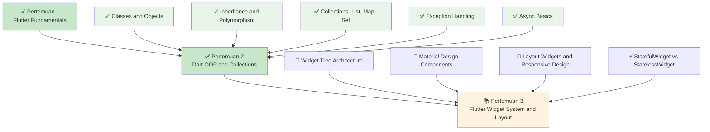

### **Yang Sudah Dikuasai:**
- [x] ✅ OOP fundamentals: classes, objects, inheritance, polymorphism
- [x] ✅ Collections manipulation: List, Map, Set operations
- [x] ✅ Exception handling dengan custom exceptions
- [x] ✅ Basic async programming dengan Future dan async/await
- [x] ✅ Practical implementation dalam BMI Calculator project

### **Persiapan untuk Pertemuan 3:**
- **Preview Flutter Widget System**: Explore widget catalog di https://flutter.dev/docs/development/ui/widgets
- **Material Design Study**: Review Material Design principles di https://material.io/design
- **Practice Dart Skills**: Continue practicing OOP concepts dengan mini projects
- **Setup Verification**: Ensure Flutter development environment masih working perfectly

### **Recommended Practice:**
1. **Daily Coding**: 30 minutes Dart OOP practice per day
2. **Code Review**: Review peers' BMI Calculator implementations
3. **Documentation**: Document learning progress dan challenges
4. **Community Engagement**: Join Flutter Indonesia Telegram group untuk networking

---

*© 2025 Mata Kuliah Pemrograman Piranti Bergerak dengan Flutter - Universitas Mulawarman*

**Prepared by**: [Nama Dosen]  
**Contact**: [Email Dosen]  
**Office Hours**: [Jadwal Konsultasi]

---

> 💡 **Learning Tip**: OOP adalah foundation yang kuat untuk Flutter development. Master these concepts sekarang akan membuat pembelajaran Flutter widgets dan state management jadi lebih mudah di pertemuan-pertemuan berikutnya!

> 🔥 **Challenge**: Try to implement a more complex application menggunakan OOP concepts yang telah dipelajari. Consider building a simple "Sistem Manajemen Mahasiswa" atau "Aplikasi Catatan Harian" as personal practice project!).hasMatch(nim)) {
      throw MahasiswaException('NIM harus berupa angka', nim);
    }
    
    // Validasi nama
    if (nama.trim().isEmpty) {
      throw MahasiswaException('Nama tidak boleh kosong', nim);
    }
    
    if (nama.length < 3) {
      throw MahasiswaException('Nama minimal 3 karakter', nim);
    }
    
    // Validasi semester
    if (semester < 1 || semester > 14) {
      throw MahasiswaException('Semester harus antara 1-14', nim);
    }
    
    // Validasi IPK
    if (ipk < 0.0 || ipk > 4.0) {
      throw IPKException('IPK harus antara 0.0-4.0', ipk);
    }
    
    // Validasi konsistensi IPK dan semester
    if (semester >= 8 && ipk < 2.0) {
      throw IPKException('Mahasiswa semester $semester tidak boleh IPK dibawah 2.0', ipk);
    }
  }
  
  // Method untuk update IPK dengan validasi
  void updateIPK(double ipkBaru) {
    if (ipkBaru < 0.0 || ipkBaru > 4.0) {
      throw IPKException('IPK baru harus antara 0.0-4.0', ipkBaru);
    }
    
    // Business rule: IPK tidak boleh turun drastis (>1.0 point)
    if (ipkBaru < ipk && (ipk - ipkBaru) > 1.0) {
      throw IPKException('IPK tidak boleh turun lebih dari 1.0 point', ipkBaru);
    }
    
    double ipkLama = ipk;
    ipk = ipkBaru;
    print('✅ IPK berhasil diupdate dari ${ipkLama.toStringAsFixed(2)} ke ${ipk.toStringAsFixed(2)}');
  }
  
  void tampilkanInfo() {
    print('👤 Nama: $nama');
    print('🆔 NIM: $nim');
    print('🎓 Program Studi: $prodi');
    print('📚 Semester: $semester');
    print('📊 IPK: ${ipk.toStringAsFixed(2)}');
  }
}

void main() {
  print('=== TESTING CUSTOM EXCEPTIONS ===\n');
  
  // Test data mahasiswa - beberapa valid, beberapa invalid
  List<Map<String, dynamic>> dataMahasiswa = [
    {
      'nama': 'Andi Kurniawan',
      'nim': '2021015001',
      'prodi': 'Informatika',
      'semester': 5,
      'ipk': 3.75,
    },
    {
      'nama': 'Sari',  // Error: nama terlalu pendek
      'nim': '2021015002',
      'prodi': 'Sistem Informasi',
      'semester': 3,
      'ipk': 3.2,
    },
    {
      'nama': 'Budi Santoso',
      'nim': '202101500',  // Error: NIM kurang dari 10 digit
      'prodi': 'Teknik Informatika',
      'semester': 7,
      'ipk': 2.9,
    },
    {
      'nama': 'Citra Dewi',
      'nim': '2021015004',
      'prodi': 'Sistem Informasi',
      'semester': 10,
      'ipk': 1.5,  // Error: IPK terlalu rendah untuk semester 10
    },
    {
      'nama': 'Desi Ratnawati',
      'nim': '2021ABC123',  // Error: NIM mengandung huruf
      'prodi': 'Informatika',
      'semester': 4,
      'ipk': 3.8,
    },
  ];
  
  // Testing pembuatan objek mahasiswa
  List<MahasiswaValidator> mahasiswaValid = [];
  
  for (var data in dataMahasiswa) {
    try {
      MahasiswaValidator mhs = MahasiswaValidator(
        nama: data['nama'],
        nim: data['nim'],
        prodi: data['prodi'],
        semester: data['semester'],
        ipk: data['ipk'],
      );
      
      print('✅ Mahasiswa ${data['nama']} berhasil dibuat');
      mahasiswaValid.add(mhs);
      
    } on MahasiswaException catch (e) {
      print('❌ $e');
    } on IPKException catch (e) {
      print('❌ $e');
    } catch (e) {
      print('❌ Error tidak diketahui untuk ${data['nama']}: $e');
    }
  }
  
  print('\n=== TESTING UPDATE IPK ===\n');
  
  // Testing update IPK untuk mahasiswa yang valid
  for (var mhs in mahasiswaValid) {
    print('--- Testing ${mhs.nama} ---');
    mhs.tampilkanInfo();
    
    // Test berbagai skenario update IPK
    List<double> ipkBaru = [3.9, 2.0, 4.5, 3.0]; // Beberapa valid, beberapa invalid
    
    for (double ipk in ipkBaru) {
      try {
        mhs.updateIPK(ipk);
      } on IPKException catch (e) {
        print('❌ $e');
      }
    }
    print('');
  }
  
  // Demonstrasi multiple exception types
  print('=== DEMONSTRASI HANDLING MULTIPLE EXCEPTIONS ===\n');
  
  try {
    // Simulasi proses kompleks yang bisa menghasilkan berbagai error
    prosesDataMahasiswa('2021015999', 4.5, 15);
  } on MahasiswaException catch (e, stackTrace) {
    print('❌ Error Mahasiswa: $e');
    print('📍 Stack trace: ${stackTrace.toString().split('\n').first}');
  } on IPKException catch (e, stackTrace) {
    print('❌ Error IPK: $e');
    print('📍 Stack trace: ${stackTrace.toString().split('\n').first}');
  } on ArgumentError catch (e) {
    print('❌ Argument Error: $e');
  } catch (e, stackTrace) {
    print('❌ Error tidak diketahui: $e');
    print('📍 Full stack trace: $stackTrace');
  }
}

// Function yang bisa throw berbagai jenis exception
void prosesDataMahasiswa(String nim, double ipk, int semester) {
  // Validasi NIM
  if (nim.length != 10) {
    throw MahasiswaException('Format NIM tidak valid', nim);
  }
  
  // Validasi IPK
  if (ipk > 4.0) {
    throw IPKException('IPK melebihi batas maksimal', ipk);
  }
  
  // Validasi semester
  if (semester > 14) {
    throw ArgumentError('Semester tidak boleh lebih dari 14');
  }
  
  print('✅ Data mahasiswa valid');
}
```
```

---

## ⚡ **Bagian IV: Async Programming Basics**

### **4.1 Future dan Async/Await**

Async programming memungkinkan aplikasi untuk menjalankan operasi yang membutuhkan waktu (seperti network request atau file I/O) tanpa memblokir UI.

```dart
// 📝 Coba code ini di: https://zapp.run/

// Simulasi operasi yang membutuhkan waktu
Future<String> ambilDataMahasiswa(String nim) async {
  print('🔄 Mengambil data mahasiswa $nim...');
  
  // Simulasi delay network request (2 detik)
  await Future.delayed(Duration(seconds: 2));
  
  // Simulasi kondisi berhasil/gagal
  if (nim == '2021015001') {
    return 'Andi Kurniawan - Informatika - IPK: 3.75';
  } else if (nim == '2021015002') {
    return 'Sari Putri - Sistem Informasi - IPK: 3.85';
  } else {
    throw Exception('Mahasiswa dengan NIM $nim tidak ditemukan');
  }
}

// Simulasi download file
Future<Map<String, dynamic>> downloadNilai(String nim) async {
  print('📥 Mendownload nilai untuk NIM $nim...');
  
  await Future.delayed(Duration(seconds: 1));
  
  return {
    'nim': nim,
    'mata_kuliah': {
      'Flutter': 85,
      'Database': 78,
      'AI': 92,
      'Networking': 88,
    },
    'semester': 5,
    'status': 'completed'
  };
}

// Simulasi upload data
Future<bool> uploadTugas(String nim, String namaFile) async {
  print('📤 Mengupload $namaFile untuk NIM $nim...');
  
  await Future.delayed(Duration(milliseconds: 1500));
  
  // Simulasi kemungkinan gagal upload
  if (namaFile.contains('error')) {
    throw Exception('Gagal upload file $namaFile');
  }
  
  return true;
}

void main() async {
  print('=== ASYNC PROGRAMMING BASICS ===\n');
  
  // 1. BASIC ASYNC/AWAIT
  print('--- Basic Async/Await ---');
  
  try {
    // Operasi async dengan await
    String dataMahasiswa = await ambilDataMahasiswa('2021015001');
    print('✅ Data ditemukan: $dataMahasiswa');
    
    // Operasi async yang gagal
    String dataTidakAda = await ambilDataMahasiswa('9999999999');
    print('✅ Data: $dataTidakAda');
    
  } catch (e) {
    print('❌ Error: $e');
  }
  
  print('\n--- Multiple Async Operations ---');
  
  // 2. MULTIPLE ASYNC OPERATIONS (Sequential)
  
  Stopwatch stopwatch = Stopwatch()..start();
  
  try {
    print('🔄 Menjalankan operasi secara sequential...');
    
    // Sequential execution (satu per satu)
    String data1 = await ambilDataMahasiswa('2021015001');
    String data2 = await ambilDataMahasiswa('2021015002');
    
    stopwatch.stop();
    
    print('✅ Data 1: $data1');
    print('✅ Data 2: $data2');
    print('⏱️ Waktu sequential: ${stopwatch.elapsedMilliseconds}ms');
    
  } catch (e) {
    print('❌ Error sequential: $e');
  }
  
  print('\n--- Concurrent Async Operations ---');
  
  // 3. CONCURRENT ASYNC OPERATIONS
  
  stopwatch.reset();
  stopwatch.start();
  
  try {
    print('🔄 Menjalankan operasi secara concurrent...');
    
    // Concurrent execution (bersamaan)
    Future<String> future1 = ambilDataMahasiswa('2021015001');
    Future<String> future2 = ambilDataMahasiswa('2021015002');
    
    // Menunggu semua selesai
    List<String> results = await Future.wait([future1, future2]);
    
    stopwatch.stop();
    
    print('✅ Data concurrent 1: ${results[0]}');
    print('✅ Data concurrent 2: ${results[1]}');
    print('⏱️ Waktu concurrent: ${stopwatch.elapsedMilliseconds}ms');
    
  } catch (e) {
    print('❌ Error concurrent: $e');
  }
  
  print('\n--- Complex Async Workflow ---');
  
  // 4. COMPLEX ASYNC WORKFLOW
  
  String nimMahasiswa = '2021015001';
  
  try {
    print('🔄 Memulai workflow kompleks untuk NIM $nimMahasiswa...');
    
    // Step 1: Ambil data mahasiswa
    String dataMahasiswa = await ambilDataMahasiswa(nimMahasiswa);
    print('1️⃣ $dataMahasiswa');
    
    // Step 2: Download nilai (concurrent dengan upload)
    Future<Map<String, dynamic>> futureNilai = downloadNilai(nimMahasiswa);
    Future<bool> futureUpload = uploadTugas(nimMahasiswa, 'tugas_flutter.pdf');
    
    // Menunggu kedua operasi selesai
    var results = await Future.wait([futureNilai, futureUpload]);
    Map<String, dynamic> nilai = results[0] as Map<String, dynamic>;
    bool uploadSuccess = results[1] as bool;
    
    print('2️⃣ Nilai berhasil didownload: ${nilai['mata_kuliah']}');
    print('3️⃣ Upload tugas: ${uploadSuccess ? 'Berhasil' : 'Gagal'}');
    
    // Step 3: Hitung rata-rata
    Map<String, int> mataKuliah = nilai['mata_kuliah'].cast<String, int>();
    double rataRata = mataKuliah.values.reduce((a, b) => a + b) / mataKuliah.length;
    
    print('4️⃣ Rata-rata nilai: ${rataRata.toStringAsFixed(2)}');
    print('✅ Workflow selesai!');
    
  } catch (e) {
    print('❌ Workflow error: $e');
  }
  
  print('\n--- Error Handling in Async ---');
  
  // 5. ERROR HANDLING IN ASYNC OPERATIONS
  
  List<String> nimList = ['2021015001', '2021015002', '9999999999', '1111111111'];
  
  for (String nim in nimList) {
    try {
      String result = await ambilDataMahasiswa(nim);
      print('✅ NIM $nim: $result');
    } catch (e) {
      print('❌ NIM $nim: Error - $e');
      // Program tetap lanjut untuk NIM berikutnya
    }
  }
  
  print('\n--- Async dengan Timeout ---');
  
  // 6. ASYNC DENGAN TIMEOUT
  
  try {
    // Operasi dengan timeout 1 detik (akan gagal karena operasi butuh 2 detik)
    String result = await ambilDataMahasiswa('2021015001')
        .timeout(Duration(seconds: 1));
    print('✅ Data dengan timeout: $result');
  } on TimeoutException catch (e) {
    print('❌ Timeout: Operasi terlalu lama (${e.duration})');
  } catch (e) {
    print('❌ Error lain: $e');
  }
  
  // Operasi dengan timeout yang cukup
  try {
    String result = await ambilDataMahasiswa('2021015001')
        .timeout(Duration(seconds: 3));
    print('✅ Data dengan timeout yang cukup: $result');
  } catch (e) {
    print('❌ Error: $e');
  }
}
```

**📊 Flow Diagram - Async Programming:**

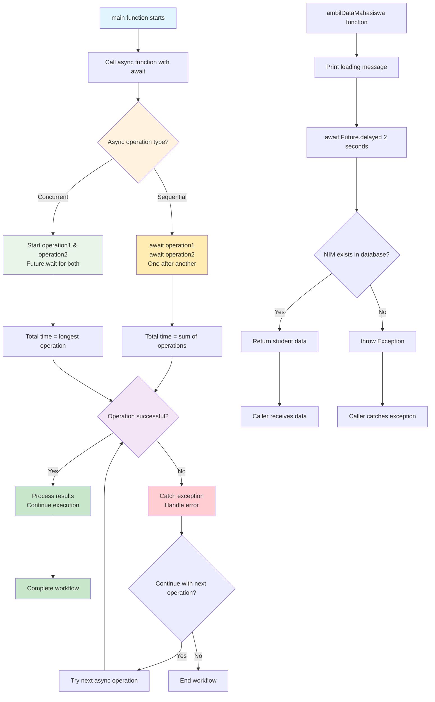

---

## 🧮 **Bagian V: Praktikum - BMI Calculator Indonesia**

### **5.1 Project Overview**

Dalam praktikum ini, kita akan membuat aplikasi BMI (Body Mass Index) Calculator yang menerapkan semua konsep OOP dan exception handling yang telah dipelajari.

```dart
// 📝 Coba code ini di: https://zapp.run/

// Enum untuk kategori BMI
enum KategoriBMI {
  kurusKurangBerat,
  kurusNormal, 
  normalBawah,
  normalAtas,
  kegemukan,
  obesitas1,
  obesitas2,
}

// Custom exception untuk BMI
class BMIException implements Exception {
  final String message;
  final double value;
  
  const BMIException(this.message, this.value);
  
  @override
  String toString() => 'BMIException: $message (Value: $value)';
}

// Abstract class untuk Person
abstract class Person {
  String nama;
  int umur;
  String jenisKelamin;
  
  Person(this.nama, this.umur, this.jenisKelamin);
  
  // Abstract methods yang harus diimplementasikan
  void tampilkanInfo();
  String rekomendasiGizi();
}

// Class untuk BMI Calculator
class BMICalculator extends Person {
  double _beratBadan; // Private property
  double _tinggiBadan; // Private property
  double? _bmi; // Nullable untuk lazy calculation
  KategoriBMI? _kategori;
  DateTime _waktuPengukuran;
  
  // Constructor
  BMICalculator({
    required String nama,
    required int umur,
    required String jenisKelamin,
    required double beratBadan,
    required double tinggiBadan,
  }) : _waktuPengukuran = DateTime.now(),
       super(nama, umur, jenisKelamin) {
    this.beratBadan = beratBadan; // Menggunakan setter untuk validasi
    this.tinggiBadan = tinggiBadan;
  }
  
  // Named constructor untuk data dari input string
  BMICalculator.fromString({
    required String nama,
    required String umurStr,
    required String jenisKelamin,
    required String beratStr,
    required String tinggiStr,
  }) : _waktuPengukuran = DateTime.now(),
       super(nama, 0, jenisKelamin) {
    
    // Validasi dan parsing dengan exception handling
    try {
      umur = int.parse(umurStr);
      if (umur <= 0 || umur > 150) {
        throw BMIException('Umur harus antara 1-150 tahun', umur.toDouble());
      }
    } catch (e) {
      throw BMIException('Format umur tidak valid', 0);
    }
    
    try {
      beratBadan = double.parse(beratStr);
    } catch (e) {
      throw BMIException('Format berat badan tidak valid', 0);
    }
    
    try {
      tinggiBadan = double.parse(tinggiStr);
    } catch (e) {
      throw BMIException('Format tinggi badan tidak valid', 0);
    }
  }
  
  // Getter dan Setter dengan validasi
  double get beratBadan => _beratBadan;
  
  set beratBadan(double berat) {
    if (berat <= 0) {
      throw BMIException('Berat badan harus lebih dari 0', berat);
    }
    if (berat > 500) {
      throw BMIException('Berat badan terlalu tinggi (>500kg)', berat);
    }
    _beratBadan = berat;
    _resetCalculation(); // Reset perhitungan saat data berubah
  }
  
  double get tinggiBadan => _tinggiBadan;
  
  set tinggiBadan(double tinggi) {
    if (tinggi <= 0) {
      throw BMIException('Tinggi badan harus lebih dari 0', tinggi);
    }
    if (tinggi < 50) {
      throw BMIException('Tinggi badan terlalu rendah (<50cm)', tinggi);
    }
    if (tinggi > 300) {
      throw BMIException('Tinggi badan terlalu tinggi (>300cm)', tinggi);
    }
    _tinggiBadan = tinggi;
    _resetCalculation();
  }
  
  // Method untuk reset perhitungan
  void _resetCalculation() {
    _bmi = null;
    _kategori = null;
  }
  
  // Method untuk menghitung BMI
  double hitungBMI() {
    if (_bmi == null) {
      double tinggiMeter = _tinggiBadan / 100; // Convert cm to meter
      _bmi = _beratBadan / (tinggiMeter * tinggiMeter);
    }
    return _bmi!;
  }
  
  // Method untuk menentukan kategori BMI
  KategoriBMI tentukanKategori() {
    if (_kategori == null) {
      double bmi = hitungBMI();
      
      if (bmi < 17.0) {
        _kategori = KategoriBMI.kurusKurangBerat;
      } else if (bmi < 18.5) {
        _kategori = KategoriBMI.kurusNormal;
      } else if (bmi < 23.0) {
        _kategori = KategoriBMI.normalBawah;
      } else if (bmi < 25.0) {
        _kategori = KategoriBMI.normalAtas;
      } else if (bmi < 27.0) {
        _kategori = KategoriBMI.kegemukan;
      } else if (bmi < 30.0) {
        _kategori = KategoriBMI.obesitas1;
      } else {
        _kategori = KategoriBMI.obesitas2;
      }
    }
    return _kategori!;
  }
  
  // Method untuk mendapatkan deskripsi kategori
  String deskripsiKategori() {
    switch (tentukanKategori()) {
      case KategoriBMI.kurusKurangBerat:
        return 'Kurus - Kekurangan Berat Badan Tingkat Berat';
      case KategoriBMI.kurusNormal:
        return 'Kurus - Kekurangan Berat Badan Tingkat Ringan';
      case KategoriBMI.normalBawah:
        return 'Normal - Batas Bawah';
      case KategoriBMI.normalAtas:
        return 'Normal - Batas Atas';
      case KategoriBMI.kegemukan:
        return 'Kelebihan Berat Badan - Tingkat Ringan';
      case KategoriBMI.obesitas1:
        return 'Obesitas Tingkat 1';
      case KategoriBMI.obesitas2:
        return 'Obesitas Tingkat 2';
    }
  }
  
  @override
  void tampilkanInfo() {
    print('=' * 50);
    print('🧮 HASIL PERHITUNGAN BMI');
    print('=' * 50);
    print('👤 Nama: $nama');
    print('🎂 Umur: $umur tahun');
    print('⚧️ Jenis Kelamin: $jenisKelamin');
    print('⚖️ Berat Badan: ${_beratBadan.toStringAsFixed(1)} kg');
    print('📏 Tinggi Badan: ${_tinggiBadan.toStringAsFixed(1)} cm');
    print('📊 BMI: ${hitungBMI().toStringAsFixed(2)}');
    print('📋 Kategori: ${deskripsiKategori()}');
    print('⏰ Waktu Pengukuran: ${_waktuPengukuran.day}/${_waktuPengukuran.month}/${_waktuPengukuran.year}');
    print('=' * 50);
  }
  
  @override
  String rekomendasiGizi() {
    KategoriBMI kategori = tentukanKategori();
    String baseRekomendasi = '';
    
    switch (kategori) {
      case KategoriBMI.kurusKurangBerat:
      case KategoriBMI.kurusNormal:
        baseRekomendasi = '''
🍽️ REKOMENDASI GIZI UNTUK MENAIKKAN BERAT BADAN:
• Tingkatkan asupan kalori 300-500 kalori per hari
• Konsumsi protein berkualitas: telur, daging, ikan, tahu
• Makan dalam porsi kecil tapi sering (5-6x sehari)
• Konsumsi karbohidrat kompleks: nasi merah, oats
• Minum susu atau smoothie tinggi protein
• Hindari makanan kosong kalori''';
        break;
        
      case KategoriBMI.normalBawah:
      case KategoriBMI.normalAtas:
        baseRekomendasi = '''
✅ REKOMENDASI GIZI UNTUK MEMPERTAHANKAN BERAT IDEAL:
• Pertahankan pola makan seimbang
• Konsumsi 4 sehat 5 sempurna
• Makan buah dan sayur 5 porsi per hari
• Minum air putih 8 gelas per hari
• Olahraga teratur 3-4x seminggu
• Batasi makanan processed dan fast food''';
        break;
        
      case KategoriBMI.kegemukan:
      case KategoriBMI.obesitas1:
      case KategoriBMI.obesitas2:
        baseRekomendasi = '''
🏃‍♂️ REKOMENDASI GIZI UNTUK MENURUNKAN BERAT BADAN:
• Kurangi asupan kalori 300-500 kalori per hari
• Tingkatkan konsumsi serat: sayur dan buah
• Pilih protein tanpa lemak: ayam tanpa kulit, ikan
• Kurangi karbohidrat sederhana: gula, tepung putih
• Makan dalam porsi kecil, perbanyak aktivitas fisik
• Hindari minuman manis dan gorengan''';
        break;
    }
    
    // Tambahan rekomendasi berdasarkan umur
    if (umur >= 50) {
      baseRekomendasi += '\n\n👴 Tambahan untuk usia 50+: Konsumsi kalsium dan vitamin D';
    } else if (umur < 18) {
      baseRekomendasi += '\n\n🧒 Tambahan untuk remaja: Konsultasi dengan ahli gizi untuk pertumbuhan optimal';
    }
    
    return baseRekomendasi;
  }
  
  // Method untuk membandingkan dengan BMI ideal
  Map<String, double> analisisBeratIdeal() {
    // BMI ideal untuk orang Asia: 21-23
    double bmiIdealRendah = 21.0;
    double bmiIdealTinggi = 23.0;
    
    double tinggiMeter = _tinggiBadan / 100;
    double beratIdealRendah = bmiIdealRendah * (tinggiMeter * tinggiMeter);
    double beratIdealTinggi = bmiIdealTinggi * (tinggiMeter * tinggiMeter);
    
    return {
      'berat_ideal_rendah': beratIdealRendah,
      'berat_ideal_tinggi': beratIdealTinggi,
      'selisih_rendah': _beratBadan - beratIdealRendah,
      'selisih_tinggi': _beratBadan - beratIdealTinggi,
    };
  }
  
  // Method untuk tracking history (simulasi)
  void tampilkanAnalisisLengkap() {
    tampilkanInfo();
    
    Map<String, double> analisis = analisisBeratIdeal();
    
    print('\n📈 ANALISIS BERAT IDEAL:');
    print('• Rentang berat ideal: ${analisis['berat_ideal_rendah']!.toStringAsFixed(1)} - ${analisis['berat_ideal_tinggi']!.toStringAsFixed(1)} kg');
    
    if (_beratBadan < analisis['berat_ideal_rendah']!) {
      print('• Status: Perlu menaikkan ${(-analisis['selisih_rendah']!).toStringAsFixed(1)} kg');
    } else if (_beratBadan > analisis['berat_ideal_tinggi']!) {
      print('• Status: Perlu menurunkan ${analisis['selisih_tinggi']!.toStringAsFixed(1)} kg');
    } else {
      print('• Status: Berat badan sudah ideal! 🎉');
    }
    
    print('\n${rekomendasiGizi()}');
  }
}

// Class untuk multiple BMI calculations
class BMIDatabase {
  List<BMICalculator> _dataHistory = [];
  
  void tambahData(BMICalculator bmi) {
    _dataHistory.add(bmi);
    print('✅ Data BMI untuk ${bmi.nama} berhasil ditambahkan');
  }
  
  List<BMICalculator> ambilDataByNama(String nama) {
    return _dataHistory.where((bmi) => 
        bmi.nama.toLowerCase().contains(nama.toLowerCase())).toList();
  }
  
  void tampilkanStatistik() {
    if (_dataHistory.isEmpty) {
      print('❌ Tidak ada data BMI');
      return;
    }
    
    double totalBMI = _dataHistory.map((bmi) => bmi.hitungBMI()).reduce((a, b) => a + b);
    double rataBMI = totalBMI / _dataHistory.length;
    
    Map<KategoriBMI, int> distribusiKategori = {};
    
    for (BMICalculator bmi in _dataHistory) {
      KategoriBMI kategori = bmi.tentukanKategori();
      distribusiKategori[kategori] = (distribusiKategori[kategori] ?? 0) + 1;
    }
    
    print('\n📊 STATISTIK BMI DATABASE');
    print('=' * 40);
    print('Total data: ${_dataHistory.length}');
    print('Rata-rata BMI: ${rataBMI.toStringAsFixed(2)}');
    print('\nDistribusi Kategori:');
    distribusiKategori.forEach((kategori, jumlah) {
      print('• ${kategori.toString().split('.').last}: $jumlah orang');
    });
  }
}

void main() async {
  print('🇮🇩 BMI CALCULATOR INDONESIA 🇮🇩\n');
  
  BMIDatabase database = BMIDatabase();
  
  // Test data mahasiswa Indonesia
  List<Map<String, String>> dataMahasiswa = [
    {
      'nama': 'Andi Kurniawan',
      'umur': '20',
      'jenis_kelamin': 'Laki-laki',
      'berat': '65',
      'tinggi': '170'
    },
    {
      'nama': 'Sari Putri Dewi',
      'umur': '19',
      'jenis_kelamin': 'Perempuan',
      'berat': '52',
      'tinggi': '160'
    },
    {
      'nama': 'Budi Santoso',
      'umur': '22',
      'jenis_kelamin': 'Laki-laki',
      'berat': '80',
      'tinggi': '175'
    },
    {
      'nama': 'Citra Maharani',
      'umur': 'abc', // Error: format umur salah
      'jenis_kelamin': 'Perempuan',
      'berat': '55',
      'tinggi': '165'
    },
    {
      'nama': 'Dedi Setiawan',
      'umur': '21',
      'jenis_kelamin': 'Laki-laki',
      'berat': '45',
      'tinggi': '180'
    }
  ];
  
  print('=== TESTING BMI CALCULATOR DENGAN DATA MAHASISWA ===\n');
  
  for (Map<String, String> data in dataMahasiswa) {
    try {
      BMICalculator bmi = BMICalculator.fromString(
        nama: data['nama']!,
        umurStr: data['umur']!,
        jenisKelamin: data['jenis_kelamin']!,
        beratStr: data['berat']!,
        tinggiStr: data['tinggi']!,
      );
      
      bmi.tampilkanAnalisisLengkap();
      database.tambahData(bmi);
      
    } on BMIException catch (e) {
      print('❌ Error untuk ${data['nama']}: $e');
    } catch (e) {
      print('❌ Error tidak diketahui untuk ${data['nama']}: $e');
    }
    
    print('\n' + '='*60 + '\n');
    
    // Delay untuk simulasi real-time processing
    await Future.delayed(Duration(milliseconds: 500));
  }
  
  // Tampilkan statistik
  database.tampilkanStatistik();
  
  print('\n=== TESTING UPDATE DATA ===\n');
  
  // Test update data untuk mahasiswa yang sudah ada
  try {
    BMICalculator andi = BMICalculator(
      nama: 'Andi Kurniawan (Updated)',
      umur: 20,
      jenisKelamin: 'Laki-laki',
      beratBadan: 70, // Naik 5kg
      tinggiBadan: 170,
    );
    
    print('Update data Andi setelah 6 bulan:');
    andi.tampilkanAnalisisLengkap();
    
  } catch (e) {
    print('❌ Error update data: $e');
  }
}
```

**📊 Flow Diagram - BMI Calculator Workflow:**

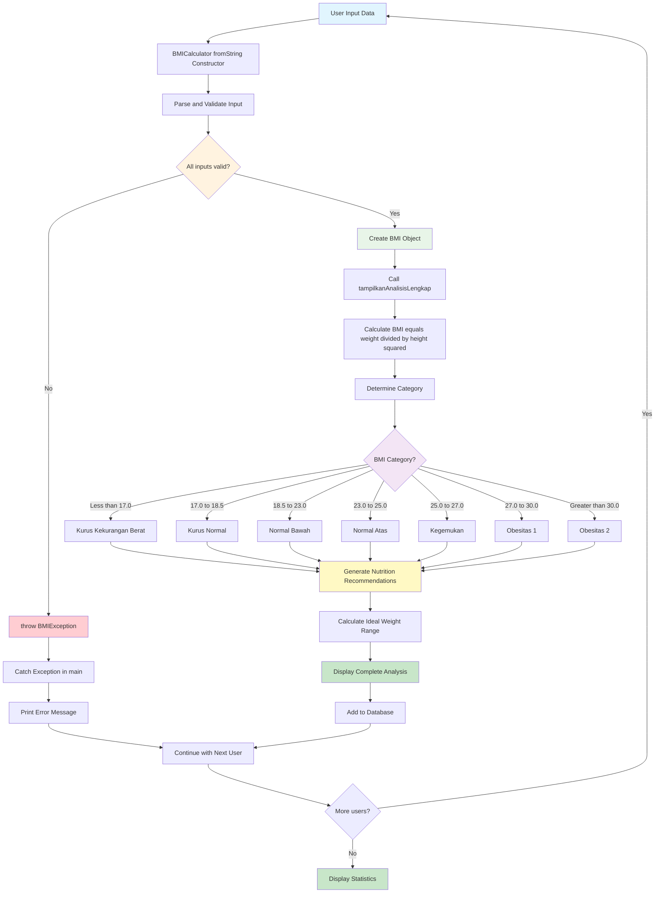

---

## 📊 **Assessment dan Evaluasi**

### **6.1 Practical Assessment: BMI Calculator Extension (40%)**

**Task**: Extend the BMI Calculator dengan fitur-fitur berikut:

#### **Requirements:**
1. **Historical Tracking (15 points)**
   - Tambahkan kemampuan untuk menyimpan multiple measurements per person
   - Implementasi method untuk melihat progress BMI over time
   - Calculate BMI change rate (kg/month)

2. **Advanced Analytics (15 points)**
   - Implement statistical analysis: mean, median, mode untuk BMI groups
   - Add comparison dengan standar BMI populasi Indonesia
   - Generate health risk assessment based on BMI trend

3. **Data Persistence Simulation (10 points)**
   - Simulate saving data to JSON format
   - Implement fromJson dan toJson methods
   - Handle malformed data dengan proper exception handling

#### **Evaluation Criteria:**
- **Code Organization (25%)**: Proper OOP structure, clean separation of concerns
- **Exception Handling (25%)**: Comprehensive error handling dengan custom exceptions
- **Functionality (30%)**: All requirements working correctly
- **Code Quality (20%)**: Comments, naming conventions, efficient algorithms

### **6.2 Theoretical Quiz: OOP dan Collections (25%)**

**Sample Questions:**

1. **Multiple Choice (5 questions x 2 points)**
   ```
   Manakah yang BENAR tentang inheritance di Dart?
   a) Child class tidak bisa override parent method
   b) Abstract class bisa diinstansiasi langsung
   c) super() digunakan untuk memanggil parent constructor ✓
   d) Private properties otomatis diturunkan ke child class
   ```

2. **Code Analysis (3 questions x 5 points)**
   ```dart
   // Temukan dan jelaskan error dalam code berikut:
   abstract class Animal {
     void makeSound();
   }
   
   class Dog extends Animal {
     String name;
     Dog(this.name);
     // Missing implementation of makeSound() ← ERROR
   }
   ```

3. **Problem Solving (2 questions x 5 points)**
   - Explain the difference between List, Map, dan Set dengan contoh use case
   - Design exception hierarchy untuk sistem manajemen mahasiswa

### **6.3 Code Review Assignment (20%)**

**Process:**
- Setiap mahasiswa akan mereview code BMI Calculator dari 2 peers
- Provide constructive feedback pada aspects: functionality, readability, efficiency
- Submit review dalam format structured report

**Review Template:**
```markdown
## Code Review: [Nama Mahasiswa]

### Strengths:
- [List positive aspects]

### Areas for Improvement:
- [Specific suggestions with line numbers]

### Questions/Suggestions:
- [Ask clarifying questions or suggest alternatives]

### Overall Rating: [1-5 stars]
```

### **6.4 Mini Project Presentation (15%)**

**Presentation Requirements:**
- 5-7 minutes presentation tentang BMI Calculator extension
- Demonstrate working application dengan live coding
- Explain design decisions dan challenge yang dihadapi
- Answer technical questions dari instructor dan peers

---

## 🎯 **Rangkuman dan Key Takeaways**

### **Konsep Utama yang Dipelajari:**

1. **Object-Oriented Programming**
   - Classes sebagai blueprint untuk objects
   - Inheritance untuk code reusability dan extension
   - Polymorphism untuk flexible behavior
   - Encapsulation untuk data protection

2. **Collections Management**
   - List untuk ordered data dengan duplicates
   - Map untuk key-value relationships
   - Set untuk unique data dengan mathematical operations
   - Efficient data manipulation techniques

3. **Exception Handling**
   - Try-catch untuk graceful error handling
   - Custom exceptions untuk specific business logic
   - Finally block untuk cleanup operations
   - Exception propagation dan handling strategies

4. **Async Programming Fundamentals**
   - Future untuk representing eventual values
   - async/await untuk readable asynchronous code
   - Concurrent vs sequential execution patterns
   - Error handling dalam async operations

### **Best Practices yang Dipelajari:**

- **Defensive Programming**: Validate input data dan handle edge cases
- **Clean Code Principles**: Meaningful names, single responsibility, proper commenting
- **Error Communication**: Provide clear, actionable error messages
- **Performance Considerations**: Choose appropriate data structures untuk use case

---

## 📚 **Sumber Belajar dan Referensi**

### **Dokumentasi Resmi**
1. Dart Language Tour. (2025). *Object-Oriented Programming*. Retrieved from https://dart.dev/guides/language/language-tour#classes
2. Dart Team. (2025). *Collections in Dart*. Retrieved from https://dart.dev/guides/libraries/library-tour#collections
3. Flutter Team. (2025). *Error Handling in Dart*. Retrieved from https://dart.dev/guides/language/error-handling
4. Dart Documentation. (2025). *Asynchrony Support*. Retrieved from https://dart.dev/guides/language/language-tour#asynchrony-support

### **Sumber Pembelajaran Indonesia**
5. Dicoding Indonesia. (2024). *Belajar Fundamental Dart*. Retrieved from https://www.dicoding.com/academies/191
6. BuildWithAngga. (2024). *Dart OOP Complete Guide*. Retrieved from https://buildwithangga.com/kelas/dart-object-oriented-programming
7. Sekolah Koding. (2024). *Tutorial Dart Collections*. Retrieved from https://sekolahkoding.com/tutorial/dart-collections
8. Koding Indonesia. (2024). *Exception Handling Dart Indonesia*. Retrieved from https://kodingindonesia.com/dart-exception-handling

### **Referensi Teknis**
9. Mozilla Developer Network. (2024). *Understanding Asynchronous Programming*. Retrieved from https://developer.mozilla.org/en-US/docs/Learn/JavaScript/Asynchronous/Concepts
10. GeeksforGeeks. (2024). *Object Oriented Programming Concepts*. Retrieved from https://www.geeksforgeeks.org/object-oriented-programming-oops-concept-in-java/

### **Sumber Data BMI**
11. World Health Organization. (2024). *Body Mass Index Classifications*. Retrieved from https://www.who.int/health-topics/obesity
12. Kementerian Kesehatan RI. (2024). *Standar Antropometri Penilaian Status Gizi Anak*. Retrieved from http://hukor.kemkes.go.id/uploads/produk_hukum/PMK_No._2_Th_2020_ttg_Standar_Antropometri_Anak.pdf

---

## 🚀 **Persiapan Pertemuan Selanjutnya**

**📊 Learning Progress Map:**

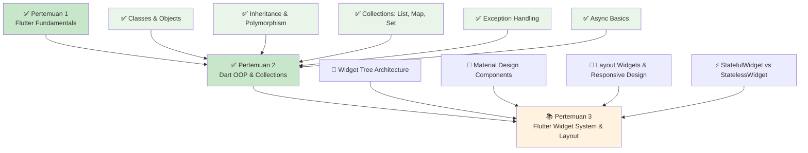

### **Yang Sudah Dikuasai:**
- [x] ✅ OOP fundamentals: classes, objects, inheritance, polymorphism
- [x] ✅ Collections manipulation: List, Map, Set operations
- [x] ✅ Exception handling dengan custom exceptions
- [x] ✅ Basic async programming dengan Future dan async/await
- [x] ✅ Practical implementation dalam BMI Calculator project

### **Persiapan untuk Pertemuan 3:**
- **Preview Flutter Widget System**: Explore widget catalog di https://flutter.dev/docs/development/ui/widgets
- **Material Design Study**: Review Material Design principles di https://material.io/design
- **Practice Dart Skills**: Continue practicing OOP concepts dengan mini projects
- **Setup Verification**: Ensure Flutter development environment masih working perfectly

### **Recommended Practice:**
1. **Daily Coding**: 30 minutes Dart OOP practice per day
2. **Code Review**: Review peers' BMI Calculator implementations
3. **Documentation**: Document learning progress dan challenges
4. **Community Engagement**: Join Flutter Indonesia Telegram group untuk networking

---

*© 2025 Mata Kuliah Pemrograman Piranti Bergerak dengan Flutter - Universitas Mulawarman*

**Prepared by**: [Nama Dosen]  
**Contact**: [Email Dosen]  
**Office Hours**: [Jadwal Konsultasi]

---

> 💡 **Learning Tip**: OOP adalah foundation yang kuat untuk Flutter development. Master these concepts sekarang akan membuat pembelajaran Flutter widgets dan state management jadi lebih mudah di pertemuan-pertemuan berikutnya!

> 🔥 **Challenge**: Try to implement a more complex application menggunakan OOP concepts yang telah dipelajari. Consider building a simple "Sistem Manajemen Mahasiswa" atau "Aplikasi Catatan Harian" as personal practice project!
