# 🎯 Pertemuan 2: Dart Programming dan OOP Concepts


---

## 📋 Daftar Isi

1. [🎯 Learning Objectives](#-learning-objectives)
2. [🏗️ Object-Oriented Programming Dasar](#️-object-oriented-programming-dasar)
3. [📦 Collections dan Data Structures](#-collections-dan-data-structures)
4. [⚡ Async Programming Fundamentals](#-async-programming-fundamentals)
5. [🐛 Exception Handling](#-exception-handling)
6. [👨‍💻 Praktikum: BMI Calculator Indonesia](#-praktikum-bmi-calculator-indonesia)
7. [📝 Assessment & Quiz](#-assessment--quiz)
8. [📖 Daftar Istilah](#-daftar-istilah)
9. [📚 Referensi](#-referensi)

---

## 🎯 Learning Objectives

Setelah menyelesaikan pertemuan ini, mahasiswa diharapkan mampu:

- ✅ **Menguasai konsep OOP dalam Dart**: Classes, Objects, Inheritance, Polymorphism
- ✅ **Menggunakan Collections**: Lists, Maps, Sets untuk manipulasi data complex
- ✅ **Memahami Async Programming**: Future, async/await untuk operasi asynchronous
- ✅ **Implementasi Error Handling**: Try-catch untuk aplikasi yang robust
- ✅ **Membuat aplikasi BMI Calculator**: Project praktis dengan OOP dan validation

---

## 🏗️ Object-Oriented Programming Dasar

### 🤔 Mengapa OOP Penting untuk Flutter?

**Object-Oriented Programming (OOP)** adalah paradigma programming yang mengorganisir code dalam bentuk **objects** dan **classes**. Dalam Flutter, hampir semua adalah **Widget** yang merupakan **Class**!

### 🇮🇩 Analogi OOP dalam Konteks Indonesia

Bayangkan Anda membuat aplikasi untuk **Warung Makan Padang**:

- **Class** = Blueprint/resep masakan (contoh: "Rendang")
- **Object** = Piring rendang yang actual di meja customer  
- **Properties** = Karakteristik (rasa, harga, porsi)
- **Methods** = Aksi yang bisa dilakukan (masak, sajikan, bayar)

### 📚 1. Classes dan Objects

#### Membuat Class Sederhana

```dart
// Class untuk Mahasiswa Indonesia
class Mahasiswa {
  // Properties (karakteristik mahasiswa)
  String nama;
  String nim;
  String jurusan;
  double ipk;
  
  // Constructor (cara membuat object mahasiswa)
  Mahasiswa({
    required this.nama,
    required this.nim,
    required this.jurusan,
    this.ipk = 0.0,
  });
  
  // Methods (aksi yang bisa dilakukan mahasiswa)
  void perkenalkan() {
    print('Halo! Nama saya $nama');
    print('NIM: $nim');
    print('Jurusan: $jurusan');
    print('IPK: $ipk');
  }
  
  void updateIPK(double ipkBaru) {
    if (ipkBaru >= 0.0 && ipkBaru <= 4.0) {
      ipk = ipkBaru;
      print('IPK berhasil diupdate menjadi $ipk');
    } else {
      print('IPK tidak valid! Harus antara 0.0 - 4.0');
    }
  }
  
  String getPredikat() {
    if (ipk >= 3.5) return 'Cumlaude';
    if (ipk >= 3.0) return 'Sangat Baik';
    if (ipk >= 2.5) return 'Baik';
    return 'Cukup';
  }
}

void main() {
  // Membuat object mahasiswa
  Mahasiswa mhs1 = Mahasiswa(
    nama: 'Siti Aminah',
    nim: '2021001',
    jurusan: 'Teknik Informatika',
    ipk: 3.75,
  );
  
  Mahasiswa mhs2 = Mahasiswa(
    nama: 'Budi Santoso', 
    nim: '2021002',
    jurusan: 'Sistem Informasi',
  );
  
  // Menggunakan methods
  print('=== Mahasiswa 1 ===');
  mhs1.perkenalkan();
  print('Predikat: ${mhs1.getPredikat()}');
  
  print('\n=== Mahasiswa 2 ===');
  mhs2.perkenalkan();
  mhs2.updateIPK(3.2);
  print('Predikat: ${mhs2.getPredikat()}');
}
```

**🔧 [Copy Code]** | **🌐 [Test di zapp.run](https://zapp.run/)**

#### Alur Eksekusi Class dan Objects:

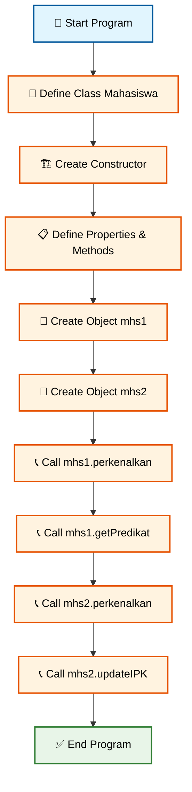

### 🧬 2. Inheritance (Pewarisan)

**Inheritance** memungkinkan class baru **mewarisi** properties dan methods dari class lain. Seperti anak mewarisi sifat dari orang tua!

```dart
// Class induk (parent class)
class Kendaraan {
  String merek;
  String warna; 
  int tahunProduksi;
  
  Kendaraan({
    required this.merek,
    required this.warna,
    required this.tahunProduksi,
  });
  
  void info() {
    print('Kendaraan $merek warna $warna tahun $tahunProduksi');
  }
  
  void nyalakan() {
    print('Kendaraan $merek dinyalakan!');
  }
}

// Class anak (child class) - mewarisi dari Kendaraan
class Motor extends Kendaraan {
  int kapasitasMesin; // cc
  
  Motor({
    required String merek,
    required String warna,
    required int tahunProduksi,
    required this.kapasitasMesin,
  }) : super(
    merek: merek,
    warna: warna, 
    tahunProduksi: tahunProduksi,
  );
  
  // Method tambahan khusus untuk motor
  void gasHandler() {
    print('Motor $merek ${kapasitasMesin}cc siap ngebut!');
  }
  
  // Override method dari parent class
  @override
  void nyalakan() {
    print('Motor $merek di-kick starter... Brummm!');
  }
}

class Mobil extends Kendaraan {
  int jumlahPintu;
  String transmisi;
  
  Mobil({
    required String merek,
    required String warna, 
    required int tahunProduksi,
    required this.jumlahPintu,
    this.transmisi = 'Manual',
  }) : super(
    merek: merek,
    warna: warna,
    tahunProduksi: tahunProduksi,
  );
  
  void infoMobil() {
    info(); // Method dari parent class
    print('Jumlah pintu: $jumlahPintu');
    print('Transmisi: $transmisi');
  }
  
  @override
  void nyalakan() {
    print('Mobil $merek distarter dengan kunci... Wushhh!');
  }
}

void main() {
  // Test inheritance
  Motor beat = Motor(
    merek: 'Honda Beat',
    warna: 'Merah',
    tahunProduksi: 2023,
    kapasitasMesin: 110,
  );
  
  Mobil avanza = Mobil(
    merek: 'Toyota Avanza',
    warna: 'Putih', 
    tahunProduksi: 2024,
    jumlahPintu: 4,
    transmisi: 'Automatic',
  );
  
  print('=== Test Motor ===');
  beat.info();
  beat.nyalakan();
  beat.gasHandler();
  
  print('\n=== Test Mobil ===');
  avanza.infoMobil();
  avanza.nyalakan();
}
```

**🔧 [Copy Code]** | **🌐 [Test di zapp.run](https://zapp.run/)**

#### Alur Inheritance:

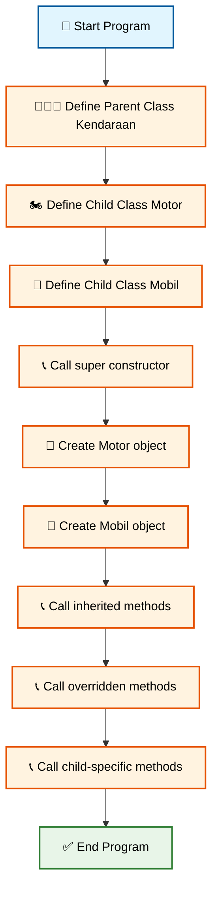

---

## 📦 Collections dan Data Structures

### 🗂️ Mengapa Collections Penting?

Dalam aplikasi nyata, kita sering berurusan dengan **kumpulan data** seperti:
- **List mahasiswa** dalam sebuah kelas
- **Map data** profil user dari API
- **Set kategori** produk yang unique

Mari pelajari 3 jenis collections utama dalam Dart!

### 📋 1. Lists - Daftar Berurutan

**List** adalah kumpulan data yang berurutan dan bisa duplikat.

```dart
void main() {
  // 1. List of Strings - Nama Mahasiswa
  List<String> namaMahasiswa = [
    'Siti Nurhaliza',
    'Budi Santoso', 
    'Dewi Sartika',
    'Ahmad Rizki',
    'Maya Sari'
  ];
  
  // 2. List of Integers - Nilai Ujian  
  List<int> nilaiUjian = [85, 92, 78, 88, 95];
  
  // 3. List of Doubles - IPK Mahasiswa
  List<double> ipkMahasiswa = [3.5, 3.8, 3.2, 3.6, 3.9];
  
  print('=== Data Mahasiswa Indonesia ===');
  
  // Akses data berdasarkan index
  print('Mahasiswa pertama: ${namaMahasiswa[0]}');
  print('Nilai tertinggi: ${nilaiUjian.reduce((a, b) => a > b ? a : b)}');
  
  // Iterasi dengan for-in loop
  print('\n=== Daftar Lengkap ===');
  for (int i = 0; i < namaMahasiswa.length; i++) {
    print('${i + 1}. ${namaMahasiswa[i]} - Nilai: ${nilaiUjian[i]} - IPK: ${ipkMahasiswa[i]}');
  }
  
  // Menambah data baru
  namaMahasiswa.add('Sari Dewi');
  nilaiUjian.add(87);
  ipkMahasiswa.add(3.4);
  
  print('\n=== Setelah Menambah Mahasiswa Baru ===');
  print('Total mahasiswa: ${namaMahasiswa.length}');
  print('Mahasiswa baru: ${namaMahasiswa.last}');
  
  // Mencari data
  String cariNama = 'Budi Santoso';
  if (namaMahasiswa.contains(cariNama)) {
    int index = namaMahasiswa.indexOf(cariNama);
    print('$cariNama ditemukan di posisi ${index + 1} dengan nilai ${nilaiUjian[index]}');
  }
  
  // Filter data - mahasiswa dengan nilai >= 90
  List<String> mahasiswaBerprestasi = [];
  for (int i = 0; i < namaMahasiswa.length; i++) {
    if (nilaiUjian[i] >= 90) {
      mahasiswaBerprestasi.add(namaMahasiswa[i]);
    }
  }
  
  print('\n=== Mahasiswa Berprestasi (Nilai >= 90) ===');
  for (String nama in mahasiswaBerprestasi) {
    print('🏆 $nama');
  }
}
```

**🔧 [Copy Code]** | **🌐 [Test di zapp.run](https://zapp.run/)**

#### Alur Operations pada Lists:

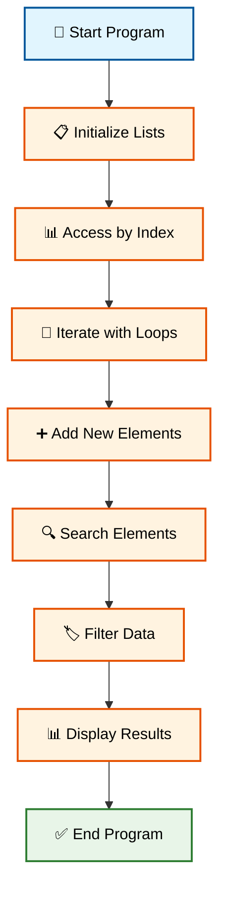

### 🗺️ 2. Maps - Data Key-Value

**Map** adalah kumpulan data dengan **key-value pairs**, seperti kamus!

```dart
void main() {
  // 1. Map untuk profil mahasiswa
  Map<String, dynamic> profilMahasiswa = {
    'nama': 'Siti Nurhaliza',
    'nim': '2021001', 
    'jurusan': 'Teknik Informatika',
    'umur': 20,
    'ipk': 3.75,
    'alamat': 'Jakarta Timur',
    'hobi': ['membaca', 'coding', 'traveling'],
    'sudahMenikah': false,
  };
  
  // 2. Map untuk data kota Indonesia
  Map<String, Map<String, dynamic>> kotaIndonesia = {
    'Jakarta': {
      'populasi': 10560000,
      'luas': 664,
      'gubernur': 'Anies Baswedan',
      'makananKhas': ['Kerak Telor', 'Soto Betawi', 'Gado-gado']
    },
    'Surabaya': {
      'populasi': 2874000, 
      'luas': 350,
      'gubernur': 'Eri Cahyadi',
      'makananKhas': ['Rujak Cingur', 'Rawon', 'Lontong Balap']
    },
    'Bandung': {
      'populasi': 2452000,
      'luas': 167,
      'gubernur': 'Ridwan Kamil', 
      'makananKhas': ['Baso Aci', 'Surabi', 'Peuyeum']
    }
  };
  
  print('=== Profil Mahasiswa ===');
  print('Nama: ${profilMahasiswa['nama']}');
  print('NIM: ${profilMahasiswa['nim']}');
  print('Jurusan: ${profilMahasiswa['jurusan']}');
  print('IPK: ${profilMahasiswa['ipk']}');
  
  // Akses nested list dalam map
  List<String> hobi = profilMahasiswa['hobi'];
  print('Hobi: ${hobi.join(', ')}');
  
  print('\n=== Data Kota Indonesia ===');
  // Iterasi map dengan forEach
  kotaIndonesia.forEach((namaKota, dataKota) {
    print('\n🏙️ $namaKota');
    print('  Populasi: ${dataKota['populasi']} jiwa');
    print('  Luas: ${dataKota['luas']} km²');
    print('  Gubernur: ${dataKota['gubernur']}');
    
    List<String> makanan = dataKota['makananKhas'];
    print('  Makanan Khas: ${makanan.join(', ')}');
  });
  
  // Menambah data baru
  profilMahasiswa['semester'] = 5;
  profilMahasiswa['organisasi'] = ['BEM', 'Himpunan'];
  
  print('\n=== Update Profil ===');
  print('Semester: ${profilMahasiswa['semester']}');
  print('Organisasi: ${profilMahasiswa['organisasi']}');
  
  // Cek key exists atau tidak
  if (kotaIndonesia.containsKey('Yogyakarta')) {
    print('Data Yogyakarta tersedia');
  } else {
    print('Data Yogyakarta belum tersedia');
    
    // Tambah data kota baru
    kotaIndonesia['Yogyakarta'] = {
      'populasi': 422000,
      'luas': 32,
      'gubernur': 'Sri Sultan HB X',
      'makananKhas': ['Gudeg', 'Bakpia', 'Tahu Gimbal']
    };
    
    print('Data Yogyakarta berhasil ditambahkan!');
  }
}
```

**🔧 [Copy Code]** | **🌐 [Test di zapp.run](https://zapp.run/)**

### 🎯 3. Sets - Kumpulan Data Unique

**Set** adalah kumpulan data yang **tidak boleh duplikat** dan **tidak berurutan**.

```dart
void main() {
  // 1. Set of Strings - Skill Programming
  Set<String> skillProgramming = {
    'Dart',
    'Flutter', 
    'JavaScript',
    'Python',
    'Java',
    'Dart', // Duplikat - akan otomatis dihapus
  };
  
  // 2. Set of Integers - Angka Favorit
  Set<int> angkaFavorit = {7, 13, 21, 77, 13}; // 13 duplikat
  
  print('=== Programming Skills (Tanpa Duplikat) ===');
  print('Total skills: ${skillProgramming.length}');
  for (String skill in skillProgramming) {
    print('💻 $skill');
  }
  
  print('\n=== Angka Favorit (Tanpa Duplikat) ===');
  print('Angka: ${angkaFavorit.toList()}');
  
  // Menambah element baru
  skillProgramming.add('React');
  skillProgramming.add('Vue'); 
  skillProgramming.add('Flutter'); // Duplikat - tidak akan ditambah
  
  print('\n=== Setelah Menambah Skills ===');
  print('Total skills: ${skillProgramming.length}');
  print('Skills terbaru: ${skillProgramming.toList()}');
  
  // Set Operations - Intersection, Union, Difference
  Set<String> skillBackend = {'Java', 'Python', 'Node.js', 'PHP'};
  Set<String> skillFrontend = {'JavaScript', 'React', 'Vue', 'Flutter'};
  
  // Intersection - skill yang ada di keduanya
  Set<String> skillBoth = skillProgramming.intersection(skillBackend);
  print('\n=== Skills Backend yang Dikuasai ===');
  print('${skillBoth.toList()}');
  
  // Union - gabungan semua skills
  Set<String> allSkills = skillProgramming.union(skillFrontend);
  print('\n=== Semua Skills Gabungan ===');
  print('Total: ${allSkills.length}');
  for (String skill in allSkills) {
    print('⭐ $skill');
  }
  
  // Difference - skills yang belum dikuasai
  Set<String> skillBelumDikuasai = skillBackend.difference(skillProgramming);
  print('\n=== Skills Backend yang Belum Dikuasai ===');
  for (String skill in skillBelumDikuasai) {
    print('📚 Perlu belajar: $skill');
  }
  
  // Check membership
  String skillCek = 'Flutter';
  if (skillProgramming.contains(skillCek)) {
    print('\n✅ $skillCek sudah dikuasai!');
  } else {
    print('\n❌ $skillCek belum dikuasai');
  }
}
```

**🔧 [Copy Code]** | **🌐 [Test di zapp.run](https://zapp.run/)**

#### Alur Operations pada Sets:

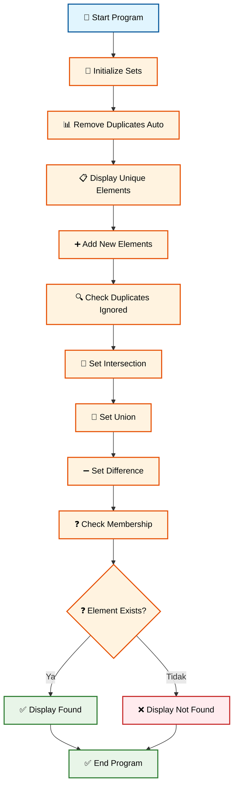

---

## ⚡ Async Programming Fundamentals

### 🤔 Mengapa Async Programming Penting?

Dalam aplikasi mobile, kita sering melakukan operasi yang **membutuhkan waktu** seperti:
- 📡 **Download data** dari internet
- 💾 **Baca/tulis file** dari storage  
- 🌐 **API calls** ke server
- ⏱️ **Timer** dan delay operations

Tanpa **async programming**, aplikasi akan **freeze** saat menunggu operasi selesai!

### ⏰ 1. Future - Operasi yang Akan Selesai di Masa Depan

**Future** represents nilai yang **belum ada sekarang** tapi **akan tersedia nanti**.

```dart
void main() async {
  print('🚀 Memulai simulasi download data mahasiswa...\n');
  
  // Simulasi download data dari server
  await downloadDataMahasiswa();
  
  // Simulasi multiple downloads
  await downloadMultipleData();
  
  print('\n✅ Semua download selesai!');
}

// Future function - simulasi download data
Future<void> downloadDataMahasiswa() async {
  print('📥 Mulai download data mahasiswa...');
  
  // Simulasi delay network (3 detik)
  await Future.delayed(Duration(seconds: 3));
  
  print('✅ Data mahasiswa berhasil didownload!');
  print('   Total: 150 mahasiswa');
  print('   Size: 2.5 MB');
}

// Future function dengan return value
Future<List<String>> downloadNamaMahasiswa() async {
  print('📥 Download nama mahasiswa...');
  
  // Simulasi delay (2 detik)
  await Future.delayed(Duration(seconds: 2));
  
  // Return data setelah download selesai
  return [
    'Siti Nurhaliza',
    'Budi Santoso',
    'Dewi Sartika', 
    'Ahmad Rizki',
    'Maya Sari'
  ];
}

Future<Map<String, double>> downloadIPKMahasiswa() async {
  print('📥 Download data IPK...');
  
  await Future.delayed(Duration(seconds: 1));
  
  return {
    'Siti Nurhaliza': 3.8,
    'Budi Santoso': 3.5,
    'Dewi Sartika': 3.6,
    'Ahmad Rizki': 3.9,
    'Maya Sari': 3.7,
  };
}

// Multiple async operations
Future<void> downloadMultipleData() async {
  print('\n🔄 Download multiple data secara berurutan...');
  
  // Download satu per satu (sequential)
  List<String> namaMahasiswa = await downloadNamaMahasiswa();
  print('✅ Nama mahasiswa: ${namaMahasiswa.length} data');
  
  Map<String, double> ipkData = await downloadIPKMahasiswa();
  print('✅ Data IPK: ${ipkData.length} data');
  
  // Kombinasikan data
  print('\n📊 Hasil gabungan:');
  for (String nama in namaMahasiswa) {
    double ipk = ipkData[nama] ?? 0.0;
    print('   $nama - IPK: $ipk');
  }
}
```

**🔧 [Copy Code]** | **🌐 [Test di zapp.run](https://zapp.run/)**

#### Alur Async Programming:

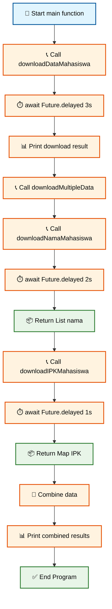

### ⚡ 2. Parallel Async Operations

Kadang kita ingin menjalankan beberapa operasi **bersamaan** untuk menghemat waktu!

```dart
void main() async {
  print('🚀 Comparing Sequential vs Parallel downloads\n');
  
  // Test sequential download
  Stopwatch stopwatch1 = Stopwatch()..start();
  await downloadSequential();
  stopwatch1.stop();
  print('⏱️ Sequential time: ${stopwatch1.elapsedMilliseconds} ms\n');
  
  // Test parallel download  
  Stopwatch stopwatch2 = Stopwatch()..start();
  await downloadParallel();
  stopwatch2.stop();
  print('⏱️ Parallel time: ${stopwatch2.elapsedMilliseconds} ms');
  
  print('\n🎯 Parallel ${stopwatch1.elapsedMilliseconds - stopwatch2.elapsedMilliseconds} ms lebih cepat!');
}

// Sequential download - satu per satu
Future<void> downloadSequential() async {
  print('📥 Sequential Download Started...');
  
  await downloadFile('Materi Flutter.pdf', 2);
  await downloadFile('Dataset Mahasiswa.csv', 1); 
  await downloadFile('Gambar Campus.jpg', 3);
  
  print('✅ Sequential download selesai!');
}

// Parallel download - bersamaan
Future<void> downloadParallel() async {
  print('📥 Parallel Download Started...');
  
  // Jalankan semua download bersamaan
  List<Future<void>> downloads = [
    downloadFile('Materi Flutter.pdf', 2),
    downloadFile('Dataset Mahasiswa.csv', 1),
    downloadFile('Gambar Campus.jpg', 3),
  ];
  
  // Tunggu sampai semua selesai
  await Future.wait(downloads);
  
  print('✅ Parallel download selesai!');
}

// Simulasi download file
Future<void> downloadFile(String fileName, int seconds) async {
  print('📄 Downloading $fileName...');
  await Future.delayed(Duration(seconds: seconds));
  print('✅ $fileName downloaded!');
}
```

**🔧 [Copy Code]** | **🌐 [Test di zapp.run](https://zapp.run/)**

#### Alur Parallel vs Sequential Download:

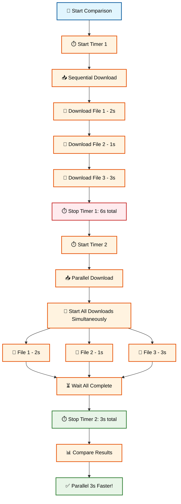

---

## 🐛 Exception Handling

### 🛡️ Mengapa Error Handling Penting?

Dalam aplikasi nyata, banyak hal bisa **salah**:
- 📡 **Network timeout** saat download
- 🔢 **Invalid input** dari user
- 💾 **File not found** saat baca data
- 🌐 **API error** dari server

**Exception handling** membuat aplikasi kita **robust** dan **user-friendly**!

### 🎯 Try-Catch-Finally Pattern

```dart
void main() async {
  print('🛡️ Testing Exception Handling\n');
  
  // Test berbagai skenario error
  await testDivisionError();
  await testNetworkError(); 
  await testFileReadError();
  await testValidationError();
}

// 1. Mathematical Error Handling
Future<void> testDivisionError() async {
  print('=== Test Division Error ===');
  
  List<int> numbers = [10, 5, 0, -3];
  
  for (int divisor in numbers) {
    try {
      double result = 100 / divisor;
      print('✅ 100 ÷ $divisor = $result');
      
      // Custom validation
      if (divisor < 0) {
        throw Exception('Divisor tidak boleh negatif!');
      }
      
    } catch (e) {
      print('❌ Error saat pembagian dengan $divisor: $e');
    }
  }
  print('');
}

// 2. Network Error Simulation
Future<void> testNetworkError() async {
  print('=== Test Network Error ===');
  
  List<String> urls = [
    'https://api.example.com/mahasiswa',
    'https://invalid-url-404.com/data',
    'https://timeout-server.com/slow'
  ];
  
  for (String url in urls) {
    try {
      await simulateNetworkRequest(url);
      print('✅ Request ke $url berhasil!');
      
    } on NetworkException catch (e) {
      print('🌐 Network Error: ${e.message}');
    } on TimeoutException catch (e) {
      print('⏱️ Timeout Error: ${e.message}'); 
    } catch (e) {
      print('❌ Unknown Error: $e');
    } finally {
      print('🔄 Cleanup connection untuk $url');
    }
  }
  print('');
}

// Custom Exception Classes
class NetworkException implements Exception {
  final String message;
  NetworkException(this.message);
}

class TimeoutException implements Exception {
  final String message;
  TimeoutException(this.message);
}

// Simulate network request dengan berbagai error
Future<void> simulateNetworkRequest(String url) async {
  await Future.delayed(Duration(milliseconds: 500));
  
  if (url.contains('invalid')) {
    throw NetworkException('URL tidak valid: $url');
  } else if (url.contains('timeout')) {
    throw TimeoutException('Request timeout untuk: $url');
  }
  // Success case - no exception thrown
}

// 3. File Read Error Handling
Future<void> testFileReadError() async {
  print('=== Test File Read Error ===');
  
  List<String> fileNames = [
    'data_mahasiswa.txt',
    'config.json', 
    'nonexistent.file'
  ];
  
  for (String fileName in fileNames) {
    try {
      String content = await simulateFileRead(fileName);
      print('✅ File $fileName berhasil dibaca: ${content.length} characters');
      
    } on FileNotFoundException catch (e) {
      print('📁 File Error: ${e.message}');
      // Fallback: create default file
      print('🔄 Creating default $fileName...');
      
    } catch (e) {
      print('❌ Unexpected error reading $fileName: $e');
    }
  }
  print('');
}

class FileNotFoundException implements Exception {
  final String message;
  FileNotFoundException(this.message);
}

Future<String> simulateFileRead(String fileName) async {
  await Future.delayed(Duration(milliseconds: 300));
  
  if (fileName == 'nonexistent.file') {
    throw FileNotFoundException('File $fileName tidak ditemukan');
  }
  
  return 'Sample content from $fileName...';
}

// 4. Input Validation Error
Future<void> testValidationError() async {
  print('=== Test Input Validation ===');
  
  List<String> userInputs = ['23', '0', '-5', 'abc', ''];
  
  for (String input in userInputs) {
    try {
      int age = validateAge(input);
      String category = categorizeAge(age);
      print('✅ Input "$input" -> Umur: $age ($category)');
      
    } on ValidationException catch (e) {
      print('📝 Validation Error: ${e.message}');
    } catch (e) {
      print('❌ Unexpected error untuk input "$input": $e');
    }
  }
}

class ValidationException implements Exception {
  final String message;
  ValidationException(this.message);
}

int validateAge(String input) {
  if (input.isEmpty) {
    throw ValidationException('Input tidak boleh kosong');
  }
  
  int? age = int.tryParse(input);
  if (age == null) {
    throw ValidationException('Input harus berupa angka');
  }
  
  if (age < 0) {
    throw ValidationException('Umur tidak boleh negatif');
  }
  
  if (age > 150) {
    throw ValidationException('Umur tidak realistis (>150)');
  }
  
  return age;
}

String categorizeAge(int age) {
  if (age < 17) return 'Anak-anak';
  if (age < 25) return 'Remaja/Mahasiswa'; 
  if (age < 60) return 'Dewasa';
  return 'Lansia';
}
```

**🔧 [Copy Code]** | **🌐 [Test di zapp.run](https://zapp.run/)**

#### Alur Comprehensive Exception Handling Tests:

```mermaid
flowchart TD
    A[🎯 Start Exception Tests] --> B[🧮 Test Division Error]
    B --> C[🔄 Loop Through Numbers]
    C --> D[🔢 Try Division Operation]
    D --> E{❓ Division Success?}
    E -->|Ya| F[✅ Print Result]
    E -->|Tidak| G[❌ Catch Exception]
    F --> H{❓ More Numbers?}
    G --> H
    H -->|Ya| C
    H -->|Tidak| I[🌐 Test Network Error]
    
    I --> J[🔄 Loop Through URLs]
    J --> K[📡 Try Network Request]
    K --> L{❓ Request Success?}
    L -->|Ya| M[✅ Print Success]
    L -->|NetworkException| N[🌐 Handle Network Error]
    L -->|TimeoutException| O[⏱️ Handle Timeout Error]
    L -->|Other| P[❓ Handle Unknown Error]
    
    M --> Q[🔄 Finally Block Cleanup]
    N --> Q
    O --> Q
    P --> Q
    Q --> R{❓ More URLs?}
    R -->|Ya| J
    R -->|Tidak| S[📁 Test File Error]
    
    S --> T[🔄 Loop Through Files]
    T --> U[📖 Try File Read]
    U --> V{❓ File Found?}
    V -->|Ya| W[✅ Print File Content]
    V -->|Tidak| X[📁 Handle FileNotFoundException]
    X --> Y[🔄 Create Default File]
    W --> Z{❓ More Files?}
    Y --> Z
    Z -->|Ya| T
    Z -->|Tidak| AA[📝 Test Validation Error]
    
    AA --> BB[🔄 Loop Through Inputs]
    BB --> CC[✅ Try Validate Input]
    CC --> DD{❓ Input Valid?}
    DD -->|Ya| EE[✅ Print Valid Result]
    DD -->|Tidak| FF[📝 Handle ValidationException]
    EE --> GG{❓ More Inputs?}
    FF --> GG
    GG -->|Ya| BB
    GG -->|Tidak| HH[✅ All Tests Complete]
    
    style A fill:#e1f5fe,stroke:#01579b,stroke-width:2px,color:#000
    style B fill:#fff3e0,stroke:#e65100,stroke-width:2px,color:#000
    style C fill:#fff3e0,stroke:#e65100,stroke-width:2px,color:#000
    style D fill:#fff3e0,stroke:#e65100,stroke-width:2px,color:#000
    style E fill:#fff3e0,stroke:#e65100,stroke-width:2px,color:#000
    style F fill:#e8f5e8,stroke:#2e7d32,stroke-width:2px,color:#000
    style G fill:#ffebee,stroke:#c62828,stroke-width:2px,color:#000
    style H fill:#fff3e0,stroke:#e65100,stroke-width:2px,color:#000
    style I fill:#fff3e0,stroke:#e65100,stroke-width:2px,color:#000
    style J fill:#fff3e0,stroke:#e65100,stroke-width:2px,color:#000
    style K fill:#fff3e0,stroke:#e65100,stroke-width:2px,color:#000
    style L fill:#fff3e0,stroke:#e65100,stroke-width:2px,color:#000
    style M fill:#e8f5e8,stroke:#2e7d32,stroke-width:2px,color:#000
    style N fill:#ffebee,stroke:#c62828,stroke-width:2px,color:#000
    style O fill:#ffebee,stroke:#c62828,stroke-width:2px,color:#000
    style P fill:#ffebee,stroke:#c62828,stroke-width:2px,color:#000
    style Q fill:#fff3e0,stroke:#e65100,stroke-width:2px,color:#000
    style R fill:#fff3e0,stroke:#e65100,stroke-width:2px,color:#000
    style S fill:#fff3e0,stroke:#e65100,stroke-width:2px,color:#000
    style T fill:#fff3e0,stroke:#e65100,stroke-width:2px,color:#000
    style U fill:#fff3e0,stroke:#e65100,stroke-width:2px,color:#000
    style V fill:#fff3e0,stroke:#e65100,stroke-width:2px,color:#000
    style W fill:#e8f5e8,stroke:#2e7d32,stroke-width:2px,color:#000
    style X fill:#ffebee,stroke:#c62828,stroke-width:2px,color:#000
    style Y fill:#fff3e0,stroke:#e65100,stroke-width:2px,color:#000
    style Z fill:#fff3e0,stroke:#e65100,stroke-width:2px,color:#000
    style AA fill:#fff3e0,stroke:#e65100,stroke-width:2px,color:#000
    style BB fill:#fff3e0,stroke:#e65100,stroke-width:2px,color:#000
    style CC fill:#fff3e0,stroke:#e65100,stroke-width:2px,color:#000
    style DD fill:#fff3e0,stroke:#e65100,stroke-width:2px,color:#000
    style EE fill:#e8f5e8,stroke:#2e7d32,stroke-width:2px,color:#000
    style FF fill:#ffebee,stroke:#c62828,stroke-width:2px,color:#000
    style GG fill:#fff3e0,stroke:#e65100,stroke-width:2px,color:#000
    style HH fill:#e8f5e8,stroke:#2e7d32,stroke-width:2px,color:#000
```

#### Alur Exception Handling:

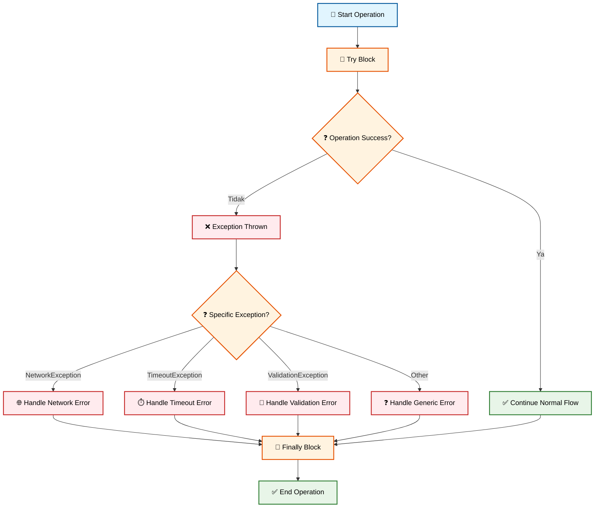

---

## 👨‍💻 Praktikum: BMI Calculator Indonesia

### 🎯 Project Overview

Kita akan membuat **BMI (Body Mass Index) Calculator** untuk mahasiswa Indonesia dengan fitur:

- ✅ **OOP Implementation** dengan classes dan inheritance
- ✅ **Input validation** dengan exception handling  
- ✅ **Collections** untuk menyimpan history perhitungan
- ✅ **Async operations** untuk simulasi save/load data
- ✅ **Indonesian context** dengan standar BMI Indonesia

### 📊 Standar BMI Indonesia

| Category | BMI Range | Status |
|----------|-----------|---------|
| **Kurus Tingkat Berat** | < 17.0 | ❌ Underweight |
| **Kurus Tingkat Ringan** | 17.0 - 18.4 | ⚠️ Underweight |
| **Normal** | 18.5 - 25.0 | ✅ Ideal |
| **Gemuk Tingkat Ringan** | 25.1 - 27.0 | ⚠️ Overweight |
| **Gemuk Tingkat Berat** | > 27.0 | ❌ Obese |

### 🏗️ Step 1: Membuat Class Structure

```dart
// File: bmi_calculator.dart

import 'dart:math';

// Base class untuk Person
class Person {
  String nama;
  int umur;
  String jenisKelamin;
  
  Person({
    required this.nama,
    required this.umur,
    required this.jenisKelamin,
  });
  
  void displayInfo() {
    print('Nama: $nama');
    print('Umur: $umur tahun');
    print('Jenis Kelamin: $jenisKelamin');
  }
}

// Child class untuk Mahasiswa
class Mahasiswa extends Person {
  String nim;
  String jurusan;
  String universitas;
  
  Mahasiswa({
    required String nama,
    required int umur, 
    required String jenisKelamin,
    required this.nim,
    required this.jurusan,
    required this.universitas,
  }) : super(nama: nama, umur: umur, jenisKelamin: jenisKelamin);
  
  @override
  void displayInfo() {
    super.displayInfo();
    print('NIM: $nim');
    print('Jurusan: $jurusan');
    print('Universitas: $universitas');
  }
}

// Custom Exceptions
class BMIException implements Exception {
  final String message;
  BMIException(this.message);
}

class ValidationException implements Exception {
  final String message;
  ValidationException(this.message);
}

// BMI Calculation Result
class BMIResult {
  final double bmi;
  final String category;
  final String status;
  final String recommendation;
  final DateTime timestamp;
  
  BMIResult({
    required this.bmi,
    required this.category,
    required this.status, 
    required this.recommendation,
    required this.timestamp,
  });
  
  Map<String, dynamic> toMap() {
    return {
      'bmi': bmi,
      'category': category,
      'status': status,
      'recommendation': recommendation,
      'timestamp': timestamp.toIso8601String(),
    };
  }
  
  @override
  String toString() {
    return 'BMI: ${bmi.toStringAsFixed(1)} - $category ($status)';
  }
}
```

**🔧 [Copy Code]** | **🌐 [Test di zapp.run](https://zapp.run/)**

#### Alur Class Structure BMI Calculator:

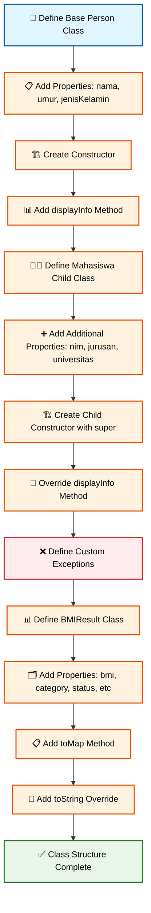

### 🧮 Step 2: BMI Calculator Logic

```dart
// BMI Calculator Class  
class BMICalculator {
  // History menggunakan List dan Map
  List<BMIResult> _history = [];
  Map<String, int> _categoryStats = {
    'Kurus Berat': 0,
    'Kurus Ringan': 0, 
    'Normal': 0,
    'Gemuk Ringan': 0,
    'Gemuk Berat': 0,
  };
  
  // Getters
  List<BMIResult> get history => _history;
  Map<String, int> get stats => _categoryStats;
  
  // Validasi input dengan exception handling
  void _validateInput(double tinggi, double berat) {
    if (tinggi <= 0) {
      throw ValidationException('Tinggi badan harus lebih dari 0 cm');
    }
    if (tinggi < 50 || tinggi > 250) {
      throw ValidationException('Tinggi badan tidak realistis (50-250 cm)');
    }
    if (berat <= 0) {
      throw ValidationException('Berat badan harus lebih dari 0 kg'); 
    }
    if (berat < 20 || berat > 300) {
      throw ValidationException('Berat badan tidak realistis (20-300 kg)');
    }
  }
  
  // Hitung BMI dengan standar Indonesia
  BMIResult calculateBMI(double tinggiBadan, double beratBadan) {
    try {
      // Validasi input
      _validateInput(tinggiBadan, beratBadan);
      
      // Convert tinggi ke meter
      double tinggiMeter = tinggiBadan / 100;
      
      // Hitung BMI
      double bmi = beratBadan / (tinggiMeter * tinggiMeter);
      
      // Tentukan kategori berdasarkan standar Indonesia
      String category;
      String status;
      String recommendation;
      
      if (bmi < 17.0) {
        category = 'Kurus Berat';
        status = 'Underweight Severe';
        recommendation = 'Konsultasi dokter dan tingkatkan asupan kalori sehat. Pertimbangkan olahraga penambah massa otot.';
      } else if (bmi < 18.5) {
        category = 'Kurus Ringan'; 
        status = 'Underweight';
        recommendation = 'Tingkatkan asupan nutrisi seimbang dan olahraga teratur untuk menambah massa otot.';
      } else if (bmi <= 25.0) {
        category = 'Normal';
        status = 'Ideal';
        recommendation = 'Pertahankan pola makan sehat dan olahraga teratur. Berat badan Anda ideal!';
      } else if (bmi <= 27.0) {
        category = 'Gemuk Ringan';
        status = 'Overweight'; 
        recommendation = 'Kurangi asupan kalori dan tingkatkan aktivitas fisik. Fokus pada makanan sehat.';
      } else {
        category = 'Gemuk Berat';
        status = 'Obese';
        recommendation = 'Konsultasi dokter untuk program penurunan berat badan. Diperlukan diet ketat dan olahraga intensif.';
      }
      
      // Buat result object
      BMIResult result = BMIResult(
        bmi: bmi,
        category: category,
        status: status,
        recommendation: recommendation, 
        timestamp: DateTime.now(),
      );
      
      // Simpan ke history
      _history.add(result);
      _categoryStats[category] = (_categoryStats[category] ?? 0) + 1;
      
      return result;
      
    } catch (e) {
      throw BMIException('Error saat menghitung BMI: $e');
    }
  }
  
  // Hitung BMI Ideal
  Map<String, double> calculateIdealWeight(double tinggiBadan, String jenisKelamin) {
    double tinggiMeter = tinggiBadan / 100;
    
    // Formula Broca (dimodifikasi untuk Asia)
    double brocaMale = (tinggiBadan - 100) - ((tinggiBadan - 100) * 0.1);
    double brocaFemale = (tinggiBadan - 100) - ((tinggiBadan - 100) * 0.15);
    
    // Formula BMI (18.5 - 25.0)
    double minIdeal = 18.5 * tinggiMeter * tinggiMeter;
    double maxIdeal = 25.0 * tinggiMeter * tinggiMeter;
    
    return {
      'minIdeal': minIdeal,
      'maxIdeal': maxIdeal,
      'broca': jenisKelamin.toLowerCase() == 'laki-laki' ? brocaMale : brocaFemale,
    };
  }
  
  // Statistik BMI
  void displayStatistics() {
    if (_history.isEmpty) {
      print('❌ Belum ada data perhitungan BMI');
      return;
    }
    
    print('\n📊 ===== STATISTIK BMI =====');
    print('Total Perhitungan: ${_history.length}');
    
    // Distribusi kategori
    print('\n📈 Distribusi Kategori:');
    _categoryStats.forEach((category, count) {
      if (count > 0) {
        double percentage = (count / _history.length) * 100;
        print('  $category: $count (${percentage.toStringAsFixed(1)}%)');
      }
    });
    
    // BMI rata-rata
    double avgBMI = _history.map((r) => r.bmi).reduce((a, b) => a + b) / _history.length;
    print('\n📊 BMI Rata-rata: ${avgBMI.toStringAsFixed(2)}');
    
    // BMI tertinggi dan terendah
    double maxBMI = _history.map((r) => r.bmi).reduce((a, b) => a > b ? a : b);
    double minBMI = _history.map((r) => r.bmi).reduce((a, b) => a < b ? a : b);
    
    print('📈 BMI Tertinggi: ${maxBMI.toStringAsFixed(1)}');
    print('📉 BMI Terendah: ${minBMI.toStringAsFixed(1)}');
  }
  
  // History BMI
  void displayHistory() {
    if (_history.isEmpty) {
      print('❌ Belum ada riwayat perhitungan BMI');
      return;
    }
    
    print('\n📋 ===== RIWAYAT BMI =====');
    for (int i = 0; i < _history.length; i++) {
      BMIResult result = _history[i];
      print('${i + 1}. ${result.toString()} - ${result.timestamp.day}/${result.timestamp.month}/${result.timestamp.year}');
    }
  }
  
  // Clear history
  void clearHistory() {
    _history.clear();
    _categoryStats = {
      'Kurus Berat': 0,
      'Kurus Ringan': 0,
      'Normal': 0, 
      'Gemuk Ringan': 0,
      'Gemuk Berat': 0,
    };
    print('✅ Riwayat BMI berhasil dihapus');
  }
}
```

**🔧 [Copy Code]** | **🌐 [Test di zapp.run](https://zapp.run/)**

#### Alur BMI Calculation Logic:

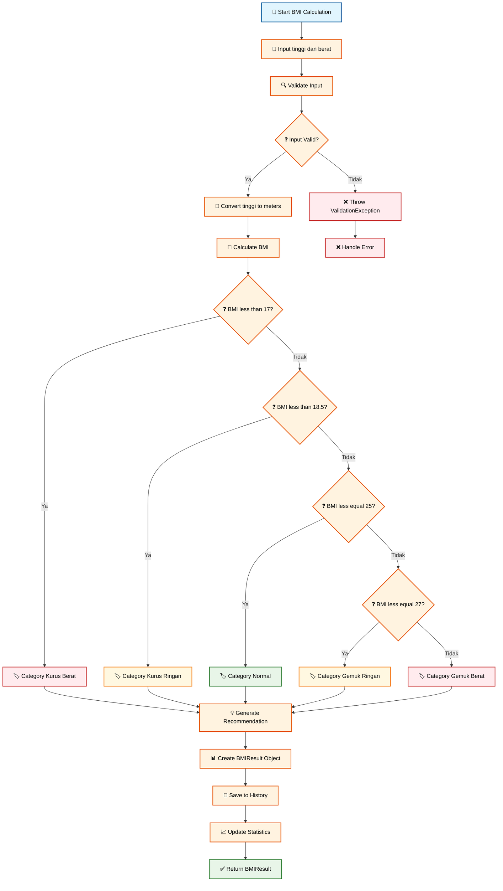

### 💾 Step 3: Async Data Operations

```dart
// Data Manager untuk operasi async
class BMIDataManager {
  static const String _fileName = 'bmi_data.json';
  
  // Simulasi save data ke file (async)
  static Future<void> saveData(List<BMIResult> history) async {
    try {
      print('💾 Menyimpan data BMI...');
      
      // Simulasi network delay
      await Future.delayed(Duration(seconds: 2));
      
      // Convert ke JSON format
      List<Map<String, dynamic>> jsonData = history.map((result) => result.toMap()).toList();
      
      print('✅ Data BMI berhasil disimpan!');
      print('   File: $_fileName');
      print('   Records: ${jsonData.length}');
      
    } catch (e) {
      throw BMIException('Gagal menyimpan data: $e');
    }
  }
  
  // Simulasi load data dari file (async)
  static Future<List<BMIResult>> loadData() async {
    try {
      print('📥 Memuat data BMI...');
      
      // Simulasi network delay
      await Future.delayed(Duration(seconds: 1));
      
      // Simulasi data (dalam implementasi nyata, baca dari file/database)
      List<Map<String, dynamic>> sampleData = [
        {
          'bmi': 22.5,
          'category': 'Normal',
          'status': 'Ideal',
          'recommendation': 'Pertahankan pola makan sehat dan olahraga teratur.',
          'timestamp': DateTime.now().subtract(Duration(days: 7)).toIso8601String(),
        },
        {
          'bmi': 26.8, 
          'category': 'Gemuk Ringan',
          'status': 'Overweight',
          'recommendation': 'Kurangi asupan kalori dan tingkatkan aktivitas fisik.',
          'timestamp': DateTime.now().subtract(Duration(days: 3)).toIso8601String(),
        }
      ];
      
      List<BMIResult> results = sampleData.map((data) => BMIResult(
        bmi: data['bmi'],
        category: data['category'],
        status: data['status'],
        recommendation: data['recommendation'],
        timestamp: DateTime.parse(data['timestamp']),
      )).toList();
      
      print('✅ Data BMI berhasil dimuat!');
      print('   Records: ${results.length}');
      
      return results;
      
    } catch (e) {
      throw BMIException('Gagal memuat data: $e');
    }
  }
  
  // Backup data to cloud (simulasi)
  static Future<void> backupToCloud(List<BMIResult> history) async {
    try {
      print('☁️ Backup data ke cloud...');
      
      // Simulasi upload delay
      await Future.delayed(Duration(seconds: 3));
      
      // Random success/failure untuk demo error handling
      Random random = Random();
      if (random.nextBool()) {
        throw BMIException('Network timeout saat backup');
      }
      
      print('✅ Backup berhasil!');
      print('   Cloud storage: ${history.length} records');
      
    } catch (e) {
      rethrow; // Re-throw untuk handling di level atas
    }
  }
}
```

**🔧 [Copy Code]** | **🌐 [Test di zapp.run](https://zapp.run/)**

#### Alur Async Data Operations:

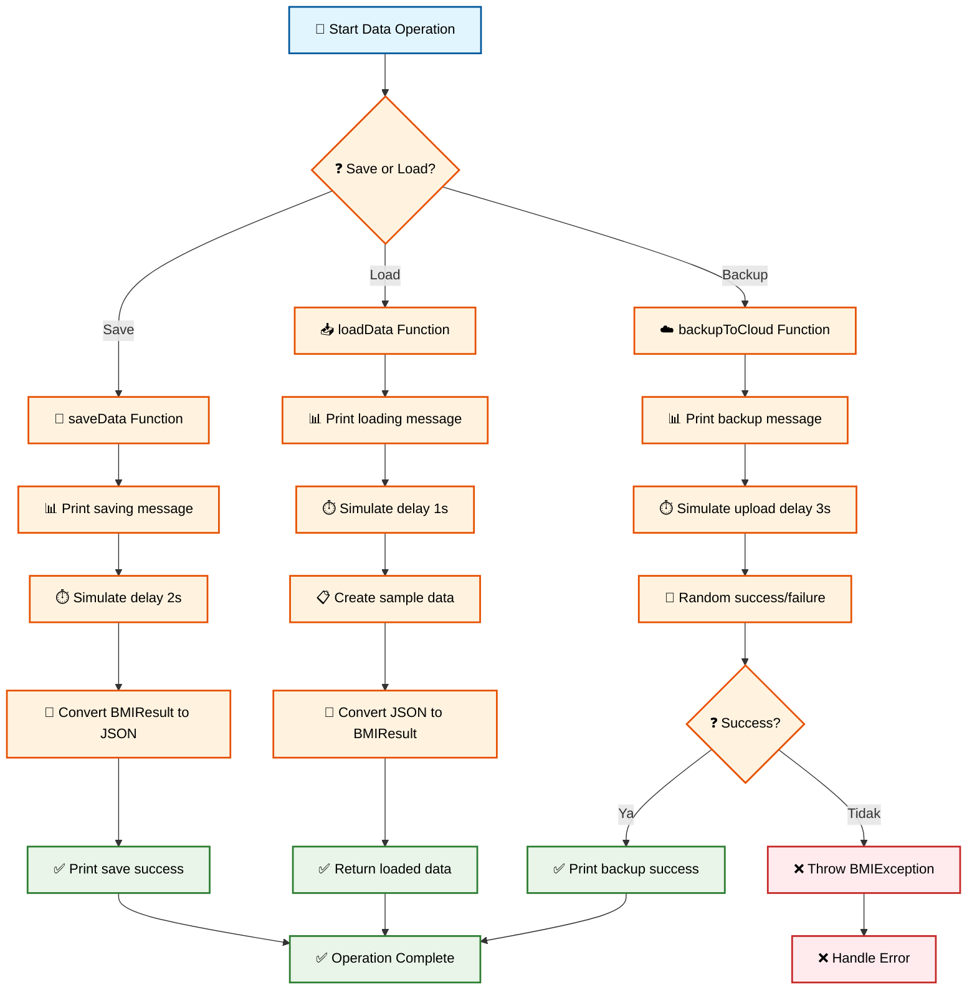

### 🚀 Step 4: Main Application

```dart
void main() async {
  print('🏥 ===== BMI CALCULATOR INDONESIA =====');
  print('📱 Aplikasi Kesehatan untuk Mahasiswa Indonesia\n');
  
  // Inisialisasi
  BMICalculator calculator = BMICalculator();
  
  // Data mahasiswa sample
  List<Mahasiswa> mahasiswaList = [
    Mahasiswa(
      nama: 'Siti Nurhaliza',
      umur: 20,
      jenisKelamin: 'Perempuan',
      nim: '2021001', 
      jurusan: 'Teknik Informatika',
      universitas: 'Universitas Indonesia',
    ),
    Mahasiswa(
      nama: 'Budi Santoso',
      umur: 22,
      jenisKelamin: 'Laki-laki',
      nim: '2021002',
      jurusan: 'Sistem Informasi', 
      universitas: 'ITB',
    ),
    Mahasiswa(
      nama: 'Dewi Sartika',
      umur: 21,
      jenisKelamin: 'Perempuan',
      nim: '2021003',
      jurusan: 'Kedokteran',
      universitas: 'UNPAD',
    )
  ];
  
  // Data tinggi dan berat (dalam cm dan kg)
  List<Map<String, double>> physicalData = [
    {'tinggi': 165.0, 'berat': 55.0}, // Normal
    {'tinggi': 175.0, 'berat': 85.0}, // Gemuk Ringan
    {'tinggi': 160.0, 'berat': 45.0}, // Kurus Ringan
  ];
  
  // Test BMI calculation untuk setiap mahasiswa
  await testBMICalculations(calculator, mahasiswaList, physicalData);
  
  // Test data operations
  await testDataOperations(calculator);
  
  // Test error handling
  await testErrorHandling(calculator);
  
  print('\n🎉 Demo BMI Calculator selesai!');
}

Future<void> testBMICalculations(BMICalculator calculator, List<Mahasiswa> mahasiswaList, List<Map<String, double>> physicalData) async {
  print('🧮 ===== TEST BMI CALCULATIONS =====\n');
  
  for (int i = 0; i < mahasiswaList.length; i++) {
    Mahasiswa mhs = mahasiswaList[i];
    Map<String, double> data = physicalData[i];
    
    print('👤 ===== MAHASISWA ${i + 1} =====');
    mhs.displayInfo();
    print('Tinggi: ${data['tinggi']} cm');
    print('Berat: ${data['berat']} kg\n');
    
    try {
      // Hitung BMI
      BMIResult result = calculator.calculateBMI(data['tinggi']!, data['berat']!);
      
      print('📊 HASIL BMI:');
      print('   BMI: ${result.bmi.toStringAsFixed(2)}');
      print('   Kategori: ${result.category}');
      print('   Status: ${result.status}');
      print('   Rekomendasi: ${result.recommendation}');
      
      // Hitung berat ideal
      Map<String, double> idealWeight = calculator.calculateIdealWeight(data['tinggi']!, mhs.jenisKelamin);
      print('\n💡 BERAT IDEAL:');
      print('   Range BMI: ${idealWeight['minIdeal']!.toStringAsFixed(1)} - ${idealWeight['maxIdeal']!.toStringAsFixed(1)} kg');
      print('   Formula Broca: ${idealWeight['broca']!.toStringAsFixed(1)} kg');
      
      // Status emoji
      String emoji = result.category == 'Normal' ? '✅' : 
                    result.category.contains('Kurus') ? '⚠️' : 
                    result.category.contains('Gemuk') ? '❌' : '❓';
      print('\n$emoji Status: ${result.status}\n');
      
      // Delay untuk readability
      await Future.delayed(Duration(milliseconds: 500));
      
    } catch (e) {
      print('❌ Error: $e\n');
    }
    
    print('${'=' * 50}\n');
  }
}

Future<void> testDataOperations(BMICalculator calculator) async {
  print('💾 ===== TEST DATA OPERATIONS =====\n');
  
  try {
    // Display current statistics
    calculator.displayStatistics();
    
    // Display history
    calculator.displayHistory();
    
    // Test save data
    print('\n💾 Testing Save Operation...');
    await BMIDataManager.saveData(calculator.history);
    
    // Test load data
    print('\n📥 Testing Load Operation...');
    List<BMIResult> loadedData = await BMIDataManager.loadData();
    print('📋 Loaded ${loadedData.length} historical records');
    
    // Test backup with error handling
    print('\n☁️ Testing Cloud Backup...');
    try {
      await BMIDataManager.backupToCloud(calculator.history);
    } catch (e) {
      print('❌ Backup failed: $e');
      print('💡 Data tetap tersimpan local, akan retry nanti');
    }
    
  } catch (e) {
    print('❌ Data operation error: $e');
  }
  
  print('\n${'=' * 50}\n');
}

Future<void> testErrorHandling(BMICalculator calculator) async {
  print('🛡️ ===== TEST ERROR HANDLING =====\n');
  
  // Test cases dengan error
  List<Map<String, dynamic>> errorCases = [
    {'tinggi': -10.0, 'berat': 70.0, 'desc': 'Tinggi negatif'},
    {'tinggi': 175.0, 'berat': 0.0, 'desc': 'Berat nol'},
    {'tinggi': 300.0, 'berat': 50.0, 'desc': 'Tinggi tidak realistis'},  
    {'tinggi': 160.0, 'berat': 500.0, 'desc': 'Berat tidak realistis'},
  ];
  
  for (Map<String, dynamic> testCase in errorCases) {
    print('🧪 Test Case: ${testCase['desc']}');
    print('   Input: Tinggi=${testCase['tinggi']}cm, Berat=${testCase['berat']}kg');
    
    try {
      BMIResult result = calculator.calculateBMI(testCase['tinggi'], testCase['berat']);
      print('   Hasil: BMI = ${result.bmi.toStringAsFixed(2)}');
    } catch (e) {
      print('   ❌ Error (Expected): $e');
    }
    
    print('');
  }
  
  print('✅ Error handling test selesai!\n');
  print('${'=' * 50}');
}
```

**🔧 [Copy Code]** | **🌐 [Test di zapp.run](https://zapp.run/)**

#### Alur Complete BMI Calculator:

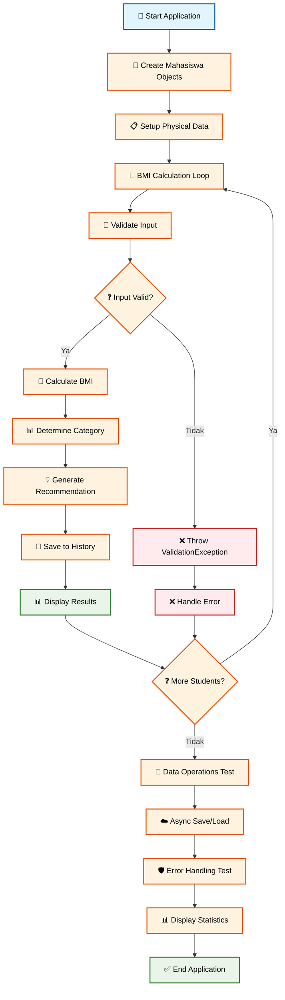

---

## 📝 Assessment & Quiz

### ✅ Coding Assignment - OOP Implementation (15%)

**Task**: Implementasi class hierarchy untuk sistem perpustakaan mahasiswa

**Requirements:**
1. Buat base class `Item` dengan properties: title, author, year
2. Buat child classes `Book`, `Journal`, `Thesis` yang extends Item  
3. Implementasi methods yang di-override untuk setiap child class
4. Gunakan collections untuk menyimpan daftar items
5. Implementasi error handling untuk invalid operations

**Submission**: Upload code ke GitHub dengan dokumentasi README.md

### 🧠 Quiz Dart OOP & Collections (10%)

#### **Soal 1 (25 poin)**
Apa output dari code Dart berikut?

```dart
class Mahasiswa {
  String nama;
  double ipk;
  
  Mahasiswa(this.nama, this.ipk);
  
  String getPredikat() {
    return ipk >= 3.5 ? 'Cumlaude' : 'Biasa';
  }
}

void main() {
  List<Mahasiswa> mhsList = [
    Mahasiswa('Siti', 3.8),
    Mahasiswa('Budi', 3.2),
  ];
  
  for (var mhs in mhsList) {
    print('${mhs.nama}: ${mhs.getPredikat()}');
  }
}
```

**A.**
```
Siti: Cumlaude
Budi: Biasa
```

**B.**
```
Siti: Biasa
Budi: Cumlaude
```

**C.** Error compilation

**Jawaban:** A ✅

#### **Soal 2 (25 poin)**
Manakah yang BENAR tentang Collections dalam Dart?

**A.** List boleh duplikat, Set tidak boleh duplikat, Map adalah key-value pairs
**B.** List tidak boleh duplikat, Set boleh duplikat, Map hanya untuk String
**C.** Semua Collections tidak boleh duplikat

**Jawaban:** A ✅

#### **Soal 3 (25 poin)**
Lengkapi code async function berikut:

```dart
Future<String> downloadData() _____ {
  _____ Future.delayed(Duration(seconds: 2));
  _____ 'Data downloaded successfully';
}
```

**Jawaban:** `async`, `await`, `return` ✅

#### **Soal 4 (25 poin)**
Apa kegunaan `try-catch-finally` dalam Dart?

**A.** Hanya untuk menangkap syntax error  
**B.** Untuk menangani runtime exceptions dan cleanup resources
**C.** Untuk mempercepat execution program
**D.** Hanya untuk async operations

**Jawaban:** B ✅

---

## 📖 Daftar Istilah

| Istilah | Singkatan | Pengertian |
|---------|-----------|-------------|
| **OOP** | Object-Oriented Programming | Paradigma programming menggunakan objek dan class |
| **Class** | - | Template/blueprint untuk membuat objek |
| **Object** | - | Instance dari class yang memiliki properties dan methods |
| **Inheritance** | - | Pewarisan properties dan methods dari parent class |
| **Polymorphism** | - | Kemampuan objek untuk memiliki banyak bentuk |
| **Encapsulation** | - | Pembungkusan data dan methods dalam class |
| **Constructor** | - | Method khusus untuk inisialisasi objek |
| **Override** | - | Mengganti implementasi method dari parent class |
| **Abstract** | - | Class/method yang tidak bisa diinstansiasi langsung |
| **Collection** | - | Kumpulan data dalam satu struktur (List, Map, Set) |
| **List** | - | Collection berurutan yang boleh duplikat |
| **Map** | - | Collection key-value pairs |
| **Set** | - | Collection unique elements tanpa duplikat |
| **Future** | - | Object yang merepresentasikan nilai async |
| **Async** | - | Keyword untuk function yang menjalankan operasi asynchronous |
| **Await** | - | Keyword untuk menunggu hasil Future |
| **Exception** | - | Error yang terjadi saat runtime |
| **Try-Catch** | - | Blok untuk menangani exceptions |
| **BMI** | Body Mass Index | Indeks massa tubuh untuk menilai status gizi |
| **Getter/Setter** | - | Method untuk akses dan modifikasi private properties |

---

## 📚 Referensi

### 📖 Sumber Utama

1. **Dart Language Tour**. (2025). *A tour of the Dart language*. Google LLC. https://dart.dev/guides/language/language-tour

2. **Freeman, E., Robson, E., Bates, B., & Sierra, K.** (2024). *Head First Design Patterns: Building Extensible and Maintainable Object-Oriented Software*. 2nd Edition. O'Reilly Media.

3. **Duckett, J.** (2024). *Object-Oriented Programming with Dart*. Wiley Publications.

### 🇮🇩 Sumber Indonesia

4. **Koding Indonesia**. (2025). *Tutorial Dart OOP Bahasa Indonesia Lengkap*. https://kodingindonesia.com/tutorial-dart-oop-bahasa-indonesia/

5. **Dicoding Indonesia**. (2024). *Memulai Pemrograman dengan Dart*. https://www.dicoding.com/academies/191

6. **BuildWithAngga**. (2024). *Dart Programming untuk Flutter Developer*. https://buildwithangga.com/kelas/dart-programming-flutter-developer

### 📊 Sumber Akademik

7. **Lanza, M., Marinescu, R., & Ducasse, S.** (2006). *Object-Oriented Metrics in Practice: Using Software Metrics to Characterize, Evaluate, and Improve the Design of Object-Oriented Systems*. Springer-Verlag.

8. **Martin, R. C.** (2017). *Clean Architecture: A Craftsman's Guide to Software Structure and Design*. Prentice Hall.

### 🛠️ Tools dan Resources

9. **DartPad Online Editor**. (2025). *Try Dart in your browser*. https://dartpad.dev

10. **VS Code Dart Extension**. (2025). *Dart - Visual Studio Marketplace*. https://marketplace.visualstudio.com/items?itemName=Dart-Code.dart-code

### 📱 BMI dan Kesehatan

11. **Kementerian Kesehatan RI**. (2024). *Pedoman Gizi Seimbang*. Jakarta: Direktorat Gizi Masyarakat.

12. **WHO Expert Committee**. (2004). *Appropriate body-mass index for Asian populations and its implications*. World Health Organization. https://apps.who.int/iris/handle/10665/206936

---

## 🎯 Next Week Preview

**Pertemuan 3: Flutter Widget System dan Layout**
- ✅ Widget Tree dan State Management Basics
- ✅ Layout Widgets: Container, Row, Column, Stack
- ✅ Material Design Components
- ✅ Project: Kartu Nama Digital Indonesia

---

## 💡 Tips Sukses

1. **🏗️ Practice OOP Daily**: Buat class sederhana setiap hari
2. **📚 Explore Collections**: Gunakan List, Map, Set dalam project real
3. **⚡ Master Async**: Pahami Future dan async-await dengan baik
4. **🛡️ Always Handle Errors**: Biasakan try-catch di semua operations
5. **🧪 Test Your Code**: Buat test cases untuk setiap function yang Anda buat

---

**🎉 Selamat! Anda telah menguasai Dart Programming dan OOP!**

Lanjutkan ke **Pertemuan 3** untuk mempelajari Flutter Widget System! 🚀

---

*© 2025 Mata Kuliah Pemrograman Piranti Bergerak dengan Flutter*  
*Dibuat dengan ❤️ untuk mahasiswa Indonesia*
