# 🎨 Pertemuan 3: Flutter Widget System dan Layout


---

## 📋 Daftar Isi

1. [🎯 Learning Objectives](#-learning-objectives)
2. [🏗️ Flutter Widget System](#️-flutter-widget-system)
3. [📐 Layout Widgets Fundamental](#-layout-widgets-fundamental)
4. [🎨 Material Design Components](#-material-design-components)
5. [📱 Responsive Design Basics](#-responsive-design-basics)
6. [👨‍💻 Praktikum: Kartu Nama Digital Indonesia](#-praktikum-kartu-nama-digital-indonesia)
7. [📝 Assessment & Quiz](#-assessment--quiz)
8. [📖 Daftar Istilah](#-daftar-istilah)
9. [📚 Referensi](#-referensi)

---

## 🎯 Learning Objectives

Setelah menyelesaikan pertemuan ini, mahasiswa diharapkan mampu:

- ✅ **Memahami Widget Tree**: Konsep dasar widget tree dan StatelessWidget vs StatefulWidget
- ✅ **Menguasai Layout Widgets**: Container, Row, Column, Stack untuk susun layout
- ✅ **Implementasi Material Design**: AppBar, Scaffold, Button, Card dengan styling sederhana
- ✅ **Responsive Layout**: MediaQuery untuk layout yang adaptif
- ✅ **Build Project**: Membuat Kartu Nama Digital sederhana namun professional

---

## 🏗️ Flutter Widget System

### 🤔 Apa itu Widget?

**Widget** adalah building block dari UI Flutter. Semua yang terlihat di screen adalah widget!

### ⚖️ StatelessWidget vs StatefulWidget

```dart
import 'package:flutter/material.dart';

void main() {
  runApp(MyApp());
}

class MyApp extends StatelessWidget {
  @override
  Widget build(BuildContext context) {
    return MaterialApp(
      title: 'Widget Demo',
      home: HomePage(),
    );
  }
}

class HomePage extends StatelessWidget {
  @override
  Widget build(BuildContext context) {
    return Scaffold(
      appBar: AppBar(
        title: Text('Widget System Demo'),
        backgroundColor: Colors.blue,
        foregroundColor: Colors.white,
      ),
      body: Column(
        children: [
          // StatelessWidget Example
          PapanNamaWidget(),
          SizedBox(height: 20),
          // StatefulWidget Example
          CounterWidget(),
        ],
      ),
    );
  }
}

// StatelessWidget - tidak berubah
class PapanNamaWidget extends StatelessWidget {
  @override
  Widget build(BuildContext context) {
    return Container(
      margin: EdgeInsets.all(16),
      padding: EdgeInsets.all(16),
      decoration: BoxDecoration(
        color: Colors.blue[50],
        border: Border.all(color: Colors.blue),
        borderRadius: BorderRadius.circular(8),
      ),
      child: Column(
        children: [
          Icon(Icons.store, size: 40, color: Colors.blue),
          SizedBox(height: 8),
          Text(
            'Warung Makan Sederhana',
            style: TextStyle(fontSize: 16, fontWeight: FontWeight.bold),
          ),
          Text('StatelessWidget - Tidak berubah'),
        ],
      ),
    );
  }
}

// StatefulWidget - bisa berubah
class CounterWidget extends StatefulWidget {
  @override
  _CounterWidgetState createState() => _CounterWidgetState();
}

class _CounterWidgetState extends State<CounterWidget> {
  int counter = 0;

  @override
  Widget build(BuildContext context) {
    return Container(
      margin: EdgeInsets.all(16),
      padding: EdgeInsets.all(16),
      decoration: BoxDecoration(
        color: Colors.green[50],
        border: Border.all(color: Colors.green),
        borderRadius: BorderRadius.circular(8),
      ),
      child: Column(
        children: [
          Text(
            'Counter: $counter',
            style: TextStyle(fontSize: 20, fontWeight: FontWeight.bold),
          ),
          SizedBox(height: 10),
          ElevatedButton(
            onPressed: () {
              setState(() {
                counter++;
              });
            },
            child: Text('Tambah'),
          ),
          Text('StatefulWidget - Bisa berubah'),
        ],
      ),
    );
  }
}
```

**🔧 [Copy Code]** | **🚀 Coba Sekarang!** 
Silakan copy code di atas dan coba jalankan di: **[https://zapp.run/](https://zapp.run/)**

#### Widget System Flow:

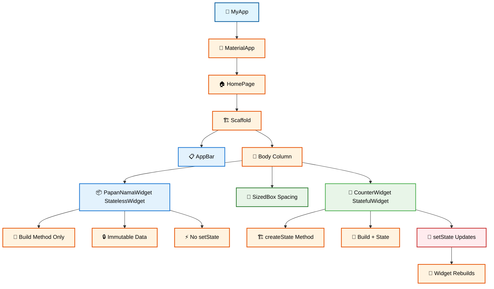

---

## 📐 Layout Widgets Fundamental

### 📦 1. Container - Widget Dasar untuk Styling

```dart
import 'package:flutter/material.dart';

void main() {
  runApp(ContainerDemo());
}

class ContainerDemo extends StatelessWidget {
  @override
  Widget build(BuildContext context) {
    return MaterialApp(
      home: Scaffold(
        appBar: AppBar(
          title: Text('Container Demo'),
          backgroundColor: Colors.blue,
          foregroundColor: Colors.white,
        ),
        body: Padding(
          padding: EdgeInsets.all(16),
          child: Column(
            children: [
              // Container Basic
              Container(
                width: 200,
                height: 100,
                color: Colors.red,
                child: Center(
                  child: Text(
                    'Container Basic',
                    style: TextStyle(color: Colors.white, fontSize: 16),
                  ),
                ),
              ),
              
              SizedBox(height: 16),
              
              // Container dengan Decoration
              Container(
                width: 200,
                height: 100,
                decoration: BoxDecoration(
                  color: Colors.blue,
                  borderRadius: BorderRadius.circular(10),
                  border: Border.all(color: Colors.black, width: 2),
                ),
                child: Center(
                  child: Text(
                    'Dengan Border',
                    style: TextStyle(color: Colors.white, fontSize: 16),
                  ),
                ),
              ),
              
              SizedBox(height: 16),
              
              // Container dengan Padding dan Margin
              Container(
                margin: EdgeInsets.all(10),
                padding: EdgeInsets.all(20),
                decoration: BoxDecoration(
                  color: Colors.green,
                  borderRadius: BorderRadius.circular(10),
                ),
                child: Text(
                  'Padding & Margin',
                  style: TextStyle(color: Colors.white, fontSize: 16),
                ),
              ),
            ],
          ),
        ),
      ),
    );
  }
}
```

**🔧 [Copy Code]** | **🚀 Coba Sekarang!** 
Silakan copy code di atas dan coba jalankan di: **[https://zapp.run/](https://zapp.run/)**

#### Container Demo Flow:

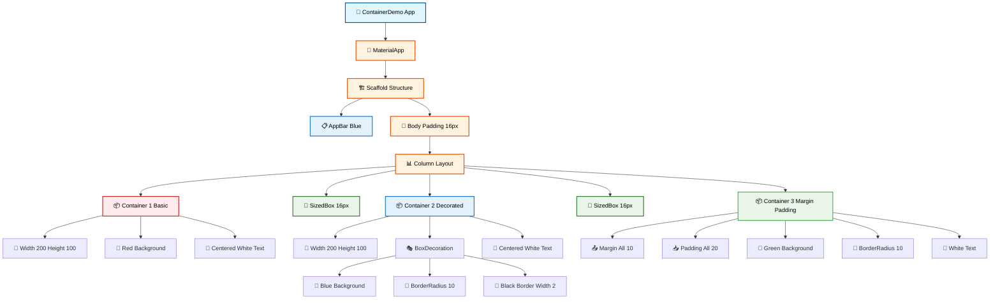

#### Container Properties Flow:

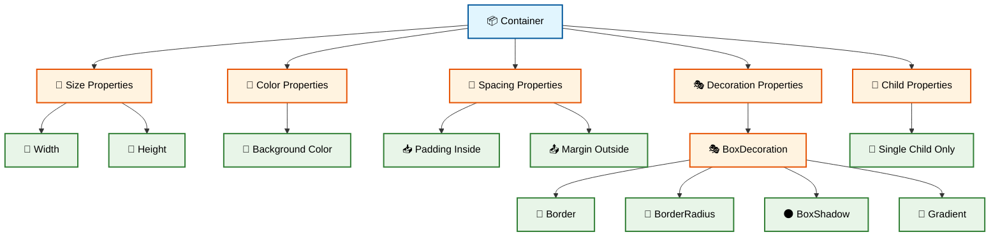

### ↔️ 2. Row - Layout Horizontal

```dart
import 'package:flutter/material.dart';

void main() {
  runApp(RowDemo());
}

class RowDemo extends StatelessWidget {
  @override
  Widget build(BuildContext context) {
    return MaterialApp(
      home: Scaffold(
        appBar: AppBar(
          title: Text('Row Demo'),
          backgroundColor: Colors.green,
          foregroundColor: Colors.white,
        ),
        body: Padding(
          padding: EdgeInsets.all(16),
          child: Column(
            children: [
              // Row Basic
              Text('Row Basic:', style: TextStyle(fontSize: 16, fontWeight: FontWeight.bold)),
              Container(
                height: 60,
                color: Colors.grey[200],
                child: Row(
                  children: [
                    Container(width: 50, height: 50, color: Colors.red),
                    Container(width: 50, height: 50, color: Colors.green),
                    Container(width: 50, height: 50, color: Colors.blue),
                  ],
                ),
              ),
              
              SizedBox(height: 20),
              
              // Row dengan MainAxisAlignment
              Text('Row dengan Spacing:', style: TextStyle(fontSize: 16, fontWeight: FontWeight.bold)),
              Container(
                height: 60,
                color: Colors.grey[200],
                child: Row(
                  mainAxisAlignment: MainAxisAlignment.spaceEvenly,
                  children: [
                    Container(width: 50, height: 50, color: Colors.red),
                    Container(width: 50, height: 50, color: Colors.green),
                    Container(width: 50, height: 50, color: Colors.blue),
                  ],
                ),
              ),
              
              SizedBox(height: 20),
              
              // Row dengan Expanded
              Text('Row dengan Expanded:', style: TextStyle(fontSize: 16, fontWeight: FontWeight.bold)),
              Container(
                height: 60,
                color: Colors.grey[200],
                child: Row(
                  children: [
                    Expanded(child: Container(height: 50, color: Colors.red)),
                    Expanded(child: Container(height: 50, color: Colors.green)),
                    Expanded(child: Container(height: 50, color: Colors.blue)),
                  ],
                ),
              ),
            ],
          ),
        ),
      ),
    );
  }
}
```

**🔧 [Copy Code]** | **🚀 Coba Sekarang!** 
Silakan copy code di atas dan coba jalankan di: **[https://zapp.run/](https://zapp.run/)**

#### Row Demo Flow:

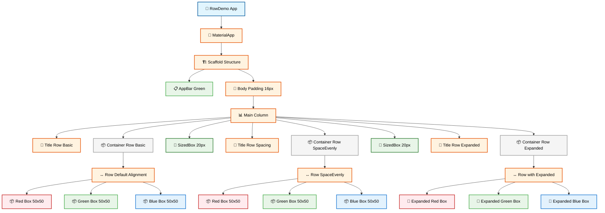

#### Row Layout Properties Flow:

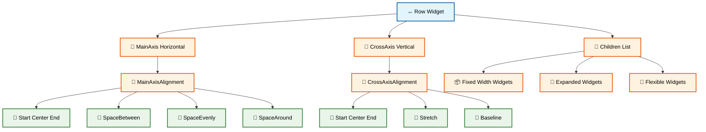

### ↕️ 3. Column - Layout Vertical

```dart
import 'package:flutter/material.dart';

void main() {
  runApp(ColumnDemo());
}

class ColumnDemo extends StatelessWidget {
  @override
  Widget build(BuildContext context) {
    return MaterialApp(
      home: Scaffold(
        appBar: AppBar(
          title: Text('Column Demo'),
          backgroundColor: Colors.purple,
          foregroundColor: Colors.white,
        ),
        body: Padding(
          padding: EdgeInsets.all(16),
          child: Row(
            children: [
              // Column Basic
              Expanded(
                child: Column(
                  children: [
                    Text('Column Basic:', style: TextStyle(fontWeight: FontWeight.bold)),
                    SizedBox(height: 10),
                    Container(
                      width: 100,
                      color: Colors.grey[200],
                      child: Column(
                        children: [
                          Container(width: 80, height: 40, color: Colors.red),
                          Container(width: 80, height: 40, color: Colors.green),
                          Container(width: 80, height: 40, color: Colors.blue),
                        ],
                      ),
                    ),
                  ],
                ),
              ),
              
              SizedBox(width: 20),
              
              // Column dengan Spacing
              Expanded(
                child: Column(
                  children: [
                    Text('Column Spaced:', style: TextStyle(fontWeight: FontWeight.bold)),
                    SizedBox(height: 10),
                    Container(
                      width: 100,
                      height: 150,
                      color: Colors.grey[200],
                      child: Column(
                        mainAxisAlignment: MainAxisAlignment.spaceEvenly,
                        children: [
                          Container(width: 80, height: 30, color: Colors.red),
                          Container(width: 80, height: 30, color: Colors.green),
                          Container(width: 80, height: 30, color: Colors.blue),
                        ],
                      ),
                    ),
                  ],
                ),
              ),
            ],
          ),
        ),
      ),
    );
  }
}
```

**🔧 [Copy Code]** | **🚀 Coba Sekarang!** 
Silakan copy code di atas dan coba jalankan di: **[https://zapp.run/](https://zapp.run/)**

#### Column Demo Flow:

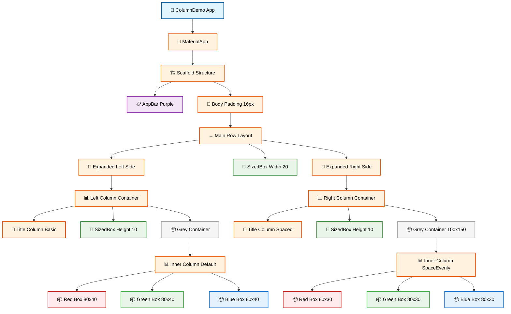

### 📚 4. Stack - Layout Bertumpuk

```dart
import 'package:flutter/material.dart';

void main() {
  runApp(StackDemo());
}

class StackDemo extends StatelessWidget {
  @override
  Widget build(BuildContext context) {
    return MaterialApp(
      home: Scaffold(
        appBar: AppBar(
          title: Text('Stack Demo'),
          backgroundColor: Colors.orange,
          foregroundColor: Colors.white,
        ),
        body: Padding(
          padding: EdgeInsets.all(16),
          child: Column(
            children: [
              Text('Stack Basic:', style: TextStyle(fontSize: 16, fontWeight: FontWeight.bold)),
              SizedBox(height: 10),
              
              // Stack dengan Positioned
              Container(
                width: 200,
                height: 200,
                color: Colors.grey[200],
                child: Stack(
                  children: [
                    // Background
                    Container(
                      width: 150,
                      height: 150,
                      color: Colors.blue,
                    ),
                    // Positioned widget
                    Positioned(
                      top: 20,
                      right: 20,
                      child: Container(
                        width: 60,
                        height: 60,
                        color: Colors.red,
                        child: Center(
                          child: Text('Top', style: TextStyle(color: Colors.white)),
                        ),
                      ),
                    ),
                    // Another positioned widget
                    Positioned(
                      bottom: 20,
                      left: 20,
                      child: Container(
                        width: 60,
                        height: 60,
                        color: Colors.green,
                        child: Center(
                          child: Text('Bottom', style: TextStyle(color: Colors.white)),
                        ),
                      ),
                    ),
                  ],
                ),
              ),
              
              SizedBox(height: 20),
              
              Text('Stack untuk Badge:', style: TextStyle(fontSize: 16, fontWeight: FontWeight.bold)),
              SizedBox(height: 10),
              
              // Stack untuk badge notification
              Stack(
                children: [
                  Icon(Icons.notifications, size: 40, color: Colors.blue),
                  Positioned(
                    top: 0,
                    right: 0,
                    child: Container(
                      width: 16,
                      height: 16,
                      decoration: BoxDecoration(
                        color: Colors.red,
                        shape: BoxShape.circle,
                      ),
                      child: Center(
                        child: Text(
                          '3',
                          style: TextStyle(color: Colors.white, fontSize: 10),
                        ),
                      ),
                    ),
                  ),
                ],
              ),
            ],
          ),
        ),
      ),
    );
  }
}
```

**🔧 [Copy Code]** | **🚀 Coba Sekarang!** 
Silakan copy code di atas dan coba jalankan di: **[https://zapp.run/](https://zapp.run/)**

#### Stack Demo Flow:

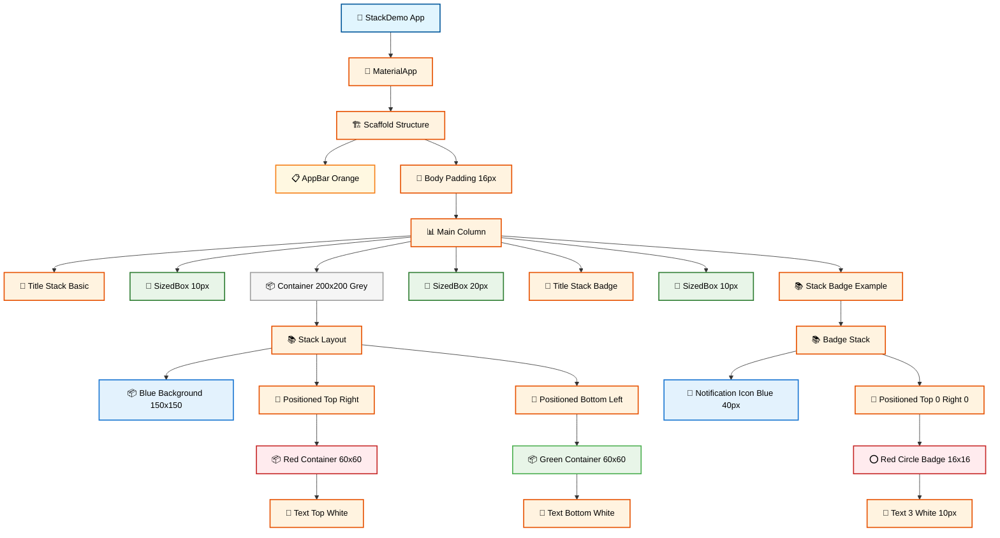

#### Stack Layout Properties Flow:

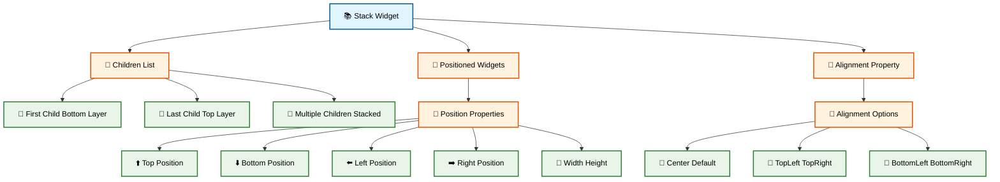

---

## 🎨 Material Design Components

### 📱 1. Scaffold dan AppBar

```dart
import 'package:flutter/material.dart';

void main() {
  runApp(MaterialDemo());
}

class MaterialDemo extends StatelessWidget {
  @override
  Widget build(BuildContext context) {
    return MaterialApp(
      title: 'Material Demo',
      home: HomePage(),
    );
  }
}

class HomePage extends StatelessWidget {
  @override
  Widget build(BuildContext context) {
    return Scaffold(
      // AppBar
      appBar: AppBar(
        title: Text('Material Design Demo'),
        backgroundColor: Colors.blue,
        foregroundColor: Colors.white,
        actions: [
          IconButton(
            icon: Icon(Icons.search),
            onPressed: () {},
          ),
          IconButton(
            icon: Icon(Icons.more_vert),
            onPressed: () {},
          ),
        ],
      ),
      
      // Body
      body: Padding(
        padding: EdgeInsets.all(16),
        child: Column(
          crossAxisAlignment: CrossAxisAlignment.stretch,
          children: [
            // Card
            Card(
              elevation: 4,
              child: Padding(
                padding: EdgeInsets.all(16),
                child: Column(
                  children: [
                    Icon(Icons.account_circle, size: 60, color: Colors.blue),
                    SizedBox(height: 8),
                    Text(
                      'Budi Santoso',
                      style: TextStyle(fontSize: 18, fontWeight: FontWeight.bold),
                    ),
                    Text('Flutter Developer'),
                  ],
                ),
              ),
            ),
            
            SizedBox(height: 16),
            
            // Buttons
            ElevatedButton(
              onPressed: () {
                ScaffoldMessenger.of(context).showSnackBar(
                  SnackBar(content: Text('ElevatedButton ditekan!')),
                );
              },
              child: Text('ElevatedButton'),
            ),
            
            SizedBox(height: 8),
            
            OutlinedButton(
              onPressed: () {},
              child: Text('OutlinedButton'),
            ),
            
            SizedBox(height: 8),
            
            TextButton(
              onPressed: () {},
              child: Text('TextButton'),
            ),
          ],
        ),
      ),
      
      // FloatingActionButton
      floatingActionButton: FloatingActionButton(
        onPressed: () {},
        child: Icon(Icons.add),
      ),
    );
  }
}
```

**🔧 [Copy Code]** | **🚀 Coba Sekarang!** 
Silakan copy code di atas dan coba jalankan di: **[https://zapp.run/](https://zapp.run/)**

#### Material Design Demo Flow:

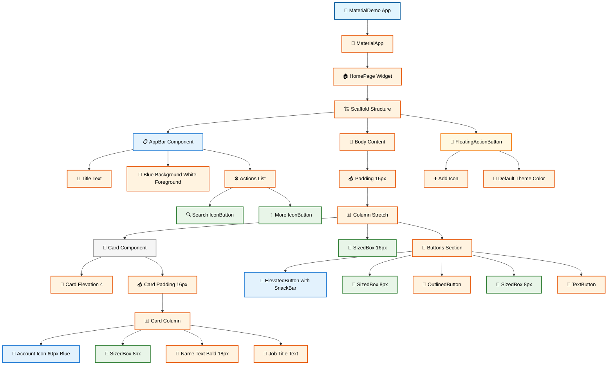

---

## 📱 Responsive Design Basics

### 📏 MediaQuery untuk Responsive Layout

```dart
import 'package:flutter/material.dart';

void main() {
  runApp(ResponsiveDemo());
}

class ResponsiveDemo extends StatelessWidget {
  @override
  Widget build(BuildContext context) {
    return MaterialApp(
      home: ResponsivePage(),
    );
  }
}

class ResponsivePage extends StatelessWidget {
  @override
  Widget build(BuildContext context) {
    // Mendapatkan ukuran layar
    final screenWidth = MediaQuery.of(context).size.width;
    final screenHeight = MediaQuery.of(context).size.height;
    final isPortrait = screenHeight > screenWidth;

    return Scaffold(
      appBar: AppBar(
        title: Text('Responsive Demo'),
        backgroundColor: Colors.green,
        foregroundColor: Colors.white,
      ),
      body: Padding(
        padding: EdgeInsets.all(16),
        child: Column(
          crossAxisAlignment: CrossAxisAlignment.start,
          children: [
            // Info layar
            Card(
              child: Padding(
                padding: EdgeInsets.all(16),
                child: Column(
                  crossAxisAlignment: CrossAxisAlignment.start,
                  children: [
                    Text('Info Layar:', style: TextStyle(fontWeight: FontWeight.bold)),
                    Text('Lebar: ${screenWidth.toInt()}px'),
                    Text('Tinggi: ${screenHeight.toInt()}px'),
                    Text('Orientasi: ${isPortrait ? "Portrait" : "Landscape"}'),
                    Text('Kategori: ${_getDeviceType(screenWidth)}'),
                  ],
                ),
              ),
            ),
            
            SizedBox(height: 16),
            
            // Layout responsif
            Text('Layout Responsif:', style: TextStyle(fontWeight: FontWeight.bold, fontSize: 16)),
            SizedBox(height: 8),
            
            isPortrait ? _buildPortraitLayout() : _buildLandscapeLayout(),
          ],
        ),
      ),
    );
  }

  String _getDeviceType(double width) {
    if (width < 600) return 'Mobile';
    if (width < 1024) return 'Tablet';
    return 'Desktop';
  }

  Widget _buildPortraitLayout() {
    return Column(
      children: [
        _buildColorBox('Box 1', Colors.red),
        SizedBox(height: 8),
        _buildColorBox('Box 2', Colors.green),
        SizedBox(height: 8),
        _buildColorBox('Box 3', Colors.blue),
      ],
    );
  }

  Widget _buildLandscapeLayout() {
    return Row(
      children: [
        Expanded(child: _buildColorBox('Box 1', Colors.red)),
        SizedBox(width: 8),
        Expanded(child: _buildColorBox('Box 2', Colors.green)),
        SizedBox(width: 8),
        Expanded(child: _buildColorBox('Box 3', Colors.blue)),
      ],
    );
  }

  Widget _buildColorBox(String title, Color color) {
    return Container(
      height: 80,
      decoration: BoxDecoration(
        color: color,
        borderRadius: BorderRadius.circular(8),
      ),
      child: Center(
        child: Text(
          title,
          style: TextStyle(color: Colors.white, fontWeight: FontWeight.bold),
        ),
      ),
    );
  }
}
```

**🔧 [Copy Code]** | **🚀 Coba Sekarang!** 
Silakan copy code di atas dan coba jalankan di: **[https://zapp.run/](https://zapp.run/)**

#### Responsive Design Flow:

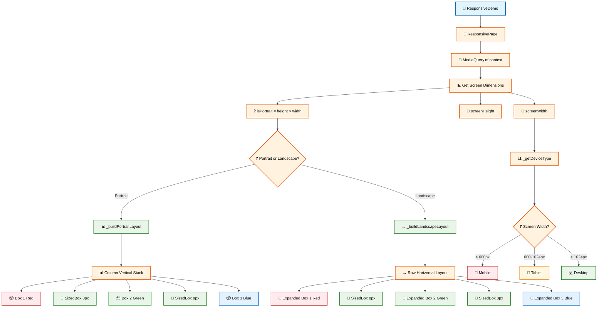

---

## 👨‍💻 Praktikum: Kartu Nama Digital Indonesia

### 🎯 Project Overview

Mari buat **Kartu Nama Digital sederhana** yang fokus pada:
- ✅ **Layout dengan Row, Column, Container**
- ✅ **Material Design components**
- ✅ **Responsive design sederhana**
- ✅ **Indonesian context**

### 🚀 Implementation

```dart
import 'package:flutter/material.dart';

void main() {
  runApp(KartuNamaApp());
}

class KartuNamaApp extends StatelessWidget {
  @override
  Widget build(BuildContext context) {
    return MaterialApp(
      title: 'Kartu Nama Digital Indonesia',
      theme: ThemeData(
        primarySwatch: Colors.red,
      ),
      home: KartuNamaPage(),
    );
  }
}

class KartuNamaPage extends StatefulWidget {
  @override
  _KartuNamaPageState createState() => _KartuNamaPageState();
}

class _KartuNamaPageState extends State<KartuNamaPage> {
  bool showBack = false;

  @override
  Widget build(BuildContext context) {
    final screenWidth = MediaQuery.of(context).size.width;
    final isSmallScreen = screenWidth < 600;

    return Scaffold(
      appBar: AppBar(
        title: Text('Kartu Nama Digital 🇮🇩'),
        backgroundColor: Colors.red,
        foregroundColor: Colors.white,
      ),
      body: SingleChildScrollView(
        padding: EdgeInsets.all(16),
        child: Column(
          children: [
            // Business Card
            GestureDetector(
              onTap: () {
                setState(() {
                  showBack = !showBack;
                });
              },
              child: Container(
                width: isSmallScreen ? screenWidth * 0.9 : 400,
                height: isSmallScreen ? 200 : 250,
                child: showBack ? _buildCardBack() : _buildCardFront(),
              ),
            ),
            
            SizedBox(height: 20),
            
            // Contact Section
            Card(
              child: Padding(
                padding: EdgeInsets.all(16),
                child: Column(
                  crossAxisAlignment: CrossAxisAlignment.start,
                  children: [
                    Text(
                      'Kontak',
                      style: TextStyle(fontSize: 18, fontWeight: FontWeight.bold),
                    ),
                    SizedBox(height: 12),
                    _buildContactItem(Icons.phone, '+62 812-3456-7890'),
                    _buildContactItem(Icons.email, 'budi@teknologi.co.id'),
                    _buildContactItem(Icons.location_on, 'Jakarta, Indonesia'),
                  ],
                ),
              ),
            ),
            
            SizedBox(height: 16),
            
            // Action Buttons
            isSmallScreen ? _buildVerticalButtons() : _buildHorizontalButtons(),
            
            SizedBox(height: 16),
            
            // Footer
            Text(
              'Tap kartu untuk melihat sisi belakang',
              style: TextStyle(color: Colors.grey[600], fontSize: 12),
            ),
          ],
        ),
      ),
    );
  }

  Widget _buildCardFront() {
    return Card(
      elevation: 8,
      child: Container(
        decoration: BoxDecoration(
          color: Colors.red,
          borderRadius: BorderRadius.circular(12),
        ),
        padding: EdgeInsets.all(20),
        child: Column(
          crossAxisAlignment: CrossAxisAlignment.start,
          children: [
            // Header
            Row(
              children: [
                CircleAvatar(
                  radius: 30,
                  backgroundColor: Colors.white,
                  child: Icon(Icons.person, size: 35, color: Colors.red),
                ),
                Spacer(),
                Text('🇮🇩', style: TextStyle(fontSize: 24)),
              ],
            ),
            
            Spacer(),
            
            // Name and Title
            Text(
              'BUDI SANTOSO',
              style: TextStyle(
                color: Colors.white,
                fontSize: 22,
                fontWeight: FontWeight.bold,
              ),
            ),
            Text(
              'Flutter Developer',
              style: TextStyle(
                color: Colors.white70,
                fontSize: 16,
              ),
            ),
            SizedBox(height: 8),
            Text(
              'PT. Teknologi Indonesia',
              style: TextStyle(
                color: Colors.white70,
                fontSize: 14,
              ),
            ),
          ],
        ),
      ),
    );
  }

  Widget _buildCardBack() {
    return Card(
      elevation: 8,
      child: Container(
        decoration: BoxDecoration(
          color: Colors.white,
          borderRadius: BorderRadius.circular(12),
          border: Border.all(color: Colors.grey[300]!),
        ),
        padding: EdgeInsets.all(20),
        child: Column(
          crossAxisAlignment: CrossAxisAlignment.start,
          children: [
            // QR Code Area
            Row(
              children: [
                Container(
                  width: 60,
                  height: 60,
                  decoration: BoxDecoration(
                    color: Colors.grey[200],
                    borderRadius: BorderRadius.circular(8),
                  ),
                  child: Icon(Icons.qr_code, size: 40),
                ),
                SizedBox(width: 12),
                Expanded(
                  child: Column(
                    crossAxisAlignment: CrossAxisAlignment.start,
                    children: [
                      Text(
                        'Scan untuk kontak',
                        style: TextStyle(fontWeight: FontWeight.bold),
                      ),
                      Text(
                        'QR Code untuk simpan kontak',
                        style: TextStyle(fontSize: 12, color: Colors.grey[600]),
                      ),
                    ],
                  ),
                ),
              ],
            ),
            
            SizedBox(height: 16),
            
            // Skills
            Text('Keahlian:', style: TextStyle(fontWeight: FontWeight.bold)),
            SizedBox(height: 8),
            Wrap(
              spacing: 8,
              children: [
                _buildSkillChip('Flutter'),
                _buildSkillChip('Dart'),
                _buildSkillChip('Firebase'),
              ],
            ),
            
            Spacer(),
            
            // Address
            Text(
              'Jl. Sudirman No. 123\nJakarta Pusat, DKI Jakarta',
              style: TextStyle(fontSize: 12, color: Colors.grey[700]),
            ),
          ],
        ),
      ),
    );
  }

  Widget _buildSkillChip(String skill) {
    return Container(
      padding: EdgeInsets.symmetric(horizontal: 8, vertical: 4),
      decoration: BoxDecoration(
        color: Colors.blue[100],
        borderRadius: BorderRadius.circular(12),
      ),
      child: Text(
        skill,
        style: TextStyle(fontSize: 12, color: Colors.blue[700]),
      ),
    );
  }

  Widget _buildContactItem(IconData icon, String text) {
    return Padding(
      padding: EdgeInsets.symmetric(vertical: 4),
      child: Row(
        children: [
          Icon(icon, size: 16, color: Colors.grey[600]),
          SizedBox(width: 8),
          Text(text, style: TextStyle(fontSize: 14)),
        ],
      ),
    );
  }

  Widget _buildVerticalButtons() {
    return Column(
      crossAxisAlignment: CrossAxisAlignment.stretch,
      children: [
        ElevatedButton.icon(
          onPressed: () => _showMessage('Telepon'),
          icon: Icon(Icons.phone),
          label: Text('Telepon'),
          style: ElevatedButton.styleFrom(backgroundColor: Colors.green),
        ),
        SizedBox(height: 8),
        ElevatedButton.icon(
          onPressed: () => _showMessage('Email'),
          icon: Icon(Icons.email),
          label: Text('Email'),
          style: ElevatedButton.styleFrom(backgroundColor: Colors.blue),
        ),
        SizedBox(height: 8),
        ElevatedButton.icon(
          onPressed: () => _showMessage('Share'),
          icon: Icon(Icons.share),
          label: Text('Share'),
          style: ElevatedButton.styleFrom(backgroundColor: Colors.orange),
        ),
      ],
    );
  }

  Widget _buildHorizontalButtons() {
    return Row(
      children: [
        Expanded(
          child: ElevatedButton.icon(
            onPressed: () => _showMessage('Telepon'),
            icon: Icon(Icons.phone),
            label: Text('Telepon'),
            style: ElevatedButton.styleFrom(backgroundColor: Colors.green),
          ),
        ),
        SizedBox(width: 8),
        Expanded(
          child: ElevatedButton.icon(
            onPressed: () => _showMessage('Email'),
            icon: Icon(Icons.email),
            label: Text('Email'),
            style: ElevatedButton.styleFrom(backgroundColor: Colors.blue),
          ),
        ),
        SizedBox(width: 8),
        Expanded(
          child: ElevatedButton.icon(
            onPressed: () => _showMessage('Share'),
            icon: Icon(Icons.share),
            label: Text('Share'),
            style: ElevatedButton.styleFrom(backgroundColor: Colors.orange),
          ),
        ),
      ],
    );
  }

  void _showMessage(String action) {
    ScaffoldMessenger.of(context).showSnackBar(
      SnackBar(content: Text('$action ditekan!')),
    );
  }
}
```

**🔧 [Copy Code]** | **🚀 Coba Sekarang!** 
Silakan copy code di atas dan coba jalankan di: **[https://zapp.run/](https://zapp.run/)**

#### Kartu Nama Project Flow:

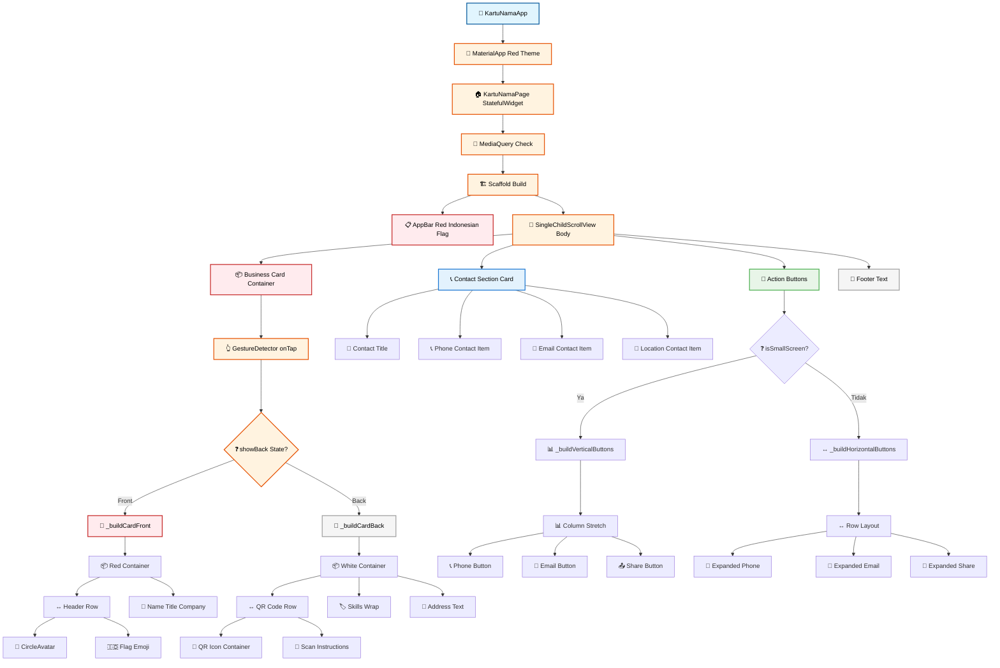

---

## 📝 Assessment & Quiz

### ✅ UI Implementation Project (15%)

**Task**: Buat layout sederhana untuk "Profil Mahasiswa Indonesia"

**Requirements:**
1. **AppBar** dengan title dan actions
2. **Card** untuk informasi profil
3. **Row/Column** layout untuk data mahasiswa
4. **Responsive** dengan MediaQuery
5. **Button** untuk interaksi sederhana

### 🧠 Quiz Widget & Layout (10%)

#### **Soal 1 (25 poin)**
Perbedaan **StatelessWidget** dan **StatefulWidget**?

**A.** StatelessWidget bisa berubah, StatefulWidget tidak
**B.** StatelessWidget tidak berubah, StatefulWidget bisa berubah dengan setState
**C.** Keduanya sama saja
**D.** StatelessWidget untuk Android, StatefulWidget untuk iOS

**Jawaban:** B ✅

#### **Soal 2 (25 poin)**
Widget untuk layout **horizontal**?

**A.** Column
**B.** Row
**C.** Stack
**D.** Container

**Jawaban:** B ✅

#### **Soal 3 (25 poin)**
Fungsi **MediaQuery**?

**A.** Query database
**B.** Mendapatkan informasi ukuran layar
**C.** Streaming media
**D.** Kompres gambar

**Jawaban:** B ✅

#### **Soal 4 (25 poin)**
Widget untuk **menumpuk** widget?

**A.** Row
**B.** Column  
**C.** Stack
**D.** Container

**Jawaban:** C ✅

---

## 📖 Daftar Istilah

| Istilah | Pengertian |
|---------|-------------|
| **Widget** | Building block dasar UI dalam Flutter |
| **StatelessWidget** | Widget yang tidak pernah berubah |
| **StatefulWidget** | Widget yang bisa berubah dengan setState |
| **Container** | Widget untuk styling dan layout |
| **Row** | Layout horizontal (kiri ke kanan) |
| **Column** | Layout vertical (atas ke bawah) |
| **Stack** | Layout bertumpuk satu di atas yang lain |
| **Scaffold** | Struktur dasar halaman Material Design |
| **AppBar** | Bar bagian atas aplikasi |
| **Card** | Widget dengan elevation dan rounded corners |
| **MediaQuery** | Class untuk informasi device dan screen |
| **Responsive** | Design yang adaptif ke berbagai ukuran layar |
| **Positioned** | Widget untuk posisi absolut dalam Stack |
| **Expanded** | Widget untuk mengisi ruang tersedia |
| **MainAxisAlignment** | Alignment sepanjang sumbu utama |
| **CrossAxisAlignment** | Alignment perpendicular terhadap sumbu utama |

---

## 📚 Referensi

### 📖 Sumber Utama

1. **Flutter Widget Catalog**. (2025). https://docs.flutter.dev/ui/widgets
2. **Material Design Guidelines**. (2025). https://m3.material.io/
3. **Flutter Layout Tutorial**. (2025). https://docs.flutter.dev/ui/layout

### 🇮🇩 Sumber Indonesia

4. **Flutter Indonesia**. (2025). https://flutter-indonesia.github.io/
5. **Koding Indonesia**. (2025). https://kodingindonesia.com/flutter-layout/

### 📊 Sumber Akademik

6. **Moroney, L.** (2024). *Programming Flutter: Native, Cross-Platform Apps*. Pragmatic Bookshelf.
7. **Windmill, E.** (2024). *Flutter in Action*. Manning Publications.

---

## 🎯 Next Week Preview

**Pertemuan 4: Navigation dan State Management Dasar**
- ✅ Navigator untuk multi-screen
- ✅ setState dan state management
- ✅ Form handling dan validation
- ✅ Project: Todo Harian Mahasiswa

---

**🎉 Selamat! Anda telah menguasai Flutter Widget System!**

Lanjutkan ke **Pertemuan 4** untuk Navigation dan State Management! 🚀

---

*© 2025 Mata Kuliah Pemrograman Piranti Bergerak dengan Flutter*  
*Dibuat dengan ❤️ untuk mahasiswa Indonesia*
