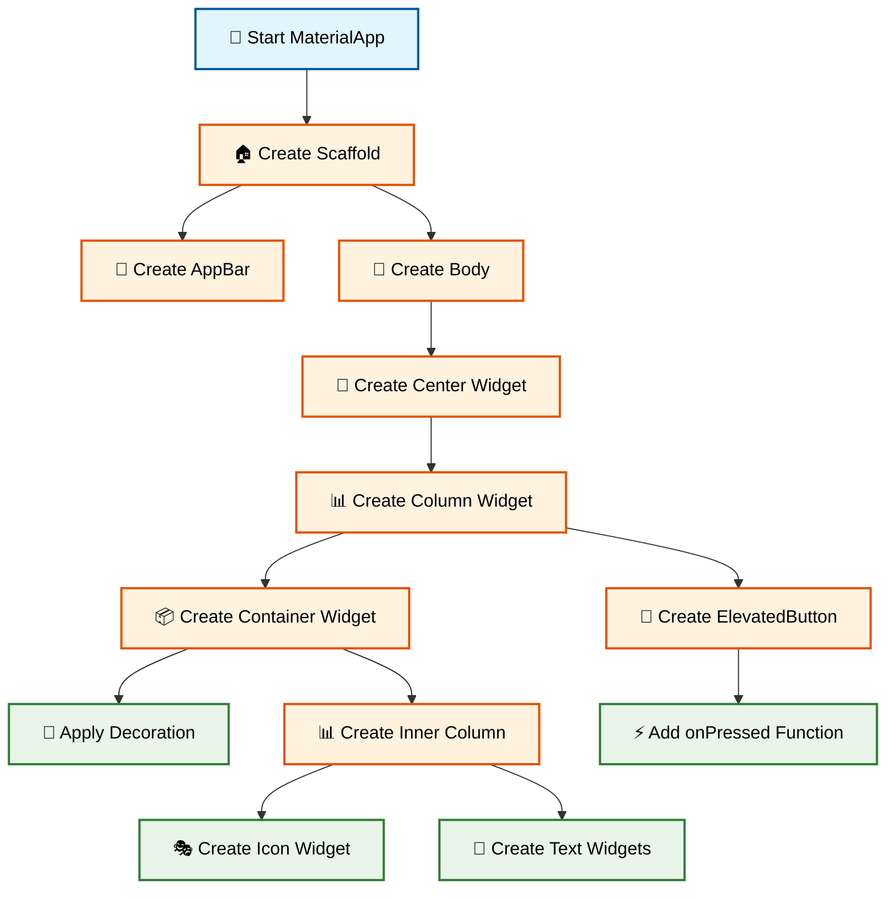
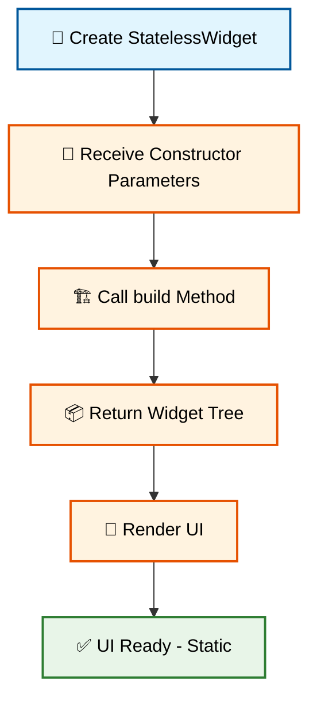
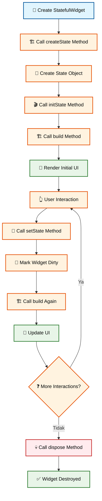
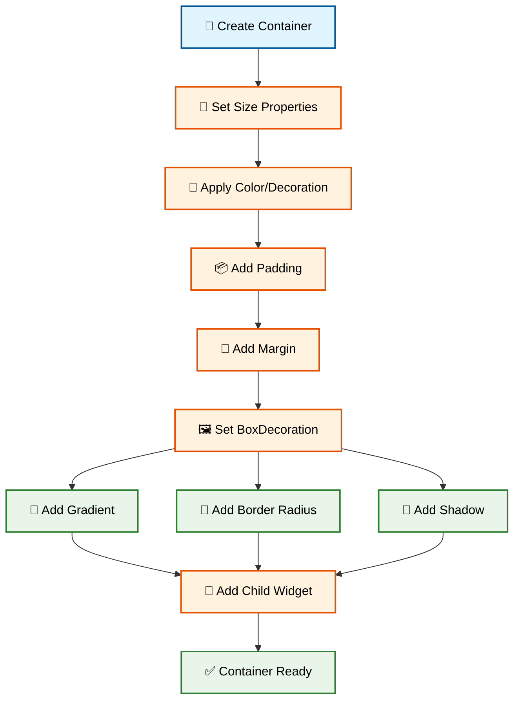
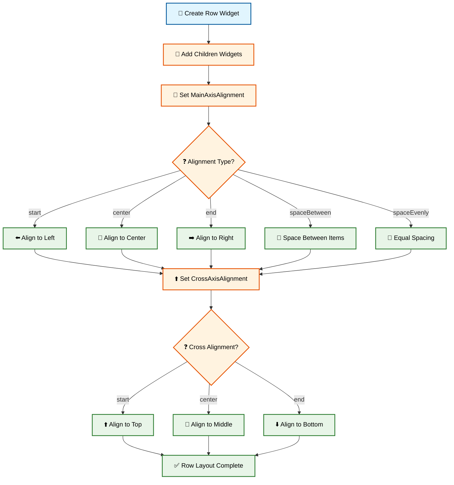
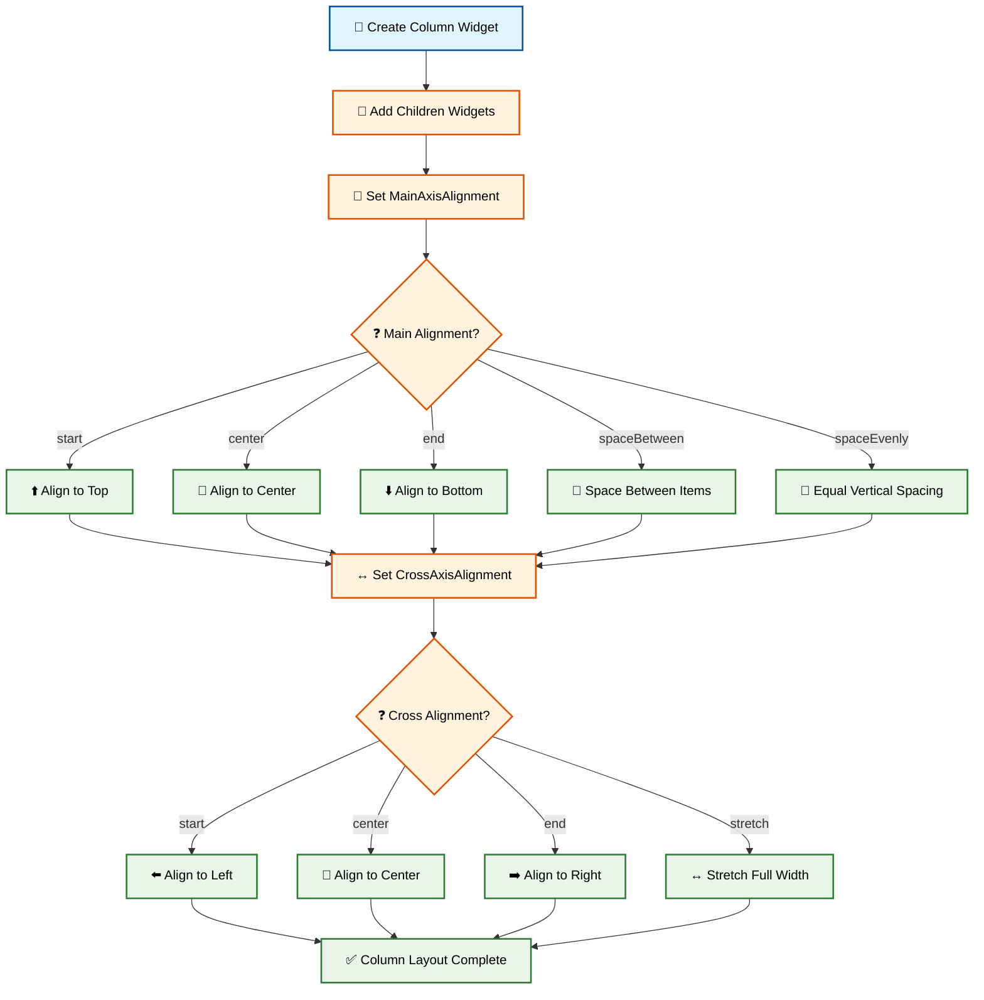
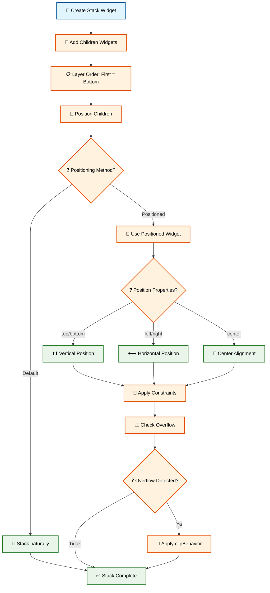
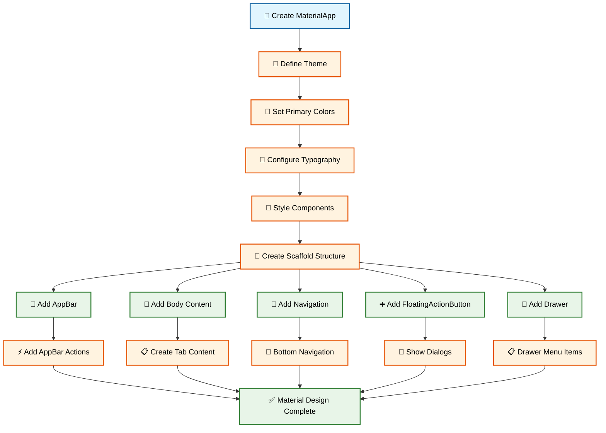
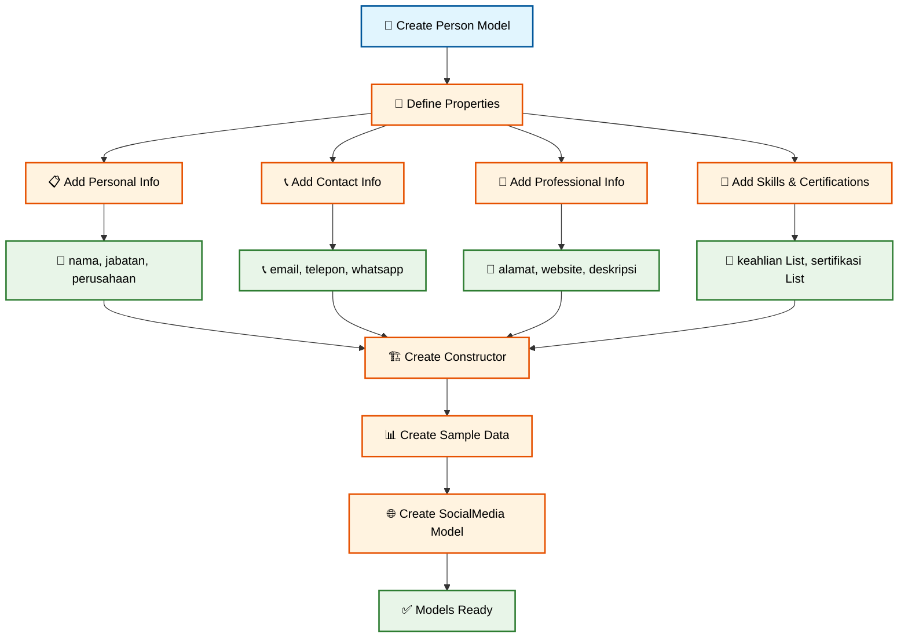
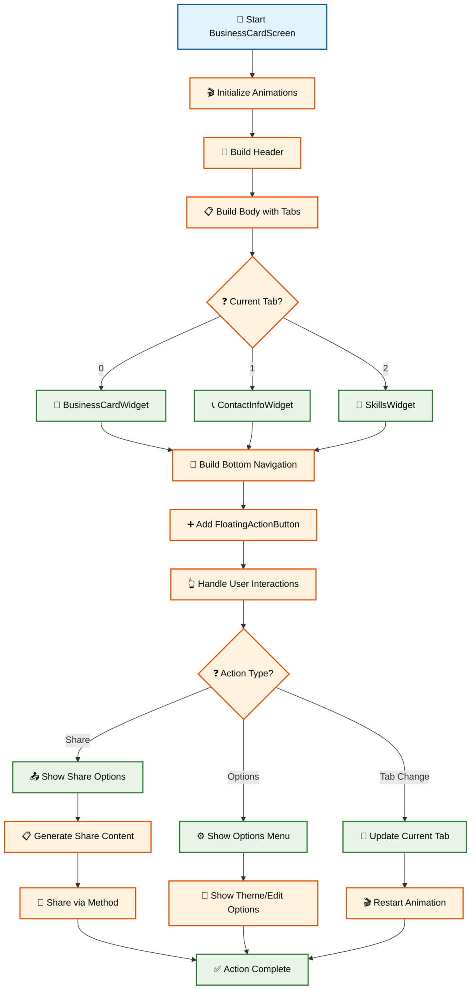

# 🎨 Pertemuan 3: Flutter Widget System dan Layout


---

## 📋 Daftar Isi

1. [🎯 Learning Objectives](#-learning-objectives)
2. [🧩 Widget System Fundamentals](#-widget-system-fundamentals)
3. [🎭 StatelessWidget vs StatefulWidget](#-statelesswidget-vs-statefulwidget)
4. [📐 Layout Widgets Essentials](#-layout-widgets-essentials)
5. [🎨 Material Design Indonesia](#-material-design-indonesia)
6. [👨‍💻 Praktikum: Kartu Nama Digital Indonesia](#-praktikum-kartu-nama-digital-indonesia)
7. [📝 Assessment & Quiz](#-assessment--quiz)
8. [📖 Daftar Istilah](#-daftar-istilah)
9. [📚 Referensi](#-referensi)

---

## 🎯 Learning Objectives

Setelah menyelesaikan pertemuan ini, mahasiswa diharapkan mampu:

- ✅ **Memahami Widget Tree Architecture**: Konsep widget tree dan rendering system Flutter
- ✅ **Menguasai Widget Lifecycle**: Perbedaan StatelessWidget dan StatefulWidget
- ✅ **Implementasi Layout Widgets**: Container, Row, Column, Stack untuk UI responsive  
- ✅ **Menerapkan Material Design**: Prinsip design yang sesuai dengan konteks Indonesia
- ✅ **Membuat UI Kompleks**: Project kartu nama digital dengan styling advanced

---

## 🧩 Widget System Fundamentals

### 🤔 Mengapa Everything is a Widget?

Dalam Flutter, **"Everything is a Widget"** - ini bukan sekadar slogan marketing! Mari kita pahami konsep fundamental ini:

**Widget** adalah building blocks aplikasi Flutter yang menggambarkan bagaimana UI seharusnya terlihat. Bayangkan widget seperti **LEGO blocks** - kita bisa menyusunnya untuk membuat struktur yang kompleks!

### 🇮🇩 Analogi Widget dalam Kehidupan Indonesia

Bayangkan Anda membuat **"Warung Makan Padang"**:
- **Scaffold** = Bangunan warung (struktur dasar)
- **AppBar** = Papan nama warung
- **Body** = Area tempat duduk customer  
- **Container** = Meja dan kursi
- **Text** = Menu makanan
- **Image** = Foto masakan
- **Button** = Tombol panggil pelayan

### 🌳 Widget Tree Architecture

Flutter membangun UI menggunakan **Widget Tree** - struktur hierarki seperti pohon keluarga!

```dart
import 'package:flutter/material.dart';

void main() {
  runApp(ContohWidgetTree());
}

class ContohWidgetTree extends StatelessWidget {
  @override
  Widget build(BuildContext context) {
    return MaterialApp(
      title: 'Widget Tree Demo',
      home: Scaffold(
        appBar: AppBar(
          title: Text('Warung Makan Padang'),
        ),
        body: Center(
          child: Column(
            mainAxisAlignment: MainAxisAlignment.center,
            children: [
              Container(
                padding: EdgeInsets.all(20),
                margin: EdgeInsets.all(10),
                decoration: BoxDecoration(
                  color: Colors.orange[100],
                  borderRadius: BorderRadius.circular(15),
                  border: Border.all(color: Colors.orange, width: 2),
                ),
                child: Column(
                  children: [
                    Icon(
                      Icons.restaurant,
                      size: 60,
                      color: Colors.orange[700],
                    ),
                    SizedBox(height: 10),
                    Text(
                      'Menu Hari Ini',
                      style: TextStyle(
                        fontSize: 24,
                        fontWeight: FontWeight.bold,
                        color: Colors.orange[800],
                      ),
                    ),
                    SizedBox(height: 15),
                    Text(
                      '🍛 Nasi Rendang - Rp 15.000',
                      style: TextStyle(fontSize: 16),
                    ),
                    Text(
                      '🥘 Gulai Ayam - Rp 12.000',
                      style: TextStyle(fontSize: 16),
                    ),
                    Text(
                      '🥗 Sayur Daun Singkong - Rp 8.000',
                      style: TextStyle(fontSize: 16),
                    ),
                  ],
                ),
              ),
              SizedBox(height: 20),
              ElevatedButton(
                onPressed: () {
                  print('Pelayan dipanggil! 🔔');
                },
                style: ElevatedButton.styleFrom(
                  backgroundColor: Colors.orange,
                  foregroundColor: Colors.white,
                  padding: EdgeInsets.symmetric(horizontal: 30, vertical: 15),
                ),
                child: Text('Panggil Pelayan 🔔'),
              ),
            ],
          ),
        ),
      ),
    );
  }
}
```

**🔧 [Copy Code]** | **🌐 [Test di zapp.run](https://zapp.run/)**

#### Alur Widget Tree Construction:



### 🔍 Widget Categories

Flutter memiliki **tiga kategori widget** utama:

#### 1. **Structural Widgets** - Fondasi Aplikasi
- `MaterialApp` - Root aplikasi dengan Material Design
- `Scaffold` - Struktur halaman dasar (AppBar, Body, FloatingActionButton)
- `AppBar` - Bar navigasi di bagian atas

#### 2. **Layout Widgets** - Pengatur Tata Letak  
- `Container` - Box untuk styling dan spacing
- `Row` - Layout horizontal
- `Column` - Layout vertical
- `Stack` - Layout overlay/bertumpuk

#### 3. **UI Widgets** - Komponen Interaktif
- `Text` - Menampilkan teks
- `Image` - Menampilkan gambar  
- `ElevatedButton` - Button dengan efek elevasi
- `TextField` - Input teks dari user

---

## 🎭 StatelessWidget vs StatefulWidget

### 📖 Kapan Menggunakan Yang Mana?

Memahami perbedaan **StatelessWidget** dan **StatefulWidget** adalah kunci sukses Flutter development!

### 🏠 StatelessWidget - "Rumah yang Tidak Berubah"

**StatelessWidget** adalah widget yang **tidak pernah berubah** setelah dibuat. Seperti rumah yang sudah jadi - bentuknya tetap sama!

```dart
import 'package:flutter/material.dart';

// StatelessWidget - Data tidak berubah
class ProfileCard extends StatelessWidget {
  final String nama;
  final String profesi;
  final String foto;
  
  // Constructor untuk menerima data
  ProfileCard({
    required this.nama,
    required this.profesi,
    required this.foto,
  });
  
  @override
  Widget build(BuildContext context) {
    return Card(
      elevation: 5,
      margin: EdgeInsets.all(10),
      child: Container(
        padding: EdgeInsets.all(20),
        child: Column(
          children: [
            // Avatar foto profil
            CircleAvatar(
              radius: 50,
              backgroundColor: Colors.blue[100],
              child: Text(
                foto,
                style: TextStyle(fontSize: 30),
              ),
            ),
            
            SizedBox(height: 15),
            
            // Nama
            Text(
              nama,
              style: TextStyle(
                fontSize: 22,
                fontWeight: FontWeight.bold,
              ),
            ),
            
            SizedBox(height: 8),
            
            // Profesi
            Text(
              profesi,
              style: TextStyle(
                fontSize: 16,
                color: Colors.grey[600],
              ),
            ),
          ],
        ),
      ),
    );
  }
}

// Penggunaan StatelessWidget
class DemoStatelessWidget extends StatelessWidget {
  @override
  Widget build(BuildContext context) {
    return MaterialApp(
      home: Scaffold(
        appBar: AppBar(
          title: Text('Demo StatelessWidget'),
          backgroundColor: Colors.blue,
          foregroundColor: Colors.white,
        ),
        body: SingleChildScrollView(
          child: Column(
            children: [
              ProfileCard(
                nama: 'Siti Nurhaliza',
                profesi: 'Flutter Developer',
                foto: '👩‍💻',
              ),
              ProfileCard(
                nama: 'Budi Santoso', 
                profesi: 'UI/UX Designer',
                foto: '👨‍🎨',
              ),
              ProfileCard(
                nama: 'Dewi Sartika',
                profesi: 'Product Manager', 
                foto: '👩‍💼',
              ),
            ],
          ),
        ),
      ),
    );
  }
}

void main() {
  runApp(DemoStatelessWidget());
}
```

**🔧 [Copy Code]** | **🌐 [Test di zapp.run](https://zapp.run/)**

#### Alur StatelessWidget Build Process:



### 🔄 StatefulWidget - "Warung yang Bisa Berubah"

**StatefulWidget** adalah widget yang **bisa berubah** berdasarkan user interaction atau data updates. Seperti warung yang bisa update menu setiap hari!

```dart
import 'package:flutter/material.dart';

// StatefulWidget - Data bisa berubah
class CounterWarung extends StatefulWidget {
  @override
  _CounterWarungState createState() => _CounterWarungState();
}

class _CounterWarungState extends State<CounterWarung> {
  // State variables - data yang bisa berubah
  int jumlahCustomer = 0;
  int totalPenjualan = 0;
  String statusWarung = 'Buka';
  List<String> pesananTerbaru = [];
  
  // Method untuk menambah customer
  void tambahCustomer() {
    setState(() {
      jumlahCustomer++;
      totalPenjualan += 15000; // Asumsi rata-rata pembelian 15rb
      pesananTerbaru.insert(0, 'Customer #$jumlahCustomer - Nasi Rendang');
      
      // Batasi list pesanan maksimal 5
      if (pesananTerbaru.length > 5) {
        pesananTerbaru.removeLast();
      }
    });
  }
  
  // Method untuk reset data
  void resetData() {
    setState(() {
      jumlahCustomer = 0;
      totalPenjualan = 0;
      pesananTerbaru.clear();
    });
  }
  
  // Method untuk toggle status warung
  void toggleStatus() {
    setState(() {
      if (statusWarung == 'Buka') {
        statusWarung = 'Tutup';
      } else {
        statusWarung = 'Buka';
      }
    });
  }
  
  @override
  Widget build(BuildContext context) {
    return MaterialApp(
      home: Scaffold(
        appBar: AppBar(
          title: Text('Warung Counter - $statusWarung'),
          backgroundColor: statusWarung == 'Buka' ? Colors.green : Colors.red,
          foregroundColor: Colors.white,
        ),
        body: Padding(
          padding: EdgeInsets.all(20),
          child: Column(
            crossAxisAlignment: CrossAxisAlignment.stretch,
            children: [
              // Status Card
              Card(
                elevation: 4,
                child: Padding(
                  padding: EdgeInsets.all(20),
                  child: Column(
                    children: [
                      Text(
                        'Status Warung',
                        style: TextStyle(
                          fontSize: 18,
                          fontWeight: FontWeight.bold,
                        ),
                      ),
                      SizedBox(height: 10),
                      Row(
                        mainAxisAlignment: MainAxisAlignment.spaceAround,
                        children: [
                          Column(
                            children: [
                              Icon(Icons.people, size: 40, color: Colors.blue),
                              Text('$jumlahCustomer'),
                              Text('Customer'),
                            ],
                          ),
                          Column(
                            children: [
                              Icon(Icons.money, size: 40, color: Colors.green),
                              Text('Rp ${totalPenjualan.toString()}'),
                              Text('Penjualan'),
                            ],
                          ),
                        ],
                      ),
                    ],
                  ),
                ),
              ),
              
              SizedBox(height: 20),
              
              // Pesanan Terbaru
              Card(
                elevation: 4,
                child: Padding(
                  padding: EdgeInsets.all(20),
                  child: Column(
                    crossAxisAlignment: CrossAxisAlignment.start,
                    children: [
                      Text(
                        'Pesanan Terbaru:',
                        style: TextStyle(
                          fontSize: 16,
                          fontWeight: FontWeight.bold,
                        ),
                      ),
                      SizedBox(height: 10),
                      Container(
                        height: 150,
                        child: pesananTerbaru.isEmpty
                            ? Center(
                                child: Text(
                                  'Belum ada pesanan',
                                  style: TextStyle(
                                    color: Colors.grey[600],
                                    fontStyle: FontStyle.italic,
                                  ),
                                ),
                              )
                            : ListView.builder(
                                itemCount: pesananTerbaru.length,
                                itemBuilder: (context, index) {
                                  return Padding(
                                    padding: EdgeInsets.symmetric(vertical: 4),
                                    child: Row(
                                      children: [
                                        Icon(Icons.restaurant_menu, 
                                             size: 16, 
                                             color: Colors.orange),
                                        SizedBox(width: 8),
                                        Text(pesananTerbaru[index]),
                                      ],
                                    ),
                                  );
                                },
                              ),
                      ),
                    ],
                  ),
                ),
              ),
              
              SizedBox(height: 30),
              
              // Button Actions
              Row(
                children: [
                  Expanded(
                    child: ElevatedButton.icon(
                      onPressed: statusWarung == 'Buka' ? tambahCustomer : null,
                      icon: Icon(Icons.add),
                      label: Text('Tambah Customer'),
                      style: ElevatedButton.styleFrom(
                        backgroundColor: Colors.green,
                        foregroundColor: Colors.white,
                        padding: EdgeInsets.symmetric(vertical: 15),
                      ),
                    ),
                  ),
                  SizedBox(width: 10),
                  Expanded(
                    child: ElevatedButton.icon(
                      onPressed: resetData,
                      icon: Icon(Icons.refresh),
                      label: Text('Reset Data'),
                      style: ElevatedButton.styleFrom(
                        backgroundColor: Colors.orange,
                        foregroundColor: Colors.white,
                        padding: EdgeInsets.symmetric(vertical: 15),
                      ),
                    ),
                  ),
                ],
              ),
              
              SizedBox(height: 10),
              
              ElevatedButton.icon(
                onPressed: toggleStatus,
                icon: Icon(statusWarung == 'Buka' ? Icons.lock : Icons.lock_open),
                label: Text(statusWarung == 'Buka' ? 'Tutup Warung' : 'Buka Warung'),
                style: ElevatedButton.styleFrom(
                  backgroundColor: statusWarung == 'Buka' ? Colors.red : Colors.green,
                  foregroundColor: Colors.white,
                  padding: EdgeInsets.symmetric(vertical: 15),
                ),
              ),
            ],
          ),
        ),
      ),
    );
  }
}

void main() {
  runApp(CounterWarung());
}
```

**🔧 [Copy Code]** | **🌐 [Test di zapp.run](https://zapp.run/)**

#### Alur StatefulWidget Lifecycle:



### 📊 Perbandingan StatelessWidget vs StatefulWidget

| Aspek | StatelessWidget | StatefulWidget |
|-------|-----------------|----------------|
| **State** | ❌ Tidak punya internal state | ✅ Punya internal state yang bisa berubah |
| **Performance** | ⚡ Lebih cepat (tidak perlu rebuilding) | 🔄 Lebih lambat (perlu rebuilding) |
| **Use Case** | 📄 Static content, display data | 🎮 Interactive content, user input |
| **Memory** | 💾 Lebih hemat memory | 📊 Lebih boros memory |
| **Complexity** | 🎯 Simple, mudah debug | 🧩 Complex, lifecycle management |

### 💡 Tips Memilih Widget yang Tepat

**Gunakan StatelessWidget jika:**
- ✅ Menampilkan data static (profile, about page)
- ✅ UI tidak berubah setelah dibuat
- ✅ Tidak ada user interaction yang mengubah tampilan
- ✅ Data hanya dari constructor parameters

**Gunakan StatefulWidget jika:**
- ✅ Ada form input dari user
- ✅ Data berubah berdasarkan API calls
- ✅ Ada animations atau transitions
- ✅ Ada counter, timer, atau state tracking

---

## 📐 Layout Widgets Essentials

### 🏗️ Mengapa Layout Widgets Penting?

Layout widgets adalah **arsitek** aplikasi Flutter! Mereka mengatur bagaimana widget-widget lain ditempatkan dan berinteraksi. Mari pelajari 4 layout widgets fundamental yang harus dikuasai!

### 📦 1. Container - "Kotak Serbaguna"

**Container** adalah widget paling versatile di Flutter - seperti **kardus** yang bisa kita custom sesuai kebutuhan!

```dart
import 'package:flutter/material.dart';

void main() {
  runApp(ContainerDemo());
}

class ContainerDemo extends StatelessWidget {
  @override
  Widget build(BuildContext context) {
    return MaterialApp(
      home: Scaffold(
        appBar: AppBar(
          title: Text('Container Demo - Kotak UMKM'),
          backgroundColor: Colors.teal,
          foregroundColor: Colors.white,
        ),
        body: SingleChildScrollView(
          padding: EdgeInsets.all(16),
          child: Column(
            crossAxisAlignment: CrossAxisAlignment.stretch,
            children: [
              // Container 1: Basic Styling
              Container(
                height: 100,
                width: double.infinity,
                color: Colors.blue[100],
                child: Center(
                  child: Text(
                    '📦 Container Basic',
                    style: TextStyle(
                      fontSize: 18,
                      fontWeight: FontWeight.bold,
                    ),
                  ),
                ),
              ),
              
              SizedBox(height: 20),
              
              // Container 2: Advanced Decoration  
              Container(
                height: 120,
                margin: EdgeInsets.symmetric(horizontal: 10),
                padding: EdgeInsets.all(20),
                decoration: BoxDecoration(
                  // Gradient background
                  gradient: LinearGradient(
                    colors: [Colors.orange[300]!, Colors.red[300]!],
                    begin: Alignment.topLeft,
                    end: Alignment.bottomRight,
                  ),
                  // Rounded corners
                  borderRadius: BorderRadius.circular(20),
                  // Shadow effect
                  boxShadow: [
                    BoxShadow(
                      color: Colors.grey.withOpacity(0.5),
                      spreadRadius: 2,
                      blurRadius: 8,
                      offset: Offset(0, 4),
                    ),
                  ],
                ),
                child: Column(
                  crossAxisAlignment: CrossAxisAlignment.start,
                  children: [
                    Text(
                      '🎨 Container Gradient',
                      style: TextStyle(
                        fontSize: 18,
                        fontWeight: FontWeight.bold,
                        color: Colors.white,
                      ),
                    ),
                    SizedBox(height: 8),
                    Text(
                      'Container dengan gradient, shadow, dan border radius',
                      style: TextStyle(
                        fontSize: 14,
                        color: Colors.white,
                      ),
                    ),
                  ],
                ),
              ),
              
              SizedBox(height: 20),
              
              // Container 3: Border dan Image
              Container(
                height: 150,
                margin: EdgeInsets.all(8),
                decoration: BoxDecoration(
                  color: Colors.white,
                  border: Border.all(
                    color: Colors.green,
                    width: 3,
                  ),
                  borderRadius: BorderRadius.circular(15),
                ),
                child: ClipRRect(
                  borderRadius: BorderRadius.circular(12),
                  child: Container(
                    padding: EdgeInsets.all(16),
                    child: Column(
                      children: [
                        Row(
                          children: [
                            Container(
                              width: 60,
                              height: 60,
                              decoration: BoxDecoration(
                                color: Colors.green[100],
                                shape: BoxShape.circle,
                              ),
                              child: Icon(
                                Icons.store,
                                size: 30,
                                color: Colors.green[700],
                              ),
                            ),
                            SizedBox(width: 16),
                            Expanded(
                              child: Column(
                                crossAxisAlignment: CrossAxisAlignment.start,
                                children: [
                                  Text(
                                    'Toko Kelontong Berkah',
                                    style: TextStyle(
                                      fontSize: 16,
                                      fontWeight: FontWeight.bold,
                                    ),
                                  ),
                                  Text(
                                    'Jl. Merdeka No. 45, Jakarta',
                                    style: TextStyle(
                                      fontSize: 12,
                                      color: Colors.grey[600],
                                    ),
                                  ),
                                ],
                              ),
                            ),
                          ],
                        ),
                        SizedBox(height: 16),
                        Row(
                          children: [
                            Expanded(
                              child: Container(
                                padding: EdgeInsets.symmetric(
                                  horizontal: 12, 
                                  vertical: 8
                                ),
                                decoration: BoxDecoration(
                                  color: Colors.green[50],
                                  borderRadius: BorderRadius.circular(20),
                                ),
                                child: Text(
                                  '⭐ 4.8 Rating',
                                  textAlign: TextAlign.center,
                                  style: TextStyle(
                                    fontSize: 12,
                                    color: Colors.green[700],
                                    fontWeight: FontWeight.w600,
                                  ),
                                ),
                              ),
                            ),
                            SizedBox(width: 8),
                            Expanded(
                              child: Container(
                                padding: EdgeInsets.symmetric(
                                  horizontal: 12, 
                                  vertical: 8
                                ),
                                decoration: BoxDecoration(
                                  color: Colors.blue[50],
                                  borderRadius: BorderRadius.circular(20),
                                ),
                                child: Text(
                                  '🚚 Free Ongkir',
                                  textAlign: TextAlign.center,
                                  style: TextStyle(
                                    fontSize: 12,
                                    color: Colors.blue[700],
                                    fontWeight: FontWeight.w600,
                                  ),
                                ),
                              ),
                            ),
                          ],
                        ),
                      ],
                    ),
                  ),
                ),
              ),
              
              SizedBox(height: 20),
              
              // Container 4: Responsive dengan constraints
              Container(
                constraints: BoxConstraints(
                  minHeight: 100,
                  maxHeight: 200,
                  minWidth: 200,
                ),
                margin: EdgeInsets.all(10),
                padding: EdgeInsets.all(16),
                decoration: BoxDecoration(
                  color: Colors.purple[50],
                  borderRadius: BorderRadius.only(
                    topLeft: Radius.circular(30),
                    topRight: Radius.circular(10),
                    bottomLeft: Radius.circular(10),
                    bottomRight: Radius.circular(30),
                  ),
                  border: Border.all(
                    color: Colors.purple,
                    width: 2,
                  ),
                ),
                child: Column(
                  crossAxisAlignment: CrossAxisAlignment.start,
                  mainAxisSize: MainAxisSize.min,
                  children: [
                    Text(
                      '📏 Container Responsive',
                      style: TextStyle(
                        fontSize: 16,
                        fontWeight: FontWeight.bold,
                        color: Colors.purple[800],
                      ),
                    ),
                    SizedBox(height: 8),
                    Text(
                      'Container ini memiliki constraints yang membuatnya responsive. '
                      'MinHeight: 100, MaxHeight: 200, MinWidth: 200. '
                      'Border radius yang berbeda di setiap sudut!',
                      style: TextStyle(
                        fontSize: 14,
                        color: Colors.purple[600],
                      ),
                    ),
                  ],
                ),
              ),
            ],
          ),
        ),
      ),
    );
  }
}
```

**🔧 [Copy Code]** | **🌐 [Test di zapp.run](https://zapp.run/)**

#### Alur Container Styling Process:



### ↔️ 2. Row - "Barisan Horizontal"

**Row** mengatur widget secara **horizontal** (kiri-kanan) - seperti barisan pedagang di pasar tradisional!

```dart
import 'package:flutter/material.dart';

void main() {
  runApp(RowDemo());
}

class RowDemo extends StatelessWidget {
  @override
  Widget build(BuildContext context) {
    return MaterialApp(
      home: Scaffold(
        appBar: AppBar(
          title: Text('Row Demo - Barisan Pedagang'),
          backgroundColor: Colors.indigo,
          foregroundColor: Colors.white,
        ),
        body: SingleChildScrollView(
          padding: EdgeInsets.all(16),
          child: Column(
            crossAxisAlignment: CrossAxisAlignment.stretch,
            children: [
              // Row 1: Basic Row
              Container(
                padding: EdgeInsets.all(16),
                color: Colors.grey[100],
                child: Column(
                  crossAxisAlignment: CrossAxisAlignment.start,
                  children: [
                    Text(
                      '↔️ Row Basic - MainAxisAlignment.start',
                      style: TextStyle(
                        fontSize: 16,
                        fontWeight: FontWeight.bold,
                      ),
                    ),
                    SizedBox(height: 10),
                    Row(
                      mainAxisAlignment: MainAxisAlignment.start,
                      children: [
                        Container(
                          width: 60,
                          height: 60,
                          color: Colors.red[300],
                          child: Center(child: Text('🍎', style: TextStyle(fontSize: 24))),
                        ),
                        Container(
                          width: 60,
                          height: 60,
                          color: Colors.green[300],
                          child: Center(child: Text('🥒', style: TextStyle(fontSize: 24))),
                        ),
                        Container(
                          width: 60,
                          height: 60,
                          color: Colors.orange[300],
                          child: Center(child: Text('🥕', style: TextStyle(fontSize: 24))),
                        ),
                      ],
                    ),
                  ],
                ),
              ),
              
              SizedBox(height: 20),
              
              // Row 2: Center Alignment
              Container(
                padding: EdgeInsets.all(16),
                color: Colors.blue[50],
                child: Column(
                  crossAxisAlignment: CrossAxisAlignment.start,
                  children: [
                    Text(
                      '🎯 Row Center - MainAxisAlignment.center',
                      style: TextStyle(
                        fontSize: 16,
                        fontWeight: FontWeight.bold,
                      ),
                    ),
                    SizedBox(height: 10),
                    Row(
                      mainAxisAlignment: MainAxisAlignment.center,
                      children: [
                        _buildFoodItem('🍛', 'Nasi', 'Rp 5K'),
                        SizedBox(width: 20),
                        _buildFoodItem('🍗', 'Ayam', 'Rp 15K'),
                        SizedBox(width: 20),
                        _buildFoodItem('🥗', 'Sayur', 'Rp 8K'),
                      ],
                    ),
                  ],
                ),
              ),
              
              SizedBox(height: 20),
              
              // Row 3: Space Between
              Container(
                padding: EdgeInsets.all(16),
                color: Colors.green[50],
                child: Column(
                  crossAxisAlignment: CrossAxisAlignment.start,
                  children: [
                    Text(
                      '📏 Row Space Between - MainAxisAlignment.spaceBetween',
                      style: TextStyle(
                        fontSize: 16,
                        fontWeight: FontWeight.bold,
                      ),
                    ),
                    SizedBox(height: 10),
                    Row(
                      mainAxisAlignment: MainAxisAlignment.spaceBetween,
                      children: [
                        _buildStoreItem('🏪', 'Toko A'),
                        _buildStoreItem('🏬', 'Mall B'),
                        _buildStoreItem('🏢', 'Plaza C'),
                      ],
                    ),
                  ],
                ),
              ),
              
              SizedBox(height: 20),
              
              // Row 4: Different Heights dengan CrossAxisAlignment
              Container(
                padding: EdgeInsets.all(16),
                color: Colors.yellow[50],
                child: Column(
                  crossAxisAlignment: CrossAxisAlignment.start,
                  children: [
                    Text(
                      '⬆️ Row dengan CrossAxisAlignment.center',
                      style: TextStyle(
                        fontSize: 16,
                        fontWeight: FontWeight.bold,
                      ),
                    ),
                    SizedBox(height: 10),
                    Row(
                      mainAxisAlignment: MainAxisAlignment.spaceEvenly,
                      crossAxisAlignment: CrossAxisAlignment.center,
                      children: [
                        Container(
                          width: 50,
                          height: 50,
                          color: Colors.pink[300],
                          child: Center(
                            child: Text('S', 
                              style: TextStyle(
                                fontWeight: FontWeight.bold,
                                color: Colors.white,
                              )
                            ),
                          ),
                        ),
                        Container(
                          width: 50,
                          height: 80,
                          color: Colors.purple[300],
                          child: Center(
                            child: Text('M', 
                              style: TextStyle(
                                fontWeight: FontWeight.bold,
                                color: Colors.white,
                              )
                            ),
                          ),
                        ),
                        Container(
                          width: 50,
                          height: 110,
                          color: Colors.indigo[300],
                          child: Center(
                            child: Text('L', 
                              style: TextStyle(
                                fontWeight: FontWeight.bold,
                                color: Colors.white,
                              )
                            ),
                          ),
                        ),
                        Container(
                          width: 50,
                          height: 80,
                          color: Colors.teal[300],
                          child: Center(
                            child: Text('M', 
                              style: TextStyle(
                                fontWeight: FontWeight.bold,
                                color: Colors.white,
                              )
                            ),
                          ),
                        ),
                      ],
                    ),
                  ],
                ),
              ),
              
              SizedBox(height: 20),
              
              // Row 5: Expanded dan Flexible
              Container(
                padding: EdgeInsets.all(16),
                color: Colors.orange[50],
                child: Column(
                  crossAxisAlignment: CrossAxisAlignment.start,
                  children: [
                    Text(
                      '🔄 Row dengan Expanded dan Flexible',
                      style: TextStyle(
                        fontSize: 16,
                        fontWeight: FontWeight.bold,
                      ),
                    ),
                    SizedBox(height: 10),
                    Row(
                      children: [
                        // Fixed width
                        Container(
                          width: 60,
                          height: 60,
                          color: Colors.red[300],
                          child: Center(
                            child: Text('Fix', 
                              style: TextStyle(
                                fontSize: 12,
                                fontWeight: FontWeight.bold,
                                color: Colors.white,
                              )
                            ),
                          ),
                        ),
                        
                        SizedBox(width: 10),
                        
                        // Expanded - ambil sisa space
                        Expanded(
                          flex: 2,
                          child: Container(
                            height: 60,
                            color: Colors.blue[300],
                            child: Center(
                              child: Text('Expanded (flex: 2)', 
                                style: TextStyle(
                                  fontSize: 12,
                                  fontWeight: FontWeight.bold,
                                  color: Colors.white,
                                ),
                                textAlign: TextAlign.center,
                              ),
                            ),
                          ),
                        ),
                        
                        SizedBox(width: 10),
                        
                        // Expanded dengan flex berbeda
                        Expanded(
                          flex: 1,
                          child: Container(
                            height: 60,
                            color: Colors.green[300],
                            child: Center(
                              child: Text('Exp (1)', 
                                style: TextStyle(
                                  fontSize: 12,
                                  fontWeight: FontWeight.bold,
                                  color: Colors.white,
                                ),
                                textAlign: TextAlign.center,
                              ),
                            ),
                          ),
                        ),
                      ],
                    ),
                  ],
                ),
              ),
            ],
          ),
        ),
      ),
    );
  }
  
  // Helper widget untuk food item
  Widget _buildFoodItem(String emoji, String name, String price) {
    return Container(
      padding: EdgeInsets.all(12),
      decoration: BoxDecoration(
        color: Colors.white,
        borderRadius: BorderRadius.circular(10),
        boxShadow: [
          BoxShadow(
            color: Colors.grey.withOpacity(0.3),
            spreadRadius: 1,
            blurRadius: 3,
            offset: Offset(0, 2),
          ),
        ],
      ),
      child: Column(
        children: [
          Text(emoji, style: TextStyle(fontSize: 30)),
          SizedBox(height: 4),
          Text(name, style: TextStyle(fontSize: 12, fontWeight: FontWeight.bold)),
          Text(price, style: TextStyle(fontSize: 10, color: Colors.grey[600])),
        ],
      ),
    );
  }
  
  // Helper widget untuk store item
  Widget _buildStoreItem(String emoji, String name) {
    return Column(
      children: [
        Container(
          width: 60,
          height: 60,
          decoration: BoxDecoration(
            color: Colors.white,
            borderRadius: BorderRadius.circular(30),
            boxShadow: [
              BoxShadow(
                color: Colors.grey.withOpacity(0.3),
                spreadRadius: 2,
                blurRadius: 5,
                offset: Offset(0, 3),
              ),
            ],
          ),
          child: Center(
            child: Text(emoji, style: TextStyle(fontSize: 24)),
          ),
        ),
        SizedBox(height: 8),
        Text(
          name, 
          style: TextStyle(
            fontSize: 12,
            fontWeight: FontWeight.w600,
          ),
        ),
      ],
    );
  }
}
```

**🔧 [Copy Code]** | **🌐 [Test di zapp.run](https://zapp.run/)**

#### Alur Row Layout Process:



### ↕️ 3. Column - "Barisan Vertikal"

**Column** mengatur widget secara **vertikal** (atas-bawah) - seperti tingkatan menu di restoran!

```dart
import 'package:flutter/material.dart';

void main() {
  runApp(ColumnDemo());
}

class ColumnDemo extends StatelessWidget {
  @override
  Widget build(BuildContext context) {
    return MaterialApp(
      home: Scaffold(
        appBar: AppBar(
          title: Text('Column Demo - Menu Restoran'),
          backgroundColor: Colors.brown,
          foregroundColor: Colors.white,
        ),
        body: SingleChildScrollView(
          child: Padding(
            padding: EdgeInsets.all(16),
            child: Row(
              crossAxisAlignment: CrossAxisAlignment.start,
              children: [
                // Column 1: Menu Utama
                Expanded(
                  child: Container(
                    padding: EdgeInsets.all(16),
                    decoration: BoxDecoration(
                      color: Colors.red[50],
                      borderRadius: BorderRadius.circular(12),
                      border: Border.all(color: Colors.red[300]!),
                    ),
                    child: Column(
                      crossAxisAlignment: CrossAxisAlignment.stretch,
                      children: [
                        Text(
                          '🍛 Menu Utama',
                          style: TextStyle(
                            fontSize: 18,
                            fontWeight: FontWeight.bold,
                            color: Colors.red[800],
                          ),
                          textAlign: TextAlign.center,
                        ),
                        SizedBox(height: 16),
                        
                        _buildMenuItem('🍛', 'Nasi Gudeg', 'Rp 15.000', 'Gudeg khas Yogyakarta dengan ayam'),
                        _buildMenuItem('🍗', 'Ayam Geprek', 'Rp 18.000', 'Ayam crispy dengan sambal geprek'),
                        _buildMenuItem('🍜', 'Soto Ayam', 'Rp 12.000', 'Soto ayam kuah bening segar'),
                        _buildMenuItem('🥘', 'Rendang Daging', 'Rp 25.000', 'Rendang daging sapi empuk'),
                        _buildMenuItem('🍲', 'Rawon Surabaya', 'Rp 20.000', 'Rawon hitam khas Surabaya'),
                      ],
                    ),
                  ),
                ),
                
                SizedBox(width: 12),
                
                // Column 2: Minuman
                Expanded(
                  child: Container(
                    padding: EdgeInsets.all(16),
                    decoration: BoxDecoration(
                      color: Colors.blue[50],
                      borderRadius: BorderRadius.circular(12),
                      border: Border.all(color: Colors.blue[300]!),
                    ),
                    child: Column(
                      crossAxisAlignment: CrossAxisAlignment.stretch,
                      children: [
                        Text(
                          '🥤 Minuman',
                          style: TextStyle(
                            fontSize: 18,
                            fontWeight: FontWeight.bold,
                            color: Colors.blue[800],
                          ),
                          textAlign: TextAlign.center,
                        ),
                        SizedBox(height: 16),
                        
                        _buildMenuItem('🧊', 'Es Teh Manis', 'Rp 5.000', 'Teh manis es segar'),
                        _buildMenuItem('☕', 'Kopi Tubruk', 'Rp 8.000', 'Kopi hitam tubruk asli'),
                        _buildMenuItem('🥥', 'Es Kelapa Muda', 'Rp 10.000', 'Kelapa muda segar'),
                        _buildMenuItem('🍹', 'Jus Alpukat', 'Rp 12.000', 'Jus alpukat creamy'),
                        
                        SizedBox(height: 20),
                        
                        // Promo section
                        Container(
                          padding: EdgeInsets.all(12),
                          decoration: BoxDecoration(
                            color: Colors.orange[100],
                            borderRadius: BorderRadius.circular(8),
                            border: Border.all(color: Colors.orange[400]!),
                          ),
                          child: Column(
                            children: [
                              Text(
                                '🎉 PROMO HARI INI',
                                style: TextStyle(
                                  fontSize: 14,
                                  fontWeight: FontWeight.bold,
                                  color: Colors.orange[800],
                                ),
                              ),
                              SizedBox(height: 8),
                              Text(
                                'Beli 2 minuman gratis es cream!',
                                style: TextStyle(
                                  fontSize: 12,
                                  color: Colors.orange[700],
                                ),
                                textAlign: TextAlign.center,
                              ),
                            ],
                          ),
                        ),
                      ],
                    ),
                  ),
                ),
              ],
            ),
          ),
        ),
        
        // Bottom section dengan Column
        bottomNavigationBar: Container(
          padding: EdgeInsets.all(16),
          decoration: BoxDecoration(
            color: Colors.grey[100],
            boxShadow: [
              BoxShadow(
                color: Colors.grey.withOpacity(0.3),
                spreadRadius: 1,
                blurRadius: 3,
                offset: Offset(0, -2),
              ),
            ],
          ),
          child: Column(
            mainAxisSize: MainAxisSize.min,
            children: [
              Text(
                '📍 Warung Makan Berkah',
                style: TextStyle(
                  fontSize: 16,
                  fontWeight: FontWeight.bold,
                ),
              ),
              SizedBox(height: 4),
              Text(
                'Jl. Sudirman No. 123, Jakarta Pusat',
                style: TextStyle(
                  fontSize: 12,
                  color: Colors.grey[600],
                ),
              ),
              SizedBox(height: 8),
              Row(
                mainAxisAlignment: MainAxisAlignment.spaceEvenly,
                children: [
                  _buildInfoChip('⭐ 4.8', Colors.orange),
                  _buildInfoChip('🕐 Buka 24 Jam', Colors.green),
                  _buildInfoChip('🚚 Free Ongkir', Colors.blue),
                ],
              ),
            ],
          ),
        ),
      ),
    );
  }
  
  // Helper untuk menu item
  Widget _buildMenuItem(String emoji, String name, String price, String description) {
    return Container(
      margin: EdgeInsets.only(bottom: 12),
      padding: EdgeInsets.all(12),
      decoration: BoxDecoration(
        color: Colors.white,
        borderRadius: BorderRadius.circular(8),
        boxShadow: [
          BoxShadow(
            color: Colors.grey.withOpacity(0.2),
            spreadRadius: 1,
            blurRadius: 2,
            offset: Offset(0, 1),
          ),
        ],
      ),
      child: Column(
        crossAxisAlignment: CrossAxisAlignment.start,
        children: [
          Row(
            children: [
              Text(emoji, style: TextStyle(fontSize: 24)),
              SizedBox(width: 12),
              Expanded(
                child: Column(
                  crossAxisAlignment: CrossAxisAlignment.start,
                  children: [
                    Text(
                      name,
                      style: TextStyle(
                        fontSize: 14,
                        fontWeight: FontWeight.bold,
                      ),
                    ),
                    Text(
                      price,
                      style: TextStyle(
                        fontSize: 12,
                        color: Colors.green[700],
                        fontWeight: FontWeight.w600,
                      ),
                    ),
                  ],
                ),
              ),
            ],
          ),
          SizedBox(height: 8),
          Text(
            description,
            style: TextStyle(
              fontSize: 11,
              color: Colors.grey[600],
            ),
          ),
        ],
      ),
    );
  }
  
  // Helper untuk info chip
  Widget _buildInfoChip(String text, Color color) {
    return Container(
      padding: EdgeInsets.symmetric(horizontal: 12, vertical: 6),
      decoration: BoxDecoration(
        color: color.withOpacity(0.1),
        borderRadius: BorderRadius.circular(16),
        border: Border.all(color: color.withOpacity(0.3)),
      ),
      child: Text(
        text,
        style: TextStyle(
          fontSize: 10,
          color: color,
          fontWeight: FontWeight.w600,
        ),
      ),
    );
  }
}
```

**🔧 [Copy Code]** | **🌐 [Test di zapp.run](https://zapp.run/)**

#### Alur Column Layout Process:



### 📚 4. Stack - "Tumpukan Layer"

**Stack** memungkinkan widget **bertumpuk** seperti layer - seperti susunan kartu atau poster yang ditempel!

```dart
import 'package:flutter/material.dart';

void main() {
  runApp(StackDemo());
}

class StackDemo extends StatelessWidget {
  @override
  Widget build(BuildContext context) {
    return MaterialApp(
      home: Scaffold(
        appBar: AppBar(
          title: Text('Stack Demo - Layer Poster'),
          backgroundColor: Colors.deepPurple,
          foregroundColor: Colors.white,
        ),
        body: SingleChildScrollView(
          padding: EdgeInsets.all(16),
          child: Column(
            crossAxisAlignment: CrossAxisAlignment.stretch,
            children: [
              // Stack 1: Basic Overlay
              Container(
                height: 200,
                child: Stack(
                  children: [
                    // Background layer
                    Container(
                      width: double.infinity,
                      height: double.infinity,
                      decoration: BoxDecoration(
                        gradient: LinearGradient(
                          colors: [Colors.blue[300]!, Colors.purple[300]!],
                          begin: Alignment.topLeft,
                          end: Alignment.bottomRight,
                        ),
                        borderRadius: BorderRadius.circular(12),
                      ),
                    ),
                    
                    // Text overlay di tengah
                    Center(
                      child: Container(
                        padding: EdgeInsets.symmetric(horizontal: 20, vertical: 10),
                        decoration: BoxDecoration(
                          color: Colors.white.withOpacity(0.9),
                          borderRadius: BorderRadius.circular(20),
                        ),
                        child: Text(
                          '🎨 Stack Basic Overlay',
                          style: TextStyle(
                            fontSize: 18,
                            fontWeight: FontWeight.bold,
                            color: Colors.deepPurple,
                          ),
                        ),
                      ),
                    ),
                    
                    // Badge di pojok kanan atas
                    Positioned(
                      top: 10,
                      right: 10,
                      child: Container(
                        padding: EdgeInsets.symmetric(horizontal: 8, vertical: 4),
                        decoration: BoxDecoration(
                          color: Colors.red,
                          borderRadius: BorderRadius.circular(12),
                        ),
                        child: Text(
                          'NEW',
                          style: TextStyle(
                            fontSize: 10,
                            color: Colors.white,
                            fontWeight: FontWeight.bold,
                          ),
                        ),
                      ),
                    ),
                  ],
                ),
              ),
              
              SizedBox(height: 20),
              
              // Stack 2: Profile Card dengan Avatar Overlay
              Container(
                height: 250,
                child: Stack(
                  clipBehavior: Clip.none,
                  children: [
                    // Background card
                    Container(
                      width: double.infinity,
                      margin: EdgeInsets.only(top: 40),
                      padding: EdgeInsets.only(top: 50, left: 20, right: 20, bottom: 20),
                      decoration: BoxDecoration(
                        color: Colors.white,
                        borderRadius: BorderRadius.circular(16),
                        boxShadow: [
                          BoxShadow(
                            color: Colors.grey.withOpacity(0.3),
                            spreadRadius: 2,
                            blurRadius: 8,
                            offset: Offset(0, 4),
                          ),
                        ],
                      ),
                      child: Column(
                        children: [
                          Text(
                            'Siti Nurhaliza',
                            style: TextStyle(
                              fontSize: 20,
                              fontWeight: FontWeight.bold,
                            ),
                          ),
                          SizedBox(height: 8),
                          Text(
                            'Flutter Developer',
                            style: TextStyle(
                              fontSize: 14,
                              color: Colors.grey[600],
                            ),
                          ),
                          SizedBox(height: 16),
                          Row(
                            mainAxisAlignment: MainAxisAlignment.spaceEvenly,
                            children: [
                              _buildStatItem('124', 'Projects'),
                              _buildStatItem('1.2K', 'Followers'),
                              _buildStatItem('892', 'Following'),
                            ],
                          ),
                          SizedBox(height: 16),
                          ElevatedButton(
                            onPressed: () {},
                            style: ElevatedButton.styleFrom(
                              backgroundColor: Colors.deepPurple,
                              foregroundColor: Colors.white,
                            ),
                            child: Text('Follow'),
                          ),
                        ],
                      ),
                    ),
                    
                    // Avatar di atas card
                    Positioned(
                      top: 0,
                      left: 0,
                      right: 0,
                      child: Center(
                        child: Container(
                          width: 80,
                          height: 80,
                          decoration: BoxDecoration(
                            color: Colors.deepPurple,
                            shape: BoxShape.circle,
                            border: Border.all(color: Colors.white, width: 4),
                            boxShadow: [
                              BoxShadow(
                                color: Colors.grey.withOpacity(0.4),
                                spreadRadius: 2,
                                blurRadius: 6,
                                offset: Offset(0, 3),
                              ),
                            ],
                          ),
                          child: Center(
                            child: Text(
                              '👩‍💻',
                              style: TextStyle(fontSize: 32),
                            ),
                          ),
                        ),
                      ),
                    ),
                    
                    // Online status indicator
                    Positioned(
                      top: 50,
                      left: MediaQuery.of(context).size.width / 2 + 20,
                      child: Container(
                        width: 20,
                        height: 20,
                        decoration: BoxDecoration(
                          color: Colors.green,
                          shape: BoxShape.circle,
                          border: Border.all(color: Colors.white, width: 2),
                        ),
                      ),
                    ),
                  ],
                ),
              ),
              
              SizedBox(height: 30),
              
              // Stack 3: Product Card dengan Multiple Overlays
              Container(
                height: 300,
                child: Stack(
                  children: [
                    // Product image background
                    Container(
                      width: double.infinity,
                      height: double.infinity,
                      decoration: BoxDecoration(
                        color: Colors.grey[300],
                        borderRadius: BorderRadius.circular(16),
                        image: DecorationImage(
                          image: NetworkImage('https://via.placeholder.com/400x300/FFE4B5/8B4513?text=Produk+UMKM'),
                          fit: BoxFit.cover,
                        ),
                      ),
                    ),
                    
                    // Gradient overlay untuk readability
                    Container(
                      width: double.infinity,
                      height: double.infinity,
                      decoration: BoxDecoration(
                        borderRadius: BorderRadius.circular(16),
                        gradient: LinearGradient(
                          colors: [
                            Colors.transparent,
                            Colors.black.withOpacity(0.7),
                          ],
                          begin: Alignment.topCenter,
                          end: Alignment.bottomCenter,
                        ),
                      ),
                    ),
                    
                    // Discount badge di pojok kiri atas
                    Positioned(
                      top: 16,
                      left: 16,
                      child: Container(
                        padding: EdgeInsets.symmetric(horizontal: 12, vertical: 6),
                        decoration: BoxDecoration(
                          color: Colors.red,
                          borderRadius: BorderRadius.circular(20),
                        ),
                        child: Text(
                          '30% OFF',
                          style: TextStyle(
                            fontSize: 12,
                            color: Colors.white,
                            fontWeight: FontWeight.bold,
                          ),
                        ),
                      ),
                    ),
                    
                    // Rating di pojok kanan atas
                    Positioned(
                      top: 16,
                      right: 16,
                      child: Container(
                        padding: EdgeInsets.symmetric(horizontal: 8, vertical: 4),
                        decoration: BoxDecoration(
                          color: Colors.black.withOpacity(0.6),
                          borderRadius: BorderRadius.circular(16),
                        ),
                        child: Row(
                          mainAxisSize: MainAxisSize.min,
                          children: [
                            Icon(Icons.star, size: 14, color: Colors.yellow),
                            SizedBox(width: 4),
                            Text(
                              '4.8',
                              style: TextStyle(
                                fontSize: 12,
                                color: Colors.white,
                                fontWeight: FontWeight.bold,
                              ),
                            ),
                          ],
                        ),
                      ),
                    ),
                    
                    // Product info di bagian bawah
                    Positioned(
                      bottom: 20,
                      left: 20,
                      right: 20,
                      child: Column(
                        crossAxisAlignment: CrossAxisAlignment.start,
                        children: [
                          Text(
                            'Batik Tulis Handmade',
                            style: TextStyle(
                              fontSize: 20,
                              fontWeight: FontWeight.bold,
                              color: Colors.white,
                            ),
                          ),
                          SizedBox(height: 8),
                          Text(
                            'Batik tulis asli Indonesia dengan motif modern dan tradisional',
                            style: TextStyle(
                              fontSize: 14,
                              color: Colors.white.withOpacity(0.9),
                            ),
                          ),
                          SizedBox(height: 12),
                          Row(
                            mainAxisAlignment: MainAxisAlignment.spaceBetween,
                            children: [
                              Column(
                                crossAxisAlignment: CrossAxisAlignment.start,
                                children: [
                                  Text(
                                    'Rp 450.000',
                                    style: TextStyle(
                                      fontSize: 18,
                                      fontWeight: FontWeight.bold,
                                      color: Colors.white,
                                    ),
                                  ),
                                  Text(
                                    'Rp 650.000',
                                    style: TextStyle(
                                      fontSize: 12,
                                      color: Colors.white.withOpacity(0.7),
                                      decoration: TextDecoration.lineThrough,
                                    ),
                                  ),
                                ],
                              ),
                              ElevatedButton(
                                onPressed: () {},
                                style: ElevatedButton.styleFrom(
                                  backgroundColor: Colors.orange,
                                  foregroundColor: Colors.white,
                                  padding: EdgeInsets.symmetric(horizontal: 20, vertical: 10),
                                ),
                                child: Text('Beli Sekarang'),
                              ),
                            ],
                          ),
                        ],
                      ),
                    ),
                    
                    // Favorite button
                    Positioned(
                      bottom: 20,
                      right: 20,
                      child: Container(
                        width: 50,
                        height: 50,
                        decoration: BoxDecoration(
                          color: Colors.white.withOpacity(0.9),
                          shape: BoxShape.circle,
                        ),
                        child: IconButton(
                          onPressed: () {},
                          icon: Icon(Icons.favorite_border, color: Colors.red),
                        ),
                      ),
                    ),
                  ],
                ),
              ),
            ],
          ),
        ),
      ),
    );
  }
  
  // Helper untuk stat item
  Widget _buildStatItem(String value, String label) {
    return Column(
      children: [
        Text(
          value,
          style: TextStyle(
            fontSize: 18,
            fontWeight: FontWeight.bold,
            color: Colors.deepPurple,
          ),
        ),
        SizedBox(height: 4),
        Text(
          label,
          style: TextStyle(
            fontSize: 12,
            color: Colors.grey[600],
          ),
        ),
      ],
    );
  }
}
```

**🔧 [Copy Code]** | **🌐 [Test di zapp.run](https://zapp.run/)**

#### Alur Stack Layer Positioning:



### 📏 Layout Widgets Comparison

| Widget | Direction | Use Case | Flexibility | Complexity |
|--------|-----------|----------|-------------|------------|
| **Container** | - | Single child styling | ⭐⭐⭐⭐⭐ | ⭐⭐ |
| **Row** | Horizontal | Multiple children side by side | ⭐⭐⭐⭐ | ⭐⭐⭐ |
| **Column** | Vertical | Multiple children top to bottom | ⭐⭐⭐⭐ | ⭐⭐⭐ |
| **Stack** | Overlay | Layered widgets | ⭐⭐⭐⭐⭐ | ⭐⭐⭐⭐ |

---

## 🎨 Material Design Indonesia

### 🇮🇩 Mengapa Material Design Cocok untuk Indonesia?

**Material Design** adalah design language yang dikembangkan Google dengan prinsip yang sangat **relevan** dengan budaya Indonesia:

1. **🤝 Intuitive & Familiar** - Mudah dipahami seperti gotong royong
2. **🌈 Colorful & Vibrant** - Sesuai dengan kekayaan budaya Indonesia
3. **📱 Mobile-First** - Cocok dengan behavior user Indonesia yang mobile-centric
4. **♿ Accessible** - Inklusif untuk semua kalangan

### 🎨 Color Palette Indonesia

Mari kita implementasikan Material Design dengan warna-warna yang dekat dengan Indonesia!

```dart
import 'package:flutter/material.dart';

void main() {
  runApp(MaterialDesignIndonesia());
}

class MaterialDesignIndonesia extends StatelessWidget {
  // Color palette Indonesia-inspired
  static const MaterialColor indonesiaScarlet = MaterialColor(
    0xFFDC143C,
    <int, Color>{
      50: Color(0xFFFFEBEE),
      100: Color(0xFFFFCDD2),
      200: Color(0xFFEF9A9A),
      300: Color(0xFFE57373),
      400: Color(0xFFEF5350),
      500: Color(0xFFDC143C), // Primary
      600: Color(0xFFE53935),
      700: Color(0xFFD32F2F),
      800: Color(0xFFC62828),
      900: Color(0xFFB71C1C),
    },
  );

  @override
  Widget build(BuildContext context) {
    return MaterialApp(
      title: 'Material Design Indonesia',
      theme: ThemeData(
        // Primary color - inspired by Indonesian flag
        primarySwatch: indonesiaScarlet,
        primaryColor: indonesiaScarlet,
        
        // Accent color - inspired by Indonesian gold
        hintColor: Colors.amber[700],
        
        // Background colors
        scaffoldBackgroundColor: Colors.grey[50],
        cardColor: Colors.white,
        
        // Typography
        textTheme: TextTheme(
          displayLarge: TextStyle(
            fontSize: 32,
            fontWeight: FontWeight.bold,
            color: Colors.grey[800],
          ),
          titleLarge: TextStyle(
            fontSize: 20,
            fontWeight: FontWeight.w600,
            color: Colors.grey[800],
          ),
          bodyMedium: TextStyle(
            fontSize: 14,
            color: Colors.grey[700],
          ),
        ),
        
        // Button theme
        elevatedButtonTheme: ElevatedButtonThemeData(
          style: ElevatedButton.styleFrom(
            backgroundColor: indonesiaScarlet,
            foregroundColor: Colors.white,
            padding: EdgeInsets.symmetric(horizontal: 24, vertical: 12),
            shape: RoundedRectangleBorder(
              borderRadius: BorderRadius.circular(8),
            ),
          ),
        ),
        
        // Card theme
        cardTheme: CardTheme(
          elevation: 4,
          shape: RoundedRectangleBorder(
            borderRadius: BorderRadius.circular(12),
          ),
          margin: EdgeInsets.all(8),
        ),
      ),
      home: MaterialDesignDemo(),
    );
  }
}

class MaterialDesignDemo extends StatefulWidget {
  @override
  _MaterialDesignDemoState createState() => _MaterialDesignDemoState();
}

class _MaterialDesignDemoState extends State<MaterialDesignDemo> {
  int _selectedIndex = 0;
  bool _isDarkMode = false;

  @override
  Widget build(BuildContext context) {
    return Scaffold(
      appBar: AppBar(
        title: Text('🇮🇩 Material Design Indonesia'),
        elevation: 0,
        actions: [
          IconButton(
            icon: Icon(_isDarkMode ? Icons.light_mode : Icons.dark_mode),
            onPressed: () {
              setState(() {
                _isDarkMode = !_isDarkMode;
              });
            },
          ),
          PopupMenuButton<String>(
            onSelected: (String value) {
              ScaffoldMessenger.of(context).showSnackBar(
                SnackBar(
                  content: Text('$value dipilih!'),
                  behavior: SnackBarBehavior.floating,
                ),
              );
            },
            itemBuilder: (BuildContext context) => [
              PopupMenuItem(value: 'Profile', child: Text('👤 Profile')),
              PopupMenuItem(value: 'Settings', child: Text('⚙️ Pengaturan')),
              PopupMenuItem(value: 'Logout', child: Text('🚪 Keluar')),
            ],
          ),
        ],
      ),
      
      body: IndexedStack(
        index: _selectedIndex,
        children: [
          _buildHomeTab(),
          _buildExploreTab(),
          _buildFavoriteTab(),
          _buildProfileTab(),
        ],
      ),
      
      bottomNavigationBar: BottomNavigationBar(
        currentIndex: _selectedIndex,
        onTap: (int index) {
          setState(() {
            _selectedIndex = index;
          });
        },
        type: BottomNavigationBarType.fixed,
        selectedItemColor: Theme.of(context).primaryColor,
        unselectedItemColor: Colors.grey[600],
        items: [
          BottomNavigationBarItem(
            icon: Icon(Icons.home),
            label: 'Beranda',
          ),
          BottomNavigationBarItem(
            icon: Icon(Icons.explore),
            label: 'Jelajahi',
          ),
          BottomNavigationBarItem(
            icon: Icon(Icons.favorite),
            label: 'Favorit',
          ),
          BottomNavigationBarItem(
            icon: Icon(Icons.person),
            label: 'Profil',
          ),
        ],
      ),
      
      floatingActionButton: FloatingActionButton(
        onPressed: () {
          _showAddDialog();
        },
        backgroundColor: Theme.of(context).primaryColor,
        child: Icon(Icons.add, color: Colors.white),
        tooltip: 'Tambah Konten',
      ),
      
      drawer: _buildDrawer(),
    );
  }
  
  Widget _buildHomeTab() {
    return SingleChildScrollView(
      padding: EdgeInsets.all(16),
      child: Column(
        crossAxisAlignment: CrossAxisAlignment.start,
        children: [
          // Hero section
          Card(
            child: Container(
              height: 200,
              decoration: BoxDecoration(
                borderRadius: BorderRadius.circular(12),
                gradient: LinearGradient(
                  colors: [
                    Theme.of(context).primaryColor.withOpacity(0.8),
                    Theme.of(context).hintColor.withOpacity(0.8),
                  ],
                  begin: Alignment.topLeft,
                  end: Alignment.bottomRight,
                ),
              ),
              child: Stack(
                children: [
                  Positioned.fill(
                    child: ClipRRect(
                      borderRadius: BorderRadius.circular(12),
                      child: Container(
                        decoration: BoxDecoration(
                          image: DecorationImage(
                            image: NetworkImage('https://via.placeholder.com/400x200/FF6B6B/FFFFFF?text=Indonesia+Raya'),
                            fit: BoxFit.cover,
                            opacity: 0.3,
                          ),
                        ),
                      ),
                    ),
                  ),
                  Padding(
                    padding: EdgeInsets.all(20),
                    child: Column(
                      crossAxisAlignment: CrossAxisAlignment.start,
                      mainAxisAlignment: MainAxisAlignment.end,
                      children: [
                        Text(
                          'Selamat Datang di',
                          style: TextStyle(
                            fontSize: 16,
                            color: Colors.white,
                          ),
                        ),
                        Text(
                          'Aplikasi Indonesia 🇮🇩',
                          style: TextStyle(
                            fontSize: 24,
                            fontWeight: FontWeight.bold,
                            color: Colors.white,
                          ),
                        ),
                        SizedBox(height: 8),
                        Text(
                          'Nikmati pengalaman terbaik dengan desain Material yang ramah pengguna',
                          style: TextStyle(
                            fontSize: 14,
                            color: Colors.white.withOpacity(0.9),
                          ),
                        ),
                        SizedBox(height: 16),
                        ElevatedButton.icon(
                          onPressed: () {},
                          icon: Icon(Icons.play_arrow),
                          label: Text('Mulai Sekarang'),
                          style: ElevatedButton.styleFrom(
                            backgroundColor: Colors.white,
                            foregroundColor: Theme.of(context).primaryColor,
                          ),
                        ),
                      ],
                    ),
                  ),
                ],
              ),
            ),
          ),
          
          SizedBox(height: 24),
          
          // Quick actions
          Text(
            'Aksi Cepat',
            style: Theme.of(context).textTheme.titleLarge,
          ),
          SizedBox(height: 16),
          
          GridView.count(
            shrinkWrap: true,
            physics: NeverScrollableScrollPhysics(),
            crossAxisCount: 2,
            mainAxisSpacing: 16,
            crossAxisSpacing: 16,
            childAspectRatio: 1.5,
            children: [
              _buildQuickActionCard('🍛', 'Kuliner Nusantara', 'Jelajahi makanan Indonesia', Colors.orange),
              _buildQuickActionCard('🏛️', 'Wisata Budaya', 'Temukan tempat bersejarah', Colors.blue),
              _buildQuickActionCard('🛍️', 'UMKM Lokal', 'Dukung produk Indonesia', Colors.green),
              _buildQuickActionCard('🎭', 'Seni Tradisional', 'Pelajari seni budaya', Colors.purple),
            ],
          ),
          
          SizedBox(height: 24),
          
          // Recent items
          Row(
            mainAxisAlignment: MainAxisAlignment.spaceBetween,
            children: [
              Text(
                'Terbaru',
                style: Theme.of(context).textTheme.titleLarge,
              ),
              TextButton(
                onPressed: () {},
                child: Text('Lihat Semua'),
              ),
            ],
          ),
          SizedBox(height: 16),
          
          ListView.builder(
            shrinkWrap: true,
            physics: NeverScrollableScrollPhysics(),
            itemCount: 3,
            itemBuilder: (context, index) {
              return _buildRecentItem(index);
            },
          ),
        ],
      ),
    );
  }
  
  Widget _buildExploreTab() {
    return Center(
      child: Column(
        mainAxisAlignment: MainAxisAlignment.center,
        children: [
          Icon(
            Icons.explore,
            size: 80,
            color: Colors.grey[400],
          ),
          SizedBox(height: 16),
          Text(
            'Halaman Jelajahi',
            style: Theme.of(context).textTheme.titleLarge,
          ),
          SizedBox(height: 8),
          Text(
            'Temukan konten menarik di sini',
            style: Theme.of(context).textTheme.bodyMedium,
          ),
        ],
      ),
    );
  }
  
  Widget _buildFavoriteTab() {
    return Center(
      child: Column(
        mainAxisAlignment: MainAxisAlignment.center,
        children: [
          Icon(
            Icons.favorite,
            size: 80,
            color: Colors.red[300],
          ),
          SizedBox(height: 16),
          Text(
            'Favorit Anda',
            style: Theme.of(context).textTheme.titleLarge,
          ),
          SizedBox(height: 8),
          Text(
            'Belum ada item favorit',
            style: Theme.of(context).textTheme.bodyMedium,
          ),
          SizedBox(height: 16),
          ElevatedButton(
            onPressed: () {
              setState(() {
                _selectedIndex = 1;
              });
            },
            child: Text('Jelajahi Sekarang'),
          ),
        ],
      ),
    );
  }
  
  Widget _buildProfileTab() {
    return SingleChildScrollView(
      padding: EdgeInsets.all(16),
      child: Column(
        children: [
          // Profile header
          Card(
            child: Padding(
              padding: EdgeInsets.all(20),
              child: Column(
                children: [
                  CircleAvatar(
                    radius: 50,
                    backgroundColor: Theme.of(context).primaryColor.withOpacity(0.2),
                    child: Text(
                      '👤',
                      style: TextStyle(fontSize: 40),
                    ),
                  ),
                  SizedBox(height: 16),
                  Text(
                    'Budi Santoso',
                    style: Theme.of(context).textTheme.titleLarge,
                  ),
                  SizedBox(height: 8),
                  Text(
                    'budi.santoso@email.com',
                    style: Theme.of(context).textTheme.bodyMedium,
                  ),
                  SizedBox(height: 16),
                  ElevatedButton.icon(
                    onPressed: () {},
                    icon: Icon(Icons.edit),
                    label: Text('Edit Profil'),
                  ),
                ],
              ),
            ),
          ),
          
          SizedBox(height: 16),
          
          // Profile options
          Card(
            child: Column(
              children: [
                _buildProfileOption(Icons.history, 'Riwayat Aktivitas'),
                Divider(height: 1),
                _buildProfileOption(Icons.settings, 'Pengaturan'),
                Divider(height: 1),
                _buildProfileOption(Icons.help, 'Bantuan'),
                Divider(height: 1),
                _buildProfileOption(Icons.info, 'Tentang Aplikasi'),
              ],
            ),
          ),
        ],
      ),
    );
  }
  
  Widget _buildQuickActionCard(String emoji, String title, String subtitle, Color color) {
    return Card(
      child: InkWell(
        onTap: () {},
        borderRadius: BorderRadius.circular(12),
        child: Padding(
          padding: EdgeInsets.all(16),
          child: Column(
            crossAxisAlignment: CrossAxisAlignment.start,
            children: [
              Text(emoji, style: TextStyle(fontSize: 32)),
              SizedBox(height: 8),
              Text(
                title,
                style: TextStyle(
                  fontSize: 16,
                  fontWeight: FontWeight.bold,
                ),
              ),
              SizedBox(height: 4),
              Text(
                subtitle,
                style: TextStyle(
                  fontSize: 12,
                  color: Colors.grey[600],
                ),
              ),
            ],
          ),
),
        ),
      ),
    );
  }
  
  Widget _buildRecentItem(int index) {
    final items = [
      {'emoji': '🏝️', 'title': 'Pantai Kuta Bali', 'subtitle': 'Wisata pantai terkenal di Bali', 'time': '2 jam lalu'},
      {'emoji': '🍜', 'title': 'Soto Ayam Lamongan', 'subtitle': 'Kuliner khas Jawa Timur', 'time': '4 jam lalu'},
      {'emoji': '🎭', 'title': 'Wayang Kulit', 'subtitle': 'Seni tradisional Jawa', 'time': '1 hari lalu'},
    ];
    
    final item = items[index];
    
    return Card(
      child: ListTile(
        leading: CircleAvatar(
          backgroundColor: Theme.of(context).primaryColor.withOpacity(0.1),
          child: Text(
            item['emoji']!,
            style: TextStyle(fontSize: 20),
          ),
        ),
        title: Text(item['title']!),
        subtitle: Text(item['subtitle']!),
        trailing: Column(
          mainAxisAlignment: MainAxisAlignment.center,
          children: [
            Icon(Icons.access_time, size: 14, color: Colors.grey[600]),
            SizedBox(height: 4),
            Text(
              item['time']!,
              style: TextStyle(fontSize: 10, color: Colors.grey[600]),
            ),
          ],
        ),
        onTap: () {},
      ),
    );
  }
  
  Widget _buildProfileOption(IconData icon, String title) {
    return ListTile(
      leading: Icon(icon, color: Theme.of(context).primaryColor),
      title: Text(title),
      trailing: Icon(Icons.chevron_right, color: Colors.grey[400]),
      onTap: () {},
    );
  }
  
  Widget _buildDrawer() {
    return Drawer(
      child: Column(
        children: [
          DrawerHeader(
            decoration: BoxDecoration(
              gradient: LinearGradient(
                colors: [
                  Theme.of(context).primaryColor,
                  Theme.of(context).hintColor,
                ],
                begin: Alignment.topLeft,
                end: Alignment.bottomRight,
              ),
            ),
            child: Column(
              crossAxisAlignment: CrossAxisAlignment.start,
              mainAxisAlignment: MainAxisAlignment.end,
              children: [
                CircleAvatar(
                  radius: 30,
                  backgroundColor: Colors.white,
                  child: Text('🇮🇩', style: TextStyle(fontSize: 24)),
                ),
                SizedBox(height: 12),
                Text(
                  'Aplikasi Indonesia',
                  style: TextStyle(
                    color: Colors.white,
                    fontSize: 18,
                    fontWeight: FontWeight.bold,
                  ),
                ),
                Text(
                  'Versi 1.0.0',
                  style: TextStyle(
                    color: Colors.white.withOpacity(0.8),
                    fontSize: 14,
                  ),
                ),
              ],
            ),
          ),
          Expanded(
            child: ListView(
              children: [
                ListTile(
                  leading: Icon(Icons.home),
                  title: Text('Beranda'),
                  onTap: () => Navigator.pop(context),
                ),
                ListTile(
                  leading: Icon(Icons.notifications),
                  title: Text('Notifikasi'),
                  trailing: Container(
                    padding: EdgeInsets.symmetric(horizontal: 8, vertical: 4),
                    decoration: BoxDecoration(
                      color: Theme.of(context).primaryColor,
                      borderRadius: BorderRadius.circular(12),
                    ),
                    child: Text(
                      '3',
                      style: TextStyle(color: Colors.white, fontSize: 12),
                    ),
                  ),
                  onTap: () => Navigator.pop(context),
                ),
                ListTile(
                  leading: Icon(Icons.language),
                  title: Text('Bahasa'),
                  onTap: () => Navigator.pop(context),
                ),
                Divider(),
                ListTile(
                  leading: Icon(Icons.feedback),
                  title: Text('Beri Masukan'),
                  onTap: () => Navigator.pop(context),
                ),
                ListTile(
                  leading: Icon(Icons.share),
                  title: Text('Bagikan Aplikasi'),
                  onTap: () => Navigator.pop(context),
                ),
              ],
            ),
          ),
          Divider(),
          ListTile(
            leading: Icon(Icons.exit_to_app, color: Colors.red),
            title: Text('Keluar', style: TextStyle(color: Colors.red)),
            onTap: () => Navigator.pop(context),
          ),
        ],
      ),
    );
  }
  
  void _showAddDialog() {
    showDialog(
      context: context,
      builder: (BuildContext context) {
        return AlertDialog(
          title: Text('Tambah Konten Baru'),
          content: Column(
            mainAxisSize: MainAxisSize.min,
            children: [
              Text('Pilih jenis konten yang ingin Anda tambahkan:'),
              SizedBox(height: 16),
              Row(
                mainAxisAlignment: MainAxisAlignment.spaceEvenly,
                children: [
                  _buildDialogAction('📷', 'Foto', () {}),
                  _buildDialogAction('📝', 'Artikel', () {}),
                  _buildDialogAction('🎥', 'Video', () {}),
                ],
              ),
            ],
          ),
          actions: [
            TextButton(
              onPressed: () => Navigator.of(context).pop(),
              child: Text('Batal'),
            ),
          ],
          shape: RoundedRectangleBorder(
            borderRadius: BorderRadius.circular(16),
          ),
        );
      },
    );
  }
  
  Widget _buildDialogAction(String emoji, String label, VoidCallback onTap) {
    return GestureDetector(
      onTap: onTap,
      child: Column(
        children: [
          Container(
            width: 60,
            height: 60,
            decoration: BoxDecoration(
              color: Theme.of(context).primaryColor.withOpacity(0.1),
              borderRadius: BorderRadius.circular(30),
            ),
            child: Center(
              child: Text(emoji, style: TextStyle(fontSize: 24)),
            ),
          ),
          SizedBox(height: 8),
          Text(
            label,
            style: TextStyle(fontSize: 12),
          ),
        ],
      ),
    );
  }
}
```

**🔧 [Copy Code]** | **🌐 [Test di zapp.run](https://zapp.run/)**

#### Alur Material Design Implementation:



### 🎯 Material Design Guidelines untuk Indonesia

#### **1. Color Palette Recommendations**

```dart
// Indonesia-inspired color scheme
class IndonesiaColors {
  // Primary colors (dari bendera Indonesia)
  static const Color merahIndonesia = Color(0xFFDC143C);
  static const Color putihIndonesia = Color(0xFFFFFFFF);
  
  // Secondary colors (dari kekayaan alam)
  static const Color emasIndonesia = Color(0xFFFFD700);
  static const Color hijauvIndonesia = Color(0xFF228B22);
  static const Color biruIndonesia = Color(0xFF4169E1);
  
  // Neutral colors
  static const Color abuAbu = Color(0xFF757575);
  static const Color hitamIndonesia = Color(0xFF212121);
}
```

#### **2. Typography Guidelines**

```dart
// Indonesian-friendly typography
TextTheme indonesianTextTheme = TextTheme(
  // Headers - untuk judul utama
  displayLarge: TextStyle(
    fontSize: 32,
    fontWeight: FontWeight.bold,
    letterSpacing: 0.25,
  ),
  
  // Titles - untuk navigasi dan section headers
  titleLarge: TextStyle(
    fontSize: 20,
    fontWeight: FontWeight.w600,
    letterSpacing: 0.15,
  ),
  
  // Body text - untuk konten utama
  bodyLarge: TextStyle(
    fontSize: 16,
    fontWeight: FontWeight.normal,
    letterSpacing: 0.5,
    height: 1.5, // Line height yang nyaman untuk bahasa Indonesia
  ),
  
  // Captions - untuk text kecil
  bodySmall: TextStyle(
    fontSize: 12,
    fontWeight: FontWeight.normal,
    letterSpacing: 0.4,
  ),
);
```

#### **3. Component Styling**

```dart
// Button styling untuk aplikasi Indonesia
ElevatedButtonThemeData indonesianButtonTheme = ElevatedButtonThemeData(
  style: ElevatedButton.styleFrom(
    // Warna sesuai identitas Indonesia
    backgroundColor: IndonesiaColors.merahIndonesia,
    foregroundColor: IndonesiaColors.putihIndonesia,
    
    // Spacing yang nyaman untuk teks Indonesia
    padding: EdgeInsets.symmetric(horizontal: 24, vertical: 16),
    
    // Shape yang friendly
    shape: RoundedRectangleBorder(
      borderRadius: BorderRadius.circular(12),
    ),
    
    // Elevation untuk depth
    elevation: 2,
  ),
);
```

---

## 👨‍💻 Praktikum: Kartu Nama Digital Indonesia

### 🎯 Project Overview

Kita akan membuat **Kartu Nama Digital** untuk profesional Indonesia dengan fitur:

- ✅ **Responsive Layout** menggunakan layout widgets
- ✅ **Material Design** dengan color scheme Indonesia
- ✅ **Interactive Elements** dengan StatefulWidget
- ✅ **Multiple Screens** dengan navigation
- ✅ **Indonesian Context** dengan data dan konten lokal

### 🚀 Step 1: Project Structure Setup

```bash
# Create project
flutter create kartu_nama_digital
cd kartu_nama_digital

# Edit pubspec.yaml untuk menambah dependencies
```

**📝 pubspec.yaml:**
```yaml
name: kartu_nama_digital
description: Kartu Nama Digital untuk Profesional Indonesia

dependencies:
  flutter:
    sdk: flutter
  cupertino_icons: ^1.0.2
  url_launcher: ^6.1.12

dev_dependencies:
  flutter_test:
    sdk: flutter
  flutter_lints: ^2.0.0

flutter:
  uses-material-design: true
  assets:
    - assets/images/
  
  fonts:
    - family: Roboto
      fonts:
        - asset: fonts/Roboto-Regular.ttf
        - asset: fonts/Roboto-Bold.ttf
          weight: 700
```

### 📱 Step 2: Main Application Structure

```dart
// lib/main.dart
import 'package:flutter/material.dart';
import 'screens/business_card_screen.dart';
import 'models/person_model.dart';

void main() {
  runApp(KartuNamaDigitalApp());
}

class KartuNamaDigitalApp extends StatelessWidget {
  @override
  Widget build(BuildContext context) {
    return MaterialApp(
      title: 'Kartu Nama Digital Indonesia',
      debugShowCheckedModeBanner: false,
      theme: ThemeData(
        // Indonesia color scheme
        primarySwatch: MaterialColor(
          0xFFDC143C,
          <int, Color>{
            50: Color(0xFFFFEBEE),
            100: Color(0xFFFFCDD2),
            200: Color(0xFFEF9A9A),
            300: Color(0xFFE57373),
            400: Color(0xFFEF5350),
            500: Color(0xFFDC143C),
            600: Color(0xFFE53935),
            700: Color(0xFFD32F2F),
            800: Color(0xFFC62828),
            900: Color(0xFFB71C1C),
          },
        ),
        
        // Typography
        textTheme: TextTheme(
          displayLarge: TextStyle(
            fontSize: 28,
            fontWeight: FontWeight.bold,
            color: Color(0xFF212121),
          ),
          titleLarge: TextStyle(
            fontSize: 20,
            fontWeight: FontWeight.w600,
            color: Color(0xFF424242),
          ),
          bodyLarge: TextStyle(
            fontSize: 16,
            color: Color(0xFF616161),
            height: 1.5,
          ),
          bodyMedium: TextStyle(
            fontSize: 14,
            color: Color(0xFF757575),
          ),
        ),
        
        // Card theme
        cardTheme: CardTheme(
          elevation: 8,
          shape: RoundedRectangleBorder(
            borderRadius: BorderRadius.circular(16),
          ),
          shadowColor: Colors.black.withOpacity(0.2),
        ),
        
        // Button theme
        elevatedButtonTheme: ElevatedButtonThemeData(
          style: ElevatedButton.styleFrom(
            backgroundColor: Color(0xFFDC143C),
            foregroundColor: Colors.white,
            padding: EdgeInsets.symmetric(horizontal: 24, vertical: 16),
            shape: RoundedRectangleBorder(
              borderRadius: BorderRadius.circular(12),
            ),
            elevation: 4,
          ),
        ),
      ),
      home: BusinessCardScreen(),
    );
  }
}
```

**🔧 [Copy Code]** | **🌐 [Test di zapp.run](https://zapp.run/)**

### 🏗️ Step 3: Data Model

```dart
// lib/models/person_model.dart
class Person {
  final String nama;
  final String jabatan;
  final String perusahaan;
  final String email;
  final String telepon;
  final String whatsapp;
  final String linkedin;
  final String alamat;
  final String website;
  final String deskripsi;
  final String avatar;
  final String background;
  final List<String> keahlian;
  final List<String> sertifikasi;

  Person({
    required this.nama,
    required this.jabatan,
    required this.perusahaan,
    required this.email,
    required this.telepon,
    required this.whatsapp,
    required this.linkedin,
    required this.alamat,
    required this.website,
    required this.deskripsi,
    required this.avatar,
    required this.background,
    required this.keahlian,
    required this.sertifikasi,
  });

  // Sample data untuk demo
  static Person sampleData = Person(
    nama: 'Siti Nurhaliza Rahman',
    jabatan: 'Senior Flutter Developer',
    perusahaan: 'PT. Teknologi Nusantara',
    email: 'siti.nurhaliza@teknologi-nusantara.co.id',
    telepon: '+62 812-3456-7890',
    whatsapp: '+62 812-3456-7890',
    linkedin: 'linkedin.com/in/siti-nurhaliza-rahman',
    alamat: 'Jakarta Selatan, DKI Jakarta, Indonesia',
    website: 'https://siti-nurhaliza.dev',
    deskripsi: 'Flutter Developer berpengalaman 5+ tahun dengan fokus pada pengembangan aplikasi mobile cross-platform. Berpengalaman dalam membangun aplikasi untuk startup dan perusahaan teknologi di Indonesia.',
    avatar: '👩‍💻',
    background: 'Universitas Indonesia - Teknik Informatika (2018)',
    keahlian: [
      'Flutter & Dart',
      'Firebase Integration',
      'State Management (Bloc, Provider)',
      'REST API Integration',
      'UI/UX Design',
      'Git & Version Control'
    ],
    sertifikasi: [
      'Google Associate Android Developer',
      'AWS Cloud Practitioner',
      'Scrum Master Certified',
    ],
  );
}

// lib/models/social_media_model.dart
class SocialMedia {
  final String nama;
  final String icon;
  final String url;
  final Color warna;

  SocialMedia({
    required this.nama,
    required this.icon,
    required this.url,
    required this.warna,
  });

  static List<SocialMedia> getSampleSocialMedia() {
    return [
      SocialMedia(
        nama: 'LinkedIn',
        icon: '💼',
        url: 'https://linkedin.com/in/siti-nurhaliza-rahman',
        warna: Color(0xFF0077B5),
      ),
      SocialMedia(
        nama: 'GitHub',
        icon: '👨‍💻',
        url: 'https://github.com/siti-nurhaliza',
        warna: Color(0xFF333333),
      ),
      SocialMedia(
        nama: 'Instagram',
        icon: '📸',
        url: 'https://instagram.com/siti.nurhaliza.dev',
        warna: Color(0xFFE4405F),
      ),
      SocialMedia(
        nama: 'Twitter',
        icon: '🐦',
        url: 'https://twitter.com/siti_nurhaliza',
        warna: Color(0xFF1DA1F2),
      ),
    ];
  }
}
```

**🔧 [Copy Code]** | **🌐 [Test di zapp.run](https://zapp.run/)**

#### Alur Data Model Structure:



### 🎨 Step 4: Main Business Card Screen

```dart
// lib/screens/business_card_screen.dart
import 'package:flutter/material.dart';
import 'package:flutter/services.dart';
import '../models/person_model.dart';
import '../widgets/business_card_widget.dart';
import '../widgets/contact_info_widget.dart';
import '../widgets/skills_widget.dart';
import 'qr_code_screen.dart';

class BusinessCardScreen extends StatefulWidget {
  @override
  _BusinessCardScreenState createState() => _BusinessCardScreenState();
}

class _BusinessCardScreenState extends State<BusinessCardScreen>
    with TickerProviderStateMixin {
  late AnimationController _animationController;
  late Animation<double> _fadeAnimation;
  late Animation<Offset> _slideAnimation;
  
  Person person = Person.sampleData;
  int _currentTab = 0;
  
  @override
  void initState() {
    super.initState();
    
    // Animation setup
    _animationController = AnimationController(
      duration: Duration(milliseconds: 800),
      vsync: this,
    );
    
    _fadeAnimation = Tween<double>(
      begin: 0.0,
      end: 1.0,
    ).animate(CurvedAnimation(
      parent: _animationController,
      curve: Curves.easeInOut,
    ));
    
    _slideAnimation = Tween<Offset>(
      begin: Offset(0, 0.3),
      end: Offset.zero,
    ).animate(CurvedAnimation(
      parent: _animationController,
      curve: Curves.easeOutCubic,
    ));
    
    // Start animation
    _animationController.forward();
  }
  
  @override
  void dispose() {
    _animationController.dispose();
    super.dispose();
  }
  
  @override
  Widget build(BuildContext context) {
    return Scaffold(
      body: Container(
        decoration: BoxDecoration(
          gradient: LinearGradient(
            colors: [
              Color(0xFFDC143C).withOpacity(0.1),
              Color(0xFFFFD700).withOpacity(0.1),
            ],
            begin: Alignment.topLeft,
            end: Alignment.bottomRight,
          ),
        ),
        child: SafeArea(
          child: Column(
            children: [
              // Header dengan tombol aksi
              _buildHeader(),
              
              // Body dengan tabs
              Expanded(
                child: AnimatedBuilder(
                  animation: _animationController,
                  builder: (context, child) {
                    return FadeTransition(
                      opacity: _fadeAnimation,
                      child: SlideTransition(
                        position: _slideAnimation,
                        child: _buildBody(),
                      ),
                    );
                  },
                ),
              ),
              
              // Bottom navigation
              _buildBottomNavigation(),
            ],
          ),
        ),
      ),
      
      // Floating Action Button untuk share
      floatingActionButton: FloatingActionButton.extended(
        onPressed: _shareBusinessCard,
        backgroundColor: Color(0xFFDC143C),
        foregroundColor: Colors.white,
        icon: Icon(Icons.share),
        label: Text('Bagikan'),
      ),
      floatingActionButtonLocation: FloatingActionButtonLocation.centerFloat,
    );
  }
  
  Widget _buildHeader() {
    return Container(
      padding: EdgeInsets.symmetric(horizontal: 20, vertical: 16),
      child: Row(
        children: [
          Container(
            width: 50,
            height: 50,
            decoration: BoxDecoration(
              color: Color(0xFFDC143C),
              shape: BoxShape.circle,
            ),
            child: Center(
              child: Text(
                '🇮🇩',
                style: TextStyle(fontSize: 20),
              ),
            ),
          ),
          SizedBox(width: 16),
          Expanded(
            child: Column(
              crossAxisAlignment: CrossAxisAlignment.start,
              children: [
                Text(
                  'Kartu Nama Digital',
                  style: Theme.of(context).textTheme.titleLarge!.copyWith(
                    fontWeight: FontWeight.bold,
                  ),
                ),
                Text(
                  'Indonesia Professional',
                  style: Theme.of(context).textTheme.bodyMedium!.copyWith(
                    color: Colors.grey[600],
                  ),
                ),
              ],
            ),
          ),
          IconButton(
            onPressed: _showOptionsMenu,
            icon: Icon(Icons.more_vert),
            tooltip: 'Opsi lainnya',
          ),
        ],
      ),
    );
  }
  
  Widget _buildBody() {
    switch (_currentTab) {
      case 0:
        return BusinessCardWidget(person: person);
      case 1:
        return ContactInfoWidget(person: person);
      case 2:
        return SkillsWidget(person: person);
      default:
        return BusinessCardWidget(person: person);
    }
  }
  
  Widget _buildBottomNavigation() {
    return Container(
      margin: EdgeInsets.all(20),
      decoration: BoxDecoration(
        color: Colors.white,
        borderRadius: BorderRadius.circular(25),
        boxShadow: [
          BoxShadow(
            color: Colors.black.withOpacity(0.1),
            spreadRadius: 0,
            blurRadius: 10,
            offset: Offset(0, 5),
          ),
        ],
      ),
      child: ClipRRect(
        borderRadius: BorderRadius.circular(25),
        child: BottomNavigationBar(
          currentIndex: _currentTab,
          onTap: (index) {
            setState(() {
              _currentTab = index;
            });
            // Restart animation untuk tab baru
            _animationController.reset();
            _animationController.forward();
          },
          backgroundColor: Colors.white,
          selectedItemColor: Color(0xFFDC143C),
          unselectedItemColor: Colors.grey[600],
          type: BottomNavigationBarType.fixed,
          elevation: 0,
          items: [
            BottomNavigationBarItem(
              icon: Icon(Icons.credit_card),
              label: 'Kartu',
            ),
            BottomNavigationBarItem(
              icon: Icon(Icons.contact_phone),
              label: 'Kontak',
            ),
            BottomNavigationBarItem(
              icon: Icon(Icons.stars),
              label: 'Keahlian',
            ),
          ],
        ),
      ),
    );
  }
  
  void _shareBusinessCard() {
    // Simulate sharing
    showModalBottomSheet(
      context: context,
      shape: RoundedRectangleBorder(
        borderRadius: BorderRadius.vertical(top: Radius.circular(20)),
      ),
      builder: (context) => Container(
        padding: EdgeInsets.all(20),
        child: Column(
          mainAxisSize: MainAxisSize.min,
          children: [
            Container(
              width: 40,
              height: 4,
              decoration: BoxDecoration(
                color: Colors.grey[300],
                borderRadius: BorderRadius.circular(2),
              ),
            ),
            SizedBox(height: 20),
            Text(
              'Bagikan Kartu Nama',
              style: Theme.of(context).textTheme.titleLarge,
            ),
            SizedBox(height: 20),
            Row(
              mainAxisAlignment: MainAxisAlignment.spaceEvenly,
              children: [
                _buildShareOption('📱', 'WhatsApp', () => _shareVia('whatsapp')),
                _buildShareOption('📧', 'Email', () => _shareVia('email')),
                _buildShareOption('🔗', 'Link', () => _shareVia('link')),
                _buildShareOption('📄', 'QR Code', () => _showQRCode()),
              ],
            ),
            SizedBox(height: 20),
          ],
        ),
      ),
    );
  }
  
  Widget _buildShareOption(String emoji, String label, VoidCallback onTap) {
    return GestureDetector(
      onTap: onTap,
      child: Column(
        children: [
          Container(
            width: 60,
            height: 60,
            decoration: BoxDecoration(
              color: Color(0xFFDC143C).withOpacity(0.1),
              borderRadius: BorderRadius.circular(30),
            ),
            child: Center(
              child: Text(emoji, style: TextStyle(fontSize: 24)),
            ),
          ),
          SizedBox(height: 8),
          Text(
            label,
            style: TextStyle(fontSize: 12),
          ),
        ],
      ),
    );
  }
  
  void _shareVia(String method) {
    Navigator.pop(context);
    
    String message = '''
🇮🇩 Kartu Nama Digital Indonesia

👤 ${person.nama}
💼 ${person.jabatan}
🏢 ${person.perusahaan}
📧 ${person.email}
📱 ${person.telepon}
🌐 ${person.website}

Hubungi saya untuk kolaborasi!
    ''';
    
    // Simulate share
    Clipboard.setData(ClipboardData(text: message));
    ScaffoldMessenger.of(context).showSnackBar(
      SnackBar(
        content: Text('Kartu nama berhasil disalin ke clipboard!'),
        backgroundColor: Color(0xFFDC143C),
        behavior: SnackBarBehavior.floating,
      ),
    );
  }
  
  void _showQRCode() {
    Navigator.pop(context);
    Navigator.push(
      context,
      MaterialPageRoute(
        builder: (context) => QRCodeScreen(person: person),
      ),
    );
  }
  
  void _showOptionsMenu() {
    showModalBottomSheet(
      context: context,
      shape: RoundedRectangleBorder(
        borderRadius: BorderRadius.vertical(top: Radius.circular(20)),
      ),
      builder: (context) => Container(
        padding: EdgeInsets.all(20),
        child: Column(
          mainAxisSize: MainAxisSize.min,
          children: [
            ListTile(
              leading: Icon(Icons.edit, color: Color(0xFFDC143C)),
              title: Text('Edit Profil'),
              onTap: () {
                Navigator.pop(context);
                _showEditDialog();
              },
            ),
            ListTile(
              leading: Icon(Icons.palette, color: Color(0xFFDC143C)),
              title: Text('Ubah Tema'),
              onTap: () {
                Navigator.pop(context);
                _showThemeOptions();
              },
            ),
            ListTile(
              leading: Icon(Icons.download, color: Color(0xFFDC143C)),
              title: Text('Export PDF'),
              onTap: () {
                Navigator.pop(context);
                _exportToPDF();
              },
            ),
            ListTile(
              leading: Icon(Icons.info, color: Color(0xFFDC143C)),
              title: Text('Tentang Aplikasi'),
              onTap: () {
                Navigator.pop(context);
                _showAboutDialog();
              },
            ),
          ],
        ),
      ),
    );
  }
  
  void _showEditDialog() {
    showDialog(
      context: context,
      builder: (context) => AlertDialog(
        title: Text('Edit Profil'),
        content: Text('Fitur edit profil akan tersedia di versi berikutnya.'),
        actions: [
          TextButton(
            onPressed: () => Navigator.pop(context),
            child: Text('OK'),
          ),
        ],
      ),
    );
  }
  
  void _showThemeOptions() {
    showDialog(
      context: context,
      builder: (context) => AlertDialog(
        title: Text('Pilih Tema'),
        content: Text('Fitur custom theme akan tersedia di versi berikutnya.'),
        actions: [
          TextButton(
            onPressed: () => Navigator.pop(context),
            child: Text('OK'),
          ),
        ],
      ),
    );
  }
  
  void _exportToPDF() {
    ScaffoldMessenger.of(context).showSnackBar(
      SnackBar(
        content: Text('Export PDF akan tersedia di versi berikutnya'),
        backgroundColor: Color(0xFFDC143C),
      ),
    );
  }
  
  void _showAboutDialog() {
    showAboutDialog(
      context: context,
      applicationName: 'Kartu Nama Digital Indonesia',
      applicationVersion: '1.0.0',
      applicationIcon: Container(
        width: 50,
        height: 50,
        decoration: BoxDecoration(
          color: Color(0xFFDC143C),
          shape: BoxShape.circle,
        ),
        child: Center(
          child: Text('🇮🇩', style: TextStyle(fontSize: 20)),
        ),
      ),
      children: [
        SizedBox(height: 16),
        Text('Aplikasi kartu nama digital untuk profesional Indonesia.'),
        SizedBox(height: 8),
        Text('Dibuat dengan Flutter dan Material Design.'),
      ],
    );
  }
}
```

**🔧 [Copy Code]** | **🌐 [Test di zapp.run](https://zapp.run/)**

#### Alur Business Card Screen:



### 🎴 Step 5: Business Card Widget

```dart
// lib/widgets/business_card_widget.dart
import 'package:flutter/material.dart';
import '../models/person_model.dart';

class BusinessCardWidget extends StatelessWidget {
  final Person person;
  
  const BusinessCardWidget({Key? key, required this.person}) : super(key: key);
  
  @override
  Widget build(BuildContext context) {
    return SingleChildScrollView(
      padding: EdgeInsets.all(20),
      child: Column(
        children: [
          // Business card front
          _buildBusinessCardFront(context),
          
          SizedBox(height: 30),
          
          // Business card back
          _buildBusinessCardBack(context),
          
          SizedBox(height: 100), // Space for FAB
        ],
      ),
    );
  }
  
  Widget _buildBusinessCardFront(BuildContext context) {
    return Container(
      width: double.infinity,
      height: 240,
      child: Stack(
        children: [
          // Card background
          Container(
            decoration: BoxDecoration(
              borderRadius: BorderRadius.circular(20),
              gradient: LinearGradient(
                colors: [
                  Color(0xFFDC143C),
                  Color(0xFFFF6B6B),
                ],
                begin: Alignment.topLeft,
                end: Alignment.bottomRight,
              ),
              boxShadow: [
                BoxShadow(
                  color: Color(0xFFDC143C).withOpacity(0.3),
                  spreadRadius: 0,
                  blurRadius: 20,
                  offset: Offset(0, 10),
                ),
              ],
            ),
          ),
          
          // Indonesia pattern overlay
          Positioned.fill(
            child: Container(
              decoration: BoxDecoration(
                borderRadius: BorderRadius.circular(20),
                color: Colors.white.withOpacity(0.1),
              ),
              child: CustomPaint(
                painter: IndonesiaPatternPainter(),
              ),
            ),
          ),
          
          // Content
          Padding(
            padding: EdgeInsets.all(24),
            child: Column(
              crossAxisAlignment: CrossAxisAlignment.start,
              children: [
                // Header dengan flag
                Row(
                  children: [
                    Text(
                      '🇮🇩',
                      style: TextStyle(fontSize: 24),
                    ),
                    SizedBox(width: 8),
                    Text(
                      'INDONESIA',
                      style: TextStyle(
                        color: Colors.white,
                        fontSize: 12,
                        fontWeight: FontWeight.bold,
                        letterSpacing: 2,
                      ),
                    ),
                    Spacer(),
                    Container(
                      padding: EdgeInsets.symmetric(horizontal: 8, vertical: 4),
                      decoration: BoxDecoration(
                        color: Colors.white.withOpacity(0.2),
                        borderRadius: BorderRadius.circular(12),
                      ),
                      child: Text(
                        'PROFESSIONAL',
                        style: TextStyle(
                          color: Colors.white,
                          fontSize: 8,
                          fontWeight: FontWeight.bold,
                        ),
                      ),
                    ),
                  ],
                ),
                
                Spacer(),
                
                // Avatar dan nama
                Row(
                  children: [
                    Container(
                      width: 60,
                      height: 60,
                      decoration: BoxDecoration(
                        color: Colors.white,
                        shape: BoxShape.circle,
                        boxShadow: [
                          BoxShadow(
                            color: Colors.black.withOpacity(0.2),
                            spreadRadius: 0,
                            blurRadius: 8,
                            offset: Offset(0, 4),
                          ),
                        ],
                      ),
                      child: Center(
                        child: Text(
                          person.avatar,
                          style: TextStyle(fontSize: 24),
                        ),
                      ),
                    ),
                    SizedBox(width: 16),
                    Expanded(
                      child: Column(
                        crossAxisAlignment: CrossAxisAlignment.start,
                        children: [
                          Text(
                            person.nama,
                            style: TextStyle(
                              color: Colors.white,
                              fontSize: 20,
                              fontWeight: FontWeight.bold,
                            ),
                          ),
                          SizedBox(height: 4),
                          Text(
                            person.jabatan,
                            style: TextStyle(
                              color: Colors.white.withOpacity(0.9),
                              fontSize: 14,
                            ),
                          ),
                          Text(
                            person.perusahaan,
                            style: TextStyle(
                              color: Colors.white.withOpacity(0.8),
                              fontSize: 12,
                            ),
                          ),
                        ],
                      ),
                    ),
                  ],
                ),
                
                SizedBox(height: 16),
                
                // Contact info
                Row(
                  children: [
                    Icon(
                      Icons.email,
                      color: Colors.white.withOpacity(0.9),
                      size: 16,
                    ),
                    SizedBox(width: 8),
                    Expanded(
                      child: Text(
                        person.email,
                        style: TextStyle(
                          color: Colors.white.withOpacity(0.9),
                          fontSize: 12,
                        ),
                      ),
                    ),
                  ],
                ),
                SizedBox(height: 4),
                Row(
                  children: [
                    Icon(
                      Icons.phone,
                      color: Colors.white.withOpacity(0.9),
                      size: 16,
                    ),
                    SizedBox(width: 8),
                    Text(
                      person.telepon,
                      style: TextStyle(
                        color: Colors.white.withOpacity(0.9),
                        fontSize: 12,
                      ),
                    ),
                  ],
                ),
              ],
            ),
          ),
        ],
      ),
    );
  }
  
  Widget _buildBusinessCardBack(BuildContext context) {
    return Container(
      width: double.infinity,
      padding: EdgeInsets.all(24),
      decoration: BoxDecoration(
        color: Colors.white,
        borderRadius: BorderRadius.circular(20),
        boxShadow: [
          BoxShadow(
            color: Colors.grey.withOpacity(0.2),
            spreadRadius: 0,
            blurRadius: 20,
            offset: Offset(0, 10),
          ),
        ],
      ),
      child: Column(
        crossAxisAlignment: CrossAxisAlignment.start,
        children: [
          // Header
          Row(
            children: [
              Text(
                'About Me',
                style: Theme.of(context).textTheme.titleLarge!.copyWith(
                  color: Color(0xFFDC143C),
                ),
              ),
              Spacer(),
              Container(
                padding: EdgeInsets.symmetric(horizontal: 12, vertical: 6),
                decoration: BoxDecoration(
                  color: Color(0xFFDC143C).withOpacity(0.1),
                  borderRadius: BorderRadius.circular(20),
                ),
                child: Row(
                  mainAxisSize: MainAxisSize.min,
                  children: [
                    Icon(
                      Icons.verified,
                      size: 16,
                      color: Color(0xFFDC143C),
                    ),
                    SizedBox(width: 4),
                    Text(
                      'Verified',
                      style: TextStyle(
                        color: Color(0xFFDC143C),
                        fontSize: 12,
                        fontWeight: FontWeight.w600,
                      ),
                    ),
                  ],
                ),
              ),
            ],
          ),
          
          SizedBox(height: 16),
          
          // Description
          Text(
            person.deskripsi,
            style: Theme.of(context).textTheme.bodyMedium!.copyWith(
              height: 1.6,
            ),
          ),
          
          SizedBox(height: 20),
          
          // Background education
          Container(
            padding: EdgeInsets.all(16),
            decoration: BoxDecoration(
              color: Colors.grey[50],
              borderRadius: BorderRadius.circular(12),
              border: Border.all(color: Colors.grey[200]!),
            ),
            child: Column(
              crossAxisAlignment: CrossAxisAlignment.start,
              children: [
                Row(
                  children: [
                    Icon(
                      Icons.school,
                      color: Color(0xFFDC143C),
                      size: 20,
                    ),
                    SizedBox(width: 8),
                    Text(
                      'Educational Background',
                      style: TextStyle(
                        fontWeight: FontWeight.w600,
                        color: Color(0xFFDC143C),
                      ),
                    ),
                  ],
                ),
                SizedBox(height: 8),
                Text(
                  person.background,
                  style: Theme.of(context).textTheme.bodyMedium,
                ),
              ],
            ),
          ),
          
          SizedBox(height: 20),
          
          // Website dan alamat
          Row(
            children: [
              Expanded(
                child: _buildInfoChip(
                  icon: Icons.language,
                  label: 'Website',
                  value: person.website.replaceAll('https://', ''),
                ),
              ),
              SizedBox(width: 12),
              Expanded(
                child: _buildInfoChip(
                  icon: Icons.location_on,
                  label: 'Location',
                  value: 'Jakarta, Indonesia',
                ),
              ),
            ],
          ),
          
          SizedBox(height: 20),
          
          // QR Code placeholder
          Center(
            child: Container(
              width: 100,
              height: 100,
              decoration: BoxDecoration(
                color: Colors.grey[100],
                borderRadius: BorderRadius.circular(12),
                border: Border.all(color: Colors.grey[300]!),
              ),
              child: Column(
                mainAxisAlignment: MainAxisAlignment.center,
                children: [
                  Icon(
                    Icons.qr_code,
                    color: Color(0xFFDC143C),
                    size: 40,
                  ),
                  SizedBox(height: 4),
                  Text(
                    'Scan Me',
                    style: TextStyle(
                      fontSize: 10,
                      color: Colors.grey[600],
                      fontWeight: FontWeight.w500,
                    ),
                  ),
                ],
              ),
            ),
          ),
        ],
      ),
    );
  }
  
  Widget _buildInfoChip({
    required IconData icon,
    required String label,
    required String value,
  }) {
    return Container(
      padding: EdgeInsets.all(12),
      decoration: BoxDecoration(
        color: Color(0xFFDC143C).withOpacity(0.05),
        borderRadius: BorderRadius.circular(10),
        border: Border.all(
          color: Color(0xFFDC143C).withOpacity(0.2),
        ),
      ),
      child: Column(
        crossAxisAlignment: CrossAxisAlignment.start,
        children: [
          Row(
            children: [
              Icon(
                icon,
                size: 16,
                color: Color(0xFFDC143C),
              ),
              SizedBox(width: 4),
              Text(
                label,
                style: TextStyle(
                  fontSize: 10,
                  color: Color(0xFFDC143C),
                  fontWeight: FontWeight.w600,
                ),
              ),
            ],
          ),
          SizedBox(height: 4),
          Text(
            value,
            style: TextStyle(
              fontSize: 12,
              fontWeight: FontWeight.w500,
            ),
            maxLines: 2,
            overflow: TextOverflow.ellipsis,
          ),
        ],
      ),
    );
  }
}

// Custom painter untuk pattern Indonesia
class IndonesiaPatternPainter extends CustomPainter {
  @override
  void paint(Canvas canvas, Size size) {
    final paint = Paint()
      ..color = Colors.white.withOpacity(0.1)
      ..style = PaintingStyle.fill;
    
    // Gambar pattern geometric sederhana
    for (int i = 0; i < 5; i++) {
      for (int j = 0; j < 3; j++) {
        final rect = Rect.fromLTWH(
          i * 60.0 - 20,
          j * 80.0 - 20,
          40,
          60,
        );
        canvas.drawRRect(
          RRect.fromRectAndRadius(rect, Radius.circular(8)),
          paint,
        );
      }
    }
  }
  
  @override
  bool shouldRepaint(CustomPainter oldDelegate) => false;
}
```

**🔧 [Copy Code]** | **🌐 [Test di zapp.run](https://zapp.run/)**

---

## 📝 Assessment & Quiz

### ✅ UI Implementation Project (15%)

**Task**: Implementasi aplikasi **"Profil UMKM Indonesia"** dengan requirements:

1. **Widget System**: Gunakan minimal 4 jenis widget berbeda
2. **Layout**: Implementasi Row, Column, Stack, dan Container
3. **Material Design**: Terapkan color scheme dan typography Indonesia
4. **StatefulWidget**: Implementasi interaksi user dengan setState
5. **Navigation**: Minimal 2 screen dengan navigation

**Rubrik Penilaian:**
- **Widget Usage (25%)**: Variety dan proper usage
- **Layout Design (25%)**: Responsive dan well-structured
- **Material Design (25%)**: Consistent theme dan Indonesian context
- **Functionality (25%)**: Working interactions dan navigation

**Submission**: Upload ke GitHub dengan demo video

### 🧠 Quiz Flutter Widget System (10%)

#### **Soal 1 (20 poin)**
Apa perbedaan utama antara StatelessWidget dan StatefulWidget?

**A.** StatelessWidget untuk data static, StatefulWidget untuk data yang berubah  
**B.** StatelessWidget lebih cepat, StatefulWidget lebih lambat  
**C.** StatelessWidget tidak bisa memiliki constructor, StatefulWidget bisa  
**D.** Semua jawaban A dan B benar

**Jawaban:** D ✅

#### **Soal 2 (20 poin)**
Widget manakah yang tepat untuk membuat layout horizontal?

**A.** Column  
**B.** Row  
**C.** Stack  
**D.** Container

**Jawaban:** B ✅

#### **Soal 3 (20 poin)**
Apa fungsi dari `setState()` dalam StatefulWidget?

**A.** Menginisialisasi state awal  
**B.** Memberitahu Flutter bahwa state berubah dan perlu rebuild  
**C.** Menghapus widget dari tree  
**D.** Mengubah theme aplikasi

**Jawaban:** B ✅

#### **Soal 4 (20 poin)**
Lengkapi code berikut untuk membuat Container dengan border radius:

```dart
Container(
  decoration: BoxDecoration(
    color: Colors.blue,
    borderRadius: BorderRadius._______(12),
  ),
  child: Text('Hello'),
)
```

**Jawaban:** `circular` ✅

#### **Soal 5 (20 poin)**
Dalam Stack widget, widget mana yang akan tampil di atas?

**A.** Widget pertama dalam children list  
**B.** Widget terakhir dalam children list  
**C.** Widget dengan index terbesar  
**D.** Widget yang menggunakan Positioned

**Jawaban:** B ✅

---

## 📖 Daftar Istilah

| Istilah | Singkatan | Pengertian |
|---------|-----------|-------------|
| **Widget** | - | Building block dasar untuk UI Flutter |
| **Widget Tree** | - | Struktur hierarki widget dalam aplikasi |
| **StatelessWidget** | - | Widget yang tidak memiliki state yang berubah |
| **StatefulWidget** | - | Widget yang memiliki state yang bisa berubah |
| **State** | - | Data yang bisa berubah dan mempengaruhi UI |
| **setState** | - | Method untuk memberitahu Flutter state berubah |
| **Build Method** | - | Method yang mengembalikan widget tree |
| **Material Design** | - | Design language dari Google untuk UI |
| **Scaffold** | - | Struktur dasar halaman Material Design |
| **AppBar** | - | Bar navigasi di bagian atas aplikasi |
| **Container** | - | Widget untuk styling, padding, margin |
| **Row** | - | Layout widget untuk susunan horizontal |
| **Column** | - | Layout widget untuk susunan vertikal |
| **Stack** | - | Layout widget untuk overlay/tumpukan |
| **Positioned** | - | Widget untuk positioning dalam Stack |
| **MainAxis** | - | Sumbu utama dalam Row/Column |
| **CrossAxis** | - | Sumbu silang dalam Row/Column |
| **MainAxisAlignment** | - | Alignment sepanjang sumbu utama |
| **CrossAxisAlignment** | - | Alignment sepanjang sumbu silang |
| **Expanded** | - | Widget yang mengisi ruang tersisa |
| **Flexible** | - | Widget yang bisa menyesuaikan ukuran |
| **EdgeInsets** | - | Class untuk mendefinisikan padding/margin |
| **BoxDecoration** | - | Class untuk styling Container |
| **BorderRadius** | - | Class untuk membuat sudut melengkung |
| **BoxShadow** | - | Class untuk efek bayangan |
| **Gradient** | - | Efek gradasi warna |
| **ThemeData** | - | Class untuk mendefinisikan tema aplikasi |
| **ColorScheme** | - | Skema warna aplikasi |
| **Typography** | - | Sistem tipografi untuk teks |
| **Elevation** | - | Ketinggian/bayangan Material Design |
| **FAB** | FloatingActionButton | Tombol melayang untuk aksi utama |
| **Navigation** | - | Perpindahan antar halaman/screen |
| **Route** | - | Halaman/screen dalam navigation |
| **Context** | BuildContext | Informasi lokasi widget dalam tree |
| **Key** | - | Identifier unik untuk widget |
| **Animation** | - | Efek gerakan/transisi dalam UI |
| **Responsive** | - | UI yang menyesuaikan ukuran layar |
| **Accessibility** | A11y | Dukungan untuk pengguna difabel |

---

## 📚 Referensi

### 📖 Sumber Utama

1. **Flutter Team**. (2025). *Flutter Widget Catalog*. Google LLC. https://docs.flutter.dev/development/ui/widgets

2. **Windmill, E.** (2024). *Flutter in Action: Building Cross-Platform Apps*. 2nd Edition. Manning Publications.

3. **Wu, F. & Biørn-Hansen, A.** (2024). *Beginning Flutter: A Hands-On Guide to App Development*. 3rd Edition. Wiley.

### 🎨 Material Design Resources

4. **Google Material Design Team**. (2025). *Material Design Guidelines*. https://material.io/design

5. **Google**. (2024). *Material Components for Flutter*. https://docs.flutter.dev/development/ui/material

6. **Moroney, L.** (2024). *Material Design for Flutter: Building Beautiful UIs*. O'Reilly Media.

### 🇮🇩 Sumber Indonesia

7. **Dicoding Indonesia**. (2024). *Belajar Fundamental Aplikasi Flutter*. https://www.dicoding.com/academies/195

8. **BuildWithAngga**. (2024). *Flutter UI Designer: Widget & Layout*. https://buildwithangga.com/kelas/flutter-ui-designer-widget-layout

9. **Koding Indonesia**. (2024). *Tutorial Flutter Widget System Bahasa Indonesia*. https://kodingindonesia.com/tutorial-flutter-widget-system/

### 📊 Layout dan Design Patterns

10. **Nielsen, J. & Budiu, R.** (2020). *Mobile Usability*. 2nd Edition. New Riders.

11. **Cao, J., Ellis, M., & Salmond, M.** (2019). *Web UI Design Best Practices*. UXPin Inc.

12. **Bradley, S.** (2021). *Design Fundamentals: Elements, Attributes, & Principles*. Vanseo Design.

### 🛠️ Tools dan Utilities

13. **VS Code Flutter Extension**. (2025). *Flutter Widget Snippets*. https://marketplace.visualstudio.com/items?itemName=alexisvt.flutter-snippets

14. **FlutterFlow**. (2025). *Visual Flutter Builder*. https://flutterflow.io

15. **Figma Flutter Plugin**. (2025). *Flutter Design to Code*. https://www.figma.com/community/plugin/842128343887142055/Flutter

### 📱 Indonesian UI/UX Guidelines

16. **Kemkominfo RI**. (2024). *Panduan Desain Aplikasi Mobile Pemerintah*. Jakarta: Kementerian Komunikasi dan Informatika.

17. **UI/UX Indonesia Community**. (2024). *Indonesian Design System Guidelines*. https://indonesia.design

18. **Tokopedia Design**. (2024). *Unify Design System*. https://unify.tokopedia.com

### 🎯 Performance dan Best Practices

19. **Flutter Performance Team**. (2025). *Flutter Performance Best Practices*. https://docs.flutter.dev/perf/best-practices

20. **Snapp, B. & Lejr, M.** (2024). *Flutter Performance Optimization*. Packt Publishing.

---

## 🎯 Next Week Preview

**Pertemuan 4: Navigation dan State Management Dasar**
- ✅ Multi-screen navigation dengan Navigator
- ✅ State management dengan setState dan InheritedWidget
- ✅ Form handling dan user input validation
- ✅ Project: Todo Harian Mahasiswa dengan navigation

---

## 💡 Tips Sukses Widget Mastery

1. **🧩 Think in Widgets**: Selalu pecah UI menjadi widget-widget kecil
2. **🎨 Master Layout Trilogy**: Container, Row/Column, Stack - kuasai ketiga ini!
3. **📱 Test Responsive**: Selalu test di berbagai ukuran layar
4. **🎭 Understand State**: Pahami kapan pakai Stateless vs Stateful
5. **🇮🇩 Indonesia Context**: Selalu pikirkan user Indonesia dalam design choices

---

**🎉 Selamat! Anda telah menguasai Flutter Widget System dan Layout!**

Lanjutkan ke **Pertemuan 4** untuk mempelajari Navigation dan State Management! 🚀

---

*© 2025 Mata Kuliah Pemrograman Piranti Bergerak dengan Flutter*  
*Dibuat dengan ❤️ untuk mahasiswa Indonesia*
