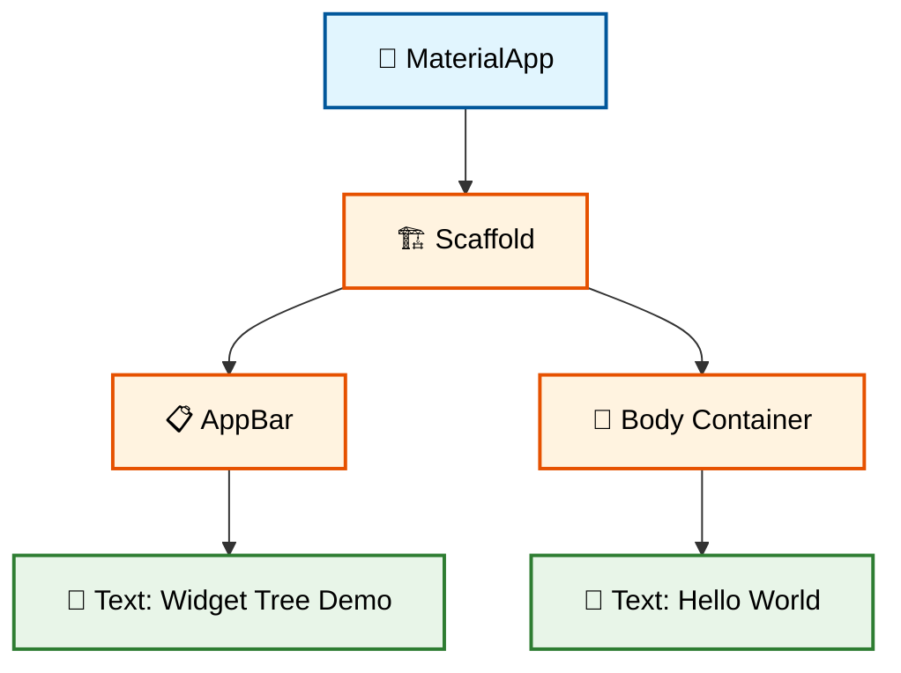
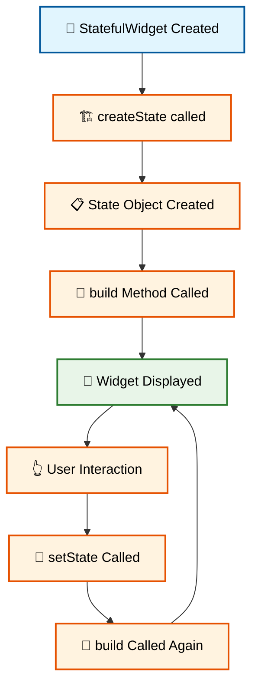
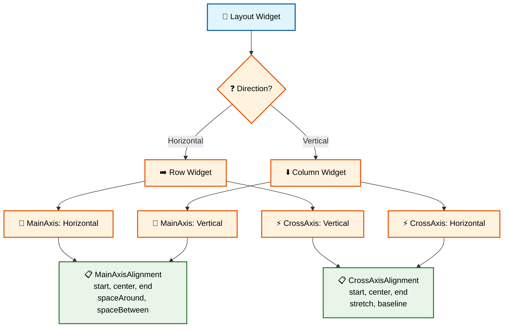
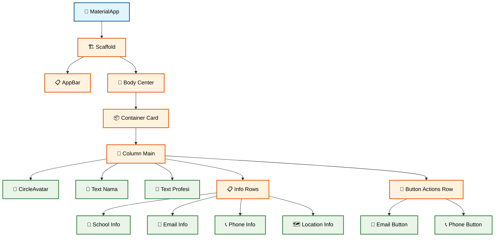
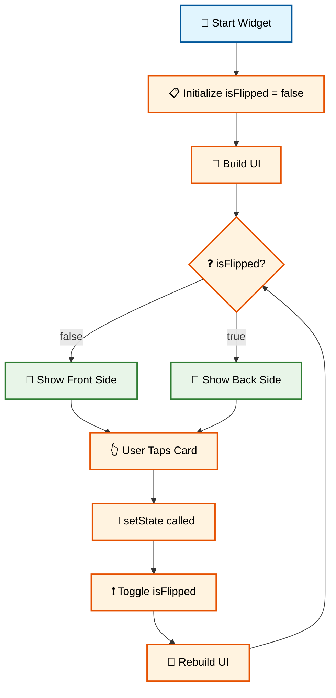

# 🎨 Pertemuan 3: Flutter Widget System dan Layout


---

## 📋 Daftar Isi

1. [🎯 Learning Objectives](#-learning-objectives)
2. [🧩 Widget System Fundamentals](#-widget-system-fundamentals)
3. [📦 Essential Layout Widgets](#-essential-layout-widgets)
4. [🎨 Material Design Components](#-material-design-components)
5. [👨‍💻 Praktikum: Kartu Nama Digital](#-praktikum-kartu-nama-digital)
6. [📝 Assessment & Quiz](#-assessment--quiz)
7. [📖 Daftar Istilah](#-daftar-istilah)
8. [📚 Referensi](#-referensi)

---

## 🎯 Learning Objectives

Setelah menyelesaikan pertemuan ini, mahasiswa diharapkan mampu:

- ✅ **Memahami Widget Tree**: Konsep hierarki widget dalam Flutter
- ✅ **Menguasai Layout Widgets**: Container, Row, Column, Stack untuk positioning
- ✅ **Implementasi Material Design**: Button, Text, AppBar dengan styling sederhana
- ✅ **Membuat UI Sederhana**: Layout responsif untuk berbagai screen size

---

## 🧩 Widget System Fundamentals

### 🤔 Apa itu Widget?

Dalam Flutter, **SEMUA adalah Widget**! Bayangkan widget seperti **LEGO blocks** yang bisa disusun untuk membuat aplikasi.

- **Text** = Widget untuk menampilkan teks
- **Button** = Widget untuk interaksi user
- **Image** = Widget untuk menampilkan gambar
- **Container** = Widget untuk styling dan layout

### 🌳 Widget Tree Concept

```dart
void main() {
  runApp(MyApp());
}

class MyApp extends StatelessWidget {
  @override
  Widget build(BuildContext context) {
    return MaterialApp(
      home: Scaffold(
        appBar: AppBar(
          title: Text('Widget Tree Demo'),
        ),
        body: Container(
          child: Text('Hello World'),
        ),
      ),
    );
  }
}
```

**🔧 [Copy Code]** | **🌐 [Test di zapp.run](https://zapp.run/)**

#### Widget Tree Structure:



### 📊 StatelessWidget vs StatefulWidget

#### 🔒 StatelessWidget - Data Tidak Berubah

```dart
class GreetingWidget extends StatelessWidget {
  final String name;
  
  GreetingWidget({required this.name});
  
  @override
  Widget build(BuildContext context) {
    return Text('Halo, $name!');
  }
}

// Penggunaan
class MyApp extends StatelessWidget {
  @override
  Widget build(BuildContext context) {
    return MaterialApp(
      home: Scaffold(
        body: Center(
          child: GreetingWidget(name: 'Budi'),
        ),
      ),
    );
  }
}
```

**🔧 [Copy Code]** | **🌐 [Test di zapp.run](https://zapp.run/)**

#### 🔄 StatefulWidget - Data Bisa Berubah

```dart
class CounterWidget extends StatefulWidget {
  @override
  _CounterWidgetState createState() => _CounterWidgetState();
}

class _CounterWidgetState extends State<CounterWidget> {
  int counter = 0;
  
  @override
  Widget build(BuildContext context) {
    return Column(
      mainAxisAlignment: MainAxisAlignment.center,
      children: [
        Text('Counter: $counter'),
        ElevatedButton(
          onPressed: () {
            setState(() {
              counter++;
            });
          },
          child: Text('Tambah'),
        ),
      ],
    );
  }
}
```

**🔧 [Copy Code]** | **🌐 [Test di zapp.run](https://zapp.run/)**

#### Widget State Management Flow:



---

## 📦 Essential Layout Widgets

### 📦 Container - Widget Serbaguna

Container adalah widget paling flexible untuk styling dan layout:

```dart
class ContainerDemo extends StatelessWidget {
  @override
  Widget build(BuildContext context) {
    return Scaffold(
      appBar: AppBar(title: Text('Container Demo')),
      body: Column(
        children: [
          // Container Dasar
          Container(
            width: 200,
            height: 100,
            color: Colors.blue,
            child: Text('Container Sederhana'),
          ),
          
          SizedBox(height: 20),
          
          // Container dengan Styling
          Container(
            width: 200,
            height: 100,
            decoration: BoxDecoration(
              color: Colors.red,
              borderRadius: BorderRadius.circular(10),
              border: Border.all(color: Colors.black, width: 2),
            ),
            child: Center(
              child: Text('Styled Container'),
            ),
          ),
          
          SizedBox(height: 20),
          
          // Container dengan Padding & Margin
          Container(
            margin: EdgeInsets.all(10),
            padding: EdgeInsets.all(20),
            color: Colors.green,
            child: Text('Padding & Margin'),
          ),
        ],
      ),
    );
  }
}
```

**🔧 [Copy Code]** | **🌐 [Test di zapp.run](https://zapp.run/)**

### 📏 Row - Layout Horizontal

```dart
class RowDemo extends StatelessWidget {
  @override
  Widget build(BuildContext context) {
    return Scaffold(
      appBar: AppBar(title: Text('Row Demo')),
      body: Column(
        children: [
          // Row Dasar
          Row(
            children: [
              Container(width: 50, height: 50, color: Colors.red),
              Container(width: 50, height: 50, color: Colors.green),
              Container(width: 50, height: 50, color: Colors.blue),
            ],
          ),
          
          SizedBox(height: 20),
          
          // Row dengan MainAxisAlignment
          Row(
            mainAxisAlignment: MainAxisAlignment.spaceEvenly,
            children: [
              Text('Kiri'),
              Text('Tengah'),
              Text('Kanan'),
            ],
          ),
          
          SizedBox(height: 20),
          
          // Row dengan CrossAxisAlignment
          Row(
            crossAxisAlignment: CrossAxisAlignment.start,
            children: [
              Container(width: 50, height: 30, color: Colors.red),
              Container(width: 50, height: 60, color: Colors.green),
              Container(width: 50, height: 40, color: Colors.blue),
            ],
          ),
        ],
      ),
    );
  }
}
```

**🔧 [Copy Code]** | **🌐 [Test di zapp.run](https://zapp.run/)**

### 📐 Column - Layout Vertical

```dart
class ColumnDemo extends StatelessWidget {
  @override
  Widget build(BuildContext context) {
    return Scaffold(
      appBar: AppBar(title: Text('Column Demo')),
      body: Center(
        child: Column(
          mainAxisAlignment: MainAxisAlignment.spaceAround,
          crossAxisAlignment: CrossAxisAlignment.center,
          children: [
            Container(
              width: 100,
              height: 50,
              color: Colors.red,
              child: Center(child: Text('Box 1')),
            ),
            Container(
              width: 150,
              height: 50,
              color: Colors.green,
              child: Center(child: Text('Box 2')),
            ),
            Container(
              width: 80,
              height: 50,
              color: Colors.blue,
              child: Center(child: Text('Box 3')),
            ),
          ],
        ),
      ),
    );
  }
}
```

**🔧 [Copy Code]** | **🌐 [Test di zapp.run](https://zapp.run/)**

#### Row vs Column Alignment:



---

## 🎨 Material Design Components

### 🔘 Buttons - Interaksi User

```dart
class ButtonDemo extends StatelessWidget {
  @override
  Widget build(BuildContext context) {
    return Scaffold(
      appBar: AppBar(title: Text('Button Demo')),
      body: Center(
        child: Column(
          mainAxisAlignment: MainAxisAlignment.spaceEvenly,
          children: [
            // ElevatedButton
            ElevatedButton(
              onPressed: () {
                print('ElevatedButton ditekan');
              },
              child: Text('Elevated Button'),
            ),
            
            // TextButton
            TextButton(
              onPressed: () {
                print('TextButton ditekan');
              },
              child: Text('Text Button'),
            ),
            
            // OutlinedButton
            OutlinedButton(
              onPressed: () {
                print('OutlinedButton ditekan');
              },
              child: Text('Outlined Button'),
            ),
            
            // Button dengan Icon
            ElevatedButton.icon(
              onPressed: () {
                print('Button dengan icon');
              },
              icon: Icon(Icons.star),
              label: Text('Button + Icon'),
            ),
          ],
        ),
      ),
    );
  }
}
```

**🔧 [Copy Code]** | **🌐 [Test di zapp.run](https://zapp.run/)**

### 📝 Text Widgets - Menampilkan Text

```dart
class TextDemo extends StatelessWidget {
  @override
  Widget build(BuildContext context) {
    return Scaffold(
      appBar: AppBar(title: Text('Text Demo')),
      body: Padding(
        padding: EdgeInsets.all(16),
        child: Column(
          crossAxisAlignment: CrossAxisAlignment.start,
          children: [
            // Text Biasa
            Text('Text biasa'),
            
            SizedBox(height: 10),
            
            // Text dengan Style
            Text(
              'Text dengan style',
              style: TextStyle(
                fontSize: 20,
                fontWeight: FontWeight.bold,
                color: Colors.blue,
              ),
            ),
            
            SizedBox(height: 10),
            
            // Text Panjang
            Text(
              'Ini adalah text yang panjang dan akan otomatis wrap ke baris baru jika melebihi lebar layar.',
              textAlign: TextAlign.justify,
            ),
            
            SizedBox(height: 10),
            
            // RichText untuk Multiple Styles
            RichText(
              text: TextSpan(
                text: 'Text dengan ',
                style: TextStyle(color: Colors.black),
                children: [
                  TextSpan(
                    text: 'warna berbeda',
                    style: TextStyle(
                      color: Colors.red,
                      fontWeight: FontWeight.bold,
                    ),
                  ),
                  TextSpan(text: ' dalam satu kalimat.'),
                ],
              ),
            ),
          ],
        ),
      ),
    );
  }
}
```

**🔧 [Copy Code]** | **🌐 [Test di zapp.run](https://zapp.run/)**

### 🖼️ Basic Image dan Icon

```dart
class ImageIconDemo extends StatelessWidget {
  @override
  Widget build(BuildContext context) {
    return Scaffold(
      appBar: AppBar(title: Text('Image & Icon Demo')),
      body: Center(
        child: Column(
          mainAxisAlignment: MainAxisAlignment.spaceEvenly,
          children: [
            // Icon dari Material Design
            Icon(
              Icons.star,
              size: 50,
              color: Colors.yellow,
            ),
            
            // Icon Button
            IconButton(
              onPressed: () {
                print('Icon button ditekan');
              },
              icon: Icon(Icons.favorite),
              iconSize: 40,
              color: Colors.red,
            ),
            
            // Multiple Icons dalam Row
            Row(
              mainAxisAlignment: MainAxisAlignment.spaceEvenly,
              children: [
                Icon(Icons.home, size: 30),
                Icon(Icons.search, size: 30),
                Icon(Icons.settings, size: 30),
                Icon(Icons.person, size: 30),
              ],
            ),
          ],
        ),
      ),
    );
  }
}
```

**🔧 [Copy Code]** | **🌐 [Test di zapp.run](https://zapp.run/)**

---

## 👨‍💻 Praktikum: Kartu Nama Digital

### 🎯 Project Overview

Membuat **Kartu Nama Digital** sederhana untuk mahasiswa Indonesia dengan fitur:
- ✅ **Informasi pribadi** dengan layout yang rapi
- ✅ **Icon dan styling** sederhana
- ✅ **Layout responsif** menggunakan Container, Row, Column

### 🚀 Step 1: Buat Project Structure

```dart
void main() {
  runApp(KartuNamaApp());
}

class KartuNamaApp extends StatelessWidget {
  @override
  Widget build(BuildContext context) {
    return MaterialApp(
      title: 'Kartu Nama Digital',
      theme: ThemeData(
        primarySwatch: Colors.blue,
      ),
      home: KartuNamaPage(),
    );
  }
}
```

**🔧 [Copy Code]** | **🌐 [Test di zapp.run](https://zapp.run/)**

### 🎨 Step 2: Buat Widget Kartu Nama

```dart
class KartuNamaPage extends StatelessWidget {
  @override
  Widget build(BuildContext context) {
    return Scaffold(
      backgroundColor: Colors.grey[100],
      appBar: AppBar(
        title: Text('Kartu Nama Digital'),
        centerTitle: true,
      ),
      body: Center(
        child: Container(
          margin: EdgeInsets.all(20),
          padding: EdgeInsets.all(20),
          decoration: BoxDecoration(
            color: Colors.white,
            borderRadius: BorderRadius.circular(15),
            boxShadow: [
              BoxShadow(
                color: Colors.grey.withOpacity(0.3),
                spreadRadius: 2,
                blurRadius: 5,
                offset: Offset(0, 3),
              ),
            ],
          ),
          child: Column(
            mainAxisSize: MainAxisSize.min,
            children: [
              // Avatar
              CircleAvatar(
                radius: 50,
                backgroundColor: Colors.blue,
                child: Text(
                  'BS',
                  style: TextStyle(
                    fontSize: 30,
                    fontWeight: FontWeight.bold,
                    color: Colors.white,
                  ),
                ),
              ),
              
              SizedBox(height: 20),
              
              // Nama
              Text(
                'Budi Santoso',
                style: TextStyle(
                  fontSize: 24,
                  fontWeight: FontWeight.bold,
                ),
              ),
              
              // Profesi
              Text(
                'Mahasiswa Teknik Informatika',
                style: TextStyle(
                  fontSize: 16,
                  color: Colors.grey[600],
                ),
              ),
              
              SizedBox(height: 20),
              
              // Informasi Kontak
              _buildInfoRow(Icons.school, 'Universitas Indonesia'),
              _buildInfoRow(Icons.email, 'budi@example.com'),
              _buildInfoRow(Icons.phone, '+62 812 3456 7890'),
              _buildInfoRow(Icons.location_on, 'Jakarta, Indonesia'),
              
              SizedBox(height: 20),
              
              // Button Actions
              Row(
                mainAxisAlignment: MainAxisAlignment.spaceEvenly,
                children: [
                  ElevatedButton.icon(
                    onPressed: () {
                      print('Hubungi via email');
                    },
                    icon: Icon(Icons.email, size: 16),
                    label: Text('Email'),
                  ),
                  ElevatedButton.icon(
                    onPressed: () {
                      print('Hubungi via telefon');
                    },
                    icon: Icon(Icons.phone, size: 16),
                    label: Text('Telepon'),
                  ),
                ],
              ),
            ],
          ),
        ),
      ),
    );
  }
  
  // Helper method untuk info row
  Widget _buildInfoRow(IconData icon, String text) {
    return Padding(
      padding: EdgeInsets.symmetric(vertical: 5),
      child: Row(
        children: [
          Icon(
            icon,
            color: Colors.blue,
            size: 20,
          ),
          SizedBox(width: 10),
          Text(
            text,
            style: TextStyle(fontSize: 16),
          ),
        ],
      ),
    );
  }
}
```

**🔧 [Copy Code]** | **🌐 [Test di zapp.run](https://zapp.run/)**

#### Alur Widget Tree Kartu Nama:



### 🔄 Step 3: Membuat Versi Interaktif

```dart
class KartuNamaInteraktif extends StatefulWidget {
  @override
  _KartuNamaInteraktifState createState() => _KartuNamaInteraktifState();
}

class _KartuNamaInteraktifState extends State<KartuNamaInteraktif> {
  bool isFlipped = false;
  
  @override
  Widget build(BuildContext context) {
    return Scaffold(
      appBar: AppBar(title: Text('Kartu Nama Interaktif')),
      body: Center(
        child: GestureDetector(
          onTap: () {
            setState(() {
              isFlipped = !isFlipped;
            });
          },
          child: Container(
            margin: EdgeInsets.all(20),
            padding: EdgeInsets.all(20),
            decoration: BoxDecoration(
              color: isFlipped ? Colors.blue[100] : Colors.white,
              borderRadius: BorderRadius.circular(15),
              boxShadow: [
                BoxShadow(
                  color: Colors.grey.withOpacity(0.3),
                  spreadRadius: 2,
                  blurRadius: 5,
                  offset: Offset(0, 3),
                ),
              ],
            ),
            child: isFlipped ? _buildBackSide() : _buildFrontSide(),
          ),
        ),
      ),
    );
  }
  
  Widget _buildFrontSide() {
    return Column(
      mainAxisSize: MainAxisSize.min,
      children: [
        CircleAvatar(
          radius: 50,
          backgroundColor: Colors.blue,
          child: Text('BS', style: TextStyle(fontSize: 30, color: Colors.white)),
        ),
        SizedBox(height: 20),
        Text(
          'Budi Santoso',
          style: TextStyle(fontSize: 24, fontWeight: FontWeight.bold),
        ),
        Text(
          'Flutter Developer',
          style: TextStyle(fontSize: 16, color: Colors.grey[600]),
        ),
        SizedBox(height: 20),
        Text(
          'Ketuk untuk melihat info lebih lanjut',
          style: TextStyle(fontSize: 12, style: FontStyle.italic),
        ),
      ],
    );
  }
  
  Widget _buildBackSide() {
    return Column(
      mainAxisSize: MainAxisSize.min,
      children: [
        Text(
          'Informasi Kontak',
          style: TextStyle(fontSize: 20, fontWeight: FontWeight.bold),
        ),
        SizedBox(height: 20),
        _buildInfoRow(Icons.email, 'budi@example.com'),
        _buildInfoRow(Icons.phone, '+62 812 3456 7890'),
        _buildInfoRow(Icons.school, 'Universitas Indonesia'),
        _buildInfoRow(Icons.location_on, 'Jakarta, Indonesia'),
        SizedBox(height: 20),
        Text(
          'Ketuk lagi untuk kembali',
          style: TextStyle(fontSize: 12, style: FontStyle.italic),
        ),
      ],
    );
  }
  
  Widget _buildInfoRow(IconData icon, String text) {
    return Padding(
      padding: EdgeInsets.symmetric(vertical: 5),
      child: Row(
        children: [
          Icon(icon, color: Colors.blue, size: 20),
          SizedBox(width: 10),
          Text(text, style: TextStyle(fontSize: 16)),
        ],
      ),
    );
  }
}
```

**🔧 [Copy Code]** | **🌐 [Test di zapp.run](https://zapp.run/)**

#### Alur Interaktivity State Management:



---

## 📝 Assessment & Quiz

### ✅ UI Implementation Project (15%)

**Task**: Membuat halaman profil mahasiswa dengan layout yang rapi

**Requirements:**
1. Gunakan Scaffold sebagai structure dasar
2. Implementasi AppBar dengan title yang sesuai
3. Buat layout dengan Column dan Row
4. Tambahkan Container untuk styling
5. Gunakan minimal 3 jenis button berbeda
6. Responsive untuk portrait orientation

**Submission**: Upload project ke GitHub dengan screenshot hasil

### 🧠 Quiz Widget System (5%)

#### **Soal 1 (25 poin)**
Widget apa yang digunakan untuk layout horizontal?

**A.** Column  
**B.** Row  
**C.** Container  
**D.** Stack  

**Jawaban:** B ✅

#### **Soal 2 (25 poin)**
Perbedaan utama StatelessWidget dan StatefulWidget adalah:

**A.** StatelessWidget untuk layout, StatefulWidget untuk styling  
**B.** StatelessWidget tidak bisa berubah, StatefulWidget bisa berubah datanya  
**C.** StatelessWidget lebih cepat, StatefulWidget lebih lambat  

**Jawaban:** B ✅

#### **Soal 3 (25 poin)**
Method apa yang digunakan untuk update state dalam StatefulWidget?

**Jawaban:** `setState()` ✅

#### **Soal 4 (25 poin)**
MainAxisAlignment.spaceEvenly pada Row akan:

**A.** Meratakan widget ke kiri  
**B.** Meratakan widget dengan jarak sama di antara dan di pinggir  
**C.** Meratakan widget ke tengah  

**Jawaban:** B ✅

### 🏆 Rubrik Penilaian UI Project

| Kriteria | Excellent (A) | Good (B) | Fair (C) | Poor (D) |
|----------|---------------|----------|-----------|----------|
| **Layout Structure** | Perfect hierarchy, proper nesting | Good structure, minor issues | Basic structure works | Poor structure, hard to follow |
| **Widget Usage** | Correct widgets for purpose | Mostly correct choices | Some incorrect usage | Wrong widget choices |
| **Styling** | Clean, consistent, attractive | Good styling, some inconsistency | Basic styling applied | Little to no styling |
| **Code Quality** | Clean, readable, commented | Good structure, readable | Acceptable code quality | Poor code quality |

---

## 📖 Daftar Istilah

| Istilah | Pengertian |
|---------|-------------|
| **Widget** | Building block dasar untuk UI dalam Flutter |
| **Widget Tree** | Hierarki nested widgets yang membentuk UI |
| **StatelessWidget** | Widget yang tidak memiliki state internal yang bisa berubah |
| **StatefulWidget** | Widget yang memiliki state internal yang bisa berubah |
| **BuildContext** | Handle ke lokasi widget dalam widget tree |
| **setState()** | Method untuk memberitahu framework bahwa state telah berubah |
| **Container** | Widget untuk styling dan positioning child widgets |
| **Row** | Widget untuk layout horizontal |
| **Column** | Widget untuk layout vertical |
| **MainAxis** | Axis utama dari layout (horizontal untuk Row, vertical untuk Column) |
| **CrossAxis** | Axis silang dari layout (vertical untuk Row, horizontal untuk Column) |
| **Scaffold** | Material Design structure untuk halaman lengkap |
| **AppBar** | Material Design app bar di bagian atas layar |
| **MaterialApp** | Widget root yang mengatur tema Material Design |
| **EdgeInsets** | Class untuk mendefinisikan padding atau margin |
| **BoxDecoration** | Class untuk styling Container (background, border, dll) |

---

## 📚 Referensi

### 📖 Sumber Utama

1. **Flutter Widget Catalog**. (2025). *Flutter Widget Documentation*. Google LLC. https://docs.flutter.dev/development/ui/widgets

2. **Flutter Layout Guide**. (2025). *Building layouts*. Google LLC. https://docs.flutter.dev/development/ui/layout

3. **Material Design Guidelines**. (2025). *Material Design Components*. Google. https://material.io/components

### 🇮🇩 Sumber Indonesia

4. **Koding Indonesia**. (2025). *Tutorial Flutter Widget Bahasa Indonesia*. https://kodingindonesia.com/tutorial-flutter-widget/

5. **Petani Kode**. (2025). *Belajar Widget Flutter untuk Pemula*. https://www.petanikode.com/flutter-widget/

6. **BuildWithAngga**. (2025). *Flutter UI Design Fundamentals*. https://buildwithangga.com/kelas/flutter-ui-design

### 🛠️ Tools dan Resources

7. **Flutter Inspector**. (2025). *Using the Flutter inspector*. https://docs.flutter.dev/development/tools/flutter-inspector

8. **DartPad Flutter**. (2025). *Online Flutter Editor*. https://dartpad.dev/

---

## 🎯 Next Week Preview

**Pertemuan 4: Navigation dan State Management Dasar**
- ✅ Multi-screen navigation dengan routes
- ✅ Data passing between screens  
- ✅ Form handling dan validation
- ✅ Project: Todo Harian Mahasiswa

---

## 💡 Tips Sukses

1. **🎨 Practice Widget Combinations**: Coba kombinasi berbagai widget
2. **📱 Test di Real Device**: Lihat bagaimana UI terlihat di device nyata
3. **🔍 Use Flutter Inspector**: Tool debugging untuk melihat widget tree
4. **📖 Read Widget Documentation**: Setiap widget punya properties unik
5. **🎯 Keep It Simple**: Start simple, lalu tingkatkan complexity gradually

---

**🎉 Selamat! Anda telah menguasai Flutter Widget System dan Layout!**

Lanjutkan ke **Pertemuan 4** untuk mempelajari Navigation dan State Management! 🚀

---

*© 2025 Mata Kuliah Pemrograman Piranti Bergerak dengan Flutter*  
*Dibuat dengan ❤️ untuk mahasiswa Indonesia*
