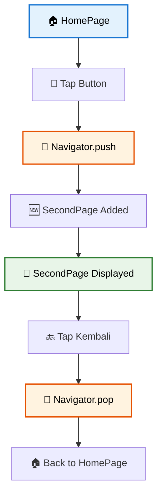
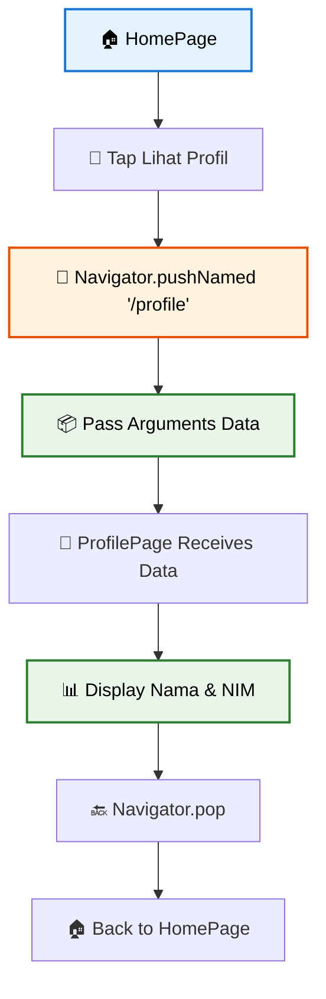
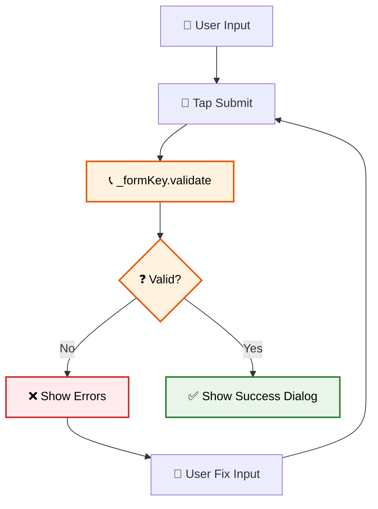
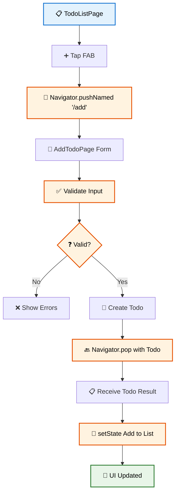

# 🧭 Pertemuan 4: Navigation dan State Management Dasar


---

## 📋 Daftar Isi

1. [🎯 Learning Objectives](#-learning-objectives)
2. [🧭 Navigation Fundamentals](#-navigation-fundamentals)
3. [🔄 State Management dengan setState](#-state-management-dengan-setstate)
4. [📝 Form Handling dan Validation](#-form-handling-dan-validation)
5. [👨‍💻 Praktikum: Todo Sederhana](#-praktikum-todo-sederhana)
6. [📝 Assessment & Quiz](#-assessment--quiz)
7. [📖 Daftar Istilah](#-daftar-istilah)
8. [📚 Referensi](#-referensi)

---

## 🎯 Learning Objectives

Setelah menyelesaikan pertemuan ini, mahasiswa diharapkan mampu:

- ✅ **Menguasai Navigation**: Navigator.push dan Navigator.pop untuk pindah antar screens
- ✅ **Memahami State Management**: setState untuk update UI
- ✅ **Implementasi Form**: Form widgets dan validation sederhana
- ✅ **Build Multi-Screen App**: Todo app dengan navigation dan state management

---

## 🧭 Navigation Fundamentals

### 🗺️ 1. Basic Navigation - Push dan Pop

```dart
import 'package:flutter/material.dart';

void main() {
  runApp(MyApp());
}

class MyApp extends StatelessWidget {
  @override
  Widget build(BuildContext context) {
    return MaterialApp(
      title: 'Navigation Demo',
      home: HomePage(),
    );
  }
}

class HomePage extends StatelessWidget {
  @override
  Widget build(BuildContext context) {
    return Scaffold(
      appBar: AppBar(
        title: Text('Home Page'),
      ),
      body: Center(
        child: Column(
          mainAxisAlignment: MainAxisAlignment.center,
          children: [
            Text('Halaman Utama'),
            SizedBox(height: 20),
            ElevatedButton(
              onPressed: () {
                // Navigate ke halaman kedua
                Navigator.push(
                  context,
                  MaterialPageRoute(builder: (context) => SecondPage()),
                );
              },
              child: Text('Ke Halaman Kedua'),
            ),
          ],
        ),
      ),
    );
  }
}

class SecondPage extends StatelessWidget {
  @override
  Widget build(BuildContext context) {
    return Scaffold(
      appBar: AppBar(
        title: Text('Second Page'),
      ),
      body: Center(
        child: Column(
          mainAxisAlignment: MainAxisAlignment.center,
          children: [
            Text('Halaman Kedua'),
            SizedBox(height: 20),
            ElevatedButton(
              onPressed: () {
                // Kembali ke halaman sebelumnya
                Navigator.pop(context);
              },
              child: Text('Kembali'),
            ),
          ],
        ),
      ),
    );
  }
}
```

🚀 **Coba Sekarang!**  
Copy code di atas dan jalankan di: **[https://zapp.run/](https://zapp.run/)**

#### 📊 Alur Basic Navigation:



### 🗂️ 2. Named Routes dan Passing Data

```dart
import 'package:flutter/material.dart';

void main() {
  runApp(MyApp());
}

class MyApp extends StatelessWidget {
  @override
  Widget build(BuildContext context) {
    return MaterialApp(
      initialRoute: '/',
      routes: {
        '/': (context) => HomePage(),
        '/profile': (context) => ProfilePage(),
      },
    );
  }
}

class HomePage extends StatelessWidget {
  @override
  Widget build(BuildContext context) {
    return Scaffold(
      appBar: AppBar(title: Text('Home')),
      body: Center(
        child: Column(
          mainAxisAlignment: MainAxisAlignment.center,
          children: [
            Text('Selamat Datang!'),
            SizedBox(height: 20),
            ElevatedButton(
              onPressed: () {
                // Passing data ke profile page
                Navigator.pushNamed(
                  context, 
                  '/profile',
                  arguments: {
                    'nama': 'Budi Santoso',
                    'nim': '2021001',
                  }
                );
              },
              child: Text('Lihat Profil'),
            ),
          ],
        ),
      ),
    );
  }
}

class ProfilePage extends StatelessWidget {
  @override
  Widget build(BuildContext context) {
    // Terima data dari arguments
    final Map<String, String> data = 
        ModalRoute.of(context)!.settings.arguments as Map<String, String>;

    return Scaffold(
      appBar: AppBar(title: Text('Profile')),
      body: Center(
        child: Column(
          mainAxisAlignment: MainAxisAlignment.center,
          children: [
            Text('Nama: ${data['nama']}'),
            Text('NIM: ${data['nim']}'),
            SizedBox(height: 20),
            ElevatedButton(
              onPressed: () {
                Navigator.pop(context);
              },
              child: Text('Kembali'),
            ),
          ],
        ),
      ),
    );
  }
}
```

🚀 **Coba Sekarang!**  
Test named routes di: **[https://zapp.run/](https://zapp.run/)**

#### 📊 Alur Named Routes:



---

## 🔄 State Management dengan setState

### 📊 1. Counter App Sederhana

```dart
import 'package:flutter/material.dart';

void main() {
  runApp(MyApp());
}

class MyApp extends StatelessWidget {
  @override
  Widget build(BuildContext context) {
    return MaterialApp(
      home: CounterPage(),
    );
  }
}

class CounterPage extends StatefulWidget {
  @override
  _CounterPageState createState() => _CounterPageState();
}

class _CounterPageState extends State<CounterPage> {
  int _counter = 0;

  void _incrementCounter() {
    setState(() {
      _counter++;
    });
  }

  void _decrementCounter() {
    setState(() {
      if (_counter > 0) {
        _counter--;
      }
    });
  }

  void _resetCounter() {
    setState(() {
      _counter = 0;
    });
  }

  @override
  Widget build(BuildContext context) {
    return Scaffold(
      appBar: AppBar(title: Text('Counter App')),
      body: Center(
        child: Column(
          mainAxisAlignment: MainAxisAlignment.center,
          children: [
            Text('Counter:'),
            Text(
              '$_counter',
              style: TextStyle(fontSize: 48, fontWeight: FontWeight.bold),
            ),
            SizedBox(height: 20),
            Row(
              mainAxisAlignment: MainAxisAlignment.spaceEvenly,
              children: [
                ElevatedButton(
                  onPressed: _decrementCounter,
                  child: Text('-'),
                ),
                ElevatedButton(
                  onPressed: _resetCounter,
                  child: Text('Reset'),
                ),
                ElevatedButton(
                  onPressed: _incrementCounter,
                  child: Text('+'),
                ),
              ],
            ),
          ],
        ),
      ),
    );
  }
}
```

🚀 **Coba Sekarang!**  
Test counter dengan setState di: **[https://zapp.run/](https://zapp.run/)**

#### 📊 Alur setState:

```mermaid
flowchart TD
    A[🔘 User Tap Button] --> B[📞 Call setState]
    B --> C[🔄 Update _counter Variable]
    C --> D[🏗️ Flutter Calls build()]
    D --> E[🎨 Widget Tree Rebuilt]
    E --> F[📱 UI Updated]
    
    style A fill:#e3f2fd,stroke:#1976d2,stroke-width:2px,color:#000
    style B fill:#fff3e0,stroke:#e65100,stroke-width:2px,color:#000
    style C fill:#fff3e0,stroke:#e65100,stroke-width:2px,color:#000
    style D fill:#fff3e0,stroke:#e65100,stroke-width:2px,color:#000
    style F fill:#e8f5e8,stroke:#2e7d32,stroke-width:2px,color:#000
```

### 📋 2. List Management dengan setState

```dart
import 'package:flutter/material.dart';

void main() {
  runApp(MyApp());
}

class MyApp extends StatelessWidget {
  @override
  Widget build(BuildContext context) {
    return MaterialApp(
      home: ListPage(),
    );
  }
}

class ListPage extends StatefulWidget {
  @override
  _ListPageState createState() => _ListPageState();
}

class _ListPageState extends State<ListPage> {
  List<String> _items = ['Item 1', 'Item 2', 'Item 3'];
  final _controller = TextEditingController();

  void _addItem() {
    if (_controller.text.isNotEmpty) {
      setState(() {
        _items.add(_controller.text);
        _controller.clear();
      });
    }
  }

  void _removeItem(int index) {
    setState(() {
      _items.removeAt(index);
    });
  }

  @override
  Widget build(BuildContext context) {
    return Scaffold(
      appBar: AppBar(title: Text('List Management')),
      body: Column(
        children: [
          Padding(
            padding: EdgeInsets.all(16),
            child: Row(
              children: [
                Expanded(
                  child: TextField(
                    controller: _controller,
                    decoration: InputDecoration(
                      hintText: 'Masukkan item baru',
                      border: OutlineInputBorder(),
                    ),
                  ),
                ),
                SizedBox(width: 8),
                ElevatedButton(
                  onPressed: _addItem,
                  child: Text('Tambah'),
                ),
              ],
            ),
          ),
          Expanded(
            child: ListView.builder(
              itemCount: _items.length,
              itemBuilder: (context, index) {
                return ListTile(
                  title: Text(_items[index]),
                  trailing: IconButton(
                    icon: Icon(Icons.delete),
                    onPressed: () => _removeItem(index),
                  ),
                );
              },
            ),
          ),
        ],
      ),
    );
  }
}
```

🚀 **Coba Sekarang!**  
Test list management di: **[https://zapp.run/](https://zapp.run/)**

---

## 📝 Form Handling dan Validation

### 📋 Simple Form dengan Validation

```dart
import 'package:flutter/material.dart';

void main() {
  runApp(MyApp());
}

class MyApp extends StatelessWidget {
  @override
  Widget build(BuildContext context) {
    return MaterialApp(
      home: FormPage(),
    );
  }
}

class FormPage extends StatefulWidget {
  @override
  _FormPageState createState() => _FormPageState();
}

class _FormPageState extends State<FormPage> {
  final _formKey = GlobalKey<FormState>();
  final _namaController = TextEditingController();
  final _emailController = TextEditingController();

  String? _validateNama(String? value) {
    if (value == null || value.isEmpty) {
      return 'Nama tidak boleh kosong';
    }
    if (value.length < 2) {
      return 'Nama minimal 2 karakter';
    }
    return null;
  }

  String? _validateEmail(String? value) {
    if (value == null || value.isEmpty) {
      return 'Email tidak boleh kosong';
    }
    if (!value.contains('@')) {
      return 'Email tidak valid';
    }
    return null;
  }

  void _submitForm() {
    if (_formKey.currentState!.validate()) {
      // Form valid, proses data
      showDialog(
        context: context,
        builder: (context) => AlertDialog(
          title: Text('Berhasil!'),
          content: Text('Data berhasil disimpan:\nNama: ${_namaController.text}\nEmail: ${_emailController.text}'),
          actions: [
            TextButton(
              onPressed: () => Navigator.pop(context),
              child: Text('OK'),
            ),
          ],
        ),
      );
    }
  }

  @override
  Widget build(BuildContext context) {
    return Scaffold(
      appBar: AppBar(title: Text('Form Validation')),
      body: Padding(
        padding: EdgeInsets.all(16),
        child: Form(
          key: _formKey,
          child: Column(
            children: [
              TextFormField(
                controller: _namaController,
                decoration: InputDecoration(
                  labelText: 'Nama',
                  border: OutlineInputBorder(),
                ),
                validator: _validateNama,
              ),
              SizedBox(height: 16),
              TextFormField(
                controller: _emailController,
                decoration: InputDecoration(
                  labelText: 'Email',
                  border: OutlineInputBorder(),
                ),
                validator: _validateEmail,
              ),
              SizedBox(height: 20),
              ElevatedButton(
                onPressed: _submitForm,
                child: Text('Submit'),
              ),
            ],
          ),
        ),
      ),
    );
  }
}
```

🚀 **Coba Sekarang!**  
Test form validation di: **[https://zapp.run/](https://zapp.run/)**

#### 📊 Alur Form Validation:



---

## 👨‍💻 Praktikum: Todo Sederhana

Mari buat aplikasi Todo sederhana yang menggabungkan navigation, state management, dan form handling:

```dart
import 'package:flutter/material.dart';

void main() {
  runApp(TodoApp());
}

// Model untuk Todo
class Todo {
  String id;
  String title;
  String description;
  bool isCompleted;

  Todo({
    required this.id,
    required this.title,
    required this.description,
    this.isCompleted = false,
  });
}

class TodoApp extends StatelessWidget {
  @override
  Widget build(BuildContext context) {
    return MaterialApp(
      title: 'Todo App',
      initialRoute: '/',
      routes: {
        '/': (context) => TodoListPage(),
        '/add': (context) => AddTodoPage(),
      },
    );
  }
}

// Halaman utama daftar todo
class TodoListPage extends StatefulWidget {
  @override
  _TodoListPageState createState() => _TodoListPageState();
}

class _TodoListPageState extends State<TodoListPage> {
  List<Todo> _todos = [
    Todo(id: '1', title: 'Belajar Flutter', description: 'Pelajari Navigation dan State Management'),
    Todo(id: '2', title: 'Mengerjakan Tugas', description: 'Tugas Pemrograman Mobile'),
  ];

  void _addTodo(Todo newTodo) {
    setState(() {
      _todos.add(newTodo);
    });
  }

  void _toggleTodo(String id) {
    setState(() {
      int index = _todos.indexWhere((todo) => todo.id == id);
      if (index != -1) {
        _todos[index].isCompleted = !_todos[index].isCompleted;
      }
    });
  }

  void _deleteTodo(String id) {
    setState(() {
      _todos.removeWhere((todo) => todo.id == id);
    });
  }

  @override
  Widget build(BuildContext context) {
    return Scaffold(
      appBar: AppBar(
        title: Text('Todo List'),
      ),
      body: _todos.isEmpty
          ? Center(
              child: Text('Belum ada todo. Tambahkan yang pertama!'),
            )
          : ListView.builder(
              itemCount: _todos.length,
              itemBuilder: (context, index) {
                final todo = _todos[index];
                return Card(
                  margin: EdgeInsets.all(8),
                  child: ListTile(
                    leading: Checkbox(
                      value: todo.isCompleted,
                      onChanged: (value) => _toggleTodo(todo.id),
                    ),
                    title: Text(
                      todo.title,
                      style: TextStyle(
                        decoration: todo.isCompleted 
                            ? TextDecoration.lineThrough 
                            : TextDecoration.none,
                      ),
                    ),
                    subtitle: Text(todo.description),
                    trailing: IconButton(
                      icon: Icon(Icons.delete, color: Colors.red),
                      onPressed: () => _deleteTodo(todo.id),
                    ),
                  ),
                );
              },
            ),
      floatingActionButton: FloatingActionButton(
        onPressed: () async {
          final result = await Navigator.pushNamed(context, '/add');
          if (result != null && result is Todo) {
            _addTodo(result);
          }
        },
        child: Icon(Icons.add),
      ),
    );
  }
}

// Halaman tambah todo
class AddTodoPage extends StatefulWidget {
  @override
  _AddTodoPageState createState() => _AddTodoPageState();
}

class _AddTodoPageState extends State<AddTodoPage> {
  final _formKey = GlobalKey<FormState>();
  final _titleController = TextEditingController();
  final _descriptionController = TextEditingController();

  String? _validateTitle(String? value) {
    if (value == null || value.isEmpty) {
      return 'Judul tidak boleh kosong';
    }
    if (value.length < 3) {
      return 'Judul minimal 3 karakter';
    }
    return null;
  }

  String? _validateDescription(String? value) {
    if (value == null || value.isEmpty) {
      return 'Deskripsi tidak boleh kosong';
    }
    return null;
  }

  void _saveTodo() {
    if (_formKey.currentState!.validate()) {
      final newTodo = Todo(
        id: DateTime.now().millisecondsSinceEpoch.toString(),
        title: _titleController.text,
        description: _descriptionController.text,
      );
      
      Navigator.pop(context, newTodo);
    }
  }

  @override
  Widget build(BuildContext context) {
    return Scaffold(
      appBar: AppBar(
        title: Text('Tambah Todo'),
        actions: [
          TextButton(
            onPressed: _saveTodo,
            child: Text('SIMPAN', style: TextStyle(color: Colors.white)),
          ),
        ],
      ),
      body: Padding(
        padding: EdgeInsets.all(16),
        child: Form(
          key: _formKey,
          child: Column(
            children: [
              TextFormField(
                controller: _titleController,
                decoration: InputDecoration(
                  labelText: 'Judul Todo',
                  border: OutlineInputBorder(),
                ),
                validator: _validateTitle,
              ),
              SizedBox(height: 16),
              TextFormField(
                controller: _descriptionController,
                decoration: InputDecoration(
                  labelText: 'Deskripsi',
                  border: OutlineInputBorder(),
                ),
                maxLines: 3,
                validator: _validateDescription,
              ),
              SizedBox(height: 20),
              SizedBox(
                width: double.infinity,
                child: ElevatedButton(
                  onPressed: _saveTodo,
                  child: Text('SIMPAN TODO'),
                ),
              ),
            ],
          ),
        ),
      ),
    );
  }

  @override
  void dispose() {
    _titleController.dispose();
    _descriptionController.dispose();
    super.dispose();
  }
}
```

🚀 **Coba Sekarang!**  
Copy todo app lengkap dan test di: **[https://zapp.run/](https://zapp.run/)**

#### 📊 Alur Todo App:



---

## 📝 Assessment & Quiz

### ✅ Todo App Assignment (15%)

**Task**: Extend todo app dengan fitur:
1. Edit todo functionality
2. Filter berdasarkan status (completed/pending)
3. Search todo berdasarkan title
4. Count total/completed todos

### 🧠 Quiz (10%)

#### **Soal 1 (25 poin)**
Apa fungsi `Navigator.push`?

**A.** Menghapus screen
**B.** Menambah screen baru ke stack
**C.** Mengganti screen
**D.** Reset navigation

**Jawaban:** B ✅

#### **Soal 2 (25 poin)**
Kapan `setState` dipanggil?

**A.** Setiap build
**B.** Saat app dimulai
**C.** Ketika ingin update UI
**D.** Otomatis oleh Flutter

**Jawaban:** C ✅

#### **Soal 3 (25 poin)**
Cara passing data antar screen?

**A.** Global variable
**B.** Navigator arguments
**C.** SharedPreferences
**D.** Database

**Jawaban:** B ✅

#### **Soal 4 (25 poin)**
Fungsi form validation?

**A.** Styling form
**B.** Memastikan input valid
**C.** Submit otomatis
**D.** Reset form

**Jawaban:** B ✅

---

## 📖 Daftar Istilah

| Istilah | Pengertian |
|---------|-------------|
| **Navigator** | Class untuk mengelola navigation stack |
| **Route** | Representasi screen/page dalam aplikasi |
| **setState** | Method untuk update state dan rebuild UI |
| **Form** | Widget untuk input fields dan validation |
| **FormKey** | Key untuk mengakses form state |
| **Validator** | Function untuk validasi input |

---

## 📚 Referensi

### 📖 Sumber Utama

1. **Flutter Navigation Documentation**. (2025). https://docs.flutter.dev/ui/navigation
2. **Flutter State Management Guide**. (2025). https://docs.flutter.dev/data-and-backend/state-mgmt
3. **Flutter Form Documentation**. (2025). https://docs.flutter.dev/ui/widgets/forms

### 🇮🇩 Sumber Indonesia

4. **Koding Indonesia**. (2025). *Tutorial Navigation Flutter*. https://kodingindonesia.com/
5. **Flutter Indonesia**. (2025). *State Management Basics*. https://flutter-indonesia.github.io/

---

## 🎯 Next Week Preview

**Pertemuan 5: Lists, Grids, dan Dynamic Content**
- ✅ ListView.builder untuk large datasets
- ✅ GridView implementation
- ✅ Data persistence dengan SharedPreferences
- ✅ Project: Menu Warung Digital

---

**🎉 Selamat! Anda telah menguasai Navigation dan State Management!**

Lanjutkan ke **Pertemuan 5** untuk Lists dan Dynamic Content! 🚀

---

*© 2025 Mata Kuliah Pemrograman Piranti Bergerak dengan Flutter*  
*Dibuat dengan ❤️ untuk mahasiswa Indonesia*
