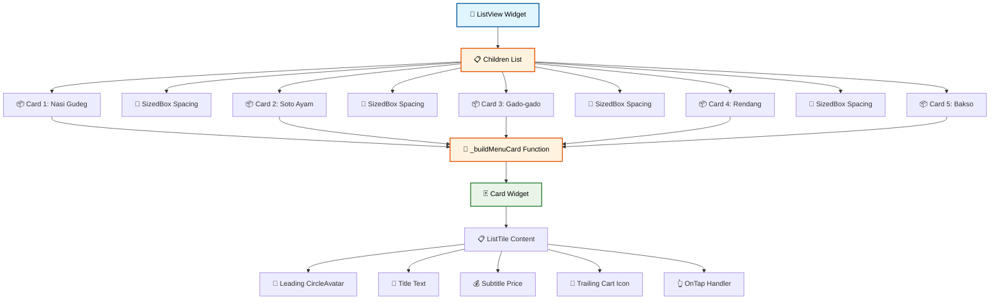
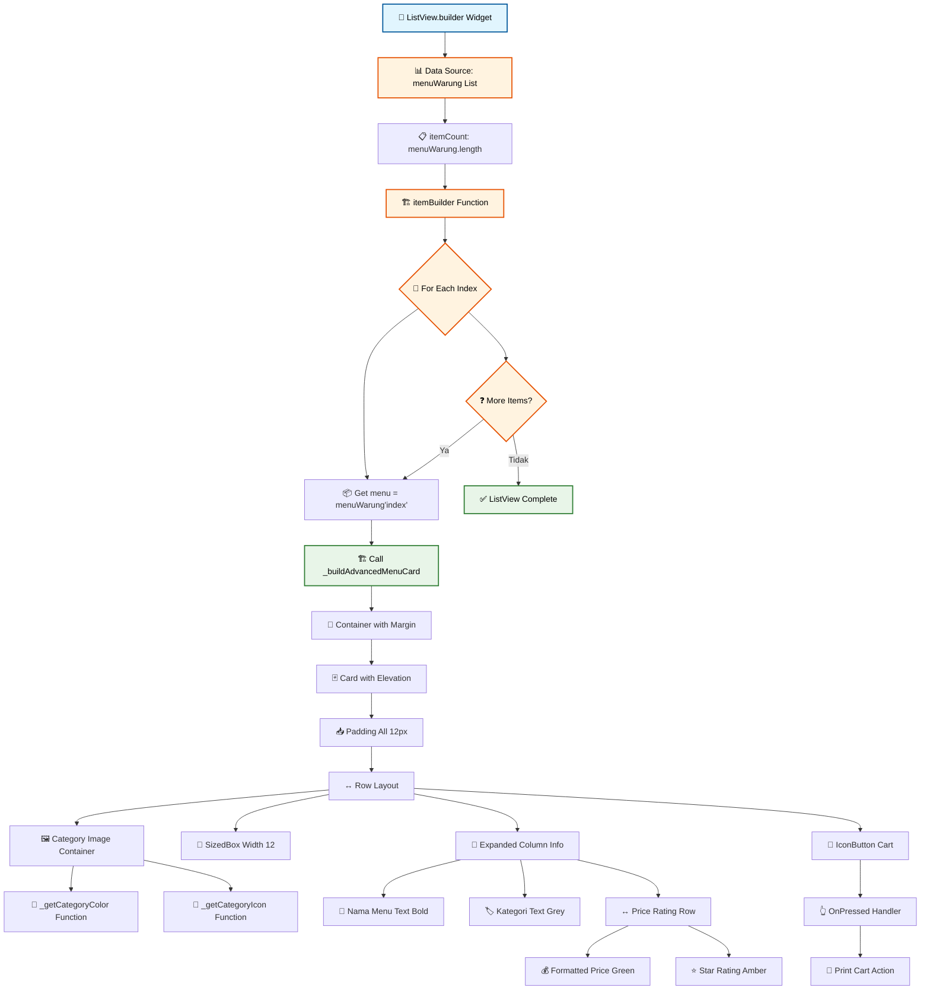
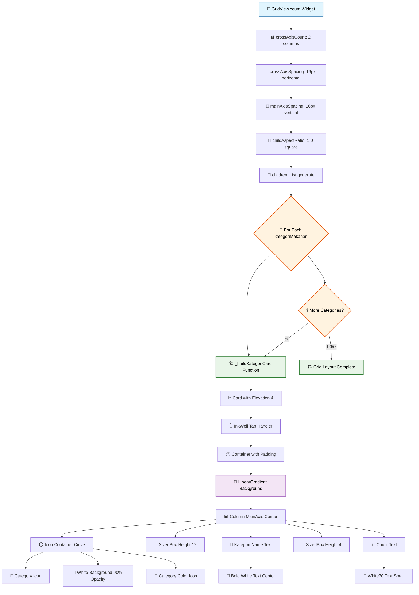
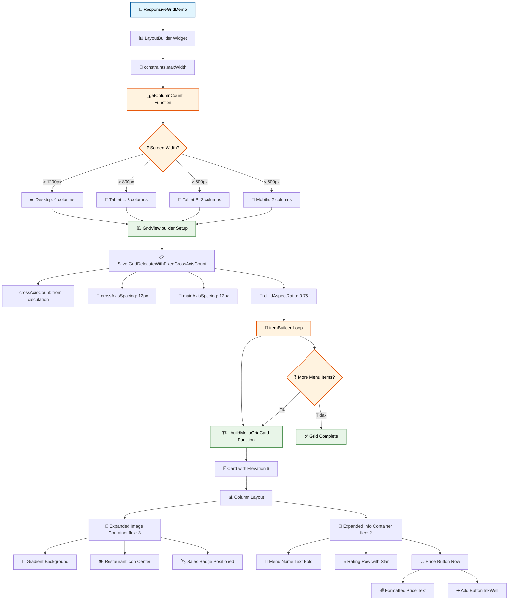
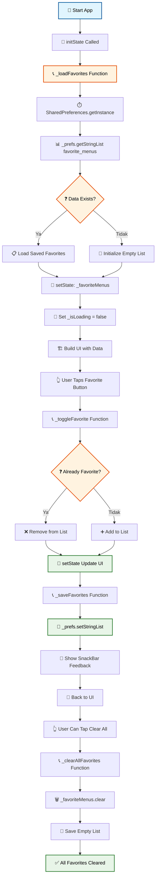
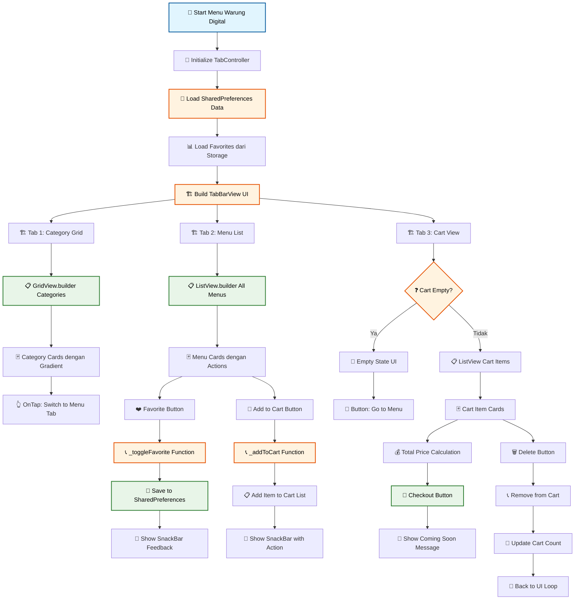

# 📋 Pertemuan 5: Lists, Grids, dan Dynamic Content


---

## 📋 Daftar Isi

1. [🎯 Learning Objectives](#-learning-objectives)
2. [📜 ListView untuk Dynamic Content](#-listview-untuk-dynamic-content)
3. [🏗️ GridView Implementation](#️-gridview-implementation)
4. [⚡ Performance Optimization](#-performance-optimization)
5. [💾 Data Persistence dengan SharedPreferences](#-data-persistence-dengan-sharedpreferences)
6. [👨‍💻 Praktikum: Menu Warung Digital](#-praktikum-menu-warung-digital)
7. [📝 Assessment & Quiz](#-assessment--quiz)
8. [📖 Daftar Istilah](#-daftar-istilah)
9. [📚 Referensi](#-referensi)

---

## 🎯 Learning Objectives

Setelah menyelesaikan pertemuan ini, mahasiswa diharapkan mampu:

- ✅ **Menguasai ListView**: ListView.builder vs ListView untuk large datasets
- ✅ **Implementasi GridView**: GridView responsive untuk berbagai ukuran screen
- ✅ **Performance Optimization**: Scroll controllers dan lazy loading untuk performa optimal
- ✅ **Data Persistence**: SharedPreferences untuk local storage sederhana
- ✅ **Build Project**: Membuat Menu Warung Digital dengan dynamic content

---

## 📜 ListView untuk Dynamic Content

### 🤔 Mengapa ListView Penting?

Dalam aplikasi mobile, kita sering perlu menampilkan **daftar data yang dinamis** seperti:
- 📱 **Daftar kontak** di phonebook
- 🛒 **Katalog produk** di e-commerce
- 📰 **Feed berita** di aplikasi news
- 🍽️ **Menu makanan** di aplikasi warung

**ListView** adalah widget Flutter yang perfect untuk menampilkan scrollable list of widgets!

### 📊 ListView vs ListView.builder

#### 💻 ListView Basic - Untuk Data Sedikit

```dart
import 'package:flutter/material.dart';

void main() {
  runApp(ListViewBasicDemo());
}

class ListViewBasicDemo extends StatelessWidget {
  @override
  Widget build(BuildContext context) {
    return MaterialApp(
      home: Scaffold(
        appBar: AppBar(
          title: Text('ListView Basic Demo'),
          backgroundColor: Colors.orange,
          foregroundColor: Colors.white,
        ),
        body: ListView(
          padding: EdgeInsets.all(16),
          children: [
            // Card untuk setiap item
            _buildMenuCard('Nasi Gudeg', 'Rp 15.000', Icons.rice_bowl),
            SizedBox(height: 8),
            _buildMenuCard('Soto Ayam', 'Rp 12.000', Icons.soup_kitchen),
            SizedBox(height: 8),
            _buildMenuCard('Gado-gado', 'Rp 10.000', Icons.eco),
            SizedBox(height: 8),
            _buildMenuCard('Rendang', 'Rp 20.000', Icons.local_fire_department),
            SizedBox(height: 8),
            _buildMenuCard('Bakso', 'Rp 8.000', Icons.sports_baseball),
          ],
        ),
      ),
    );
  }

  Widget _buildMenuCard(String nama, String harga, IconData icon) {
    return Card(
      elevation: 4,
      child: ListTile(
        leading: CircleAvatar(
          backgroundColor: Colors.orange[100],
          child: Icon(icon, color: Colors.orange[700]),
        ),
        title: Text(
          nama,
          style: TextStyle(fontWeight: FontWeight.bold),
        ),
        subtitle: Text(harga),
        trailing: Icon(Icons.add_shopping_cart),
        onTap: () {
          print('Dipilih: $nama');
        },
      ),
    );
  }
}
```

🚀 **Coba Sekarang!**  
Silakan copy code di atas dan coba jalankan di: **[https://zapp.run/](https://zapp.run/)**

#### 📊 Alur ListView Basic:



#### ⚡ ListView.builder - Untuk Data Banyak (RECOMMENDED)

```dart
import 'package:flutter/material.dart';

void main() {
  runApp(ListViewBuilderDemo());
}

class ListViewBuilderDemo extends StatelessWidget {
  // Data menu warung yang banyak
  final List<Map<String, dynamic>> menuWarung = [
    {'nama': 'Nasi Gudeg', 'harga': 15000, 'kategori': 'Makanan Berat', 'rating': 4.8},
    {'nama': 'Soto Ayam', 'harga': 12000, 'kategori': 'Makanan Berat', 'rating': 4.6},
    {'nama': 'Gado-gado', 'harga': 10000, 'kategori': 'Makanan Sehat', 'rating': 4.4},
    {'nama': 'Rendang', 'harga': 20000, 'kategori': 'Makanan Berat', 'rating': 4.9},
    {'nama': 'Bakso', 'harga': 8000, 'kategori': 'Makanan Ringan', 'rating': 4.3},
    {'nama': 'Mie Ayam', 'harga': 9000, 'kategori': 'Makanan Ringan', 'rating': 4.2},
    {'nama': 'Nasi Padang', 'harga': 18000, 'kategori': 'Makanan Berat', 'rating': 4.7},
    {'nama': 'Satay Ayam', 'harga': 16000, 'kategori': 'Makanan Bakar', 'rating': 4.5},
    {'nama': 'Es Teh Manis', 'harga': 3000, 'kategori': 'Minuman', 'rating': 4.1},
    {'nama': 'Es Jeruk', 'harga': 4000, 'kategori': 'Minuman', 'rating': 4.0},
    {'nama': 'Kopi Tubruk', 'harga': 5000, 'kategori': 'Minuman', 'rating': 4.4},
    {'nama': 'Nasi Liwet', 'harga': 13000, 'kategori': 'Makanan Berat', 'rating': 4.3},
  ];

  @override
  Widget build(BuildContext context) {
    return MaterialApp(
      home: Scaffold(
        appBar: AppBar(
          title: Text('Menu Warung Pak Budi'),
          backgroundColor: Colors.green,
          foregroundColor: Colors.white,
          actions: [
            IconButton(
              icon: Icon(Icons.search),
              onPressed: () {},
            ),
          ],
        ),
        body: Column(
          children: [
            // Header info
            Container(
              padding: EdgeInsets.all(16),
              color: Colors.green[50],
              child: Row(
                children: [
                  Icon(Icons.store, color: Colors.green),
                  SizedBox(width: 8),
                  Text(
                    '${menuWarung.length} Menu Tersedia',
                    style: TextStyle(fontWeight: FontWeight.bold),
                  ),
                  Spacer(),
                  Text('⭐ 4.5'),
                ],
              ),
            ),
            
            // ListView.builder untuk performance optimal
            Expanded(
              child: ListView.builder(
                padding: EdgeInsets.all(16),
                itemCount: menuWarung.length,
                itemBuilder: (context, index) {
                  final menu = menuWarung[index];
                  return _buildAdvancedMenuCard(menu, index);
                },
              ),
            ),
          ],
        ),
      ),
    );
  }

  Widget _buildAdvancedMenuCard(Map<String, dynamic> menu, int index) {
    return Container(
      margin: EdgeInsets.only(bottom: 12),
      child: Card(
        elevation: 3,
        shape: RoundedRectangleBorder(borderRadius: BorderRadius.circular(12)),
        child: Padding(
          padding: EdgeInsets.all(12),
          child: Row(
            children: [
              // Gambar placeholder
              Container(
                width: 60,
                height: 60,
                decoration: BoxDecoration(
                  color: _getCategoryColor(menu['kategori']),
                  borderRadius: BorderRadius.circular(8),
                ),
                child: Icon(
                  _getCategoryIcon(menu['kategori']),
                  color: Colors.white,
                  size: 30,
                ),
              ),
              
              SizedBox(width: 12),
              
              // Info menu
              Expanded(
                child: Column(
                  crossAxisAlignment: CrossAxisAlignment.start,
                  children: [
                    Text(
                      menu['nama'],
                      style: TextStyle(
                        fontSize: 16,
                        fontWeight: FontWeight.bold,
                      ),
                    ),
                    
                    SizedBox(height: 4),
                    
                    Text(
                      menu['kategori'],
                      style: TextStyle(
                        color: Colors.grey[600],
                        fontSize: 12,
                      ),
                    ),
                    
                    SizedBox(height: 4),
                    
                    Row(
                      children: [
                        Text(
                          'Rp ${_formatHarga(menu['harga'])}',
                          style: TextStyle(
                            color: Colors.green[700],
                            fontWeight: FontWeight.w600,
                          ),
                        ),
                        Spacer(),
                        Icon(Icons.star, color: Colors.amber, size: 16),
                        Text(
                          '${menu['rating']}',
                          style: TextStyle(fontSize: 12),
                        ),
                      ],
                    ),
                  ],
                ),
              ),
              
              // Action button
              IconButton(
                onPressed: () {
                  print('Tambah ke keranjang: ${menu['nama']}');
                },
                icon: Icon(Icons.add_shopping_cart),
                color: Colors.green,
              ),
            ],
          ),
        ),
      ),
    );
  }

  Color _getCategoryColor(String kategori) {
    switch (kategori) {
      case 'Makanan Berat': return Colors.red[400]!;
      case 'Makanan Ringan': return Colors.orange[400]!;
      case 'Makanan Sehat': return Colors.green[400]!;
      case 'Makanan Bakar': return Colors.brown[400]!;
      case 'Minuman': return Colors.blue[400]!;
      default: return Colors.grey[400]!;
    }
  }

  IconData _getCategoryIcon(String kategori) {
    switch (kategori) {
      case 'Makanan Berat': return Icons.rice_bowl;
      case 'Makanan Ringan': return Icons.fastfood;
      case 'Makanan Sehat': return Icons.eco;
      case 'Makanan Bakar': return Icons.outdoor_grill;
      case 'Minuman': return Icons.local_drink;
      default: return Icons.restaurant;
    }
  }

  String _formatHarga(int harga) {
    return harga.toString().replaceAllMapped(
      RegExp(r'(\d{1,3})(?=(\d{3})+(?!\d))'),
      (Match m) => '${m[1]}.',
    );
  }
}
```

🚀 **Coba Sekarang!**  
Silakan copy code ListView.builder di atas dan test di: **[https://zapp.run/](https://zapp.run/)**

#### 📊 Alur ListView.builder:



### 🔄 Perbedaan ListView vs ListView.builder

| Aspek | ListView | ListView.builder |
|-------|----------|------------------|
| **Kapan Digunakan** | Data sedikit (< 20 items) | Data banyak (> 20 items) |
| **Memory Usage** | Load semua widget sekaligus | Load hanya yang terlihat (lazy loading) |
| **Performance** | Lambat untuk data banyak | Cepat untuk data banyak |
| **Scroll Performance** | Lag saat scroll | Smooth scrolling |
| **Implementasi** | Simple, langsung children | Perlu itemBuilder function |
| **Use Case** | Static menu kecil | Dynamic data dari API |

---

## 🏗️ GridView Implementation

### 🤔 Kapan Menggunakan GridView?

**GridView** perfect untuk menampilkan data dalam **grid layout** seperti:
- 🖼️ **Galeri foto** Instagram-style
- 🛍️ **Katalog produk** e-commerce  
- 📱 **App launcher** icon grid
- 🍕 **Menu makanan** dengan gambar besar

### 🏢 GridView.count - Fixed Column Count

#### 💻 GridView Basic Implementation

```dart
import 'package:flutter/material.dart';

void main() {
  runApp(GridViewDemo());
}

class GridViewDemo extends StatelessWidget {
  // Data kategori makanan Indonesia
  final List<Map<String, dynamic>> kategoriMakanan = [
    {'nama': 'Makanan Berat', 'icon': Icons.rice_bowl, 'color': Colors.red, 'count': 15},
    {'nama': 'Makanan Ringan', 'icon': Icons.fastfood, 'color': Colors.orange, 'count': 8},
    {'nama': 'Minuman', 'icon': Icons.local_drink, 'color': Colors.blue, 'count': 12},
    {'nama': 'Dessert', 'icon': Icons.cake, 'color': Colors.pink, 'count': 6},
    {'nama': 'Makanan Bakar', 'icon': Icons.outdoor_grill, 'color': Colors.brown, 'count': 5},
    {'nama': 'Makanan Sehat', 'icon': Icons.eco, 'color': Colors.green, 'count': 7},
    {'nama': 'Jajanan Pasar', 'icon': Icons.store, 'color': Colors.purple, 'count': 10},
    {'nama': 'Makanan Tradisional', 'icon': Icons.restaurant, 'color': Colors.amber, 'count': 9},
  ];

  @override
  Widget build(BuildContext context) {
    return MaterialApp(
      home: Scaffold(
        appBar: AppBar(
          title: Text('Kategori Menu Warung'),
          backgroundColor: Colors.teal,
          foregroundColor: Colors.white,
        ),
        body: Padding(
          padding: EdgeInsets.all(16),
          child: Column(
            crossAxisAlignment: CrossAxisAlignment.start,
            children: [
              // Header
              Text(
                'Pilih Kategori Makanan',
                style: TextStyle(
                  fontSize: 20,
                  fontWeight: FontWeight.bold,
                ),
              ),
              SizedBox(height: 16),
              
              // GridView.count dengan 2 kolom
              Expanded(
                child: GridView.count(
                  crossAxisCount: 2, // 2 kolom
                  crossAxisSpacing: 16, // Jarak horizontal
                  mainAxisSpacing: 16, // Jarak vertical
                  childAspectRatio: 1.0, // Rasio width:height = 1:1 (square)
                  children: List.generate(
                    kategoriMakanan.length,
                    (index) => _buildKategoriCard(kategoriMakanan[index]),
                  ),
                ),
              ),
            ],
          ),
        ),
      ),
    );
  }

  Widget _buildKategoriCard(Map<String, dynamic> kategori) {
    return Card(
      elevation: 4,
      shape: RoundedRectangleBorder(
        borderRadius: BorderRadius.circular(16),
      ),
      child: InkWell(
        onTap: () {
          print('Dipilih kategori: ${kategori['nama']}');
        },
        borderRadius: BorderRadius.circular(16),
        child: Container(
          padding: EdgeInsets.all(16),
          decoration: BoxDecoration(
            borderRadius: BorderRadius.circular(16),
            gradient: LinearGradient(
              begin: Alignment.topLeft,
              end: Alignment.bottomRight,
              colors: [
                kategori['color'].withOpacity(0.7),
                kategori['color'].withOpacity(0.5),
              ],
            ),
          ),
          child: Column(
            mainAxisAlignment: MainAxisAlignment.center,
            children: [
              // Icon kategori
              Container(
                padding: EdgeInsets.all(12),
                decoration: BoxDecoration(
                  color: Colors.white.withOpacity(0.9),
                  shape: BoxShape.circle,
                ),
                child: Icon(
                  kategori['icon'],
                  size: 30,
                  color: kategori['color'],
                ),
              ),
              
              SizedBox(height: 12),
              
              // Nama kategori
              Text(
                kategori['nama'],
                textAlign: TextAlign.center,
                style: TextStyle(
                  color: Colors.white,
                  fontWeight: FontWeight.bold,
                  fontSize: 14,
                ),
              ),
              
              SizedBox(height: 4),
              
              // Jumlah items
              Text(
                '${kategori['count']} menu',
                style: TextStyle(
                  color: Colors.white70,
                  fontSize: 12,
                ),
              ),
            ],
          ),
        ),
      ),
    );
  }
}
```

🚀 **Coba Sekarang!**  
Silakan copy code GridView.count di atas dan eksperimen di: **[https://zapp.run/](https://zapp.run/)**

#### 📊 Alur GridView.count:



### 📱 GridView.builder - Untuk Data Dinamis

#### 💻 Responsive GridView Implementation

```dart
import 'package:flutter/material.dart';

void main() {
  runApp(ResponsiveGridDemo());
}

class ResponsiveGridDemo extends StatelessWidget {
  // Data menu lengkap dengan gambar placeholder
  final List<Map<String, dynamic>> menuLengkap = [
    {'nama': 'Nasi Gudeg', 'harga': 15000, 'rating': 4.8, 'terjual': 45},
    {'nama': 'Soto Ayam', 'harga': 12000, 'rating': 4.6, 'terjual': 32},
    {'nama': 'Gado-gado', 'harga': 10000, 'rating': 4.4, 'terjual': 28},
    {'nama': 'Rendang', 'harga': 20000, 'rating': 4.9, 'terjual': 50},
    {'nama': 'Bakso', 'harga': 8000, 'rating': 4.3, 'terjual': 65},
    {'nama': 'Mie Ayam', 'harga': 9000, 'rating': 4.2, 'terjual': 38},
    {'nama': 'Nasi Padang', 'harga': 18000, 'rating': 4.7, 'terjual': 42},
    {'nama': 'Satay Ayam', 'harga': 16000, 'rating': 4.5, 'terjual': 35},
    {'nama': 'Ayam Bakar', 'harga': 17000, 'rating': 4.6, 'terjual': 25},
    {'nama': 'Pecel Lele', 'harga': 11000, 'rating': 4.4, 'terjual': 30},
    {'nama': 'Nasi Liwet', 'harga': 13000, 'rating': 4.3, 'terjual': 22},
    {'nama': 'Rujak Cingur', 'harga': 8000, 'rating': 4.1, 'terjual': 18},
  ];

  @override
  Widget build(BuildContext context) {
    return MaterialApp(
      home: Scaffold(
        appBar: AppBar(
          title: Text('Menu Warung Grid'),
          backgroundColor: Colors.deepOrange,
          foregroundColor: Colors.white,
          actions: [
            IconButton(icon: Icon(Icons.filter_list), onPressed: () {}),
            IconButton(icon: Icon(Icons.search), onPressed: () {}),
          ],
        ),
        body: Column(
          children: [
            // Stats header
            Container(
              padding: EdgeInsets.all(16),
              color: Colors.deepOrange[50],
              child: Row(
                mainAxisAlignment: MainAxisAlignment.spaceAround,
                children: [
                  _buildStatItem('Total Menu', '${menuLengkap.length}', Icons.restaurant),
                  _buildStatItem('Rating', '4.5⭐', Icons.star),
                  _buildStatItem('Terjual Hari Ini', '${_getTotalTerjual()}', Icons.shopping_cart),
                ],
              ),
            ),
            
            // GridView.builder dengan responsive columns
            Expanded(
              child: LayoutBuilder(
                builder: (context, constraints) {
                  // Responsive column count berdasarkan lebar screen
                  int columnCount = _getColumnCount(constraints.maxWidth);
                  
                  return GridView.builder(
                    padding: EdgeInsets.all(16),
                    gridDelegate: SliverGridDelegateWithFixedCrossAxisCount(
                      crossAxisCount: columnCount,
                      crossAxisSpacing: 12,
                      mainAxisSpacing: 12,
                      childAspectRatio: 0.75, // Slightly taller than square
                    ),
                    itemCount: menuLengkap.length,
                    itemBuilder: (context, index) {
                      return _buildMenuGridCard(menuLengkap[index]);
                    },
                  );
                },
              ),
            ),
          ],
        ),
      ),
    );
  }

  int _getColumnCount(double width) {
    if (width > 1200) return 4; // Desktop
    if (width > 800) return 3;  // Tablet landscape
    if (width > 600) return 2;  // Tablet portrait
    return 2; // Mobile
  }

  Widget _buildStatItem(String label, String value, IconData icon) {
    return Column(
      children: [
        Icon(icon, color: Colors.deepOrange),
        SizedBox(height: 4),
        Text(
          value,
          style: TextStyle(fontWeight: FontWeight.bold, fontSize: 16),
        ),
        Text(
          label,
          style: TextStyle(fontSize: 12, color: Colors.grey[600]),
        ),
      ],
    );
  }

  Widget _buildMenuGridCard(Map<String, dynamic> menu) {
    return Card(
      elevation: 6,
      shape: RoundedRectangleBorder(borderRadius: BorderRadius.circular(16)),
      child: Column(
        crossAxisAlignment: CrossAxisAlignment.start,
        children: [
          // Image placeholder dengan gradient
          Expanded(
            flex: 3,
            child: Container(
              width: double.infinity,
              decoration: BoxDecoration(
                borderRadius: BorderRadius.vertical(top: Radius.circular(16)),
                gradient: LinearGradient(
                  begin: Alignment.topLeft,
                  end: Alignment.bottomRight,
                  colors: [
                    Colors.deepOrange[300]!,
                    Colors.deepOrange[600]!,
                  ],
                ),
              ),
              child: Stack(
                children: [
                  Center(
                    child: Icon(
                      Icons.restaurant_menu,
                      size: 40,
                      color: Colors.white,
                    ),
                  ),
                  // Badge terjual
                  Positioned(
                    top: 8,
                    right: 8,
                    child: Container(
                      padding: EdgeInsets.symmetric(horizontal: 6, vertical: 2),
                      decoration: BoxDecoration(
                        color: Colors.green,
                        borderRadius: BorderRadius.circular(10),
                      ),
                      child: Text(
                        '${menu['terjual']}x',
                        style: TextStyle(
                          color: Colors.white,
                          fontSize: 10,
                          fontWeight: FontWeight.bold,
                        ),
                      ),
                    ),
                  ),
                ],
              ),
            ),
          ),
          
          // Menu info
          Expanded(
            flex: 2,
            child: Padding(
              padding: EdgeInsets.all(12),
              child: Column(
                crossAxisAlignment: CrossAxisAlignment.start,
                children: [
                  // Nama menu
                  Text(
                    menu['nama'],
                    style: TextStyle(
                      fontWeight: FontWeight.bold,
                      fontSize: 14,
                    ),
                    maxLines: 1,
                    overflow: TextOverflow.ellipsis,
                  ),
                  
                  SizedBox(height: 4),
                  
                  // Rating
                  Row(
                    children: [
                      Icon(Icons.star, color: Colors.amber, size: 16),
                      SizedBox(width: 4),
                      Text(
                        '${menu['rating']}',
                        style: TextStyle(fontSize: 12),
                      ),
                    ],
                  ),
                  
                  Spacer(),
                  
                  // Harga dan button
                  Row(
                    children: [
                      Expanded(
                        child: Text(
                          'Rp ${_formatHarga(menu['harga'])}',
                          style: TextStyle(
                            color: Colors.deepOrange,
                            fontWeight: FontWeight.bold,
                            fontSize: 13,
                          ),
                        ),
                      ),
                      InkWell(
                        onTap: () {
                          print('Tambah: ${menu['nama']}');
                        },
                        child: Container(
                          padding: EdgeInsets.all(4),
                          decoration: BoxDecoration(
                            color: Colors.deepOrange,
                            borderRadius: BorderRadius.circular(6),
                          ),
                          child: Icon(
                            Icons.add,
                            color: Colors.white,
                            size: 16,
                          ),
                        ),
                      ),
                    ],
                  ),
                ],
              ),
            ),
          ),
        ],
      ),
    );
  }

  int _getTotalTerjual() {
    return menuLengkap.fold(0, (sum, menu) => sum + menu['terjual'] as int);
  }

  String _formatHarga(int harga) {
    return harga.toString().replaceAllMapped(
      RegExp(r'(\d{1,3})(?=(\d{3})+(?!\d))'),
      (Match m) => '${m[1]}.',
    );
  }
}
```

🚀 **Coba Sekarang!**  
Silakan copy code responsive GridView di atas dan test responsive behavior di: **[https://zapp.run/](https://zapp.run/)**

#### 📊 Alur Responsive GridView.builder:



---

## ⚡ Performance Optimization

### 🚀 Mengapa Performance Optimization Penting?

Dalam aplikasi dengan **ribuan data**, performance menjadi kritis karena:
- 📱 **Battery drain** jika render terus-menerus
- 🐌 **Laggy scrolling** experience 
- 💾 **Memory overflow** untuk data besar
- 😤 **User frustration** dengan loading yang lama

### 📊 Scroll Controllers dan Performance Tips

#### 💻 Advanced ListView dengan Scroll Controller

```dart
import 'package:flutter/material.dart';

void main() {
  runApp(PerformanceOptimizedListApp());
}

class PerformanceOptimizedListApp extends StatelessWidget {
  @override
  Widget build(BuildContext context) {
    return MaterialApp(
      home: OptimizedListPage(),
    );
  }
}

class OptimizedListPage extends StatefulWidget {
  @override
  _OptimizedListPageState createState() => _OptimizedListPageState();
}

class _OptimizedListPageState extends State<OptimizedListPage> {
  late ScrollController _scrollController;
  bool _showScrollToTop = false;
  bool _isLoading = false;
  
  // Simulasi data besar
  List<Map<String, dynamic>> _menuItems = [];
  int _currentPage = 1;
  final int _itemsPerPage = 20;

  @override
  void initState() {
    super.initState();
    _scrollController = ScrollController();
    _scrollController.addListener(_scrollListener);
    _loadInitialData();
  }

  @override
  void dispose() {
    _scrollController.removeListener(_scrollListener);
    _scrollController.dispose();
    super.dispose();
  }

  void _scrollListener() {
    // Show/hide scroll to top button
    if (_scrollController.offset >= 400) {
      if (!_showScrollToTop) {
        setState(() {
          _showScrollToTop = true;
        });
      }
    } else {
      if (_showScrollToTop) {
        setState(() {
          _showScrollToTop = false;
        });
      }
    }

    // Infinite scroll - load more data when near bottom
    if (_scrollController.position.pixels >= 
        _scrollController.position.maxScrollExtent - 200) {
      _loadMoreData();
    }
  }

  Future<void> _loadInitialData() async {
    setState(() {
      _isLoading = true;
    });

    // Simulasi API call dengan delay
    await Future.delayed(Duration(seconds: 1));

    setState(() {
      _menuItems = _generateMenuData(1, _itemsPerPage);
      _isLoading = false;
    });
  }

  Future<void> _loadMoreData() async {
    if (_isLoading) return;

    setState(() {
      _isLoading = true;
    });

    // Simulasi loading more data
    await Future.delayed(Duration(milliseconds: 800));

    setState(() {
      _currentPage++;
      _menuItems.addAll(_generateMenuData(_currentPage, _itemsPerPage));
      _isLoading = false;
    });
  }

  List<Map<String, dynamic>> _generateMenuData(int page, int itemsPerPage) {
    List<String> namaMenu = [
      'Nasi Gudeg', 'Soto Ayam', 'Gado-gado', 'Rendang', 'Bakso',
      'Mie Ayam', 'Nasi Padang', 'Satay Ayam', 'Ayam Bakar', 'Pecel Lele',
      'Nasi Liwet', 'Rujak Cingur', 'Rawon', 'Ketoprak', 'Pempek',
      'Martabak', 'Sate Kambing', 'Bubur Ayam', 'Lontong Sayur', 'Tahu Gimbal'
    ];

    List<Map<String, dynamic>> items = [];
    int startIndex = (page - 1) * itemsPerPage;

    for (int i = 0; i < itemsPerPage; i++) {
      int menuIndex = (startIndex + i) % namaMenu.length;
      items.add({
        'id': startIndex + i + 1,
        'nama': '${namaMenu[menuIndex]} ${startIndex + i + 1}',
        'harga': (8000 + (i * 1000) + (page * 500)),
        'rating': (3.5 + (i % 6) * 0.1).clamp(3.5, 5.0),
        'terjual': (10 + (i * 3) + (page * 2)),
        'kategori': _getRandomKategori(i),
      });
    }

    return items;
  }

  String _getRandomKategori(int index) {
    List<String> kategori = ['Makanan Berat', 'Makanan Ringan', 'Minuman', 'Dessert'];
    return kategori[index % kategori.length];
  }

  void _scrollToTop() {
    _scrollController.animateTo(
      0,
      duration: Duration(milliseconds: 500),
      curve: Curves.easeInOut,
    );
  }

  @override
  Widget build(BuildContext context) {
    return Scaffold(
      appBar: AppBar(
        title: Text('Performance Optimized List'),
        backgroundColor: Colors.indigo,
        foregroundColor: Colors.white,
        actions: [
          IconButton(
            icon: Icon(Icons.refresh),
            onPressed: () {
              setState(() {
                _menuItems.clear();
                _currentPage = 1;
              });
              _loadInitialData();
            },
          ),
        ],
      ),
      body: Column(
        children: [
          // Header dengan info performance
          Container(
            padding: EdgeInsets.all(16),
            color: Colors.indigo[50],
            child: Row(
              children: [
                Icon(Icons.speed, color: Colors.indigo),
                SizedBox(width: 8),
                Text(
                  '${_menuItems.length} items loaded',
                  style: TextStyle(fontWeight: FontWeight.bold),
                ),
                Spacer(),
                if (_isLoading)
                  SizedBox(
                    width: 16,
                    height: 16,
                    child: CircularProgressIndicator(strokeWidth: 2),
                  ),
              ],
            ),
          ),

          // Optimized ListView
          Expanded(
            child: _isLoading && _menuItems.isEmpty
                ? Center(child: CircularProgressIndicator())
                : ListView.builder(
                    controller: _scrollController,
                    padding: EdgeInsets.all(16),
                    // Performance optimization: cacheExtent
                    cacheExtent: 1000, // Pre-render 1000px ahead
                    itemCount: _menuItems.length + (_isLoading ? 1 : 0),
                    itemBuilder: (context, index) {
                      // Loading indicator at bottom
                      if (index == _menuItems.length) {
                        return Container(
                          padding: EdgeInsets.all(16),
                          alignment: Alignment.center,
                          child: CircularProgressIndicator(),
                        );
                      }

                      final menu = _menuItems[index];
                      return _buildOptimizedMenuCard(menu, index);
                    },
                  ),
          ),
        ],
      ),

      // Floating scroll to top button
      floatingActionButton: _showScrollToTop
          ? FloatingActionButton(
              onPressed: _scrollToTop,
              backgroundColor: Colors.indigo,
              child: Icon(Icons.keyboard_arrow_up, color: Colors.white),
            )
          : null,
    );
  }

  Widget _buildOptimizedMenuCard(Map<String, dynamic> menu, int index) {
    return Container(
      margin: EdgeInsets.only(bottom: 12),
      child: Card(
        elevation: 2, // Reduced elevation for performance
        child: ListTile(
          // Performance tip: Use simple widgets
          leading: CircleAvatar(
            backgroundColor: _getCategoryColor(menu['kategori']),
            child: Text(
              '${menu['id']}',
              style: TextStyle(color: Colors.white, fontSize: 12),
            ),
          ),
          title: Text(
            menu['nama'],
            style: TextStyle(fontWeight: FontWeight.w600),
          ),
          subtitle: Text(
            '${menu['kategori']} • ⭐ ${menu['rating']} • ${menu['terjual']}x terjual',
          ),
          trailing: Column(
            mainAxisAlignment: MainAxisAlignment.center,
            crossAxisAlignment: CrossAxisAlignment.end,
            children: [
              Text(
                'Rp ${_formatHarga(menu['harga'])}',
                style: TextStyle(
                  fontWeight: FontWeight.bold,
                  color: Colors.green[700],
                ),
              ),
              SizedBox(height: 4),
              Icon(Icons.add_shopping_cart, size: 18),
            ],
          ),
          onTap: () {
            print('Dipilih: ${menu['nama']}');
          },
        ),
      ),
    );
  }

  Color _getCategoryColor(String kategori) {
    switch (kategori) {
      case 'Makanan Berat': return Colors.red[400]!;
      case 'Makanan Ringan': return Colors.orange[400]!;
      case 'Minuman': return Colors.blue[400]!;
      case 'Dessert': return Colors.pink[400]!;
      default: return Colors.grey[400]!;
    }
  }

  String _formatHarga(int harga) {
    return harga.toString().replaceAllMapped(
      RegExp(r'(\d{1,3})(?=(\d{3})+(?!\d))'),
      (Match m) => '${m[1]}.',
    );
  }
}
```

🚀 **Coba Sekarang!**  
Silakan copy code performance optimization di atas dan test infinite scroll di: **[https://zapp.run/](https://zapp.run/)**

#### 📊 Alur Performance Optimization:

```mermaid
flowchart TD
    A[🎯 Start App] --> B[🎛️ Initialize ScrollController]
    B --> C[👂 Add Scroll Listener]
    C --> D[📊 Load Initial Data]
    
    D --> E[🔄 Simulate API Call 1s]
    E --> F[📋 Generate 20 Menu Items]
    F --> G[🏗️ Build ListView.builder]
    
    G --> H[👂 Scroll Listener Active]
    H --> I{❓ Scroll Position?}
    
    I -->|"> 400px"| J[🔝 Show Scroll To Top Button]
    I -->|"Near Bottom"| K[📊 Load More Data]
    I -->|"Normal"| L[🔄 Continue Scrolling]
    
    J --> M[🎯 FloatingActionButton Visible]
    M --> N[👆 On Press: animateTo(0)]
    
    K --> O{❓ Already Loading?}
    O -->|Ya| L
    O -->|Tidak| P[🔄 Set Loading True]
    
    P --> Q[⏱️ Simulate API Call 800ms]
    Q --> R[📊 Generate Next 20 Items]
    R --> S[📋 Add to Existing List]
    S --> T[🔄 Set Loading False]
    T --> U[🎨 Update UI with New Items]
    
    U --> V[📊 Show Loading Indicator at Bottom]
    V --> W[🔄 Back to Scroll Listener]
    
    L --> X[📱 Smooth Scrolling Experience]
    X --> H
    
    style A fill:#e1f5fe,stroke:#01579b,stroke-width:2px,color:#000
    style D fill:#fff3e0,stroke:#e65100,stroke-width:2px,color:#000
    style I fill:#fff3e0,stroke:#e65100,stroke-width:2px,color:#000
    style O fill:#fff3e0,stroke:#e65100,stroke-width:2px,color:#000
    style J fill:#e8f5e8,stroke:#2e7d32,stroke-width:2px,color:#000
    style K fill:#fff8e1,stroke:#f57f17,stroke-width:2px,color:#000
    style P fill:#fff3e0,stroke:#e65100,stroke-width:2px,color:#000
    style X fill:#e8f5e8,stroke:#2e7d32,stroke-width:2px,color:#000
```

### 🎯 Performance Best Practices

| Teknik | Implementasi | Manfaat |
|--------|--------------|---------|
| **ListView.builder** | Gunakan untuk data > 20 items | Lazy loading, memory efficient |
| **cacheExtent** | Set 1000px untuk smooth scroll | Pre-render widgets ahead |
| **Simple Widgets** | Hindari nested Container complex | Faster rendering |
| **Image Optimization** | Gunakan placeholder, lazy load images | Reduce memory usage |
| **Pagination** | Load data in chunks (20-50 items) | Better user experience |
| **Scroll Controller** | Monitor scroll untuk infinite scroll | Dynamic data loading |

---

## 💾 Data Persistence dengan SharedPreferences

### 🤔 Mengapa SharedPreferences?

**SharedPreferences** adalah storage sederhana untuk data kecil seperti:
- ⚙️ **User preferences** (theme, language)
- 💝 **Favorites** items user
- 👤 **Login session** data
- 📊 **App settings** dan configurations

### 🔧 Setup dan Basic Usage

#### 💻 SharedPreferences Implementation

```dart
import 'package:flutter/material.dart';
import 'package:shared_preferences/shared_preferences.dart';

void main() {
  runApp(SharedPreferencesDemo());
}

class SharedPreferencesDemo extends StatelessWidget {
  @override
  Widget build(BuildContext context) {
    return MaterialApp(
      title: 'Favorites Demo',
      home: FavoritesPage(),
    );
  }
}

class FavoritesPage extends StatefulWidget {
  @override
  _FavoritesPageState createState() => _FavoritesPageState();
}

class _FavoritesPageState extends State<FavoritesPage> {
  List<String> _favoriteMenus = [];
  late SharedPreferences _prefs;
  bool _isLoading = true;

  // Data menu sample
  final List<Map<String, dynamic>> _allMenus = [
    {'nama': 'Nasi Gudeg', 'harga': 15000, 'rating': 4.8},
    {'nama': 'Soto Ayam', 'harga': 12000, 'rating': 4.6},
    {'nama': 'Gado-gado', 'harga': 10000, 'rating': 4.4},
    {'nama': 'Rendang', 'harga': 20000, 'rating': 4.9},
    {'nama': 'Bakso', 'harga': 8000, 'rating': 4.3},
    {'nama': 'Mie Ayam', 'harga': 9000, 'rating': 4.2},
    {'nama': 'Nasi Padang', 'harga': 18000, 'rating': 4.7},
    {'nama': 'Satay Ayam', 'harga': 16000, 'rating': 4.5},
  ];

  @override
  void initState() {
    super.initState();
    _loadFavorites();
  }

  // Load favorites dari SharedPreferences
  Future<void> _loadFavorites() async {
    try {
      _prefs = await SharedPreferences.getInstance();
      
      // Baca list favorites dari storage
      List<String>? savedFavorites = _prefs.getStringList('favorite_menus');
      
      setState(() {
        _favoriteMenus = savedFavorites ?? [];
        _isLoading = false;
      });
      
      print('Loaded ${_favoriteMenus.length} favorites from storage');
    } catch (e) {
      print('Error loading favorites: $e');
      setState(() {
        _isLoading = false;
      });
    }
  }

  // Save favorites ke SharedPreferences
  Future<void> _saveFavorites() async {
    try {
      await _prefs.setStringList('favorite_menus', _favoriteMenus);
      print('Saved ${_favoriteMenus.length} favorites to storage');
    } catch (e) {
      print('Error saving favorites: $e');
    }
  }

  // Toggle favorite status
  Future<void> _toggleFavorite(String menuName) async {
    setState(() {
      if (_favoriteMenus.contains(menuName)) {
        _favoriteMenus.remove(menuName);
      } else {
        _favoriteMenus.add(menuName);
      }
    });

    // Save ke storage
    await _saveFavorites();

    // Show feedback
    ScaffoldMessenger.of(context).showSnackBar(
      SnackBar(
        content: Text(
          _favoriteMenus.contains(menuName)
              ? '$menuName ditambahkan ke favorit'
              : '$menuName dihapus dari favorit',
        ),
        duration: Duration(seconds: 1),
      ),
    );
  }

  // Clear all favorites
  Future<void> _clearAllFavorites() async {
    setState(() {
      _favoriteMenus.clear();
    });
    
    await _saveFavorites();
    
    ScaffoldMessenger.of(context).showSnackBar(
      SnackBar(content: Text('Semua favorit dihapus')),
    );
  }

  @override
  Widget build(BuildContext context) {
    if (_isLoading) {
      return Scaffold(
        body: Center(child: CircularProgressIndicator()),
      );
    }

    return Scaffold(
      appBar: AppBar(
        title: Text('Menu Favorites'),
        backgroundColor: Colors.purple,
        foregroundColor: Colors.white,
        actions: [
          IconButton(
            icon: Icon(Icons.clear_all),
            onPressed: _favoriteMenus.isNotEmpty ? _clearAllFavorites : null,
          ),
        ],
      ),
      body: Column(
        children: [
          // Favorites summary
          Container(
            padding: EdgeInsets.all(16),
            color: Colors.purple[50],
            child: Row(
              children: [
                Icon(Icons.favorite, color: Colors.purple),
                SizedBox(width: 8),
                Text(
                  '${_favoriteMenus.length} Menu Favorit',
                  style: TextStyle(fontWeight: FontWeight.bold),
                ),
                Spacer(),
                if (_favoriteMenus.isNotEmpty)
                  TextButton(
                    onPressed: () => _showFavoritesList(),
                    child: Text('Lihat Semua'),
                  ),
              ],
            ),
          ),

          // Menu list
          Expanded(
            child: ListView.builder(
              padding: EdgeInsets.all(16),
              itemCount: _allMenus.length,
              itemBuilder: (context, index) {
                final menu = _allMenus[index];
                final isFavorite = _favoriteMenus.contains(menu['nama']);
                
                return _buildMenuCard(menu, isFavorite);
              },
            ),
          ),
        ],
      ),
    );
  }

  Widget _buildMenuCard(Map<String, dynamic> menu, bool isFavorite) {
    return Container(
      margin: EdgeInsets.only(bottom: 12),
      child: Card(
        elevation: 3,
        child: ListTile(
          leading: CircleAvatar(
            backgroundColor: isFavorite ? Colors.purple[100] : Colors.grey[200],
            child: Icon(
              Icons.restaurant,
              color: isFavorite ? Colors.purple : Colors.grey,
            ),
          ),
          title: Text(
            menu['nama'],
            style: TextStyle(fontWeight: FontWeight.bold),
          ),
          subtitle: Text(
            'Rp ${_formatHarga(menu['harga'])} • ⭐ ${menu['rating']}',
          ),
          trailing: IconButton(
            onPressed: () => _toggleFavorite(menu['nama']),
            icon: Icon(
              isFavorite ? Icons.favorite : Icons.favorite_border,
              color: isFavorite ? Colors.red : Colors.grey,
            ),
          ),
        ),
      ),
    );
  }

  void _showFavoritesList() {
    showModalBottomSheet(
      context: context,
      builder: (context) {
        return Container(
          padding: EdgeInsets.all(16),
          child: Column(
            crossAxisAlignment: CrossAxisAlignment.start,
            children: [
              Text(
                'Menu Favorit Anda',
                style: TextStyle(fontSize: 18, fontWeight: FontWeight.bold),
              ),
              SizedBox(height: 16),
              Expanded(
                child: _favoriteMenus.isEmpty
                    ? Center(child: Text('Belum ada menu favorit'))
                    : ListView.builder(
                        itemCount: _favoriteMenus.length,
                        itemBuilder: (context, index) {
                          return ListTile(
                            leading: Icon(Icons.favorite, color: Colors.red),
                            title: Text(_favoriteMenus[index]),
                            trailing: IconButton(
                              icon: Icon(Icons.remove_circle_outline),
                              onPressed: () {
                                _toggleFavorite(_favoriteMenus[index]);
                                Navigator.pop(context);
                              },
                            ),
                          );
                        },
                      ),
              ),
            ],
          ),
        );
      },
    );
  }

  String _formatHarga(int harga) {
    return harga.toString().replaceAllMapped(
      RegExp(r'(\d{1,3})(?=(\d{3})+(?!\d))'),
      (Match m) => '${m[1]}.',
    );
  }
}
```

🚀 **Coba Sekarang!**  
Silakan copy code SharedPreferences di atas dan test persistence behavior di: **[https://zapp.run/](https://zapp.run/)**

#### 📊 Alur SharedPreferences:



### 📊 SharedPreferences Methods

| Method | Return Type | Penggunaan |
|--------|-------------|------------|
| **setString()** | Future<bool> | Simpan string value |
| **getString()** | String? | Baca string value |
| **setInt()** | Future<bool> | Simpan integer value |
| **getInt()** | int? | Baca integer value |
| **setBool()** | Future<bool> | Simpan boolean value |
| **getBool()** | bool? | Baca boolean value |
| **setStringList()** | Future<bool> | Simpan list of strings |
| **getStringList()** | List<String>? | Baca list of strings |
| **remove()** | Future<bool> | Hapus specific key |
| **clear()** | Future<bool> | Hapus semua data |

---

## 👨‍💻 Praktikum: Menu Warung Digital

### 🎯 Project Overview

Kita akan membuat aplikasi **Menu Warung Digital** lengkap yang menggabungkan semua konsep yang telah dipelajari:

- ✅ **Dynamic ListView** untuk daftar menu
- ✅ **GridView** untuk kategori makanan
- ✅ **Performance optimization** dengan scroll controllers
- ✅ **SharedPreferences** untuk favorites dan cart
- ✅ **Indonesian context** dengan menu khas Indonesia

### 🏗️ Complete Menu Warung Digital Application

#### 💻 Main Application Code

```dart
import 'package:flutter/material.dart';
import 'package:shared_preferences/shared_preferences.dart';

void main() {
  runApp(MenuWarungDigitalApp());
}

class MenuWarungDigitalApp extends StatelessWidget {
  @override
  Widget build(BuildContext context) {
    return MaterialApp(
      title: 'Menu Warung Digital',
      theme: ThemeData(
        primarySwatch: Colors.orange,
        fontFamily: 'Roboto',
      ),
      home: HomePage(),
      debugShowCheckedModeBanner: false,
    );
  }
}

class HomePage extends StatefulWidget {
  @override
  _HomePageState createState() => _HomePageState();
}

class _HomePageState extends State<HomePage> with TickerProviderStateMixin {
  late TabController _tabController;
  late SharedPreferences _prefs;
  
  List<String> _favoriteMenus = [];
  List<Map<String, dynamic>> _cartItems = [];
  bool _isLoading = true;

  // Data kategori
  final List<Map<String, dynamic>> _categories = [
    {'nama': 'Makanan Berat', 'icon': Icons.rice_bowl, 'color': Colors.red, 'count': 8},
    {'nama': 'Makanan Ringan', 'icon': Icons.fastfood, 'color': Colors.orange, 'count': 6},
    {'nama': 'Minuman', 'icon': Icons.local_drink, 'color': Colors.blue, 'count': 5},
    {'nama': 'Dessert', 'icon': Icons.cake, 'color': Colors.pink, 'count': 4},
  ];

  // Data menu lengkap
  final List<Map<String, dynamic>> _allMenus = [
    // Makanan Berat
    {'nama': 'Nasi Gudeg', 'harga': 15000, 'kategori': 'Makanan Berat', 'rating': 4.8, 'deskripsi': 'Gudeg khas Yogyakarta dengan ayam dan telur'},
    {'nama': 'Soto Ayam', 'harga': 12000, 'kategori': 'Makanan Berat', 'rating': 4.6, 'deskripsi': 'Soto ayam kuning dengan tauge dan kentang'},
    {'nama': 'Nasi Padang', 'harga': 18000, 'kategori': 'Makanan Berat', 'rating': 4.7, 'deskripsi': 'Nasi dengan rendang, gulai, dan sambal'},
    {'nama': 'Rendang', 'harga': 20000, 'kategori': 'Makanan Berat', 'rating': 4.9, 'deskripsi': 'Rendang daging sapi khas Minang'},
    {'nama': 'Nasi Liwet', 'harga': 13000, 'kategori': 'Makanan Berat', 'rating': 4.3, 'deskripsi': 'Nasi liwet Solo dengan lauk lengkap'},
    {'nama': 'Ayam Bakar', 'harga': 17000, 'kategori': 'Makanan Berat', 'rating': 4.6, 'deskripsi': 'Ayam bakar bumbu kecap dengan lalapan'},
    {'nama': 'Pecel Lele', 'harga': 11000, 'kategori': 'Makanan Berat', 'rating': 4.4, 'deskripsi': 'Lele goreng dengan sambal pecel'},
    {'nama': 'Rawon', 'harga': 14000, 'kategori': 'Makanan Berat', 'rating': 4.5, 'deskripsi': 'Rawon daging sapi khas Jawa Timur'},
    
    // Makanan Ringan
    {'nama': 'Bakso', 'harga': 8000, 'kategori': 'Makanan Ringan', 'rating': 4.3, 'deskripsi': 'Bakso daging sapi dengan mie'},
    {'nama': 'Mie Ayam', 'harga': 9000, 'kategori': 'Makanan Ringan', 'rating': 4.2, 'deskripsi': 'Mie ayam dengan pangsit goreng'},
    {'nama': 'Satay Ayam', 'harga': 16000, 'kategori': 'Makanan Ringan', 'rating': 4.5, 'deskripsi': 'Sate ayam dengan bumbu kacang'},
    {'nama': 'Gado-gado', 'harga': 10000, 'kategori': 'Makanan Ringan', 'rating': 4.4, 'deskripsi': 'Salad Indonesia dengan bumbu kacang'},
    {'nama': 'Ketoprak', 'harga': 8500, 'kategori': 'Makanan Ringan', 'rating': 4.1, 'deskripsi': 'Ketoprak Jakarta dengan kerupuk'},
    {'nama': 'Pempek', 'harga': 12000, 'kategori': 'Makanan Ringan', 'rating': 4.6, 'deskripsi': 'Pempek Palembang dengan cuko'},
    
    // Minuman
    {'nama': 'Es Teh Manis', 'harga': 3000, 'kategori': 'Minuman', 'rating': 4.1, 'deskripsi': 'Es teh manis segar'},
    {'nama': 'Es Jeruk', 'harga': 4000, 'kategori': 'Minuman', 'rating': 4.0, 'deskripsi': 'Es jeruk peras segar'},
    {'nama': 'Kopi Tubruk', 'harga': 5000, 'kategori': 'Minuman', 'rating': 4.4, 'deskripsi': 'Kopi tubruk khas Indonesia'},
    {'nama': 'Es Campur', 'harga': 7000, 'kategori': 'Minuman', 'rating': 4.3, 'deskripsi': 'Es campur dengan buah dan agar'},
    {'nama': 'Wedang Jahe', 'harga': 4500, 'kategori': 'Minuman', 'rating': 4.2, 'deskripsi': 'Minuman jahe hangat'},
    
    // Dessert
    {'nama': 'Es Krim', 'harga': 6000, 'kategori': 'Dessert', 'rating': 4.0, 'deskripsi': 'Es krim vanilla dan coklat'},
    {'nama': 'Pisang Goreng', 'harga': 5000, 'kategori': 'Dessert', 'rating': 4.2, 'deskripsi': 'Pisang goreng crispy'},
    {'nama': 'Klepon', 'harga': 8000, 'kategori': 'Dessert', 'rating': 4.4, 'deskripsi': 'Klepon isi gula merah'},
    {'nama': 'Cendol', 'harga': 6500, 'kategori': 'Dessert', 'rating': 4.3, 'deskripsi': 'Cendol dengan santan dan gula merah'},
  ];

  @override
  void initState() {
    super.initState();
    _tabController = TabController(length: 3, vsync: this);
    _loadData();
  }

  @override
  void dispose() {
    _tabController.dispose();
    super.dispose();
  }

  Future<void> _loadData() async {
    _prefs = await SharedPreferences.getInstance();
    
    setState(() {
      _favoriteMenus = _prefs.getStringList('favorite_menus') ?? [];
      _isLoading = false;
    });
  }

  Future<void> _toggleFavorite(String menuName) async {
    setState(() {
      if (_favoriteMenus.contains(menuName)) {
        _favoriteMenus.remove(menuName);
      } else {
        _favoriteMenus.add(menuName);
      }
    });
    
    await _prefs.setStringList('favorite_menus', _favoriteMenus);
    
    ScaffoldMessenger.of(context).showSnackBar(
      SnackBar(
        content: Text(
          _favoriteMenus.contains(menuName)
              ? '$menuName ditambahkan ke favorit'
              : '$menuName dihapus dari favorit',
        ),
        duration: Duration(seconds: 1),
      ),
    );
  }

  void _addToCart(Map<String, dynamic> menu) {
    setState(() {
      _cartItems.add({...menu, 'quantity': 1});
    });
    
    ScaffoldMessenger.of(context).showSnackBar(
      SnackBar(
        content: Text('${menu['nama']} ditambahkan ke keranjang'),
        action: SnackBarAction(
          label: 'LIHAT',
          onPressed: () => _tabController.animateTo(2),
        ),
      ),
    );
  }

  @override
  Widget build(BuildContext context) {
    if (_isLoading) {
      return Scaffold(
        body: Center(child: CircularProgressIndicator()),
      );
    }

    return Scaffold(
      appBar: AppBar(
        title: Text('Warung Digital Pak Budi'),
        backgroundColor: Colors.orange,
        foregroundColor: Colors.white,
        bottom: TabBar(
          controller: _tabController,
          labelColor: Colors.white,
          unselectedLabelColor: Colors.white70,
          tabs: [
            Tab(icon: Icon(Icons.grid_view), text: 'Kategori'),
            Tab(icon: Icon(Icons.restaurant_menu), text: 'Menu'),
            Tab(icon: Icon(Icons.shopping_cart), text: 'Keranjang (${_cartItems.length})'),
          ],
        ),
      ),
      body: TabBarView(
        controller: _tabController,
        children: [
          _buildCategoryGrid(),
          _buildMenuList(),
          _buildCartView(),
        ],
      ),
    );
  }

  Widget _buildCategoryGrid() {
    return Padding(
      padding: EdgeInsets.all(16),
      child: Column(
        crossAxisAlignment: CrossAxisAlignment.start,
        children: [
          Text(
            'Pilih Kategori Menu',
            style: TextStyle(fontSize: 20, fontWeight: FontWeight.bold),
          ),
          SizedBox(height: 16),
          Expanded(
            child: GridView.builder(
              gridDelegate: SliverGridDelegateWithFixedCrossAxisCount(
                crossAxisCount: 2,
                crossAxisSpacing: 16,
                mainAxisSpacing: 16,
                childAspectRatio: 1.0,
              ),
              itemCount: _categories.length,
              itemBuilder: (context, index) {
                final category = _categories[index];
                return _buildCategoryCard(category);
              },
            ),
          ),
        ],
      ),
    );
  }

  Widget _buildCategoryCard(Map<String, dynamic> category) {
    return Card(
      elevation: 4,
      shape: RoundedRectangleBorder(borderRadius: BorderRadius.circular(16)),
      child: InkWell(
        onTap: () {
          _tabController.animateTo(1);
          ScaffoldMessenger.of(context).showSnackBar(
            SnackBar(content: Text('Filter kategori: ${category['nama']}')),
          );
        },
        borderRadius: BorderRadius.circular(16),
        child: Container(
          padding: EdgeInsets.all(16),
          decoration: BoxDecoration(
            borderRadius: BorderRadius.circular(16),
            gradient: LinearGradient(
              begin: Alignment.topLeft,
              end: Alignment.bottomRight,
              colors: [
                category['color'].withOpacity(0.7),
                category['color'].withOpacity(0.5),
              ],
            ),
          ),
          child: Column(
            mainAxisAlignment: MainAxisAlignment.center,
            children: [
              Container(
                padding: EdgeInsets.all(12),
                decoration: BoxDecoration(
                  color: Colors.white.withOpacity(0.9),
                  shape: BoxShape.circle,
                ),
                child: Icon(
                  category['icon'],
                  size: 30,
                  color: category['color'],
                ),
              ),
              SizedBox(height: 12),
              Text(
                category['nama'],
                textAlign: TextAlign.center,
                style: TextStyle(
                  color: Colors.white,
                  fontWeight: FontWeight.bold,
                  fontSize: 14,
                ),
              ),
              SizedBox(height: 4),
              Text(
                '${category['count']} menu',
                style: TextStyle(color: Colors.white70, fontSize: 12),
              ),
            ],
          ),
        ),
      ),
    );
  }

  Widget _buildMenuList() {
    return Column(
      children: [
        Container(
          padding: EdgeInsets.all(16),
          color: Colors.orange[50],
          child: Row(
            children: [
              Icon(Icons.restaurant, color: Colors.orange),
              SizedBox(width: 8),
              Text(
                '${_allMenus.length} Menu Tersedia',
                style: TextStyle(fontWeight: FontWeight.bold),
              ),
              Spacer(),
              Text('⭐ 4.4 • 📦 Siap diantar'),
            ],
          ),
        ),
        Expanded(
          child: ListView.builder(
            padding: EdgeInsets.all(16),
            itemCount: _allMenus.length,
            itemBuilder: (context, index) {
              final menu = _allMenus[index];
              final isFavorite = _favoriteMenus.contains(menu['nama']);
              return _buildMenuCard(menu, isFavorite);
            },
          ),
        ),
      ],
    );
  }

  Widget _buildMenuCard(Map<String, dynamic> menu, bool isFavorite) {
    return Container(
      margin: EdgeInsets.only(bottom: 12),
      child: Card(
        elevation: 3,
        shape: RoundedRectangleBorder(borderRadius: BorderRadius.circular(12)),
        child: Padding(
          padding: EdgeInsets.all(12),
          child: Row(
            children: [
              // Image placeholder
              Container(
                width: 80,
                height: 80,
                decoration: BoxDecoration(
                  color: _getCategoryColor(menu['kategori']),
                  borderRadius: BorderRadius.circular(8),
                ),
                child: Icon(
                  _getCategoryIcon(menu['kategori']),
                  color: Colors.white,
                  size: 30,
                ),
              ),
              
              SizedBox(width: 12),
              
              // Menu info
              Expanded(
                child: Column(
                  crossAxisAlignment: CrossAxisAlignment.start,
                  children: [
                    Text(
                      menu['nama'],
                      style: TextStyle(
                        fontSize: 16,
                        fontWeight: FontWeight.bold,
                      ),
                    ),
                    SizedBox(height: 4),
                    Text(
                      menu['deskripsi'],
                      style: TextStyle(
                        color: Colors.grey[600],
                        fontSize: 12,
                      ),
                      maxLines: 2,
                      overflow: TextOverflow.ellipsis,
                    ),
                    SizedBox(height: 4),
                    Row(
                      children: [
                        Icon(Icons.star, color: Colors.amber, size: 16),
                        Text('${menu['rating']}', style: TextStyle(fontSize: 12)),
                        SizedBox(width: 8),
                        Text(
                          menu['kategori'],
                          style: TextStyle(
                            color: Colors.grey[600],
                            fontSize: 12,
                          ),
                        ),
                      ],
                    ),
                    SizedBox(height: 8),
                    Text(
                      'Rp ${_formatHarga(menu['harga'])}',
                      style: TextStyle(
                        color: Colors.orange[700],
                        fontWeight: FontWeight.bold,
                        fontSize: 16,
                      ),
                    ),
                  ],
                ),
              ),
              
              // Action buttons
              Column(
                children: [
                  IconButton(
                    onPressed: () => _toggleFavorite(menu['nama']),
                    icon: Icon(
                      isFavorite ? Icons.favorite : Icons.favorite_border,
                      color: isFavorite ? Colors.red : Colors.grey,
                    ),
                  ),
                  ElevatedButton(
                    onPressed: () => _addToCart(menu),
                    child: Icon(Icons.add_shopping_cart, size: 18),
                    style: ElevatedButton.styleFrom(
                      backgroundColor: Colors.orange,
                      foregroundColor: Colors.white,
                      shape: CircleBorder(),
                      padding: EdgeInsets.all(8),
                    ),
                  ),
                ],
              ),
            ],
          ),
        ),
      ),
    );
  }

  Widget _buildCartView() {
    if (_cartItems.isEmpty) {
      return Center(
        child: Column(
          mainAxisAlignment: MainAxisAlignment.center,
          children: [
            Icon(Icons.shopping_cart_outlined, size: 80, color: Colors.grey),
            SizedBox(height: 16),
            Text(
              'Keranjang Kosong',
              style: TextStyle(fontSize: 18, fontWeight: FontWeight.bold),
            ),
            Text('Tambahkan menu untuk mulai berbelanja'),
            SizedBox(height: 16),
            ElevatedButton(
              onPressed: () => _tabController.animateTo(1),
              child: Text('Lihat Menu'),
            ),
          ],
        ),
      );
    }

    int totalHarga = _cartItems.fold(0, (sum, item) => sum + (item['harga'] as int));
    
    return Column(
      children: [
        Container(
          padding: EdgeInsets.all(16),
          color: Colors.orange[50],
          child: Row(
            children: [
              Icon(Icons.shopping_cart, color: Colors.orange),
              SizedBox(width: 8),
              Text(
                '${_cartItems.length} item dalam keranjang',
                style: TextStyle(fontWeight: FontWeight.bold),
              ),
            ],
          ),
        ),
        Expanded(
          child: ListView.builder(
            padding: EdgeInsets.all(16),
            itemCount: _cartItems.length,
            itemBuilder: (context, index) {
              final item = _cartItems[index];
              return _buildCartItem(item, index);
            },
          ),
        ),
        Container(
          padding: EdgeInsets.all(16),
          decoration: BoxDecoration(
            color: Colors.white,
            boxShadow: [
              BoxShadow(
                color: Colors.grey.withOpacity(0.3),
                spreadRadius: 1,
                blurRadius: 5,
                offset: Offset(0, -3),
              ),
            ],
          ),
          child: Column(
            children: [
              Row(
                mainAxisAlignment: MainAxisAlignment.spaceBetween,
                children: [
                  Text(
                    'Total:',
                    style: TextStyle(fontSize: 18, fontWeight: FontWeight.bold),
                  ),
                  Text(
                    'Rp ${_formatHarga(totalHarga)}',
                    style: TextStyle(
                      fontSize: 20,
                      fontWeight: FontWeight.bold,
                      color: Colors.orange[700],
                    ),
                  ),
                ],
              ),
              SizedBox(height: 16),
              SizedBox(
                width: double.infinity,
                child: ElevatedButton(
                  onPressed: () {
                    ScaffoldMessenger.of(context).showSnackBar(
                      SnackBar(content: Text('Fitur checkout akan segera tersedia!')),
                    );
                  },
                  child: Text('Checkout'),
                  style: ElevatedButton.styleFrom(
                    backgroundColor: Colors.orange,
                    foregroundColor: Colors.white,
                    padding: EdgeInsets.symmetric(vertical: 16),
                  ),
                ),
              ),
            ],
          ),
        ),
      ],
    );
  }

  Widget _buildCartItem(Map<String, dynamic> item, int index) {
    return Container(
      margin: EdgeInsets.only(bottom: 12),
      child: Card(
        child: ListTile(
          leading: Container(
            width: 50,
            height: 50,
            decoration: BoxDecoration(
              color: _getCategoryColor(item['kategori']),
              borderRadius: BorderRadius.circular(8),
            ),
            child: Icon(
              _getCategoryIcon(item['kategori']),
              color: Colors.white,
            ),
          ),
          title: Text(item['nama']),
          subtitle: Text('Rp ${_formatHarga(item['harga'])}'),
          trailing: IconButton(
            onPressed: () {
              setState(() {
                _cartItems.removeAt(index);
              });
              ScaffoldMessenger.of(context).showSnackBar(
                SnackBar(content: Text('${item['nama']} dihapus dari keranjang')),
              );
            },
            icon: Icon(Icons.delete, color: Colors.red),
          ),
        ),
      ),
    );
  }

  Color _getCategoryColor(String kategori) {
    switch (kategori) {
      case 'Makanan Berat': return Colors.red[400]!;
      case 'Makanan Ringan': return Colors.orange[400]!;
      case 'Minuman': return Colors.blue[400]!;
      case 'Dessert': return Colors.pink[400]!;
      default: return Colors.grey[400]!;
    }
  }

  IconData _getCategoryIcon(String kategori) {
    switch (kategori) {
      case 'Makanan Berat': return Icons.rice_bowl;
      case 'Makanan Ringan': return Icons.fastfood;
      case 'Minuman': return Icons.local_drink;
      case 'Dessert': return Icons.cake;
      default: return Icons.restaurant;
    }
  }

  String _formatHarga(int harga) {
    return harga.toString().replaceAllMapped(
      RegExp(r'(\d{1,3})(?=(\d{3})+(?!\d))'),
      (Match m) => '${m[1]}.',
    );
  }
}
```

🚀 **Coba Sekarang!**  
Silakan copy complete Menu Warung Digital application di atas dan test semua fitur di: **[https://zapp.run/](https://zapp.run/)**

#### 📊 Alur Complete Application:



### 🎨 Fitur Lengkap Menu Warung Digital

| Fitur | Implementasi | Teknologi |
|-------|--------------|-----------|
| **Category Grid** | GridView.builder dengan 2 kolom responsive | GridView + LayoutBuilder |
| **Menu List** | ListView.builder dengan 23 menu Indonesia | ListView.builder + Card |
| **Favorites** | Toggle favorite dengan persistent storage | SharedPreferences |
| **Shopping Cart** | Add/remove items dengan total calculation | StatefulWidget |
| **Tab Navigation** | 3 tabs: Kategori, Menu, Keranjang | TabController |
| **Search Filter** | Filter berdasarkan kategori (future enhancement) | String contains |
| **Responsive UI** | Adaptif untuk berbagai ukuran screen | MediaQuery + LayoutBuilder |
| **Indonesian Context** | Menu authentic Indonesia dengan deskripsi | Custom data model |

---

## 📝 Assessment & Quiz

### ✅ Dynamic UI Implementation Project (10%)

**Task**: Implementasi **"Toko Buku Digital"** dengan dynamic content

**Requirements:**
1. **GridView** untuk kategori buku (Fiksi, Non-Fiksi, Pendidikan, dll)
2. **ListView.builder** untuk daftar buku dengan minimal 20 items
3. **SharedPreferences** untuk save reading list favorites
4. **Performance optimization** dengan scroll controller
5. **Search functionality** untuk filter buku

**Submission**: Upload ke GitHub dengan README dokumentasi lengkap

**Rubrik Penilaian:**
- Functionality (40%): Semua fitur berjalan tanpa error
- Code Quality (30%): Clean code, commented, best practices
- UI/UX Design (20%): Responsive, user-friendly interface
- Indonesian Context (10%): Relevan dengan konteks lokal

### 🧠 Quiz Lists, Grids & Performance (5%)

#### **Soal 1 (25 poin)**
Kapan menggunakan **ListView.builder** dibanding **ListView** biasa?

**A.** Selalu gunakan ListView.builder
**B.** ListView.builder untuk data > 20 items, ListView untuk data sedikit
**C.** ListView.builder hanya untuk data dari API
**D.** Tidak ada perbedaan signifikan

**Jawaban:** B ✅

#### **Soal 2 (25 poin)**
Apa fungsi **childAspectRatio** dalam GridView?

**A.** Mengatur jumlah kolom
**B.** Mengatur rasio width:height setiap grid item
**C.** Mengatur spacing antar item
**D.** Mengatur scroll direction

**Jawaban:** B ✅

#### **Soal 3 (25 poin)**
Manakah yang BENAR tentang SharedPreferences?

**A.** Cocok untuk menyimpan data besar seperti gambar
**B.** Cocok untuk data sederhana seperti settings dan preferences
**C.** Otomatis tersinkronisasi antar device
**D.** Lebih cepat dari database untuk semua jenis data

**Jawaban:** B ✅

#### **Soal 4 (25 poin)**
Lengkapi code untuk infinite scroll:

```dart
void _scrollListener() {
  if (_scrollController.position.pixels >= 
      _scrollController.position.maxScrollExtent - ___) {
    _loadMoreData();
  }
}
```

**A.** 0
**B.** 100
**C.** 200
**D.** 500

**Jawaban:** C ✅ (200px sebelum mencapai bottom untuk smooth loading)

---

## 📖 Daftar Istilah

| Istilah | Singkatan | Pengertian |
|---------|-----------|-------------|
| **ListView** | - | Widget untuk menampilkan daftar item yang bisa di-scroll |
| **ListView.builder** | - | ListView yang membangun item secara lazy untuk performance |
| **GridView** | - | Widget untuk menampilkan item dalam bentuk grid/table |
| **GridView.count** | - | GridView dengan jumlah kolom tetap |
| **GridView.builder** | - | GridView yang membangun item secara dynamic |
| **childAspectRatio** | - | Rasio width:height untuk setiap grid item |
| **crossAxisCount** | - | Jumlah kolom dalam GridView |
| **crossAxisSpacing** | - | Jarak horizontal antar grid item |
| **mainAxisSpacing** | - | Jarak vertical antar grid item |
| **ScrollController** | - | Controller untuk mengontrol scroll behavior |
| **Infinite Scroll** | - | Teknik loading data saat user mendekati akhir list |
| **Lazy Loading** | - | Teknik loading data hanya saat dibutuhkan |
| **SharedPreferences** | - | Storage sederhana untuk key-value pairs |
| **Persistent Storage** | - | Penyimpanan data yang bertahan setelah app ditutup |
| **Performance Optimization** | - | Teknik meningkatkan performa aplikasi |
| **cacheExtent** | - | Jarak pre-render widget di ListView untuk smooth scroll |
| **itemBuilder** | - | Function yang membangun setiap item dalam ListView/GridView |
| **SliverGridDelegate** | - | Delegate yang mengatur layout GridView |
| **Responsive Grid** | - | Grid yang adaptif terhadap ukuran layar |
| **TabController** | - | Controller untuk mengelola multiple tabs |

---

## 📚 Referensi

### 📖 Sumber Utama

1. **Flutter Official Documentation**. (2025). *ListView class*. Google LLC. https://api.flutter.dev/flutter/widgets/ListView-class.html

2. **Flutter Official Documentation**. (2025). *GridView class*. Google LLC. https://api.flutter.dev/flutter/widgets/GridView-class.html

3. **Flutter Official Documentation**. (2025). *ScrollController class*. Google LLC. https://api.flutter.dev/flutter/widgets/ScrollController-class.html

4. **Shared Preferences Plugin**. (2025). *shared_preferences*. Flutter Community. https://pub.dev/packages/shared_preferences

### 🇮🇩 Sumber Indonesia

5. **Koding Indonesia**. (2025). *Tutorial ListView dan GridView Flutter Bahasa Indonesia*. https://kodingindonesia.com/tutorial-listview-gridview-flutter/

6. **Dicoding Indonesia**. (2024). *Belajar Fundamental Aplikasi Flutter*. https://www.dicoding.com/academies/195

7. **Flutter.id Blog**. (2025). *Performance Optimization Tips untuk Flutter Indonesia*. https://flutter.id/blog/performance-optimization-flutter-indonesia/

8. **BuildWithAngga**. (2025). *Project Flutter: Aplikasi E-commerce Sederhana*. https://buildwithangga.com/kelas/flutter-e-commerce-app

### 📊 Sumber Akademik

9. **Biørn-Hansen, A., Majchrzak, T. A., & Grønli, T. M.** (2018). *Progressive Web Apps for the Unified Development of Mobile Applications*. In Web Information Systems and Technologies (pp. 64-86). Springer.

10. **Latif, M., Lakhrissi, Y., Nfaoui, E. H., & Es-Sbai, N.** (2020). *Cross platform approach for mobile application development: A survey*. 2020 International Conference on Information Technology for Organizations Development (IT4OD), 1-5.

### 🛠️ Tools dan Packages

11. **Flutter Performance Best Practices**. (2025). *Flutter.dev Performance Guide*. https://docs.flutter.dev/perf/best-practices

12. **LayoutBuilder Documentation**. (2025). *Building Responsive UIs*. https://api.flutter.dev/flutter/widgets/LayoutBuilder-class.html

13. **MediaQuery Documentation**. (2025). *Responsive Design in Flutter*. https://api.flutter.dev/flutter/widgets/MediaQuery-class.html

### 📱 Case Studies

14. **Gojek Engineering**. (2024). *How We Optimize ListView Performance in Gojek App*. Medium. https://blog.gojekengineering.com/flutter-listview-optimization

15. **Tokopedia Engineering**. (2024). *Building Responsive Grid Layout for Product Catalog*. Medium. https://medium.com/tokopedia-engineering/flutter-responsive-grid

---

## 🎯 Next Week Preview

**Pertemuan 6: HTTP Networking dan API Integration**
- ✅ HTTP requests dan REST API integration
- ✅ JSON parsing dan data modeling
- ✅ Error handling untuk network operations
- ✅ Project: Cuaca Indonesia App dengan real API

---

## 💡 Tips Sukses

1. **🏗️ Practice Builder Pattern**: Selalu gunakan ListView.builder dan GridView.builder untuk data dinamis
2. **📱 Test Responsive**: Test aplikasi di berbagai ukuran screen
3. **⚡ Monitor Performance**: Gunakan Flutter DevTools untuk monitor scroll performance
4. **💾 Smart Storage**: Gunakan SharedPreferences untuk data kecil, SQLite untuk data complex
5. **🚀 Always Test**: Test setiap code snippet di **[https://zapp.run/](https://zapp.run/)** sebelum implementasi

---

## 🔄 Action Items untuk Mahasiswa

### Sebelum Pertemuan Selanjutnya:
1. **Lengkapi Project**: Finish Menu Warung Digital dengan semua fitur
2. **Experiment**: Coba buat GridView dengan 3-4 kolom untuk tablet layout
3. **Optimize**: Implementasi infinite scroll pada project Anda
4. **Study**: Baca dokumentasi HTTP package untuk persiapan pertemuan 6
5. **Community**: Share progress di Flutter Indonesia Telegram group

---

**🎉 Selamat! Anda telah menguasai Lists, Grids, dan Dynamic Content!**

Lanjutkan ke **Pertemuan 6** untuk HTTP Networking dan API Integration! 🚀

---

*© 2025 Mata Kuliah Pemrograman Piranti Bergerak dengan Flutter*  
*Dibuat dengan ❤️ untuk mahasiswa Indonesia yang ingin menguasai mobile development*
